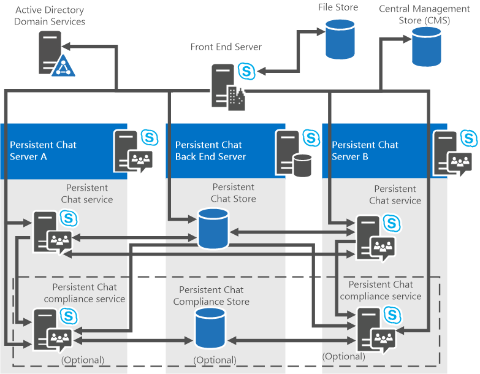

# 常設チャット サーバー トポロジを計画する
 
**概要:** 2015 年の常設チャット サーバー コンポーネントとトポロジの詳細については、このトピックSkype for Business Serverしてください。
  
常設チャット サーバーは、単一サーバー構成と複数サーバー構成の両方をサポートします。 常設チャット サーバーは、2015 年 2015 年Skype for Business Serverサーバー Enterprise EditionインストールStandard Editionできます。 

> [!NOTE] 
> 常設チャットは 2015 Skype for Business Serverで使用できますが、2019 年Skype for Business Serverではサポートされていません。 同じ機能は、Teams。 詳細については、「アップグレードの開始[方法」をMicrosoft Teamsしてください](/microsoftteams/upgrade-start-here)。 常設チャットを使用する必要がある場合は、この機能を必要とするユーザーを Teams に移行するか、2015 年Skype for Business Serverします。 
  
## 常設チャット サーバー コンポーネント

常設チャット サーバーは、次のコンポーネントで構成されます。
  
- 常設チャット サーバーを実行し、次のサービスを提供する 1 つ以上のコンピューター。
    
  - Persistent Chat Service
    
  - コンプライアンスが有効な場合にオンになるコンプライアンス サービス
    
- チャット ルームのコンテンツ、ルーム、カテゴリが格納されている常設チャット コンテンツ データベースをホストする SQL Server のバック エンド データベースを実行する 1 つ以上のサーバー (ミラーリングが使用されている場合は複数)。
    
    > [!NOTE]
    > バック エンド データベースには、作成されたカテゴリや常設チャット ルームに関する情報を含むチャット履歴データが格納されます。 
  
- コンプライアンスが有効な場合、コンプライアンス イベントとコンプライアンスを目的としてチャット コンテンツが格納される常設チャット コンプライアンス データベースをホストする SQL Server のバック エンド データベースを実行する 1 つ以上のサーバー (ミラーリングが使用されている場合は複数)。
    
常設チャット サーバーのハードウェア要件とソフトウェア要件の詳細については[、「Skype for Business Server 2015 のサーバー要件」および「Skype for Business Server 2015](../../plan-your-deployment/requirements-for-your-environment/server-requirements.md)の常設チャット サーバーのハードウェアと[ソフトウェアの要件」を参照](hardware-and-software-requirements.md)してください。 
  
## 常設チャット サーバー のトポロジ

常設チャット サーバーは、単一サーバープールまたは複数サーバー プール、および単一プールトポロジまたは複数プール トポロジで展開できます。 常設チャット サーバーは、次のトポロジをサポートしています。
  
-  Standard Editionフロントエンド サーバー上に常設チャット サーバーが接続されているサーバー
    
-  Standard Edition常設チャット サーバーが別のサーバー上のサーバー
    
-  Enterprise Edition個別のサーバー上に 1 つの常設チャット サーバーがあるサーバー
    
-  Enterprise Edition複数の常設チャット サーバーが別々のサーバー上にあるサーバー
    
常設チャット サーバーは Standard Edition サーバーに展開することもできますが、パフォーマンスとスケールが影響を受け、高可用性はオプションではありません。 したがって、主に概念実証と評価の目的で、Standard Editionサーバーに常設チャットを展開する必要があります。 
  
Skype for Business Server 2015 では、さまざまなコロケーション シナリオがサポートされ、1 つのサーバーで複数のコンポーネントを実行してハードウェア コストを柔軟に節約できます (組織が小さい場合)、または別のサーバーで個々のコンポーネントを実行する (スケーラビリティとパフォーマンスが必要な組織が大きい場合)。 コンポーネントを照合するかどうかを決定する前に、スケーラビリティ要因を考慮する必要があります。 コロケーションのシナリオは、2015 Skype for Business ServerサーバーとEnterprise EditionでStandard Edition異なります。 
  
以下のセクションでは、コロケーションシナリオや、バック エンド データベース サーバーのオプションなど、トポロジの詳細について説明します。 すべてのサーバーの役割とデータベースのコロケーションの詳細については[、「Topology Basics for Skype for Business Server 2015」を参照](../../plan-your-deployment/topology-basics/topology-basics.md)してください。
  
### Standard Editionフロントエンド サーバー上に常設チャット サーバーが接続されているサーバー

このStandard Edition、フロントエンド サーバーで常設チャットを照合できます。 これは、最も簡単で最も基本的な構成です。 CPU、メモリ、ディスク領域など、物理リソースの観点から、既存のフロントエンド サーバーに十分な容量が含まれます。
  
さらに、常設チャット サーバーのバック エンド サーバーと常設チャット コンプライアンス データベース (有効な場合) をローカル SQL Server Expressに関連付けすることもできます。 また、専用インスタンスと一緒に別のSQL Serverを使用する場合も選択できます。 
  
> [!IMPORTANT]
> 最初の常設チャット サーバーがフロント エンド サーバーと同じ場所にある場合は、常設チャット サーバー プールにStandard Editionできません。 必要に応じて、後でサーバーを追加できるよう、最初のサーバーをスタンドアロン インスタンスとしてインストールしてください。 
  
### Standard Edition常設チャット サーバーが別のサーバーにインストールされているサーバー

このStandard Edition、常設チャット サーバーをスタンドアロン インスタンスとしてインストールし、必要に応じて後でサーバーを追加できます。 
  
常設チャット サーバーのバック エンド サーバーと常設チャット コンプライアンス データベース (有効な場合) は、ローカル ネットワーク SQL Server Expressに関連付けできます。 また、専用インスタンスと一緒に別のSQL Serverを使用する場合も選択できます。 
  
### Enterprise Edition単一の常設チャット サーバーを持つサーバー

このEnterprise Edition、常設チャット サーバーを別のコンピューターにインストールする必要があります。 つまり、フロントエンド サーバー上の常設チャット サーバーをEnterprise Editionすることはできません。 この展開では、常設チャット サーバーとコンプライアンス サービス (有効な場合) を実行する別のサーバーが必要です。
  
ただし、常設チャット サーバー SQL Serverのデータベースを、フロントエンド プールのEnterprise Editionできます。
  
> [!NOTE]
> HA DR で AlwaysOn 可用性SQLを使用する場合は、常設チャット サーバー データベースではサポートされません。 
  
常設チャット データベースをバック エンド データベースと照合する場合は、いずれかのデータベースまたはすべてのデータベースに対して SQL Server の 1 つのインスタンスを使用するか、データベースごとに SQL Server の個別のインスタンスを使用できます。
  
> [!IMPORTANT]
> 常設チャット データベースをホストするサーバーは、他のデータベースをホストできます。 ただし、常設チャット データベースを他のデータベースと照合する場合は、少数のユーザーのメッセージを格納する場合、常設チャット データベースに必要なディスク領域が非常に大きくなる可能性があります。 このため、常設チャット データベースをバック エンド データベースと照合することをお勧めしません。 
  
次の図は、コンプライアンスが有効になっている単一の常設チャット サーバーのトポロジのすべてのコンポーネントを示しています (オプション)。
  
**単一サーバー トポロジ**

  
### Enterprise Edition複数の常設チャット サーバーを持つサーバー

このEnterprise Edition、より大きな容量と信頼性を実現するために、複数サーバー トポロジを展開できます。 複数サーバー トポロジは、複数のサーバーが常設チャット サーバーをホストする場合を除き、単一サーバー トポロジと同じであり、より大きな規模に拡大できます。 複数サーバー トポロジには、常設チャット サーバーを実行しているアクティブ なコンピューターを最大 4 台まで含めできます (高可用性と障害復旧の構成では最大 8 台まで許可されますが、アクティブにできるのは 4 台、スタンバイ時の残りの 4 台のみ)。 各サーバーは、4 台のサーバーを持つ常設チャット サーバー プールに接続されている合計 80,000 人の同時ユーザーに対して、最大 20,000 人の同時ユーザーをサポートできます。 常設チャット サーバーを実行している複数のコンピューターは、管理者およびコンプライアンス サービスと同じ Active Directory ドメイン Skype for Business Serverに存在する必要があります。
  
次の図は、常設チャット サーバー、オプションのコンプライアンス サービス、および個別のコンプライアンス データベースを実行している複数のコンピューターを含む、複数サーバー トポロジのすべてのコンポーネントを示しています。
  
**複数のサーバー トポロジ**

  
複数サーバー トポロジでは、サーバー機能をプールできます。 サーバー プールでは、常設チャット サービスはデータを通信および共有します。 たとえば、最初に 1 つの常設チャット サービスに投稿されたチャット履歴は、システム内の任意の常設チャット サービスから利用できます。 1 つの常設チャット サービスを介してアップロードされたファイルには、任意の常設チャット サービスからアクセスできます。 ユーザーは、さまざまな常設チャット サーバー フロント エンド サーバーに接続し、互いに通信できます。 TCP 8011 の既定のポートは、サーバーをサーバー プールに接続し、常設チャット サービスが自身間または管理上の目的で通信するために使用します。
  
たとえば、4 サーバーの常設チャット サーバーの展開では、80,000 人のユーザーが常設チャットに同時にサインインできる場合、負荷はサーバーごとに 20,000 人のユーザーに均等に分散されます。 1 つのサーバーが使用できなくなった場合、そのサーバーに接続しているユーザーは常設チャット サーバーへのアクセスを失います。 切断されたユーザーは、利用できなくなったサーバーが復元されるまでは、残りのサーバーに自動的に転送されます。 
  

