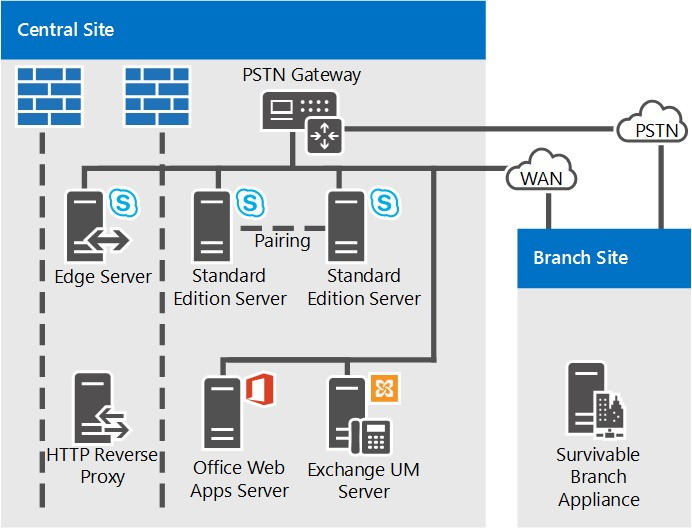

# Skype ビジネス サーバーのトポロジを参照
 
Skype ビジネス サーバー、図など、決定事項、中規模、大規模と小規模な組織のトポロジを参照します。
  
ビジネス サーバー トポロジをするのに最適な Skype は、組織の規模、作業負荷を配置して投資のコストと可用性を高めるための設定によって異なります。 
  
ここでは、3 つの関連トポロジのサンプルについて、各トポロジで考慮される数多くの決定要素の背後にある論拠と併せて説明します。
  
## 小規模な組織向けの関連トポロジ

小規模な組織の関連トポロジは、Skype を実行して、ビジネスのサーバーの 3 つだけのサーバーを展開することにより、堅牢な高可用性ソリューションを展開する方法を示しています。
  
**小規模な組織向けの関連トポロジ**

  
- **Standard Edition サーバーの展開のペア**この組織では、セントラル サイトで 4,000 ユーザーがいます。 2 つの Standard Edition サーバーを展開する、高可用性と災害復旧を実現するためにペアになっています。 各サーバー住宅 2,000 のユーザーがすべてのユーザーに関する情報は、2 つのサーバー間で同期されます。 1 つがダウンした場合、管理者は最小限のユーザーへの影響で、他のサーバーによって提供されるそれらのユーザーをフェールオーバーできます。 ビジネス サーバーの高可用性を実現し、Skype での災害復旧の機能に関する詳細については、[高可用性とビジネスのサーバー用の Skype での災害復旧の計画](../../plan-your-deployment/high-availability-and-disaster-recovery/high-availability-and-disaster-recovery.md)を参照してください。
    
- **エッジ サーバー展開の推奨。** エッジ サーバーの展開は内部 IM、プレゼンス、会議機能に必須ではありませんが、小規模な展開の場合であってもエッジ サーバーを展開することをお勧めします。 現在、組織のファイアウォールの外部のユーザーにサービスを提供するエッジ サーバーを展開することにより、業務サーバへの投資は、Skype を最大限に活用できます。 その利点は次のとおりです。
    
  - アウト、外出中に自宅から作業している場合、組織のユーザーはビジネスのサーバーの機能の Skype を使用できます。
    
  - ユーザーは、外部ユーザーを会議に参加するように招待できます。
    
  - パートナー、仕入先やビジネスのサーバーにも Skype を使用する顧客の組織があれば、その組織とフェデレーションの関係を形成できます。 ビジネス サーバーの展開について、Skype をユーザーがそのフェデレーションの組織では、認識して、共同作業の向上に 。
    
  - ユーザーは一部のパブリック IM サービスとインスタント メッセージのやりとりができます。
    
- **ブランチ サイトの存続性。** この組織によっては、ビジネスのサーバーの Skype のエンタープライズ VoIP 機能のパイロット プログラムが行われています。 一部のユーザーは、唯一の音声ソリューションとしての業務サーバーの Skype を使用しています。 一部のエンタープライズ VoIP パイロット ユーザーは、ブランチ サイトに配置されます。 ブランチ サイトはありません、信頼性の高いワイド エリア ネットワーク (WAN) リンクを中央のサイトでは、リカバリ性に優れたブランチ アプライアンスの展開がありますので。 これが展開されていると、WAN リンクがダウンした場合でも、ブランチ サイトのユーザーは通話 (組織内の通話と PSTN 通話の両方) を発信および受信でき、ボイス メール機能は維持され、2 者間のインスタント メッセージング (IM) で通信できます。 また、WAN リンクが使用不可能なときでも、ユーザーを認証できます。 詳細については、 [Skype のビジネス サーバーでエンタープライズ VoIP の復元の計画](../../plan-your-deployment/enterprise-voice-solution/enterprise-voice-resiliency.md)を参照してください。
    
- **Exchange UM の展開。** この参照トポロジには、Exchange ユニファイド メッセージング (UM) サーバー、Microsoft Exchange Server、ビジネス サーバーの Skype ではありませんを実行するが含まれます。
    
- **Office Web Apps サーバー。**   Web 会議を使用するすべての組織に Office Web Apps サーバーまたは Office Web Apps サーバー ファームを展開することをお勧めします。Office Web Apps サーバーを使用すると、Web 会議で PowerPoint スライドのプレゼンテーションを行うことができます。
    
## 中規模組織向けの関連トポロジ

高可用性および 1 つのデータ センターを持つ関連トポロジは、1 つの中央サイトを擁する小～中規模組織向けに設計されています。次の図における正確なトポロジは、20,000 ユーザーの組織向けです。 
  
**中規模組織向けの関連トポロジ**

  
- **より多くのフロントエンド サーバーを追加することでより多くのユーザーに対応。** この図の正確なトポロジは 3 台のフロントエンド サーバーを擁するので、20,000 ユーザーをサポートします。 1 つの中央サイトおよびより多くのユーザーが存在する場合、単純により多くのフロントエンド サーバーをプールに追加できます。 プールごとの最大ユーザー数は、12 台のフロントエンド サーバーで、80,000 ユーザーです。
    
    ただし、サイトにもう 1 つのフロントエンド プールを追加すると、1 つのサイトのトポロジがさらに多くのユーザーをサポートできます。 
    
- **障害復旧機能を追加可能。** この組織では、ビジネス サーバー サービスは、Skype の高可用性は、必要な機能ですが、災害復旧ではありません。 プール フロント エンド サーバーがそれらを展開しているのでは、高可用性を提供します。
    
    この組織が障害復旧機能を追加する場合は、別のデータセンターを確立し、そこに別のフロントエンド プールを追加して、そのフロントエンド プールを現在のデータセンターにあるフロントエンド プールとペアリングすることを検討します。プライマリ プールに影響を及ぼす障害が発生した場合は、管理者はユーザーをバックアップ プールにフェールオーバーすることができます。
    
- **バック エンド サーバーは、ミラーリング**基本的なユーザー機能の複数の高可用性を提供するには、組織は、各フロント エンド プールのバック エンド サーバーのミラー ・ ペアを導入しました。
    
- **監視サーバー データベースのオプション。** この展開エンタープライズ VoIP 通話の品質を確実に監視し、A/V 会議。 監視機能は各フロントエンド サーバーに展開され、監視データベースはバックエンド サーバーと併置されます。 監視データベースが単独のサーバーに配置されるトポロジもサポートしています。
    
- **エッジ サーバーの高可用性**20,000 名のユーザーにこのサンプル組織で 1 つのエッジ サーバーがパフォーマンスのための十分なでしょう。 ただし、これら 2 つのエッジ トランスポート サーバーの高可用性を提供する展開のプールを導入しています。
    
- **ブランチ サイト展開のオプション。** このトポロジで組織には、エンタープライズ VoIP の音声への解決策として導入があります。 ブランチ サイト 1 必要はありません、弾力性のあるワイド エリア ネットワーク (WAN) リンク中央のサイトでは、多くの Skype ビジネス サーバー機能の場合に、中央サイトへの WAN リンクがダウンを維持するために展開されて、リカバリ性に優れたブランチ アプライアンスがあるためです。 ただし、ブランチ サイト 2 には回復可能な WAN リンクが存在するため、公衆交換電話網 (PSTN) ゲートウェイのみが必要となります。 そこで展開された PSTN ゲートウェイはメディア バイパスをサポートしているため、ブランチ サイト 2 では仲介サーバーが必要ありません。 詳細については、 [Skype のビジネス サーバーでエンタープライズ VoIP の復元の計画](../../plan-your-deployment/enterprise-voice-solution/enterprise-voice-resiliency.md)を参照してください。
    
- **DNS 負荷分散。** フロントエンド プールおよびエッジ サーバー プールには、展開されている SIP トラフィックの DNS 負荷分散機能があります。 この機能によって、ロード バランサー機器は HTTP トラフィックに対してのみ必要となるため、エッジ サーバーにはロード バランサー機器が必要なくなり、その他のプールへのロード バランサー機器のセットアップおよびメンテナンスが非常に少なくなります。 詳細についてを参照してください (../../plan-your-deployment/network-requirements/load-balancing.md#BKMK_DNSLoadBalancing)。
    
- **Exchange UM の展開。** この参照トポロジには、Exchange ユニファイド メッセージング (UM) サーバー、Microsoft Exchange Server、ビジネス サーバーの Skype ではありませんを実行するが含まれます。
    
- **Office Web Apps サーバー。**   Web 会議を使用するすべての組織に Office Web Apps サーバーまたは Office Web Apps サーバー ファームを展開することをお勧めします。Office Web Apps サーバーを使用すると、Web 会議で PowerPoint スライドのプレゼンテーションを行うことができます。
    
- **ディレクターを追加可能。** この組織は、サービス拒否攻撃に対するセキュリティを強化する場合、ディレクターのプールを展開することもできます。 ディレクターは、Skype ビジネス サーバー、ユーザー アカウントのホームまたはプレゼンスまたは会議サービスを提供していないので、省略可能な別のサーバーの役割です。 エッジ サーバーが内部サーバー宛の受信 SIP トラフィックをルーティングする内部次ホップ サーバーとして機能します。 ディレクターは受信要求を事前認証し、ユーザーのホーム プールまたはサーバーにリダイレクトします。 ディレクターでの事前認証により、展開にとって不明なユーザー アカウントからの要求を削除できます。 ディレクターは、サービス拒否 (DoS) 攻撃などの悪意のあるトラフィックからフロント エンド サーバーを隔離することができます。 ネットワークは、このような攻撃での無効な外部トラフィックであふれ、トラフィックをディレクターで終了します。
    
- **System Center Operations Manager をお勧めします。** Skype は、エンド ・ ユーザーに対するサービスの可用性を確保するビジネス サーバーの展開の状態を監視することをお勧めします。 マイクロソフトから無償でダウンロードとして利用可能なビジネス用の Skype は、システム センター オペレーション マネージャーの管理パックを使用できます。 Skype for Business 管理パックを使用すると、問題発生時に予防的にリアルタイム通知を取得したり、代理トランザクションを実行してエンドツーエンドの Skype for Business 機能をテストしたり、サービスの可用性に関するレポートを取得したりできます。 これにより、展開で問題が発生したときに、エンドユーザーが問題に気付く前に対応することができます。
    
## 大規模組織向けの関連トポロジ

複数のデータ センターをサポートする大規模な組織向けの関連トポロジは、規模にかかわらず、複数の中央サイトを備えた組織に適しています。次の図のトポロジは、中央サイト A で 20,000 ユーザー、中央サイト B で 20,000 ユーザー、中央サイト C とブランチ サイトで合計 10,000 ユーザーをサポートする、50,000 ユーザーの組織向けのものです。この図に示されているタイプのトポロジで、任意の数のユーザーを持つ組織に対応できます。
  
他のフロント エンド サーバー プールによって提供される高可用性は、このトポロジは、災害復旧のサポートを追加します。 A と B の中央サイトでフロント エンド プールは、ペアにします。 一方のプールがダウンした場合は、影響を受けるユーザーのサービスを、影響を受けないサイトにあるペアのプールに切り替えることができます。
  
このトポロジを複数の図で示します。最初は概要を示し、次に中央サイトの詳細を示します。
  
**複数のデータ センターを持つ大規模な組織向けの関連トポロジの概要**

  
**大規模な組織向けの関連トポロジ: 中央サイト A の詳細表示**

  
**大規模な組織向けの関連トポロジ: 中央サイト B の詳細表示**

  
**大規模な組織向けの関連トポロジ: 中央サイト C の詳細表示**

  
- **災害復旧を有効にするのには、フロント エンド プールがペアリングされます。** サイト A とサイト B にあるフロント エンド プールを対応するには相互に、災害復旧のサポートを提供します。 1 つのサイトでプールが失敗した場合、管理者は最小限のユーザーのサービスの中断で、他のサイトで 1 組のフロント エンド プールには、そのサイトからのユーザーをフェールオーバーできます。 これら 2 つのフロント エンド プールは 6 台のサーバーでは、フェイル オーバーが発生した場合、両方のプール内のすべての 40,000 ユーザーには十分であります。 詳細については、[高可用性とビジネスのサーバー用の Skype での災害復旧の計画](../../plan-your-deployment/high-availability-and-disaster-recovery/high-availability-and-disaster-recovery.md)を参照してください。 
    
- **バック エンド サーバーは、ミラーリング**基本的なユーザー機能の複数の高可用性を提供するには、組織は、各フロント エンド プールのバック エンド サーバーのミラー ・ ペアを導入しました。 これは省略可能なトポロジであり、代わりに 1 つのバック エンド サーバーを展開することもできます。 SQL クラスタリング グループと AlwaysOn 可用性グループもサポートされています。 詳細については、 [Skype のビジネス サーバーのバック エンド サーバーの高可用性](../../plan-your-deployment/high-availability-and-disaster-recovery/back-end-server.md)を参照してください。
    
- **ブランチ サイトで Standard Edition サーバーを使用しています。** サイト C には 600 の従業員しかいないため、この組織ではサイト C をブランチ サイトと見なしています。 ただし、このサイトのユーザーは、サイト内のユーザー間で多くの音声ビデオ会議を行っています。 それが配置された Skype のブランチ サイトとしてビジネスのサーバーの場合これらの会議用のメディアはサーバーをフロント エンド サーバーを展開しているセントラル サイトとの間ワイド エリア ネットワーク (WAN) 経由で実行します。 この潜在的な帯域幅の負荷を避けるためには、1 組の Standard Edition サーバーをこのサイトでは、これらの会議をホストで、インストールされています。 Standard Edition サーバーがインストールされているため、ビジネス ・ サーバーの定義での Skype であると判断セントラル サイトでは、トポロジ ビルダーおよび計画ツールで次のように扱われます。
    
    十分なパフォーマンスを得るためにここでは、Standard Edition サーバーを 1 つだけになりますが、組織が 2 つを展開し、ペアにそれらを組み合わせて 1 つのサーバー障害が発生した場合に、高可用性を提供します。
    
    サイト C は中央サイトと見なされますが、このサイトにエッジ サーバーを展開する必要はありません。この例では、サイト C では、サイト A に展開されているエッジ サーバーを使用します。
    
- **監視およびアーカイブ**この組織には、監視とアーカイブの両方を導入しました。 監視またはアーカイブを展開すると、すべてのフロント エンド サーバーで実行されます。 これらの機能のデータベースをバック エンド データベースと同じ場所にまたは別のサーバー上にあることができます。 この組織はバック エンド サーバーから中央サイト B で別のサーバーにこれらのデータベースを配置するにはここでは、データベースでは、すべてのサイトのフロント エンド サーバーから監視およびアーカイブ ・ データが表示されます。
    
- **ブランチ サイト展開のオプション。** この組織には、実際には、詳細な図で表示されるは 2 つだけ、50 以上のブランチ サイトがあります。 ブランチ サイト 1 には、セントラル サイトへのリンクのため、電話サービス場合に、中央サイトへの WAN リンクがダウンして展開されたブランチ アプライアンスのリカバリ性に優れた弾力性のある WAN がありません。 ブランチ サイト 2 では、公衆交換電話網 (PSTN) ゲートウェイのみが必要があるため、弾力性のある WAN リンクでは、ただしが。 そこで展開された PSTN ゲートウェイはメディア バイパスをサポートしているため、ブランチ サイト 2 では仲介サーバーが必要ありません。 支店サイトにあるインストール内容を決定する詳細については、 [Skype のビジネス サーバーでエンタープライズ VoIP の復元の計画](../../plan-your-deployment/enterprise-voice-solution/enterprise-voice-resiliency.md)を参照してください。
    
- **SIP トランキングと仲介サーバー。** 中央サイト B では、仲介サーバーはフロントエンド サーバーと併置されません。 これは、SIP トランキングを使用するサイトには、スタンドアロンの仲介サーバーが推奨されるためです。 その他のほとんどのインスタンスでは、仲介サーバーをフロントエンド サーバーと併置することが推奨されます。 仲介サーバー トポロジの詳細については、計画ドキュメントの[コンポーネントと仲介サーバーのトポロジ](http://technet.microsoft.com/library/71397168-36c3-4d21-b8ef-db6a751634ee.aspx)を参照してください。
    
- **常設チャットが展開されている。** この組織は、常設チャットを有効にするために必要なサーバーを展開しています。 まず、プール内のユーザーの負荷に対処し、高可用性を実現するために、複数の常設チャット フロントエンド サーバーを展開しています。 また、常設チャットのコンプライアンスを展開し、常設チャット ストアと常設チャット コンプライアンス ストアを別々のサーバーに配置しています。 これらのストアを併置することも、これらをバックエンド サーバーと併置することもできますが、この組織では、パフォーマンスを高めるためにこれらを分離しています。

    > [!NOTE] 
    > 永続的なチャットですがビジネス サーバー 2015 の Skype で利用可能なビジネス サーバー 2019 の Skype でサポートされていません。 同じ機能は、チームで使用できます。 詳細については、[マイクロソフトのチームにビジネス用の Skype からの旅](/microsoftteams/journey-skypeforbusiness-teams)を参照してください。 永続的なチャットを使用する場合は、選択肢は、いずれかをチームでは、この機能を必要とするユーザーを移行するまたはビジネス サーバー 2015 の Skype を使用し続ける。 
    
- **DNS 負荷分散。** フロントエンド プールとエッジ サーバー プールで DNS 負荷分散を使用します。 これにより、エッジ サーバーの内部インターフェイス用のハードウェア ロード バランサーが不要になり、ハードウェア ロード バランサーは HTTP トラフィックにのみ必要になるため、他のプールのハードウェア ロード バランサーのセットアップと保守にかかる時間が大幅に削減されます。 詳細についてを参照してください (../../plan-your-deployment/network-requirements/load-balancing.md#BKMK_DNSLoadBalancing)。
    
- **Exchange UM の展開。** Skype ビジネス サーバーは、Exchange ユニファイド メッセージング (UM) の両方の設置型展開で動作し、Exchange UM のホストです。 中央サイト A では、Exchange ユニファイド メッセージング (UM) サーバー、Microsoft Exchange Server、ビジネス サーバーの Skype ではありませんを実行するが含まれます。 Skype ビジネス サーバー用の Exchange UM の機能は、フロント エンド プール上で実行されます。
    
    中央サイト B では Hosted Exchange が使用されているため、Exchange UM サーバー機能もホストされています。 
    
    Exchange UM の詳細については、計画のドキュメントで[、オンプレミス Exchange ユニファイド メッセージングの統合](http://technet.microsoft.com/library/e7c63a71-2d99-4aa9-b649-36c1a431bdf1.aspx)および[ホストされている Exchange ユニファイド メッセージングの統合](http://technet.microsoft.com/library/f4de0165-da3b-499e-98fc-28ddd0db02d5.aspx)を参照してください。
    
- **Office Web Apps サーバー。** Web 会議を使用するすべての組織に Office Web Apps サーバーまたは Office Web Apps サーバー ファームを展開することをお勧めします。 すべてのサイトからのトラフィックを使用する 1 つのサイト内の 1 つの Office Web アプリケーションのサーバー ファームを展開するまたは各サイトに展開できます。 Office Web Apps サーバーを使用すると、Web 会議で PowerPoint スライドのプレゼンテーションを行うことができます。 
    
- **ディレクターを追加可能。** この組織では、サービス拒否攻撃に対するセキュリティを強化するためにディレクターのプールを展開することもできます。 ディレクターは、Skype ビジネス サーバー、ユーザー アカウントのホームまたはプレゼンスまたは会議サービスを提供していないので、省略可能な別のサーバーの役割です。 エッジ サーバーが内部サーバー宛の受信 SIP トラフィックをルーティングする内部次ホップ サーバーとして機能します。 ディレクターは受信要求を事前認証し、ユーザーのホーム プールまたはサーバーにリダイレクトします。 ディレクターでの事前認証により、展開にとって不明なユーザー アカウントからの要求を削除できます。 ディレクターは、サービス拒否 (DoS) 攻撃などの悪意のあるトラフィックからフロント エンド サーバーを隔離することができます。 ネットワークは、このような攻撃での無効な外部トラフィックであふれ、トラフィックをディレクターで終了します。
    
- **System Center Operations Manager をお勧めします。** Skype は、エンド ・ ユーザーに対するサービスの可用性を確保するビジネス サーバーの展開の状態を監視することをお勧めします。 マイクロソフトから無償でダウンロードとして利用可能なビジネス用の Skype は、システム センター オペレーション マネージャーの管理パックを使用できます。 Skype for Business 管理パックを使用すると、問題発生時に予防的にリアルタイム通知を取得したり、代理トランザクションを実行してエンドツーエンドの Skype for Business 機能をテストしたり、サービスの可用性に関するレポートを取得したりできます。 これにより、展開で問題が発生したときに、エンドユーザーが問題に気付く前に対応することができます。
    

