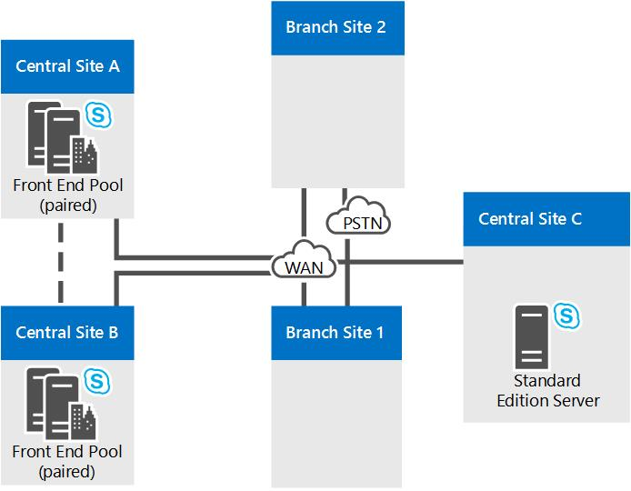

# Skype for Business Server のリファレンストポロジReference topologies for Skype for Business Server

大規模、中、小規模の組織に適した図や決定事項など、Skype for Business Server のリファレンストポロジ。Reference topologies for Skype for Business Server, including diagrams and decisions to make for large, medium, and small organizations.

最適な Skype for Business Server のトポロジは、組織の規模、展開するワークロード、および高可用性と投資コストの優先順位によって異なります。The best Skype for Business Server topology for you depends on your organization's size, the workloads you want to deploy, and your preferences for high availability versus cost of investment.

ここでは、3 つの関連トポロジのサンプルについて、各トポロジで考慮される数多くの決定要素の背後にある論拠と併せて説明します。This section outlines three sample reference topologies, including the reasoning behind many of the decisions that factored into each topology.

## 小規模な組織向けの関連トポロジReference topology for a small organization

小規模組織向けのリファレンストポロジは、Skype for Business Server を実行している3台のサーバーのみを展開することで、堅牢で可用性の高いソリューションを展開する方法を示しています。The reference topology for small organizations shows how you can deploy a robust, highly available solution by deploying only three servers running Skype for Business Server.

**小規模な組織向けの関連トポロジ****Reference topology for small organizations**

- **展開された Standard Edition サーバーのペア**この組織には、中央サイトの4000ユーザーがいます。**Pair of Standard Edition Servers Deployed** This organization has 4,000 users at their central site. 2つの標準エディションのサーバーを展開し、それらを組み合わせて、高可用性と障害回復を実現しています。They have deployed two Standard Edition servers and paired them together to enable high availability and disaster recovery. Each server homes 2,000 users, but information about all users is synchronized between the two servers.Each server homes 2,000 users, but information about all users is synchronized between the two servers. If one goes down, an administrator can fail over those users to be served by the other server, with a minimum of disruption to users.If one goes down, an administrator can fail over those users to be served by the other server, with a minimum of disruption to users. Skype for Business Server の高可用性機能と障害回復機能の詳細については、「 [skype For Business server で高可用性と障害回復を計画する](../../plan-your-deployment/high-availability-and-disaster-recovery/high-availability-and-disaster-recovery.md)」を参照してください。For more information about high availability and disaster recovery features in Skype for Business Server, see [Plan for high availability and disaster recovery in Skype for Business Server](../../plan-your-deployment/high-availability-and-disaster-recovery/high-availability-and-disaster-recovery.md).

- **エッジ サーバー展開の推奨。****Edge Server deployment is recommended.** エッジ サーバーの展開は内部 IM、プレゼンス、会議機能に必須ではありませんが、小規模な展開の場合であってもエッジ サーバーを展開することをお勧めします。Although deploying an Edge Server is not required for internal IM, presence and conferencing, we recommend it even for small deployments. 組織のファイアウォール外のユーザーにサービスを提供するために、エッジサーバーを展開することで、Skype for Business Server への投資を最大限に活用できます。You can maximize your Skype for Business Server investment by deploying an Edge Server to provide service to users currently outside your organization's firewalls. その利点は次のとおりです。The benefits include the following:

  - 組織の独自のユーザーは、自宅で作業しているか、外出先である場合でも、Skype for Business Server 機能を使うことができます。Your organization's own users can use Skype for Business Server functionality, if they are working from home or are out on the road.

  - ユーザーは、外部ユーザーを会議に参加するように招待できます。Your users can invite outside users to participate in meetings.

  - パートナー、ベンダー、またはユーザーの組織が Skype for Business Server も使用している場合は、その組織とフェデレーション関係を形成できます。If you have a partner, vendor or customer organization that also uses Skype for Business Server, you can form a federated relationship with that organization. Skype for Business Server の展開では、フェデレーションされた組織のユーザーが認識されるため、共同作業がより効率的になります。Your Skype for Business Server deployment would then recognize users from that federated organization, leading to better collaboration.

  - ユーザーは一部のパブリック IM サービスとインスタント メッセージのやりとりができます。Your users can exchange instant messages with users of some public IM services.

- **ブランチ サイトの存続性。****Branch site survivability.** この組織は、Skype for Business Server のエンタープライズ Voip 機能のパイロットプログラムを実行しています。This organization is running a pilot program of the Enterprise Voice feature of Skype for Business Server. 一部のユーザーは、単独の音声ソリューションとして Skype for Business Server を使用しています。Some users are using Skype for Business Server as their sole voice solution. 一部のエンタープライズボイスパイロットユーザーは、ブランチサイトにあります。Some of these Enterprise Voice pilot users are located at the branch site. ブランチサイトには、セントラルサイトへの信頼性の高い広域ネットワーク (WAN) リンクがありません。したがって、Survivable Branch Appliance がそこに展開されます。The branch site does not have a reliable wide area network (WAN) link to the central site, so a Survivable Branch Appliance is deployed there. これが展開されていると、WAN リンクがダウンした場合でも、ブランチ サイトのユーザーは通話 (組織内の通話と PSTN 通話の両方) を発信および受信でき、ボイス メール機能は維持され、2 者間のインスタント メッセージング (IM) で通信できます。With this deployed, if the WAN link goes down, users at the branch site can still make and receive calls (both calls within the organization and PSTN calls), have voice mail functionality, and communicate with two-party instant messaging (IM). また、WAN リンクが使用不可能なときでも、ユーザーを認証できます。Users can also be authenticated when the WAN link is unavailable as well. 詳細については、「[Plan for Enterprise Voice resiliency in Skype for Business Server](../../plan-your-deployment/enterprise-voice-solution/enterprise-voice-resiliency.md)」を参照してください。For more information, see [Plan for Enterprise Voice resiliency in Skype for Business Server](../../plan-your-deployment/enterprise-voice-solution/enterprise-voice-resiliency.md).

- **Exchange UM の展開。****Exchange UM deployment.** この参照トポロジには、Skype for Business Server ではなく Microsoft Exchange Server を実行する Exchange ユニファイドメッセージング (UM) サーバーが含まれています。This reference topology includes an Exchange Unified Messaging (UM) Server, which runs Microsoft Exchange Server, not Skype for Business Server.

- **Office Web Apps サーバー。**   Web 会議を使用するすべての組織に Office Web Apps サーバーまたは Office Web Apps サーバー ファームを展開することをお勧めします。Office Web Apps サーバーを使用すると、Web 会議で PowerPoint スライドのプレゼンテーションを行うことができます。**Office Web Apps Server.** We recommend deploying an Office Web Apps Server or Office Web Apps Server farm in every organization that uses web conferencing. Office Web Apps Server makes it possible for PowerPoint slides to be presented in web conferences..

## 中規模組織向けの関連トポロジReference topology for a medium organization

高可用性および 1 つのデータ センターを持つ関連トポロジは、1 つの中央サイトを擁する小～中規模組織向けに設計されています。次の図における正確なトポロジは、20,000 ユーザーの組織向けです。The reference topology with high availability and a single data center is designed for a small-to-medium size organization with one central site. The exact topology in the following diagram is for an organization of 20,000 users.

**中規模組織向けの関連トポロジ****Reference topology for medium organizations**

- **より多くのフロントエンド サーバーを追加することでより多くのユーザーに対応。****Accommodate more users by adding more Front End Servers.** この図の正確なトポロジは 3 台のフロントエンド サーバーを擁するので、20,000 ユーザーをサポートします。The exact topology in this diagram has three Front End Servers to provide support for 20,000 users. 1 つの中央サイトおよびより多くのユーザーが存在する場合、単純により多くのフロントエンド サーバーをプールに追加できます。If you have a single central site and more users, you can simply add more Front End Servers to the pool. プールごとの最大ユーザー数は、12 台のフロントエンド サーバーで、80,000 ユーザーです。The maximum number of users per pool is 80,000, with twelve Front End Servers.

    ただし、サイトにもう 1 つのフロントエンド プールを追加すると、1 つのサイトのトポロジがさらに多くのユーザーをサポートできます。However, the single site topology can support even more users by adding another Front End pool to the site.

- **障害復旧機能を追加可能。****Disaster Recovery could be added.** この組織では、Skype for Business Server サービスの高可用性機能が必要ですが、障害回復機能はありません。For this organization, high availability for their Skype for Business Server services is a necessary feature, but disaster recovery is not. 展開されたフロントエンドサーバーのプールは、高可用性を実現します。The pool of Front End Servers they have deployed provides high availability.

    この組織が障害復旧機能を追加する場合は、別のデータセンターを確立し、そこに別のフロントエンド プールを追加して、そのフロントエンド プールを現在のデータセンターにあるフロントエンド プールとペアリングすることを検討します。プライマリ プールに影響を及ぼす障害が発生した場合は、管理者はユーザーをバックアップ プールにフェールオーバーすることができます。If they wanted to add disaster recovery ability, they could consider establishing another datacenter and adding another Front End pool there, and pairing it with the Front End pool in their current datacenter. Then, if there was a disaster affecting their primary pool, the administrators could fail over users to the backup pool.

- **バックエンドサーバーがミラーリングされている**基本的なユーザー機能の高可用性を実現するために、組織では、フロントエンドプールごとにバックエンドサーバーのミラーペアを展開しています。**Back End Servers are mirrored** To provide more high availability for basic user features, the organization has deployed a mirrored pair of Back End Servers for each Front End pool.

- **監視サーバー データベースのオプション。****Monitoring Server database options.** この組織は、エンタープライズ音声通話と A/V 会議の品質を確保するために、監視機能を導入しています。This organization has deployed Monitoring to ensure the quality of Enterprise Voice calls and A/V conferences. 監視機能は各フロントエンド サーバーに展開され、監視データベースはバックエンド サーバーと併置されます。Monitoring is deployed on every Front End Server, and the Monitoring database is collocated with the Back End Servers. 監視データベースが単独のサーバーに配置されるトポロジもサポートしています。We also support topologies in which the Monitoring database is located on a separate server.

- **エッジサーバーの高可用性**この例の組織では、2万を使用していますが、パフォーマンスを向上させるには、1つのエッジサーバーだけで十分です。**Edge Server high availability** In this example organization with 20,000 users, just one Edge Server would be sufficient for performance. ただし、高可用性を実現するために展開された2つのエッジサーバーのプールを展開しています。However, they have deployed a pool of two Edge Servers deployed to provide high availability.

- **ブランチ サイト展開のオプション。****Branch site deployment options.** このトポロジの組織は、ボイスソリューションとしてエンタープライズ Voip を展開しています。The organization in this topology has Enterprise Voice deployed as their voice solution. ブランチサイト1には、セントラルサイトへの弾力性のあるワイドエリアネットワーク (WAN) リンクがありません。そのため、セントラルサイトへの WAN リンクがダウンした場合に備えて、多くの Skype for Business Server 機能を維持するために展開された Survivable Branch Appliance が導入されています。Branch Site 1 does not have a resilient wide area network (WAN) link to the central site, so it has a Survivable Branch Appliance deployed to maintain many Skype for Business Server features in case the WAN link to the central site goes down. ただし、ブランチ サイト 2 には回復可能な WAN リンクが存在するため、公衆交換電話網 (PSTN) ゲートウェイのみが必要となります。Branch Site 2 however has a resilient WAN link, so only a public switched telephone network (PSTN) gateway is needed. そこで展開された PSTN ゲートウェイはメディア バイパスをサポートしているため、ブランチ サイト 2 では仲介サーバーが必要ありません。The PSTN gateway deployed there supports media bypass, so no Mediation Server is needed at Branch Site 2. 詳細については、「[Plan for Enterprise Voice resiliency in Skype for Business Server](../../plan-your-deployment/enterprise-voice-solution/enterprise-voice-resiliency.md)」を参照してください。For more information, see [Plan for Enterprise Voice resiliency in Skype for Business Server](../../plan-your-deployment/enterprise-voice-solution/enterprise-voice-resiliency.md).

- **DNS 負荷分散。****DNS load balancing.** フロントエンド プールおよびエッジ サーバー プールには、展開されている SIP トラフィックの DNS 負荷分散機能があります。The Front End pool and Edge Server pool, have DNS load balancing for SIP traffic deployed. この機能によって、ロード バランサー機器は HTTP トラフィックに対してのみ必要となるため、エッジ サーバーにはロード バランサー機器が必要なくなり、その他のプールへのロード バランサー機器のセットアップおよびメンテナンスが非常に少なくなります。This eliminates the need for hardware load balancers for the Edge Servers, and significantly lessens the setup and maintenance of the hardware load balancers for the other pools, as the hardware load balancers are needed only for HTTP traffic. 詳細については、「 [DNS の負荷分散](../../plan-your-deployment/network-requirements/load-balancing.md#BKMK_DNSLoadBalancing)」を参照してください。For more information, see [DNS load balancing](../../plan-your-deployment/network-requirements/load-balancing.md#BKMK_DNSLoadBalancing).

- **Exchange UM の展開。****Exchange UM deployment.** この参照トポロジには、Skype for Business Server ではなく Microsoft Exchange Server を実行する Exchange ユニファイドメッセージング (UM) サーバーが含まれています。This reference topology includes an Exchange Unified Messaging (UM) Server, which runs Microsoft Exchange Server, not Skype for Business Server.

- **Office Web Apps サーバー。**   Web 会議を使用するすべての組織に Office Web Apps サーバーまたは Office Web Apps サーバー ファームを展開することをお勧めします。Office Web Apps サーバーを使用すると、Web 会議で PowerPoint スライドのプレゼンテーションを行うことができます。**Office Web Apps Server.** We recommend deploying an Office Web Apps Server or Office Web Apps Server farm in every organization that uses web conferencing. Office Web Apps Server makes it possible for Powerpoint slides to be presented in web conferences.

- **ディレクターを追加可能。****Directors could be added.** この組織は、サービス拒否攻撃に対するセキュリティを強化する場合、ディレクターのプールを展開することもできます。If this organization wanted to help to increase security against denial of service attacks, it could also deploy a pool of Directors. ディレクターは、Skype for Business Server で、ユーザーアカウントを持たない、またはプレゼンスや会議サービスを提供する、個別のオプションのサーバーの役割です。A Director is a separate, optional server role in Skype for Business Server that does not home user accounts, or provide presence or conferencing services. これは、内部サーバーに向けて、エッジサーバーが受信 SIP トラフィックをルーティングする、内部の次ホップサーバーとして機能します。It serves as an internal next hop server to which an Edge Server routes inbound SIP traffic destined for internal servers. ディレクターは受信要求を事前に認証し、ユーザーのホームプールまたはサーバーにリダイレクトします。The Director pre-authenticates inbound requests and redirects them to the user's home pool or server. ディレクターでの事前認証により、展開にとって不明なユーザー アカウントからの要求を削除できます。Pre-authentication at the Director allows for dropping of requests from user accounts unknown to the deployment. ディレクターは、サービス拒否 (DoS) 攻撃などの悪意のあるトラフィックからフロントエンドサーバーを分離するのに役立ちます。A Director helps insulate Front End Servers from malicious traffic such as denial-of-service (DoS) attacks. このような攻撃で無効な外部トラフィックがネットワークにあふれている場合、トラフィックはディレクターで終了します。If the network is flooded with invalid external traffic in such an attack, the traffic ends at the Director.

- **System Center Operations Manager をお勧めします。****System Center Operations Manager is recommended.** Skype for Business Server 展開の正常性を監視して、エンドユーザーがサービスを利用できるようにすることをお勧めします。We recommend that you monitor the health of your Skype for Business Server deployment to help ensure service availability for end-users. Skype for Business の System Center Operations Manager 管理パックを使用すると、Microsoft から無料でダウンロードできます。You can use the System Center Operations Manager Management Pack for Skype for Business that is available as a free download from Microsoft. With the Skype for Business Management Pack, you can proactively get real-time alerts when issues occur, run synthetic transactions to test end-to-end Skype for Business functionality, get reports for service availability, and so on.With the Skype for Business Management Pack, you can proactively get real-time alerts when issues occur, run synthetic transactions to test end-to-end Skype for Business functionality, get reports for service availability, and so on. これにより、展開で問題が発生したときに、エンドユーザーが問題に気付く前に対応することができます。This helps you to proactively respond to issues with your deployment before end-users experience them.

## 大規模組織向けの関連トポロジReference topology for a large organization

複数のデータ センターをサポートする大規模な組織向けの関連トポロジは、規模にかかわらず、複数の中央サイトを備えた組織に適しています。次の図のトポロジは、中央サイト A で 20,000 ユーザー、中央サイト B で 20,000 ユーザー、中央サイト C とブランチ サイトで合計 10,000 ユーザーをサポートする、50,000 ユーザーの組織向けのものです。この図に示されているタイプのトポロジで、任意の数のユーザーを持つ組織に対応できます。The reference topology for a large organization with multiple data centers support is for any size of organization with more than one central site. The exact topology in the following diagram is for an organization of 50,000 users, with 20,000 users at Central Site A, 20,000 at Central Site B. and a total of 10,000 at Central Site C and branch sites. The type of topology shown in this diagram can accommodate organizations with any number of users.

フロントエンドサーバーのプールによって提供される高可用性に加えて、このトポロジは災害回復サポートを追加します。In addition to the high availability provided by pools of Front End Servers, this topology adds disaster recovery support. セントラルサイト A と B のフロントエンドプールは互いにペアリングされています。The Front End pools at Central Sites A and B are paired together. 一方のプールがダウンした場合は、影響を受けるユーザーのサービスを、影響を受けないサイトにあるペアのプールに切り替えることができます。If one of these pools goes down, the administrator can shift the services for the affected users to the paired pool at the unaffected site.

このトポロジを複数の図で示します。最初は概要を示し、次に中央サイトの詳細を示します。This topology is shown in multiple diagrams, with an overview first followed by detailed views of the central sites.

**複数のデータ センターを持つ大規模な組織向けの関連トポロジの概要****Overview of the reference topology for large organizations with multiple data centers**

**大規模な組織向けの関連トポロジ: 中央サイト A の詳細表示****Reference topology for large organizations: Detailed view of Central Site A**

**大規模な組織向けの関連トポロジ: 中央サイト B の詳細表示****Reference topology for large organizations: Detailed view of Central Site B**

**大規模な組織向けの関連トポロジ: 中央サイト C の詳細表示****Reference topology for large organizations: Detailed view of Central Site C**

- **フロントエンドプールは、障害回復を可能にするためにペアリングされています。****Front End pools Are Paired to Enable Disaster Recovery.** サイト A とサイト B のフロントエンドプールは互いにペアリングされ、障害回復のサポートを提供します。The Front End pools at Site A and Site B are paired with each other, to provide disaster recovery support. 1つのサイトのプールで障害が発生した場合、管理者は、そのサイトのユーザーを他のサイトのペアリングされたフロントエンドプールにフェールオーバーすることができます。これにより、ユーザーのサービスが最小限に抑えられます。If the pool at one site fails, the administrator can fail over the users from that site to the paired Front End pool at the other site, with a minimum of service interruption for users. Each of these two Front End pools has six servers, which is enough for all 40,000 users in both pools in case of failover.Each of these two Front End pools has six servers, which is enough for all 40,000 users in both pools in case of failover. 詳細については、「 [Skype For Business Server で高可用性と障害回復を計画する](../../plan-your-deployment/high-availability-and-disaster-recovery/high-availability-and-disaster-recovery.md)」を参照してください。For more information, see [Plan for high availability and disaster recovery in Skype for Business Server](../../plan-your-deployment/high-availability-and-disaster-recovery/high-availability-and-disaster-recovery.md).

- **バックエンドサーバーがミラーリングされている**基本的なユーザー機能の高可用性を実現するために、組織では、フロントエンドプールごとにバックエンドサーバーのミラーペアを展開しています。**Back End Servers are mirrored** To provide more high availability for basic user features, the organization has deployed a mirrored pair of Back End Servers for each Front End pool. これはオプションのトポロジであり、代わりに1つのバックエンドサーバーを展開することを選択できます。This is an optional topology, and you could choose to deploy a single Back End Server instead. SQL clustering and AlwaysOn Availability groups are also supported.SQL clustering and AlwaysOn Availability groups are also supported. For more information, see [Back End Server high availability in Skype for Business Server](../../plan-your-deployment/high-availability-and-disaster-recovery/back-end-server.md).For more information, see [Back End Server high availability in Skype for Business Server](../../plan-your-deployment/high-availability-and-disaster-recovery/back-end-server.md).

- **ブランチサイトで Standard Edition サーバーを使用している。****Using Standard Edition server at a branch site.** This organization considers Site C as a branch site because it has only 600 employees.This organization considers Site C as a branch site because it has only 600 employees. However, the users there have many A/V conferences among themselves.However, the users there have many A/V conferences among themselves. ブランチサイトとして Skype for Business Server に展開された場合、これらの会議のメディアは、ワイドエリアネットワーク (WAN) で、フロントエンドサーバーが展開されているセントラルサイトとの間で動作します。If it was deployed in Skype for Business Server as a branch site, the media for these conferences would run across the wide area network (WAN) to and from a central site that has a Front End Server deployed. このような帯域幅の負荷を回避するために、このサイトには標準 Edition サーバーのペアをインストールします。これにより、これらの会議が開催されます。To avoid this potential bandwidth load, they have installed a pair of Standard Edition servers at this site, which will host these conferences. また、標準エディションのサーバーがインストールされているため、Skype for Business Server はセントラルサイトとして扱われ、これはトポロジビルダーと計画ツールでも扱っています。And because Standard Edition servers are installed there, Skype for Business Server by definition considers it a central site, and it is treated as such in Topology Builder and the Planning Tool.

    ここでは、1つの Standard Edition サーバーだけでパフォーマンスを向上させることができますが、1つのサーバーがダウンした場合に備えて、組織が2つを組み合わせて、高い可用性を実現しています。Just one Standard Edition server would be enough for performance here, but the organization has deployed two and paired them together to provide high availability in case one server goes down.

    サイト C は中央サイトと見なされますが、このサイトにエッジ サーバーを展開する必要はありません。この例では、サイト C では、サイト A に展開されているエッジ サーバーを使用します。Although Site C is considered a central site, you do not have to deploy Edge Servers there. In this example, Site C will use the Edge Servers deployed at Site A.

- **監視とアーカイブ**この組織は、監視とアーカイブの両方を展開しています。**Monitoring and Archiving** This organization has deployed both Monitoring and Archiving. 監視またはアーカイブを展開すると、すべてのフロントエンドサーバー上で実行されます。When you deploy Monitoring or Archiving, it runs on every Front End Server. これらの機能のデータベースは、バックエンドデータベースに、または別のサーバー上に配置することができます。The databases for these features can be collocated with the Back End Database, or located on a separate server. この組織は、中央サイト B のバックエンドサーバーとは別のサーバー上にこれらのデータベースを配置しています。ここでは、すべてのサイトのフロントエンドサーバーから監視およびアーカイブデータを取得するデータベースについて説明します。This organization has located these databases on a server separate from the Back End Servers, in Central Site B. The databases here receive Monitoring and Archiving data from the Front End Servers in all sites.

- **ブランチ サイト展開のオプション。****Branch site deployment options.** この組織は、実際には50を超えるブランチサイトを使用しています。そのうちの2つのみが、詳細図面に表示されます。This organization actually has over 50 branch sites, only two of which are shown in the detailed diagrams. ブランチサイト1には、セントラルサイトへの回復性のある WAN リンクはありません。そのため、セントラルサイトへの WAN リンクがダウンした場合に備えて、電話サービスを提供するために Survivable Branch アプライアンスを展開しています。Branch Site 1 does not have a resilient WAN link to the central site, so they have Survivable Branch Appliances deployed to provide telephone service in case the WAN link to the central site goes down. ただし、ブランチサイト2には回復できる WAN リンクがあります。そのため、公衆交換電話網 (PSTN) ゲートウェイしか必要ありません。Branch Site 2 however has a resilient WAN link, so it needs only a public switched telephone network (PSTN) gateway. そこで展開された PSTN ゲートウェイはメディア バイパスをサポートしているため、ブランチ サイト 2 では仲介サーバーが必要ありません。The PSTN gateway deployed there supports media bypass, so no Mediation Server is needed at Branch Site 2. ブランチサイトにインストールするものを決定する方法について詳しくは、「 [Skype For Business Server でのエンタープライズボイスの回復性の計画](../../plan-your-deployment/enterprise-voice-solution/enterprise-voice-resiliency.md)」をご覧ください。For details about deciding what to install at a branch site, see [Plan for Enterprise Voice resiliency in Skype for Business Server](../../plan-your-deployment/enterprise-voice-solution/enterprise-voice-resiliency.md).

- **SIP トランキングと仲介サーバー。****SIP trunking and Mediation Server.** 中央サイト B では、仲介サーバーはフロントエンド サーバーと併置されません。Notice that at Central Site B, Mediation Server is not collocated with the Front End Servers. これは、SIP トランキングを使用するサイトには、スタンドアロンの仲介サーバーが推奨されるためです。This is because stand-alone Mediation Server is recommended for sites that use SIP trunking. その他のほとんどのインスタンスでは、仲介サーバーをフロントエンド サーバーと併置することが推奨されます。In most other instances, we recommend you collocate Mediation Server with Front End Server. 仲介サーバーのトポロジの詳細については、「計画」ドキュメントの「[Components and Topologies for Mediation Server](https://technet.microsoft.com/library/71397168-36c3-4d21-b8ef-db6a751634ee.aspx)」を参照してください。For details about Mediation Server topologies, see [Components and Topologies for Mediation Server](https://technet.microsoft.com/library/71397168-36c3-4d21-b8ef-db6a751634ee.aspx) in the Planning documentation.

- **常設チャットが展開されている。****Persistent Chat is Deployed.** この組織は、常設チャットを有効にするために必要なサーバーを展開しています。This organization has deployed the servers necessary to enable Persistent Chat. まず、プール内のユーザーの負荷に対処し、高可用性を実現するために、複数の常設チャット フロントエンド サーバーを展開しています。It has deployed multiple Persistent Chat Front End Servers to both handle the load for the number of users in the pool, and to provide high availability. また、常設チャットのコンプライアンスを展開し、常設チャット ストアと常設チャット コンプライアンス ストアを別々のサーバーに配置しています。It has also deployed Compliance for Persistent Chat, and located the Persistent Chat Store and the Persistent Chat Compliance Store on separate servers. これらのストアを併置することも、これらをバックエンド サーバーと併置することもできますが、この組織では、パフォーマンスを高めるためにこれらを分離しています。These stores could be collocated, and can even be collocated with the Back End Server, but this organization has chosen to separate them to provide better performance.

    > [!NOTE]
    > 常設チャットは Skype for Business Server 2015 で使用できますが、Skype for Business Server 2019 ではサポートされなくなりました。Persistent chat is available in Skype for Business Server 2015 but is no longer supported in Skype for Business Server 2019. Teams でも同じ機能を使用できます。The same functionality is available in Teams. 詳細については、「 [Microsoft Teams のアップグレードの](/microsoftteams/upgrade-start-here)概要」を参照してください。For more information, see [Getting started with your Microsoft Teams upgrade](/microsoftteams/upgrade-start-here). 常設チャットを使用する必要がある場合は、この機能が必要なユーザーをチームに移行するか、Skype for Business Server 2015 を使い続けるかのいずれかを選択できます。If you need to use Persistent chat, your choices are to either migrate users requiring this functionality to Teams, or to continue using Skype for Business Server 2015.

- **DNS 負荷分散。****DNS load balancing.** フロントエンド プールとエッジ サーバー プールで DNS 負荷分散を使用します。The Front End pool and Edge Server pool use DNS load balancing. これにより、エッジ サーバーの内部インターフェイス用のハードウェア ロード バランサーが不要になり、ハードウェア ロード バランサーは HTTP トラフィックにのみ必要になるため、他のプールのハードウェア ロード バランサーのセットアップと保守にかかる時間が大幅に削減されます。This eliminates the need for hardware load balancers for the internal interface of the Edge Servers, and significantly decreases the amount of time you have to spend on the setup and maintenance of the hardware load balancers for the other pools, as the hardware load balancers are needed only for HTTP traffic. 詳細については、「(..」を参照してください。/../plan-your-deployment/network-requirements/load-balancing.md#BKMK_DNSLoadBalancing).For more information, see (../../plan-your-deployment/network-requirements/load-balancing.md#BKMK_DNSLoadBalancing).

- **Exchange UM の展開。****Exchange UM deployment.** Skype for Business Server は、Exchange ユニファイドメッセージング (UM) とホストされた Exchange UM の両方のオンプレミス展開に対応しています。Skype for Business Server works with both on-premises deployments of Exchange Unified Messaging (UM) and hosted Exchange UM. セントラルサイト A には、Skype for Business Server ではなく Microsoft Exchange Server を実行する Exchange ユニファイドメッセージング (UM) サーバーが含まれています。Central Site A includes an Exchange Unified Messaging (UM) Server, which runs Microsoft Exchange Server, not Skype for Business Server. Skype for Business Server の Exchange UM 機能は、フロントエンドプールで実行されます。The Exchange UM functionality for Skype for Business Server runs on the Front End pool.

    中央サイト B では Hosted Exchange が使用されているため、Exchange UM サーバー機能もホストされています。Central Site B uses hosted Exchange, so the Exchange UM Server functionality is also hosted.

    Exchange UM の詳細については、「[オンプレミスの Exchange ユニファイドメッセージングの統合](https://technet.microsoft.com/library/e7c63a71-2d99-4aa9-b649-36c1a431bdf1.aspx)」および「計画された[Exchange ユニファイドメッセージングの統合](https://technet.microsoft.com/library/f4de0165-da3b-499e-98fc-28ddd0db02d5.aspx)」をご覧ください。For details about Exchange UM, see [On-Premises Exchange Unified Messaging Integration](https://technet.microsoft.com/library/e7c63a71-2d99-4aa9-b649-36c1a431bdf1.aspx) and [Hosted Exchange Unified Messaging Integration](https://technet.microsoft.com/library/f4de0165-da3b-499e-98fc-28ddd0db02d5.aspx) in the Planning documentation.

- **Office Web Apps サーバー。****Office Web Apps Server.** Web 会議を使用するすべての組織に Office Web Apps サーバーまたは Office Web Apps サーバー ファームを展開することをお勧めします。We recommend deploying an Office Web Apps Server or Office Web Apps Server farm in every organization that uses web conferencing. 1つのサイトに1つの Office Web Apps サーバーファームを展開して、すべてのサイトからのトラフィックを提供したり、各サイトに展開したりすることができます。You could deploy a single Office Web Apps Server farm in one site which serves traffic from all sites, or deploy it in each site. Office Web Apps サーバーを使用すると、Web 会議で PowerPoint スライドのプレゼンテーションを行うことができます。Office Web Apps Server makes it possible for Powerpoint slides to be presented in web conferences.

- **ディレクターを追加可能。****Directors could be added.** この組織では、サービス拒否攻撃に対するセキュリティを強化するためにディレクターのプールを展開することもできます。If this organization wanted to increase security against denial of service attacks, it could also deploy a pool of Directors. ディレクターは、Skype for Business Server で、ユーザーアカウントを持たない、またはプレゼンスや会議サービスを提供する、個別のオプションのサーバーの役割です。A Director is a separate, optional server role in Skype for Business Server that does not home user accounts, or provide presence or conferencing services. これは、内部サーバーに向けて、エッジサーバーが受信 SIP トラフィックをルーティングする、内部の次ホップサーバーとして機能します。It serves as an internal next hop server to which an Edge Server routes inbound SIP traffic destined for internal servers. ディレクターは受信要求を事前に認証し、ユーザーのホームプールまたはサーバーにリダイレクトします。The Director pre-authenticates inbound requests and redirects them to the user's home pool or server. ディレクターでの事前認証により、展開にとって不明なユーザー アカウントからの要求を削除できます。Pre-authentication at the Director allows for dropping of requests from user accounts unknown to the deployment. ディレクターは、サービス拒否 (DoS) 攻撃などの悪意のあるトラフィックからフロントエンドサーバーを分離するのに役立ちます。A Director helps insulate Front End Servers from malicious traffic such as denial-of-service (DoS) attacks. このような攻撃で無効な外部トラフィックがネットワークにあふれている場合、トラフィックはディレクターで終了します。If the network is flooded with invalid external traffic in such an attack, the traffic ends at the Director.

- **System Center Operations Manager をお勧めします。****System Center Operations Manager is recommended.** Skype for Business Server 展開の正常性を監視して、エンドユーザーがサービスを利用できるようにすることをお勧めします。We recommend that you monitor the health of your Skype for Business Server deployment to help ensure service availability for end-users. Skype for Business の System Center Operations Manager 管理パックを使用すると、Microsoft から無料でダウンロードできます。You can use the System Center Operations Manager Management Pack for Skype for Business that is available as a free download from Microsoft. With the Skype for Business Management Pack, you can proactively get real-time alerts when issues occur, run synthetic transactions to test end-to-end Skype for Business functionality, get reports for service availability, and so on.With the Skype for Business Management Pack, you can proactively get real-time alerts when issues occur, run synthetic transactions to test end-to-end Skype for Business functionality, get reports for service availability, and so on. This helps you to proactively respond to issues with your deployment before end-users experience them.This helps you to proactively respond to issues with your deployment before end-users experience them.

