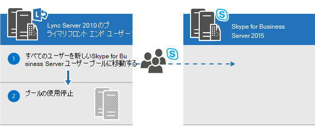
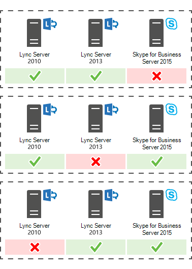

# Skype for Business Server 2015 へのアップグレードの計画Plan to upgrade to Skype for Business Server 2015
 
概要: Skype for Business Server 2015 へのアップグレードを計画するときに考慮する必要がある事項について説明します。Summary: Learn about the things you should consider when you plan an upgrade to Skype for Business Server 2015. Skype for Business Server 2015 の無料トライアルは、次[https://www.microsoft.com/evalcenter/evaluate-skype-for-business-server](https://www.microsoft.com/evalcenter/evaluate-skype-for-business-server)の Microsoft 評価センターからダウンロードしてください。Download a free trial of Skype for Business Server 2015 from the Microsoft Evaluation center at: [https://www.microsoft.com/evalcenter/evaluate-skype-for-business-server](https://www.microsoft.com/evalcenter/evaluate-skype-for-business-server).
  
Skype for business Server 2015 へのアップグレードの一環として、このトピックを使用して、Skype for Business Server 2015 への推奨アップグレードパス、インプレースアップグレードのしくみ、サポートされている共存シナリオの概要、アップグレードプロセスの概要について説明します。次のようになります。As part of your plan to upgrade to Skype for Business Server 2015, use this topic to understand the recommended upgrade paths to Skype for Business Server 2015, how the In-Place Upgrade works, what the supported coexistence scenarios are, and what the upgrade process looks like.

> [!NOTE]
> インプレースアップグレードは、Skype for Business Server 2015 で使用できましたが、Skype for Business Server 2019 ではサポートされなくなりました。In-place upgrades were available in Skype for Business Server 2015 but are no longer supported in Skype for Business Server 2019. サイドバイサイドの coexistance はサポートされています。詳細については、「 [Skype For Business Server 2019 への移行](../../SfBServer2019/migration/migration-to-skype-for-business-server-2019.md)」を参照してください。Side by side coexistance is supported, see [Migration to Skype for Business Server 2019](../../SfBServer2019/migration/migration-to-skype-for-business-server-2019.md) for more information.
  
## Skype for Business Server 2015 への推奨されるアップグレードパスRecommended upgrade paths to Skype for Business Server 2015

 Lync Server 2013、Lync Server 2010、または Office Communications Server 2007 R2 から Skype for Business Server 2015 にアップグレードするには、次のアップグレードパスを使用します。To upgrade from Lync Server 2013, Lync Server 2010, or Office Communications Server 2007 R2 to Skype for Business Server 2015, use the following upgrade paths:
  
> [!CAUTION]
> 一括アップグレードを実行すると、Lync Server 2013 から Skype for Business Server 2015 に会議ディレクトリが自動的に移動されます。ただし、会議ディレクトリを手動で移動する場合は、必ず Skype for Business Server 2015 の管理シェルを使用してください。Lync Server 2013 管理シェルを使用して Lync Server 2013 から Skype for Business Server 2015 に会議ディレクトリを移動すると、データ損失が発生する可能性があります。一般に、Skype for Business Server 2015 を操作する場合は、その内容を問わず、Skype for Business Server 2015 ツール セットを使用する必要があります。In-Place Upgrade automatically moves conference directories from Lync Server 2013 to Skype for Business Server 2015. However, if you plan to manually move conference directories it is very important to use the Skype for Business Server 2015 Management Shell. If you try to use the Lync Server 2013 Management Shell to move conference directories from Lync Server 2013 to Skype for Business Server 2015 then data loss can occur. In general, whenever you are working with Skype for Business Server 2015 in any capacity you should use the Skype for Business Server 2015 tool set.  
  
|**バージョン****Version**|**推奨される手順****Recommendations**|
|:-----|:-----|
|Lync Server 2013Lync Server 2013    | アップグレードするには、Skype for Business Server トポロジビルダーと、プールに関連付けられている各サーバー上の新しいインプレースアップグレード機能を使用します。To upgrade, use the Skype for Business Server Topology Builder and the new In-Place Upgrade feature on each of the servers associated with the pool. 詳細な手順については、「 [Lync server 2013 から skype For Business server 2015 にアップグレード](upgrade.md#BKMK_PlanUpgradeFromLync2013)して skype For business [server 2015 に](../deploy/upgrade-to-skype-for-business-server.md)アップグレードする」を参照してください。see [Plan to upgrade from Lync Server 2013 to Skype for Business Server 2015](upgrade.md#BKMK_PlanUpgradeFromLync2013) and [Upgrade to Skype for Business Server 2015](../deploy/upgrade-to-skype-for-business-server.md) for detailed steps.   |
|Lync Server 2010 + Lync Server 2013 (デュアル モード)Lync Server 2010 + Lync Server 2013 (dual-mode)    |まず、Lync Server 2013 にアップグレードした後、新しいインプレースアップグレード機能を使用して、Skype for Business Server 2015 にアップグレードします。First, upgrade to Lync Server 2013, and then upgrade to Skype for Business Server 2015 by using the new In-Place Upgrade feature. ただし、トポロジが主に Lync Server 2010 である場合は、Lync Server 2013 コンポーネントを Lync Server 2010 にロールバックしてから、Skype for Business Server 2015 に直接アップグレードすることもできます。However, if your topology is primary Lync Server 2010 you can also roll back the Lync Server 2013 components to Lync Server 2010 and then upgrade directly to Skype for Business Server 2015. この場合は、一括アップグレードを利用することはできず、Lync Server 2010 と Skype for Business Server 2015 の単純な共存を使用します。In this case you would not be able to take advantage of In-Place Upgrade and would use straight co-existence between Lync Server 2010 and Skype for Business Server 2015. 3 つの共存はサポートされていませんが、2 つの共存はサポートされています。Tri-existence is not supported but co-existence is supported.    |
|Lync Server 2010Lync Server 2010    |Skype for Business Server 2015 の新しいプールを表示してから、この新しいプールにユーザーを移行します。Bring up a new Skype for Business Server 2015 pool and then migrate users to this new pool. その後、Lync Server 2010 の古いプールを使用停止することができます。You can then decommission the old Lync Server 2010 pool. Lync Server 2010 から Skype for Business Server 2015 へのアップグレードは、Lync Server 2010 から Lync Server 2013 へのアップグレードに似ています。Upgrading from Lync Server 2010 to Skype for Business Server 2015 is similar to upgrading from Lync Server 2010 to Lync Server 2013. 「 [Lync server 2010 から Lync server 2013 への移行」を](https://go.microsoft.com/fwlink/p/?LinkId=526615)参照してください。See [Migration from Lync Server 2010 to Lync Server 2013](https://go.microsoft.com/fwlink/p/?LinkId=526615).    |
|Office Communications Server 2007 R2Office Communications Server 2007 R2    | 次の 2 つのオプションのいずれかを選択します。Pick one of two options:    新しい Skype for Business Server 2015 環境をセットアップします。Set up a new Skype for Business Server 2015 environment.    または、ハードウェアとソフトウェアが Skype for Business Server 2015 の要件を満たしている場合は、Lync Server 2013 にアップグレードし、新しいインプレースアップグレード機能を使用して、Skype for Business Server 2015 にアップグレードします。Or if your hardware and software meet the requirements for Skype for Business Server 2015, upgrade to Lync Server 2013, and then upgrade to Skype for Business Server 2015 by using the new In-Place Upgrade feature. 詳細については、「 [Skype For Business server 2015 のサーバー要件](requirements-for-your-environment/server-requirements.md)」および「 [Office Communications server 2007 R2 から Lync server 2013 への移行](https://go.microsoft.com/fwlink/p/?LinkId=526616)」を参照してください。For more information, see [Server requirements for Skype for Business Server 2015](requirements-for-your-environment/server-requirements.md) and [Migration from Office Communications Server 2007 R2 to Lync Server 2013](https://go.microsoft.com/fwlink/p/?LinkId=526616).    |
   
> [!NOTE]
> SQL Server 2014 は、Skype for Business Server 2015 でサポートされていますが、Lync Server 2013 ではサポートされていません。SQL Server 2014 is supported in Skype for Business Server 2015 but is not supported in Lync Server 2013. SQL Server 2012 から SQL Server 2014 にアップグレードする場合は、このドキュメントで説明されているインプレースアップグレード方法を使用して、プールを最初に Skype for Business Server 2015 にアップグレードする必要があります。If you want to upgrade from SQL Server 2012 to SQL Server 2014 then the pool must first be upgraded to Skype for Business Server 2015 using the In-Place Upgrade method as described in this document. SQL Server 2012 から SQL Server 2014 にアップグレードするには、「 [Sql server 2014 にアップグレード](https://msdn.microsoft.com/en-us/library/bb677622%28v=sql.120%29.aspx)する」を参照してください。You can then upgrade from SQL Server 2012 to SQL Server 2014, see [Upgrade to SQL Server 2014](https://msdn.microsoft.com/en-us/library/bb677622%28v=sql.120%29.aspx). データベースの要件の詳細については、「 [Skype For Business server 2015 のサーバー要件](requirements-for-your-environment/server-requirements.md)」を参照してください。To learn more about database requirements, see [Server requirements for Skype for Business Server 2015](requirements-for-your-environment/server-requirements.md). 
  
## Lync Server 2013 から Skype for Business Server 2015 へのアップグレードの計画Plan to upgrade from Lync Server 2013 to Skype for Business Server 2015

新しいインプレースアップグレード機能を使用して、Lync Server 2013 システムを Skype for Business Server 2015 にアップグレードできます。You can upgrade Lync Server 2013 systems to Skype for Business Server 2015 using the new In-Place Upgrade feature. インプレースアップグレードでは、証明書のバックアップ、サーバーコンポーネントのアンインストール、ローカルデータベースのアップグレード、Skype for Business Server 2015 の役割のインストールを行うワンクリックソリューションが用意されています。In-place upgrade provides a one-click solution that backs up certificates, uninstalls server components, upgrades local databases, and installs the Skype for Business Server 2015 roles. インプレースアップグレードでは、既存のハードウェアとサーバーの投資を維持し、Skype for Business Server 2015 の展開にかかる全体的なコストを削減します。In-place upgrade seeks to preserve existing hardware and server investments, reducing the overall cost to deploy Skype for Business Server 2015.
  
> [!NOTE]
> インプレースアップグレードでは、Skype for Business Server にアップグレードするときに同じハードウェアを使用することができます。In-Place Upgrade allows you to use the same hardware when upgrading to Skype for Business Server. ただし、同じハードウェアを再利用しても、同じパフォーマンス容量には変換されません。However, reusing the same hardware does not translate into the same performance capacity. Lync Server 2013 と Skype for Business Server 2015 のパフォーマンスのロードが同じであると想定されることはありません。You should not expect the performance loads for Lync Server 2013 and Skype for Business Server 2015 to be identical. 
  
> [!NOTE]
> インプレースアップグレードでは、Skype for Business Server の高可用性または障害回復はサポートされません。In-Place upgrade does not support high availability or disaster recovery for Skype for Business Server. 
  
インプレースアップグレードでは、Lync Server 2013 プールをオフラインにして、Skype for Business Server 2015 プールにアップグレードする必要があります。In-place upgrade involves taking the Lync Server 2013 pool offline and upgrading it to a Skype for Business Server 2015 pool. 
  
### 一括アップグレード計画の作成Create an In-Place Upgrade plan

次の内容を含む計画を作成します。Make a plan that includes:
  
1. 現在のトポロジについて理解している。An understanding of your current topology.
    
    > [!NOTE]
    > インプレースアップグレードを実行する前に、必ず Lync Server 2013 用の LRS 管理ツールをアンインストールしてください。Be sure to uninstall LRS Admin tool for Lync Server 2013 before running In-Place Upgrade. Lync Server 2013 用の LRS 管理ツールは、Skype for Business Server 2015 と共存することはできません。The LRS Admin Tool for Lync Server 2013 cannot coexist with Skype for Business Server 2015. インプレースアップグレードを実行した後、新しい LRS 管理ツールをインストールします。After running In-Place Upgrade install the new LRS Admin tool. 詳細については、「 [Skype For Business Server 2015 の Microsoft Lync Room System 管理 Web ポータル](https://go.microsoft.com/fwlink/?LinkID=544807)」を参照してください。See [Microsoft Lync Room System Administrative Web Portal for Skype for Business Server 2015](https://go.microsoft.com/fwlink/?LinkID=544807) for more details.
  
2. アップグレードのプライマリプール。The primary pool for the upgrade.
    
3. アーカイブ データベースや監視データベースのアップグレードと、新しいデータベースの作成のどちらを選択するか。Whether you'll upgrade the Archiving and Monitoring databases or create new ones.
    
4. 使用する一括アップグレードの方法: "オフライン" または "ユーザーの移動"。"ユーザーの移動" の一環としては、プライマリ プールと関連付けられているグローバルな会議ディレクトリも移行する必要があります。The In-Place Upgrade method you'll use: Offline or Move Users. As part of Move Users you also will need to migrate the global conference directories associated with the primary pool. 
    
5. 影響を受けるユーザーの通信計画。A communication plan for impacted users.
    
6. アップグレードが失敗した場合のバックアップ計画。A backup plan in case the upgrades fails.
    
プライマリ プール内のユーザーは、そのプールのアップグレード中、完了するまでサービスを使用できません。Any users that are in the primary pool while it's being upgraded won't be able to use the services until the upgrade is complete. 正しく機能するセカンダリ プールがある場合、アップグレードの前にユーザーをセカンダリ プールに移動することで、ユーザーに影響を与えることを回避できます。If you have a working secondary pool, you can avoid impacting users by moving them to the secondary pool before the upgrade. アップグレード後、ユーザーをプライマリプールに戻します。After the upgrade, move the users back to the primary pool.
  
### インプレース アップグレードの手法In-place upgrade methods

一括アップグレードには次の 2 つのシナリオがあります。There are two scenarios for In-Place Upgrade: 
  
- ユーザーの移動という手法では、ユーザーのダウンタイムを必要としません。The Move User method, which requires no downtime for users. 
    
- オフラインという手法では、ダウンタイムを必要とします。The Offline method, which requires downtime.
    
オフラインのアップグレードをメンテナンス ウィンドウ内にスケジュールして、ダウンタイムをユーザーに通知することが推奨されます。We recommend that an Offline method upgrade be scheduled during a maintenance window and users are notified of the downtime.
  
> [!NOTE]
> Lync Server 2013 内にあるペアになったプールをアップグレードし、両方のプールを Skype for Business Server 2015 にアップグレードしようとする場合は、最初のプールをアップグレードした直後に、2 番目のプールも必ずアップグレードしてください。1 つのプールが Lync Server 2013 を実行しており、2 番目のプールが Skype for Business Server 2015 を実行している場合は、障害復旧オプションは最小化されます。たとえば、1 つのプールが 2013 を実行し、2 番目が 2015 を実行していて、障害が発生した場合は、データの損失が生じる恐れがあります。ペアになったプールが同じバージョンでない場合は、障害モードでプール フェールオーバーがサポートされていないためです。When upgrading a paired pool on Lync Server 2013 and you want to upgrade both pools to Skype for Business Server 2015. Make sure to upgrade the second pool immediately after upgrading the first pool. When one pool is running Lync Server 2013 and the second pool is running Skype for Business Server 2015 then disaster recovery options are minimized. For example, if one pool is running 2013 and the second is 2015 and there is a disaster then you could experience data loss because pool failover is not supported in disaster mode when paired pools are not the same version. 
  
#### インプレース アップグレードのオフラインの手法In-place upgrade Offline method

ユーザーをユーザー プール間で移動したくない場合にこの方法を使用します。Use this method if you don't want to move users between user pools. アップグレード中は、ユーザーは Lync または Skype for Business サービスを使用できなくなります。During the upgrade, users will not be able to use Lync or Skype for Business services. 
  
次の図に、このプロセスの概要を示します。The following diagram shows an overview of this process.
  

  
> [!NOTE]
> ペアになったプールがある場合、アップグレードの前にそれらのペアを解除しないでください。If you have paired pools, do not unpair them before the upgrade. 
  
サーバー プールのアップグレードを開始した後、プール全体のアップグレードを完了する必要があります。Once you start to upgrade a server pool, you must complete the upgrade of the entire pool. Skype for Business Server では、プールの一部のみがアップグレードされます。Skype for Business Server doesn't support having only a portion of the pool upgraded. 
  
#### ユーザーの移動の手法 (ユーザーのダウンタイムなし)Move Users method (no user downtime)

この手法を使用する場合、アップグレードを開始する前に、ユーザーを別のプールに移動します。To use this method, you move users to another pool before you start the upgrade. アップグレード中に、ユーザーは Lync services を使うことができます。During the upgrade, users can use Lync services. アップグレードされたプールに移動されると、Skype for Business を使用できるようになります。After they're moved to the upgraded pool, they can use Skype for Business. 次の図は、このプロセスの概要を示しています。The following diagram shows an overview of this process.
  
> [!IMPORTANT]
> "ユーザーの移動" の一環として、プライマリ プールと関連付けられているグローバルな会議ディレクトリも移行する必要があります。As part of Move Users you also will need to migrate the global conference directories associated with the primary pool. PSTN ダイヤルイン会議では、依然として、ConferenceID を (ペアになっているプールではなく) アップグレードされているプールに解決します。PSTN dial-in conferencing will still resolve ConferenceID to the pool being upgraded, instead of the paired pool. そのため、アップグレード中にプールでスケジュールされている PSTN 会議を引き続きアクセス可能にする場合は、会議ディレクトリを移動する必要があります。So you need to move Conference Directories, if you still want PSTN conferences scheduled in the pool to be accessible during upgrade. 
  

  
#### ハードウェア アップグレードのためのユーザーの移動Move users for hardware upgrade

 お使いのハードウェアが[skype For Business server 2015 のサーバー要件](requirements-for-your-environment/server-requirements.md)を満たしていない場合は、新しい Skype For business server 2015 環境をセットアップし、ユーザーを移動します。If your hardware doesn't meet the [Server requirements for Skype for Business Server 2015](requirements-for-your-environment/server-requirements.md), set up a new Skype for Business Server 2015 environment, and move users there. 次の図に、Lync Server 2010 からアップグレードするためのこのプロセスの概要を示します。The following diagram shows an overview of this process for upgrade from Lync Server 2010. 
  

  
### インプレース アップグレードのプロセスIn-place upgrade process

 Lync Server 2013 から Skype for Business Server 2015 にアップグレードするには、次の手順を実行します。Upgrade from Lync Server 2013 to Skype for Business Server 2015 using the following steps:
  
1. アップグレードの前に、すべてのデータベースをバックアップします。Back up all databases before the upgrade.
    
2. アップグレードするすべてのサービスが実行状態にあることを確認します。Make sure all services that are to be upgraded are in a running state.
    
3. トポロジ ビルダーを使用して、トポロジ ファイルをアップグレードして公開します。Upgrade and publish the topology file using the topology builder.
    
4. すべてのフロントエンド サーバーのすべてのサービスを停止します。Stop all services on all Front End servers.
    
5. Skype for Business Server に必要な新しい前提条件をインストールします。Install new prerequisites required for Skype for Business Server.
    
6. 各フロントエンド サーバーで、一括アップグレードを開始します。On each Front End server, start the In-Place Upgrade.
    
7. アップグレードが完了したら、すべてのサービスを再起動します。When the upgrade is complete, restart all services.
    
   - フロントエンド プールについては、コマンド Start-CsPool を使用してサービスを再起動します。For the Front End pool, restart services using the command Start-CsPool.
    
   - フロントエンド サーバー以外については、Start-CSWindowsService を使用します。For non-Front End servers, use Start-CSWindowsService.
    
> [!NOTE]
>  既存のアーカイブおよび監視データベースをアップグレードしない場合は、トポロジをアップグレードする前に、依存関係を削除します。If you don't want to upgrade your existing Archiving and Monitoring databases, remove the dependency before you upgrade the topology. アップグレード中に新しいアーカイブおよび監視データベースを作成する場合は、新しい SQL ストアを作成して、それをプールに関連付けます。If you want to create new Archiving and Monitoring databases, during the upgrade, you can create a new SQL store and associate it with the pool. 手順については、「[Skype for Business Server 2015 にアップグレード](../deploy/upgrade-to-skype-for-business-server.md)する」を参照してください。You can find the steps on how to do this in the topic,[Upgrade to Skype for Business Server 2015](../deploy/upgrade-to-skype-for-business-server.md). インプレースアップグレード > は、Skype for Business Server の高可用性または障害回復をサポートしていません。>  In-place upgrade does not support high availability or disaster recovery for Skype for Business Server. ユーザーのサービスが中断されないようにするには、[[ユーザーの移動] メソッド (ユーザーのダウンタイムは不要)](upgrade.md#bkmk_MoveUsersMethod)を使用してアップグレードします。 > は、アップグレードプロセス中に、最大の空き領域があるディスクドライブのローカル共有フォルダーに設定されます。To avoid interrupting users' services, use the [Move Users method (no user downtime)](upgrade.md#bkmk_MoveUsersMethod) to upgrade.>  During the upgrade process the xds-replica is placed in the local shared folder on the disk drive with the most free space. そのディスクが後で取り外されると、サービスが開始されないなどの問題が発生することがあります。If that disk is later removed then you can run into issues such as services not starting.
  
### アップグレードの順序Upgrade order

トポロジを内側から外側にアップグレードします。Upgrade the topology from the inside to the outside. 最初にすべてのプール、続いてエッジ サーバーをアップグレードして、最後に中央管理ストア (CMS) プールをアップグレードします。Upgrade all your pools first, then the edge servers, and finally the Central Management Store (CMS) pool. 
  
### Kerberos 認証に関する考慮事項Kerberos authentication considerations

Web サービスに Kerberos 認証を使用する場合は、一括アップグレードの完了後に、Kerberos アカウントを再割り当てしてパスワードをリセットする必要があります。If you use Kerberos authentication for Web Services, you must reassign Kerberos accounts and reset the password after the In-Place Upgrade is complete. この方法については、「 [Kerberos 認証を設定](https://go.microsoft.com/fwlink/p/?LinkId=530342)する」を参照してください。To learn how to do this, see [Setting up Kerberos authentication](https://go.microsoft.com/fwlink/p/?LinkId=530342).
  
## Lync Server 2013 および Lync Server 2010 との共存のサポートSupport for coexistence with Lync Server 2013 and Lync Server 2010

Skype for Business Server 2015 は、Lync Server 2013 または Lync Server 2010 と同じトポロジで実行することができますが、3 つすべてを同じトポロジにすることはできません。You can run Skype for Business Server 2015 in the same topology as Lync Server 2013 or Lync Server 2010, but you can't have all three in the same topology.
  
Lync Server 2010 と Lync Server 2013 が共存する場合は、トポロジ全体を Lync Server 2013 にアップグレードしてから、一括アップグレードを使用して Skype for Business Server 2015 にアップグレードすることをお勧めします。If you have a co-existence between Lync Server 2010 and Lync Server 2013, it is recommended to upgrade the entire topology to Lync Server 2013, and then upgrade to Skype for Business Server 2015 using the In-Place Upgrade. 詳細については、「 [Lync server 2010 から Lync server 2013 に移行する](https://go.microsoft.com/fwlink/p/?LinkId=526615)」を参照してください。For more information, see [Migration from Lync Server 2010 to Lync Server 2013](https://go.microsoft.com/fwlink/p/?LinkId=526615).
  
使用するトポロジがおもに Lync Server 2010 である場合は、トポロジを Skype for Business Server 2015 にアップグレードする前に、Lync Server 2013 コンポーネントを Lync Server 2010 にロールバックします。その場合は、一括アップグレードを利用するメリットや、Lync Server 2010 と Skype for Business Server 2015 間でトポロジを共存させるメリットが得られません。If your topology is primarily Lync Server 2010, roll back the Lync Server 2013 components to Lync Server 2010 before upgrading the topology to Skype for Business Server 2015. In this case, you lose the benefit of the In-Place Upgrade and have a co-existence topology between Lync Server 2010 and Skype for Business Server 2015.
  
次の図は、Skype for Business Server 2015 と Lync Server 2013 および Lync Server 2010 の共存サポートを示しています。The following diagram shows the coexistence support of Skype for Business Server 2015 with Lync Server 2013 and Lync Server 2010.
  

  
## 既存の存続可能ブランチ アプライアンスおよびサーバーを使用したアップグレード プロセスUpgrade process with existing Survivable Branch Appliance and Server

Skype for Business Server 2015 は、Survivable Branch Appliance (SBA) または Survivable Branch Server (SBS) のインプレースアップグレードをサポートしていません。Skype for Business Server 2015 doesn't support an In-Place Upgrade of a Survivable Branch Appliance (SBA) or a Survivable Branch Server (SBS).
  
ただし、Skype for Business Server データセンターと Lync Server 2010 または Lync Server 2013 SBA/SBS の共存はサポートしています。However, we do support coexistence of Skype for Business Server datacenters with Lync Server 2010 or Lync Server 2013 SBA/SBS. 
  
Lync Server 2013 Front End (FE) プールとそれに関連付けられたブランチの一括アップグレードを計画する場合、Lync Server 2013 SBA/SBS の既存ユーザーは残すことができます。When planning for an In-Place Upgrade of a Lync Server 2013 Front End (FE) pool with an associated branch, you can leave the existing users on the Lync Server 2013 SBA/SBS. アップグレード中、SBA/SBS ユーザーは復元モードになり、アップグレードが完了すると通常の機能に戻ります。During the upgrade, the SBA/SBS users will go in resiliency mode and will return to normal functionality after the upgrade has completed. 回復性モードでのユーザーエクスペリエンスの詳細については、「 [Lync Server 2013 のブランチサイトの回復機能](https://technet.microsoft.com/library/gg398715.aspx)」を参照してください。For more information about the users' experience during the resiliency mode, please see [Branch-site resiliency features in Lync Server 2013](https://technet.microsoft.com/library/gg398715.aspx).
  
Lync Server 2010 トポロジを Skype for Business Server 2015 に移行する場合は、Lync Server 2013 への移行と同様に、SBA/SBS をトポロジにもう一度追加する必要があります。When migrating a Lync Server 2010 topology to Skype for Business Server 2015, the SBA/SBS must re-added to the topology, similar to the migration to Lync Server 2013. 必要な手順については、「 [Survivable Branch Appliance の接続」2013を](https://technet.microsoft.com/library/jj688026.aspx)参照してください。For the required steps, please read [Connecting Survivable Branch Appliance to Lync Server 2013 Front End pool](https://technet.microsoft.com/library/jj688026.aspx).
  
Lync Server 2010 および Lync Server 2013 の共存するトポロジについては、まず「Lync Server 2013 および Lync Server 2010 を使用した共存のサポート」に記載されている推奨事項に合わせてください。For co-existence topologies of Lync Server 2010 and Lync Server 2013, align first to the recommendations made in the section 'Support for coexistence with Lync Server 2013 and Lync Server 2010'.
  
## 関連項目See also

[Skype for Business Server 2015 へのアップグレードUpgrade to Skype for Business Server 2015](../deploy/upgrade-to-skype-for-business-server.md)
  
[Environmental requirements for Skype for Business Server 2015Environmental requirements for Skype for Business Server 2015](requirements-for-your-environment/environmental-requirements.md)
  
[Server requirements for Skype for Business Server 2015Server requirements for Skype for Business Server 2015](requirements-for-your-environment/server-requirements.md)
