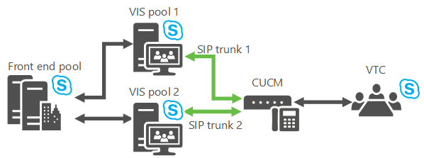

# Skype for Business Server のビデオ相互運用機能サーバーを計画するPlan for Video Interop Server in Skype for Business Server
 
**概要:** このトピックでは、Skype for Business Server とサードパーティのテレビ会議デバイスとの統合を計画しています。**Summary:** Review this topic while planning to integrate Skype for Business Server with third-party teleconferencing devices.
  
Skype for Business Server で、特定のサードパーティの VTC (ビデオ会議システム) ソリューションと統合できるようになりました。Skype for Business Server now allows you to integrate with certain third-party VTC (Video Teleconferencing System) solutions. このビデオ会議の相互運用性を実現する新しいサーバーの役割は、ビデオ相互運用機能サーバー (VIS) です。現在、オンプレミスのインストールでのみ利用可能なスタンドアロンサーバーの役割として実装されています。The new server role that enables this video conferencing interoperability is the Video Interop Server (VIS), which is currently implemented as a standalone server role available only for on-premises installations. VIS は、サードパーティの電話会議システムと Skype for Business Server の展開の間の媒介として機能します。A VIS acts as an intermediary between a third party teleconference system and a Skype for Business Server deployment. このリリースでは、VIS は Cisco/Tandberg ビデオ システムとの相互運用性に焦点を合わせています。For this release, VIS is focused on interoperability with Cisco/Tandberg video systems. Skype for Business Server のインストールでこの機能を使用するかどうかを確認するには、この記事を参照してください。Review this article to determine whether to use this feature in your Skype for Business Server installation.
  
## デバイスの相互運用性Device interoperability

相互運用は、cisco のユニファイドコミュニケーションマネージャー (CallManager、または CUCM) バージョン10.5 と、CUCM と VIS の間に設定された TCP SIP trunks を使った、Cisco VTCs でのテストとサポートを行います。Interoperation is tested and supported with Cisco VTCs registering with Cisco Unified Communications Manager (CallManager, or CUCM) version 10.5 and TCP SIP trunks set up between CUCM and the VIS.
  
現在サポートされている VTC:The currently supported VTCs are:
  
- Cisco C40Cisco C40
    
- Cisco C60Cisco C60
    
- Cisco C90Cisco C90
    
- Cisco MX200Cisco MX200
    
- Cisco MX300Cisco MX300
    
- Cisco DX80Cisco DX80
    
- Cisco EX60Cisco EX60
    
- Cisco EX90Cisco EX90
    
- Cisco SX20Cisco SX20
    
> [!NOTE]
>  Skype for Business Server との統合には、Cisco software release TC 7.0.0 以上が必要です。Cisco software release TC7.0.0 or above is required on these systems for integration with Skype for Business Server to work as expected.
  
## SIP トランクSIP trunks

SIP トランクモードでは、VTCs は既存の Cisco インフラストラクチャに登録されているので、「Cisco Call Manager (CUCM)」などのビデオ相互運用機能サーバーが機能します。The Video Interop Server functions in SIP trunk mode, where the VTCs continue to register with the existing Cisco infrastructure - for example, Cisco Call Manager (CUCM). ビデオ SIP トランクは、CUCM と VIS 間に定義されるので、2 つのシステム間で通話をルーティングできます。A video SIP trunk is defined between CUCM and the VIS so that calls can be routed between the two systems. VTC から VIS への SIP トランク上の通話のみがサポートされます。Only calls over the SIP trunk from the VTC to the VIS are supported. したがって、VTCs は、Skype for Business 会議にダイヤルインすることができます (通話自動応答に関連付けられた電話番号にダイヤルするため)。会議にドラッグアンドドロップすることはできません。Thus, VTCs can dial into a Skype for Business conference (by dialing the phone number associated with the Call Automated Attendant), but cannot be dragged and dropped into the conference.
  

  
## 機能Features

このサーバーの役割の機能:This server role provides:
  
- サードパーティのビデオシステムと Skype for Business Server の展開で使用される .H 形式間の変換。Conversion between the H.264 formats used by 3rd party video systems and the Skype for Business Server deployment.
    
- 特定の解像度の1つのビデオストリームを VTC から複数の simulcast ストリームに変換することで、Skype for Business Server の展開で使用するさまざまな解像度を使用できます。Conversion of a single video stream at a given resolution from a VTC into multiple simulcast streams of different resolutions for use in the Skype for Business Server deployment. これらのストリームは、AVMCU に送信した後、Skype for Business Server のエンドポイント、および別の解像度を要求したその他のビデオシステムに送ることができます。These streams can be sent to the AVMCU and then to Skype for Business Server endpoints and other video systems that have requested different resolutions. この変換は、サードパーティのビデオシステムが Skype for Business A/V 会議通話に関与している場合にも使用されます。This conversion is also used when the third party video system is involved in a Skype for Business A/V conference call. 特定の VIS サーバーでトランスコードの制限に達すると、次のようなさまざまな解像度の要求では、最も低い解像度のストリームしか受信できなくなります。Once the transcoding limit is reached in a particular VIS server, any following requests for different resolutions will only receive a stream with the lowest resolution. 
    
- CUCM gateway と Skype for Business Server ビデオ相互運用サーバーとの間のビデオ SIP トランクのサポートVTCs は引き続き Cisco ゲートウェイに登録され、ゲートウェイ経由で Skype for Business 展開への通話が開始されます。Support for a video SIP trunk between the CUCM gateway and a Skype for Business Server Video Interop Server; VTCs continue to register with the Cisco gateway, and initiate calls to the Skype for Business deployment through the gateway. 通話は、ビデオ SIP トランクを介してゲートウェイから Skype for Business ビデオ相互運用サーバーにルーティングされます。Calls are routed from the gateway to the Skype for Business Video Interop Server over the video SIP trunk.
    
- サポートされているビデオ システムがある会議室のユーザーは、そのシステムからダイヤルして、公開または非公開の会議に参加できます。Support for a user in a conference room with a supported video system to dial from that system to join an open or closed conference. この通話は、ビデオ SIP トランクを通過します。This call will traverse the video SIP trunk.
    
- サポートされているビデオシステムで Skype for Business クライアントを呼び出す、会議室内のユーザーをサポートします。Support for a user in a conference room with a supported video system to call a Skype for Business client. この通話は、SIP トランクを通過します。The call will traverse the SIP trunk.
    
- Skype for Business Server 側またはサポートされている VTC システムで、音声のミュート/ミュート解除、ビデオの一時停止、再開、ビデオのロック、通話の保留/保留の切り替えを含む、中間通話コントロールをサポートします。Support for mid-call control from the Skype for Business Server side or from the supported VTC system for both point to point and multipoint calls including mute/un-mute audio, pause/resume video, lock video, and hold/un-hold call.
    
## 既知の制限Known limitations

このサーバーの役割には、次の制限があります。This server role has the following limitations:
  
- Skype for Business の展開から VTCs への新規通話は、ビデオ SIP トランクを介してはサポートされていません。New calls from the Skype for Business deployment to the VTCs over the video SIP trunk are not supported. .. これは、ビデオ SIP トランクを介して、VTCs から Skype for Business の展開への新しい通話のみがサポートされることを意味します。This means that only new calls from the VTCs into the Skype for Business deployment are supported over the video SIP trunk. サポートされているビデオシステムのプレゼンスは、VIS へのビデオ SIP トランク経由では利用できません。Presence for the supported video system will not be available over the video SIP trunk to the VIS. 
    
- ビデオ SIP トランク モードでは、スタンドアロン VIS プールのみがサポートされます。Only a standalone VIS pool will be supported for video SIP trunk mode.
    
-  ビデオ SIP トランク上の VTC と VIS 間の通信では、TLS + SRTP または TCP + RTP がサポートされます。TLS + SRTP or TCP + RTP will be supported for communications between the VTC and VIS over the video SIP trunk.
    
- アプリケーション共有はサポートされていません。Application sharing is not supported. 会議室の Skype for Business ユーザーは、Skype for Business 会議 (たとえば、ノート pc 経由) に参加し、VTC に関連付けられていない会議室のいずれかの無料モニターでアプリ共有画面を表示する必要があります。A Skype for Business user in the conference room needs to join the Skype for Business conference (via a laptop for example) and display the app sharing screens on one of the free monitors in the conference room not associated with the VTC.
    
- VTC から、VIS を介してフェデレーション会議に参加することはできません。The ability for a VTC to join a federated meeting via VIS is not supported.
    
- VTC から、VIS を介してオンライン会議に参加することはできません。The ability for a VTC to join an online meeting via VIS is not supported.
    
- VTC から、VIS を介して PSTN に発信することはできません。Calls from a VTC to the PSTN via VIS are not supported.
    
- PSTN から、VIS を介して VTC に発信することはできません。Calls from the PSTN to a VTC via VIS are not supported.
    
## 復元のメカニズムResiliency mechanisms

VIS は、ビデオ SIP トランク上で実行された CUCM からの着信をサポートしています。The VIS supports incoming calls from a CUCM that are carried over a video SIP trunk. アップストリームまたはダウンストリームの接続が切断される可能性があるので、確実な復元のために、次の両方の可能性を考慮してください。It's possible to lose connectivity either upstream or downstream, so for robust resiliency consider both possibilities:
  
1. **VIS プールのフェールオーバー**ビデオゲートウェイが指しているメインの VIS プールがダウンしている場合は、2つ (以上) の VIS プールへの trunks がビデオゲートウェイで定義されていると、回復が可能になります。**VIS Pool Failover** If the main VIS pool that the video gateway points to is down, recovery is possible if the video gateway has defined trunks to two (or more) VIS pools. ビデオゲートウェイによってプライマリ VIS プールへの通話を発信できないと判断された場合は、単に着信をセカンダリ VIS プールにルーティングします。If the video gateway determines it cannot make calls to the primary VIS pool, it simply routes the calls to a secondary VIS pool.
    
     
  
    特定の VIS プールには複数のゲートウェイを指定できますが、通常、特定のゲートウェイには複数の VIS プールを設定することはできません。そのため、このフェールオーバーをサポートするには、2 FDQNs を DNS で定義し、ビデオゲートウェイと同じ IP アドレスに解決する必要があります。A particular VIS pool can have trunks to multiple gateways, but normally a particular gateway can't have trunks to multiple VIS pools, so a trick needs to be done to support this failover: Define 2 FDQNs in DNS which resolve to the same IP address of a video gateway. 各各ビデオゲートウェイが別の VIS プールにトランクを持っていて、回復が可能になったトポロジドキュメントで、各 FQDN を個別のビデオゲートウェイとして表します。Represent each FQDN as a separate video gateway in the Topology Document where each video gateway has a trunk to a different VIS pool, and recovery is now possible. (TLS が使用されている場合は、複数の名前がビデオゲートウェイ証明書の SAN に存在する必要があります)。(If TLS is used, the multiple names will need to be in the SAN of the video gateway certificate.)
    
    > [!NOTE]
    > VIS は、トポロジ ドキュメントに構成されているゲートウェイからの着信のみを受けることができます。VIS only allows incoming calls from gateways configured in the Topology Document. 
  
2. **フロントエンドフェールオーバー**VIS プールが CUCM から通話を受信したが、プライマリ next-hop レジストラーまたはフロントエンドプールにアクセスできない場合、通話はバックアップフロントエンドプールにルーティングされます。**Front End failover** If a VIS pool receives a call from CUCM but cannot reach its primary next-hop Registrar or Front End pool, calls are routed to a backup Front End pool.
    
     
  
    VIS は、プライマリフロントエンドプールとバックアップフロントエンドプールの状態を追跡します (設定は、トポロジドキュメントのレジストラーサービスのバックアップ設定にあります)。The VIS will keep track of the status of its primary Front End pool and its backup Front End pool (the setting is found in the backup setting for the Registrar service in the Topology Document). オプションのポーリングは両方のプールに1分間隔で送信され、5回連続して失敗すると、VIS は特定のフロントエンドプールがダウンしていることを前提とします。It sends Options polls once a minute to both pools, and if there are five consecutive failures the VIS assumes that a particular Front End pool is down. プライマリフロントエンドプールがダウンとマークされていて、使用可能な構成済みのバックアップがある場合、VIS は新しい通話をゲートウェイからバックアップフロントエンドプールに送信します。If the primary Front End pool is marked as down and there is an available configured backup the VIS sends new calls from the gateway to the backup Front End pool. プライマリフロントエンドプールが再び表示されると、VIS は、新しい通話に対して、プライマリフロントエンドプールの使用を再開します。Once the primary Front End pool comes back, the VIS will resume using the primary Front End pool for new calls.
    
    VIS は、ビデオ SIP トランクからの通話に 10 秒間のタイマーも実装します。The VIS will also implement a 10 second timer for calls from the video SIP trunk. プライマリ next-hop フロントエンドプールがビデオ SIP トランクからの通話に使用されていて、プライマリ next-hop フロントエンドプールが、一部の SIP メッセージ (100 試行を含む) に対して、このタイマー値で送信された招待状に応答しなかった場合は、その通話の次ホッププロキシをバックアップします。構成されている場合は、この設定を試してみてください。If the primary next-hop Front End pool was used for a call from the video SIP trunk, and the primary next-hop Front End pool did not answer with some SIP message (including 100 Trying) to the Invite sent to it within this timer value, the backup next-hop proxy for the call should be tried if configured. 
    
    > [!NOTE]
    > 最初にバックアップ次ホップが試行された場合、次にプライマリは試行されません。If the backup next hop was tried first, the primary will not be tried next. 
  
    管理者は、Windows PowerShell フェールオーバー コマンドを使用して、たとえば、プライマリ フロント エンド プールを保守する必要がある場合などに、VIS がバックアップ フロント エンド プールを使用するように強制することもできます。The admin could also use the Windows PowerShell failover command to force VIS to use the backup Front End pool, for example, when maintenance has to be performed on the primary Front End pool.
    
## 同じゲートウェイ ピアに対する音声およびビデオ トランクの共存Co-existence of Voice and Video Trunks to the Same Gateway Peer

Skype for Business Server では、音声とビデオの SIP trunks で同じゲートウェイピアを使用できます。Skype for Business Server supports having voice and video SIP trunks use the same gateway peer. そのため、同じ CUCM の展開で、仲介サーバーに対する音声 SIP トランクと、VIS に対するビデオ SIP トランクを使用することができます。So the same CUCM deployment could have voice SIP trunks to the Mediation Server and video SIP trunks to VIS.
  
- 音声 SIP トランクのトポロジ ドキュメントで、特定の FQDN を指定した PSTN ゲートウェイを定義する必要があります。A PSTN Gateway will need to be defined with a particular FQDN in the Topology Document for the voice SIP trunks.
    
- PSTN ゲートウェイに対するピアは、仲介サーバーになります。The peer to the PSTN Gateway will be the Mediation Server.
    
- 必要に応じて、1 つの PSTN ゲートウェイから複数の仲介サーバー プールまで、複数の音声トランクを定義できます。Multiple voice trunks can be defines spanning from a PSTN Gateway to multiple Mediation Server pools if necessary.
    
- PSTN ゲートウェイの場合、FQDN が同じビデオ SIP トランクのトポロジ ドキュメントで、ビデオ ゲートウェイを定義する必要があります。A Video Gateway will need to be defined in the Topology Document for the video SIP trunk with the same FQDN as for the PSTN Gateway.
    
- ビデオ ゲートウェイに対するピアは VIS になります。The peer to the Video Gateway will be VIS.
    
- ビデオ ゲートウェイから特定の VIS プールに対して、1 つのビデオ トランクを定義できます。A single video trunk can be defined from a Video Gateway to a particular VIS pool.
    
- CUCM は、音声トランクとビデオトランクの間で通話を正しくルーティングするように構成されている必要があります。CUCM will need to be configured to correctly route calls over the voice trunk vs. the video trunk. たとえば、VTC からダイヤルするときに特別なダイヤルプレフィックスを使うことができます。CUCM はこのダイヤルプレフィックスを VIS への通話に関連付けることができます。また、適切な翻訳ルールにより、このプレフィックスは SIP 招待状から VIS に除去されます。For example, a special dial prefix could be used when dialing from the VTC; CUCM could associate this dial prefix with calls to VIS, and appropriate translation rules would strip this prefix from the SIP Invite to VIS.
    
## Skype for Business リリースの VIS と以前のリリースの Lync との共存Co-existence of VIS in the Skype for Business Release with Previous Releases of Lync

VIS は、Skype for Business 展開の一部としてのみ展開できます。VIS can only be deployed as part of Skype for Business deployment. Lync 2013 会議と、既存の展開に含まれているクライアントと相互運用することができます。このような場合、VIS pool は、VIS プールの次ホップであるレジストラー/FE プールを含む Skype for Business 展開の一部である必要があります。It can interoperate with Lync 2013 conferences and clients that are a part of an existing deployment; in those cases, the VIS pool will need to be part of a Skype for Business deployment that includes a Registrar/FE pool that is the next-hop for the VIS pool.
  
VIS は、RTV と H.264 間のトランスコーディングをサポートしていません。VIS does not support transcoding between RTV and H.264. 会議に参加する Lync 2013 より前のクライアントと VTC 間にビデオの相互運用性はありません。There is no video interoperability between pre-Lync 2013 clients and VTC participants in a conference.
  
会議に Lync 2013 より前のクライアントが参加する場合、モバイル クライアントが主発言者になると、モバイル クライアントは RTV を使用して送信するので、結果として VTC はビデオを受信しません。Having pre-Lync 2013 clients in a conference will cause mobile clients to send using RTV resulting in VTCs receiving no video when the mobile client becomes the dominant speaker.
  
Lync 2013 が、Skype for Business の展開に含まれる VIS と正しく連携するには、Lync 2013 は、VIS と連携できるように Lync 2013 クライアント、CAA、および AVMCU をアップグレードできる適切な CU を適用する必要があります。In order for Lync 2013 to work correctly with VIS that is part of a Skype for Business deployment, Lync 2013 needs the appropriate CU to be applied that upgrades the Lync 2013 client, CAA, and AVMCU to work with VIS.
  
VIS と、Lync 2013 および Skype for Business デスクトップ クライアント間の相互運用性はテスト済みで、サポートされています。Interoperability of VIS with Lync 2013 and Skype for Business desktop clients has been tested and is supported.
  
デスクトップ以外の VIS (Android、Ipad、Iphone、Windows Phone、LMX など) との相互運用性VIS release の時点で該当するアプリストアから利用できる Skype for Business クライアントは、テストが完了し、サポートされています。Interoperability of VIS with non-desktop (Android, Ipad, Iphone, Windows Phone, LMX, etc.) Skype for Business clients available from the applicable Apps Store at the time of VIS release has been tested and is supported.
  
## FEC を介したパケット損失からの復元Recovery from Packet Loss via FEC

FEC を有効にすると、パケット損失からの復元を補助することができます。FEC can be turned on to aid in recovery from packet loss. 有効にすると、50% 以上のビデオ帯域幅が VIS から VTC の方向に使用されます。If turned on, 50% more video bandwidth will be used in the VIS to VTC direction.
  
## VIS のサイズ設定とトランスコーディングのコストVIS Sizing and Transcoding Costs

Cisco VTC からの 1 つのビデオ ストリームを複数のサイマルキャスト ストリームに変換する処理には、CPU 能力を使います。Transcoding the single video streams from the Cisco VTC to multiple simulcast streams uses CPU capacity. 約16の VTCs はビデオコードトランスコードを持つことができます (各 VTC からの720p のビデオストリームは、2013で使用されている simulcast の1つの VIS で、2つの別々のストリームにトランスコードされていることを前提としています)。Approximately 16 VTCs can have their video transcoded (assuming a 720p video stream from each VTC is transcoded into 3 separate simulcast streams at 720p, 360p, and 180p) in a single VIS running on the equivalent of the Lync 2013 recommended FE platform. トランスコーディングを無効にすると、VIS の CPU が節約されます。If Transcoding is turned off, this will save on VIS CPU. ただし、VIS が要求して VTC から送信されるビデオ画像は、Skype for Business 側のすべての受信者を満たす最小限の共通解像度になります。However, the video image requested by VIS from the VTC will be the lowest common resolution to satisfy all receivers on the Skype for Business side. トランスコーディングを無効にしたとしても、VTC が送信できない低解像度を Skype for Business クライアントが要求した場合、トランスコーディングが有効になることがあります。Note that even with transcoding off, transcoding may be activated when Skype for Business clients request certain low resolutions that VTCs cannot send.
  
## ビデオ ゲートウェイから VIS への通話配信Call Distribution from the Video Gateway to VIS

配信は、CUCM 配信メカニズムのいずれかを使用して実行されます。Distribution is accomplished via one of the CUCM distribution mechanisms:
  
- DNS を使用した動的配信。Dynamically using DNS.
    
- CUCM side では、各トランクを VIS プールの異なるサーバー上で終了する個々の trunks を定義できます。On the CUCM side, you can define individual trunks, where each trunk terminates on a different server in the VIS pool. CUCM は、異なる trunks 間で通話をルーティングします。CUCM will route calls across the different trunks.
    
## ハイブリッドの相互運用性はサポート対象外No Hybrid Interoperability

オンプレミス型 VIS を介してオンライン会議に参加する VTC は、Skype for Business のサポート対象外です。Support for VTCs joining online meetings via on-premises VIS is not part of Skype for Business.
  
## フェデレーションはサポート対象外No Federation Support

VIS を介してフェデレーション会議に参加する VTC は、Skype for Business のサポート対象外です。Support for VTCs joining federated meetings via VIS is not part of Skype for Business.
  
## 関連項目See also

[Skype for Business Server でビデオ相互運用機能サーバーを展開するDeploy Video Interop Server in Skype for Business Server](../deploy/deploy-video-interop-server/deploy-video-interop-server.md)
