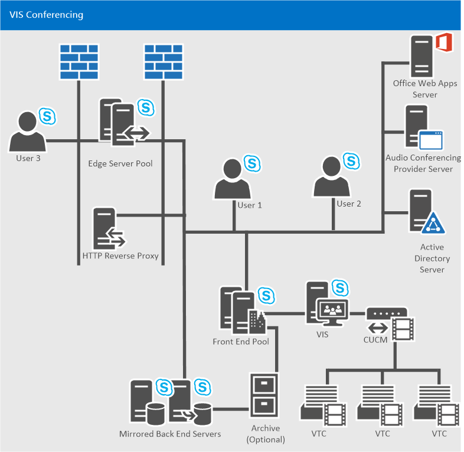

# Skype for Business Server 2015 のビデオ相互運用サーバーの計画Plan for Video Interop Server in Skype for Business Server 2015
 
**の概要:**ビジネス サーバー 2015 のサード ・ パーティ製会議デバイスに Skype を統合するために計画するときに、このトピックを確認します。**Summary:** Review this topic while planning to integrate Skype for Business Server 2015 with third-party teleconferencing devices.
  
ビジネス サーバー用の Skype を使用して、特定のサード ・ パーティ製 VTC (ビデオ会議システム) のソリューションと統合することできるようになりました。Skype for Business Server now allows you to integrate with certain third-party VTC (Video Teleconferencing System) solutions. このビデオ会議の相互運用性を可能にする新しいサーバーの役割では、ビデオの相互運用機能サーバー (VIS)、オンプレミスのインストールでのみ使用可能なスタンドアロン サーバーの役割としては現在実装されています。The new server role that enables this video conferencing interoperability is the Video Interop Server (VIS), which is currently implemented as a standalone server role available only for on-premises installations. VIS では、サード パーティ製のテレビ会議システムと、Skype ビジネス サーバーの展開の間の媒介手段として機能します。A VIS acts as an intermediary between a third party teleconference system and a Skype for Business Server deployment. このリリースでは、VIS は Cisco/Tandberg ビデオ システムとの相互運用性に焦点を合わせています。For this release, VIS is focused on interoperability with Cisco/Tandberg video systems. ビジネス サーバーのインストール、Skype でこの機能を使用するかどうかを決定するには、この資料を確認してください。Review this article to determine whether to use this feature in your Skype for Business Server installation.
  
## デバイスの相互運用性Device interoperability

相互運用性は、CUCM バージョン 10.5、および CUCM と VIS 間での TCP SIP トランクのセットアップにより、Cisco VTC でテストおよびサポートされています。Interoperation is tested and supported with Cisco VTCs registering with CUCM version 10.5 and TCP SIP trunks set up between CUCM and the VIS.
  
現在サポートされている VTC:The currently supported VTCs are:
  
- Cisco C40Cisco C40
    
- Cisco C60Cisco C60
    
- Cisco C90Cisco C90
    
- Cisco MX200Cisco MX200
    
- Cisco MX300Cisco MX300
    
- Cisco DX80Cisco DX80
    
- Cisco EX60Cisco EX60
    
- Cisco EX90Cisco EX90
    
- Cisco SX20Cisco SX20
    
> [!NOTE]
>  Cisco ソフトウェアでは、TC7.0.0 を解放またはビジネス サーバーを正常に機能するための Skype での統合のためのこれらのシステム上に必要な。Cisco software release TC7.0.0 or above is required on these systems for integration with Skype for Business Server to work as expected.
  
## SIP トランクSIP trunks

SIP トランク モードで、既存の Cisco インフラストラクチャ - たとえば、Cisco コール マネージャー (CUCM) に登録するのには、VTCs を再開する場所にビデオの相互運用機能のサーバーの機能です。The Video Interop Server functions in SIP trunk mode, where the VTCs continue to register with the existing Cisco infrastructure - for example, Cisco Call Manager (CUCM). ビデオ SIP トランクは、CUCM と VIS 間に定義されるので、2 つのシステム間で通話をルーティングできます。A video SIP trunk is defined between CUCM and the VIS so that calls can be routed between the two systems. VTC から VIS への SIP トランク上の通話のみがサポートされます。Only calls over the SIP trunk from the VTC to the VIS are supported. したがって、VTCs (電話の自動応答に関連付けられている電話番号にダイヤル)、によって、Skype のビジネス会議にダイヤルできますが、ことはできませんドラッグ アンド ドロップ、会議に。Thus, VTCs can dial into a Skype for Business conference (by dialing the phone number associated with the Call Automated Attendant), but cannot be dragged and dropped into the conference.
  

  
## 機能Features

このサーバーの役割の機能:This server role provides:
  
- ビジネス サーバー配置のサード パーティのビデオ システムと、Skype を使って H.264 形式間で変換します。Conversion between the H.264 formats used by 3rd party video systems and the Skype for Business Server deployment.
    
- ビジネス サーバーの展開について、Skype で使用するための異なる解像度の複数の同時放送がご覧のストリームに、VTC から指定された解像度で 1 つのビデオ ストリームの変換します。Conversion of a single video stream at a given resolution from a VTC into multiple simulcast streams of different resolutions for use in the Skype for Business Server deployment. これらのストリームを送信できます、AVMCU、Skype ビジネス サーバーのエンドポイントとその他のビデオ システムの異なる解像度を要求しました。These streams can be sent to the AVMCU and then to Skype for Business Server endpoints and other video systems that have requested different resolutions. この変換は、会社 A は、Skype でサード パーティのビデオ システムが含まれる場合にも使用/V 会議の呼び出しです。This conversion is also used when the third party video system is involved in a Skype for Business A/V conference call. 特定の VIS サーバーでトランス コードの制限に達すると、異なる解像度の次の要求は最低の解像度を持つストリームをのみ表示されます。Once the transcoding limit is reached in a particular VIS server, any following requests for different resolutions will only receive a stream with the lowest resolution. 
    
- CUCM ゲートウェイと、Skype のビデオの SIP トランク ビジネス Server サーバーへのビデオの相互運用機能のサポートVTCs は、Cisco ゲートウェイに登録し、ゲートウェイを介してビジネスの展開の Skype への呼び出しを開始する」に進みます。Support for a video SIP trunk between the CUCM gateway and a Skype for Business Server Video Interop Server; VTCs continue to register with the Cisco gateway, and initiate calls to the Skype for Business deployment through the gateway. コールは、ビジネス ビデオの相互運用機能のサーバー、Skype へのゲートウェイからビデオの SIP トランク経由でルーティングされます。Calls are routed from the gateway to the Skype for Business Video Interop Server over the video SIP trunk.
    
- サポートされているビデオ システムがある会議室のユーザーは、そのシステムからダイヤルして、公開または非公開の会議に参加できます。Support for a user in a conference room with a supported video system to dial from that system to join an open or closed conference. この通話は、ビデオ SIP トランクを通過します。This call will traverse the video SIP trunk.
    
- ビジネス クライアント用の Skype を呼び出すには、サポートされているビデオ システムとの会議室でユーザーをサポートします。Support for a user in a conference room with a supported video system to call a Skype for Business client. この通話は、SIP トランクを通過します。The call will traverse the SIP trunk.
    
- ビジネスのサーバー側の Skype やミュート/un mute のオーディオ、ビデオの一時停止/再開、ビデオのロックを保持と解除、保留中の呼び出しなど、ポイント ツー ポイントとマルチポイントの呼び出しはサポートされている VTC システムからコントロールを中間の呼び出しをサポートします。Support for mid-call control from the Skype for Business Server side or from the supported VTC system for both point to point and multipoint calls including mute/un-mute audio, pause/resume video, lock video, and hold/un-hold call.
    
## 既知の制限Known limitations

このサーバーの役割には、次の制限があります。This server role has the following limitations:
  
- ビデオの SIP トランク経由で VTCs にビジネスを展開するため、Skype からの新しい呼び出しはサポートされていません。New calls from the Skype for Business deployment to the VTCs over the video SIP trunk are not supported. . これは、ビデオの SIP トランク経由でビジネス展開を Skype に、VTCs からの新しい呼び出しのみがサポートされていることを意味します。This means that only new calls from the VTCs into the Skype for Business deployment are supported over the video SIP trunk. サポートされているビデオ システムの存在は使用できません、VIS. にビデオの SIP トランク経由でPresence for the supported video system will not be available over the video SIP trunk to the VIS. 
    
- ビデオ SIP トランク モードでは、スタンドアロン VIS プールのみがサポートされます。Only a standalone VIS pool will be supported for video SIP trunk mode.
    
-  ビデオ SIP トランク上の VTC と VIS 間の通信では、TLS + SRTP または TCP + RTP がサポートされます。TLS + SRTP or TCP + RTP will be supported for communications between the VTC and VIS over the video SIP trunk.
    
- アプリケーション共有はサポートされていません。Application sharing is not supported. 会議室でのビジネス ユーザーは、Skype は、Skype のラップトップ ・ コンピューターなど) のビジネス会議に参加し、VTC に関連付けられていない会議室で無料のモニターのいずれかの画面を共有するアプリケーションを表示する必要があります。A Skype for Business user in the conference room needs to join the Skype for Business conference (via a laptop for example) and display the app sharing screens on one of the free monitors in the conference room not associated with the VTC.
    
- VTC から、VIS を介してフェデレーション会議に参加することはできません。The ability for a VTC to join a federated meeting via VIS is not supported.
    
- VTC から、VIS を介してオンライン会議に参加することはできません。The ability for a VTC to join an online meeting via VIS is not supported.
    
- VTC から、VIS を介して PSTN に発信することはできません。Calls from a VTC to the PSTN via VIS are not supported.
    
- PSTN から、VIS を介して VTC に発信することはできません。Calls from the PSTN to a VTC via VIS are not supported.
    
## 復元のメカニズムResiliency mechanisms

VIS は、ビデオ SIP トランク上で実行された CUCM からの着信をサポートしています。The VIS supports incoming calls from a CUCM that are carried over a video SIP trunk. アップストリームまたはダウンストリームの接続が切断される可能性があるので、確実な復元のために、次の両方の可能性を考慮してください。It's possible to lose connectivity either upstream or downstream, so for robust resiliency consider both possibilities:
  
1. **VIS プールのフェイル オーバー**ビデオ ゲートウェイを指すメイン VIS プールがダウンしている場合は、回復はビデオのゲートウェイがトランクを VIS のプールが 2 つ (以上) に定義されている場合。**VIS Pool Failover** If the main VIS pool that the video gateway points to is down, recovery is possible if the video gateway has defined trunks to two (or more) VIS pools. ビデオ ゲートウェイ プライマリ VIS プールへの呼び出しを確立できないと判断した場合だけで、セカンダリ ・ VIS プールへの呼び出しをルーティングします。If the video gateway determines it cannot make calls to the primary VIS pool, it simply routes the calls to a secondary VIS pool.
    
     
  
    VIS プールは複数のゲートウェイへのトランクを持つことができますが、通常特定のゲートウェイできませんトランク VIS の複数のプールにトリックは、このフェイル オーバーをサポートするために実行する必要があるため: 同じビデオ ゲートウェイの IP アドレスに解決するには DNS に 2 FDQNs を定義します。A particular VIS pool can have trunks to multiple gateways, but normally a particular gateway can't have trunks to multiple VIS pools, so a trick needs to be done to support this failover: Define 2 FDQNs in DNS which resolve to the same IP address of a video gateway. 各ビデオ ゲートウェイが異なる VIS プールにトランクを持つトポロジの文書の別のビデオ ゲートウェイとして各 FQDN を表すし、リカバリが可能になりました。Represent each FQDN as a separate video gateway in the Topology Document where each video gateway has a trunk to a different VIS pool, and recovery is now possible. (TLS を使用する場合、複数の名前する必要がビデオ ゲートウェイの証明書の SAN で。)(If TLS is used, the multiple names will need to be in the SAN of the video gateway certificate.)
    
    > [!NOTE]
    > VIS は、トポロジ ドキュメントに構成されているゲートウェイからの着信のみを受けることができます。VIS only allows incoming calls from gateways configured in the Topology Document. 
  
2. **フロント エンドのフェイル オーバー**VIS プール CUCM からの呼び出しを受け取る主要な次のホップ レジストラーまたはフロント エンド プールに接続できない場合は、呼び出しは、バックアップのフロント エンド プールにルーティングされます。**Front End failover** If a VIS pool receives a call from CUCM but cannot reach its primary next-hop Registrar or Front End pool, calls are routed to a backup Front End pool.
    
     
  
    VIS はの追跡、プライマリのフロント エンド プールとそのバックアップのフロント エンド プール (トポロジ ドキュメントでは、レジストラー サービスのバックアップの設定で、設定が存在して) の状態。The VIS will keep track of the status of its primary Front End pool and its backup Front End pool (the setting is found in the backup setting for the Registrar service in the Topology Document). オプション 1 分に 1 回の投票を両方のプールに送信し、VIS 5 つの連続したエラーがある場合、[特定のフロント エンド プールがダウンするいると仮定しています。It sends Options polls once a minute to both pools, and if there are five consecutive failures the VIS assumes that a particular Front End pool is down. プライマリ フロント エンド プールは、ダウンし、存在が構成されている使用可能なようにマークされている場合バックアップ、VIS 新しい呼び出しから送信バックアップのフロント エンド プールへのゲートウェイです。If the primary Front End pool is marked as down and there is an available configured backup the VIS sends new calls from the gateway to the backup Front End pool. プライマリ フロント エンド プールが戻った後、新しい呼び出しの主なフロント エンド プールを使用して、VIS が再開されます。Once the primary Front End pool comes back, the VIS will resume using the primary Front End pool for new calls.
    
    VIS は、ビデオ SIP トランクからの通話に 10 秒間のタイマーも実装します。The VIS will also implement a 10 second timer for calls from the video SIP trunk. 主の次のホップのフロント エンド プールは、このタイマーの値、呼び出しの s のバックアップの次ホップ プロキシに送信された招待状をプールは (100 の中を含む) いくつかの SIP メッセージが応答しませんでした、ビデオの SIP トランクおよび次のホップの主要フロント エンドからの呼び出しに使用された場合なく-version は、構成されている場合に実行されます。If the primary next-hop Front End pool was used for a call from the video SIP trunk, and the primary next-hop Front End pool did not answer with some SIP message (including 100 Trying) to the Invite sent to it within this timer value, the backup next-hop proxy for the call should be tried if configured. 
    
    > [!NOTE]
    > バックアップの次のホップが最初に試行された場合、プライマリ試行されませんが、次にします。If the backup next hop was tried first, the primary will not be tried next. 
  
    管理者は、バックアップ ・ フロント エンド プールなどを使用して、保守にはプライマリのフロント エンド プール上で実行するときに VIS を強制的に Windows PowerShell のフェイル オーバー ・ コマンドを使用することも。The admin could also use the Windows PowerShell failover command to force VIS to use the backup Front End pool, for example, when maintenance has to be performed on the primary Front End pool.
    
## 同じゲートウェイ ピアに対する音声およびビデオ トランクの共存Co-existence of Voice and Video Trunks to the Same Gateway Peer

音声とビデオの SIP トランクを持つビジネス サーバー サポート用の Skype では、同一のゲートウェイ ピアを使用します。Skype for Business Server supports having voice and video SIP trunks use the same gateway peer. そのため、同じ CUCM の展開で、仲介サーバーに対する音声 SIP トランクと、VIS に対するビデオ SIP トランクを使用することができます。So the same CUCM deployment could have voice SIP trunks to the Mediation Server and video SIP trunks to VIS.
  
- 音声 SIP トランクのトポロジ ドキュメントで、特定の FQDN を指定した PSTN ゲートウェイを定義する必要があります。A PSTN Gateway will need to be defined with a particular FQDN in the Topology Document for the voice SIP trunks.
    
- PSTN ゲートウェイに対するピアは、仲介サーバーになります。The peer to the PSTN Gateway will be the Mediation Server.
    
- 必要に応じて、1 つの PSTN ゲートウェイから複数の仲介サーバー プールまで、複数の音声トランクを定義できます。Multiple voice trunks can be defines spanning from a PSTN Gateway to multiple Mediation Server pools if necessary.
    
- PSTN ゲートウェイの場合、FQDN が同じビデオ SIP トランクのトポロジ ドキュメントで、ビデオ ゲートウェイを定義する必要があります。A Video Gateway will need to be defined in the Topology Document for the video SIP trunk with the same FQDN as for the PSTN Gateway.
    
- ビデオ ゲートウェイに対するピアは VIS になります。The peer to the Video Gateway will be VIS.
    
- ビデオ ゲートウェイから特定の VIS プールに対して、1 つのビデオ トランクを定義できます。A single video trunk can be defined from a Video Gateway to a particular VIS pool.
    
- CUCM は、ビデオのトランクと音声トランク経由で呼び出しを正しくルーティングするよう構成する必要があります。CUCM will need to be configured to correctly route calls over the voice trunk vs. the video trunk. など、VTC; からダイヤルするとき特別なダイヤルのプレフィックスを使用する可能性があります。CUCM VIS への呼び出しにこの外線発信番号を関連付けることが、適切な変換規則が VIS. に SIP Invite からは、このプレフィックスを取り除きます。For example, a special dial prefix could be used when dialing from the VTC; CUCM could associate this dial prefix with calls to VIS, and appropriate translation rules would strip this prefix from the SIP Invite to VIS.
    
## Skype for Business リリースの VIS と以前のリリースの Lync との共存Co-existence of VIS in the Skype for Business Release with Previous Releases of Lync

VIS は、Skype のビジネスの展開の一部としてのみ展開できます。VIS can only be deployed as part of Skype for Business deployment. Lync 2013 の会議と、既存の配置の一部になっているクライアントと相互に操作できることこのような場合、VIS のプールを Skype VIS プールの次ホップは、レジストラーと FE のプールを含むビジネスの展開の一部である必要があります。It can interoperate with Lync 2013 conferences and clients that are a part of an existing deployment; in those cases, the VIS pool will need to be part of a Skype for Business deployment that includes a Registrar/FE pool that is the next-hop for the VIS pool.
  
VIS は、RTV と H.264 間のトランスコーディングをサポートしていません。VIS does not support transcoding between RTV and H.264. 会議に参加する Lync 2013 より前のクライアントと VTC 間にビデオの相互運用性はありません。There is no video interoperability between pre-Lync 2013 clients and VTC participants in a conference.
  
以前 Lync 2013 クライアント会議に参加することと、VTCs のビデオを受信しないモバイル クライアントが、優先度の高いスピーカーになったときに RTV を使用して送信するモバイル クライアントが発生します。Having pre-Lync 2013 clients in a conference will cause mobile clients to send using RTV resulting in VTCs receiving no video when the mobile client becomes the dominant speaker.
  
Lync 2013 を Skype のビジネス展開の一部である VIS で正常に動作するためには、Lync 2013 は、適切な CU を適用する VIS. を使用するには、Lync 2013 クライアント、CAA、および AVMCU をアップグレードする必要があります。In order for Lync 2013 to work correctly with VIS that is part of a Skype for Business deployment, Lync 2013 needs the appropriate CU to be applied that upgrades the Lync 2013 client, CAA, and AVMCU to work with VIS.
  
ビジネス デスクトップ クライアント Lync 2013 および Skype と VIS の相互運用性では、テストが完了しはサポートされています。Interoperability of VIS with Lync 2013 and Skype for Business desktop clients has been tested and is supported.
  
非デスクトップ (アプリ、Ipad、Iphone、Windows Phone、LMX など) と VIS の相互運用性VIS のリリースの時点で該当するアプリケーション ストアから利用可能なビジネス クライアント用の Skype では、テストが完了しはサポートされています。Interoperability of VIS with non-desktop (Android, Ipad, Iphone, Windows Phone, LMX, etc.) Skype for Business clients available from the applicable Apps Store at the time of VIS release has been tested and is supported.
  
## FEC を介したパケット損失からの復元Recovery from Packet Loss via FEC

FEC を有効にすると、パケット損失からの復元を補助することができます。FEC can be turned on to aid in recovery from packet loss. 有効にすると、50% 以上のビデオ帯域幅が VIS から VTC の方向に使用されます。If turned on, 50% more video bandwidth will be used in the VIS to VTC direction.
  
## VIS のサイズ設定とトランスコーディングのコストVIS Sizing and Transcoding Costs

Cisco VTC からの 1 つのビデオ ストリームを複数のサイマルキャスト ストリームに変換する処理には、CPU 能力を使います。Transcoding the single video streams from the Cisco VTC to multiple simulcast streams uses CPU capacity. 約 16 VTCs は、FE プラットフォームをお勧めする Lync 2013 のと同じで実行されている 1 つの VIS で (各 VTC から 720 p のビデオ ストリームは、720 p、360 p、180 p で 3 つの独立した同時放送がご覧ストリームには、トランス コード済みと仮定した場合)、ビデオのトランス コードを持つことができます。Approximately 16 VTCs can have their video transcoded (assuming a 720p video stream from each VTC is transcoded into 3 separate simulcast streams at 720p, 360p, and 180p) in a single VIS running on the equivalent of the Lync 2013 recommended FE platform. トランスコーディングを無効にすると、VIS の CPU が節約されます。If Transcoding is turned off, this will save on VIS CPU. ただし、VIS が要求して VTC から送信されるビデオ画像は、Skype for Business 側のすべての受信者を満たす最小限の共通解像度になります。However, the video image requested by VIS from the VTC will be the lowest common resolution to satisfy all receivers on the Skype for Business side. トランスコーディングを無効にしたとしても、VTC が送信できない低解像度を Skype for Business クライアントが要求した場合、トランスコーディングが有効になることがあります。Note that even with transcoding off, transcoding may be activated when Skype for Business clients request certain low resolutions that VTCs cannot send.
  
## ビデオ ゲートウェイから VIS への通話配信Call Distribution from the Video Gateway to VIS

配信は、CUCM 配信メカニズムのいずれかを使用して実行されます。Distribution is accomplished via one of the CUCM distribution mechanisms:
  
- DNS を使用した動的配信。Dynamically using DNS.
    
- CUCM 側では、VIS プール内の別のサーバーに各トランクが終了する、個々 のトランクを定義できます。On the CUCM side, you can define individual trunks, where each trunk terminates on a different server in the VIS pool. CUCM は、別のトランクの間で呼び出しをルーティングします。CUCM will route calls across the different trunks.
    
## ハイブリッドの相互運用性はサポート対象外No Hybrid Interoperability

オンプレミス型 VIS を介してオンライン会議に参加する VTC は、Skype for Business のサポート対象外です。Support for VTCs joining online meetings via on-premises VIS is not part of Skype for Business.
  
## フェデレーションはサポート対象外No Federation Support

VIS を介してフェデレーション会議に参加する VTC は、Skype for Business のサポート対象外です。Support for VTCs joining federated meetings via VIS is not part of Skype for Business.
  
## この手順は役に立ちましたか? 役に立った場合は、この記事の下でお知らせください。役に立たなかった場合は、わかりにくかった部分をお知らせください。いただいたフィードバックを元に手順を再確認します。See also

#### 

[ビジネス サーバー 2015 の Skype でのビデオの相互運用サーバーを展開します。Deploy Video Interop Server in Skype for Business Server 2015](../deploy/deploy-video-interop-server/deploy-video-interop-server.md)

