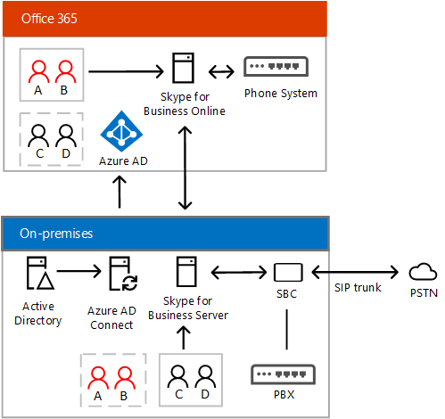

# Skype for Business Server と Skype for Business Online 間のハイブリッド接続を計画するPlan hybrid connectivity between Skype for Business Server and Skype for Business Online

**概要:** このトピックでは、Skype for Business Server と Skype for Business Online 間でハイブリッド接続を計画する方法を説明します。**Summary:** Read this topic to learn how to plan hybrid connectivity between Skype for Business Server and Skype for Business Online. 多くの Skype for Business ハイブリッド ソリューションを展開する上で、ハイブリッド接続の設定は最初に行う手順となります。Setting up hybrid connectivity is the first step in deploying many Skype for Business hybrid solutions.

ここで、概要を説明し、インフラストラクチャについて説明し、システム要件の間、既存のハイブリッド接続を構成する必要があります設置 Skype ビジネス サーバー配置の設置型で、作成したユーザーにActive Directory、およびオンライン ビジネス用の Skype です。This topic provides an overview, and describes the infrastructure and system requirements you'll need to configure hybrid connectivity between your existing on-premises Skype for Business Server deployment—with users who were created in your on-premises Active Directory—and Skype for Business Online.

このトピックには次のセクションが含まれます。This topic contains the following sections:

- [OverviewOverview](plan-hybrid-connectivity.md#BKMK_Overview)

- [インフラストラクチャの要件Infrastructure requirements](plan-hybrid-connectivity.md#BKMK_Infrastructure)

- [マルチ フォレストのサポートMulti-forest support](plan-hybrid-connectivity.md#BKMK_MultiForest)

- [Exchange との共存Exchange co-existence](plan-hybrid-connectivity.md#BKMK_Exchange)

- [管理者の資格情報Administrator credentials](plan-hybrid-connectivity.md#BKMK_Credentials)

- [Skype for Business Online PowerShellSkype for Business Online PowerShell](plan-hybrid-connectivity.md#BKMK_PowerShell)

- [Skype for Business のクライアント サポートSkype for Business client support](plan-hybrid-connectivity.md#BKMK_ClientSupport)

- [トポロジ要件Topology requirements](plan-hybrid-connectivity.md#BKMK_Topology)

- [フェデレーション許可/禁止の一覧の要件Federation Allowed/Blocked Lists requirements](plan-hybrid-connectivity.md#BKMK_Federation)

- [DNS の設定DNS settings](plan-hybrid-connectivity.md#BKMK_DNS)

- [ファイアウォールの考慮事項Firewall considerations](plan-hybrid-connectivity.md#BKMK_Firewall)

- [ポートとプロトコルの要件Port and protocol requirements](plan-hybrid-connectivity.md#BKMK_Ports)

- [ユーザー アカウントとデータUser accounts and data](plan-hybrid-connectivity.md#BKMK_UserAccounts)

- [ユーザー ポリシーと機能User policies and features](plan-hybrid-connectivity.md#BKMK_UserPolicies)

このトピックを読み終え、展開する準備が整ったら、「[Deploy hybrid connectivity between Skype for Business Server and Skype for Business Online](deploy-hybrid-connectivity/deploy-hybrid-connectivity.md)」を参照してください。After you have read this topic and are ready to deploy, see [Deploy hybrid connectivity between Skype for Business Server and Skype for Business Online](deploy-hybrid-connectivity/deploy-hybrid-connectivity.md). 展開のトピックでは、オンプレミス展開と Skype for Business Online との間でハイブリッド接続を設定するための手順について説明しています。The deployment topics provide step-by-step guidance for setting up hybrid connectivity between your on-premises deployment and Skype for Business Online.

(Lync Server 2013、ハイブリッドの Lync Server 2010 展開を構成する方法の詳細については、 [Lync Server 2013 ハイブリッド](https://go.microsoft.com/fwlink/p/?LinkId=617360)を参照してください)。(For information about configuring your Lync Server 2013 or Lync Server 2010 deployment for hybrid, see [Lync Server 2013 hybrid](https://go.microsoft.com/fwlink/p/?LinkId=617360).)

## 概要Overview

ハイブリッド ソリューションによって、スケジュールとビジネス ニーズを基に、ユーザーをクラウドに移動できます。Hybrid solutions enable you to move your users to the cloud based on your schedule and business need. このトピックでは、Skype for Business Server のオンプレミス展開と Skype for Business Online との間のハイブリッド接続を中心に説明します。This topic focuses on hybrid connectivity between an on-premises deployment of Skype for Business Server and Skype for Business Online. この接続によって、ユーザーの所属をオンプレミスやオンラインに設定できます。This connectivity allows you to have some users homed on-premises and some users homed online.

この種類の配置は「ドメインの分割」と呼ば-間を使用して Skype 社内のビジネス サーバーと Skype のオンライン ビジネス次ように分割は、contoso.com などドメイン ユーザーを意味します。This type of deployment is sometimes referred to as "split domain"—meaning users of a domain, such as contoso.com, are split between using Skype for Business Server on premises and Skype for Business Online as follows:

- オンプレミスに所属するユーザーは、オンプレミスの Skype for Business サーバーと対話しますUsers who are homed on premises interact with on premises Skype for Business servers

- オンラインに所属するユーザーは、Skype for Business Online サービスと対話しますUsers who are homed online interact with Skype for Business online services

- いずれの環境の場合も、ユーザーは、インスタント メッセージングの使用、電話会議への参加、VoIP 通話などによって、互いに共同作業できますUsers from both environments can collaborate with each other by using Instant Messaging, participating in conference calls, VoIP calls, and so on

- オンプレミスのディレクトリを Office 365 と同期させる場合は Azure Active Directory Connect が使用されますAzure Active Directory Connect is used to synchronize your on-premises directory with Office 365

オンプレミスの Active Directory は優先されるため、次のことを実行してオンプレミスおよびオンラインのユーザーが相互に検出できるようにする必要があります。The on-premises Active Directory is authoritative, which means that you must do the following to ensure that on-premises and online users are discoverable to one another:

- すべてのユーザーは、最初に、オンプレミスの Active Directory 内に作成し、Azure AD に同期する必要があります。All users should be created in the on-premises Active Directory first, and then synchronized to Azure AD.

- オンプレミスに所属していて Skype for Business を利用するユーザーについては、Skype for Business オンプレミスに対して有効化する必要があります。If your users are homed on premises for Skype for Business, then you need to enable them for Skype for Business on premises.

- オンプレミスに所属しているのに Skype Meeting Broadcast などのオンライン機能を利用したいユーザーについては、Skype for Business Online プラン 2 のライセンスを割り当てる必要があります。If your users are homed on premises, but want to take advantage of some online features, such as Skype Meeting Broadcast, you need to assign them a Skype for Business Online plan 2 license.

- Skype for Business Online に所属していて、アカウントが Azure AD に同期されたユーザーについては、Skype for Business Online プラン 2 のライセンスを割り当てる必要があります。If your users are homed in Skype for Business Online, once their account is synchronized to Azure AD, you need to assign them a Skype for Business Online plan 2 license.

- ライセンスが割り当てられた Sype for Business Online ユーザーについては、Skype for Business またはオンプレミスの Enterprise Voice を有効にする必要があります。After Skype for Business Online users are assigned a license, you need to enable them for Skype for Business or for Enterprise Voice on premises. 詳細については、[社内設置型のエンタープライズ VoIP のユーザーを有効にする](plan-your-phone-system-cloud-pbx-solution/enable-the-users-for-enterprise-voice-on-premises.md)を参照してください。For more information, see [Enable the users for Enterprise Voice on premises](plan-your-phone-system-cloud-pbx-solution/enable-the-users-for-enterprise-voice-on-premises.md). ハイブリッド音声の要件の詳細については、「[Plan Phone System in Office 365 with on-premises PSTN connectivity in Skype for Business Server](plan-your-phone-system-cloud-pbx-solution/plan-phone-system-with-on-premises-pstn-connectivity.md)」を参照してください。For more information about hybrid voice requirements, see [Plan Phone System in Office 365 with on-premises PSTN connectivity in Skype for Business Server](plan-your-phone-system-cloud-pbx-solution/plan-phone-system-with-on-premises-pstn-connectivity.md).

Active Directory の設定の詳細については、この後のセクションで説明します。You'll learn more about Active Directory configuration in the sections that follow. その前に、以下の図で使用され、ハイブリッド接続のトピックでも頻繁に使用される用語と頭字語を示します。But first, an overview of the terminology and acronyms used in the diagrams below, and in many of the hybrid connectivity topics:

- PSTN - 公衆交換電話網PSTN - Public Switched Telephone Network

- PBX - 構内交換機システムPBX - Private Branch Exchange phone system

- 電話システム - Microsoft のクラウド PBX 電話システムによるサービスPhone System - Microsoft's Cloud PBX phone system offering

- トランクの Pbx を接続するのには、PSTN テレフォニーの回線-トランクは、セッション開始プロトコル (SIP) を使用して可能性があります: インターネット プロトコル (VoIP) ボイスを A、または時分割多重 (TDM) の以前のテクノロジTrunk - Telephony line that connects PBXs to the PSTN—A trunk might use Session Initiation Protocol (SIP)—A Voice over Internet Protocol (VoIP)—or the older Time-Division Multiplexing (TDM) technology

- SBC - セッション ボーダー コントローラー - テレフォニー ネットワークにおいてファイアウォールおよびルーターとして機能するデバイス。SBC - Session Border Controller - Device that serves as a firewall and router in telephony networks. たとえば、セキュリティ、接続、相互運用性、およびサービス品質を提供します。For example, provides security, connectivity, interoperability, and Quality of Services.

- PSTN ゲートウェイ - テレフォニー ネットワークでルーターとして機能するデバイスで、セキュリティと NAT 通過以外の、SBC が実行できるほとんどのことを実行できます。PSTN gateway - A device that serves as a router in telephony networks, capable of doing most of what an SBC can do except security and NAT traversal.

次の図は、ビジネスの「ドメインの分割」のハイブリッド構成 Skype を示しています。The following diagram shows a Skype for Business "split domain" hybrid configuration. ユーザー A および B はオンラインに所属していますが、オンプレミスのユーザーによって検出可能となっています。ユーザー C および D はオンプレミスに所属していますが、オンライン ユーザーによって検出可能となっています。Users A and B are homed online but are discoverable by on-premises users; users C and D are homed on premises, but are discoverable by online users.

「ハイブリッド音声」という用語に馴染みがある場合もあるかもしれません。これは、クラウドに所属しているユーザーに機能を提供するオンプレミスの音声トランクのことです。You might also be familiar with the term "hybrid voice"—which refers to on-premises voice trunks that provide functionality to users homed in the cloud. ハイブリッド音声によって、オンプレミスの音声構成を保持しながらクラウドに移行できます。Hybrid voice enables migration to the cloud while preserving on-premises voice configuration. Skype for Business Server がすでに展開されている場合、ハイブリッド音声を有効にするために最初に行う手順は、分割ドメイン環境の設定となります。If you already have a Skype for Business Server deployment, the first step to enable hybrid voice is to configure a split domain environment.

たとえば、会社が最低限の PBX を必要とする組織をサポートする大規模な携帯電話番号フィールドには音声ですが、多くのスマート フォンを使用します。For example, assume your company has a large mobile field support organization that requires minimal PBX voice, but extensive smart phone use. このような場合、これらのユーザーをクラウドに移動して、Office 365 における Microsoft の電話システム (クラウド PBX) を利用することが考えられます。You might choose to move these users to the cloud to take advantage of Microsoft's Phone System in Office 365 (Cloud PBX). また、会社、設置型の PBX の一部としてコミュニケーション センターの高度で複雑なソフトウェアを必要とする大規模な設置型のコール センターの場合は、施設内でこれらのユーザーのままにすることもできます。If your company also has a large on-premises call center that requires advanced, complex contact center software as part of your on-premises PBX, you might choose to leave these users on premises. オンライン、オンプレミスに所属するいずれのユーザーも、オンプレミス展開によって PSTN 接続を利用できます。Users homed online and on premises both have PSTN connectivity through your on-premises deployment.

次の図に Skype for Business のハイブリッド音声展開を示します。The following diagram shows a Skype for Business hybrid voice deployment:

ハイブリッド音声ソリューション ビジネス サーバーの展開について、Skype での設定に関する詳細については、 [Skype のビジネス サーバーの PSTN への接続をオンプレミスと Office 365 の電話システムの計画](plan-your-phone-system-cloud-pbx-solution/plan-phone-system-with-on-premises-pstn-connectivity.md)を参照してください。For more information about setting up a hybrid voice solution with your Skype for Business Server deployment, see [Plan Phone System in Office 365 with on-premises PSTN connectivity in Skype for Business Server](plan-your-phone-system-cloud-pbx-solution/plan-phone-system-with-on-premises-pstn-connectivity.md).

統合するためのハイブリッド展開を構成することも、オンプレミス Exchange、SharePoint、または、Microsoft Office 365 アプリケーションと Exchange Online と SharePoint Online を含みます。You can also configure hybrid deployments for integration with on-premises Exchange and SharePoint, or with Microsoft Office 365 applications, including Exchange Online and SharePoint Online. Cloud Connector エディションを使用して、フル機能の Skype for Business Server 展開を必要としないハイブリッド音声ソリューションを設定することもできます。You can also configure a hybrid voice solution that does not require a full Skype for Business Server deployment by using Cloud Connector Edition. ハイブリッド ソリューションのビジネスおよび計画のためのすべての Skype の詳細については、クラウドへの移行では、[ハイブリッド ソリューションのビジネス用の Skype](skype-for-business-hybrid-solutions.md)を参照してください。For more information about all Skype for Business hybrid solutions and planning your move to the cloud, see [Skype for Business hybrid solutions](skype-for-business-hybrid-solutions.md).

## インフラストラクチャの要件Infrastructure requirements

Skype for Business Server と Skype for Business Online との間でハイブリッド接続を実装および展開するには、次の項目を環境に構成する必要があります。To implement and deploy hybrid connectivity between Skype for Business Server and Skype for Business Online, you must configure the following in your environment:

- 1 つ設置 Skype のビジネス サーバーまたはサポートされているトポロジに展開されている Lync Server の展開です。A single on-premises deployment of Skype for Business Server or Lync Server that is deployed in a supported topology. このトピックでは、[トポロジの要件](plan-hybrid-connectivity.md#BKMK_Topology)を参照してください。See [Topology requirements](plan-hybrid-connectivity.md#BKMK_Topology) in this topic.

    > [!NOTE]
    > オンプレミス環境に存在するすべての SIP ドメインは、Office 365 のテナントと逆でも存在する必要があります。Every SIP domain that exists in your on-premises environment must also exist in your Office 365 tenant and vice-versa. のみいくつかの SIP ドメインをオンラインができませんし、いくつかのドメインの設置型のみです。You cannot have some SIP domains online only and some domains on-premises only. それ以外の場合、プレゼンス、IM、およびその他の機能が正しく動作しません。Otherwise, presence, IM and other features will not work correctly.

- 有効にし、ビジネス オンラインの Skype での Microsoft Office 365 テナントです。A Microsoft Office 365 tenant with Skype for Business Online enabled.

    > [!NOTE]
    > オンプレミス展開があるハイブリッド構成には、1 つのテナントしか使用できません。You can use only a single tenant for a hybrid configuration with your on-premises deployment.

- サーバー 2015 のビジネス管理ツールの Skype です。Skype for Business Server 2015 administrative tools. (Lync Server 2013 または Lync Server 2010 を使用する場合することができます、Lync Server 2013 管理ツールを使用します。(If you are using Lync Server 2013 or Lync Server 2010, you can use the Lync Server 2013 administrative tools. について詳細については、「 [Lync Server 2013 ハイブリッド](https://go.microsoft.com/fwlink/p/?LinkId=617360))For more information, see [Lync Server 2013 hybrid](https://go.microsoft.com/fwlink/p/?LinkId=617360).)

- オンプレミスのディレクトリを Office 365と同期させる Azure Active Directory Connect。Azure Active Directory Connect to synchronize your on-premises directory with Office 365. 詳細については「[Active Directory を Azure Active Directory と接続する](https://docs.microsoft.com/azure/active-directory/connect/active-directory-aadconnect-accounts-permissions)」を参照してください。For more information, see [Connect Active Directory with Azure Active Directory](https://docs.microsoft.com/azure/active-directory/connect/active-directory-aadconnect-accounts-permissions).

    ユーザーがオンプレミスで使用するものと同じログイン資格情報を使用できるように Office 365 でのシングル サインオンをサポートする場合、Azure Active Directory (AAD) Connect のパスワード同期機能を使用できます。 また、Office 365 でのシングル サインオンに Active Directory フェデレーション サービス (AD FS) を使用することもできます。 To support Single Sign-on with Office 365 so that users can use the same login credentials as they do for on premises, you can use the password sync features of Azure Active Directory (AAD) Connect. You can also use Active Directory Federation Services (AD FS) for single sign-on with Office 365.

- オンプレミスの Skype for Business 展開と Office 365 テナントとの間の有効なフェデレーション。Enabled federation between your on-premises Skype for Business deployment and your Office 365 tenant. フェデレーションにより、組織で Office 365 のユーザーと通信する設置型展開でユーザーです。Federation allows users in your on-premises deployment to communicate with Office 365 users in your organization. 詳細については、「[Configure federation with Skype for Business Online](deploy-hybrid-connectivity/configure-federation-with-skype-for-business-online.md)」を参照してください。For more information, see [Configure federation with Skype for Business Online](deploy-hybrid-connectivity/configure-federation-with-skype-for-business-online.md).

- 有効な、共有されたセッション開始プロトコル (SIP) アドレス空間。Enabled shared Session Initiation Protocol (SIP) address space. SIP アドレスは、電話番号や電子メール アドレスに似ている、ネットワーク上の各ユーザーの一意の識別子です。A SIP address is a unique identifier for each user on a network, similar to a phone number or an email address. オンライン ビジネスのユーザーを設置から Skype に移動しようとすると、前に、社内設置型展開と共有のセッション開始プロトコル (SIP) アドレス空間を共有するのには、Office 365 のテナントを構成する必要があります。Before you try to move users from on-premises to Skype for Business Online, you'll need to configure your Office 365 tenant to share the Shared Session Initiation Protocol (SIP) address space with your on-premises deployment. 詳細については、「[Configure federation with Skype for Business Online](deploy-hybrid-connectivity/configure-federation-with-skype-for-business-online.md)」を参照してください。For more information, see [Configure federation with Skype for Business Online](deploy-hybrid-connectivity/configure-federation-with-skype-for-business-online.md).

## マルチ フォレストのサポートMulti-forest support

ユーザーは、次の要件が満たされれば、別のフォレストで Skype for Business の機能にアクセスできます。Users can access Skype for Business functionality in another forest if the following requirements are met:

- ユーザーが、Skype for Business をホストするフォレストに適切に同期されている。ハイブリッド構成において、これはユーザーが無効化されたユーザー オブジェクトとして同期される必要があることを意味します。Users are properly synchronized into the forest that hosts Skype for Business: In hybrid configurations, this means that users must be synchronized as disabled user objects.

- Skype for Business をホストするフォレストは、ユーザーを含むフォレストを信頼する必要があります。The forest hosting Skype for Business must trust the forest containing the users.

ハイブリッドの複数のフォレスト シナリオの詳細については、[ハイブリッド ビジネスの Skype の複数のフォレスト環境の構成](deploy-hybrid-connectivity/configure-a-multi-forest-environment-for-hybrid.md)を参照してください。For details on multi-forest hybrid scenarios, see [Configure a multi-forest environment for hybrid Skype for Business](deploy-hybrid-connectivity/configure-a-multi-forest-environment-for-hybrid.md).

## Exchange との共存Exchange co-existence

Exchange との共存をサポートする場合は、以下の点に留意してください。To support co-existence with Exchange, keep the following in mind:

- Exchange のオンライン ホーム ビジネスのためのユーザーの Skype を移動する前にユーザーのメールボックスを移動することをお勧めします。The best practice is to move the user's mailbox to Exchange Online before moving the user's Skype for Business home.

- オンプレミスに Exchange のメールボックスがあるユーザーについては、次の既知の制限付きでサポートされます。Users with Exchange mailboxes on premises are supported with following known limitations:

  - クライアントのサインオン: ユーザーは、SfB クライアントのサインオン中に 2 回サインオンする必要がある場合があります。Client sign on: Users may need to sign on twice during SfB client sign on

  - サーバー側会話の履歴、アーカイブ、統合連絡先ストア、HighRes 写真が Exchange 2013 以降を必要とし、サーバー間の通信に OAuth サーバーを有効にする必要があります。Server side conversation history, Archiving, Unified Contact Store, HighRes Photo requires Exchange 2013 or later, and you must enable OAuth Server to Server communication. 詳細については、[管理サーバーからサーバーへの認証 (OAuth) とビジネス サーバー 2015 の Skype のパートナーのアプリケーション](https://technet.microsoft.com/en-us/library/jj204817.aspx)を参照してください。For more information, see [Manage server-to-server authentication (OAuth) and partner applications in Skype for Business Server 2015](https://technet.microsoft.com/en-us/library/jj204817.aspx).

オンプレミスとオンラインのさまざまな組み合わせに関するサポートの条件および制限を含む、Exchange Server との共存に関する詳細については、[Plan to integrate Skype for Business and Exchange](../plan-your-deployment/integrate-with-exchange/integrate-with-exchange.md) の「[機能のサポート](../plan-your-deployment/integrate-with-exchange/integrate-with-exchange.md#feature_support)」を参照してください。For details on co-existence with Exchange Server, including support criteria and limitations in various combinations of on-premises and online, see [Feature support](../plan-your-deployment/integrate-with-exchange/integrate-with-exchange.md#feature_support) in [Plan to integrate Skype for Business and Exchange](../plan-your-deployment/integrate-with-exchange/integrate-with-exchange.md).

## 管理者の資格情報Administrator credentials

管理者の資格情報を提供するメッセージが表示されたらを使用してユーザー名とパスワード管理者アカウントに、Office 365 テナントのです。When you are asked to provide your administrator credentials, use the username and password for the administrator account for your Office 365 tenant. フェデレーション、ディレクトリ同期、シングル サインオン、および移動ユーザーが Skype のオンライン ビジネスの Azure Active Directory を構成するときにも、これらの資格情報を使用します。You will also use these credentials when you configure Azure Active Directory for federation, directory synchronization, single sign-on, and moving users to Skype for Business Online.

## Skype for Business Online PowerShellSkype for Business Online PowerShell

管理者には、オンライン ビジネス、オンライン ビジネスのユーザー アカウントに対して、Skype の Skype を管理するために Windows PowerShell を使用する機能があるようになりました。Administrators now have the ability to use Windows PowerShell to manage Skype for Business Online and their Skype for Business Online user accounts. これを行うには、まずダウンロードして、Microsoft ダウンロード センターからオンライン コネクタ モジュールをビジネス用の Skype をインストールします。To do this, you must first download and install the Skype for Business Online Connector Module from the Microsoft Download Center. ダウンロードの詳細については、インストール、およびコネクタ モジュールのオンライン ビジネス、およびビジネスのオンラインでの Skype を管理するために Windows PowerShell を使用しての詳細については、Skype を使用するを参照してください[Skype のビジネスを管理するために Windows PowerShell を使用します。オンライン](https://technet.microsoft.com/library/dn362831.aspx)です。For more information on downloading, installing, and using the Skype for Business Online Connector Module, and for detailed information on using Windows PowerShell to manage Skype for Business Online, see [Using Windows PowerShell to manage Skype for Business Online](https://technet.microsoft.com/library/dn362831.aspx).

## Skype for Business のクライアント サポートSkype for Business client support

クライアントでサポートされる機能には違いがあります。また、オンプレミス環境とオンライン環境で使用できる機能にも違いがあります。There are some differences in the features supported in clients, as well as the features available in on-premises and online environments. 次のクライアントは、ハイブリッド展開で、Skype で、ビジネスをオンラインでサポートされます。The following clients are supported with Skype for Business Online in a hybrid deployment:

- Skype for BusinessSkype for Business

- Lync 2013Lync 2013

- Lync 2010Lync 2010

- Lync Windows ストア アプリLync Windows Store app

- Lync Web AppLync Web App

- Lync MobileLync Mobile

- Lync for Mac 2011Lync for Mac 2011

- Lync ルームのシステムとビジネス ルーム システムの SkypeLync Room System and Skype for Business Room System

- Lync Basic 2013Lync Basic 2013

- Microsoft Surface HubMicrosoft Surface Hub

ホーム ユーザー、組織内を決定する前に、クライアントのサポート、さまざまな Skype のビジネスのサーバーの構成を決定する[ビジネス用の Skype のデスクトップ クライアントの機能の比較](../plan-your-deployment/clients-and-devices/desktop-feature-comparison.md)を表示します。Before you decide where you want to home users in your organization, you should review the [Desktop client feature comparison for Skype for Business](../plan-your-deployment/clients-and-devices/desktop-feature-comparison.md) to determine the client support for the various configurations of Skype for Business Server. 以下の項目もご覧ください。See also:

- [クライアントおよびデバイスの計画Plan for clients and devices](../plan-your-deployment/clients-and-devices/clients-and-devices.md)

- [Skype for Business のモバイル クライアント機能の比較Mobile client feature comparison for Skype for Business](../plan-your-deployment/clients-and-devices/mobile-feature-comparison.md)

## トポロジ要件Topology requirements

Skype でオンライン ビジネスのハイブリッド展開を構成するには、次のサポートされているトポロジのいずれかである必要があります。To configure your deployment for hybrid with Skype for Business Online, you need to have one of the following supported topologies:

- ビジネス サーバー 2015 の Skype を実行しているすべてのサーバーとサーバー 2015 のビジネス展開するための Skype です。A Skype for Business Server 2015 deployment with all servers running Skype for Business Server 2015.

- Lync Server 2013 を実行しているすべてのサーバーに Lync Server 2013 展開します。A Lync Server 2013 deployment with all servers running Lync Server 2013.

    ハイブリッド音声接続では、フェデレーション エッジとして指定されるエッジ サーバーは Skype for Business 2015 である必要があり、エッジにはバックエンドの Skype for Business Server も必要となります。For hybrid voice connectivity, the Edge Server that is designated as Federation Edge must be Skype for Business 2015, the Edge also requires a Skype for Business Server backend. ユーザーのいないプールを持つことができます。You might have a pool with no users on it.

- Lync Server 2010 を最新の累積的な更新プログラムを実行しているすべてのサーバーに Lync Server 2010 展開します。A Lync Server 2010 deployment with all servers running Lync Server 2010 with the latest cumulative updates.

  - エッジ サーバーのフェデレーションおよびエッジ サーバーのフェデレーションからの次ホップ サーバーする必要があります実行している Lync Server 2010 を最新の累積的な更新プログラム。The federation Edge Server and next hop server from the federation Edge Server must be running Lync Server 2010 with the latest cumulative updates.

  - ビジネス サーバー 2015 または Lync Server 2013 の管理ツールの Skype が少なくとも 1 つのサーバーまたは管理ワークステーション上にインストールしなければなりません。The Skype for Business Server 2015 or Lync Server 2013 Administrative Tools must be installed on at least one server or management workstation.

- 混合 Lync Server 2013、Skype ビジネス サーバー 2015 の Skype を実行するには、少なくとも 1 つのサイトで次のサーバーの役割を持つサーバー 2015 のビジネス展開に。A mixed Lync Server 2013 and Skype for Business Server 2015 deployment with the following server roles in at least one site running Skype for Business Server 2015:

  - 少なくとも 1 台のエンタープライズ プールまたは Standard Edition サーバー At least one Enterprise Pool or Standard Edition server

  - SIP フェデレーションに関連づけられたディレクター プール (もしあれば)The Director Pool associated with SIP federation, if it exists

  - SIP フェデレーションに関連づけられたエッジ プール (もしあれば)The Edge Pool associated with SIP federation

- 混合 Lync Server 2010、Skype ビジネス サーバー 2015 の Skype を実行するには、少なくとも 1 つのサイトで次のサーバーの役割を持つサーバー 2015 のビジネス展開に。A mixed Lync Server 2010 and Skype for Business Server 2015 deployment with the following server roles in at least one site running Skype for Business Server 2015:

  - 少なくとも 1 台のエンタープライズ プールまたは Standard Edition サーバー At least one Enterprise Pool or Standard Edition server

  - SIP フェデレーションに関連づけられたディレクター プール (もしあれば)The Director Pool associated with SIP federation, if it exists

  - サイトの SIP フェデレーションに関連づけられたエッジ プールThe Edge Pool associated with SIP federation for the Site

- Lync Server 2013 を実行している少なくとも 1 つのサイトで次のサーバーの役割を組み合わせた Lync Server 2010 および Lync Server 2013 展開します。A mixed Lync Server 2010 and Lync Server 2013 deployment with the following server roles in at least one site running Lync Server 2013:

  - サイトの少なくとも 1 台のエンタープライズ プールまたは Standard Edition サーバーAt least one Enterprise Pool or Standard Edition server in the site

  - SIP フェデレーションに関連づけられたディレクター プール (もしサイトにあれば)The Director Pool associated with SIP federation, if it exists in the site

  - サイトの SIP フェデレーションに関連づけられたエッジ プールThe Edge Pool associated with SIP federation for the site

## フェデレーション許可/禁止の一覧の要件Federation Allowed/Blocked Lists requirements

許可されたドメイン] ボックスの一覧には、構成されているパートナー エッジ完全修飾ドメイン名 (FQDN) を持つドメインが含まれています。The Allowed domains list includes domains that have a partner Edge fully qualified domain name (FQDN) configured. これらは、許可されたパートナー サーバー ordirect のフェデレーション パートナーと呼ばれます。These are sometimes referred to as allowed partner servers ordirect federation partners. 開いているフェデレーションと終了と呼ばれるパートナー探索 andallowed パートナー ドメイン リストでは、それぞれ、設置型展開でフェデレーションの違いを理解する必要があります。You should be familiar with the difference between Open Federation and Closed Federation, referred to as partner discovery andallowed partner domain list, respectively, in on-premises deployments.

ハイブリッド展開を正しく構成するには、次の必要条件を満たす必要があります。The following requirements must be met to successfully configure a hybrid deployment:

- オンプレミス展開と Office 365 テナントでドメイン マッチングの構成を同一にする必要があります。オンプレミス展開でパートナーの検出が有効になっている場合、オンライン テナントではオープン フェデレーションを有効にする必要があります。パートナーの検出が無効になっている場合、オンライン テナントではクローズド フェデレーションを構成する必要があります。Domain matching must be configured the same for your on-premises deployment and your Office 365 tenant. If partner discovery is enabled on the on-premises deployment, then open federation must be configured for your online tenant. If partner discovery is not enabled, then closed federation must be configured for your online tenant.

- オンプレミス展開における禁止ドメインの一覧はオンライン テナントの禁止ドメインの一覧と正確に一致する必要があります。The Blocked domains list in the on-premises deployment must exactly match the Blocked domains list for your online tenant.

- オンプレミス展開における許可ドメインの一覧はオンライン テナントの許可ドメインの一覧と正確に一致する必要があります。The Allowed domains list in the on-premises deployment must exactly match the Allowed domains list for your online tenant.

- オンラインのテナントは、コントロール パネルのオンライン ビジネスを Skype を使用して構成されているため、外部との連絡には、フェデレーションを有効にする必要があります。Federation must be enabled for the external communications for the online tenant, which is configured by using the Skype for Business Online Control Panel.

## DNS の設定DNS settings

ハイブリッド展開用の DNS レコードを作成するには、外部の DNS レコードをビジネスのすべての Skype はオンプレミス インフラストラクチャを指し示します。When creating DNS records for hybrid deployments, all Skype for Business external DNS records should point to the on-premises infrastructure. 必要な DNS レコードの詳細については、 [Skype のビジネス サーバー 2015 の DNS の要件](../plan-your-deployment/network-requirements/dns.md)を参照してください。For details on required DNS records, please refer to [DNS requirements for Skype for Business Server 2015](../plan-your-deployment/network-requirements/dns.md).

さらに、次の表で説明している DNS 解決が使用しているオンプレミス展開で機能することを確認する必要があります。Additionally you need to ensure that the DNS resolution described in the following table works in your on-premises deployment:

|DNS レコードDNS record    |解決方法Resolvable by    |DNS 要件DNS requirement    |
|:-----|:-----|:-----|
|_Sipfederationtls._tcp の DNS SRV レコードです。\<sipdomain.com\>サポートされているすべての SIP ドメインがアクセス エッジの外部 IP(s) に解決するためDNS SRV record for _sipfederationtls._tcp.\<sipdomain.com\> for all supported SIP domains resolving to Access Edge external IP(s)    |エッジ サーバーEdge server(s)    |ハイブリッド展開でフェデレーション通信を有効にする。オンプレミスとオンラインで分割される SIP ドメイン用のフェデレーション トラフィックのルートをエッジ サーバーで認識している必要があります。Enable federated communication in a hybrid configuration. The Edge Server needs to know where to route federated traffic for the SIP domain that is split between on premises and online.    ユーザー名のドメインと SRV レコードの間で一致する厳密な DNS 名を使用する必要があります。Must use strict DNS name matching between the domain in the user name and the SRV record.    |
|エッジ Web 会議サービス FQDN の DNS A レコード、たとえば、webcon.contoso.com は Web 会議のエッジ外部 IP に解決されるDNS A record(s) for Edge Web Conferencing Service FQDN, e.g. webcon.contoso.com resolving to Web Conferencing Edge external IP(s)    |ユーザーのコンピューターが社内ネットワークに接続されています。Internal corporate network connected users' computers    |オンライン ユーザーを有効にして、オンプレミスのホストされた会議でのコンテンツを提供または表示する。コンテンツには、PowerPoint ファイル、ホワイトボード、投票、および共有メモがあります。Enable online users to present or view content in on-premises hosted meetings. Content includes PowerPoint files, whiteboards, polls, and shared notes.    |

所属する組織での DNS の構成方法によっては、内部 DNS 解決をこれらのレコードに適用するために、対応する SIP ドメインに対して組織内でホストする DNS ゾーンにこれらのレコードを追加する必要があります。Depending on how DNS is configured in your organization, you may need to add these records to the internal hosted DNS zone for the corresponding SIP domain(s) to provide internal DNS resolution to these records.

[!NOTE] _sipfederationtls._tcp。\<sipdomain.com\>からエッジ サーバーの SRV レコードの解決は、ハイブリッド構成に必要な。_sipfederationtls._tcp.\<sipdomain.com\> SRV record resolution from the Edge Server is required for hybrid configuration. エッジ サーバーがこれらのレコードを解決できない場合、オンプレミスのユーザーは、プレゼンスを参照するか、オンラインのユーザーと通信することはできません。If the Edge Server cannot resolve these records, the on-premises users will not be able to see the presence or communicate with online users.

## ファイアウォールの考慮事項Firewall considerations

ネットワーク上のコンピューターは、標準のインターネット DNS 参照を実行できる必要があります。これらのコンピューターが標準のインターネット サイトに接続できれば、ネットワークはこの要件を満たしています。Computers on your network must be able to perform standard Internet DNS lookups. If these computers can reach standard Internet sites, your network meets this requirement.

Microsoft Online Services のデータ ・ センターの場所、によって、ワイルドカード ドメイン名に基づいて接続を許可するのには、ネットワークのファイアウォール デバイスを構成する必要がありますも (からのすべてのトラフィックは、 \*. outlook.com)。Depending on the location of your Microsoft Online Services data center, you must also configure your network firewall devices to accept connections based on wildcard domain names (for example, all traffic from \*.outlook.com). 組織のファイアウォールはワイルドカードの名前の構成をサポートしていない場合は、許可したい IP アドレスの範囲、指定されたポートを手動で確認する必要があります。If your organization's firewalls do not support wildcard name configurations, you will have to manually determine the IP address ranges that you would like to allow and the specified ports.

詳細については、「[Office 365 URL および IP アドレス範囲](https://go.microsoft.com/fwlink/p/?LinkId=252942)」を参照してください。For more information, see [Office 365 URLs and IP address ranges](https://go.microsoft.com/fwlink/p/?LinkId=252942).

## ポートとプロトコルの要件Port and protocol requirements

内部通信に必要なポートのほかに、次のポートも構成して、ハイブリッド接続を有効にする必要があります。In addition to the port requirements for internal communication, you must also configure the following ports to enable hybrid connectivity:

|プロトコルProtocol|TCP または UDPTCP or UDP|発信元 IP アドレスSource IP|送信先 IP アドレスDestination IP|発信元ポートSource Port|送信先ポートDestination Port|**メモ****Notes**|
|:-----|:-----|:-----|:-----|:-----|:-----|:-----|
|SIP (MTLS)SIP (MTLS)    |TCPTCP    |アクセス エッジAccess Edge    |Office 365Office 365    |任意Any    |50615061    |信号Signaling    |
|SIP (MTLS)SIP (MTLS)    |TCPTCP    |Office 365Office 365    |アクセス エッジAccess Edge    |任意Any    |50615061    |信号Signaling    |
|STUNSTUN    |TCPTCP    |音声ビデオ エッジA/V Edge    |Office 365Office 365    |50000 - 5999950000-59999    |443443    |音声、ビデオ、アプリケーション共有セッションで開くOpen for audio, video, application sharing sessions    |
|STUNSTUN    |TCPTCP    |Office 365Office 365    |音声ビデオ エッジA/V Edge    |50000 - 5999950000-59999    |443443    |音声、ビデオ、アプリケーション共有セッションで開くOpen for audio, video, application sharing sessions    |
|STUNSTUN    |UDPUDP    |音声ビデオ エッジA/V Edge    |Office 365Office 365    |34783478    |34783478    |音声、ビデオセッションで開くOpen for audio, video sessions    |
|STUNSTUN    |UDPUDP    |Office 365Office 365    |音声ビデオ エッジA/V Edge    |34783478    |34783478    |音声、ビデオセッションで開くOpen for audio, video sessions    |

ポートとファイアウォールがエッジ サーバーの計画に関する詳細については、 [Skype のビジネス サーバー 2015 でエッジ サーバー環境の要件](../plan-your-deployment/edge-server-deployments/edge-environmental-requirements.md)を参照してください。For more information about port and firewall planning for Edge Server, see [Edge Server environmental requirements in Skype for Business Server 2015](../plan-your-deployment/edge-server-deployments/edge-environmental-requirements.md). 「[Port and protocol requirements for servers](../plan-your-deployment/network-requirements/ports-and-protocols.md)」および「[プロトコル負荷の図](https://go.microsoft.com/fwlink/p/?LinkId=550989)」も参照してください。See also [Port and protocol requirements for servers](../plan-your-deployment/network-requirements/ports-and-protocols.md) and the [Protocol workloads diagram](https://go.microsoft.com/fwlink/p/?LinkId=550989).

## ユーザー アカウントとデータUser accounts and data

ハイブリッド展開では、オンライン ホームを使用するすべてのユーザー必要があります最初に作成、設置型展開で Active Directory ドメイン サービスのユーザー アカウントが作成されるようにします。In a hybrid deployment, any user that you want to home online must first be created in the on-premises deployment, so that the user account is created in Active Directory Domain Services. ビジネス、オンライン ユーザーの連絡先リストを移動するために Skype のユーザーを移動できます。You can then move the user to Skype for Business Online, which will move the user's contact list.

設置型展開と AAD の接続を使用してオンラインのテナント間でのユーザー アカウントを同期するときする必要がありますビジネスまたは Lync のユーザー、組織内のすべての Skype の AD のアカウントを同期する場合でも、ユーザーがオンラインに移動できません。When you synchronize user accounts between your on-premises deployment and online tenant using AAD Connect, you need to synchronize the AD accounts for all Skype for Business or Lync users in your organization, even if users are not moved to online. すべてのユーザーを同期しない場合、組織のオンプレミス展開のユーザーとオンライン ユーザーとの間の通信が正常に動作しない可能性があります。If you do not synchronize all users, communication between on-premises and online users in your organization may not work as expected.

> [!IMPORTANT]
> すべてのユーザーの管理を含むユーザーがビジネスのオンラインでの設置と Skype との間に移動行う必要があります管理ツールのインストールされている最新のバージョンを使用します。All user management, including user moves between on-premises and Skype for Business Online, must be done using the latest installed version of the administrative tools. 管理ツールは、既存のオンプレミスに展開して、インターネットにアクセスを接続するには別のサーバーにインストールしなければなりません。The administrative tools must be installed on a separate server that has connect access to the existing on-premises deployment and to the Internet. [Csuser からの移動](https://docs.microsoft.com/powershell/module/skype/move-csuser?view=skype-ps)、ビジネス オンラインの Skype をオンプレミス環境のユーザーを移動するコマンドレットは、社内設置型の展開に接続されている管理ツールから実行してください。The cmdlet to move users from your on-premises deployment to Skype for Business Online, [Move-CsUser](https://docs.microsoft.com/powershell/module/skype/move-csuser?view=skype-ps), must be run from the administrative tools connected to your on-premises deployment. ユーザーの移動の詳細については、[ビジネス オンラインの Skype への設置型からユーザーを移動する](deploy-hybrid-connectivity/move-users-from-on-premises-to-skype-for-business-online.md)を参照してください。For more information about moving users, see [Move users from on premises to Skype for Business Online](deploy-hybrid-connectivity/move-users-from-on-premises-to-skype-for-business-online.md).

> [!IMPORTANT]
> Office 365 のオンライン ポータルを使用してユーザーを作成した場合、ユーザー アカウントはオンプレミスの Active Directory と同期されず、ユーザーはオンプレミスの Active Directory には存在しません。 オンライン テナントでユーザーを作成済みで、オンプレミス展開を使用してハイブリッドを構成する場合は、「オンラインからオンプレミスへのユーザーの移動」を参照してください。If the user was created by using the online portal for Office 365, the user account will not be synchronized with on-premises Active Directory, and the user will not exist in the on-premises Active Directory. If you have already created users in your online tenant, and want to configure hybrid with an on-premises deployment, see Move users from online to on premises.

> [!NOTE]
> 設置型展開で有効になっていないビジネス オンラインの Skype の有効なユーザーを持っているオンライン ビジネスのお客様に、Skype で現在開いている場合は、[ビジネス上でオンラインに設置型の Skype のユーザーの移動](deploy-hybrid-connectivity/move-users-from-skype-for-business-online-to-on-premises.md)を参照してください。If you are currently a Skype for Business Online customer who has users enabled for Skype for Business Online who have not been enabled in an on-premises deployment, see [Move users from Skype for Business Online to on premises](deploy-hybrid-connectivity/move-users-from-skype-for-business-online-to-on-premises.md).

また、ハイブリッド展開を計画する場合は、次のユーザー関連の問題も考慮する必要があります。You should also consider the following user-related issues when planning for a hybrid deployment.

- **ユーザーの連絡先**Skype のオンライン ビジネスのユーザーの連絡先の制限は、250 です。**User contacts** The limit for contacts for Skype for Business Online users is 250. その番号以外のすべての連絡先は、オンライン ビジネスの Skype にアカウントを移動すると、ユーザーの連絡先リストから削除されます。Any contacts beyond that number will be removed from the user's contact list when the account is moved to Skype for Business Online.

- **インスタント メッセージングとプレゼンス**ユーザーの連絡先リスト、グループ、およびアクセス制御リスト (Acl) は、ユーザー アカウントに移行されます。**Instant Messaging and Presence** User contact lists, groups, and access control lists (ACLs) are migrated with the user account.

- **会議データ、会議コンテンツ、およびスケジュールされたミーティング**このコンテンツは、ユーザー アカウントには移行されません。**Conferencing data, meeting content, and scheduled meetings** This content is not migrated with the user account. 自分のアカウントは、ビジネス オンラインの Skype に移行した後、ユーザーは会議を再スケジュールする必要があります。Users must reschedule meetings after their accounts are migrated to Skype for Business Online. 会議の移行サービスは自動的にビジネス オンラインまたはチームに対して、ビジネス サーバーは、Skype から Skype へ移行する場合、[会議の移行サービスを使用して](https://docs.microsoft.com/en-us/skypeforbusiness/audio-conferencing-in-office-365/setting-up-the-meeting-migration-service-mms)参照してください。The Meeting Migration Service will do this automatically when migrating from a Skype for Business server to Skype for Business Online or Teams, see [Using the Meeting Migration Service](https://docs.microsoft.com/en-us/skypeforbusiness/audio-conferencing-in-office-365/setting-up-the-meeting-migration-service-mms).

## ユーザー ポリシーと機能User policies and features

- ハイブリッド環境では、ユーザーに対してインスタント メッセージングおよび会議のオンプレミスまたはオンラインでの使用を許可できますが、両方を同時に許可することはできません。In a hybrid environment, users can be enabled for Instant Messaging and conferencing (meetings) either on premises or online, but not both simultaneously.

- **クライアントのサポート**一部のユーザーは、オンライン ビジネスの Skype を移動したとき、クライアントの新しいバージョンにすることがあります。**Client support** Some users may require a new client version when they are moved to Skype for Business Online. Office 通信 Server 2007 R2、ユーザーのオンライン ビジネスの Skype に移行する前に、ビジネスのサーバーまたは Lync Server 2013 プール、Skype を移動しなければなりません。For Office Communications Server 2007 R2, users must be moved to a Skype for Business Server or Lync Server 2013 pool prior to migration to Skype for Business Online.

- **設置ポリシーおよび構成 (ユーザーではない)** オンラインと設置型のポリシーは、個別の構成を必要とします。**On-premises policies and configuration (non-user)** Online and on-premises policies require separate configuration. 両方に適用されるグローバル ポリシーを設定することはできません。You cannot set global policies that apply to both.