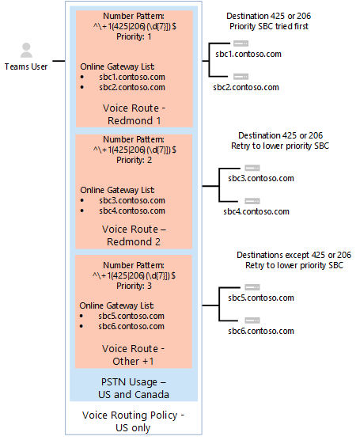
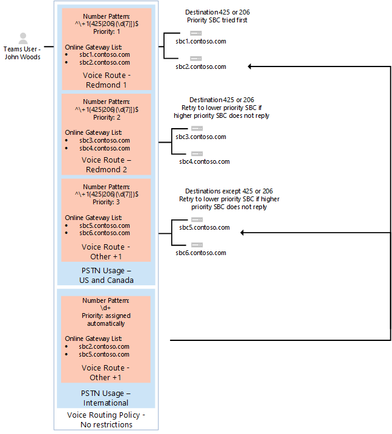

# <a name="configure-direct-routing"></a><span data-ttu-id="77c1d-103">直接ルーティングを構成します。</span><span class="sxs-lookup"><span data-stu-id="77c1d-103">Configure Direct Routing</span></span>

  > [!NOTE]
  > <span data-ttu-id="77c1d-104">これは、マイクロソフト電話システム直接ルーティングのプレビュー版です。</span><span class="sxs-lookup"><span data-stu-id="77c1d-104">This is a preview release of Microsoft Phone System Direct Routing.</span></span>  <span data-ttu-id="77c1d-105">製品の機能およびドキュメントは、変更されることができます。</span><span class="sxs-lookup"><span data-stu-id="77c1d-105">Product functionality and documentation are subject to change.</span></span>

<span data-ttu-id="77c1d-106">されていない場合は、前提条件の[直接ルーティングの計画](plan-direct-routing.md)が読み込まれ、他の手順を確認する必要があります、Microsoft の電話システムのネットワークを構成する前にします。</span><span class="sxs-lookup"><span data-stu-id="77c1d-106">If you have not already done so, read [Plan Direct Routing](plan-direct-routing.md) for prerequisites and to review  other steps you’ll need to take before you configure your Microsoft Phone System network.</span></span> 

  > [!NOTE]
  > <span data-ttu-id="77c1d-107">このドキュメントは、IT プロフェッショナル向けです。</span><span class="sxs-lookup"><span data-stu-id="77c1d-107">This document is intended for IT professionals.</span></span>  

<span data-ttu-id="77c1d-108">この資料では、マイクロソフト電話システム直接ルーティングを構成する方法について説明します。</span><span class="sxs-lookup"><span data-stu-id="77c1d-108">This article describes how to configure Microsoft Phone System Direct Routing.</span></span> <span data-ttu-id="77c1d-109">ペア、サポートされているセッション ボーダー コント ローラー (SBC) に直接ルーティングする方法とを公衆交換電話網 (PSTN) を接続するのには直接ルーティングを使用するマイクロソフトのチームのユーザーを構成する方法を説明します。</span><span class="sxs-lookup"><span data-stu-id="77c1d-109">It details how to pair a supported Session Border Controller (SBC) to Direct Routing and how to configure Microsoft Teams users to use Direct Routing to connect to the Public Switched Telephone Network (PSTN).</span></span> <span data-ttu-id="77c1d-110">この資料で説明した手順を完了するには、管理者には、PowerShell コマンドレットをある程度が必要があります。</span><span class="sxs-lookup"><span data-stu-id="77c1d-110">To complete the steps explained in this article, administrators need some familiarity with PowerShell cmdlets.</span></span> <span data-ttu-id="77c1d-111">PowerShell を使用の詳細については、 [Windows PowerShell には、コンピューターの設定](https://technet.microsoft.com/library/dn362831.aspx)を参照してください。</span><span class="sxs-lookup"><span data-stu-id="77c1d-111">For more information about using PowerShell, see [Set up your computer for Windows PowerShell](https://technet.microsoft.com/library/dn362831.aspx).</span></span> 

<span data-ttu-id="77c1d-112">SBC が、SBC の製造元の推奨どおりに構成されて既にいることを確認することをお勧めします。</span><span class="sxs-lookup"><span data-stu-id="77c1d-112">We recommend that you confirm that your SBC has already been configured as recommended by your SBC vendor's:</span></span> 

- <span data-ttu-id="77c1d-113">展開に関するドキュメント</span><span class="sxs-lookup"><span data-stu-id="77c1d-113">AudioCodes deployment documentation</span></span> 
- <span data-ttu-id="77c1d-114">リボンの展開に関するドキュメント</span><span class="sxs-lookup"><span data-stu-id="77c1d-114">Ribbon deployment documentation</span></span>

<span data-ttu-id="77c1d-115">マイクロソフト電話システムを構成して、直接ルーティングを使用し、マイクロソフトのチームを次の手順を完了しての優先呼び出し側のクライアントとして設定するユーザーを有効にすることができます。</span><span class="sxs-lookup"><span data-stu-id="77c1d-115">You can configure your Microsoft Phone System and enable  users to use Direct Routing, then set up Microsoft Teams as the preferred calling client by completing the following procedures:</span></span> 

- [<span data-ttu-id="77c1d-116">マイクロソフトの電話システムと SBC のペアし、ペアを検証します。</span><span class="sxs-lookup"><span data-stu-id="77c1d-116">Pair the SBC with a Microsoft Phone System and validate the pairing</span></span>](#pair-the-sbc-to-direct-routing-service-of-phone-system)
- [<span data-ttu-id="77c1d-117">直接ルーティング サービスのユーザーを有効にします。</span><span class="sxs-lookup"><span data-stu-id="77c1d-117">Enable users for Direct Routing Service</span></span>](#enable-users-for-direct-routing-service)
- [<span data-ttu-id="77c1d-118">マイクロソフトのチームが、ユーザーの優先呼び出し側のクライアントであることを確認します。</span><span class="sxs-lookup"><span data-stu-id="77c1d-118">Ensure that Microsoft Teams is the preferred calling client for the users</span></span>](#set-microsoft-teams-as-the-preferred-calling-client-for-the-users) 

## <a name="pair-the-sbc-to-direct-routing-service-of-phone-system"></a><span data-ttu-id="77c1d-119">電話システムのルーティング サービスを指示する SBC をペアします。</span><span class="sxs-lookup"><span data-stu-id="77c1d-119">Pair the SBC to Direct Routing Service of Phone System</span></span> 

<span data-ttu-id="77c1d-120">使用すると、接続、または直接ルーティング インターフェイスに SBC とペアにするには次の 3 つの大まかな手順は、次のように。</span><span class="sxs-lookup"><span data-stu-id="77c1d-120">The following are the three high-level steps to let you connect, or pair, the SBC to the Direct Routing interface:</span></span> 

- <span data-ttu-id="77c1d-121">PowerShell を使用して、 **Skype**管理センターへの接続します。</span><span class="sxs-lookup"><span data-stu-id="77c1d-121">Connect to **Skype for Business Online** admin center using PowerShell</span></span> 
- <span data-ttu-id="77c1d-122">SBC のペア</span><span class="sxs-lookup"><span data-stu-id="77c1d-122">Pair the SBC</span></span> 
- <span data-ttu-id="77c1d-123">ペアを検証します。</span><span class="sxs-lookup"><span data-stu-id="77c1d-123">Validate the pairing</span></span> 

### <a name="connect-to--skype-for-business-online-by-using-powershell"></a><span data-ttu-id="77c1d-124">PowerShell を使用して、オンライン ビジネスの Skype に接続します。</span><span class="sxs-lookup"><span data-stu-id="77c1d-124">Connect to  Skype for Business Online by using PowerShell</span></span> 

<span data-ttu-id="77c1d-125">直接ルーティング インターフェイスに SBC をペアにするには、テナントに接続している PowerShell セッションを使用できます。</span><span class="sxs-lookup"><span data-stu-id="77c1d-125">You can use a PowerShell session connected to the tenant to pair the SBC to the Direct Routing interface.</span></span> <span data-ttu-id="77c1d-126">PowerShell セッションを開くには、するには、 [Windows PowerShell には、コンピューターの設定](https://technet.microsoft.com/library/dn362831.aspx)で説明する手順に従ってください。</span><span class="sxs-lookup"><span data-stu-id="77c1d-126">To open a PowerShell session, please follow the steps outlined in [Set up your computer for Windows PowerShell](https://technet.microsoft.com/library/dn362831.aspx).</span></span> 
 
<span data-ttu-id="77c1d-127">リモート PowerShell セッションを確立すると後を検証してください、SBC を管理するためにコマンドを表示することができます。</span><span class="sxs-lookup"><span data-stu-id="77c1d-127">After you establish a remote PowerShell session, please validate that you can see the commands to manage the SBC.</span></span> <span data-ttu-id="77c1d-128">コマンドを検証するには、入力または PowerShell セッションで次のコピーと貼り付けし Enter キーを押します。</span><span class="sxs-lookup"><span data-stu-id="77c1d-128">To validate the commands, type or copy/paste in the following in the PowerShell session and press Enter:</span></span> 

```
gcm *onlinePSTNGateway*
```

<span data-ttu-id="77c1d-129">コマンドでは、ここで示すように、半角を管理できるようになる 4 つの関数を返します。</span><span class="sxs-lookup"><span data-stu-id="77c1d-129">Your command will return the four functions shown here that will let you manage the SBCs.</span></span> 

```
CommandType    Name                       Version    Source 
-----------    ----                       -------    ------ 
Function       Get-CsOnlinePSTNGateway    1.0        tmp_v5fiu1no.wxt 
Function       New-CsOnlinePSTNGateway    1.0        tmp_v5fiu1no.wxt 
Function       Remove-CsOnlinePSTNGateway 1.0        tmp_v5fiu1no.wxt 
Function       Set-CsOnlinePSTNGateway    1.0        tmp_v5fiu1no.wxt
```   


### <a name="pair-the-sbc-to-the-tenant"></a><span data-ttu-id="77c1d-130">テナントに SBC の組み合わせ</span><span class="sxs-lookup"><span data-stu-id="77c1d-130">Pair the SBC to the tenant</span></span> 

<span data-ttu-id="77c1d-131">テナントに SBC とペアに PowerShell セッションで次を入力し、Enter キーを押します。</span><span class="sxs-lookup"><span data-stu-id="77c1d-131">To pair the SBC to the tenant, in the PowerShell session type the following and press Enter:</span></span> 

```
New-CsOnlinePSTNGateway -Fqdn <SBC FQDN> -SipSignallingPort <SBC SIP Port> -MaxConcurrentSessions <Max Concurrent Sessions the SBC can handle> -Enabled $true 
```
  > [!NOTE]
  > 1. <span data-ttu-id="77c1d-132">強くお勧め、SBC の制限を設定する SBC のドキュメントで使用されている情報を使用します。</span><span class="sxs-lookup"><span data-stu-id="77c1d-132">We highly recommend setting a limit for the SBC, using information that can be found in the SBC documentation.</span></span> <span data-ttu-id="77c1d-133">SBC の能力のレベルにある場合、制限は通知をトリガーします。</span><span class="sxs-lookup"><span data-stu-id="77c1d-133">The limit will trigger a notification if SBC is at the capacity level.</span></span>
  > 2. <span data-ttu-id="77c1d-134">FQDN で、名前のドメイン部分と一致する以外は、テナントに登録するドメインのいずれかで SBC はペアのみ\*. onmicrosoft.com。使用して\*. SBC の FQDN 名では、omicrosoft.com ドメイン名はサポートされていません。</span><span class="sxs-lookup"><span data-stu-id="77c1d-134">You can only pair the SBC with FQDN, where the domain portion of the name matches one of the domains registered in your tenant, except \*.onmicrosoft.com. Using \*.omicrosoft.com domain names is not supported for the SBC FQDN names.</span></span> <span data-ttu-id="77c1d-135">たとえば、2 つのドメイン名があるとします。</span><span class="sxs-lookup"><span data-stu-id="77c1d-135">For example, if you have two domain names:</span></span><br/><br/>
  > <span data-ttu-id="77c1d-136">**abc**.xyz</span><span class="sxs-lookup"><span data-stu-id="77c1d-136">**abc**.xyz</span></span><br/><span data-ttu-id="77c1d-137">**abc**onmicrosoft.com。</span><span class="sxs-lookup"><span data-stu-id="77c1d-137">**abc**.onmicrosoft.com</span></span><br/><br/>
  > <span data-ttu-id="77c1d-138">SBC 名の名前の sbc.abc.xyz を使用できます。</span><span class="sxs-lookup"><span data-stu-id="77c1d-138">For the SBC name, you can use the name sbc.abc.xyz.</span></span> <span data-ttu-id="77c1d-139">名 sbc.xyz.abc を持つ SBC のペアにしようとすると、システムは動かせません、このテナントは、ドメインを所有していないようです。</span><span class="sxs-lookup"><span data-stu-id="77c1d-139">If you try to pair the SBC with a name sbc.xyz.abc, the system will not let you, as the domain is not owned by this tenant.</span></span>

```
New-CsOnlinePSTNGateway -Identity sbc.contoso.com -Enabled $true -SipSignallingPort 5067 -MaxConcurrentSessions 100 
```
<span data-ttu-id="77c1d-140">返します。</span><span class="sxs-lookup"><span data-stu-id="77c1d-140">Returns:</span></span>
``` 
Identity              : sbc.contoso.com 
Fqdn                  : sbc.contoso.com 
SipSignallingPort     : 5067 
FailoverTimeSeconds   : 10 
ForwardCallHistory    : False 
ForwardPai            : False 
SendSipOptions        : True 
MaxConcurrentSessions : 100 
Enabled               : True   
```
<span data-ttu-id="77c1d-141">ペアリング中に設定できるその他のオプションがあります。</span><span class="sxs-lookup"><span data-stu-id="77c1d-141">There are additional options that can be set during the pairing.</span></span> <span data-ttu-id="77c1d-142">前の例では、ただし、のみ、最低限必要なパラメーターが表示されます。</span><span class="sxs-lookup"><span data-stu-id="77c1d-142">In the previous example, however, only the minimum required parameters are shown.</span></span> 
 
<span data-ttu-id="77c1d-143">*新規 CsOnlinePstnGateway*のパラメーターを設定するのに使用できる追加のパラメーターを次の表に一覧します。</span><span class="sxs-lookup"><span data-stu-id="77c1d-143">The following table lists the additional parameters that you can use in setting parameters for *New-CsOnlinePstnGateway*.</span></span> 

|<span data-ttu-id="77c1d-144">**必須。**</span><span class="sxs-lookup"><span data-stu-id="77c1d-144">**Required?**</span></span>|<span data-ttu-id="77c1d-145">**名**</span><span class="sxs-lookup"><span data-stu-id="77c1d-145">**Name**</span></span>|<span data-ttu-id="77c1d-146">**説明**</span><span class="sxs-lookup"><span data-stu-id="77c1d-146">**Description**</span></span>|<span data-ttu-id="77c1d-147">**既定**</span><span class="sxs-lookup"><span data-stu-id="77c1d-147">**Default**</span></span>|<span data-ttu-id="77c1d-148">**使用可能な値**</span><span class="sxs-lookup"><span data-stu-id="77c1d-148">**Possible values**</span></span>|<span data-ttu-id="77c1d-149">**種類と制限**</span><span class="sxs-lookup"><span data-stu-id="77c1d-149">**Type and restrictions**</span></span>|
|:-----|:-----|:-----|:-----|:-----|:-----|
|<span data-ttu-id="77c1d-150">あり</span><span class="sxs-lookup"><span data-stu-id="77c1d-150">Yes</span></span>|<span data-ttu-id="77c1d-151">FQDN</span><span class="sxs-lookup"><span data-stu-id="77c1d-151">FQDN</span></span>|<span data-ttu-id="77c1d-152">SBC の FQDN 名</span><span class="sxs-lookup"><span data-stu-id="77c1d-152">The FQDN name of the SBC</span></span> |<span data-ttu-id="77c1d-153">なし</span><span class="sxs-lookup"><span data-stu-id="77c1d-153">None</span></span>|<span data-ttu-id="77c1d-154">NoneFQDN 名、制限は 63 文字</span><span class="sxs-lookup"><span data-stu-id="77c1d-154">NoneFQDN name, limit 63 characters</span></span>|<span data-ttu-id="77c1d-155">文字列、[コンピューター、ドメイン、サイト、および Ou の Active Directory の名前付け規則](https://support.microsoft.com/en-us/help/909264)で許可の文字の一覧</span><span class="sxs-lookup"><span data-stu-id="77c1d-155">String,  list of allowed and disallowed characters on [Naming conventions in Active Directory for computers, domains, sites, and OUs](https://support.microsoft.com/en-us/help/909264)</span></span>|
|<span data-ttu-id="77c1d-156">なし</span><span class="sxs-lookup"><span data-stu-id="77c1d-156">No</span></span>|<span data-ttu-id="77c1d-157">MediaBypass</span><span class="sxs-lookup"><span data-stu-id="77c1d-157">MediaBypass</span></span> |<span data-ttu-id="77c1d-158">将来使用するために予約されているパラメーターです。</span><span class="sxs-lookup"><span data-stu-id="77c1d-158">The parameter reserved for future use.</span></span> <span data-ttu-id="77c1d-159">SBC の示されているパラメーターには、メディア バイ パスがサポートされていて、管理者がそれを使用します。</span><span class="sxs-lookup"><span data-stu-id="77c1d-159">Parameter indicated of the SBC supports Media Bypass and the administrator wants to use it.</span></span>|<span data-ttu-id="77c1d-160">なし</span><span class="sxs-lookup"><span data-stu-id="77c1d-160">None</span></span>|<span data-ttu-id="77c1d-161">True</span><span class="sxs-lookup"><span data-stu-id="77c1d-161">True</span></span><br/><span data-ttu-id="77c1d-162">False</span><span class="sxs-lookup"><span data-stu-id="77c1d-162">False</span></span>|<span data-ttu-id="77c1d-163">ブール型</span><span class="sxs-lookup"><span data-stu-id="77c1d-163">Boolean</span></span>|
|<span data-ttu-id="77c1d-164">あり</span><span class="sxs-lookup"><span data-stu-id="77c1d-164">Yes</span></span>|<span data-ttu-id="77c1d-165">SipSignallingPort</span><span class="sxs-lookup"><span data-stu-id="77c1d-165">SipSignallingPort</span></span> |<span data-ttu-id="77c1d-166">トランスポート層セキュリティ (TLS) プロトコルを使用して直接ルーティング サービスと通信するために使用するポートをリッスンします。</span><span class="sxs-lookup"><span data-stu-id="77c1d-166">Listening port used for communicating with Direct Routing services by using the Transport Layer Security (TLS) protocol.</span></span>|<span data-ttu-id="77c1d-167">なし</span><span class="sxs-lookup"><span data-stu-id="77c1d-167">None</span></span>|<span data-ttu-id="77c1d-168">任意のポート</span><span class="sxs-lookup"><span data-stu-id="77c1d-168">Any port</span></span>|<span data-ttu-id="77c1d-169">0 から 65535 まで</span><span class="sxs-lookup"><span data-stu-id="77c1d-169">0 to 65535</span></span> |
|<span data-ttu-id="77c1d-170">なし</span><span class="sxs-lookup"><span data-stu-id="77c1d-170">No</span></span>|<span data-ttu-id="77c1d-171">FailoverTimeSeconds</span><span class="sxs-lookup"><span data-stu-id="77c1d-171">FailoverTimeSeconds</span></span> |<span data-ttu-id="77c1d-172">10 (既定値) に設定すると、10 秒以内に、ゲートウェイが応答しない送信の呼び出しにルーティングされる次の使用可能なトランクです。トランクを追加することはありません、し、呼び出しは自動的に削除します。</span><span class="sxs-lookup"><span data-stu-id="77c1d-172">When set to 10 (default value), outbound calls that are not answered by the gateway within 10 seconds are routed to the next available trunk; if there are no additional trunks, then the call is automatically dropped.</span></span> <span data-ttu-id="77c1d-173">低速のネットワークとゲートウェイの応答を持つ組織内を可能性があります可能性のある呼び出しが不必要に削除されています。</span><span class="sxs-lookup"><span data-stu-id="77c1d-173">In an organization with slow networks and gateway responses, that could potentially result in calls being dropped unnecessarily.</span></span> <span data-ttu-id="77c1d-174">既定値は 10 です。</span><span class="sxs-lookup"><span data-stu-id="77c1d-174">The default value is 10.</span></span>|<span data-ttu-id="77c1d-175">10</span><span class="sxs-lookup"><span data-stu-id="77c1d-175">10</span></span>|<span data-ttu-id="77c1d-176">数値</span><span class="sxs-lookup"><span data-stu-id="77c1d-176">Number</span></span>|<span data-ttu-id="77c1d-177">Int</span><span class="sxs-lookup"><span data-stu-id="77c1d-177">Int</span></span>|
|<span data-ttu-id="77c1d-178">なし</span><span class="sxs-lookup"><span data-stu-id="77c1d-178">No</span></span>|<span data-ttu-id="77c1d-179">ForwardCallHistory</span><span class="sxs-lookup"><span data-stu-id="77c1d-179">ForwardCallHistory</span></span> |<span data-ttu-id="77c1d-180">通話履歴の情報をトランク経由で転送するかどうかを指定します。</span><span class="sxs-lookup"><span data-stu-id="77c1d-180">Indicates whether call history information will be forwarded through the trunk.</span></span> <span data-ttu-id="77c1d-181">Office 365 の PSTN のプロキシに 2 つのヘッダーが送信が有効な場合: 履歴情報と Referred で。</span><span class="sxs-lookup"><span data-stu-id="77c1d-181">If enabled, the Office 365 PSTN Proxy sends two headers: History-info and Referred-By.</span></span> <span data-ttu-id="77c1d-182">既定値は**False** ($False) です。</span><span class="sxs-lookup"><span data-stu-id="77c1d-182">The default value is **False** ($False).</span></span> |<span data-ttu-id="77c1d-183">False</span><span class="sxs-lookup"><span data-stu-id="77c1d-183">False</span></span>|<span data-ttu-id="77c1d-184">True</span><span class="sxs-lookup"><span data-stu-id="77c1d-184">True</span></span><br/><span data-ttu-id="77c1d-185">False</span><span class="sxs-lookup"><span data-stu-id="77c1d-185">False</span></span>|<span data-ttu-id="77c1d-186">ブール型</span><span class="sxs-lookup"><span data-stu-id="77c1d-186">Boolean</span></span>|
|<span data-ttu-id="77c1d-187">なし</span><span class="sxs-lookup"><span data-stu-id="77c1d-187">No</span></span>|<span data-ttu-id="77c1d-188">ForwardPAI</span><span class="sxs-lookup"><span data-stu-id="77c1d-188">ForwardPAI</span></span>|<span data-ttu-id="77c1d-189">P-Asserted-Identity (PAI) ヘッダーを通話とともに転送するかどうかを示します。</span><span class="sxs-lookup"><span data-stu-id="77c1d-189">Indicates whether the P-Asserted-Identity (PAI) header will be forwarded along with the call.</span></span> <span data-ttu-id="77c1d-190">PAI ヘッダーがあれば、発信者 ID を確認できます。</span><span class="sxs-lookup"><span data-stu-id="77c1d-190">The PAI header provides a way to verify the identity of the caller.</span></span> <span data-ttu-id="77c1d-191">既定値は**False** ($False) です。</span><span class="sxs-lookup"><span data-stu-id="77c1d-191">The default value is **False** ($False).</span></span>|<span data-ttu-id="77c1d-192">False</span><span class="sxs-lookup"><span data-stu-id="77c1d-192">False</span></span>|<span data-ttu-id="77c1d-193">True</span><span class="sxs-lookup"><span data-stu-id="77c1d-193">True</span></span><br/><span data-ttu-id="77c1d-194">False</span><span class="sxs-lookup"><span data-stu-id="77c1d-194">False</span></span>|<span data-ttu-id="77c1d-195">ブール型</span><span class="sxs-lookup"><span data-stu-id="77c1d-195">Boolean</span></span>|
|<span data-ttu-id="77c1d-196">なし</span><span class="sxs-lookup"><span data-stu-id="77c1d-196">No</span></span>|<span data-ttu-id="77c1d-197">SendSIPOptions</span><span class="sxs-lookup"><span data-stu-id="77c1d-197">SendSIPOptions</span></span> |<span data-ttu-id="77c1d-198">SBC または SIP オプションを送信しない場合を定義します。</span><span class="sxs-lookup"><span data-stu-id="77c1d-198">Defines if an SBC will or will not send the SIP options.</span></span> <span data-ttu-id="77c1d-199">無効にした場合、SBC は、監視と警告のシステムから除外されます。</span><span class="sxs-lookup"><span data-stu-id="77c1d-199">If disabled, the SBC will be excluded from Monitoring and Alerting system.</span></span> <span data-ttu-id="77c1d-200">SIP オプションを有効にすることを強くお勧めします。</span><span class="sxs-lookup"><span data-stu-id="77c1d-200">We highly recommend that you enable SIP options.</span></span> <span data-ttu-id="77c1d-201">既定値は**True**です。</span><span class="sxs-lookup"><span data-stu-id="77c1d-201">Default value is **True**.</span></span> |<span data-ttu-id="77c1d-202">True</span><span class="sxs-lookup"><span data-stu-id="77c1d-202">True</span></span>|<span data-ttu-id="77c1d-203">True</span><span class="sxs-lookup"><span data-stu-id="77c1d-203">True</span></span><br/><span data-ttu-id="77c1d-204">False</span><span class="sxs-lookup"><span data-stu-id="77c1d-204">False</span></span>|<span data-ttu-id="77c1d-205">ブール型</span><span class="sxs-lookup"><span data-stu-id="77c1d-205">Boolean</span></span>|
|<span data-ttu-id="77c1d-206">なし</span><span class="sxs-lookup"><span data-stu-id="77c1d-206">No</span></span>|<span data-ttu-id="77c1d-207">MaxConcurrentSessions</span><span class="sxs-lookup"><span data-stu-id="77c1d-207">MaxConcurrentSessions</span></span> |<span data-ttu-id="77c1d-208">警告システムによって使用されます。</span><span class="sxs-lookup"><span data-stu-id="77c1d-208">Used by alerting system.</span></span> <span data-ttu-id="77c1d-209">同時セッションの数が 90% の場合、アラート ・ システム、テナント管理者にアラートを生成の任意の値を設定すると、この値よりも大きいか。</span><span class="sxs-lookup"><span data-stu-id="77c1d-209">When any value is set, the alerting system will generate an alert to the tenant administrator when the number of concurrent session is 90% or higher than this value.</span></span> <span data-ttu-id="77c1d-210">パラメーターが設定されていない場合、アラートは生成されません。</span><span class="sxs-lookup"><span data-stu-id="77c1d-210">If parameter is not set, the alerts are not generated.</span></span> <span data-ttu-id="77c1d-211">ただし、監視システムは 24 時間ごとの同時セッションの数を報告します。</span><span class="sxs-lookup"><span data-stu-id="77c1d-211">However, the monitoring system will report number of concurrent session every 24 hours.</span></span> |<span data-ttu-id="77c1d-212">Null</span><span class="sxs-lookup"><span data-stu-id="77c1d-212">Null</span></span>|<span data-ttu-id="77c1d-213">Null</span><span class="sxs-lookup"><span data-stu-id="77c1d-213">Null</span></span><br/><span data-ttu-id="77c1d-214">1 ~ 100,000</span><span class="sxs-lookup"><span data-stu-id="77c1d-214">1 to 100,000</span></span> ||
|<span data-ttu-id="77c1d-215">なし</span><span class="sxs-lookup"><span data-stu-id="77c1d-215">No</span></span>|<span data-ttu-id="77c1d-216">有効になっている \*</span><span class="sxs-lookup"><span data-stu-id="77c1d-216">Enabled\*</span></span>|<span data-ttu-id="77c1d-217">発信呼のこの SBC を有効にする場合に使用されます。</span><span class="sxs-lookup"><span data-stu-id="77c1d-217">Used to enable this SBC for outbound calls.</span></span> <span data-ttu-id="77c1d-218">メンテナンス中または更新中に、SBC を一時的に削除するために使用します。</span><span class="sxs-lookup"><span data-stu-id="77c1d-218">Can be used to temporarily remove the SBC, while it is being updated or during maintenance.</span></span> |<span data-ttu-id="77c1d-219">False</span><span class="sxs-lookup"><span data-stu-id="77c1d-219">False</span></span>|<span data-ttu-id="77c1d-220">True</span><span class="sxs-lookup"><span data-stu-id="77c1d-220">True</span></span><br/><span data-ttu-id="77c1d-221">False</span><span class="sxs-lookup"><span data-stu-id="77c1d-221">False</span></span>|<span data-ttu-id="77c1d-222">ブール型</span><span class="sxs-lookup"><span data-stu-id="77c1d-222">Boolean</span></span>|
 
### <a name="verify-the-sbc-pairing"></a><span data-ttu-id="77c1d-223">SBC の組み合わせを確認します。</span><span class="sxs-lookup"><span data-stu-id="77c1d-223">Verify the SBC pairing</span></span> 

<span data-ttu-id="77c1d-224">接続を確認します。</span><span class="sxs-lookup"><span data-stu-id="77c1d-224">Verify the connection:</span></span> 
- <span data-ttu-id="77c1d-225">SBCs のペアのリストに、SBC があるかを確認してください。</span><span class="sxs-lookup"><span data-stu-id="77c1d-225">Check if the SBC is on the list of paired SBCs.</span></span> 
- <span data-ttu-id="77c1d-226">SIP オプションを検証します。</span><span class="sxs-lookup"><span data-stu-id="77c1d-226">Validate SIP Options.</span></span> 
 
#### <a name="validate-if-sbc-is-on-the-list-of-paired-sbcs"></a><span data-ttu-id="77c1d-227">SBCs のペアのリストには、SBC の場合を検証します。</span><span class="sxs-lookup"><span data-stu-id="77c1d-227">Validate if SBC is on the list of paired SBCs</span></span> 

<span data-ttu-id="77c1d-228">SBC のペアであることを確認、SBC SBCs のペアのリストに存在リモート PowerShell セッションで次のコマンドを実行しています。`Get-CSOnlinePSTNGateway`</span><span class="sxs-lookup"><span data-stu-id="77c1d-228">After you pair the SBC, validate that the SBC is present in the list of paired SBCs by running the following command  in a remote PowerShell session: `Get-CSOnlinePSTNGateway`</span></span>

<span data-ttu-id="77c1d-229">ペアのゲートウェイは、次の例に示すように、一覧に表示し、パラメーターを*有効*に**は True**の値が表示されることを確認ください。</span><span class="sxs-lookup"><span data-stu-id="77c1d-229">The paired gateway should appear in the list as shown in the example below, and verify that the parameter *Enabled* displays the value **True**.</span></span> <span data-ttu-id="77c1d-230">入力します。</span><span class="sxs-lookup"><span data-stu-id="77c1d-230">Enter:</span></span>

```
Get-CsOnlinePSTNGateway -Identity sbc.contoso.com  
```
<span data-ttu-id="77c1d-231">返します。</span><span class="sxs-lookup"><span data-stu-id="77c1d-231">Which returns:</span></span>
``` 
Identity              : sbc.contoso.com  
Fqdn                  : sbc.contoso.com 
SipSignallingPort     : 5067 
CodecPriority         : SILKWB,SILKNB,PCMU,PCMA 
ExcludedCodecs        :  
FailoverTimeSeconds   : 10 
ForwardCallHistory    : False 
ForwardPai            : False 
SendSipOptions        : True 
MaxConcurrentSessions : 100 
Enabled               : True 
```

#### <a name="validate-sip-options-flow"></a><span data-ttu-id="77c1d-232">SIP オプションのフローを検証します。</span><span class="sxs-lookup"><span data-stu-id="77c1d-232">Validate SIP Options flow</span></span> 

<span data-ttu-id="77c1d-233">送信 SIP オプションを使用しての組み合わせを検証するには、SBC の管理インターフェイスを使用し、SBC が送信のオプションを 200 OK 応答を取得するを参照してください。</span><span class="sxs-lookup"><span data-stu-id="77c1d-233">To validate the pairing using outgoing SIP Options, use the SBC management interface and see that the SBC get 200 OK responses to the outgoing OPTIONS.</span></span>
  
<span data-ttu-id="77c1d-234">直接ルーティングでは、受信オプションが表示される、オプションの受信メッセージの連絡先ヘッダー フィールドで構成されている SBC の FQDN を送信のオプションを送信を開始します。</span><span class="sxs-lookup"><span data-stu-id="77c1d-234">When Direct Routing sees incoming OPTIONS, it will start sending outgoing options to the SBC FQDN configured in the Contact header field in the incoming OPTIONS message.</span></span> 

<span data-ttu-id="77c1d-235">着信 SIP オプションを使用しての組み合わせを検証するには、SBC の管理インターフェイスを使用し、SBC がから直接ルーティング オプションのメッセージに応答を取得し、応答コードが 200 [ok] を参照してください。</span><span class="sxs-lookup"><span data-stu-id="77c1d-235">To validate the pairing using incoming SIP Options, use the SBC management interface and see that the SBC gets reply on the OPTIONS messages coming in from Direct Routing and that the response code is 200 OK.</span></span>  

## <a name="enable-users-for-direct-routing-service"></a><span data-ttu-id="77c1d-236">直接ルーティング サービスのユーザーを有効にします。</span><span class="sxs-lookup"><span data-stu-id="77c1d-236">Enable users for Direct Routing Service</span></span> 

<span data-ttu-id="77c1d-237">直接ルーティング サービスに対してユーザーを有効にする準備ができたら、次の手順に従います。</span><span class="sxs-lookup"><span data-stu-id="77c1d-237">When you are ready to enable users for the Direct Routing Service, follow these steps:</span></span> 

1. <span data-ttu-id="77c1d-238">Office 365 にユーザーを作成し、電話システムのライセンスを割り当てます。</span><span class="sxs-lookup"><span data-stu-id="77c1d-238">Create a user in Office 365 and assign a phone system license.</span></span> 
2. <span data-ttu-id="77c1d-239">ビジネス オンラインの Skype のユーザーのホームすることを確認します。</span><span class="sxs-lookup"><span data-stu-id="77c1d-239">Ensure that the user is homed in Skype for Business Online.</span></span> 
3. <span data-ttu-id="77c1d-240">電話番号を構成し、エンタープライズ ボイスとボイス メールを有効にします。</span><span class="sxs-lookup"><span data-stu-id="77c1d-240">Configure the phone number and enable enterprise voice and voicemail.</span></span> 
4. <span data-ttu-id="77c1d-241">音声ルーティングを構成します。</span><span class="sxs-lookup"><span data-stu-id="77c1d-241">Configure voice routing.</span></span> <span data-ttu-id="77c1d-242">ルートが自動的に検証されます。</span><span class="sxs-lookup"><span data-stu-id="77c1d-242">The route is automatically validated.</span></span>  

### <a name="create-a-user-in-office-365-and-assign-the-license"></a><span data-ttu-id="77c1d-243">Office 365 にユーザーを作成し、ライセンスの割り当てください</span><span class="sxs-lookup"><span data-stu-id="77c1d-243">Create a user in Office 365 and assign the license</span></span> 

<span data-ttu-id="77c1d-244">Office 365 で新しいユーザーを作成するための 2 つのオプションがあります。</span><span class="sxs-lookup"><span data-stu-id="77c1d-244">There are two options for creating a new user in Office 365.</span></span> <span data-ttu-id="77c1d-245">ただし、組織が選択し、1 つのオプションを使用して、ルーティングの問題を回避することお勧めします。</span><span class="sxs-lookup"><span data-stu-id="77c1d-245">However, we recommend that your organization select and use one option to avoid routing issues:</span></span> 

- <span data-ttu-id="77c1d-246">オンプレミスの Active Directory でユーザーを作成し、ユーザーがクラウドを同期します。</span><span class="sxs-lookup"><span data-stu-id="77c1d-246">Create the user in on-premise Active Directory and sync the user to the cloud.</span></span> <span data-ttu-id="77c1d-247">[Azure Active Directory と統合、設置ディレクトリ](https://docs.microsoft.com/en-us/azure/active-directory/connect/active-directory-aadconnect)を参照してください。</span><span class="sxs-lookup"><span data-stu-id="77c1d-247">See [Integrate your on-premises directories with Azure Active Directory](https://docs.microsoft.com/en-us/azure/active-directory/connect/active-directory-aadconnect).</span></span>  
- <span data-ttu-id="77c1d-248">Office 365 管理者ポータルで直接ユーザーを作成します。</span><span class="sxs-lookup"><span data-stu-id="77c1d-248">Create the user directly in the Office 365 Administrator Portal.</span></span> <span data-ttu-id="77c1d-249">[追加ユーザー個別にまたは一括で Office 365 の管理者のヘルプ](https://support.office.com/en-us/article/Add-users-individually-or-in-bulk-to-Office-365-Admin-Help-1970f7d6-03b5-442f-b385-5880b9c256ec)を参照してください。</span><span class="sxs-lookup"><span data-stu-id="77c1d-249">See [Add users individually or in bulk to Office 365 - Admin Help](https://support.office.com/en-us/article/Add-users-individually-or-in-bulk-to-Office-365-Admin-Help-1970f7d6-03b5-442f-b385-5880b9c256ec).</span></span> 

  <span data-ttu-id="77c1d-250">ビジネス 2015年または Lync 2010 と 2013 の設置型の Skype と共存するシステムを構築する場合のみサポートされているオプションは、オンプレミスの Active Directory でユーザーを作成し、(オプション 1) をクラウドに移行するユーザーを同期するのには。</span><span class="sxs-lookup"><span data-stu-id="77c1d-250">If you build the system that co-exists with Skype for Business 2015 or Lync 2010/2013 on-premises, the only supported option is to create the user in on-premises Active Directory and sync the user to the cloud (Option 1).</span></span> 

<span data-ttu-id="77c1d-251">必須ライセンス:</span><span class="sxs-lookup"><span data-stu-id="77c1d-251">Required licenses:</span></span> 

- <span data-ttu-id="77c1d-252">Office 365 エンタープライズ E3 (デバイス Plan2、Plan2 の交換、チームを含む) 電話システム</span><span class="sxs-lookup"><span data-stu-id="77c1d-252">Office 365 Enterprise E3 (including SfB Plan2, Exchange Plan2, and Teams) + Phone System</span></span>  
- <span data-ttu-id="77c1d-253">Office 365 エンタープライズ E5 (デバイス Plan2、Plan2 の交換、チーム、および電話システムを含む)</span><span class="sxs-lookup"><span data-stu-id="77c1d-253">Office 365 Enterprise E5  (including SfB Plan2, Exchange Plan2, Teams, and Phone System)</span></span> 

<span data-ttu-id="77c1d-254">オプションのライセンス数:</span><span class="sxs-lookup"><span data-stu-id="77c1d-254">Optional licenses:</span></span> 

- <span data-ttu-id="77c1d-255">計画を呼び出す</span><span class="sxs-lookup"><span data-stu-id="77c1d-255">Calling Plan</span></span> 
- <span data-ttu-id="77c1d-256">電話会議</span><span class="sxs-lookup"><span data-stu-id="77c1d-256">Audio Conferencing</span></span> 

### <a name="ensure-that-the-user-is-homed-in-skype-for-business-online"></a><span data-ttu-id="77c1d-257">ビジネス オンラインの Skype のユーザーが所属していることを確認します。</span><span class="sxs-lookup"><span data-stu-id="77c1d-257">Ensure that the user is homed in Skype for Business Online</span></span> 

<span data-ttu-id="77c1d-258">直接ルーティングでは、Skype でのオンライン ビジネスのホーム ユーザーが必要です。</span><span class="sxs-lookup"><span data-stu-id="77c1d-258">Direct Routing requires the user to be homed in Skype for Business Online.</span></span> <span data-ttu-id="77c1d-259">これを確認するには、RegistrarPool パラメーターを参照しています。</span><span class="sxs-lookup"><span data-stu-id="77c1d-259">You can check this by looking at the RegistrarPool parameter.</span></span> <span data-ttu-id="77c1d-260">Infra.lync.com ドメイン内の値を設定する必要があります。</span><span class="sxs-lookup"><span data-stu-id="77c1d-260">It needs to have a value in the infra.lync.com domain.</span></span>

1. <span data-ttu-id="77c1d-261">リモート PowerShell に接続します。</span><span class="sxs-lookup"><span data-stu-id="77c1d-261">Connect to remote PowerShell.</span></span>
2. <span data-ttu-id="77c1d-262">コマンドを発行します。</span><span class="sxs-lookup"><span data-stu-id="77c1d-262">Issue the command:</span></span> 

```
Get-CsOnlineUser -Identity "<User name>" | fl RegistrarPool
``` 

### <a name="configure-the-phone-number-and-enable-enterprise-voice-and-voicemail"></a><span data-ttu-id="77c1d-263">電話番号を構成し、エンタープライズ ボイスとボイス メールを有効にします。</span><span class="sxs-lookup"><span data-stu-id="77c1d-263">Configure the phone number and enable enterprise voice and voicemail</span></span> 

<span data-ttu-id="77c1d-264">ユーザーを作成すると、次の手順は、電話番号やボイス メールを構成するのには、ライセンスが割り当てられています。</span><span class="sxs-lookup"><span data-stu-id="77c1d-264">After you have created the user and assigned a license, the next step is to configure their phone number and voicemail.</span></span> <span data-ttu-id="77c1d-265">これは、1 つのステップで実行できます。</span><span class="sxs-lookup"><span data-stu-id="77c1d-265">This can be done in one step.</span></span> 

<span data-ttu-id="77c1d-266">電話番号を追加し、ボイス メールを有効にします。</span><span class="sxs-lookup"><span data-stu-id="77c1d-266">To add the phone number and enable for voicemail:</span></span>
 
1. <span data-ttu-id="77c1d-267">リモート PowerShell セッションに接続します。</span><span class="sxs-lookup"><span data-stu-id="77c1d-267">Connect to a remote PowerShell session.</span></span> 
2. <span data-ttu-id="77c1d-268">コマンドを入力します。</span><span class="sxs-lookup"><span data-stu-id="77c1d-268">Enter the command:</span></span> 
    
```
Set-CsUser -Identity "<User name>" -EnterpriseVoiceEnabled $true -HostedVoiceMail $true -OnPremLineURI tel:+ phone number
```

<span data-ttu-id="77c1d-269">たとえば、「Spencer 低」のユーザーの電話番号を追加するのにはするは、次のように入力します。</span><span class="sxs-lookup"><span data-stu-id="77c1d-269">For example, to add a phone number for user “Spencer Low,” you would enter the following:</span></span> 

```
Set-CsUser - “Spencer Low" -OnPremisLineURI tel:+14255388797 -EnterpriseVoiceEnabled $true -HostedVoiceMail $true
```

<span data-ttu-id="77c1d-270">電話番号に国コードを含む完全 E.164 電話番号として構成するのには。</span><span class="sxs-lookup"><span data-stu-id="77c1d-270">The phone number used has to be configured as a full E.164 phone number with country code.</span></span> 

  > [!NOTE]
  > <span data-ttu-id="77c1d-271">ユーザーの電話番号が施設内で管理されている場合は、ユーザーの電話番号を構成するのにはビジネス管理シェルまたはコントロール パネルの設置型の Skype を使用します。</span><span class="sxs-lookup"><span data-stu-id="77c1d-271">If the user’s phone number is managed on premises, use on-premises Skype for Business Management Shell or Control Panel to configure the user's phone number.</span></span> 

### <a name="configure-voice-routing"></a><span data-ttu-id="77c1d-272">音声ルーティングを構成します。</span><span class="sxs-lookup"><span data-stu-id="77c1d-272">Configure Voice Routing</span></span> 

<span data-ttu-id="77c1d-273">マイクロソフトの電話システムに基づく特定の SBC に送られる呼び出しを可能にするためのルーティング メカニズムがあります。</span><span class="sxs-lookup"><span data-stu-id="77c1d-273">Microsoft Phone System has a routing mechanism that allows a call to be sent to a specific SBC based on:</span></span> 

- <span data-ttu-id="77c1d-274">番号のパターンと呼ばれる</span><span class="sxs-lookup"><span data-stu-id="77c1d-274">Called number pattern</span></span> 
- <span data-ttu-id="77c1d-275">番号のパターン + 呼び出しでは、特定のユーザーと呼ばれます。</span><span class="sxs-lookup"><span data-stu-id="77c1d-275">Called number pattern + Specific User who makes the call</span></span>
 
<span data-ttu-id="77c1d-276">SBCs は、アクティブとバックアップとして指定できます。</span><span class="sxs-lookup"><span data-stu-id="77c1d-276">SBCs can be designated as active and backup.</span></span> <span data-ttu-id="77c1d-277">この番号のパターンまたはパターンの番号 + 特定のユーザーに対してアクティブに設定されている SBC が使用できない場合を意味し、呼び出しは、バックアップの SBC にルーティングされます。</span><span class="sxs-lookup"><span data-stu-id="77c1d-277">That means when the SBC that is configured as active for this number pattern, or number pattern + specific user, is not available, then the calls will be routed to a backup SBC.</span></span>
 
<span data-ttu-id="77c1d-278">通話のルーティングは、次の要素で構成されています。</span><span class="sxs-lookup"><span data-stu-id="77c1d-278">Call routing is made up of the following elements:</span></span> 
- <span data-ttu-id="77c1d-279">音声ルーティング ポリシー – PSTN の使用法のためのコンテナーユーザーまたは複数のユーザーに割り当てることができます。</span><span class="sxs-lookup"><span data-stu-id="77c1d-279">Voice Routing Policy – container for PSTN Usages; can be assigned to a user or to multiple users</span></span> 
- <span data-ttu-id="77c1d-280">PSTN 使用法: ボイス ルートと PSTN の使用法のためのコンテナー別の音声ルーティング ポリシーで共有することができます。</span><span class="sxs-lookup"><span data-stu-id="77c1d-280">PSTN Usages – container for Voice Routes and PSTN Usages; can be shared in different Voice Routing Policies</span></span> 
- <span data-ttu-id="77c1d-281">ボイス ルート – 番号のパターンと、パターンに一致する番号を呼び出す呼び出しに使用するオンラインの PSTN ゲートウェイの設定</span><span class="sxs-lookup"><span data-stu-id="77c1d-281">Voice Routes – number pattern and set of Online PSTN Gateways to use for calls where calling number matches the pattern</span></span> 
- <span data-ttu-id="77c1d-282">オンラインの PSTN ゲートウェイ、SBC、ポインター、前方の P アサートされた Id (PAI) や優先のコーデックなど、SBC を使用して電話をかけるときに適用される設定を格納します。ボイス ルートを追加することができます。</span><span class="sxs-lookup"><span data-stu-id="77c1d-282">Online PSTN Gateway - pointer at SBC, also stores the configuration that is applied when call is placed via the SBC, such as forward P-Asserted-Identity (PAI) or Preferred Codecs; can be added to Voice Routes</span></span> 

#### <a name="creating-a-voice-routing-policy-with-one-pstn-usage"></a><span data-ttu-id="77c1d-283">PSTN 使用法の 1 つの音声ルーティング ポリシーを作成します。</span><span class="sxs-lookup"><span data-stu-id="77c1d-283">Creating a voice routing policy with one PSTN Usage</span></span> 

<span data-ttu-id="77c1d-284">次の図は、呼び出しの流れの音声ルーティング ポリシーの 2 つの例を示します。</span><span class="sxs-lookup"><span data-stu-id="77c1d-284">The following diagram shows two examples of voice routing policies in call flow.</span></span>

<span data-ttu-id="77c1d-285">**(左側) のフロー 1 の呼び出し:** SBC sbc1 に通話をルーティングする場合は +1 425 XXX XX XX または +1 206 XXX XX XX への呼び出しを行うと、<span></span>です。 contoso.biz または sbc2<span></span>です。 contoso.biz です。</span><span class="sxs-lookup"><span data-stu-id="77c1d-285">**Call Flow 1 (on the left):** If a user makes a call to  +1 425 XXX XX XX or +1 206 XXX XX XX, the call is routed  to SBC sbc1<span></span>.contoso.biz or sbc2<span></span>.contoso.biz.</span></span> <span data-ttu-id="77c1d-286">場合も sbc1<span></span>です。 contoso.biz や sbc2<span></span>。 contoso.biz がある、呼び出しは破棄されます。</span><span class="sxs-lookup"><span data-stu-id="77c1d-286">If neither sbc1<span></span>.contoso.biz nor sbc2<span></span>.contoso.biz are available, the call is dropped.</span></span> 

<span data-ttu-id="77c1d-287">**(右側) のフロー 2 の呼び出し:**+1 425 XXX XX XX または +1 206 XXX XX XX への呼び出しを行うと、呼び出しが最初にルーティング SBC sbc1 を<span></span>. contoso.biz または sbc2<span></span>です。 contoso.biz です。</span><span class="sxs-lookup"><span data-stu-id="77c1d-287">**Call Flow 2 (on the right):** If a user makes a call to  +1 425 XXX XX XX or +1 206 XXX XX XX, the call is first routed to SBC sbc1<span></span>.contoso.biz or sbc2<span></span>.contoso.biz.</span></span> <span data-ttu-id="77c1d-288">SBC のどちらが使用可能な場合は、優先度の低いルートが試行されます (sbc3<span></span>です。 contoso.biz と sbc4<span></span>です。 contoso.biz)。</span><span class="sxs-lookup"><span data-stu-id="77c1d-288">If neither SBC is available, the route with lower priority will be tried (sbc3<span></span>.contoso.biz and sbc4<span></span>.contoso.biz).</span></span> <span data-ttu-id="77c1d-289">SBCs の [なし] がある場合、呼び出しは破棄されます。</span><span class="sxs-lookup"><span data-stu-id="77c1d-289">If none of the SBCs are available, the call is dropped.</span></span> 


<span data-ttu-id="77c1d-291">どちらの例では、ボイス ルートは、優先順位を割り当てられている間、ルートの SBCs はランダムな順序で試行されます。</span><span class="sxs-lookup"><span data-stu-id="77c1d-291">In both examples, while the Voice Route is assigned priorities, the SBCs in the routes are tried in random order.</span></span>

  > [!NOTE]
  > <span data-ttu-id="77c1d-292">ユーザーもライセンスを持つ、Microsoft の計画を呼び出すことをしない限り、番号が一致するパターン + +1 425 XXX XX XX または構成の例で +1 206 の XXX XX XX 以外の任意の番号への呼び出しは削除されます。</span><span class="sxs-lookup"><span data-stu-id="77c1d-292">Unless the user also has a Microsoft Calling Plan license, calls to any number except numbers matching the patterns + +1 425 XXX XX XX or +1 206 XXX XX XX in the example configuration are dropped.</span></span> <span data-ttu-id="77c1d-293">ユーザーのライセンス計画を呼び出す場合は、呼び出しは自動的にマイクロソフトを呼び出す予定のポリシーに従ってルーティングされます。</span><span class="sxs-lookup"><span data-stu-id="77c1d-293">If the user has a Calling Plan license, the call is automatically routed according to the policies of  the Microsoft Calling Plan.</span></span> 

<span data-ttu-id="77c1d-294">マイクロソフトを呼び出す計画では、Microsoft の計画を呼び出してライセンスを持つすべてのユーザーに最後のルートとしてには、自動的に適用され、追加の呼び出しのルーティングの構成は必要ありません。</span><span class="sxs-lookup"><span data-stu-id="77c1d-294">The Microsoft Calling Plan applies automatically as the last route to all users with the Microsoft Calling Plan license and does not require additional call routing configuration.</span></span>

<span data-ttu-id="77c1d-295">例では、次の図に示すように、すべての他の米国およびカナダ番号 (番号のパターンと呼ばれる +1 XXX XXX XX XX に行われる呼び出し) への呼び出しを送信するボイス ルートが追加されます。</span><span class="sxs-lookup"><span data-stu-id="77c1d-295">In the example shown in the following diagram, a voice route is added to send calls to all other US and Canadian number (calls that go to called number pattern +1 XXX XXX XX XX).</span></span>



<span data-ttu-id="77c1d-297">他のすべての呼び出しでは、ユーザーは、(マイクロソフトの電話システムと Microsoft の計画を呼び出す)、両方のライセンスを持っている場合、自動工順が使用されます。</span><span class="sxs-lookup"><span data-stu-id="77c1d-297">For all other calls, if a user has both licenses (Microsoft Phone System and Microsoft Calling Plan), Automatic Route is used.</span></span> <span data-ttu-id="77c1d-298">何もには、管理者が作成したオンラインでのボイス ルートの番号のパターンが一致すると、Microsoft の計画を呼び出すを使用してルーティングします。</span><span class="sxs-lookup"><span data-stu-id="77c1d-298">If nothing matches the number patterns in the administrator-created online voice routes, route via Microsoft Calling Plan.</span></span>

<span data-ttu-id="77c1d-299">ユーザーは、マイクロソフトの電話システムのみがある、一致する規則がないために、呼び出しが切断されます。</span><span class="sxs-lookup"><span data-stu-id="77c1d-299">If the user has only Microsoft Phone System, the call is dropped because no matching rules are available.</span></span>

  > [!NOTE]
  > <span data-ttu-id="77c1d-300">「+1 その他の」ルートの優先順位の値 +1 のパターンに一致する 1 つだけのルートがある、この例では、関係ありません XXX XXX XX XX。</span><span class="sxs-lookup"><span data-stu-id="77c1d-300">The Priority value for route “Other +1” doesn’t matter in this case, as there is only one route that matches the pattern +1 XXX XXX XX XX.</span></span> <span data-ttu-id="77c1d-301">+1 324 の 567 89 89 への呼び出しを行うと、sbc5.contoso.biz と sbc6.contoso.biz の両方が使用できない場合は、呼び出しは破棄されます。</span><span class="sxs-lookup"><span data-stu-id="77c1d-301">If a user makes a call to +1 324 567 89 89 and both sbc5.contoso.biz and sbc6.contoso.biz are unavailable, the call is dropped.</span></span>

<span data-ttu-id="77c1d-302">次の表では、3 つのボイス ルートを使用して設定をまとめたものです。</span><span class="sxs-lookup"><span data-stu-id="77c1d-302">The following table summarizes the configuration using three voice routes.</span></span> <span data-ttu-id="77c1d-303">この例では、すべての 3 つのルートは、同じ PSTN 使用法米国およびカナダの一部です。</span><span class="sxs-lookup"><span data-stu-id="77c1d-303">In this example, all three routes are part of the same PSTN Usage “US and Canada”.</span></span>

|<span data-ttu-id="77c1d-304">**PSTN 使用法**</span><span class="sxs-lookup"><span data-stu-id="77c1d-304">**PSTN usage**</span></span>|<span data-ttu-id="77c1d-305">**ボイス ルート**</span><span class="sxs-lookup"><span data-stu-id="77c1d-305">**Voice route**</span></span>|<span data-ttu-id="77c1d-306">**番号パターン**</span><span class="sxs-lookup"><span data-stu-id="77c1d-306">**Number pattern**</span></span>|<span data-ttu-id="77c1d-307">**優先度**</span><span class="sxs-lookup"><span data-stu-id="77c1d-307">**Priority**</span></span>|<span data-ttu-id="77c1d-308">**SBC**</span><span class="sxs-lookup"><span data-stu-id="77c1d-308">**SBC**</span></span>|<span data-ttu-id="77c1d-309">**説明**</span><span class="sxs-lookup"><span data-stu-id="77c1d-309">**Description**</span></span>|
|:-----|:-----|:-----|:-----|:-----|:-----|
|<span data-ttu-id="77c1d-310">米国のみ</span><span class="sxs-lookup"><span data-stu-id="77c1d-310">US only</span></span>|<span data-ttu-id="77c1d-311">「Redmond 1」</span><span class="sxs-lookup"><span data-stu-id="77c1d-311">“Redmond 1”</span></span>|<span data-ttu-id="77c1d-312">^\\+1 (425\|206)(\d{7})$</span><span class="sxs-lookup"><span data-stu-id="77c1d-312">^\\+1(425\|206)(\d{7})$</span></span>|<span data-ttu-id="77c1d-313">1</span><span class="sxs-lookup"><span data-stu-id="77c1d-313">1</span></span>|<span data-ttu-id="77c1d-314">sbc1<span></span>です contoso.biz。</span><span class="sxs-lookup"><span data-stu-id="77c1d-314">sbc1<span></span>.contoso.biz</span></span><br/><span data-ttu-id="77c1d-315">sbc2<span></span>です contoso.biz。</span><span class="sxs-lookup"><span data-stu-id="77c1d-315">sbc2<span></span>.contoso.biz</span></span>|<span data-ttu-id="77c1d-316">+1 425 XXX XX XX または +1 206 XXX XX XX の呼び出された番号の有効な工順</span><span class="sxs-lookup"><span data-stu-id="77c1d-316">Active route for called numbers +1 425 XXX XX XX or +1 206 XXX XX XX</span></span>|
|<span data-ttu-id="77c1d-317">米国のみ</span><span class="sxs-lookup"><span data-stu-id="77c1d-317">US only</span></span>|<span data-ttu-id="77c1d-318">"Redmond 2"</span><span class="sxs-lookup"><span data-stu-id="77c1d-318">“Redmond 2”</span></span>|<span data-ttu-id="77c1d-319">^\\+1 (425\|206)(\d{7})$</span><span class="sxs-lookup"><span data-stu-id="77c1d-319">^\\+1(425\|206)(\d{7})$</span></span>|<span data-ttu-id="77c1d-320">2</span><span class="sxs-lookup"><span data-stu-id="77c1d-320">2</span></span>|<span data-ttu-id="77c1d-321">sbc3<span></span>です contoso.biz。</span><span class="sxs-lookup"><span data-stu-id="77c1d-321">sbc3<span></span>.contoso.biz</span></span><br/><span data-ttu-id="77c1d-322">sbc4<span></span>です contoso.biz。</span><span class="sxs-lookup"><span data-stu-id="77c1d-322">sbc4<span></span>.contoso.biz</span></span>|<span data-ttu-id="77c1d-323">+1 425 XXX XX XX または +1 206 XXX XX XX の呼び出された番号のバックアップ ルート</span><span class="sxs-lookup"><span data-stu-id="77c1d-323">Backup route for called numbers +1 425 XXX XX XX or +1 206 XXX XX XX</span></span>|
|<span data-ttu-id="77c1d-324">米国のみ</span><span class="sxs-lookup"><span data-stu-id="77c1d-324">US only</span></span>|<span data-ttu-id="77c1d-325">「その他の +1」</span><span class="sxs-lookup"><span data-stu-id="77c1d-325">"Other +1”</span></span>|<span data-ttu-id="77c1d-326">^\\+1 (\d{10}) $</span><span class="sxs-lookup"><span data-stu-id="77c1d-326">^\\+1(\d{10})$</span></span>|<span data-ttu-id="77c1d-327">3</span><span class="sxs-lookup"><span data-stu-id="77c1d-327">3</span></span>|<span data-ttu-id="77c1d-328">sbc5<span></span>です contoso.biz。</span><span class="sxs-lookup"><span data-stu-id="77c1d-328">sbc5<span></span>.contoso.biz</span></span><br/><span data-ttu-id="77c1d-329">sbc6<span></span>です contoso.biz。</span><span class="sxs-lookup"><span data-stu-id="77c1d-329">sbc6<span></span>.contoso.biz</span></span>|<span data-ttu-id="77c1d-330">呼ばれる数字の +1 XXX XXX の XX XX (+1 425 XXX XX XX +1 206 XXX XX XX 以外) をルーティングします。</span><span class="sxs-lookup"><span data-stu-id="77c1d-330">Route for called numbers +1 XXX XXX XX XX (except +1 425 XXX XX XX or +1 206 XXX XX XX)</span></span>|
|||||||

<span data-ttu-id="77c1d-331">すべてのルートは、米国およびカナダの PSTN 使用法に関連付けられているし、は、音声ルーティング ポリシー「u. s. だけです」に関連付けられている PSTN 使用法</span><span class="sxs-lookup"><span data-stu-id="77c1d-331">All routes are associated with the PSTN Usage “US and Canada” and the PSTN Usage is associated with the Voice Routing Policy “US Only.”</span></span> <span data-ttu-id="77c1d-332">この例では、音声ルーティング ポリシーは Spencer 低のユーザーに割り当てられます。</span><span class="sxs-lookup"><span data-stu-id="77c1d-332">In this example, the voice routing policy is assigned to user Spencer Low.</span></span>

#### <a name="examples-of-call-routes"></a><span data-ttu-id="77c1d-333">呼び出しのルーティングの例</span><span class="sxs-lookup"><span data-stu-id="77c1d-333">Examples of call routes</span></span>

<span data-ttu-id="77c1d-334">次の例では、ルート、PSTN の使用法、およびルーティング ポリシーを構成する方法について説明し、ユーザーにポリシーを割り当てます。</span><span class="sxs-lookup"><span data-stu-id="77c1d-334">In the following example,  we demonstrate how to configure Routes, PSTN Usages, and Routing policies, and we assign the policy to the user.</span></span>

<span data-ttu-id="77c1d-335">**手順 1:** PSTN の使用「米国とカナダ」を作成します。</span><span class="sxs-lookup"><span data-stu-id="77c1d-335">**Step 1:** Create the PSTN Usage “US and Canada.”</span></span>

<span data-ttu-id="77c1d-336">ビジネス リモート PowerShell セッションを Skype では、次のように入力します。</span><span class="sxs-lookup"><span data-stu-id="77c1d-336">In a  Skype for Business Remote PowerShell session, type:</span></span>

```
Set-CsOnlinePstnUsage  -Identity Global -Usage @{Add="US and Canada"}
```

<span data-ttu-id="77c1d-337">使用状況が入力することにより作成されたものであることを検証します。</span><span class="sxs-lookup"><span data-stu-id="77c1d-337">Validate that the usage was created by entering:</span></span> 
```
Get-CSOnlinePSTNUsage
``` 
<span data-ttu-id="77c1d-338">切り捨てられる可能性がありますの名前の一覧を返します。</span><span class="sxs-lookup"><span data-stu-id="77c1d-338">Which returns a list of names that may be truncated:</span></span>
```
  Identity  : Global
  Usage     : {testusage, US and Canada, International, karlUsage. . .}
```
<span data-ttu-id="77c1d-339">次の例では、実行中の結果を確認できます PowerShell コマンド*`(Get-CSOnlinePSTNUsage).usage`*(切り捨てではない) 完全な名前を表示します。</span><span class="sxs-lookup"><span data-stu-id="77c1d-339">In the example below, you can see the result of the running the PowerShell command *`(Get-CSOnlinePSTNUsage).usage`* to display full names (not truncated).</span></span>    
```
 testusage
 US and Canada
 International
 karlUsage
 New test env
 Tallinn Lab Sonus
 karlUsage2
 Unrestricted
 Two trunks
  ```

<span data-ttu-id="77c1d-340">**手順 2:** ビジネス オンラインの Skype の PowerShell セッションで次の 3 つのルートを作成: 上記の表に示すとおり、レッドモンド 1、2、およびその他の + 1 のレドモンド。</span><span class="sxs-lookup"><span data-stu-id="77c1d-340">**Step 2:** In a PowerShell session in Skype for Business Online, create three routes: Redmond 1, Redmond 2, and Other+1, as detailed in the previous table.</span></span> 

<span data-ttu-id="77c1d-341">「Redmond 1」のルートを作成するには、次コマンドを入力します。</span><span class="sxs-lookup"><span data-stu-id="77c1d-341">To create the “Redmond 1” route, enter:</span></span>

  ```
  New-CsOnlineVoiceRoute -Identity "Redmond 1" -NumberPattern "^+1(425|206)
  (\d{7})$" -OnlinePstnGatewayList sbc1.contoso.biz, sbc2.contoso.biz -Priority 1 -OnlinePstnUsages "US and Canada"
  ```

<span data-ttu-id="77c1d-342">返します。</span><span class="sxs-lookup"><span data-stu-id="77c1d-342">Which returns:</span></span>
```
Identity                : Redmond 1
Priority            : 1
Description         :
NumberPattern       : ^\+1(425|206) (\d{7})$
OnlinePstnUsages    : {US and Canada}
OnlinePstnGatewayList   : {sbc1.contoso.biz, sbc2.contoso.biz}
Name            : Redmond 1
SuppressCallerId    :
AlternateCallerId   :
```
<span data-ttu-id="77c1d-343">レドモンド 2 ルートを作成するには、次のコマンドを入力します。</span><span class="sxs-lookup"><span data-stu-id="77c1d-343">To create the Redmond 2 route, enter:</span></span>

```
New-CsOnlineVoiceRoute -Identity "Redmond 2" -NumberPattern "^\+1(425|206)
(\d{7})$" -OnlinePstnGatewayList sbc3.contoso.biz, sbc4.contoso.biz -Priority 2 -OnlinePstnUsages "US and Canada"
```

<span data-ttu-id="77c1d-344">+1 で他のルートを作成するには、次のコマンドを入力します。</span><span class="sxs-lookup"><span data-stu-id="77c1d-344">To create the Other +1 route, enter:</span></span>

```
New-CsOnlineVoiceRoute -Identity "Other +1" -NumberPattern "^\+1(\d{10})$"
-OnlinePstnGatewayList sbc5.contoso.biz, sbc6.contoso.biz -OnlinePstnUsages "US and Canada"
```

  > [!CAUTION]
  > <span data-ttu-id="77c1d-345">[NumberPattern] 属性には、正規表現が有効な式であることを確認してください。</span><span class="sxs-lookup"><span data-stu-id="77c1d-345">Make sure that your regular expression in the NumberPattern attribute is a valid expression.</span></span> <span data-ttu-id="77c1d-346">この web サイトを使用することをテストすることができます。[https://www.regexpal.com](https://www.regexpal.com)</span><span class="sxs-lookup"><span data-stu-id="77c1d-346">You can test it using this website: [https://www.regexpal.com](https://www.regexpal.com)</span></span>

<span data-ttu-id="77c1d-347">場合によっては、同じの SBC はすべての呼び出しをルーティングする必要があります。-NumberPattern を使用してください」. \*"</span><span class="sxs-lookup"><span data-stu-id="77c1d-347">In some cases there is a need to route all calls to the same SBC; please use -NumberPattern “.\*”</span></span>

- <span data-ttu-id="77c1d-348">同じ SBC へのすべての呼び出しをルーティングします。</span><span class="sxs-lookup"><span data-stu-id="77c1d-348">Route all calls to same SBC</span></span>

    ```
    Set-CsOnlineVoiceRoute -id "Redmond 1" -NumberPattern "." 
     -OnlinePstnGatewayList sbc1.contoso.biz
    ```

<span data-ttu-id="77c1d-349">正しく構成したルートを実行して、検証、 `Get-CSOnlineVoiceRoute` Powershell コマンドのようにオプションを使用します。</span><span class="sxs-lookup"><span data-stu-id="77c1d-349">Validate that you’ve correctly configured the route by running the `Get-CSOnlineVoiceRoute` Powershell command using options as shown:</span></span> 

```
New-CsOnlineVoiceRoute | Where-Object {($_.priority -eq 1) -or ($_.priority -eq 2) or ($_.priority -eq 4) -Identity "Redmond 1" -NumberPattern "^\+1(425|206) (\d{7})$" -OnlinePstnGatewayList sbc1.contoso.biz, sbc2.contoso.biz -Priority 1 -OnlinePstnUsages "US and Canada"
```
<span data-ttu-id="77c1d-350">次の項目を返す必要があります。</span><span class="sxs-lookup"><span data-stu-id="77c1d-350">Which should return:</span></span>
```
Identity            : Redmond 1 
Priority            : 1
Description     : 
NumberPattern       : ^\+1(425|206) (\d{7})$
OnlinePstnUsages    : {US and Canada}    
OnlinePstnGatewayList   : {sbc1.contoso.biz, sbc2.contoso.biz}
Name            : Redmond 1
Identity        : Redmond 2 
Priority            : 2
Description     : 
NumberPattern       : ^\+1(425|206) (\d{7})$
OnlinePstnUsages    : {US and Canada}    
OnlinePstnGatewayList   : {sbc3.contoso.biz, sbc4.contoso.biz}
Name            : Redmond 2
    
Identity        : Other +1 
Priority            : 4
Description     : 
NumberPattern       : ^\+1(425|206) (\d{7})$
OnlinePstnUsages    : {US and Canada}    
OnlinePstnGatewayList   : {sbc5.contoso.biz, sbc6.contoso.biz}
Name            : Other +1
```

<span data-ttu-id="77c1d-351">例では、ルート「その他の +1」が優先順位を自動的に割り当てられます。</span><span class="sxs-lookup"><span data-stu-id="77c1d-351">In the example, the route “Other +1” was automatically assigned priority.</span></span> 

<span data-ttu-id="77c1d-352">**手順 3:**「私たちだけ」音声ルーティング ポリシーを作成し、「米国とカナダ」PSTN の使用法をポリシーに追加</span><span class="sxs-lookup"><span data-stu-id="77c1d-352">**Step 3:** Create a Voice Routing Policy  “US Only” and add to the policy the PSTN Usage “US and Canada.”</span></span>

<span data-ttu-id="77c1d-353">ビジネス オンラインの Skype の PowerShell セッションで次のように入力します。</span><span class="sxs-lookup"><span data-stu-id="77c1d-353">In a PowerShell session in Skype for Business Online, type:</span></span>

```
New-CsOnlineVoiceRoutingPolicy "US Only" -OnlinePstnUsages "US and Canada"
```

<span data-ttu-id="77c1d-354">結果は、次の使用例で示されます。</span><span class="sxs-lookup"><span data-stu-id="77c1d-354">The result is shown in this example:</span></span>

```
Identity        : Tag:US only
OnlinePstnUsages    : {US and Canada}
Description         :
RouteType           : BYOT
```

<span data-ttu-id="77c1d-355">**手順 4:** PowerShell を使用して、音声ルーティング ポリシーを Spence 低のユーザーに付与します。</span><span class="sxs-lookup"><span data-stu-id="77c1d-355">**Step 4:** Grant to user Spence Low a voice routing policy by using PowerShell.</span></span>

- <span data-ttu-id="77c1d-356">ビジネス オンラインの Skype の Powershell セッションで次のように入力します。</span><span class="sxs-lookup"><span data-stu-id="77c1d-356">In a Powershell session in Skype for Business Online, type:</span></span>

    ```Grant-CsOnlineVoiceRoutingPolicy -Identity "Spencer Low" -PolicyName "US Only"```

- <span data-ttu-id="77c1d-357">このコマンドを入力して、ポリシーの割り当てを検証します。</span><span class="sxs-lookup"><span data-stu-id="77c1d-357">Validate the policy assignment by entering this command:</span></span>

```
Get-CsOnlineUser "Spencer Low" | select OnlineVoiceRoutingPolicy
```
<span data-ttu-id="77c1d-358">返します。</span><span class="sxs-lookup"><span data-stu-id="77c1d-358">Which returns:</span></span>
```
OnlineVoiceRoutingPolicy
------------------------
US Only

```

#### <a name="creating-a-voice-routing-policy-with-several-pstn-usages"></a><span data-ttu-id="77c1d-359">PSTN 使用法のいくつかの音声ルーティング ポリシーを作成します。</span><span class="sxs-lookup"><span data-stu-id="77c1d-359">Creating a Voice Routing Policy with several PSTN Usages</span></span>

<span data-ttu-id="77c1d-360">音声ルーティング ポリシーを作成以前のみでは、米国およびカナダ - 電話番号への呼び出し Microsoft の計画を呼び出してライセンスがユーザーにも割り当てられている場合を除き、します。</span><span class="sxs-lookup"><span data-stu-id="77c1d-360">The Voice Routing Policy created previously only allows calls to phone numbers in the US and Canada--unless the Microsoft Calling Plan license is also assigned to the user.</span></span>

<span data-ttu-id="77c1d-361">次の例で作成できます音声ルーティング ポリシー「制限なし」です。</span><span class="sxs-lookup"><span data-stu-id="77c1d-361">In the example that follows, you can create the Voice Routing Policy “No Restrictions.”</span></span> <span data-ttu-id="77c1d-362">ポリシーは、米国およびカナダで新しい PSTN 使用法国際。」と、前の例では、作成した PSTN 使用法を再利用します。</span><span class="sxs-lookup"><span data-stu-id="77c1d-362">The policy reuses the PSTN Usage “US and Canada” created in the previous example, as well as the new PSTN Usage “International.”</span></span> 

<span data-ttu-id="77c1d-363">SBCs sbc2 他のすべての呼び出しをルーティングするこの<span></span>です。 contoso.biz と sbc5<span></span>です。 contoso.biz です。</span><span class="sxs-lookup"><span data-stu-id="77c1d-363">This routes all other calls to the SBCs sbc2<span></span>.contoso.biz and sbc5<span></span>.contoso.biz.</span></span> <span data-ttu-id="77c1d-364">示されている例を付ける [Spencer 低"のユーザーにポリシーでは u. s. のみと制限のないユーザー「John 森」です。</span><span class="sxs-lookup"><span data-stu-id="77c1d-364">The examples that are shown assign US Only policy to user “Spencer Low,” and No Restrictions to the user “John Woods.”</span></span>

<span data-ttu-id="77c1d-365">Spencer 低: 米国およびカナダの番号にのみ許可される呼び出しです。</span><span class="sxs-lookup"><span data-stu-id="77c1d-365">Spencer Low – Calls allowed only to US and Canadian numbers.</span></span> <span data-ttu-id="77c1d-366">レドモンドの番号の範囲を呼び出すと、SBC の特定のセットを使用する必要があります。</span><span class="sxs-lookup"><span data-stu-id="77c1d-366">When calling to Redmond number range, the specific set of SBC must be used.</span></span> <span data-ttu-id="77c1d-367">計画を呼び出してライセンスがユーザーに割り当てられている場合を除き、米国以外の数値はルーティングされません。</span><span class="sxs-lookup"><span data-stu-id="77c1d-367">Non-US numbers will not be routed unless the Calling Plan license is assigned to the user.</span></span>

<span data-ttu-id="77c1d-368">ジョンの森 – 呼び出しは、任意の数を許可しました。</span><span class="sxs-lookup"><span data-stu-id="77c1d-368">John Woods – Calls allowed to any number.</span></span> <span data-ttu-id="77c1d-369">レドモンドの番号の範囲を呼び出すと、SBC の特定のセットを使用する必要があります。</span><span class="sxs-lookup"><span data-stu-id="77c1d-369">When calling to Redmond number range, the specific set of SBC must be used.</span></span> <span data-ttu-id="77c1d-370">米国以外の番号は、sbc2 経由でルーティングされます<span></span>です。 contoso.biz と sbc5<span></span>です。 contoso.biz です。</span><span class="sxs-lookup"><span data-stu-id="77c1d-370">Non-US numbers will be routed via sbc2<span></span>.contoso.biz and sbc5<span></span>.contoso.biz.</span></span>


<span data-ttu-id="77c1d-372">他のすべての呼び出しでは、ユーザーは、(マイクロソフトの電話システムと Microsoft の計画を呼び出す)、両方のライセンスを持っている場合、自動工順が使用されます。</span><span class="sxs-lookup"><span data-stu-id="77c1d-372">For all other calls, if a user has both licenses (Microsoft Phone System and Microsoft Calling Plan), Automatic Route is used.</span></span> <span data-ttu-id="77c1d-373">何もには、管理者が作成したオンラインでのボイス ルートの番号のパターンが一致すると、Microsoft の計画を呼び出すを使用してルーティングします。</span><span class="sxs-lookup"><span data-stu-id="77c1d-373">If nothing matches the number patterns in the administrator-created online voice routes, route via Microsoft Calling Plan.</span></span>

<span data-ttu-id="77c1d-374">ユーザーは、マイクロソフトの電話システムのみがある、一致する規則がないために、呼び出しが切断されます。</span><span class="sxs-lookup"><span data-stu-id="77c1d-374">If the user has only Microsoft Phone System, the call is dropped because no matching rules are available.</span></span>



<span data-ttu-id="77c1d-376">次の表は、ルーティング ポリシー「制限なし」の使用の指定、およびボイス ルートをまとめたものです。</span><span class="sxs-lookup"><span data-stu-id="77c1d-376">The following table  summarizes routing policy “No Restrictions” usage designations and voice routes.</span></span> 

|<span data-ttu-id="77c1d-377">**PSTN 使用法**</span><span class="sxs-lookup"><span data-stu-id="77c1d-377">**PSTN usage**</span></span>|<span data-ttu-id="77c1d-378">**ボイス ルート**</span><span class="sxs-lookup"><span data-stu-id="77c1d-378">**Voice route**</span></span>|<span data-ttu-id="77c1d-379">**番号パターン**</span><span class="sxs-lookup"><span data-stu-id="77c1d-379">**Number pattern**</span></span>|<span data-ttu-id="77c1d-380">**優先度**</span><span class="sxs-lookup"><span data-stu-id="77c1d-380">**Priority**</span></span>|<span data-ttu-id="77c1d-381">**SBC**</span><span class="sxs-lookup"><span data-stu-id="77c1d-381">**SBC**</span></span>|<span data-ttu-id="77c1d-382">**説明**</span><span class="sxs-lookup"><span data-stu-id="77c1d-382">**Description**</span></span>|
|:-----|:-----|:-----|:-----|:-----|:-----|
|<span data-ttu-id="77c1d-383">米国のみ</span><span class="sxs-lookup"><span data-stu-id="77c1d-383">US Only</span></span>|<span data-ttu-id="77c1d-384">「Redmond 1」</span><span class="sxs-lookup"><span data-stu-id="77c1d-384">“Redmond 1”</span></span>|<span data-ttu-id="77c1d-385">^ +1 (425\|206)(\d{7})$</span><span class="sxs-lookup"><span data-stu-id="77c1d-385">^+1(425\|206)(\d{7})$</span></span>|<span data-ttu-id="77c1d-386">1</span><span class="sxs-lookup"><span data-stu-id="77c1d-386">1</span></span>|<span data-ttu-id="77c1d-387">sbc1<span></span>です contoso.biz。</span><span class="sxs-lookup"><span data-stu-id="77c1d-387">sbc1<span></span>.contoso.biz</span></span><br/><span data-ttu-id="77c1d-388">sbc2<span></span>です contoso.biz。</span><span class="sxs-lookup"><span data-stu-id="77c1d-388">sbc2<span></span>.contoso.biz</span></span>|<span data-ttu-id="77c1d-389">+1 425 XXX XX XX または +1 206 XXX XX XX 番号が呼び出し先の有効な工順</span><span class="sxs-lookup"><span data-stu-id="77c1d-389">Active route for callee numbers +1 425 XXX XX XX or +1 206 XXX XX XX</span></span>|
|<span data-ttu-id="77c1d-390">米国のみ</span><span class="sxs-lookup"><span data-stu-id="77c1d-390">US Only</span></span>|<span data-ttu-id="77c1d-391">"Redmond 2"</span><span class="sxs-lookup"><span data-stu-id="77c1d-391">“Redmond 2”</span></span>|<span data-ttu-id="77c1d-392">^ +1 (425\|206)(\d{7})$</span><span class="sxs-lookup"><span data-stu-id="77c1d-392">^+1(425\|206)(\d{7})$</span></span>|<span data-ttu-id="77c1d-393">2</span><span class="sxs-lookup"><span data-stu-id="77c1d-393">2</span></span>|<span data-ttu-id="77c1d-394">sbc3<span></span>です contoso.biz。</span><span class="sxs-lookup"><span data-stu-id="77c1d-394">sbc3<span></span>.contoso.biz</span></span><br/><span data-ttu-id="77c1d-395">sbc4<span></span>です contoso.biz。</span><span class="sxs-lookup"><span data-stu-id="77c1d-395">sbc4<span></span>.contoso.biz</span></span>|<span data-ttu-id="77c1d-396">+1 425 XXX XX XX または +1 206 XXX XX XX 番号が呼び出し先のバックアップ ルート</span><span class="sxs-lookup"><span data-stu-id="77c1d-396">Backup route for callee numbers +1 425 XXX XX XX or +1 206 XXX XX XX</span></span>|
|<span data-ttu-id="77c1d-397">米国のみ</span><span class="sxs-lookup"><span data-stu-id="77c1d-397">US Only</span></span>|<span data-ttu-id="77c1d-398">「その他の +1」</span><span class="sxs-lookup"><span data-stu-id="77c1d-398">“Other +1”</span></span>|<span data-ttu-id="77c1d-399">^ +1 (\d{10}) $</span><span class="sxs-lookup"><span data-stu-id="77c1d-399">^+1(\d{10})$</span></span>|<span data-ttu-id="77c1d-400">3</span><span class="sxs-lookup"><span data-stu-id="77c1d-400">3</span></span>|<span data-ttu-id="77c1d-401">sbc5<span></span>です contoso.biz。</span><span class="sxs-lookup"><span data-stu-id="77c1d-401">sbc5<span></span>.contoso.biz</span></span><br/><span data-ttu-id="77c1d-402">sbc6<span></span>です contoso.biz。</span><span class="sxs-lookup"><span data-stu-id="77c1d-402">sbc6<span></span>.contoso.biz</span></span>|<span data-ttu-id="77c1d-403">呼び出し先のルートの番号 +1 XXX XXX の XX XX (+1 425 XXX XX XX または +1 206 XXX XX XX) を除く</span><span class="sxs-lookup"><span data-stu-id="77c1d-403">Route for callee numbers +1 XXX XXX XX XX (except +1 425 XXX XX XX or +1 206 XXX XX XX)</span></span>|
|<span data-ttu-id="77c1d-404">International</span><span class="sxs-lookup"><span data-stu-id="77c1d-404">International</span></span>|<span data-ttu-id="77c1d-405">International</span><span class="sxs-lookup"><span data-stu-id="77c1d-405">International</span></span>|<span data-ttu-id="77c1d-406">\d+</span><span class="sxs-lookup"><span data-stu-id="77c1d-406">\d+</span></span>|<span data-ttu-id="77c1d-407">4</span><span class="sxs-lookup"><span data-stu-id="77c1d-407">4</span></span>|<span data-ttu-id="77c1d-408">sbc2<span></span>です contoso.biz。</span><span class="sxs-lookup"><span data-stu-id="77c1d-408">sbc2<span></span>.contoso.biz</span></span><br/><span data-ttu-id="77c1d-409">sbc5<span></span>です contoso.biz。</span><span class="sxs-lookup"><span data-stu-id="77c1d-409">sbc5<span></span>.contoso.biz</span></span>|<span data-ttu-id="77c1d-410">任意の番号のパターンのルート</span><span class="sxs-lookup"><span data-stu-id="77c1d-410">Route for any number pattern</span></span> |


  > [!NOTE]
  > - <span data-ttu-id="77c1d-411">音声ルーティング ポリシーの PSTN 使用法の順序は重要です。</span><span class="sxs-lookup"><span data-stu-id="77c1d-411">The order of PSTN Usages in Voice Routing Policies is critical.</span></span> <span data-ttu-id="77c1d-412">順番については、使用法が適用され、最初の使用で一致が見つかった場合、その他の方法は評価されません。</span><span class="sxs-lookup"><span data-stu-id="77c1d-412">The usages are applied in order, and if a match is found in the first usage, then other usages are never evaluated.</span></span> <span data-ttu-id="77c1d-413">PSTN 使用法「国際」する必要があります後に配置される PSTN 使用法」ことだけです」</span><span class="sxs-lookup"><span data-stu-id="77c1d-413">The PSTN Usage “International” must be placed after the PSTN Usage “US Only.”</span></span> <span data-ttu-id="77c1d-414">PSTN 使用法の順序を変更するを実行してください、`Set-CSOnlineRouteRoutingPolicy`コマンドです。</span><span class="sxs-lookup"><span data-stu-id="77c1d-414">To change the order of the PSTN Usages, please run the `Set-CSOnlineRouteRoutingPolicy` command.</span></span> <br/><span data-ttu-id="77c1d-415">たとえば、米国およびカナダからの順序を変更する順序とは逆に国際化し、最初の 2 番目を実行します。</span><span class="sxs-lookup"><span data-stu-id="77c1d-415">For example, to change the order from “US and Canada” first and “International” second to the reverse order run:</span></span><br/>   `Set-CsOnlineVoiceRoutingPolicy -id tag:"no Restrictions" -OnlinePstnUsages @{Replace="International", "US and Canada"}`
 > - <span data-ttu-id="77c1d-416">「その他の +1」と「国際」ボイス ルートの優先順位は自動的に割り当てられます。</span><span class="sxs-lookup"><span data-stu-id="77c1d-416">The priority for  “Other +1” and “International” Voice routes are assigned automatically.</span></span> <span data-ttu-id="77c1d-417">「Redmond 1」と「レドモンド 2」よりも低い優先順位がある限り、問題でない</span><span class="sxs-lookup"><span data-stu-id="77c1d-417">They don’t matter as long as they have lower priorities than “Redmond 1” and “Redmond 2.”</span></span>

#### <a name="example-of-voice-routing-policy-for-user-john-woods"></a><span data-ttu-id="77c1d-418">ユーザー John の森の音声ルーティング ポリシーの例</span><span class="sxs-lookup"><span data-stu-id="77c1d-418">Example of Voice Routing Policy for user John Woods</span></span>

<span data-ttu-id="77c1d-419">PSTN 使用法「国際」を作成する手順はルーティング ポリシー制限のなし」、「音声ボイス ルート「国際」とは、次ように、それを「ジョンの森"のユーザーに割り当てます。</span><span class="sxs-lookup"><span data-stu-id="77c1d-419">The steps to create PSTN Usage “International”, voice route “International,” Voice Routing Policy “No Restrictions,” and then assigning it to the user “John Woods” are as follows.</span></span>


1.  <span data-ttu-id="77c1d-420">国際「PSTN 使用法を最初に、作成</span><span class="sxs-lookup"><span data-stu-id="77c1d-420">First, create the PSTN Usage “International."</span></span> <span data-ttu-id="77c1d-421">ビジネス オンラインの Skype のリモート PowerShell セッションで次のコマンドを入力します。</span><span class="sxs-lookup"><span data-stu-id="77c1d-421">In a remote PowerShell session in Skype for Business Online, enter:</span></span>

  ```
  Set-CsOnlinePstnUsage  -Identity Global -Usage @{Add="International"}
  ```

2.  <span data-ttu-id="77c1d-422">国際"次に、新しいボイス ルートを作成します。</span><span class="sxs-lookup"><span data-stu-id="77c1d-422">Next, create the new voice route “International.”</span></span>

  ```
  New-CsOnlineVoiceRoute -Identity "International" -NumberPattern "\d+" -OnlinePstnGatewayList sbc2.contoso.biz, sbc5.contoso.biz -OnlinePstnUsages "International"
  ```
  <span data-ttu-id="77c1d-423">返します。</span><span class="sxs-lookup"><span data-stu-id="77c1d-423">Which returns:</span></span>

  ```
  Identity                  : International 
  Priority                      : 5
  Description                   : 
  NumberPattern                 : \d+
  OnlinePstnUsages          : {International}    
  OnlinePstnGatewayList           : {sbc2.contoso.biz, sbc5.contoso.biz}
  Name                            : International
  SupressCallerId           :
  AlternateCallerId         :
  ```
3.  <span data-ttu-id="77c1d-424">次に、「制限なし」の音声ルーティング ポリシーを作成します。</span><span class="sxs-lookup"><span data-stu-id="77c1d-424">Next, create a Voice Routing Policy “No Restrictions”.</span></span> <span data-ttu-id="77c1d-425">ローカルまたはオンプレミスの呼び出しとして「+1 425 XXX XX XX」と"+1 206 XXX XX XX"番号への呼び出しに特別な処理を保持するのにはこの音声ルーティング ポリシーでは、PSTN 使用法"Redmond 1"と"Redmond"が再利用します。</span><span class="sxs-lookup"><span data-stu-id="77c1d-425">The PSTN Usage “Redmond 1” and “Redmond “ are reused in this voice routing policy to preserve special handling for calls to number “+1 425 XXX XX XX” and “+1 206 XXX XX XX” as local or on-premise calls.</span></span>

    ```New-CsOnlineVoiceRoutingPolicy "No Restrictions" -OnlinePstnUsages "US and Canada", ”International”```

    <span data-ttu-id="77c1d-426">PSTN 使用法の順序を控えておきます。</span><span class="sxs-lookup"><span data-stu-id="77c1d-426">Take note of the order of PSTN Usages:</span></span>

    <span data-ttu-id="77c1d-427">a.</span><span class="sxs-lookup"><span data-stu-id="77c1d-427">a.</span></span> <span data-ttu-id="77c1d-428">呼び出す番号「+1425 XXX XX XX」使用法の例を次に示すように構成されていると、米国とカナダの使用率設定に依存して、呼び出しし特別なルーティング ロジックが適用されます。</span><span class="sxs-lookup"><span data-stu-id="77c1d-428">If a call made to number “+1425 XXX XX XX” with the usages configured as in the following example, the call follows the route set in “US and Canada” usage and the special routing logic is applied.</span></span> <span data-ttu-id="77c1d-429">通話は sbc1 を使用してルーティングは、<span></span>です。 contoso.biz と sbc2<span></span>です。 contoso.biz してから、sbc3<span></span>です。 contoso.biz と sbc4<span></span>。 バックアップ ルートとして contoso.biz。</span><span class="sxs-lookup"><span data-stu-id="77c1d-429">That is, the call is routed using  sbc1<span></span>.contoso.biz and sbc2<span></span>.contoso.biz first, and then  sbc3<span></span>.contoso.biz and sbc4<span></span>.contoso.biz as the backup routes.</span></span> 

    <span data-ttu-id="77c1d-430">b.</span><span class="sxs-lookup"><span data-stu-id="77c1d-430">b.</span></span>  <span data-ttu-id="77c1d-431">Sbc2 を呼び出し + 1425 XXX XX XX がルーティングされる場合は、国際化の PSTN 使用法は、米国およびカナダの前に、<span></span>です。 contoso.biz と sbc5<span></span>。 ルーティング ロジックの一部として contoso.biz。</span><span class="sxs-lookup"><span data-stu-id="77c1d-431">If “International” PSTN usage is before “US and Canada,” calls to + 1425 XXX XX XX are routed to sbc2<span></span>.contoso.biz and sbc5<span></span>.contoso.biz as part of the routing logic.</span></span> <span data-ttu-id="77c1d-432">コマンドを入力します。</span><span class="sxs-lookup"><span data-stu-id="77c1d-432">Enter the command:</span></span>

    ```New-CsOnlineVoiceRoutingPolicy "No Restrictions" -OnlinePstnUsages "US and Canada", ”International”```

   <span data-ttu-id="77c1d-433">返します。</span><span class="sxs-lookup"><span data-stu-id="77c1d-433">Which returns</span></span>

   ```
   Identity     : International 
   OnlinePstnUsages     : {US and Canada, International}     
   Description      :  
   RouteType        : BYOT
   ```

4.  <span data-ttu-id="77c1d-434">ユーザー「John 森」次のコマンドを使用するには、音声ルーティング ポリシーを割り当てます。</span><span class="sxs-lookup"><span data-stu-id="77c1d-434">Assign the voice routing policy to the user “John Woods” using the following command.</span></span>

  ```
  Grant-CsOnlineVoiceRoutingPolicy -Identity "John Woods" -PolicyName "No Restrictions”
  ```

  <span data-ttu-id="77c1d-435">コマンドを使用して割り当てを確認します。</span><span class="sxs-lookup"><span data-stu-id="77c1d-435">Then verify the assignment using the command:</span></span>   

  ```
  Get CsOnlineUser “John Woods” | Select OnlineVoiceRoutingPolicy
  ```
  <span data-ttu-id="77c1d-436">返します。</span><span class="sxs-lookup"><span data-stu-id="77c1d-436">Which returns:</span></span>

  ```
  OnlineVoiceRoutingPolicy
  ------------------------
  No Restrictions
  ```

<span data-ttu-id="77c1d-437">結果は、ジョンの森の呼び出しに適用されるボイス ポリシーは、制限はありませんしは米国、カナダ、および国際通話に使用できる通話のルーティングのロジックに従います。</span><span class="sxs-lookup"><span data-stu-id="77c1d-437">The result is that the voice policy applied to John Woods’ calls are unrestricted, and will follow the logic of call routing available for US, Canada, and International calling.</span></span>

## <a name="enable-calling-for-microsoft-teams"></a><span data-ttu-id="77c1d-438">マイクロソフト チームの呼び出しを有効にします。</span><span class="sxs-lookup"><span data-stu-id="77c1d-438">Enable Calling for Microsoft Teams</span></span>

<span data-ttu-id="77c1d-439">ユーザーは、マイクロソフトのチームでは、[通話] タブを参照してください、マイクロソフトのチームで、テナントの秘密の呼び出しを有効にする必要があります。</span><span class="sxs-lookup"><span data-stu-id="77c1d-439">Before a user can see the Calls tab in Microsoft Teams, you need to enable private calling for the tenant in Microsoft Teams.</span></span> <span data-ttu-id="77c1d-440">その手順は次のとおりです。</span><span class="sxs-lookup"><span data-stu-id="77c1d-440">To do this:</span></span>

1.  <span data-ttu-id="77c1d-441">Office 365 の管理センターでテナント管理者としてサインインします。</span><span class="sxs-lookup"><span data-stu-id="77c1d-441">Sign in as tenant administrator on the Office 365 Admin center.</span></span>
2.  <span data-ttu-id="77c1d-442">**設定とサービス、およびアドイン**に移動し、**マイクロソフトのチーム**を選択します。</span><span class="sxs-lookup"><span data-stu-id="77c1d-442">Go to **Settings and Services and add-ins** and select **Microsoft Teams**.</span></span> 
3.  <span data-ttu-id="77c1d-443">**通話や会議**を展開し、****プライベートの許可を呼び出すこと**がである**ことを確認します。</span><span class="sxs-lookup"><span data-stu-id="77c1d-443">Expand **Calls and meetings** and verify that **Allow private calling** is **On**.</span></span>

    

## <a name="set-microsoft-teams-as-the-preferred-calling-client-for-the-users"></a><span data-ttu-id="77c1d-445">ユーザー優先の呼び出し元のクライアントとして Microsoft チームの設定します。</span><span class="sxs-lookup"><span data-stu-id="77c1d-445">Set Microsoft Teams as the preferred calling client for the users</span></span>

<span data-ttu-id="77c1d-446">直接ルーティングは、マイクロソフトのチームが、ユーザーの優先呼び出し側のクライアントであることを確認する必要がありますので、マイクロソフトのチームにのみ呼び出しをルーティングします。</span><span class="sxs-lookup"><span data-stu-id="77c1d-446">Direct Routing will route calls only to Microsoft Teams, so you need to make sure that Microsoft Teams is the preferred calling client for the users.</span></span> <span data-ttu-id="77c1d-447">これは、TeamsCallingPolicy と、TeamsInteropPolicy によって制御されます。</span><span class="sxs-lookup"><span data-stu-id="77c1d-447">This is controlled by the TeamsCallingPolicy and the TeamsInteropPolicy.</span></span> 

1. <span data-ttu-id="77c1d-448">まず、オンライン ビジネスの管理センターの Skype でのリモート PowerShell セッションで次のコマンドレットを使用して、ユーザーが割り当てられているポリシーを参照してください。</span><span class="sxs-lookup"><span data-stu-id="77c1d-448">First, use the following cmdlet in a remote PowerShell session in the Skype for Business Online admin center to see which policies the user has been assigned.</span></span> 

  ```
  Get-CsOnlineUser -identity <User Name> | fl *teams*
  ```
 
2. <span data-ttu-id="77c1d-449">次に、別のポリシーのインスタンスを確認します。</span><span class="sxs-lookup"><span data-stu-id="77c1d-449">Next, review the different policy instances.</span></span> 

  ```
  Get-CsTeamsCallingPolicy
  ``` 
<span data-ttu-id="77c1d-450"> および </span><span class="sxs-lookup"><span data-stu-id="77c1d-450">and</span></span>

  ```
  Get-CsTeamsInteropPolicy
  ``` 

<span data-ttu-id="77c1d-451">マイクロソフトのチームのユーザーがサービスを使用する前に、必要に応じて呼び出し元のポリシーを適用し、呼び出しを許可するために追加の手順があります。</span><span class="sxs-lookup"><span data-stu-id="77c1d-451">Before Microsoft Teams users can use the service, there are additional steps you may need to take to apply the calling policy and allow calls.</span></span>

### <a name="teams-calling-policy"></a><span data-ttu-id="77c1d-452">チームのポリシーの呼び出し</span><span class="sxs-lookup"><span data-stu-id="77c1d-452">Teams Calling Policy</span></span>

<span data-ttu-id="77c1d-453">ユーザーが AllowCalling で、TeamsCallingPolicy を持っているかどうかを確認する必要があります true です。</span><span class="sxs-lookup"><span data-stu-id="77c1d-453">You need to make sure that the user has a TeamsCallingPolicy with AllowCalling = True.</span></span> <span data-ttu-id="77c1d-454">このポリシーは、テナントのグローバル ポリシーまたはユーザーに与えられている特定のポリシーに、できます。</span><span class="sxs-lookup"><span data-stu-id="77c1d-454">This policy can either be the Global policy in your tenant or a specific policy granted to the user.</span></span> <span data-ttu-id="77c1d-455">特定のポリシーをユーザーに付与する場合は、コマンドレットを使用することができます。</span><span class="sxs-lookup"><span data-stu-id="77c1d-455">If you need to grant a user a specific policy, you can use the cmdlet:</span></span>

```
Grant-CsTeamsCallingPolicy -PolicyName <policy> -Identity <User Name>
```

### <a name="teams-interop-policy"></a><span data-ttu-id="77c1d-456">チームの相互運用機能のポリシー</span><span class="sxs-lookup"><span data-stu-id="77c1d-456">Teams Interop Policy</span></span>

<span data-ttu-id="77c1d-457">ユーザーがマイクロソフトのチームを設定するのには優先呼び出し側のクライアントを持っていることを確認します。</span><span class="sxs-lookup"><span data-stu-id="77c1d-457">Make sure that the user has the preferred calling client to set to Microsoft Teams.</span></span> <span data-ttu-id="77c1d-458">これにより 2 つの方法であります。</span><span class="sxs-lookup"><span data-stu-id="77c1d-458">This can be done in two ways:</span></span>

- <span data-ttu-id="77c1d-459">ユーザーは、クライアントの Microsoft のチームに優先する呼び出し元クライアントを設定します。</span><span class="sxs-lookup"><span data-stu-id="77c1d-459">The user sets the preferred calling client in the Microsoft Teams client.</span></span>
- <span data-ttu-id="77c1d-460">ユーザーには、優先する呼び出し元クライアントを設定するポリシーが割り当てられています。</span><span class="sxs-lookup"><span data-stu-id="77c1d-460">The user has been assigned a policy that sets the preferred calling client.</span></span>

<span data-ttu-id="77c1d-461">優先する呼び出し元クライアントとマイクロソフトのチームを設定するポリシーを割り当てるには、CallingDefaultClient のポリシーをユーザーが許可されていることを確認するチームを = します。</span><span class="sxs-lookup"><span data-stu-id="77c1d-461">To assign a policy that sets Microsoft Teams as the preferred calling client, make sure that the user is granted a policy with CallingDefaultClient = Teams.</span></span> <span data-ttu-id="77c1d-462">例コマンドレットは、次に示します。</span><span class="sxs-lookup"><span data-stu-id="77c1d-462">An example cmdlet is shown below:</span></span>

```
Grant-CsTeamsInteropPolicy -PolicyName DisallowOverrideCallingTeamsChatTeams -Identity “<User Name>”
```

## <a name="see-also"></a><span data-ttu-id="77c1d-463">関連項目</span><span class="sxs-lookup"><span data-stu-id="77c1d-463">See also</span></span>

[<span data-ttu-id="77c1d-464">直接ルーティングを計画します。</span><span class="sxs-lookup"><span data-stu-id="77c1d-464">Plan Direct Routing</span></span>](plan-direct-routing.md)
