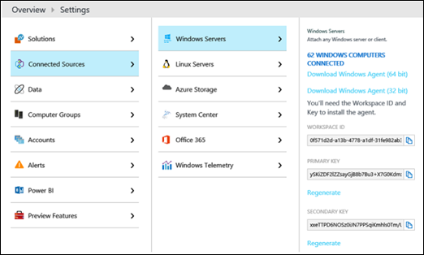

# <a name="monitor-cloud-connector-using-operations-management-suite-oms"></a>Operations Management Suite (OMS) を使用したクラウド コネクタの監視

> [!Important]
> Cloud Connector Edition は、Skype for Business Online と共に 2021 年 7 月 31 日に廃止されます。 組織が Teams にアップグレードしたら、直接ルーティングを使用してオンプレミスのテレフォニー ネットワークを Teams に接続する方法 [について説明します](/MicrosoftTeams/direct-routing-landing-page)。

Microsoft Operations Management Suite (OMS) を使用してクラウド コネクタ バージョン 2.1 以降の展開を監視する方法については、このトピックを参照してください。

Microsoft クラウド IT 管理ソリューションである Operations Management Suite (OMS) を使用して、クラウド コネクタ バージョン 2.1 以降の展開を監視できます。 OMS Log Analytics を使用すると、物理マシンや仮想マシンを含むリソースの可用性とパフォーマンスを監視および分析できます。 OMS と Log Analytics の詳細については [、「What is Operations Management Suite (OMS)」を参照してください。](/azure/operations-management-suite/operations-management-suite-overview)

このトピックは、以下のセクションで構成されています。

- 必要条件

- OMS を使用するクラウド コネクタの構成

- OMS の構成

- Log Analytics リポジトリ内のアラートを分析する

- 推奨される監視セット

## <a name="prerequisites"></a>必要条件

OMS を使用してクラウド コネクタの展開を監視する前に、次の情報が必要になります。

- **Azure アカウントと OMS ワークスペース。** Azure アカウントをまだ持ってない場合は、OMS Log Analytics を使用するアカウントを作成する必要があります。 Azure アカウントを作成して OMS ワークスペースを設定する方法については [、「Log Analytics](/azure/log-analytics/log-analytics-get-started)ワークスペースの概要」を参照してください。

- **クラウド コネクタ バージョン 2.1 以降**

- **クラウド コネクタの監視には、Log Analytics の** 新しいログ検索が必要です。 詳細については [、「Azure Log Analytics ワークスペースを新しいログ検索にアップグレードする」を参照してください](/azure/log-analytics/log-analytics-log-search-upgrade)。

## <a name="configure-cloud-connector-to-use-oms"></a>OMS を使用するクラウド コネクタの構成

OMS を使用するには、クラウド コネクタのオンプレミス環境を構成する必要があります。 これを行うには、OMS ワークスペース ID とキーが必要です。OMS ポータルを使用すると、次のように見つけます。設定 -- 接続ソース \> -- \> Windows サーバー。



OMS を使用するクラウド コネクタの構成方法は、シナリオによって異なります。

- **新しいクラウド コネクタ アプライアンス** をインストールする場合、またはアプライアンスを再展開する場合は、Install-CcAppliance を実行する前に、次の手順を実行します。

    1. [ファイルのCloudConnector.ini [Common] セクションで、OMSEnabled パラメーターを True に設定します。

        クラウド コネクタが展開またはアップグレードされるごとに、OMS エージェントを VM に自動的にインストールします。 OMS エージェントがクラウド コネクタの自動更新を存続できるよう、この機能を有効にします。

    2. OMS ID とキーを構成するには、-AccountType OMSWorkspace Set-CcCredentialを実行します。 

- **既存のクラウド コネクタ アプライアンスに OMS エージェント** をインストールする場合は、次の手順を実行します。

    1. [ファイルのCloudConnector.ini [Common] セクションで、OMSEnabled=true を設定します。 

    2. Import-CcConfiguration を実行します。 

    3. Install-CcOMSAgent を実行します。 

        > [!NOTE]
        > OMSWorkspace 資格情報が設定されていない場合は、install-CcOMSAgent を実行するときに資格情報の入力を求めるメッセージが表示されます。 

- **OMS エージェントが既にインストールされているクラウド コネクタ アプライアンスの OMS ワークスペース ID またはキーを更新する場合は、次の作業を行います。**

    1. OMS ID とキーを構成するには、-AccountType OMSWorkspace Set-CcCredentialを実行します。 

    2. 更新プログラムを適用するには、Install-CcOMSAgent を実行します。 

- **すべてのシナリオで、エージェントが次のように接続されていることを確認します。**

    OMS ポータルで、[設定] - [ \> 接続されたソース] - \> [Windows サーバー] に移動します。 接続されているコンピューターの一覧が表示されます。 

## <a name="configure-oms"></a>OMS の構成

次に、OMS ポータルを使用して OMS 構成を指定する必要があります。 具体的には、次の必要があります。

- イベント ログとパフォーマンス カウンターに関する情報を指定します。

- 通知を作成します。 

### <a name="specify-information-about-event-logs-and-performance-counters"></a>イベント ログとパフォーマンス カウンターに関する情報を指定する

OMS ポータルでは、イベント ログとパフォーマンス カウンターに関する情報を次のように指定する必要があります。

1. [設定] - \> [データ] - \> [Windows イベント ログ] に移動し、次のイベント ログを追加します。 

   - Lync Server

   - アプリケーション

     > [!NOTE]
     > テキスト ボックスに Lync Server を手動で入力する必要があります。 ドロップダウン リストにオプションとして表示されません。 

     詳細については [、「Log Analytics の Windows イベント ログ データ ソース」を参照してください。](/azure/log-analytics/log-analytics-data-sources-windows-events)

2. [設定] - \> [データ] - \> [Windows パフォーマンス カウンター] に移動し、次のパフォーマンス カウンターを追加します。 

   - **OS レベルのカウンター**。 プロセッサの使用状況、メモリ使用量、ネットワーク使用量などの OS レベルのカウンターを追加したり、カウンターを明示的に追加せずに、容量やパフォーマンス、ネットワーク パフォーマンス モニターなどの既存のソリューションを使用できます。 監視方法に関係なく、これらの OS カウンターを監視してください。

   - **Skype for Business カウンター**。 Skype for Business には多数のカウンターが用意されています。 これらのカウンターは、仲介サーバーにログオンし、パフォーマンス モニターを開いて確認できます。 これらのカウンターは、"LS:" で始まる。 Microsoft では、少なくとも次の容量カウンターから始め、関心のある他のカウンターを追加してください。

     アクティブな通話の合計:

       - LS:MediationServer - 受信呼び出し(_Total) \- Current 

       - LS:MediationServer - 発信呼び出し(_Total) \- Current 

     アクティブ なメディア バイパス呼び出しの合計:

       - LS:MediationServer - 受信通話(_Total) \- アクティブ メディア バイパス呼び出し 

       - LS:MediationServer - 発信通話(_Total) \- アクティブ メディア バイパス呼び出し 

     > [!NOTE]
     > テキスト ボックスにパフォーマンス カウンターを手動で入力する必要があります。 ドロップダウン リストにオプションとして表示されません。 

     詳細については [、「Log Analytics」の「Windows および Linux のパフォーマンス データ ソース」を参照してください。](/azure/log-analytics/log-analytics-data-sources-performance-counters)

### <a name="create-alerts"></a>アラートの作成

OMS には、結果アラートの数とメトリック測定アラートの 2 種類のアラートがあります。 アラートの作成の詳細については、「Log Analytics でのアラート [ルールの操作」を参照してください](/azure/log-analytics/log-analytics-alerts-creating)。

アラートを作成する場合は、次の点を考慮する必要があります。

- アラートが既定の選択である結果の数アラートである必要があります。 

- デモ クエリでは、"結果の数" が "0 より大きい" に設定されている必要があります。 

- [タイム ウィンドウ] と [アラートの頻度] の両方を 5 分に設定する必要があります。 

- デモアラートの "アラートを抑制する" を有効にしない方が推奨されます。 

- 一般的なアラート シナリオでは、1 つのエラー アラートと 1 つのリセット アラートという 2 つのアラートを作成することをお勧めします。 エラーアラートの場合は、重大度レベル [重大] を選択します。[リセットアラート] で、[重大度レベル情報] を選択します。

次のセクションでは、サンプルアラートを作成する方法について説明します。

 **アラート ペアを作成する: "RTCMEDSRV は仲介サーバーで実行されていない" と "RTCMEDSRV は仲介サーバーで実行中です"**

このアラート ペアを作成するには、次の方法を使用します。

- エラー アラートのクエリは次の条件を実行します。

  ```Kusto
  Event | where Computer contains "MediationServer" | where EventLog == "Lync Server" and (EventID == 25002 or EventID == 25003)  | summarize arg_max(TimeGenerated, EventID) by Computer | where EventID == 25003
  ```

    このクエリでは、コンピューターに  *"MediationServer" が含まれるコンピューター フィルターを使用します*  。 フィルターは、名前に "MediationServer" という文字列が含まれているコンピューターのみを選択します。

     フィルターを独自のコンピューター フィルターに置き換えるか、単に削除します。 正規表現を使用せずに複雑な文字列フィルターを作成できます。 詳細については [、「String 演算子」を参照してください](https://docs.loganalytics.io/docs/Language-Reference/Scalar-operators/String-operators)。 正規表現を使用することもできます。 さらに、検索クエリを保存し、そのグループをアラート クエリのコンピューター フィルターとして使用して、コンピューター グループを作成できます。 詳細については [、「Log Analytics ログ検索のコンピューター グループ」を参照してください](/azure/log-analytics/log-analytics-computer-groups)。

    各コンピューターについて、エラー クエリは RTCMEDSRV サービスの開始とサービス停止の両方の最後のイベント ログを取得します。 最後のイベントがサービス停止イベントの場合は、ログが 1 つ返されます。最後のイベントがサービス開始イベントの場合は、何も返しません。 つまり、クエリは、RTCMEDSRV がタイム ウィンドウで停止しているサーバーの一覧を返します。 

- リセットアラートのクエリは次の条件を実行します。

  ```Kusto
  Event | where Computer contains "MediationServer" | where EventLog == "Lync Server" and (EventID == 25002 or EventID == 25003) | summarize arg_max(TimeGenerated, EventID) by Computer  | where EventID == 2500
  ```

    リセット クエリは、エラー クエリとは正反対の処理を行います。 コンピューターごとに、最後のイベントがサービス開始イベントの場合は 1 つを返します。最後のイベントがサービス停止イベントの場合、何も返しません。

**アラートペアを作成する: "仲介サーバーでの同時呼び出しが多すぎます"と"同時呼び出しが通常の負荷に戻る"**

このアラートを作成するには、次の方法を使用します。

- エラー アラートのクエリは次の条件を実行します。

  ```Kusto
  Perf | where Computer contains "MediationServer" | where (ObjectName == "LS:MediationServer - Outbound Calls" or ObjectName == "LS:MediationServer - Inbound Calls") | summarize arg_max(TimeGenerated, CounterValue) by ObjectName, Computer | summarize  TotalCalls = sum(CounterValue) by Computer| where TotalCalls >= 500
  ```

    各コンピューターに対して、クエリは受信呼び出しと発信呼び出しの最後のカウンターを取得し、これらの 2 つの値を合計します。 合計値が 500 を超えると、ログが 1 つ返されます。それ以外の場合は何も返しません。 つまり、クエリは、タイム ウィンドウで同時呼び出しが多すぎるサーバーの一覧を返します。

- リセットアラートのクエリは次の条件を実行します。

  ```Kusto
  Perf  | where Computer contains "MediationServer" | where (ObjectName == "LS:MediationServer - Outbound Calls" or ObjectName ==  "LS:MediationServer - Inbound Calls") | summarize arg_max(TimeGenerated, CounterValue) by ObjectName, Computer | summarize  TotalCalls = sum(CounterValue) by Computer| where TotalCalls < 500
  ```

    リセット クエリは、エラー クエリとは正反対の処理を行います。 各コンピューターに対して、クエリは受信呼び出しと発信呼び出しの最後のカウンターを取得し、これらの 2 つの値を合計します。 合計値が 500 未満の場合は、1 つのログが返されます。それ以外の場合は何も返しません。

**アラートを作成する: "CPU 使用率 \> 90 または RTCMEDIARELAY がサーバーで停止しました" アラート**

このアラートを作成するには、次のクエリを実行します。

```Kusto
search *| where Computer contains "MediationServer" | where (Type == "Perf" or Type == "Event") | where ((ObjectName ==  "Processor" and CounterName == "% Processor Time") or EventLog == "Lync Server") | where (CounterValue > 90 or EventID == 22003)
```

クエリは、すべてのコンピューターからすべてのプロセッサ使用率カウンターとサービス停止イベントを取得し、プロセッサ使用率が 90% を超えた場合、またはサービスが停止した場合に 1 つのログを返します。 

## <a name="analyze-the-alerts-in-your-log-analytics-repository"></a>Log Analytics リポジトリ内のアラートを分析する

リポジトリ内のアラートを分析するには、アラート管理ソリューションを使用します。 詳細については、「Operations [Management Suite (OMS)のアラート管理ソリューション」を参照してください。](/azure/log-analytics/log-analytics-solution-alert-management)

## <a name="recommended-minimal-monitoring-set"></a>推奨される最小限の監視セット

イベント ログとパフォーマンス カウンターに関する問題を特定するには、次のコマンドを実行します。 

- **イベント ログ。** 何か問題が発生した場合は、何かが間違っていると示すイベントのセットが 1 つ、もう 1 つのイベントペアが、すべてがうまくいったことを示すイベント ペアが必要です。 特定の期間に対して、記録された最後のイベントで、その期間に何かが間違っているかどうかを示します。

- **パフォーマンス カウンター。** 監視対象のカウンターにはしきい値が必要です。

次の表に、停止イベントと開始イベントの ID を一覧表示して、Microsoft が監視を推奨するサービスを示します。

|サービス名  <br/> |ターゲット サーバーの役割  <br/> |Stop イベント ID  <br/> |イベント ID の開始  <br/> |
|:-----|:-----|:-----|:-----|
|RTCMEDSRV  <br/> |仲介サーバー  <br/> |25003  <br/> |25002  <br/> |
|RTCSRV  <br/> |エッジ サーバー  <br/> |12289  <br/> |12288  <br/> |
|RTCMRAUTH  <br/> |エッジ サーバー  <br/> |19003  <br/> |19002  <br/> |
|RTCMEDIARELAY  <br/> |エッジ サーバー  <br/> |22003  <br/> |22002  <br/> |

次の表に、Microsoft が監視を推奨するネットワークの問題の一覧を示します。


| モニター名  <br/>                                        | ターゲット サーバーの役割  <br/> | Success イベント ID 式  <br/> | Error イベント ID 式  <br/> | エラーの例  <br/> |
|:-----------------------------------------------------------|:--------------------------|:-----------------------------------|:---------------------------------|:-----------------------|
| 仲介サーバーからゲートウェイへの接続エラー  <br/>    | 仲介サーバー  <br/>   | 25062                              |                                  | 25002  <br/>           |
| 仲介サーバーからゲートウェイへの呼び出しの完了エラー  <br/> | 仲介サーバー  <br/>   | 25064                              |                                  | 25002  <br/>           |
| 重大なネットワークの問題  <br/>                           | エッジ サーバー  <br/>        | 14353                              |                                  | 12288  <br/>           |

次に、監視する必要がある通話容量カウンターの一覧を示します。 これらの数値は、Cloud Connector 標準エディションの 500 未満である必要があります。Cloud Connector 最小エディションの場合は 50 未満。

- LS:MediationServer - 受信呼び出し(_Total) \- Current 

- LS:MediationServer - 発信呼び出し(_Total) \- Current 

- LS:MediationServer - 受信通話(_Total) \- アクティブ メディア バイパス呼び出し

- LS:MediationServer - 発信通話(_Total) \- アクティブ メディア バイパス呼び出し

## <a name="see-also"></a>関連項目

OMS の操作の詳細については、以下を参照してください。

- [Log Analytics でログ検索を使用してデータを検索する](/azure/log-analytics/log-analytics-log-searches)

- [Azure Log Analytics 言語リファレンス](https://docs.loganalytics.io/docs/Language-Reference)

- [Log Analytics でのアラートについて](/azure/log-analytics/log-analytics-alerts)

- [Azure の Log Analytics サービスに Windows コンピューターを接続する](/azure/log-analytics/log-analytics-windows-agents)