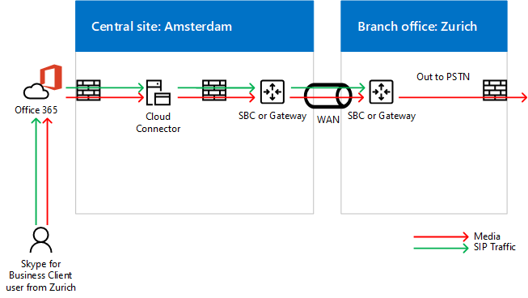

# Cloud Connector エディションでのメディア バイパスを計画するPlan for media bypass in Cloud Connector Edition
 
このトピックでは、Cloud Connector エディション バージョン 2.0 以降でのメディア バイパスの実装を計画する上で考慮すべき事項を説明します。Read this topic to review planning considerations for implementing media bypass with Cloud Connector Edition version 2.0 and later. メディアを展開する方法についてはバイパス、[コネクタのエディションをクラウドに展開メディアをバイパス](deploy-media-bypass-in-cloud-connector.md)を参照してください。For information about deploying media bypass, see [Deploy media bypass in Cloud Connector Edition](deploy-media-bypass-in-cloud-connector.md).
  
メディア バイ パスにより、公衆交換電話網 (PSTN) の次のホップに直接メディアを送信するクライアント-ゲートウェイまたはセッション ボーダー コント ローラー (SBC)-メディアのパスからクラウドのコネクタのエディションのコンポーネントを削除するとします。Media bypass allows a client to send media directly to the Public Switched Telephone Network (PSTN) next hop—a gateway or Session Border Controller (SBC)—and eliminate the Cloud Connector Edition component from the media path.
  
メディア バイパスにより、遅延、パケット損失の可能性、および潜在的な障害点の数を低減して、音声品質を向上できます。Media bypass can improve voice quality by reducing latency, the possibility of packet loss, and the number of points of potential failure. バイパスされる呼び出しの処理、メディアの消去では、クラウドのコネクタは、同時呼び出し数を設定するには、可能で負荷が減り、スケーラビリティを向上させることができます。Elimination of media processing for bypassed calls reduces the load on Cloud Connector, which enables a higher number of concurrent calls, and can improve scalability. 
  
 メディア タスクの処理からクラウドのコネクタを解放する可能性があります数を減らして、インフラストラクチャを必要とするクラウドのコネクタのアプライアンスの可能な場合、メディア バイ パスを有効にする必要があります。Freeing Cloud Connector from media processing tasks may reduce the number of Cloud Connector appliances an infrastructure requires, so you should enable media bypass whenever possible.
  
## メディア バイパスがメディアと信号の経路に及ぼす影響How media bypass affects media and signaling pathways

信号はメディア バイパスの有無に関係なく同じ経路を通りますが、メディアの流れはその影響を受けて異なる経路を通ります。次の図は、メディア バイパスを使用した場合と使用しない場合の、トポロジ内のメディアと信号の経路を示しています。While signaling takes the same path with or without media bypass, the media flow will differ. The following diagrams show media and signaling pathways in topologies with and without media bypass. 
  
次のトポロジでは、-はない採用メディアをバイパスなど、Skype のビジネスのクライアントは、PSTN の呼び出しを外部、Office 365 には、SIP シグナリングおよび Office 365 によって、エンド ・ ユーザーの音声信号のトラフィックを指示し、ポリシーです。For example, in the following topology—which does not employ media bypass—a Skype for Business client places a PSTN call to an external number, the SIP signaling goes to Office 365, and Office 365 then directs the signaling traffic according to the end-user voice policy. クラウド コネクタのユーザーは、ボイス ポリシーは、クラウドのコネクタ エッジ サーバー、PSTN セッション ボーダー コント ローラー (SBC) またはクラウド コネクタの仲介サーバー経由でゲートウェイにシグナリング トラフィックをルーティングする信号のトラフィックを指示します。For Cloud Connector users, the voice policy directs signaling traffic to the Cloud Connector Edge Server, which then routes the signaling traffic to a PSTN Session Border Controller (SBC) or gateway via the Cloud Connector Mediation Server. メディア フロー ビジネス クライアント用の Skype からクラウド コネクタの仲介サーバー、ゲートウェイ、SBC、次の図に示すように。Media flows from the Skype for Business client to the Cloud Connector Mediation Server, and then to the SBC or gateway, as shown in the following diagram:
  
**メディア バイパスを使用しない場合のメディアと信号の経路****Media and signaling pathways without media bypass**

  
PSTN からの着信通話は、同一の信号経路を逆方向で使用します。An inbound call from the PSTN uses the same signaling path in the reverse direction. 内部ユーザーにメディアがビジネス クライアント用の Skype とクラウド コネクタの仲介サーバーとし、SBC またはゲートウェイとの間も最終的にフローします。For internal users, media will still ultimately flow between the Skype for Business client and the Cloud Connector Mediation Server and then the SBC or gateway.
  
次のトポロジでは、-は採用メディアをバイパス、信号は、同じパスですが、メディアのビジネスのクライアント、および SBC またはゲートウェイ、Skype 間で直接フローを次の図に示すように。In the next topology—which does employ media bypass—signaling takes the same path, but media flows directly between the Skype for Business client and the SBC or gateway, as shown in the following diagram:
  
**メディア バイパスを使用する場合のメディアと信号の経路****Media and signaling pathways with media bypass**

  
## マルチサイトのシナリオおよびメディア バイパスMulti-site scenario and media bypass

メディア バイ パスは、クラウドのコネクタの 1 つのアプライアンスを使用して複数のサイトに、テレフォニー サービスを提供する場合にも役立ちます。Media bypass is also useful when you want to provide telephony services to multiple sites using a single Cloud Connector appliance. クラウドのコネクタは、送信元または送信先の番号を基に呼をルーティングできません、ために、ほとんどの企業では、ルーティングを決定するのには、SBC やクラウドのコネクタの背後にあるゲートウェイを展開します。Because Cloud Connector cannot route calls based on source or destination numbers, most enterprises deploy an SBC or gateway behind Cloud Connector to make routing decisions. このシナリオでは、次の図に示すようにメディア バイパスによりクライアントと中央 SBC またはゲートウェイ間の転送が排除されています。Media bypass in this scenario eliminates the hop between the client and the central SBC or gateway, as shown in the following diagram:
  
**マルチサイトでの適用****Multi-site application**

  
1. SIP トラフィックでは、Office 365 にチューリッヒのユーザーから送られます。The SIP traffic flows from the user in Zurich to Office 365.
    
2. トラフィックは、アプライアンスは、ユーザーの音声ルーティング ポリシーで指定されているアムステルダムのクラウドのコネクタにルーティングします。The traffic then routes to the Cloud Connector appliance in Amsterdam as specified in the user voice routing policy.
    
3. アムステルダムにコネクタのクラウド アプライアンスは、アムステルダムで中心的なゲートウェイに SIP トラフィックを送信します。The Cloud Connector appliance in Amsterdam sends the SIP traffic to the central gateway in Amsterdam.
    
4. アムステルダムで中央のゲートウェイは、適切なルーティングの決定は、し、SBC やチューリッヒ、ビジネス クライアントと SBC またはアムステルダムにゲートウェイの Skype 間で直接メディア フロー中にゲートウェイにトラフィックを送信します。The central gateway in Amsterdam makes the appropriate routing decisions, and then sends the traffic to an SBC or gateway in Zurich, while media flows directly between the Skype for Business client and SBC or gateway in Amsterdam.
    
 このアプローチにより、クラウドのコネクタが一元化され、クラウド コネクタの展開を 1 つあたりのより多くのユーザーにサービスを提供します。This approach allows serving more users per one Cloud Connector deployment where Cloud Connector is centralized. メディア パスから削除されると、クラウドのコネクタも、一元的なマルチサイトのシナリオでメディア可能性がありますも WAN に送り出さ一元的な SBC またはゲートウェイを通過するのには必要に応じて 2 回です。Even though Cloud Connector is eliminated from the media path, in a centralized multi-site scenario media may still traverse the WAN twice as required to flow through the centralized SBC or gateway.
  
クライアントが発信呼び出しを配置する企業ネットワークの外部にある場合は、メディア トラフィックは次の図に示すように、チューリッヒ、アムステルダムの間でのクラウドのコネクタおよび WAN リンクのエッジと仲介サーバーを経由して配信されます。If a client is outside the corporate network placing an outbound call, the media traffic flows via the Edge and Mediation servers of Cloud Connector and WAN link between Zurich and Amsterdam, as shown in the following diagram:
  

  
## メディア バイパスでサポートされるクライアントSupported clients for media bypass

メディア バイ パスの最初のリリースでのみサポートされているクライアントは、Office 365 用リソース、バージョン 16.0.7870.2020 の一部であるビジネス 2016年の Windows クライアントの Skype またはそれ以上です。With the first release of media bypass, the only supported client is the Skype for Business 2016 Windows Client that is part of Office 365 ProPlus, version 16.0.7870.2020 or greater. お客様は、最新機能提供、段階的提供、段階的提供チャネルの最初のリリースから任意のチャネルを選択できます。Customers can use any channel: Current, Deferred, or First Release Deferred. 
  
> [!NOTE]
> クライアント VPN ソリューションを Skype for Business クライアントと組み合わせて使用している場合、メディア バイパスは VPN 分割トンネル構成でのみサポートされます。If you are using a client VPN solution in combination with the Skype for Business client, then media bypass is supported only with a VPN split-tunnel configuration. 
  
リリース チャネルの詳細については、 [Office 365 用リソースの更新チャンネルの概要](https://support.office.com/en-us/article/Overview-of-update-channels-for-Office-365-ProPlus-9ccf0f13-28ff-4975-9bd2-7e4ea2fefef4?ui=en-US&amp;rs=en-US&amp;ad=US)を参照してください。For more information about the release channels, see [Overview of update channels for Office 365 ProPlus](https://support.office.com/en-us/article/Overview-of-update-channels-for-Office-365-ProPlus-9ccf0f13-28ff-4975-9bd2-7e4ea2fefef4?ui=en-US&amp;rs=en-US&amp;ad=US).
  
さまざまなチャネルでクライアントの現在のリリース バージョンは、[リリースの Office 365 用リソースへの更新情報](https://docs.microsoft.com/officeupdates/release-notes-office365-proplus)を参照してください。For the current release version of the clients in different channels, see [Release information for updates to Office 365 ProPlus](https://docs.microsoft.com/officeupdates/release-notes-office365-proplus). 
  
## メディア バイパスに関連する Cloud Connector の容量の考慮事項Cloud Connector capacity considerations with media bypass

メディアを省略せず、およびハードウェアによって-コネクタのクラウド アプライアンスは、50 から仲介サーバーを経由するようにメディアを必要とする 500 の同時呼び出しを処理できます。Without media bypass—and depending on the hardware—a Cloud Connector appliance can handle from 50 to 500 simultaneous calls that require media to travel through a Mediation Server. 詳細については、 [Skype ビジネス クラウド コネクタ ・ エディションの計画](https://technet.microsoft.com/en-us/library/mt605227.aspx)を参照してください。For more information, see [Plan for Skype for Business Cloud Connector Edition](https://technet.microsoft.com/en-us/library/mt605227.aspx). 
  
メディア バイパスを使用すると、サポートされるバージョンの内部クライアントでは仲介サーバーが使用されないため、内部クライアントの数を大幅に増やすことができます。With media bypass enabled, internal clients on the supported version do not use the Mediation Server, so the number of internal clients can increase significantly. 
  
前述したように、外部のクライアント、またはサポートされていないクライアント、メディアのコネクタの端をクラウドと仲介サーバーを使用しています。As noted above, external clients or unsupported clients will use the Cloud Connector Edge and Mediation servers for media. クラウド コネクタ アプライアンスの数は、サイトに配置する必要がありますを計算するときは、外部のユーザーとユーザーがサポートされていないクライアントからのトラフィックを考慮する必要があります。When calculating how many Cloud Connector appliances should be placed in a site, you must consider traffic from external users and users on unsupported clients.
  
## Cloud Connector による [常にバイパスする] モードのサポートCloud Connector supports Always Bypass mode

クラウドのコネクタには、常にバイパス モードのみがサポートされています。Cloud Connector supports Always Bypass mode only. オンプレミス環境では、[常にバイパスする] と [サイトおよび地域情報の使用] の 2 つのオプションがあります。In on-premises environments, there are two options: Always Bypass and Use Site and Region Information.
  
[常にバイパスする] では、内部クライアントを発信元または発信先とするすべての PSTN 通話に対してメディア バイパスが試行されます。クライアントが内部または外部のクライアントであるかを判別するには、仲介サーバーの仮想マシン上にある Web サイトを使用します。クライアントがサイトに到達できる場合は、内部クライアントであると見なされて、メディア バイパスが使用されます。クライアントがサイトに到達できない場合 (たとえば、クライアントがホーム ネットワーク上に存在しない場合)、メディア バイパスは使用されません。Always Bypass means that media bypass will be attempted for all PSTN calls with internal clients as an origin or destination point. To determine if the client is internal or external, a web site on the mediation server virtual machine is used. If the client can reach the site, it is considered internal and media bypass is used. If the client cannot reach the site (for example the client is on a home network), media bypass is not used. 
  
[常にバイパスする] を使用するには、PSTN サイト内でユーザーと PSTN ゲートウェイ間に妨げのない接続が必要になります。Always Bypass requires unobstructed connectivity between users and the PSTN gateways within a PSTN Site. 
  
詳細については、 [Skype ビジネス クラウド コネクタ ・ エディションの計画](https://technet.microsoft.com/en-us/library/mt605227.aspx)を参照してください。For more information, see [Plan for Skype for Business Cloud Connector Edition](https://technet.microsoft.com/en-us/library/mt605227.aspx). 
  
などの下の図では、ヨーロッパのユーザーする必要があります 3 つのセッション ボーダー コント ローラー (SBCs) アムステルダムに適切に接続されて中に、米国の西のユーザーは、シアトルの 2 つの半角英数字にも接続されている必要があります。For example, in the diagram below, Europe users must be well connected to the three Session Border Controllers (SBCs) in Amsterdam while US West users must be well connected to the two SBCs in Seattle. 良好な接続性とは、ユーザーが SBC またはゲートウェイとしての同一ネットワーク サイト内に存在するか、適切なバンド幅を備えた WAN リンク上に存在することを意味します。Well connected means that they are either located in the same network sites as the SBCs or gateways, or over WAN links that have proper bandwidth.
  

  
> [!NOTE]
> ユーザーがチューリッヒからシアトルのオフィスに移動する場合に、そのユーザーとヨーロッパのゲートウェイ間でメディア トラフィックを可能にするために (インターネットの代わりに) 内部ネットワークを使用するには、ヨーロッパの SBC またはゲートウェイが配置されているアムステルダム オフィスとシアトル オフィスが良好な接続性を保っている必要があります。If a user from Zurich travels to the Seattle office, and you want to use the internal network to deliver media traffic between the traveling user and gateways in Europe (as opposed to going over the Internet), then you must make sure the Seattle office and the Amsterdam office where European SBCs or gateways are located qualify as well connected. 
  
## メディア バイパスで使用されるコーデックCodecs used in media bypass

メディア バイパスを有効にすると、クライアントと SBC またはゲートウェイ間で G.711 コーデックが使用されます。With media bypass enabled, media traffic between a client and an SBC or gateway uses the G.711 codec. 
  
## 関連項目See also

[Cloud Connector エディションでメディア バイパスを展開するDeploy media bypass in Cloud Connector Edition](deploy-media-bypass-in-cloud-connector.md)