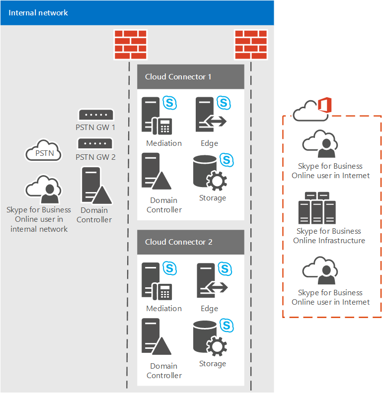

# <a name="plan-for-skype-for-business-cloud-connector-edition"></a>Skype for Business Cloud Connector Edition の計画

> [!Important]
> Cloud Connector Edition は、Skype for Business Online と共に 2021 年 7 月 31 日に廃止されます。 組織が Teams にアップグレードしたら、直接ルーティングを使用してオンプレミスのテレフォニー ネットワークを Teams に接続する方法 [について説明します](/MicrosoftTeams/direct-routing-landing-page)。

電話システム (クラウド PBX) とのオンプレミス PSTN 接続を実装するパッケージ化された仮想マシン (VM) のセットである Skype for Business Cloud Connector Edition に関する情報を参照してください。

既存の Lync Server または Skype for Business Server 展開がない場合は、クラウド コネクタエディションが組織に適切なソリューションになる可能性があります。 ビジネスに最適な電話システム ソリューションをまだ調査している場合は、「Microsoft テレフォニー ソリューション [」を参照してください](/microsoftteams/cloud-voice-landing-page)。

このドキュメントでは、Cloud Connector Edition の要件とサポートされるトポロジについて説明し、クラウド コネクタ エディションの展開を計画するのに役立ちます。 クラウド コネクタ環境を構成する前に、必ずこのトピックをお読みください。 クラウド コネクタ エディションを展開して構成する準備ができたら [、「Skype for Business Cloud Connector Edition の構成と管理」を参照してください](configure-skype-for-business-cloud-connector-edition.md)。

クラウド コネクタ エディション 2.1 が利用可能になります。 まだ 2.1 にアップグレードしていない場合は、「新しいバージョンのクラウド コネクタにアップグレードする」 [を参照してください](upgrade-to-a-new-version-of-cloud-connector.md)。 インストール ファイルは、 で確認できます [https://aka.ms/CloudConnectorInstaller](https://aka.ms/CloudConnectorInstaller) 。

> [!NOTE]
> Microsoft は、新しいバージョンのリリース後 60 日間、以前のバージョンの Cloud Connector Edition をサポートしています。 Microsoft はバージョン 2.0.1 を 2.1 のリリース後 60 日間サポートし、アップグレードの時間を提供します。 2.0.1 以前のすべてのバージョンはサポートされなくなりました。

クラウド コネクタエディションは、電話システムとのオンプレミス PSTN 接続を実装する一連のパッケージ仮想マシン (VM) で構成されるハイブリッド 製品です。 最小限の Skype for Business Server トポロジを仮想化環境に展開することで、クラウドに所属する組織内のユーザーは Microsoft クラウドから PBX サービスを受信できますが、PSTN 接続は既存のオンプレミス音声インフラストラクチャを介して提供されます。


クラウド コネクタを使用すると、電話システム サービスを既存のテレフォニー環境 (PBX、アナログ デバイス、コール センターなど) と統合することができますので、既存のテレフォニー ソリューションから電話システムへの段階的な移行を実装できます。

たとえば、電話システムが提供していない特定の機能を備える高度なコール センターが会社にあるとします。 コール センターのユーザーは既存のソリューションに任せ、他のユーザーを電話システムに移動することができます。

クラウド コネクタは、オンプレミスとオンラインのユーザー間のルーティングを提供し、電話システムで独自の PSTN プロバイダーを使用できます。

クラウド コネクタ エディションの展開を計画する場合は、次の点を考慮してください。

- クラウド コネクタを使用してクラウド音声ソリューションを利用するには、電話システムを含む Microsoft 365 または Office 365 組織にサインアップする必要があります。 Microsoft 365 または Office 365 組織がまだない場合は、ここでサインアップする方法について説明します [。Microsoft 365 for Business](https://products.office.com/business/office). Skype for Business Online を含むプランにサインアップする必要があります。

- クラウド コネクタ アプライアンスを Skype for Business Online サービスに登録し、さまざまなコマンドレットを実行するには、クラウド コネクタ 2.0 以降では、Skype for Business テナント管理者権限を持つ専用の Microsoft 365 または Office 365 アカウントが必要です。 2.0 より前のクラウド コネクタ のバージョンでは、テナントグローバル管理者権限を持つ専用の Microsoft 365 または Office 365 アカウントが必要です。

- クラウド コネクタは、オンプレミスの Skype for Business Server の完全な展開を必要としません。

    現在、クラウド コネクタは Lync または Skype for Business のオンプレミス サーバーと共に存在できません。 既存の Lync または Skype for Business ユーザーを Microsoft 365 に移動し、ユーザーにオンプレミステレフォニーを提供し続ける場合は、既存の Skype for Business Server 展開を使用したオンプレミス接続の電話システムを検討してください。 詳細については、「電話システム [(クラウド PBX)](/microsoftteams/cloud-voice-landing-page.md) ソリューションを計画する」および「Skype for Business Server でオンプレミス PSTN 接続を使用して電話システムを [計画する」を参照してください](plan-phone-system-with-on-premises-pstn-connectivity.md)。

- 以前の Skype for Business または Lync Server の展開を行い、スキーマを拡張した場合は、環境からすべての Skype for Business または Lync Server コンポーネントを削除している限り、クラウド コネクタ展開のスキーマをクリーンアップする必要があります。

- ユーザーはオンラインでホームです。

- 組織でディレクトリ同期 (DirSync) が構成されている場合は、ハイブリッド音声用に計画されているユーザーのすべてのアカウントを、最初にオンプレミス展開で作成し、クラウドに同期する必要があります。

- 必要に応じて、現在の PSTN 通信事業者を維持できます。

- クラウド コネクタでホストされているユーザーにダイヤルイン会議を提供する場合は、PSTN 会議ライセンスを購入するか、Microsoft から電話会議の提供を受け付け、支払いを行います。

- 通話エスカレーションに必要な電話会議ライセンス (または提供に応じて支払う) も必要です。 Skype for Business ユーザーが外部 PSTN ユーザーから電話を受け取り、その通話にもう 1 人の参加者を追加する (通話を会議にエスカレートする) 場合、エスカレーションは Microsoft 電話会議サービスを介して実行されます。

- クラウド コネクタ 2.0 以降では、メディア バイパスがサポートされています。 メディア バイパスを使用すると、クライアントはパブリック 交換電話網 (PSTN) ネクスト ホップ (ゲートウェイまたはセッション ボーダー コントローラー (SBC)) にメディアを直接送信し、メディア パスから Cloud Connector Edition コンポーネントを削除できます。 詳細については、「Plan [for media bypass in Cloud Connector Edition」を参照してください](plan-for-media-bypass-in-cloud-connector-edition.md)。

- クラウド コネクタ 2.1 以降では、Operations Management Suite (OMS) を使用したクラウド コネクタの監視がサポートされています。 詳細については、「Monitor [Cloud Connector using Operations Management Suite (OMS)」を参照してください。](monitor-cloud-connector-using-operations-management-suite-oms.md)

- クラウド コネクタは、365 Enterprise E5 Office利用可能なすべての国で利用できます。

このトピックは、以下のセクションで構成されています。

- [Cloud Connector Edition コンポーネント](plan-skype-for-business-cloud-connector-edition.md#BKMK_Components)

- [Cloud Connector Edition トポロジ](plan-skype-for-business-cloud-connector-edition.md#BKMK_Topologies)

- [展開の要件](plan-skype-for-business-cloud-connector-edition.md#BKMK_Requirements)

- [展開前に収集する必要がある情報](plan-skype-for-business-cloud-connector-edition.md#BKMK_PlanDeployment)

- [ダイヤル プランの考慮事項](plan-skype-for-business-cloud-connector-edition.md#BKMK_DailPlan)

- [高可用性に関する考慮事項](plan-skype-for-business-cloud-connector-edition.md#BKMK_HA)

- [クラウド コネクタ のメディア フロー](plan-skype-for-business-cloud-connector-edition.md#BKMK_MediaFlow)

- [監視とトラブルシューティング](plan-skype-for-business-cloud-connector-edition.md#BKMK_Monitor)

- [詳細情報](plan-skype-for-business-cloud-connector-edition.md#BKMK_MoreInfo)

## <a name="cloud-connector-edition-components"></a>Cloud Connector Edition コンポーネント
<a name="BKMK_Components"> </a>

クラウド コネクタ エディションでは、最小限の Skype for Business Server トポロジを含むパッケージ化された VM のセット (エッジ コンポーネント、仲介コンポーネント、および中央管理ストア (CMS) の役割で構成される) を展開します。 また、クラウド コネクタの内部機能に必要なドメイン コントローラーもインストールします。 これらのサービスは、Skype for Business Online サービスを含む Microsoft 365 または Office 365 組織とのハイブリッド用に構成されています。


クラウド コネクタ コンポーネントは、次の機能を提供します。

- **エッジ コンポーネント** - オンプレミス トポロジとオンライン サービス間の通信は、次のコンポーネントを含むエッジ コンポーネントを経由します。

  - **Access Edge** - オンプレミス展開と Skype for Business Online の間の SIP ルーティングを提供します。

  - **Media Relay** - 仲介コンポーネントと他のメディア エンドポイント間のメディアのルーティングを提供します。

  - **Media Relay Authentication / MRAS** - メディア リレーにアクセスするトークンを生成します。

- **送信ルーティング** - クラウド コネクタ アプライアンスに接続されているゲートウェイまたは SPC 間の音声トラフィックの負荷分散を提供します。 呼び出しは、クラウド コネクタ アプライアンスに接続されているすべてのゲートウェイまたは SPC の間で、同じ間隔で分割されます。

    ポリシーに基づいてゲートウェイへのルーティングを提供します。 宛先 (送信) PSTN 番号に基づくグローバル ポリシーだけがサポートされます。

- **中央管理ストア (CMS) の役割** - CMS ファイル転送を含むトポロジ コンポーネントの構成ストアが含まれます。

- **中央管理ストア (CMS) レプリカ** - CMS 役割サーバー上のグローバル CMS DB から構成情報を同期します。

- **ドメイン コントローラー** - クラウド コネクタ Active Directory ドメイン サービスを使用して、クラウド コネクタ コンポーネントの展開に必要なすべてのグローバル設定とグループを格納します。 クラウド コネクタ アプライアンスごとに 1 つのフォレストが作成されます。 ドメイン コントローラーは、実稼働 Active Directory との接続を持つ必要があります。 Active Directory サービスには、次のものが含まれます。

  - Active Directory Domain Services

  - 内部証明書を発行する Active Directory 証明書サービス

- **仲介コンポーネント** - Skype for Business ゲートウェイと PSTN ゲートウェイ間の SIP ゲートウェイとメディア ゲートウェイ マッピング プロトコルを実装します。 グローバル CMS データベースから構成を同期する CMS レプリカが含まれています。

## <a name="cloud-connector-edition-topologies"></a>Cloud Connector Edition トポロジ
<a name="BKMK_Topologies"> </a>

この説明では、PSTN サイトを参照します。 PSTN サイトは、クラウド コネクタ アプライアンスの組み合わせで、同じ場所に展開され、共通の PSTN ゲートウェイが接続されています。 PSTN サイトでは、次の機能を使用できます。

- ユーザーに最も近いゲートウェイへの接続を提供します。

- 1 つ以上の PSTN サイト内に複数のクラウド コネクタ アプライアンスを展開することでスケーラビリティを実現します。

- 1 つの PSTN サイト内に複数のクラウド コネクタ アプライアンスを展開することで高可用性を実現します。

このトピックでは、PSTN サイトについて説明します。 PSTN サイトの計画の詳細については、「Plan [for Cloud Connector Edition PSTN サイト」を参照してください](plan-for-cloud-connector-edition-pstn-sites.md)。

次のクラウド コネクタ トポロジを展開できます。

- PSTN サイトごとに 1 つのクラウド コネクタ エディション アプライアンス。 このトポロジは、高可用性を提供しないので、評価目的でのみお勧めします。

- 高可用性を提供する PSTN サイトごとの複数のクラウド コネクタ エディション アプライアンス。

- 複数のクラウド コネクタ エディション アプライアンスを備えた複数の PSTN サイトで、高可用性のスケーラビリティを提供します。 最大 200 のサイトを展開できます。

トポロジを計画する場合は、次の点を考慮してください。

- クラウド コネクタ 2.0 以降では、1 つの PSTN サイトに最大 16 台のクラウド コネクタ アプライアンスを使用できます。 以前のバージョンでは、サイトごとに最大 4 つのアプライアンスがサポートされています。

- クラウド コネクタでテストされるハードウェア構成には、次の 2 種類があります。

  - 大きなバージョンでは、大量の同時呼び出しを処理できます。すべての種類の実稼働環境でサポートされます。

  - より小さいバージョンは、下位ハードウェアで実行することを目的とします。評価目的や通話量の少ないサイトに使用できます。 より小さいバージョンのクラウド コネクタを展開する場合でも、実稼働クラスのハードウェア要件 (デュアル電源など) に気を付けする必要があります。

- Cloud Connector バージョン 2.0 以降を使用し、最大構成の 16 台のアプライアンス (より大きなハードウェアを使用) を展開する場合、PSTN サイトは最大 8,000 回の同時通話を処理できます。 より小さいバージョンを展開する場合、サポートされる制限は 800 です。

    また、一部のアプライアンスを高可用性用に使用する必要もあります。 最小限の推奨事項は、1 つのアプライアンスを高可用性用に予約する必要があるという方法です。

  - バージョン 2 では、15+1 構成を展開すると、PSTN サイトで最大 7,500 回の同時通話を処理できます。

  - 以前のバージョンを使用し、最大 3 + 1 の構成 (より大きなハードウェアを使用) を展開する場合、PSTN サイトは最大 1500 回の同時呼び出しを処理できます。 より小さいバージョンを展開する場合、サポートされる制限は 150 です。

-  PSTN サイトごとにより多くの通話が必要な場合は、同じ場所に追加の PSTN サイトを展開してスケール アップできます。

> [!NOTE]
> 以下の図と例では、特に説明しない限り、より大きなバージョンの Cloud Connector を使用すると想定しています。

### <a name="single-cloud-connector-appliance-within-a-single-pstn-site"></a>1 つの PSTN サイト内の単一クラウド コネクタ アプライアンス

次の図は、1 つの PSTN サイト内の単一のクラウド コネクタ エディション アプライアンスを示しています。 クラウド コネクタは、セキュリティを目的として境界ネットワーク内にある 1 台の物理ホスト マシンにインストールされた 4 つの VM で構成されます。


### <a name="multiple-cloud-connector-appliances-within-a-single-pstn-site"></a>1 つの PSTN サイト内の複数のクラウド コネクタ アプライアンス

 スケーラビリティと高可用性を目的として、次の図に示すように、1 つの PSTN サイト内に複数のクラウド コネクタ エディションを設定できます。 次の状況について検討しましょう。

- 呼び出しは、1 つのプール内のクラウド コネクタ間でランダムな順序で分散されます。

- 容量計画の目的では、次の計算に基づいて、1 つ以上のクラウド コネクタがオフラインの場合に負荷を処理する機能を検討する必要があります。

  - **N+1 ボックス。** より大きなバージョンのクラウド コネクタでは、N+1 ボックスは 99.8% の可用性を持つ 500 N の同時呼び出 \* しをサポートします。

    小規模バージョンのクラウド コネクタでは、N+1 ボックスは 99.8% の可用性を持つ 50 N の同時呼び出 \* しをサポートします。

  - **N+2 ボックス。** より大きなバージョンのクラウド コネクタでは、N+2 ボックスは 99.9% の可用性を持つ 500 N の同時呼び出 \* しをサポートします。

    クラウド コネクタの小規模バージョンでは、N+2 ボックスは 99.9% の可用性で 50 N の同時呼び出 \* しをサポートします。



### <a name="multiple-pstn-sites-with-one-or-more-cloud-connectors-per-site"></a>サイトごとに 1 つ以上のクラウド コネクタを持つ複数の PSTN サイト

また、各サイトに 1 つ以上のクラウド コネクタ エディションを持つ複数の PSTN サイトを持つ場合も選択できます。 PSTN サイトが同時通話の制限に達した場合は、負荷を処理するために別の PSTN サイトを追加できます。

複数の PSTN サイトを使用すると、ユーザーに最も近いゲートウェイへの接続を提供できます。 たとえば、シアトルとアムステルダムに PSTN ゲートウェイがあるとします。 2 つの PSTN サイト (1 つはシアトル、1 つはアムステルダム) を展開し、最も近い PSTN サイトを使用するユーザーを割り当てできます。 シアトルからのユーザーはシアトルの PSTN サイトとゲートウェイにルーティングされ、アムステルダムのユーザーはアムステルダムの PSTN サイトとゲートウェイにルーティングされます。


## <a name="requirements-for-deployment"></a>展開の要件
<a name="BKMK_Requirements"> </a>

Cloud Connector Edition を展開する前に、環境に対して次の情報を使用してください。

- **ホスト コンピューターの場合 -** クラウド コネクタ VM は、Hyper-V の役割が有効になっている R2 データセンター エディション (英語) Windows Server 2012実行している専用のハードウェアに展開する必要があります。

    バージョン 2.0 以降では、Skype for Business Corpnet スイッチにバインドされているホスト コンピューター ネットワーク カードに、クラウド コネクタの企業ネットワーク コンピューターと同じサブネットに IP アドレスが構成されている必要があります。

- バージョン 2.1 以降では、ホスト アプライアンスに 4.6.1 以降.NET Frameworkがインストールされている必要があります。

- **仮想マシンの場合 -** R2 Windows Server 2012 (英語) イメージ (.iso) です。 ISO は、Skype for Business Cloud Connector Edition を実行する仮想マシンの VHD に変換されます。

- 展開内のクラウド コネクタ エディションごとに 4 つの VM のインストールをサポートするために必要なハードウェア。 次の構成をお勧めします。

  - 64 ビット デュアル プロセッサ、6 コア (12 実コア)、2.50 ギガヘルツ (GHz) 以上

  - 64 ギガバイト (GB) ECC RAM

  - RAID 5 構成で構成された 600 GB 以上の 10K RPM 128M キャッシュ SAS 6Gbps ディスク 4 台

  - 3 つの 1 Gbps RJ45 ハイ スループット ネットワーク アダプター

- 最大 50 回の同時通話をサポートする小規模バージョンの Cloud Connector Edition を展開する場合は、次のハードウェアが必要です。

  - Intel i7 4790 Quad core with Intel 4600 Graphics (ハイ エンド グラフィックスは不要)

  - 32 GB DDR3-1600 非 ECC

  - 2: RAID 0 の 1TB 7200RPM SATA III (6 Gbps)

  - 2: 1 Gbps イーサネット (RJ45)

- インターネットを参照するためにホスト コンピューターでプロキシ サーバーが必要な場合は、次の構成を変更する必要があります。

  - プロキシをバイパスするには、プロキシ サーバーに設定された WinHTTP プロキシ設定と、"192.168.213" を含むバイパス リストを指定します \* 。クラウド コネクタ管理サービスおよび Skype for Business Corpnet サブネットで使用されるネットワークを、CloudConnector.ini ファイルにCloudConnector.iniします。 それ以外の場合、管理接続は失敗し、クラウド コネクタの展開と自動回復が防止されます。 winhttp 構成コマンドの例を次に示します。netsh winhttp set proxy "10.10.10.175:8080" bypass-list=" \* .local;1; \*172.20. \* ;192.168.218. \* ' \<local\> ".

  - ユーザーごとにではなく、コンピューターごとにプロキシ設定を指定します。 それ以外の場合、クラウド コネクタのダウンロードは失敗します。 レジストリの変更またはグループ ポリシー設定を使用して、コンピューターごとにプロキシ設定を次のように指定できます。

  - **レジストリ: HKEY_LOCAL_MACHINE\SOFTWARE\Policies\Microsoft\Windows\CurrentVersion\Internet Settings]** ProxySettingsPerUser dword:000000000

  - **グループ ポリシー:** [ \> コンピューター管理用テンプレート \> ] Windows コンポーネント \> Internet Explorer: コンピューターごとにプロキシ設定を行う (ユーザー単位ではなく)

- 修飾された PBX/トランクまたは修飾された SBC/ゲートウェイ (少なくとも 2 つのゲートウェイをお勧めします)。

    クラウド コネクタは、Skype for Business の認定を受けたのと同じセッション ボーダー コントローラー (SPC) をサポートします。 詳細については、「テレフォニー [インフラストラクチャ for Skype for Business」を参照してください](../../../SfbPartnerCertification/certification/infra-gateways.md)。

- ホスト サーバーに Hyper-V をインストールして構成するためのアクセス許可を持つローカル サーバー管理者アカウント。 アカウントには、Hyper-V がインストールされ構成されているローカル サーバーに対する管理者権限が必要です。

- 展開中に、クラウド コネクタ ドメインでトポロジを作成および発行するためのアクセス許可を持つドメイン管理者アカウントの作成を求めるメッセージが表示されます。

- 外部 DNS レコードは、インストール パッケージに含まれる CloudConnector.iniファイルで定義されます。

  - エッジ コンポーネントの Access Edge サービスの外部 DNS レコード。たとえば \<Domain Name\> 、ap. PSTN サイトごとに 1 つのレコードが必要です。 このレコードには、そのサイトのすべてのエッジの IP アドレスが含まれている必要があります。

- Microsoft 365 または Office 365 組織で、必要なすべての DNS レコードと SRV レコードが作成されます。

    > [!IMPORTANT]
    > テナントを Cloud Connector Edition と統合する場合、組織の SIP ドメインとして既定のドメイン サフィックス .onmicrosoft.com を使用することはできません。 > sip は使用できません。\<Domain Name\> この DNS レコードは Microsoft 365 および 365 で使用されるため、クラウド コネクタ エッジ アクセス プロキシ インターフェイスOfficeします。

- パブリック証明機関 (CA) から取得した外部エッジの証明書。

- 必要なポートを通過するトラフィックを許可するファイアウォール ルールが完了しました。

- ホスト コンピューターと VM のインターネット接続。 クラウド コネクタは、インターネットから一部のソフトウェアをダウンロードします。そのため、クラウド コネクタ ホスト コンピューターと VM がインターネットに接続し、必要なソフトウェアをダウンロードできるよう、ゲートウェイと DNS サーバーの情報を提供する必要があります。

- ホスト コンピューターにインストールされているテナントのリモート PowerShell モジュール。

- リモート PowerShell を実行する Skype for Business 管理者資格情報。

    > [!IMPORTANT]
    > 管理者アカウントで多要素認証が有効になっていない必要があります。

> [!NOTE]
> クラウド コネクタの展開は、Microsoft Hyper-V 仮想化プラットフォームでのみサポートされます。 VMware や Amazon Web Services などの他のプラットフォームはサポートされていません。

> [!NOTE]
> Cloud Connector を実行する最小ハードウェア ガイダンスは、基本的なハードウェア容量 (コア、MHz、ギガバイトなど) に基づいており、任意のコンピューターのアーキテクチャに埋もれた無形のパフォーマンス障害に対応するために、いくつかのバッファーを使用します。 Microsoft は、最小限のガイダンスを満たした市販のハードウェアで最悪の場合の負荷テストを実行しました。 メディア品質とシステムパフォーマンスが検証されます。 Microsoft の公式クラウド コネクタ アプライアンス パートナーは、独自にパフォーマンスをテストした特定のクラウド コネクタ ハードウェア実装を持ち、負荷と品質の要件を満たすためにハードウェアの適合性を備えています。

> [!NOTE]
> AudioCodes と Sonus によって生成されたデバイスは、コードを変更し、Windows Server Standard Edition のサーバーで実行しています。 これらのデバイスはサポートされています。

## <a name="information-you-need-to-gather-before-deployment"></a>展開前に収集する必要がある情報
<a name="BKMK_PlanDeployment"> </a>

展開を開始する前に、展開のサイズ、サービスが提供されている SIP ドメイン、展開を計画している各 PSTN サイトの構成情報を決定する必要があります。 まず、次の方法を使用します。

- 会社で使用されている SIP URI に基づいて、この展開によって提供されるすべての SIP ドメインを識別します。

- 展開する必要がある PSTN サイトの数を決定します。

- クラウド コネクタ エディションごとにインストールする 4 つの VM をサポートするために必要なハードウェアが用意されている必要があります。

展開を計画している PSTN サイトごとに、次の必要があります。

- 各クラウド コネクタ アプライアンス内のすべてのコンポーネントの名前を作成します (「展開パラメーターの決定 [」を参照](plan-skype-for-business-cloud-connector-edition.md#BKMK_SiteParams))。

- ポート範囲の定義 (「 [ポートとプロトコル」を参照](plan-skype-for-business-cloud-connector-edition.md#BKMB_Ports))。

- エッジ コンポーネントの外部 DNS レコードを作成します (「 [展開の要件」を参照](plan-skype-for-business-cloud-connector-edition.md#BKMK_Requirements))。

- エッジ コンポーネントの証明書要件を決定します (「 [証明書の要件」を参照](plan-skype-for-business-cloud-connector-edition.md#BKMK_Certs))。

### <a name="ports-and-protocols"></a>ポートとプロトコル
<a name="BKMB_Ports"> </a>

メディア ポート範囲を定義する場合は、次の点に注意してください。

- クライアントは、メディア トラフィックに対して常にポート範囲 50000 ~ 50019 を使用します。この範囲は Skype for Business Online で事前定義され、変更できません。

- 仲介コンポーネントは、既定では、メディア トラフィックにポート範囲 49 152 ~ 57 500 を使用します。 ただし、接続は内部ファイアウォール経由で確立され、セキュリティ上の理由から、トポロジ内でこのポート範囲を制限できます。 通話ごとに最大 4 つのポートが必要です。 仲介コンポーネントと PSTN ゲートウェイの間のポート数を制限する場合は、ゲートウェイで対応するポート範囲を構成する必要があります。

- 境界ネットワークにクラウド コネクタを展開する必要があります。 つまり、次の 2 つのファイアウォールがあります。

  - 最初のファイアウォールは、インターネットと境界ネットワークの間の外部です。

  - 2 番目のファイアウォールは、境界ネットワークと内部ネットワークの間の内部です。

    クライアントは、インターネットまたは内部ネットワークで使用できます。

  - インターネットのクライアントは、エッジ コンポーネントを介して外部ファイアウォールを介して PSTN に接続します。

  - 内部ネットワーク内のクライアントは、内部ファイアウォールを介して境界ネットワーク内の仲介コンポーネントに接続され、トラフィックを SBC または PSTN ゲートウェイに接続します。

    つまり、両方のファイアウォールでポートを開く必要があります。

次の表では、外部ファイアウォールと内部ファイアウォールのポートとポート範囲について説明します。

次の表に、内部ネットワーク内のクライアントと仲介コンポーネント間の通信を有効にするポートとポート範囲を示します。

**内部ファイアウォール**


|**送信元 IP**|**送信先 IP アドレス**|**送信元ポート**|**宛先ポート**|
|:-----|:-----|:-----|:-----|
|クラウド コネクタ仲介コンポーネント  <br/> |SBC/PSTN ゲートウェイ  <br/> |任意  <br/> |TCP 5060\*\*  <br/> |
|SBC/PSTN ゲートウェイ  <br/> |クラウド コネクタ仲介コンポーネント  <br/> |任意  <br/> |TCP 5068/ TLS 5067  <br/> |
|クラウド コネクタ仲介コンポーネント  <br/> |SBC/PSTN ゲートウェイ  <br/> |UDP 49 152 - 57 500  <br/> |Any\*\*\*  <br/> |
|SBC/PSTN ゲートウェイ  <br/> |クラウド コネクタ仲介コンポーネント  <br/> |Any\*\*\*  <br/> |UDP 49 152 - 57 500  <br/> |
|クラウド コネクタ仲介コンポーネント  <br/> |内部クライアント  <br/> |TCP 49 152 - 57 500\*  <br/> |TCP 50,000-50,019  <br/> (省略可能)  <br/> |
|クラウド コネクタ仲介コンポーネント  <br/> |内部クライアント  <br/> |UDP 49 152 - 57 500\*  <br/> |UDP 50,000-50,019  <br/> |
|内部クライアント  <br/> |クラウド コネクタ仲介コンポーネント  <br/> |TCP 50,000-50,019  <br/> |TCP 49 152 - 57 500\*  <br/> |
|内部クライアント  <br/> |クラウド コネクタ仲介コンポーネント  <br/> |UDP 50,000-50,019  <br/> |UDP 49 152 -57 500\*  <br/> |

\* これは、仲介コンポーネントの既定のポート範囲です。 最適な通話フローを実現するには、呼び出しごとに 4 つのポートが必要です。

\*\* このポートは、SBC/PSTN ゲートウェイで構成する必要があります。5060 は例です。 SBC/PSTN ゲートウェイで他のポートを構成できます。

\*\*\* SBC/Gateway の製造元が許可する場合は、SBC/Gateway のポート範囲を制限できます。

セキュリティ上の目的で [、Set-CsMediationServer](/powershell/module/skype/set-csmediationserver?view=skype-ps) コマンドレットを使用して仲介コンポーネントのポート範囲を制限できます。

たとえば、次のコマンドは、仲介コンポーネントがメディア トラフィックに使用するポートの数を、オーディオ (入力および出力) に対して 50 000 ~ 51 000 に制限します。 仲介コンポーネントは、この構成で 250 の同時呼び出しを処理できます。 また、SBC/PSTN ゲートウェイでこの範囲を制限する場合があります。

```powershell
Set-CSMediationServer -Identity MediationServer:mspool.contoso.com -AudioPortStart 50000 - AudioPortCount 1000
```

仲介コンポーネントの名前を取得し、既定のポートを表示するには [、Get-CsService コマンドレット](/powershell/module/skype/get-csservice?view=skype-ps) を次のように使用できます。

```powershell
Get-CsService -MediationServer | Select-Object Identity, AudioPortStart, AudioPortCount
```

次の表に、クラウド コネクタ エッジ コンポーネントと外部ファイアウォール間の通信を有効にするポートとポート範囲を示します。 次の表に、最小推奨事項を示します。

この場合、インターネットへのすべてのメディア トラフィックは、次のようにオンライン エッジ経由でフローされます。ユーザー エンド ポイント-- \> Online Edge-- \> Cloud Connector Edge:

**外部ファイアウォール - 最小構成**


|**送信元 IP**|**送信先 IP アドレス**|**送信元ポート**|**宛先ポート**|
|:-----|:-----|:-----|:-----|
|任意  <br/> |クラウド コネクタ エッジ外部インターフェイス  <br/> |任意  <br/> |TCP(MTLS) 5061  <br/> |
|クラウド コネクタ エッジ外部インターフェイス  <br/> |任意  <br/> |任意  <br/> |TCP(MTLS) 5061  <br/> |
|クラウド コネクタ エッジ外部インターフェイス  <br/> |任意  <br/> |任意  <br/> |TCP 80  <br/> |
|クラウド コネクタ エッジ外部インターフェイス  <br/> |任意  <br/> |任意  <br/> |UDP 53  <br/> |
|クラウド コネクタ エッジ外部インターフェイス  <br/> |任意  <br/> |任意  <br/> |TCP 53  <br/> |
|クラウド コネクタ エッジ外部インターフェイス  <br/> |任意  <br/> |UDP 3478  <br/> |UDP 3478  <br/> |
|任意  <br/> |クラウド コネクタ エッジ外部インターフェイス  <br/> |TCP 50,000-59,999  <br/> |TCP 443  <br/> |
|任意  <br/> |クラウド コネクタ エッジ外部インターフェイス  <br/> |UDP 3478  <br/> |UDP 3478  <br/> |
|クラウド コネクタ エッジ外部インターフェイス  <br/> |任意  <br/> |TCP 50,000-59,999  <br/> |TCP 443  <br/> |

次の表に、クラウド コネクタ エッジ コンポーネントと外部ファイアウォール間の通信を有効にするポートとポート範囲を示します。 次の表に、推奨されるソリューションを示します。

この場合、インターネットのエンド ポイントのすべてのメディア トラフィックは、クラウド コネクタ エッジ コンポーネントに直接流れ込む可能性があります。 メディア パスは、User End Point - \> Cloud Connector Edge になります。

> [!NOTE]
> ユーザーのエンド ポイントが対称 NAT の背後にある場合、このソリューションは機能しません。

**外部ファイアウォール - 推奨される構成**


|**送信元 IP**|**送信先 IP アドレス**|**送信元ポート**|**宛先ポート**|
|:-----|:-----|:-----|:-----|
|任意  <br/> |クラウド コネクタ エッジ外部インターフェイス  <br/> |任意  <br/> |TCP(MTLS) 5061  <br/> |
|クラウド コネクタ エッジ外部インターフェイス  <br/> |任意  <br/> |任意  <br/> |TCP(MTLS) 5061  <br/> |
|クラウド コネクタ エッジ外部インターフェイス  <br/> |任意  <br/> |任意  <br/> |TCP 80  <br/> |
|クラウド コネクタ エッジ外部インターフェイス  <br/> |任意  <br/> |任意  <br/> |UDP 53  <br/> |
|クラウド コネクタ エッジ外部インターフェイス  <br/> |任意  <br/> |任意  <br/> |TCP 53  <br/> |
|クラウド コネクタ エッジ外部インターフェイス  <br/> |任意  <br/> |TCP 50,000-59,999  <br/> |任意  <br/> |
|クラウド コネクタ エッジ外部インターフェイス  <br/> |任意  <br/> |UDP 3478;UDP 50,000-59,999  <br/> |任意  <br/> |
|任意  <br/> |クラウド コネクタ エッジ外部インターフェイス  <br/> |任意  <br/> |TCP 443;TCP 50,000-59,999  <br/> |
|任意  <br/> |クラウド コネクタ エッジ外部インターフェイス  <br/> |任意  <br/> |UDP 3478;UDP 50,000 ~ 59,999  <br/> |

### <a name="host-internet-connectivity-requirements"></a>ホスト インターネット接続の要件
<a name="BKMB_Ports"> </a>

ホスト コンピューターは、クラウド コネクタを正常にインストール、更新、および管理するために外部リソースにアクセスできる必要があります。 次の表に、ホスト コンピューターと外部リソースの間で必要な宛先とポートを示します。

|Direction  <br/> |発信元 IP アドレス  <br/> |送信先 IP アドレス  <br/> |送信元ポート  <br/> |宛先ポート  <br/> |プロトコル  <br/> |用途  <br/> |
|:-----|:-----|:-----|:-----|:-----|:-----|:-----|
|送信  <br/> |クラウド コネクタ ホスト IP  <br/> |any  <br/> |any  <br/> |53  <br/> |TCP/UDP  <br/> |DNS  <br/> |
|送信  <br/> |クラウド コネクタ ホスト IP  <br/> |any  <br/> |any  <br/> |80, 443  <br/> |TCP  <br/> |証明書失効リスト (CRL)  <br/> |
|送信  <br/> |クラウド コネクタ ホスト IP  <br/> |any  <br/> |any  <br/> |80, 443  <br/> |TCP  <br/> |クラウド コネクタの更新  <br/> Skype for Business Online  <br/> Admin PowerShell  <br/> Windows Update  <br/> |

より制限の厳しいルールが必要な場合は、次の allowlist URL を参照してください。

- [365 URL](https://support.office.com/article/Office-365-URLs-and-IP-address-ranges-8548a211-3fe7-47cb-abb1-355ea5aa88a2) および [IP アドレス範囲Office証明書失効リスト URL](https://support.office.com/article/Office-365-URLs-and-IP-address-ranges-8548a211-3fe7-47cb-abb1-355ea5aa88a2?ui=en-US&amp;rs=en-US&amp;ad=US)

- Windows Update: [ソフトウェア更新プログラム用のファイアウォールを構成する方法](https://technet.microsoft.com/library/bb693717.aspx)

- Skype for Business Online Admin PowerShell: \* .online.lync.com

    この宛先のプロキシ除外が必要な場合は、WinHTTP バイパス リストに追加する必要があります。

- クラウド コネクタの更新: [ダウンロード センター](https://aka.ms/CloudConnectorInstaller) [https://go.microsoft.com](https://go.microsoft.com) 、、および [https://download.microsoft.com](https://download.microsoft.com)

### <a name="dns-name-resolution-for-the-edge-component"></a>エッジ コンポーネントの DNS 名解決
<a name="BKMB_Ports"> </a>

エッジ コンポーネントは、Microsoft 365 または Office 365 サービスの外部名と、他のクラウド コネクタ コンポーネントの内部名を解決する必要があります。

各エッジ コンポーネントは、外部インターフェイスと内部インターフェイスを備え、マルチホーム コンピューターです。 クラウド コネクタは、境界ネットワーク内のドメイン コントローラー コンポーネントに DNS サーバーを展開します。 エッジ サーバーをすべての名前解決の境界内の DNS サーバーにポイントできますが、名前参照を他のパブリック DNS サーバーに参照する外部クエリの 1 つ以上の DNS A レコードを含む DNS ゾーンを設定することで、クラウド コネクタ DNS サーバーが外部名を解決できる必要があります。

.ini ファイルで、SIP ドメインと同じドメイン空間からゲートウェイの FQDN 名を設定すると、この SIP ドメインの権限ゾーンが境界内の DNS Server に作成されます。 エッジ サーバーが名前を解決するためにこの DNS サーバーを参照している場合、エッジはサーバーの名前を解決_sipfederationtls。\<yourdomain\> 呼び出しフローに必要な DNS レコード。 この場合、インターネット名の参照を解決するためにエッジ外部インターフェイスに DNS サーバーを提供し、各エッジ コンポーネントは HOST ファイルを使用して他のクラウド コネクタ コンポーネント名を IP アドレスに解決する必要があります。

> [!NOTE]
> セキュリティ上の理由から、名前解決のために、クラウド コネクタ DNS サーバーを実稼働ドメイン内の内部サーバーに向けはお勧めしません。

### <a name="determine-deployment-parameters"></a>展開パラメーターの決定
<a name="BKMK_SiteParams"> </a>

まず、次の一般的な展開パラメーターを定義する必要があります。


|**項目**|**説明**|**メモ**|
|:-----|:-----|:-----|
|SIP ドメイン  <br/> |SIP URI が会社のユーザーによって使用されています。 この展開によって提供されるすべての SIP ドメインを指定します。 複数の SIP ドメインを使用できます。  <br/> ||
|PSTN サイトの数  <br/> |展開する PSTN サイトの数。  <br/> ||

展開を計画している PSTN サイトごとに、展開を開始する前に、次の情報を収集する必要があります。 この情報は、ファイルの更新時にCloudConnector.iniがあります。

ゲートウェイ情報を構成する場合は、次のことを覚えておいてください。

- ゲートウェイが 1 つのみである場合は、2 番目のゲートウェイの .ini ファイル内のセクションを削除します。 複数のゲートウェイがある場合は、既存の形式に従って新しいゲートウェイを追加します。

- ゲートウェイの IP アドレスとポートが正しいか確認します。

- PSTN ゲートウェイ レベルの HA をサポートするには、セカンダリ ゲートウェイを維持するか、追加のゲートウェイを追加します。

(省略可能)発信呼び出し番号を制限するには、LocalRoute 値を更新します。


|**サイト パラメーター**|**説明**|**メモ**|
|:-----|:-----|:-----|
|仮想マシンのドメイン名  <br/> |クラウド コネクタの内部コンポーネントのドメイン名。 このドメインは、実稼働ドメインとは異なる必要があります。 名前は、すべてのクラウド コネクタ アプライアンスで同じである必要があります。  <br/> .ini ファイルの名前: "VirtualMachineDomain"  <br/> |.local ドメインが優先されます。  <br/> |
|Cloud Connector ドメイン コントローラー名  <br/> |ドメイン コントローラーの名前。  <br/> .ini ファイルの名前: "ServerName"  <br/> |15 文字以下である必要があります。 Netbios 名のみを入力します。  <br/> |
|クラウド コネクタ ドメイン コントローラーの IP/サブネット マスク  <br/> |ドメイン コントローラーの IP アドレス。  <br/> .ini ファイルの名前: "IP"  <br/> ||
|Microsoft 365 または Office 365 Online サービス FQDN  <br/> |世界全体の Microsoft 365 または 365 インスタンスのほとんどの場合、Officeである必要があります。  <br/> .ini ファイルの名前: "OnlineSipFederationFqdn"  <br/> ||
|SiteName  <br/> |Skype for Business サイト名。たとえば、Seattle。  <br/> .ini ファイルの名前: "SiteName"  <br/> リリース 1.4.1 以降の場合、サイト名はサイトごとに異なる必要があります。名前は、Microsoft 365 または Office 365 で定義されている PSTN サイトと一致する必要があります。 サイトに最初のアプライアンスを登録すると、PSTN サイトが自動的に作成されます。  <br/> ||
|HardwareType  <br/> リリース 1.4.1 以降  <br/> |ハードウェアの種類。 既定値は標準です。 また、Minimum に設定できます。  <br/> ||
|Country Code  <br/> |ダイヤルの国コード。  <br/> .ini ファイルの名前: "CountryCode"  <br/> ||
|都市  <br/> |City (省略可能)。  <br/> .ini ファイルの名前: "City"  <br/> ||
|状態  <br/> |状態 (省略可能)。  <br/> .ini ファイルの名前: "State"  <br/> ||
|基本 VM IP アドレス  <br/> |すべてのクラウド コネクタ仮想マシンの VHDX の作成に使用される一時的な基本 VM の IP アドレス。 この IP は、次の手順で定義されている境界企業ネットワーク サブネットと同じであり、インターネット アクセスが必要です。 企業の既定のゲートウェイと、インターネットにルーティング可能な DNS を必ず定義してください。  <br/> .ini ファイルの名前: "BaseVMIP"  <br/> ||
|WSUSServer  <br/> WSUSStatusServer  <br/> リリース 1.4.1 以降  <br/> |Microsoft Update から更新Windows Server Update Servicesホストするイントラネット サーバーである、WSUS のアドレスです。  <br/> WSUS が必要ない場合は、空白のままにできます。  <br/> ||
|内部ネットワークのサブネット マスク  <br/> |クラウド コネクタは、クラウド コネクタ コンポーネント間の内部通信用に IP ネットワークを構成します。 エッジは、インターネット接続を許可する別のサブネットにも接続する必要があります。  <br/> .ini ファイルの名前: "Vm ネットワークのプールのパラメーター" の下の "CorpnetIPPrefixLength"  <br/> ||
|外部ネットワークのサブネット マスク  <br/> |エッジ コンポーネントの外部ネットワークの場合。  <br/> .ini ファイルの名前: "VM ネットワークのプールのパラメーター" の下の "InternetIPPrefix"  <br/> ||
|内部ネットワークのスイッチ名  <br/> |内部クラウド コネクタ ネットワークに使用されるスイッチの名前。  <br/> ほとんどの場合、既定の推奨値を使用できます。  <br/> .ini ファイルの名前: [VM ネットワークのプールのパラメーター] の下の "CorpnetSwitchName"  <br/> ||
|外部ネットワークのスイッチ名  <br/> |外部クラウド コネクタ ネットワークに使用されるスイッチの名前。  <br/> ほとんどの場合、既定の推奨値を使用できます。  <br/> .ini ファイルの名前: [VM ネットワークのプールのパラメーター] の下の "InternetSwitchName"  <br/> ||
|内部ネットワークの既定のゲートウェイ  <br/> |このゲートウェイは、インターネットへのアクセスを提供する必要があります (インターネットでは DNS サーバーの設定も必要です)、クラウド コネクタ コンポーネントの内部インターフェイスで構成されます。  <br/> .ini ファイルの名前: "CorpnetDefaultGateway" の [VM ネットワークのプールのパラメーター]  <br/> ||
|エッジ コンポーネントの外部インターフェイスの既定のゲートウェイ  <br/> |エッジ コンポーネントの外部インターフェイスで構成されます。  <br/> .ini ファイルの名前: "VM ネットワークのプールのパラメーター" の下の "InternetDefaultGateway"  <br/> ||
|内部ネットワークの DNS サーバー  <br/> |一時 VM の内部インターフェイスで構成されます。 インターネット名の名前解決を指定する必要があります。 DNS サーバーを提供しない場合、インターネット接続は失敗し、展開は完了しません。  <br/> .ini ファイルの名前: "CorpnetDNSIPAddress" の下の "VM ネットワークのプールのパラメーター"  <br/> ||
|エッジ コンポーネントの外部インターフェイス用の DNS サーバー  <br/> |エッジの外部インターフェイスで構成されます。  <br/> .ini ファイルの名前: "VM ネットワークのプールのパラメーター" の下の "InternetDNSIPAddress"  <br/> ||
|管理スイッチ名  <br/> |管理スイッチは、自動的に作成される一時的なスイッチであり、展開中にクラウド コネクタの構成に使用されます。 展開後に自動的に切断されます。 クラウド コネクタで使用される他のネットワークとは異なるサブネットである必要があります。  <br/> ほとんどの場合、既定の推奨値を使用できます。  <br/> .ini ファイルの名前: [VM ネットワークのプールのパラメーター] の下の "ManagementSwitchName"  <br/> ||
|管理サブネットのアドレス/サブネット マスク  <br/> |管理サブネットは、自動的に作成される一時的なサブネットであり、展開中にクラウド コネクタの構成に使用されます。 展開後に自動的に削除されます。 クラウド コネクタで使用される他のネットワークとは異なるサブネットである必要があります。  <br/> .ini ファイルの名前: "ManagementIPPrefix" と "ManagementIPPrefixLength" の下の "VM ネットワークのプールのパラメーター"  <br/> ||
|中央管理ストア (CMS) コンピューター  <br/> |中央管理ストア (CMS) に使用される単一の FQDN。 ドメインAD FQDN を生成するために使用されます。  <br/> .ini ファイルの名前: "ServerName" の下の "プライマリ 中央管理サービスのパラメーター"  <br/> |15 文字以下である必要があります。 Netbios 名のみを入力します。  <br/> (CMS プール名 = サーバー名)  <br/> |
|CMS Machine IP アドレス  <br/> |CMS Server の IP アドレス (境界ネットワーク内の内部)。  <br/> INI ファイルの名前: "プライマリ 中央管理サービスのパラメーター" の下の "IP"  <br/> ||
|ファイル共有名  <br/> |Skype for Business レプリケーション データ (CmsFileStore など) の CMS サーバー上に作成するファイル共有名。  <br/> ほとんどの場合、既定の推奨値を使用できます。  <br/> .ini ファイルの名前: "プライマリ 中央管理サービスのパラメーター" の下の "CmsFileStore"  <br/> ||
|仲介コンポーネント のプール名  <br/> |仲介コンポーネントのプール名。 Netbios 名のみを入力します。 ドメインAD FQDN を生成するために使用されます。  <br/> .ini ファイルの名前: "仲介サーバーのプールのパラメーター" の下の "PoolName"  <br/> |15 文字以下である必要があります。 Netbios 名のみを入力します。  <br/> |
|仲介コンポーネント名  <br/> |仲介コンポーネント 1 のコンポーネント名。 Netbios 名のみを入力します。 ドメインAD FQDN を生成するために使用されます。  <br/> .ini ファイルの名前: "仲介サーバーのプールのパラメーター" の下の "ServerName"  <br/> |15 文字以下である必要があります。 Netbios 名のみを入力します。  <br/> |
|仲介コンポーネント コンピューターの IP アドレス  <br/> |仲介コンポーネントの内部 Corpnet IP (境界ネットワーク内の内部)。  <br/> .ini ファイルの名前: "仲介サーバーのプールのパラメーター" の下の "IP"  <br/> ||
|エッジ プールの内部名  <br/> |エッジ コンポーネントのプール名。 Netbios 名のみを入力します。 ドメインAD FQDN を生成するために使用されます。  <br/> .ini ファイルの名前: "InternalPoolName" の下の "エッジ サーバーのプールのパラメーター"  <br/> |15 文字以下である必要があります。 Netbios 名のみを入力します。  <br/> |
|エッジ サーバーの内部名  <br/> |エッジ コンポーネントのコンポーネント名。 Netbios 名のみを入力します。 ドメインAD FQDN を生成するために使用されます。  <br/> .ini ファイルの名前: "InternalServerName" の下の "エッジ サーバーのプールのパラメーター"  <br/> |15 文字以下である必要があります。 Netbios 名のみを入力します。  <br/> |
|エッジ サーバーの内部 IP  <br/> |Cloud Connector の他のコンポーネントと通信するエッジ コンポーネントの内部境界ネットワーク IP。  <br/> .ini ファイルの名前: "エッジ サーバーのプールのパラメーター" の下の "InternalServerIPs"  <br/> ||
|アクセス プールの外部名  <br/> |アクセス エッジの名前。たとえば、AP。 この名前は、SSL 証明書に指定された名前と一致している必要があります。 Netbios 名のみを入力します。 SIP ドメイン名は、FQDN の生成に使用されます。 プール内のすべてのエッジ コンポーネントには、1 つの外部プール名が使用されます。 PSTN サイトごとに 1 つのエッジ アクセス プールが必要です。  <br/> .ini ファイルの名前: "エッジ サーバーのプールのパラメーター" の下の "ExternalSIPPoolName"  <br/> |15 文字以下である必要があります。 Netbios 名のみを入力します。  <br/> "sip" は予約済みであるため、名前として使用することはできません。  <br/> 生成される FQDN 名は、SSL 証明書に指定された名前と一致している必要があります。  <br/> |
|アクセス エッジの外部 IP  <br/> |エッジ コンポーネントの外部 IP - NAT が使用できない場合はパブリック IP、または変換された IP (マップされている場合は両方のアドレスを指定してください)。  <br/> .ini ファイルの名前: "エッジ サーバーのプールのパラメーター" の下の "ExternalSIPIPs"  <br/> ||
|メディア リレー名  <br/> |オーディオ ビデオ メディア リレー エッジの名前。たとえば、MR。 プール内のすべてのエッジ コンポーネントには、1 つの外部プール名が使用されます。 PSTN サイトごとに 1 つのエッジ メディア リレー プールが必要です。  <br/> .ini ファイルの名前: "エッジ サーバーのプールのパラメーター" の下の "ExternalMRFQDNPoolName"  <br/> |15 文字以下である必要があります。 Netbios 名のみを入力します。  <br/> |
|メディア リレー エッジの外部 IP  <br/> |現在サポートされている IP は 1 つのみなので、パブリック IP またはマップされた IP のいずれかである Access Edge と同じ IP になります (マップされている場合は両方のアドレスを指定してください)。 アクセス エッジのエッジ コンポーネント外部 IP と同じアドレスを指定できます。 エッジが NAT の背後にある場合は、次のパラメーターの値も指定する必要があります。  <br/> .ini ファイルの名前: "エッジ サーバーのプールのパラメーター" の下の "ExternalMRIPs"  <br/> ||
|メディア リレー エッジの外部 IP (エッジが NAT の背後にある場合)  <br/> |エッジが NAT の背後にある場合は、NAT デバイスのパブリック アドレスも指定する必要があります。  <br/> .ini ファイルの名前: "エッジ サーバーのプールのパラメーター" の下の "ExternalMRPublicIPs"  <br/> ||
|Voice Gateway 1 Make and Model  <br/> |SBC/Voice ゲートウェイの作成とモデルを指定します。 テスト済みデバイスの一覧からデバイスまたは SIP トランクを接続できます [https://technet.Microsoft.com/UCOIP](../../../SfbPartnerCertification/certification/overview.md) 。  <br/> ||
|Voice Gateway 2 Make and Model (2 つ以上のゲートウェイがある場合は、この行をコピーします)  <br/> |音声ゲートウェイの作成とモデルを指定します。 テスト済みデバイスの一覧からデバイスを接続できる点に注意してください [https://technet.Microsoft.com/UCOIP](../../../SfbPartnerCertification/certification/overview.md) 。  <br/> ||
|Voice Gateway 1 Name  <br/> |ドメインを使用してコンピューターの FQDN をADします。 仲介コンポーネントと音声ゲートウェイの間で TLS を使用する場合に必要です。 FQDN を使用する予定がない場合 (TLS が必須ではない場合や、ボイス ゲートウェイが FQDN (IP のみ) を使用した接続をサポートしていない場合など) は、指定してください。  <br/> ||
|Voice Gateway 2 Name (2 つ以上のゲートウェイがある場合は、この行をコピーします)  <br/> |ドメインを使用してコンピューターの FQDN をADします。 仲介コンポーネントと音声ゲートウェイの間で TLS を使用する場合は必須です。 FQDN を使用する予定がない場合 (TLS が必須ではない場合や、ボイス ゲートウェイが FQDN (IP のみ) を使用した接続をサポートしていない場合など) は、指定してください。  <br/> ||
|Voice Gateway 1 IP アドレス  <br/> |音声ゲートウェイの IP アドレス。  <br/> ||
|Voice Gateway 2 IP アドレス (2 つ以上のゲートウェイがある場合は、この行をコピーします)  <br/> |音声ゲートウェイの IP アドレス。  <br/> ||
|Voice Gateway 1 Port # (2 つ以上のゲートウェイがある場合は、この行をコピーします)  <br/> |音声ゲートウェイ SIP トランクがリッスンするポート (5060 など)。  <br/> ||
|Voice Gateway 2 Port#  <br/> |音声ゲートウェイ SIP トランクがリッスンするポート (5060 など)。  <br/> ||
|SIP トラフィック用音声ゲートウェイ 1 プロトコル  <br/> |TCP または TLS。  <br/> ||
|音声ゲートウェイ 2 SIP トラフィック用プロトコル (2 つ以上のゲートウェイがある場合は、この行をコピーします)  <br/> |TCP または TLS。  <br/> ||
|エッジ コンポーネントとの間のトラフィックの外部メディア ポート範囲  <br/> |エッジの外部インターフェイスとの間のメディア トラフィックの TCP/UDP ポート範囲。 常に 50 000 から開始する必要があります。 詳細については、「ポートとプロトコル」を参照してください。  <br/> |50000 - 59 999  <br/> |
|仲介コンポーネントと内部ファイアウォールを介して通信するメディア ポート範囲  <br/> |仲介コンポーネントがクライアントとゲートウェイとの通信に使用する UDP ポート範囲 (推奨される 1 回の呼び出しあたり 4 ポート)。  <br/> ||
|内部ファイアウォールを介して Skype for Business クライアントと通信するためのメディア ポート範囲  <br/> |計画の目的で、変更することはできません。 内部ネットワーク内の Skype for Business クライアントと仲介コンポーネントとの間で通信するには、内部ファイアウォールでポートを開く必要があります。  <br/> |50 000- 50 019  <br/> |
|パブリック証明書のパスワード  <br/> |スクリプトで指定する必要があります。  <br/> ||
|セーフ モード管理者パスワード  <br/> バージョン 1.4.2 のみ  <br/> |内部 CC ドメインのセーフ モード管理者パスワード。  <br/> ||
|Cloud Connector ドメイン管理者パスワード  <br/> バージョン 1.4.2 のみ  <br/> |クラウド コネクタ ドメイン管理者のパスワード (実稼働ドメインとは異なる)。 ユーザー名は管理者です。 ユーザー名を変更することはできません。  <br/> ||
|仮想マシン管理者パスワード  <br/> バージョン 1.4.2 のみ  <br/> |展開中に管理ネットワークを構成するために使用します。  <br/> ユーザー名は管理者です。 ユーザー名を変更することはできません。  <br/> ||
|CABackupFile  <br/> バージョン 2.0 以降  <br/> |クラウド コネクタ サイトに複数のアプライアンスを展開するときに、証明機関サービスを Active Directory サーバーからファイルに保存するために使用します。 CA バックアップ ファイルを新しい追加アプライアンスに正常にインポートするには、1 つのクラウド コネクタ サイト内のすべてのアプライアンスに同じパスワードを使用してください。  <br/> ||
|CCEService  <br/> バージョン 2.0 以降  <br/> |クラウド コネクタ管理サービスに使用されます。サイト ディレクトリへのアクセスが必要です。 1 つのクラウド コネクタ サイト内のすべてのアプライアンスに同じパスワードを使用してください。  <br/> ||
|Microsoft 365 または Office 365 テナント管理者  <br/> | このアカウントは、クラウド コネクタのテナント設定を更新および管理するためにクラウド コネクタによって使用されます。 <br/>  バージョン 2.0 以降: Skype for Business 管理者権限を持つ専用の Microsoft 365 または Office 365 アカウントの資格情報。 <br/>  2.0 より前のバージョン: グローバル テナント管理者権限を持つ専用の Microsoft 365 または Office 365 アカウントの資格情報。 <br/> ||
|REFER サポートを有効にする  <br/> |これにより、IP/PBX のトランク構成で SIP REFER サポートが有効か無効かを定義します。 既定値は True です。 IP/PBX ゲートウェイで REFER サポートがサポートされている場合は、True のままにしてください。 指定しない場合は、この値を False に変更する必要があります。 ゲートウェイが REFER をサポートしている場合は [、「qualified IP-PBXs」を参照してください](../../../SfbPartnerCertification/certification/infra-gateways.md)。   <br/> ||
|EnableFastFailoverTimer  <br/> バージョン 2.0 以降  <br/> |既定値が "True" の場合、発信呼び出しがゲートウェイから 10 秒以内に応答されない場合は、次に使用可能なゲートウェイにルーティングされます。追加のトランクがない場合、呼び出しは自動的にドロップされます。  <br/> ただし、ネットワークとゲートウェイの応答が遅い組織や、通話の確立プロセスに 10 秒以上かかる場合は、呼び出しが不必要に削除される可能性があります。  <br/> 一部の国 (UAE やアフガニスタンなど) に通話を行う場合、通話確立プロセスには 10 秒以上かかる場合があります。 同様の問題が発生した場合は、値を False に変更する必要があります。 接続されている SBC またはゲートウェイの対応する設定を変更することを忘れないでください。  <br/> 値には True または False を指定できます。 既定値は True です。  <br/> ||
|ForwardCallHistory  <br/> バージョン 2.0 以降  <br/> | このパラメーターは、同時呼び出し、通話転送、および通話転送のシナリオで最初の発信者を報告するために使用される SIP ヘッダーを有効にするために使用されます。 パラメーターを True に設定すると、次の 2 つの SIP ヘッダーが有効になります。 <br/>  History-Info <br/>  Referred-By <br/>  History-Info ヘッダーは、SIP 要求を再ターゲット化するために使用され、ネットワークおよびエンド ユーザー向けのさまざまなサービスを有効にするための要求履歴情報をキャプチャするための標準的なメカニズムを提供します[(RFC 4244 - セクション 1.1)。](http://www.ietf.org/rfc/rfc4244.txt) クラウド コネクタ トランク インターフェイスの場合、これは Simulring シナリオと Call Forwarding シナリオで使用されます。  <br/>  値には True または False を指定できます。 既定値は False です。 <br/> ||
|転送 PAI  <br/> バージョン 2.0 以降  <br/> |PAI は、SIP サーバーが認証されたユーザーの ID をアサートできる SIP のプライベート拡張機能です。 SIP トランク プロバイダーの場合、PAI は、ヘッダーが存在しない場合に、History-InfoとReferred-By目的で使用できます。 構成で [P-Asserted-Identity の転送] が有効になっている場合、仲介サーバーは SIP Tel URI の PAI ヘッダーをクラウド コネクタから SIP トランク &amp; に転送します。 仲介サーバーは、SIP トランクでのみ受信した TEL URI の E.164 番号を含む PAI ヘッダーをクラウド コネクタ &amp; に転送します。 仲介サーバーは、いずれかの方向で受信したプライバシー ヘッダーも転送します。 仲介サーバーから送信された SIP 要求に、PAI ヘッダーと組み合わせて "Privacy: id" というフォームのプライバシー ヘッダーが含まれる場合、アサートされた ID はネットワーク信頼ドメインの外部でプライベートに保持する必要があります。  <br/> 値には True または False を指定できます。 既定値は False です。  <br/> ||

### <a name="certificate-requirements"></a>証明書の要件
<a name="BKMK_Certs"> </a>

各エッジ コンポーネントには、パブリック証明機関からの証明書が必要です。 証明書には、エッジ コンポーネント間でコピーするエクスポート可能なプライベート キーが必要です。 証明書の要件を満たすには、次のオプションを決定し、証明書のサブジェクト名 (SN) とサブジェクト代替名 (SAN) を指定する必要があります。

 **単一の SIP ドメインがある場合:**

- **オプション 1。** Subject Name には、エッジ コンポーネントに割り当てたプール名が含まれている必要があります。 この名前はオンラインの Skype for Business Edge コンポーネント用に予約 sip.sipdomain.com、サブジェクト名を使用できません。 SAN には、次の sip.sipdomain.com エッジ プール名が含まれている必要があります。

  ```console
  SN = accessedgepoolnameforsite1.sipdomain.com, SAN = sip.sipdomain.com,
  acessedgepoolnameforsite1.sipdomain.com
  ```

- **オプション 2。** 展開するエッジ プール サーバーで 1 つのワイルドカード証明書を使用する場合は、証明書のエッジ プール名の代わりに .sipdomain.com のワイルドカード SAN エントリを使用 \* できます。 サブジェクト名には、展開したエッジ プールのアクセス エッジ プール名を指定できます。

  ```console
  SN = accessedgepoolnameforsite1.sipdomain.com, SAN = sip.sipdomain.com, SAN = *.sipdomain.com
  ```

> [!NOTE]
> sip 用の外部 DNS エントリを作成しなけい \<sipdomain\> 。この名前は Microsoft 365 または 365 展開に属Office com。

> [!NOTE]
> 組織内に展開されているすべてのエッジ プールに 1 つの証明書を使用し、オプション 2 で定義されているワイルドカード証明書を使用できない場合は、展開されたエッジ プールの FQDN を証明書の SAN 名に含める必要があります。

 **複数の SIP ドメインがある場合:**

SIP ドメインごとに sip.sipdomain.com を追加し、ドメインごとにアクセス エッジ プールの名前を追加する必要があります (物理プールは 1 つですが、名前は異なります)。 複数の SIP ドメイン シナリオの SN エントリと SAN エントリの例を次に示します。

- **オプション 1。** Subject Name には、エッジ コンポーネントに割り当てたプール名が含まれている必要があります。 この名前はオンラインの Skype for Business Edge コンポーネント用に予約 sip.sipdomain.com、サブジェクト名を使用できません。 SAN には、次の sip.sipdomain.com エッジ プール名が含まれている必要があります。

  ```console
  SN = accessedgepoolnameforsite1.sipdomain1.com, SAN = sip.sipdomain1.com, sip.sipdomain2.com,
  acessedgepoolnameforsite1.sipdomain1.com
  ```

- <strong>オプション 2。</strong>展開するエッジ プール サーバーで 1 つのワイルドカード証明書を使用する場合は、証明書のエッジ プール名の代わりに .sipdomain.com のワイルドカード SAN エントリを使用 \* できます。 サブジェクト名には、展開したエッジ プールのアクセス エッジ プール名を指定できます。

  ```console
  SN = accessedgepoolnameforsite1.sipdomain.com, SAN = sip.sipdomain1.com, sip.sipdomain2.com,
  SAN = *.sipdomain1.com
  ```

> [!NOTE]
> sip 用の外部 DNS エントリを作成しなけい \<sipdomain\> 。この名前は Microsoft 365 または 365 展開に属Office com。

展開の目的で、次の表を使用できます。

|**オプション**|**説明**|**メモ**|
|:-----|:-----|:-----|
|展開に使用するオプションは何ですか?  <br/> |オプション 1 または 2  <br/> ||
|SN  <br/> |証明書の SN を指定する  <br/> ||
|SAN  <br/> |証明書の SAN を提供します  <br/> ||

ゲートウェイと仲介サーバーの間で TLS を使用している場合は、ゲートウェイに割り当てられた証明書のルート証明書または完全な証明書チェーンを取得する必要があります。

## <a name="dial-plan-considerations"></a>ダイヤル プランの考慮事項
<a name="BKMK_DailPlan"> </a>

クラウド コネクタでは、オンライン ダイヤル プランを使用する必要があります。 オンライン ダイヤル プランを構成する方法の詳細については、「ダイヤル プラン [とは」を参照してください。](/microsoftteams/what-are-dial-plans) 
  
## <a name="high-availability-considerations"></a>高可用性に関する考慮事項
<a name="BKMK_HA"> </a>

高可用性のために Cloud Connector Edition を展開する場合は、互いにバックアップとして機能する少なくとも 2 つのアプライアンスを展開します。 各アプライアンスは、エッジ、仲介、中央管理ストア (CMS)、およびドメイン コントローラーの 4 つのコンポーネントで構成されます。

一般に、アプライアンス内の 1 つのコンポーネントがダウンした場合、Cloud Connector Edition は引き続き呼び出しを処理できますが、次の点を考慮する必要があります。

- **仲介、CMS、およびドメイン コントローラー コンポーネントに関する考慮事項**

    1 つのアプライアンスの CMS またはドメイン コントローラー コンポーネントがダウンすると仮定します。 アプライアンスは引き続き受信および送信呼び出しを処理できますが、ドメイン コントローラーまたは CMS コンポーネントに到達できないときに仲介コンポーネントを再起動すると、仲介は機能しません。 ドメイン コントローラーがダウンしている場合の CMS コンポーネントの再起動も同様です。

    **推奨事項:** コンポーネントを再起動する前に、アプライアンス内の他のコンポーネントの可用性を確認してください。

- **エッジ コンポーネントの考慮事項**

    1 つのアプライアンス内のエッジ コンポーネントが使用できない場合、受信および送信呼び出しの動作は次のように異なります。

  - **発信通話**:インターネット内のユーザーから PSTN ネットワークへの呼び出し。

    クラウドの呼び出し配布メカニズムは、1 つのエッジ コンポーネントがダウンしているのを識別し、すべての呼び出しを別のアプライアンスにルーティングします。そのため、発信呼び出しは成功します。

  - **受信呼び出** し —ローカル ネットワークまたはインターネットに存在するユーザーへの PSTN ネットワークからの呼び出し。

     呼び出しを受信したアプライアンスのエッジ コンポーネントが動作していない場合、仲介コンポーネントは他のアプライアンスのエッジ コンポーネントに呼び出しをリダイレクトできないので、このアプライアンスへの受信呼び出しは成功しません。

    **推奨事項:** 監視システムを導入する。 エッジ コンポーネントの誤動作を特定した後、エッジ コンポーネントが使用できないアプライアンス内のすべてのコンポーネントをシャットダウンします。

## <a name="cloud-connector-media-flow"></a>クラウド コネクタ のメディア フロー
<a name="BKMK_MediaFlow"> </a>

次の図は、Cloud Connector Edition を通じた発信および受信通話の流れの概要を示しています。 これは、接続の確立方法を理解するために役立つ情報です。

最初の図では、内部ユーザーが次のように発信呼び出しを行います。

1. Dave は、ユーザーがオンラインで、現在は内部ネットワーク内に、外部 PSTN ユーザーに通話を発信します。

2. SIP トラフィックは Skype for Business Online にルーティングされます。

3. Skype for Business Online は、番号の逆引き番号参照を実行します。 この番号は Skype for Business 組織のだれにも属していないので、逆引き番号参照は失敗します。

4. 呼び出しはエッジ コンポーネントにルーティングされます (最初にオンライン エッジ経由の SIP およびメディア フロー。メディアは、内部ファイアウォールを介して仲介コンポーネントに移動します)。

5. ルートが存在する場合、エッジ コンポーネントはトラフィックを境界ネットワークの仲介コンポーネントに中継します。

6. 仲介コンポーネントは、トラフィックを PSTN ゲートウェイに送信します。


次の図では、内部ユーザーが次のように受信呼び出しを受信します。

1. PSTN ゲートウェイは、オンラインに接続されているユーザー Dave の呼び出しを受け取りますが、現在は内部ネットワークに入っています。

2. SIP トラフィックは仲介コンポーネントにルーティングされます。

3. 仲介コンポーネントは、エッジ コンポーネントに SIP トラフィックを送信し、Skype for Business Online に送信します。

4. Skype for Business Online は、番号の逆引き番号参照を実行し、これがユーザー Dave である場合に確認します。

5. SIP シグナリングは、すべての Dave のプレゼンス ポイントに送信されます。

6. メディア トラフィックは、ゲートウェイ コンポーネントと仲介コンポーネントの間、仲介コンポーネントとエンド ポイントの間で確立されます。


## <a name="monitoring-and-troubleshooting"></a>監視とトラブルシューティング
<a name="BKMK_Monitor"> </a>

監視とトラブルシューティングのメカニズムは、すべてのクラウド コネクタ アプライアンスに自動的にインストールされます。 このメカニズムは、次のイベントを検出します。

- クラウド コネクタ アプライアンスの 1 つ以上の仮想マシンは、内部またはインターネットの仮想スイッチに接続されていません。

- クラウド コネクタ アプライアンスの 1 つ以上の仮想マシンが保存または停止状態です。

- 実行中ではないサービス。

  次のいずれかのイベントが検出されると、クラウド コネクタ アプライアンス全体がドレインされ、オフラインとしてマークされ、誤動作しているアプライアンスへの呼び出しを確立できません。 クラウド コネクタの自動回復機能は、その後サービスを復元し、アプライアンスをオンラインとしてマークします。 何らかの理由で自動回復が失敗した場合は、「クラウド コネクタの [展開のトラブルシューティング」を参照してください](troubleshoot-your-cloud-connector-deployment.md)。

  - サーバーの全体管理ストア仮想マシンで、次の方法を実行します。

     - Skype for Business Master レプリケーター エージェント

     - Skype for Business レプリカ レプリケーター エージェント

  - 仲介サーバー仮想マシンで、次の方法を実行します。

     - Skype for Business レプリカ レプリケーター エージェント

     - Skype for Business Server 仲介

  - エッジ サーバー仮想マシン上

     - Skype for Business レプリカ レプリケーター エージェント

     -  Skype for Business Server Access Edge

     - Skype for Business Server Audio/Video Edge

     - Skype for Business Server オーディオ/ビデオ認証

     - Skype for Business Server Web 会議エッジ

- エッジの "CS RTCSRV" の Windows ファイアウォールの受信ルール、仲介サーバーの "CS RTCMEDSRV" は無効になっています。

クラウド コネクタ 2.1 以降では、Operations Management Suite (OMS) を使用したクラウド コネクタの監視がサポートされています。 詳細については、「Monitor [Cloud Connector using Operations Management Suite (OMS)」を参照してください。](monitor-cloud-connector-using-operations-management-suite-oms.md)

## <a name="for-more-information"></a>関連情報
<a name="BKMK_MoreInfo"> </a>

詳細については、次のトピックを参照してください。

- [Microsoft テレフォニー ソリューション](/microsoftteams/cloud-voice-landing-page)

- [Skype for Business Cloud Connector Edition の構成と管理](configure-skype-for-business-cloud-connector-edition.md)

- [Cloud Connector エディションでのメディア バイパスの計画](plan-for-media-bypass-in-cloud-connector-edition.md)

- [Cloud Connector Edition でのメディア バイパスの展開](deploy-media-bypass-in-cloud-connector.md)