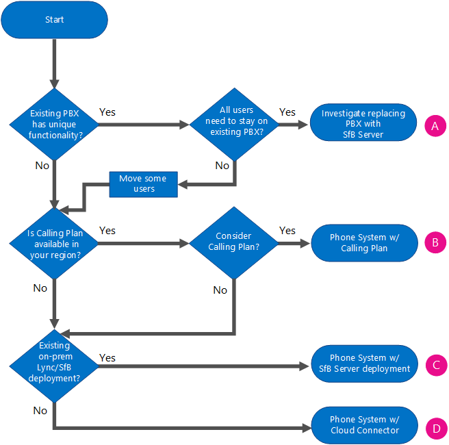

# Office 365 の電話システム (クラウド PBX) ソリューションを計画する
 
呼制御と Office 365 のクラウド内のプライベート構内交換機 (PBX) 機能を有効にする Office 365 (クラウド PBX) ソリューションでマイクロソフトの電話システム上の情報を検索します。
  
マイクロソフトは、さまざまな landlines と携帯電話を通じて、パブリック交換電話網 (PSTN) を呼び出すため、ユーザーを有効にするオプションを提供しています-オンライン ビジネスやビジネスのため、設置型の Skype で、Skype で Office 365 に自分のアカウントが存在するかどうかサーバーまたは Lync Server 2013 の展開です。
  
この資料では、さまざまなマイクロソフトの音声製品の概要について説明し、次のオプションがあります、組織の現在の状態と将来の計画によって、最適なガイダンスを提供します。 

Visio と PDF の両方の形式でダウンロードとして利用可能な音声ソリューションのオンライン ビジネスのポスターは、Skype とは、この資料を使用できます。
* [Visio](https://download.microsoft.com/download/2/E/E/2EE5C4DE-7F12-475C-A507-37870020F0D3/Plan%20Voice%20Solution%20poster%20-%20Final.vsdx)
* [PDF](https://download.microsoft.com/download/2/E/E/2EE5C4DE-7F12-475C-A507-37870020F0D3/Plan%20Voice%20Solution%20poster%20-%20Final.pdf)
  
## エンタープライズ VoIP

 **エンタープライズ VoIP**は、インターネット プロトコル (VoIP) ソリューションである Skype のビジネス サーバー用の設置型展開に含まれているマイクロソフトの世界最高クラスのソフトウェアを搭載音声です。 エンタープライズ VoIP には、豊富な機能と応答グループ、コール パーク、拡張 9-1-1、およびその他のなどの機能が用意されています。 エンタープライズ VoIP は、ローカル オペレーターを介した PSTN 接続を含むお客様の組織にとって全機能装備の構内交換機 (PBX) システムです。
  

  
マイクロソフトのエンタープライズ VoIP ソリューションの詳細についてを参照してください:[ビジネス サーバー 2015 の Skype でエンタープライズ VoIP の計画](../../plan-your-deployment/enterprise-voice-solution/enterprise-voice.md)、[ビジネス サーバー 2015 の Skype でエンタープライズ VoIP を展開](../../deploy/deploy-enterprise-voice/deploy-enterprise-voice.md)、[では、Lync Server のエンタープライズ VoIP の計画2013](https://technet.microsoft.com/library/gg413081%28v=ocs.15%29.aspx)、および[Lync Server 2013 でエンタープライズ VoIP を展開](https://technet.microsoft.com/EN-US/library/gg412876%28v=ocs.15%29.aspx)します。
  
## Office 365 の電話システム (クラウド PBX)

 **Office 365 の電話システム**は、オンライン ビジネスの通話の制御、Skype で Office 365 のクラウド内の PBX の機能を有効にするための Microsoft のテクノロジです。 電話システムを使用すると、Office 365 から配信され、企業のクラウドの生産性の経験と密接に統合の機能のセットを使用して、既存の PBX システムを置き換えることができます。
  
Office 365 では、電話のシステムと、ユーザーに対処するための基本的な呼び出しの管理タスクを配置して、呼び出しを受信するなどの呼び出し、およびミュートと unmuting の呼び出しを転送するオンライン ビジネスの Skype を使用できます。 電話システムのユーザーが自分のアドレス帳の名前をクリックして、ビジネスの Skype ユーザーへの呼び出しを配置します。 電話システムのユーザーは、Skype for Business で利用できるモバイル デバイス、ノート PC や PC のヘッドセット、さまざまな IP 電話を使って、通話の発信と受信を行うことができます。 管理者にとっては、電話システムは、メッセージング、コラボレーションに使用される同じテナント管理コンソール内での通話を管理するために機能を提供します。
  
従来の PBX システムとは、エンタープライズ VoIP を組織内のユーザー間の呼び出しが処理済みとして内部的に内電話システムでは、PSTN にことはありませんでした。 これは、これらの内部呼び出しでの長距離電話のコストを削除する別の地理的エリア内にある、組織内のユーザー間の呼び出しに適用されます。
  
固定電話と携帯電話で通話できるようにするには、次の 2 つの方法のいずれかを使って電話システムを PSTN に接続します。
  
- Office 365 の通話プラン— PSTN 通話プラン アドオンを購入します。
    
- 設置 PSTN を使用して、ソフトウェアの設置型の接続は、既存のテレフォニー インフラストラクチャと接続します。 
    
## Office 365 ソリューションの電話システム

Office 365 サービスにマイクロソフトの電話システムを利用するソリューションは、するかどうかなど、現在および将来のニーズによって異なります-必要なのか -、設置型展開では、によって提供される機能を保持する必要があるかどうかをのみとオンプレミス エンタープライズ VoIP ソリューション、クラウドに移行するユーザーを移動するための計画とは、現在利用可能な機能です。 
  
完全で、雲のソリューションを選択することができますか、Office 365 は、電話システムの利用が社内の一部の機能はそのままにハイブリッド展開を選択することができます。 PSTN の機能を Office 365 サービスとオンプレミス ソフトウェアを提供する、必要に応じて選択できます: 次の図に示すと次のセクションで説明されています。
  

  
- **計画を呼び出すと、Office 365 の電話システム**- このオプションは、Office 365 の landlines と (ライセンスされたサービスのレベル) によって世界中の携帯電話への呼び出しの PSTN への接続を有効にするのに計画を呼び出す電話システムにアドオンを使用します。 ユーザーはクラウドに所属しており、マイクロソフトが提供する通話プランのアドオンを備えた電話システムを使用できます。 通話プランの提供サービスは、オンプレミスのサーバー展開を必要としません。 Office 365 の電話システム プランを呼び出すだけで動作-別の PBX システムを使うことはできません。 詳細については、 [Office 365 のプランを呼び出す](plan-your-phone-system-cloud-pbx-solution.md#BKMK_PSTNCalling)を参照してください。
    
- **と Office 365 の電話システムの設置型 PSTN への接続**- このオプションは、Office 365 で、既存 PSTN キャリア、回路、およびコントラクトを接続するのに社内のソフトウェアを使用します。 ユーザーがクラウドに置かれているし、Office 365 に電話システムが有効になっていますが、設置型のソフトウェアを使用して、通話処理します。
    
    既存の PSTN 接続 (PBX、ゲートウェイ、セッション ボーダー コントローラー、または SIP トランキング接続を使用します) を使用して、クラウドに移行したユーザーを PSTN に接続します。ユーザーを Skype for Business Online と Office 365 の電話システムに移行すると、ユーザーの電話番号が、PC またはスマートフォン用の Skype for Business クライアントや Skype for Business 用の認定済み電話機にルーティングされます。移行後のクラウド PBX ユーザーと従来の PBX ユーザーは互いに通常どおりに通話でき、通常の電話番号を使用して PSTN 通話の発信と受信を行うことができます。
    
    オンプレミスの PSTN 接続を実装する場合は、次のオプションから選択できます。
    
  - **ビジネス クラウド コネクタ ・ エディションの Skype**のクラウドのコネクタが提供するハイブリッドが設置した PSTN 接続を実装するパッケージ化された仮想マシン (Vm) のセットで構成されています。 設置型では、クラウドに属するかどうか、ビジネスのサーバー トポロジの仮想化された環境で、組織内のユーザーに最小限の Skype を導入することによって、landlines と、既存のオンプレミスから携帯電話の呼び出しを送受信できるようになります音声インフラストラクチャです。 詳細については、 [Skype ビジネス クラウド コネクタ ・ エディションの計画](plan-skype-for-business-cloud-connector-edition.md)を参照してくださいと[の構成およびビジネス クラウド コネクタ ・ エディションの Skype を管理する](configure-skype-for-business-cloud-connector-edition.md)。
    
  - **ビジネス サーバーの既存の配置の Skype**のビジネス サーバーまたは Lync Server の展開用の既存の Skype は、PSTN の接続にも設置を実装できます。 これは、PSTN のハイブリッドが変更されました。 ビジネス サーバー設置型の展開に、Skype で構成されるハイブリッドを提供することです。 ユーザーの組織では、設置型では、クラウドに属するかどうかは、landlines と既存のオンプレミス ボイス インフラストラクチャを通じて、携帯電話の呼び出しを送受信できるようになります。 詳細について[と Office 365 の電話システムの計画、設置型で Skype ビジネス サーバーの PSTN への接続](plan-phone-system-with-on-premises-pstn-connectivity.md)し、 [Skype のビジネス サーバーの PSTN への接続をオンプレミスと Office 365 の電話システムのユーザーを有効にする](enable-users-for-phone-system.md)を参照してください。
    
### Office 365 のプランを呼び出す

 Landlines および携帯電話への呼び出しを行うにできるようにするユーザーを Office 365 での電話システムで動作するサービスは、 **Office 365 のプランを呼び出します**。 この PSTN 通話プランは、Office 365 が動作するために、このプロセスは、オンプレミスのサーバーの展開を必要としない完全に-雲ソリューションです。
  
このオプションのユーザーは、Office 365 のオンライン ビジネスの Skype に置かれているし、オンライン ビジネスのインターネット電話サービスの Skype へのアクセスがあります。 Microsoft は、通常の通話と PSTN サービスの両方を提供し、ユーザーの電話番号を提供または移行することもできます。 
  
Office 365 のプランを呼び出すこと、検索、取得、およびユーザーが行うし、組織の内外のユーザーとの通話を受信できるように、組織内のユーザーに電話番号を割り当てることができます。
  
あらゆるビジネスにおいて、電話番号は、ユーザーを識別するために使用され、組織間のコミュニケーションを可能にするものであり、ユーザーが音声通話を送受信できる電話番号を持つことはビジネスに欠かせません。 電話番号を割り当てられたユーザーは、VoIP 電話、PC、モバイル デバイスなどのすべての Skype for Business デバイスで音声通話を発信できます。 
  

  
詳細についてを参照してください[Office 365 のプランを呼び出すことは何ですか?](../../../SfbOnline/what-are-calling-plans-in-office-365/what-are-calling-plans-in-office-365.md)

Office 365 のプランを呼び出すことは、特定ですが成長中の地理的な場所で使用できます。 お住まいの地域で利用できるかどうかについては Microsoft の担当者に問い合わせてください。 
  
### オンプレミスの PSTN 接続と Cloud Connector エディション

 **クラウドのコネクタ**は、Office 365 の電話システムに設置した PSTN 接続を実装するパッケージ化された仮想マシン (Vm) のセットです。 このハイブリッド ソリューションは、組織では、クラウドでビジネスの通話制御用 Skype で、既存のオンプレミス PSTN 接続を使用するオンライン ビジネスのユーザーに、Skype を可能にする設計されています。
  
ビジネス サーバー トポロジの最低限の Skype を含むパッケージ化された仮想マシンのセットを配置するこのオプションを使用するなど、エッジ コンポーネント、コンポーネントの仲介、および中央管理ストア (CMS) の役割で構成されます。 ハイブリッド ビジネス オンライン サービスの Skype を含む、Office 365 テナントには、これらのサービスが構成されています。 
  

  
このオプションの詳細については、 [Skype ビジネス クラウド コネクタ ・ エディションの計画](plan-skype-for-business-cloud-connector-edition.md)を参照してくださいと[の構成およびビジネス クラウド コネクタ ・ エディションの Skype を管理する](configure-skype-for-business-cloud-connector-edition.md)。
  
### 既存の展開で PSTN への接続を設置

ビジネス サーバーの展開と PSTN への接続、既存の Skype を使用してハイブリッド ソリューションを実装することができます。 このトポロジでは、ユーザーをホームとして Skype のクラウド ビジネス オンラインの設置型の展開が置かれているされているのではなく。 このオプションは、ユーザーが現在クラウドに所属しているかユーザーのクラウドへの移行を開始する必要がある場合に選ぶことができます。 
  
このオプションでは、オンライン ビジネスのユーザーに、Skype は、オンプレミス Skype をビジネス サーバー展開では、クラウドでビジネスの通話制御用の Skype でのエンタープライズ VoIP 経由の PSTN への接続を取得します。 
  

  
[Office 365 の電話システムの計画、設置型で Skype ビジネス サーバーの PSTN への接続](plan-phone-system-with-on-premises-pstn-connectivity.md)と[、このオプションの詳細についてを参照するくださいと Office 365 の電話システムのユーザーを有効にする設置 PSTN への接続で Skype ビジネス サーバーの](enable-users-for-phone-system.md).
  
## 最適なソリューションの選択

組織に最適なソリューションを決定するには、次の質問に対する回答を確認し、ソリューションの選択に役立つフローチャートを参照してください。
  
- ビジネス サーバー配置の既存のオンプレミス Skype を持っています。 
    
- ユーザーが置かれている Skype のビジネス、オンプレミス、クラウドのビジネス オンラインでは、Skype またはその両方のでしょうか。 オンプレミスのユーザーをクラウドに移行する必要がありますか?
    
- マイクロソフトの計画を呼び出す Office 365 で利用可能なお住まいの地域でしょうか。 
    
- 現在の電話会社を継続しますか? 既存の契約のために現在の電話会社を継続する必要がありますか?
    
- 維持することを希望するか、維持する必要がある既存のオンプレミスのレガシー PBX がありますか? 
    
- 現在のレガシー PBX は、ビジネスに不可欠な固有の機能を提供していますか?
    
- いずれか、またはすべてのユーザーが必要な Office 365 の電話システムでは現在提供されている機能ですか。
    
ソリューションは、お客様の組織については、お客様の意思決定を行う前に、Office 365 で電話システムの設置型エンタープライズ VoIP、または組み合わせのソリューション-現在および将来的にする必要があるどのような機能を決定する必要があります。 いくつかの機能-応答のグループ、グループの呼び出しのピックアップでは、コール パークなど、オンプレミスのユーザーに対してのみ提供されます。 Office 365 の機能を利用する電話システムの完全なリストは、[ここでは Office 365 の電話システムでの取得](https://go.microsoft.com/fwlink/p/?LinkId=715517)を参照してください。
  
**ソリューションの選択**

  
|**お客様の状況**   |**ソリューションで Office 365 の電話システム**   |
|:-----|:-----|
|PBX システムは保持する必要がある固有の機能を提供しています。    |**既存の PBX の Skype for Business Server への置き換えについて調査します。** オペレーター経由の PSTN への接続を含む、組織のビジネス サーバーのエンタープライズ VoIP の PBX システムを全体として Skype を使用できます。 PBX の必要性は機能の変更を将来的に、Office 365 の電話システムを再検討することができます。   マイクロソフトのエンタープライズ VoIP ソリューションの詳細については、[ビジネス サーバー 2015 の Skype でエンタープライズ VoIP ソリューションの計画](../../plan-your-deployment/enterprise-voice-solution/enterprise-voice-solution.md)を参照してください。    表示しない場合は、オンライン ビジネスの Skype にそれらのユーザーの移動を検討することができます、現在の PBX で独自の機能が提供されるすべてのユーザーが必要とします。    |
|ユーザーの PBX を保持する必要がある独自の機能を提供していません、お住まいの地域で利用可能な Office 365 の計画を呼び出すことが、必要な Microsoft 提供の PSTN サービスを使用します。    |**Office 365 のプランを呼び出すことを購読します。** すべてのユーザーが、Skype for Business Online 上のクラウドに所属することができ、組織は PBX と PSTN サービスの両方を Microsoft クラウドから利用できます。 されて場合は、ユーザーの現在の配送業者からの電話番号、電話番号は、Office 365 の電話システムに移植できます。 必要に応じて Microsoft から追加の電話番号を取得できます。   詳細についてを参照してください[Office 365 のプランを呼び出すことは何ですか?](../../../SfbOnline/what-are-calling-plans-in-office-365/what-are-calling-plans-in-office-365.md)   |
|PBX を保持する必要がある独自の機能を提供していませんし、Office 365 のプランを呼び出すことはお住まいの地域ビジネス サーバー配置の既存の Lync または Skype があります。    このシナリオでは、すべてのユーザーが米国内に所在していても、既存の通信事業者との契約上の義務など、その他の理由で Microsoft が提供する PSTN への移行を検討できない可能性もあります。    |**Office 365 の電話システムと、既存の Skype ビジネス サーバーの展開に接続します。** ビジネス サーバー展開では、PSTN への接続が提供、設置型の Skype でエンタープライズ VoIP を使用しますが、組織はマイクロソフトのクラウドから PBX サービスを受信することができます。 ビジネス オンラインの Skype に移動を開始すると、ユーザーのボイス機能を保持できます。 ユーザーがどちらに所属しているかに関係なく音声機能が引き続き使用できることを確認しながら自分のペースでユーザーを移行できます。   今後、現在のキャリアのままにする場合は、マイクロソフトの完全な電話システムと PBX と PSTN のすべての機能を提供する microsoft の計画を呼び出すと、Office 365 で、ユーザーがクラウドを移植できます。    [Office 365 の電話システムの計画、設置型で Skype ビジネス サーバーの PSTN への接続](plan-phone-system-with-on-premises-pstn-connectivity.md)と[、このオプションの詳細についてを参照するくださいと Office 365 の電話システムのユーザーを有効にする設置 PSTN への接続で Skype ビジネス サーバーの](enable-users-for-phone-system.md).    |
|ユーザーの PBX を保持する必要がある独自の機能を提供していません、Office 365 のプランを呼び出すことはお住まいの地域とする必要はありませんが、既存の Lync または Skype ビジネス サーバー配置の。    このシナリオでもお住まいの地域で利用可能なは、Office 365 のプランを呼び出すことも、Microsoft 提供の PSTN への移動は、他の理由を検討することはできません: など、既存の配送業者との契約上の義務です。    |**Cloud Connector を展開します。** 現在の PSTN 通信事業者をそのまま使用しますが、組織は Microsoft クラウドからの PBX サービスを利用できます。 クラウドのコネクタを使用すると、Skype をビジネスの呼び出しの制御機能をユーザーに提供できます。 このソリューションでは、各ユーザーがローカルの PSTN サイトに接続されるので、ユーザーの地理的な場所に関係なく使用できます。   今後、現在のキャリアのままにする場合は、マイクロソフトの完全な電話システムと PBX と PSTN のすべての機能を提供する microsoft の計画を呼び出すと、Office 365 で、ユーザーがクラウドを移植できます。    このオプションの詳細については、 [Skype ビジネス クラウド コネクタ ・ エディションの計画](plan-skype-for-business-cloud-connector-edition.md)を参照してくださいと[の構成およびビジネス クラウド コネクタ ・ エディションの Skype を管理する](configure-skype-for-business-cloud-connector-edition.md)。    |
   
### 組み合わせのソリューションの選択

もちろん、組織全体で 1 つのソリューションだけを選ぶ必要はありません。 以下は、場所のソリューションを組み合わせることがあります、組織にとって最適な戦略だけでいくつかの例です。
  
- **自組織はビジネス サーバー配置の既存の Skype、自分の地域で利用可能な Office 365 の計画を呼び出すことが、だけ基本的な通話制御機能、および自分の設置型の PBX または PSTN トランクを維持する必要はありません。** 設置した PSTN 接続を Office 365 に電話システムを使用するにはオンラインに移動を開始すると、ユーザーの音声機能を維持します。 最終的には、オンラインのすべてのユーザーを移動、オンプレミスのサーバーを廃止して計画を呼び出すと、Office 365 の電話システムを使用できます。
    
- **自分の組織では、多くの地理的な場所があります。大規模なサイトでは、小規模なサイトでユーザーがありません、Skype をビジネスの音声機能のすべての中でエンタープライズ VoIP では、ビジネス サーバー展開では、設置 Skype があります。** これらの小規模なサイトが Office 365 のプランを呼び出すことを提供する地域内にある場合は、ビジネス オンラインの Skype にこれらのユーザーを移動および計画を呼び出すと、Office 365 の電話システムでの音声機能を有効にする可能性があります。 設置型では、大規模なサイトでユーザーが維持できるようにするか、移動することが Skype をオンライン ビジネスの独自のペースを利用して、電話システムの Office 365 の設置と PSTN への接続。
    
- **自組織は、既存の Skype ビジネス サーバーの展開に、自分の地域で利用可能な Office 365 の計画を呼び出すことですが、応答のグループおよびグループを呼び出すピックアップなどの高度な通話機能が必要ないくつかのユーザーの。** ユーザーに高度な通話機能を使用する必要はありません置くことができますクラウドに移行するようになりましたが、Office 365 の電話システムを使用して設置した PSTN 接続を持つ。 以降では、ビジネス オンラインの Skype に必要な機能を追加するときにもクラウドに移行するユーザーの残りの部分を移動できます。
    
- **自組織はビジネス サーバー配置の既存の Skype、クラウドに移行するすべてのユーザーを移動する、Office 365 のプランを呼び出すことはありません利用可能なすべての地域で。** ユーザーを移動できますすべて、クラウドに移行する、ローカル サイトのトランクと、PBX の機能を維持しながら設置した PSTN 接続を Office 365 に電話システムを使用しています。 各ユーザーが Office 365 のプランを呼び出すことができる領域内に存在する-の通話機能を強化する必要はありませんし、必要に応じてコントロールを移動できる、呼び出しも、クラウドに移行する計画を呼び出すと、Office 365 の電話システムを使用して。 このようにする場合、オプションでユーザーの既存の電話番号を移行できます。
    
- **自分の組織では、ビジネスのサーバーがエンタープライズ VoIP を導入しなくても、既存の Skype があります。** フローチャートを参照して組織に最適なソリューションを決定してください。
    

