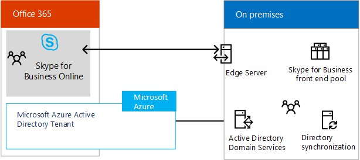

# ハイブリッド ソリューションのビジネス用の SkypeSkype for Business hybrid solutions
 
Skype のビジネスのハイブリッド展開の計画に関する情報を検索します。Find information on planning a Skype for Business hybrid deployment. 
  
このトピックでは、ビジネスに最適な構成の特定に役立つさまざまなハイブリッド構成について説明します。This topic introduces you to several hybrid configurations to help you determine which configuration is best for your business. 次に、このトピックのリンク従って、関心のある構成についての詳細を読むことができます。You can then read more about the configuration you're interested in by following the links in this topic. このトピックは、以下のセクションで構成されています。This topic contains the following sections:
  
- [Skype for Business ハイブリッド構成Skype for Business hybrid configurations](skype-for-business-hybrid-solutions.md#BKMK_HybridConfigurations)
    
- [Skype ビジネス オンラインに、既存のオンプレミス Skype のビジネス環境を追加します。Add Skype for Business Online into your existing on-premises Skype for Business environment](skype-for-business-hybrid-solutions.md#BKMK_HybridConnectivity)
    
- [Office 365 の電話システム (クラウド PBX) を活用するTake advantage of Phone System in Office 365 (Cloud PBX)](skype-for-business-hybrid-solutions.md#BKMK_CloudPBX)
    
- [Exchange や SharePoint と統合するIntegrate with Exchange and SharePoint](skype-for-business-hybrid-solutions.md#BKMK_IntegratewExchangeSharePoint)
    
- [ハイブリッド環境の計画や構成のタスクTasks for planning and configuring a hybrid environment](skype-for-business-hybrid-solutions.md#BKMK_Tasks)
    
- [関連情報For more information](skype-for-business-hybrid-solutions.md#BKMK_MoreInfo)
    
## Skype for Business ハイブリッド構成Skype for Business hybrid configurations

ビジネス用の Skype は、いくつかのハイブリッド構成をサポートします。Skype for Business supports several hybrid configurations. 用に、既存のビジネスのオンライン設置型のビジネス環境に Skype は、Skype を追加、Exchange Online と SharePoint Online では、ビジネスの展開に、Skype を統合および Office 365 (クラウド PBX) の電話システムを利用できる、マイクロソフトのオンライン ビジネスの通話の制御、Skype で Office 365 のクラウド内のプライベート構内交換機 (PBX) 機能を有効にするための技術です。You can add Skype for Business Online into your existing on-premises Skype for Business environment, integrate your Skype for Business deployment with Exchange Online and SharePoint Online, and take advantage of Phone System in Office 365 (Cloud PBX)—Microsoft's technology for enabling call control and Private Branch Exchange (PBX) capabilities in the Office 365 cloud with Skype for Business Online. 
  
ハイブリッド展開のビジネス用の Skype では、ビジネス ソリューションを設置型の Skype でのオンライン ビジネス サービスの Skype を結合します。With a Skype for Business hybrid deployment, you combine a Skype for Business Online subscription with your on-premises Skype for Business offering. 組織内のサービスとしてのソフトウェアの管理スキルの構築を開始し、ビジネス ユーザー向けに、Skype を自分のペースでクラウドに移行できます。You can start building software-as-a-service management skills in your organization, and move your Skype for Business users to the cloud at your own pace. クラウドをホームとするユーザーを利用して電話システムの Office 365 の設置公衆交換電話網 (PSTN) の接続性を維持しながら。Your users who are homed in the cloud can take advantage of Phone System in Office 365 while retaining your on-premises Public Switched Telephone Network (PSTN) connectivity.
  
ビジネスのハイブリッド構成の Skype で、以下を留意してください。With a Skype for Business hybrid configuration, keep the following in mind:
  
- ユーザーは、オンプレミスにホストされる場合とオンラインにホストされる場合がありますが、同じセッション開始プロトコル (SIP) ドメイン (contoso.com など) を共有します。Some users might be homed on premises and some online, but the users share the same Session Initiation Protocol (SIP) domain, such as contoso.com.
    
- できますユーザーを移行する設置型のビジネス用の Skype から Skype をオンライン ビジネスの時間の経過と共に、スケジュールに。You can migrate users from Skype for Business on premises to Skype for Business Online over time, on your schedule.
    
- Exchange Online や SharePoint Online などの、別の Microsoft Office 365 アプリケーションと統合することができます。You can integrate with other Microsoft Office 365 applications, including Exchange Online and SharePoint Online.
    
- Exchange や SharePoint と統合することができます。You can integrate with Exchange and SharePoint.
    
- Skype 会議ブロードキャストを活用することができます。You can take advantage of Skype Meeting Broadcast.
    
- PSTN 会議を活用することができます。You can take advantage of PSTN conferencing.
    
## Skype ビジネス オンラインに、既存のオンプレミス Skype のビジネス環境を追加します。Add Skype for Business Online into your existing on-premises Skype for Business environment

Skype ビジネス サーバーとビジネス オンラインの Skype との間のハイブリッドの接続では、contoso.com などのドメインのユーザーが社内のビジネス サーバーと Skype の Skype を使用してオンライン ビジネスの間で分割を意味します。Hybrid connectivity between Skype for Business Server and Skype for Business Online means users of a domain, such as contoso.com, are split between using Skype for Business Server on premises and Skype for Business Online. 一部のドメイン ユーザーはオンプレミスに所属し、その他のユーザーはオンラインに所属します。Some of the domain users are homed on premises, and some users are homed online. Skype でオンライン ビジネスのハイブリッド、設置型の展開を構成し、作業中のディレクトリ同期を使用して、設置型およびオンライン ユーザーの同期を維持できます。You can configure your on-premises deployment for hybrid with Skype for Business Online and use Active Directory Synchronization to keep your on-premises and online users synchronized. 
  
次の図は、既存設置 Skype のビジネス環境において、ユーザーを自分のペースでクラウドに移行することに、オンライン ビジネスの Skype を追加する方法を示しています。The following diagram shows how you can add Skype for Business Online into your existing on-premises Skype for Business environment, allowing you to move users to the cloud at your own pace:
  

  
詳細については、[サーバーのビジネスとオンライン ビジネスの Skype の Skype 間のハイブリッド接続を計画](plan-hybrid-connectivity.md)し、[サーバーのビジネスとオンライン ビジネスの Skype の Skype 間のハイブリッド接続の展開](deploy-hybrid-connectivity/deploy-hybrid-connectivity.md)を参照してください。For more information, see [Plan hybrid connectivity between Skype for Business Server and Skype for Business Online](plan-hybrid-connectivity.md) and [Deploy hybrid connectivity between Skype for Business Server and Skype for Business Online](deploy-hybrid-connectivity/deploy-hybrid-connectivity.md).
  
## Office 365 の電話システム (クラウド PBX) を活用するTake advantage of Phone System in Office 365 (Cloud PBX)

 Office 365 (クラウド PBX) の電話システムは、オンライン ビジネスの通話の制御、Skype で Office 365 のクラウド内のプライベート構内交換機 (PBX) 機能を有効にするための Microsoft のテクノロジです。Phone System in Office 365 (Cloud PBX) is Microsoft's technology for enabling call control and Private Branch Exchange (PBX) capabilities in the Office 365 cloud with Skype for Business Online. Office 365 の電話システムを使用すると、Office 365 から配信され、マイクロソフトのクラウドの生産性の経験と密接に統合の機能のセットを使用して、既存の PBX システムを置き換えることができます。Phone System in Office 365 allows you to replace your existing PBX system with a set of features delivered from Office 365 and tightly integrated into Microsoft's cloud productivity experience.
  
Office 365 のハイブリッド ・ ソリューションの 2 つの電話システムの他は、マイクロソフトは、計画を呼び出すと、Office 365 の電話システムを提供しています: サービスの呼び出しの PSTN: クラウドをすべてソリューションの場合、オンプレミスのサーバーの展開を必要としません。In addition to two Phone System in Office 365 hybrid offerings, Microsoft offers Phone System in Office 365 with Calling Plan—a PSTN calling service—for an all-in-the-cloud solution that does not require an on-premises server deployment. かどうかは、計画を呼び出すと、Office 365 の電話システムは、組織に最適なソリューションと可能性がありますを決定するには、[ソリューションを Office 365 に電話システム](plan-your-phone-system-cloud-pbx-solution/plan-your-phone-system-cloud-pbx-solution.md#BKMK_PBXOfferings)を参照してください。To decide if Phone System in Office 365 with Calling Plan might be the right solution for your organization, see [ Phone System in Office 365 solutions](plan-your-phone-system-cloud-pbx-solution/plan-your-phone-system-cloud-pbx-solution.md#BKMK_PBXOfferings).
  
Office 365 のハイブリッド サービス提供では次の 2 つの電話システムがあります。There are two Phone System in Office 365 hybrid offerings: 
  
- [Skype for Business Server 展開で提供されるオンプレミス接続を備えた Office 365 の電話システムPhone System in Office 365 with on-premises connectivity provided by your Skype for Business Server deployment](skype-for-business-hybrid-solutions.md#BKMK_Server)
    
- [Skype for Business Server Cloud Connector エディションで提供されるオンプレミス接続を備えた Office 365 の電話システムPhone System in Office 365 with on-premises connectivity provided by Skype for Business Server Cloud Connector Edition](skype-for-business-hybrid-solutions.md#BKMK_CCE)
    
### Skype for Business Server 展開で提供されるオンプレミス接続を備えた Office 365 の電話システムPhone System in Office 365 with on-premises connectivity provided by your Skype for Business Server deployment

この構成は、PSTN のハイブリッドが変更されました。 ビジネス サーバー設置型の展開に、Skype で構成されます。This configuration consists of a Skype for Business Server on-premises deployment modified for hybrid PSTN. クラウドに置かれている組織内のユーザーはマイクロソフトのクラウドから PBX サービスを受信することができますが、PSTN への接続は、設置型の Skype でエンタープライズ VoIP ビジネス サーバーの展開の提供します。Users in your organization who are homed in the cloud can receive PBX services from the Microsoft cloud, but PSTN connectivity is provided through Enterprise Voice on your on-premises Skype for Business Server deployment. 
  

  
この構成は、次のような場合に最適です。This configuration is best if: 
  
- PBX では、保持する必要のある一意の機能が提供されない。Your PBX does not offer unique features that you need to retain.
    
- 国内通話プラン、Office 365 PSTN 通話サービスは所在地域で利用できない。Calling Plan, the Office 365 PSTN calling service, is not available in your region.
    
- ビジネス サーバー配置の既存の Lync または Skype があります。You have an existing Lync or Skype for Business Server deployment.
    
詳細について[と Office 365 の電話システムの計画、設置型で Skype ビジネス サーバーの PSTN への接続](plan-your-phone-system-cloud-pbx-solution/plan-phone-system-with-on-premises-pstn-connectivity.md)し、 [Skype のビジネス サーバーの PSTN への接続をオンプレミスと Office 365 の電話システムのユーザーを有効にする](plan-your-phone-system-cloud-pbx-solution/enable-users-for-phone-system.md)を参照してください。For more information, see [Plan Phone System in Office 365 with on-premises PSTN connectivity in Skype for Business Server](plan-your-phone-system-cloud-pbx-solution/plan-phone-system-with-on-premises-pstn-connectivity.md) and [Enable users for Phone System in Office 365 with on-premises PSTN connectivity in Skype for Business Server](plan-your-phone-system-cloud-pbx-solution/enable-users-for-phone-system.md).
  
### Skype for Business Server Cloud Connector エディションで提供されるオンプレミス接続を備えた Office 365 の電話システムPhone System in Office 365 with on-premises connectivity provided by Skype for Business Server Cloud Connector Edition

この構成は、パッケージ化された一連の、オンプレミス PSTN 接続を実装する仮想マシンで構成されます。This configuration consists of a set of packaged Virtual Machines (VMs) that implement on-premises PSTN connectivity. ビジネス サーバー トポロジの場合、仮想化された環境で最小限の Skype を配布すると、クラウドに置かれている組織内のユーザーはマイクロソフトのクラウドから PBX サービスを受信することができますが、PSTN への接続は、既存のオンプレミス音声を通じて提供されます。インフラストラクチャです。By deploying a minimal Skype for Business Server topology in a virtualized environment, users in your organization who are homed in the cloud can receive PBX services from the Microsoft cloud, but PSTN connectivity is provided through the existing on-premises voice infrastructure. 
  

  
この構成は、次のような場合に最適です。This configuration is best if:
  
- PBX では、保持する必要のある一意の機能が提供されない。Your PBX does not offer unique features that you need to retain.
    
- 国内通話プラン、Office 365 PSTN 通話サービスは所在地域で利用できない。Calling Plan, the Office 365 PSTN calling service, is not available in your region.
    
- ビジネス サーバーの展開、既存の Lync または Skype を必要はありません。You do not have an existing Lync or Skype for Business Server deployment.
    
詳細については、 [Skype ビジネス クラウド コネクタ ・ エディションの計画](plan-your-phone-system-cloud-pbx-solution/plan-skype-for-business-cloud-connector-edition.md)を参照してください。For more information, see [Plan for Skype for Business Cloud Connector Edition](plan-your-phone-system-cloud-pbx-solution/plan-skype-for-business-cloud-connector-edition.md).
  
## Exchange や SharePoint と統合するIntegrate with Exchange and SharePoint

ビジネスのハイブリッド構成で、Skype を使用すると、Exchange Online と SharePoint Online を含む他の Microsoft Office 365 アプリケーションと統合できます。A Skype for Business hybrid configuration allows you to integrate with other Microsoft Office 365 applications, including Exchange Online and SharePoint Online.
  
### Skype for Business Server と Exchange Online および SharePoint OnlineSkype for Business Server with Exchange Online and SharePoint Online

ビジネス サーバーは、Exchange Online と SharePoint のオンラインでの Skype を統合するには、次の図に示すようにします。You can integrate Skype for Business Server with Exchange Online and SharePoint Online as shown in the following diagram:
  

  
ビジネス サーバーは、Exchange Online と SharePoint のオンラインでの Skype を統合すると、いくつかの利点があります。Integrating Skype for Business Server with Exchange Online and SharePoint Online has several advantages. 以下を行えるようになります。You can:
  
- ビジネス サーバー用には、Skype の完全な機能セットを使用します。Use the full feature set of Skype for Business Server.
    
- PBX などの、既存のオンプレミスの電話機を利用する。Leverage your existing on-premises phone equipment, such as PBXs.
    
- 電子メールに Exchange Online を使用して、オンプレミスの電子メール サーバーとストレージの負荷を軽減する。Use Exchange Online for email, off-loading the burden of on-premises email servers and storage.
    
- グループ作業に SharePoint Online を使用して、オンプレミスの SharePoint サーバーを維持する負荷を軽減する。Use SharePoint Online for collaboration, off-loading the burden of maintaining on-premises SharePoint servers.
    
- ビジネス、Exchange、および SharePoint を使用して Skype では、機能を含むユニファイド メッセージング (UM) Office 365 に統合されています。Use Skype for Business, Exchange, and SharePoint integrated features, including Unified Messaging (UM) in Office 365.
    
詳細については、[ビジネスとの交換用 Skype を統合する計画](../plan-your-deployment/integrate-with-exchange/integrate-with-exchange.md)を参照してください。For more information, see [Plan to integrate Skype for Business and Exchange](../plan-your-deployment/integrate-with-exchange/integrate-with-exchange.md).
  
### Exchange Server と Skype for Business OnlineExchange Server with Skype for Business Online

次の図に示すように、オンライン ビジネスの Skype で Exchange Server を統合できます。You can integrate Exchange Server with Skype for Business Online as shown in the following diagram:
  

  
Skype でオンライン ビジネスの Exchange Server を統合すると、次の利点があります。Integrating Exchange Server with Skype for Business Online has the following advantages:
  
- 既存の Exchange インフラストラクチャを利用する。Leverage your existing Exchange infrastructure.
    
- オンライン ビジネスのプレゼンス、IM、および会議の機能のための Skype を使用します。Use Skype for Business Online for presence, IM, and conferencing capabilities. 
    
詳細については、[ビジネスとの交換用 Skype を統合する計画](../plan-your-deployment/integrate-with-exchange/integrate-with-exchange.md)を参照してください。For more information, see [Plan to integrate Skype for Business and Exchange](../plan-your-deployment/integrate-with-exchange/integrate-with-exchange.md).
  
## ハイブリッド環境の計画や構成のタスクTasks for planning and configuring a hybrid environment

ビジネス用の Skype では、展開を設計する方法に関係なく機能の豊富なセットを提供します。Skype for Business provides a rich set of capabilities no matter how you architect your deployment. 選択するアーキテクチャにより、担当する IT 分野と、サブスクリプションを介してサポートのためにマイクロソフトに支払う内容が決まります。The architecture you choose will determine which IT responsibilities you own, and which you pay Microsoft to support through your subscription. 組織に最適なアーキテクチャがどれであっても、常に独自に担当することになる、コアの分野が 5 つあります。No matter which architecture is best for your organization, there are five core responsibilities that you will always own:
  
- **ネットワー キングと接続性**のネットワーク評価を実行することによって、または評価を行うパートナーと契約することでネットワークの容量およびファイアウォール、プロキシ サーバー、ゲートウェイ、および WAN リンクの可用性を確保します。**Networking and connectivity** - Ensure network capacity and availability through firewalls, proxy servers, gateways, and across WAN links by performing a network assessment or by contracting with a partner to do the assessment.
    
- **データ ・ ガバナンス&amp;著作権管理**- は、機密データを分類し、保護および監視の転送中には、格納されている任意の場所にいることを確認します。**Data governance &amp; rights management** - Classify your sensitive data and ensure it is protected and monitored wherever it is stored and while it is in transit.
    
- **クライアント エンドポイント**の設定、測定、データと資産にアクセスするために使用されているデバイスの最新のセキュリティ標準を適用します。**Client Endpoints** - Establish, measure, and enforce modern security standards on devices that are used to access your data and assets.
    
- **アカウント&amp;アクセス管理**- 通常アカウント アクティビティの場合、プロファイルを作成し、異常なアクティビティに通知します。**Account &amp; access management** - Establish a profile for "normal" account activity and alert on unusual activity.
    
- **ID** - すべての ID に対して、ハードウェアで保護された資格情報か、複数要素の認証 (MFA) を使用します。**Identity** - Use credentials secured by hardware or Multi-Factor Authentication (MFA) for all identities.
    
オンプレミス環境で実行するアーキテクチャのタスクに加えて、以下も行う必要があります。In addition to the architectural tasks you perform for your on-premises environment, you will need to:
  
- オンプレミス ID と Office 365 の統合を含む、ID 管理要件を計画して設計する。Plan and design identity management requirements, including integrating on-premises identities with Office 365.
    
- ネットワークのキャパシティと可用性を確保する。Ensure network capacity and availability.
    
- サード パーティの SSL 証明書を取得して、Office 365 のサービス内容のエンタープライズ セキュリティを提供する。Acquire third-party SSL certificates to provide enterprise-security for Office 365 service offerings.
    
- Office 365 への接続に Internet Protocol バージョン 6 (IPv6) を使用するかどうかを決定する。Decide if you want to connect to Office 365 with Internet Protocol version 6 (IPv6).
    
- 設置型とのビジネスでは、Exchange では、Skype のオンライン バージョンをどの程度の機能統合を決定し、SharePoint を希望します。Determine how much feature integration with on-premises and online versions of Skype for Business, Exchange, and SharePoint is desired. 
    
- Office 365 からの要求に、どのプロキシ サーバー デバイスを使用するかを決定する。Determine which proxy server device will be used for requests from Office 365.
    
フォローを実行する必要があります、Skype をビジネスのハイブリッド環境を実装する IT プロフェッショナルの作業。You will also need to perform the follow IT Pro tasks to implement your Skype for Business hybrid environment:
  
- 有効にし、ビジネス オンラインの Skype での Microsoft Office 365 のテナントがある場合を確認します。Ensure you have a Microsoft Office 365 tenant with Skype for Business Online enabled.
    
- ID 管理計画を実装する。Implement the identity management plan. 
    
- 内部および外部の DNS レコードとルーティングを計画して実装する。Plan and implement internal and external DNS records and routing.
    
- Office 365 IP アドレスと URL の要件向けにプロキシとファイアウォールを構成する。Configure your proxy or firewall for Office 365 IP address and URL requirements.
    
- オンライン ビジネスの設定のユーザー アカウントと Skype を管理します。Administer user accounts and Skype for Business Online settings. 
    
- 必要に応じてプロキシ サーバー デバイスを構成する。Configure the proxy server device, if required. 
    
- Exchange Server と SharePoint のオンプレミス バージョンとオンライン　バージョンで機能の統合を構成する。Configure the integration of features with on-premises and online versions of Exchange Server and SharePoint.
    
## 関連情報For more information

詳しくは、次のリソースをご覧ください。For more information, see the following resources:
  
- [マイクロソフト クラウドの IT アーキテクチャのリソースMicrosoft cloud IT architecture resources](https://aka.ms/clouditarch)
    
- [エンタープライズ設計者向けのマイクロソフトのクラウド idMicrosoft cloud identity for enterprise architects](https://docs.microsoft.com/en-us/office365/enterprise/microsoft-cloud-it-architecture-resources#identity)
    
- [組織が Office 365 のエンタープライズの準備ができて取得します。Get your organization ready for Office 365 Enterprise](https://aka.ms/O365EntPrep)
    
- [Skype for Business Server と Skype for Business Online 間のハイブリッド接続を計画するPlan hybrid connectivity between Skype for Business Server and Skype for Business Online](plan-hybrid-connectivity.md)
    
- [Skype for Business Server と Skype for Business Online 間でハイブリッド接続を展開するDeploy hybrid connectivity between Skype for Business Server and Skype for Business Online](deploy-hybrid-connectivity/deploy-hybrid-connectivity.md)
    
- [Office 365 ソリューションの電話システム Phone System in Office 365 solutions](plan-your-phone-system-cloud-pbx-solution/plan-your-phone-system-cloud-pbx-solution.md#BKMK_PBXOfferings)
    
- [Skype for Business と Exchange の統合の計画Plan to integrate Skype for Business and Exchange](../plan-your-deployment/integrate-with-exchange/integrate-with-exchange.md)
    
このトピックのポスター バージョンをダウンロードする場合は、以下にアクセスしてください。If you would like to download a poster version of this topic, go to:
  
- [Skype ビジネス アーキテクチャ モデル (pdf)Skype for Business Architectural Models (pdf)](https://download.microsoft.com/download/7/7/4/7741262C-A60D-41F7-863B-99BF5964FBFE/Skype%20for%20Business%20Architectural%20Models.pdf)
    
- [Skype ビジネス アーキテクチャ モデル (Visio)Skype for Business Architectural Models (Visio)](https://download.microsoft.com/download/7/7/4/7741262C-A60D-41F7-863B-99BF5964FBFE/Skype%20for%20Business%20Architectural%20Models.vsd)
    

