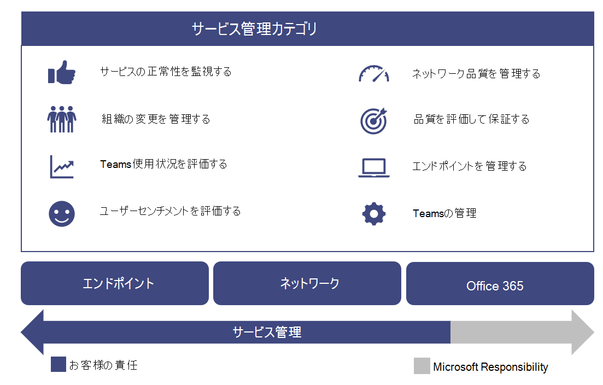
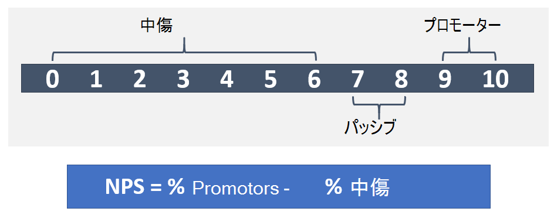

# サービスを運用するOperate my service

この記事では、組織でクラウド音声サービスを正常に運用するための要件の概要を示します。This article gives an overview of the requirements for successfully operating cloud voice services for your organization. クラウド音声サービスを適切に操作することで、組織にとって高品質で信頼できるエクスペリエンスを提供することができます。By properly operating your cloud voice services, you can be sure you’re providing a high-quality, reliable experience for your organization.

## 運用ガイドの概要Introduction to the Operations Guide

この運用ガイドでは、Microsoft Teams のサービス管理機能の一部として必要なすべてのタスクとアクティビティの概要を説明します。The Operations Guide gives you an overview of all the tasks and activities required as part of the service management function for Microsoft Teams.

サービス管理の内容は、展開されてユーザーに対して利用できる状態にされている、Microsoft Teams サービスの日常的な運用を網羅するものです。Service management is a broad topic that covers day-to-day operations of the Microsoft Teams service after it has been deployed and enabled for users. Teams サービスは、Microsoft Office 365 およびオンプレミスで展開されている (ネットワーキングなどの) インフラストラクチャ コンポーネントを組み込んでいます。The Teams service encompasses Microsoft Office 365 and the infrastructure components that are deployed on-premises (for example, networking).

サービス管理の概念は、ほとんどの組織において、新しい概念ではない可能性が高いです。The notion of service management is most likely not a new concept for most organizations. 既存のサービスに関連付けられているプロセスとタスクが既に実装されている可能性があります。You might have already implemented processes and tasks that are associated with existing services. このように、将来、チームをサポートするために現在のプロセスを補強することができます。That said, you can probably augment your current processes when you plan for service management today to support Teams in the future.

サービス管理では、チームの終了を管理するために関連するすべてのアクティビティとプロセスが含まれます。Service management encompasses all the activities and processes involved in managing Teams end to end. 前に説明したように、サービス管理の一部のコンポーネント (Office 365 サービス自体が構成されているインフラストラクチャ) は Microsoft の責任であり、ユーザーは、ユーザーが Teams のさまざまな側面を管理する責任を負うものとします。、エンドポイントによって提供されます。As noted earlier, some components of service management—the infrastructure that the Office 365 service itself comprises—are Microsoft’s responsibility, whereas you, the customer, are accountable to your users to manage the various aspects of Teams, the network, and endpoints you provide.

このガイドのタスクとアクティビティは、次の図に示すように8つのカテゴリにグループ化されています。The tasks and activities in this guide are grouped into eight categories as depicted in the following diagram. これらの各カテゴリは、次のセクションで展開されます。Each of these categories will be expanded upon in the following sections.

<table>
<tr><td>  判断のポイントDecision points</td><td><ul><li>チームに対して操作を実装する方法を決定します。Decide how operations will be implemented for Teams.</li></ul></td></tr>
<tr><td> 次のステップNext steps</td><td><ul><li>運用ガイドを完全に確認します。Review the Operations Guide in full.</li><li>組織の目標に合わせて、クラウドボイスワークロードの品質と信頼性を高める運用戦略を実装します。Implement an operations strategy that aligns with your organization’s goals to deliver the quality and reliability of cloud voice workloads.</li><li>エクスペリエンス品質レビューガイドを確認します。Review the Quality of Experience Review Guide.</li><li> 運用計画を実施して、クラウドの音声展開が最大の機能で動作していることを確認します。Implement an operations strategy to regularly perform Quality of Experience Reviews to make sure your cloud voice deployment is operating at its peak capabilities.</li></ul></td></tr>
</table>

### 運用の役割マッピングOperational role mapping

ビジョン化フェーズで操作を undertook する計画は、最初のパイロットユーザーが有効になったときに運用アクティビティが開始されるため、非常に重要です。The planning you undertook for operations during the Envision phase is critical, because operations activities begin when the first pilot users are enabled. このガイドでは、高品質のチーム展開を維持するために、毎日、毎週、毎月、または必要に応じて実行する必要があるアクティビティとタスクの一覧を示します。This guide lists the activities and tasks that must be performed on a daily, weekly, monthly, or as-needed basis to maintain a high-quality Teams deployment. このガイドでは、これらの重要なアクティビティとタスクを実行する方法に関する知識とガイダンスについて説明します。This guide provides knowledge and guidance for how to perform these critical activities and tasks.

展開を成功させるための重要なコンポーネントの1つとして、ビジョン化フェーズの早い段階で、特定のアクティビティを実行する責任者を決定することができます。One crucial component of a successful deployment is to ensure that the planning you do early in the Envision phase includes determining who will be responsible for performing specific activities. どのタスクやアクティビティが展開に適用されるかを把握したら、それらを理解してから、それらのグループまたはユーザーに割り当てる必要があります。After you’ve figured out which tasks and activities apply to your deployment, they need to be understood and followed by the groups or individuals that you assign to them.

識別した各チームは、特定されたタスクと責任について確認し、準備を開始する必要があります。Each team you identify must review and agree on the tasks and responsibilities identified and start preparation. これには、トレーニングと準備が含まれている場合や、スタッフ計画の更新が提供される場合や、外部プロバイダーが提供できることを確認する場合があります。This might include training and readiness, providing updates to the staffing plan, or ensuring that external providers are ready to deliver.

このガイドで定義されているアクティビティとロールは、ほとんどのシナリオで有効ですが、各チームの展開は固有です。そのため、このガイドを出発点として使用して、必要に応じてアクティビティと既定の役割をカスタマイズすることができます。The activities and roles defined in this guide should be valid in most scenarios, but every Teams deployment is unique; therefore, you can use this guide as a starting point to customize the activities and default roles to meet your needs.

各運用チームが、サービスの実行に必要なアクティビティを十分に理解していることを確認します。Ensure that each accountable team has a good understanding of the activities that are required to run the service. 最初のパイロットが開始される前に、組織内の責任を各チームが承諾してサインオフすることが重要です。It’s critical that each team accepts and signs off on their accountability in your organization before the first pilot begins.

契約が実施された後、対応するチームが各自の役割を operationalize する必要があります。After an agreement is in place, the corresponding teams should start to operationalize their roles.

<table>
<tr><td> 次のステップNext steps</td>
<td><ul><li>このドキュメントを使用して、役割のマッピングの作業を簡単に行うことができます。Use this document to facilitate the operational role mapping exercise.</li><li>各サポートチームと会議して、必要なアクティビティのリストの各アイテムに名前を割り当てます。Meet with the respective support teams to assign names to each item in the list of required activities.</li><li>割り当てられた役割に対して承認またはサインオフを獲得します。Gain acceptance or sign-off on the assigned roles.</li><li>該当するチームに、必要なアクティビティを実行するための適切なトレーニング、準備、およびリソースがあることを確認します。Ensure that the corresponding teams have the appropriate training, readiness, and resources to complete the activities required of them.</li></ul></td></table>

### Teams サービスの依存関係Teams service dependencies

Microsoft Teams は、Office 365 間でテクノロジを組み合わせて、チームワークのためのハブを提供します。Microsoft Teams brings together technologies across Office 365 to provide a hub for teamwork. 次に例を示します。Examples include:

-   Azure Active Directory (Azure AD) は、Teams の認証サービスおよび承認サービスを提供します。Azure Active Directory (Azure AD) provides authentication and authorization services for Teams.

-   Exchange Online には、法的な保留と電子情報開示などの高度な機能が用意されています。Exchange Online provides advanced features like legal hold and e-discovery.

-   SharePoint Online では、チャネル内でファイルを共有する機能が提供されます。また、OneDrive for Business はプライベートチャットでファイルを共有するためのメカニズムを提供します。SharePoint Online provides the ability to share files in channels, and OneDrive for Business provides a mechanism for sharing files within a private chat.

組織では、オンプレミスインフラストラクチャでの既存の投資を活用することもできます。Organizations can also leverage existing investments in on-premises infrastructure. たとえば、既存のオンプレミスの Active Directory アカウントは、Azure AD Connect を利用することで認証に使用できます。For example, existing on-premises Active Directory accounts can be used for authentication by leveraging Azure AD Connect. Exchange Online の代わりに特定のバージョンの Exchange Server を使用することができます。Certain versions of Exchange Server can be used in place of Exchange Online.

これらの技術は、ユーザーに対して、豊かで協調的でインテリジェントな通信スイートを提供するために使用されます。These technologies come together to provide a rich, collaborative, and intelligent communications suite for users. この緊密な統合は、Teams の主な利点であり、これらのテクノロジにおけるサービス管理の要件にも対応しています。This tight integration is a key benefit of Teams, but it also drives a requirement for service management across these technologies.

このガイドでは、Teams サービスの管理に重点を置いた主要な領域について説明します。This guide covers the key areas of focus to manage the Teams service. 多くの場合、チームが依存するサポート技術のためのサービス管理計画が用意されています。Most likely, you have service management plans in place for the supporting technologies that Teams depends on. それ以外の場合は、これらの技術コンポーネント (オンプレミスとオンラインの両方) に適切なサービス管理計画を確立する必要があります。If not, you’ll need to establish proper service management plans for those technology components (both on-premises and online) as well. これにより、チームで高品質で信頼性の高いエクスペリエンスを提供することができます。This will help ensure your users enjoy a high-quality, reliable experience with Teams.

#### 参照設定References 

[Microsoft Teams の概要Overview of Microsoft Teams](teams-overview.md)

[Exchange と Microsoft Teams の連携How Exchange and Microsoft Teams interact](exchange-teams-interact.md)

[Microsoft Teams との SharePoint Online と OneDrive for Business の連携How SharePoint Online and OneDrive for Business interact with Microsoft Teams](sharepoint-onedrive-interact.md)

[Microsoft Teams と Skype for Business の共存と相互運用性Microsoft Teams and Skype for Business coexistence and interoperability](teams-and-skypeforbusiness-coexistence-and-interoperability.md)

<!--ENDOFSECTION-->

## 運用ガイドアクティビティOperations Guide activities

以下のセクションでは、Microsoft Teams サービスを正常に実行するために必要なアクティビティの概要を説明します。The following sections give an overview of the activities that are required to successfully operate the Microsoft Teams service. これには、アクティビティを理解し、準備計画を支援するためのツール、コンテキスト情報、その他のコンテンツへの参照が含まれています。They include reference to tools, contextual information, and additional content to help you understand the activity and to assist in readiness initiatives.

<!--ENDOFSECTION-->

## サービス正常性の監視Monitor service health

Microsoft Teams サービスの全体的な正常性を理解しておくことが重要です。これにより、サービスに影響するイベントを組織内の他のユーザーに事前に通知することができます。It’s important that you understand the overall health of the Microsoft Teams service so that you can proactively alert others in your organization of any event that affects the service. 前に説明したように、Teams は、Azure Active Directory、Exchange Online、SharePoint Online、OneDrive for Business など、他の Office 365 サービスに依存しています。As described earlier, Teams is dependent on other Office 365 services such as Azure Active Directory, Exchange Online, SharePoint Online, and OneDrive for Business. このため、依存するサービスの正常性を監視することも重要です。Because of this, it’s equally important that you monitor the health of the dependent services.

このアクティビティをインシデント管理プロセスに組み込んで、ユーザー、ヘルプデスク、および運用チームに対して、ユーザーのエスカレーションを処理するための準備をすることを事前に通知します。Incorporate this activity into your incident management process to proactively inform users, the helpdesk, and your operations teams to prepare to handle user escalations.

以下のセクションでは、Teams サービスに影響する[サービスインシデント](https://technet.microsoft.com/library/office-365-service-health.aspx#Anchor_1)を監視するために利用できるツールについて説明します。The following sections describe the tools that you can leverage to monitor for [service incidents](https://technet.microsoft.com/library/office-365-service-health.aspx#Anchor_1) that affect the Teams service. 各ツールの利点の概要と、それぞれのツールを使用する必要がある場合は、次の表を参考にしてください。A summary of the benefits of each tool, and when you should use each one is included in the following table.

| 監視ツールMonitoring Tool                       | 利点Benefits                                            | 使用する状況When to use                                                                                  |
|---------------------------------------|-----------------------------------------------------|----------------------------------------------------------------------------------------------|
| Office 365 ポータルOffice 365 portal                     | サポートされているブラウザーがあれば、どのデバイスからでも利用できます。Available from any device with a supported browser. | リアルタイムの通知を必要としない場合に使用します。Use when you don’t need real-time notifications.                                          |
| Office 365 管理者アプリOffice 365 Admin app                  | モバイルデバイスへのプッシュ通知を提供します。Provides push notifications to your mobile device.  | 外出先でサービスインシデントの通知を受け取る必要がある場合に使用します。Use when you need to be notified of service incidents while you’re on the go.                  |
| Microsoft System CenterMicrosoft System Center               | Microsoft System Center との統合。Integration with Microsoft System Center.           | 高度な監視機能と通知のサポートが必要な場合に使用します。Use when you need advanced monitoring capabilities and notification support.                       |
| Office 365 サービス通信 APIOffice 365 Service Communications API | Office 365 サービス正常性へのプログラムによるアクセス。Programmatic access to Office 365 service health.   | サードパーティの監視ツールとの統合が必要な場合、または独自のソリューションを構築する必要がある場合に使用します。Use when you need integration with a third-party monitoring tool or want to build your own solution. |

> [!NOTE]
> **グローバル管理**者または**サービス管理者**の役割が割り当てられたユーザーのみが、サービスの正常性を表示できます。Only individuals who are assigned the **global admin** or **service administrator** role can view service health.

### Office 365 ポータルでの監視Monitoring with the Office 365 portal

[Office 365 ポータル](https://portal.office.com/)には、[サービス正常性ダッシュボード](https://portal.office.com/adminportal/home#/servicehealth)が用意されています。このダッシュボードでは、dependent services に加えて、Teams サービスの現在の正常性を表示することができます。The [Office 365 portal](https://portal.office.com/) provides a [Service Health dashboard](https://portal.office.com/adminportal/home#/servicehealth) where you can view the current health of the Teams service in addition to dependent services.

### モバイルアプリを使用した監視Monitoring with the mobile app

Office 365 管理者アプリは、Apple iOS、Android、Windows (PC およびモバイル) で利用できます。The Office 365 Admin app is available on Apple iOS, Android, and Windows (PC and mobile). このアプリでは、サービスの正常性と今後の変更に関するサービス管理者情報を提供します。The app provides service administrators information about service health and upcoming changes. アプリは、勧告が投稿された直後に通知できるプッシュ通知をサポートしています。The app supports push notifications that can alert you almost immediately after an advisory has been posted. これにより、状態、正常性、サービスに関する今後の変更について最新情報を把握することができます。This helps you stay current on the status, health, and any upcoming changes to the service. 通知のサポートによって、管理者にとって推奨される監視ツールになります。The notification support makes it the recommended monitoring tool for administrators. 詳細については、以下を参照してください。For more information, see:

[Office 365 Admin モバイルアプリOffice 365 Admin Mobile App](https://support.office.com/article/Office-365-Admin-Mobile-App-e16f6421-2a1a-4142-bf9d-9846600a060a)

[Office 365 Admin モバイルアプリをダウンロードするDownload the Office 365 Admin Mobile App](https://products.office.com/business/manage-office-365-admin-app)

### Microsoft System Center を使った監視Monitoring with Microsoft System Center

Microsoft System Center は、データセンター、クライアントデバイス、ハイブリッドクラウド IT 環境の管理を支援する、統合された管理プラットフォームです。Microsoft System Center is an integrated management platform that helps you manage datacenter, client devices, and hybrid cloud IT environments. System Center を使用している office 365 管理者は、Office 365 管理パックをインポートするオプションを利用できるようになりました。これにより、System Center の Operations Manager 内のすべてのサービス通信が表示されます。Office 365 administrators who use System Center now have the option to import the Office 365 Management Pack, which enables them to view all service communications within Operations Manager in System Center. このツールを使用すると、加入しているサービスの状態、アクティブおよび解決済みのサービスインシデント、およびメッセージセンターの通信 (今後の変更) にアクセスできます。Using this tool gives you access to the status of your subscribed services, active and resolved service incidents, and your Message Center communications (upcoming changes). 詳細については、次の[ブログ投稿](https://blogs.office.com/2014/07/29/new-office-365-admin-tools/?eu=true)を参照してください。For more information, refer to the following [blog post](https://blogs.office.com/2014/07/29/new-office-365-admin-tools/?eu=true).

System Center を利用して Teams サービスの正常性 (および依存サービス) を監視している場合は、管理パックをさらにカスタマイズして、特定のグループや、問題に対処することがわかっている個人を通知することができます。If you leverage System Center to monitor Teams service health (and dependent services), you can further customize the management pack to alert or notify specific groups or individuals who have been identified to react to incidents.
これらのグループには、サービス所有者、ヘルプデスク、第2レベル、第3レベルのサポートグループ、および組織内のインシデントマネージャーを含めることができます。These groups can include service owners, helpdesks, second-level and third-level support groups, and incident managers in your organization.

### 高度なシナリオの監視Monitoring for advanced scenarios

Office 365 サービス通信 API を活用して、Office 365 サービスの正常性と変更をプログラムによってアクセスすることで、サービスの正常性と今後の変更を監視できます。You can monitor service health and upcoming changes by leveraging the Office 365 Service Communications API to access Office 365 service health and changes programmatically. この API を使って独自の監視ツールを作成するか、既存の監視ツールを Office 365 のサービス通信に接続して、環境の監視方法を簡素化することができます。Use this API to create your own monitoring tool, or connect your existing monitoring tools to Office 365 service communications, potentially simplifying how you monitor your environment. 詳細については、「[エンタープライズ開発者向けの Office 365](https://developer.microsoft.com/office)」を参照してください。For more information, see [Office 365 for Enterprise developers](https://developer.microsoft.com/office).

### 毎日/毎週/毎月/必要なタスクDaily/weekly/monthly/as-needed tasks

| 処理Activity               | 説明Description                                                                                                                                                                                                               | 間隔Cadence   | チーム割り当て済みTeam assigned |
|------------------------|---------------------------------------------------------------------------------------------------------------------------------------------------------------------------------------------------------------------------|-----------|---------------|
| サービス正常性の監視Monitor service health | 利用可能なツールを使用して、Microsoft Teams サービス正常性、(および依存サービス) を事前に監視します。Proactively monitor Microsoft Teams service health, (and dependent services) by using the tools available. 依存サービスには、Exchange Online、SharePoint Online、OneDrive for Business、Azure Active Directory が含まれます。Dependent services include: Exchange Online, SharePoint Online, OneDrive for Business, Azure Active Directory. | リアルタイムReal-time |               |
| インシデントの通知Incident notification  | Teams サービスに影響を与えるイベントの内部関係者に通知します。Notify internal stakeholders of events that affect the Teams service. 社内関係者には、ユーザー、ヘルプデスク、インシデントマネージャーを含めることができます。Internal stakeholders can include users, helpdesks, and incident managers.                                                                          | 必要に応じてAs needed |               |

### 参照設定References 

[Office 365 サービス正常性をチェックする方法How to check Office 365 service health](https://support.office.com/article/How-to-check-Office-365-service-health-932AD3AD-533C-418A-B938-6E44E8BC33B0)

[Microsoft Teams のサービスの正常性を確認するVerify service health for Microsoft Teams](service-health.md)

[サービスの正常性と連続性Service Health and Continuity](https://technet.microsoft.com/library/office-365-service-health.aspx)

<!--ENDOFSECTION-->

## 組織の変更を管理するManage organizational change

Microsoft Teams はクラウドベースのサービスです。Microsoft Teams is a cloud-based service. これにより、新しい機能を迅速に提供できるようになります。With that comes the ability to provide new features and functionality at a rapid pace. 継続的な革新を実現することにより、組織にとって明らかなメリットが得られますが、ユーザーの抵抗やヘルプデスクへのエスカレーションを回避するために、これらの変更は組織内で適切に管理する必要があります。Delivering ongoing innovation provides an obvious benefit to organizations, but these changes need to be managed appropriately within your organization to avoid user resistance or escalations to your helpdesk.

チームの更新プログラムは、ユーザーに自動的にロールアウトされます。Updates to Teams are rolled out automatically to your users. ユーザーには常に、Teams サービスで利用できる最新のクライアントと機能が含まれます。Your users will always have the latest client and features available in the Teams service. ユーザーに対する Teams の更新プログラムのロールアウトを管理することはできません。そのため、効果的なコミュニケーション、トレーニング、導入プログラムを通じて変更を管理することは非常に重要です。It’s not possible to manage the rollout of Teams updates to your users, therefore it’s critically important to manage change through effective communication, training, and adoption programs. ユーザーが変更を認識していて、その特典について教育し、新しい機能&mdash;を活用できるようになった場合は、より迅速に対応し、変更を歓迎することができます。If your users are aware of the change, educated about the benefits, and empowered to leverage the new capabilities&mdash;they’ll be able to adapt more quickly and welcome the change.

### 変更を監視するMonitoring for change

変更管理の最初の手順では、Teams で計画されている変更を監視します。The first step in change management is monitoring the changes that are planned for Teams. これらの変更を監視するのに最適なソースは、 [Office 365 のロードマップ](https://products.office.com/business/office-365-roadmap)です。これは、現在開発中で、ユーザーにロールアウトされている、または完全に起動している機能の一覧です。The best source for monitoring these changes is the [Office 365 Roadmap](https://products.office.com/business/office-365-roadmap), which lists features that are currently in development, being rolled out to customers, or have fully launched. 提供されているフィルターを使用して、チーム固有の機能を検索したり、Excel ファイルにロードマップをダウンロードしてさらに分析したりすることができます。You can search for Teams-specific features by using the filter provided, or you can download the roadmap to an Excel file for further analysis. 各機能について、ロードマップでは、予想されるリリース日と共に短い説明が示されます。For each feature, the roadmap gives a short description, along with the anticipated release date.

[Microsoft teams のブログ](https://techcommunity.microsoft.com/t5/Microsoft-Teams-Blog/bg-p/MicrosoftTeamsBlog)では、チーム製品の更新に関するベストプラクティス、傾向、ニュースについて説明します。In the [Microsoft Teams blog](https://techcommunity.microsoft.com/t5/Microsoft-Teams-Blog/bg-p/MicrosoftTeamsBlog), you can learn about best practices, trends, and news about Teams product updates. チームがここで発表する主要機能の更新プログラムについて考えてください。Expect to find major feature updates to Teams to be announced here. RSS フィードを使ってブログに登録することもできます。You can also subscribe to the blog through an RSS feed. 次に、 [RSS フィード](https://techcommunity.microsoft.com/gxcuf89792/rss/board?board.id=MicrosoftTeamsBlog)を teams チャネルに直接追加することで、重要なニュースがすべて teams 内で直接配信されるようになります。You can then add [the RSS feed](https://techcommunity.microsoft.com/gxcuf89792/rss/board?board.id=MicrosoftTeamsBlog) directly into a Teams channel, so all the important news is delivered directly inside of Teams.

リリースされたすべての機能は、 [Microsoft Teams のリリースノート](https://support.office.com/article/Release-notes-for-Microsoft-Teams-d7092a6d-c896-424c-b362-a472d5f105de)に記載されています。All features that are released are documented in the [Release Notes for Microsoft Teams](https://support.office.com/article/Release-notes-for-Microsoft-Teams-d7092a6d-c896-424c-b362-a472d5f105de).
ここでは、デスクトップ、web、モバイルデバイス用にリリースされた機能の一覧を紹介します。Here you’ll find a list of features that were released for desktop, web, and mobile devices. [ヘルプ](get-help-in-microsoft-teams.md)の [**新機能**] タブでも、リリースノートと同じセットを利用できます。The same set of release notes are also available on the **What's new** tab in [Help](get-help-in-microsoft-teams.md).

利用可能なリソースを把握して、変更を監視するために、該当する所有者を割り当てる必要があります。Become familiar with the resources available and ensure that you assign applicable owners to monitor for change.

### 変更の計画Planning for change

Teams サービスの今後の変更について把握したので、次の手順は、それに応じて準備と計画を行います。Now that you’re aware of upcoming changes to the Teams service, the next step is to prepare and plan accordingly. 各変更を評価して、ユーザーへの通信が必要な変更、認識キャンペーン、サポートチームまたはユーザーのトレーニング、または機能の評価と導入キャンペーンを決定します。Assess each change to determine which changes require communication to users, awareness campaigns, training for support teams or users, or feature evaluation and adoption campaigns. これは、組織内の変更管理チームの主要な役割です。This is the primary role of a change management team in your organization. 以下は、変更の計画に役立つサンプルテーブルのコレクションです。Below is a collection of sample tables that can help you plan for change.

#### 機能: クラウドレコーディング (リリース日: 2018 年1月)Feature: Cloud Recording (Release date: January 2018)

**一般的なトラック****General track**

| 変更の準備Change readiness | 状態Status   | ノート/次の手順Notes/next steps | 所有者Owner |
|----|----|----|-----|
| 法的レビューLegal review   | 時点Completed     | この機能は、トレーニングチームをオンボードにするための前提条件となります。This feature is a prerequisite to onboarding the training team. | プロジェクトチームProject team  |

**技術的な変更管理****Technical change management**

|       変更の準備Change readiness       | 状態Status |                      ノート/次の手順Notes/next steps                      |    所有者Owner     |
|------------------------------|--------|------------------------------------------------------------|--------------|
|     必要な変更IT changes required      |  はいYes   | 管理者は、特定のユーザーのみの記録を有効にする必要があります。Admin needs to enable recording for identified users only. | サポートチームSupport team |
| 技術的な準備が完了しましたTechnical readiness complete |  はいYes   |                                                            | サポートチームSupport team |
|                              |        |                                                            |              |

**ユーザーによる変更管理****User change management** 

| 変更の準備Change readiness | 状態Status   | ノート/次の手順Notes/next steps | 所有者Owner |
|----|----|----|-----|
| ユーザーへの影響User impact                  | 価Low                  |                                                                 |                        |
| ユーザーの準備が必要User readiness required      | はいYes                  |                                                                 |                        |
| 通信準備完了Communications ready         | いいえNo                   | コミュニケーションメールは下書きされています。レビューは保留中です。Communication email has been drafted—pending review.            | コミュニケーションチームCommunications Team    |
| トレーニングの準備完了Training ready               | はいYes                  | トレーニングは、既存の Microsoft ビデオを活用します。Training will leverage existing Microsoft video.                | トレーニングチームTraining Team          |

**進捗管理****Status track**

| 変更の準備Change readiness | 状態Status   | ノート/次の手順Notes/next steps | 所有者Owner |
|----|----|----|-----|
| リリースの状態Release status               | 進行中in progress          | エグゼクティブスポンサーによるレビュー待ち。Pending review by executive sponsor.               | 管理チームを変更するChange Management Team |
| 登録を解除するRelease sign-off             |                      |                                                                 |                        |
| リリース日Release date                 |                      |                                                                 |                        |

チームとの変更管理の計画の詳細については、「 [Microsoft teams の変更管理戦略を作成する](change-management-strategy.md)」を参照してください。For more information about planning for change management with Teams, see [Create a change management strategy for Microsoft Teams](change-management-strategy.md).

### 毎日/毎週/毎月/必要なタスクDaily/weekly/monthly/as-needed tasks

| 処理Activity               | 説明Description                                                                                                                                                                                                                | 間隔Cadence   | チーム割り当て済みTeam assigned |
|------------------------|----------------------------------------------------------------------------------------------------------------------------------------------------------------------------------------------------------------------------|-----------|---------------|
| 変更を監視するMonitor for change     | Microsoft Teams サービスの今後の変更を監視します。Monitor for upcoming changes to Microsoft Teams service.                                                                                                                                                                   | [毎日]Daily     |               |
| 変更の計画Planning for change    | コミュニケーション計画、認識キャンペーン、トレーニングなどの新機能を評価および計画します。Evaluate and plan for new features and capabilities, including communication plans, awareness campaigns, and training.                                                                                                     | 必要に応じてAs needed |               |
| ユーザの準備User readiness             | 対象化コミュニケーション、認知、またはトレーニングキャンペーンを実行し、ユーザーが今後の変更に備えていることを確認します。Perform targeted communication, awareness, or training campaigns to ensure users are ready for the upcoming change.                                                                                                        | 必要に応じてAs needed |               |
| サポートチームの準備Support team readiness | 対象化コミュニケーション、認知、トレーニングキャンペーンを実施して、サポートチームの準備ができていることを確認します。Perform targeted communication, awareness, or training campaigns to ensure the support team is ready. サポートチームには、"白いグローブ" チーム、ヘルプデスク、階層2または階層3のサポート、外部パートナーなどを含めることができます。Support teams can include the “white glove” team, helpdesks, Tier 2 or Tier 3 support, external partners, and so on. | 必要に応じてAs needed |               |

<!--ENDOFSECTION-->

## チームの利用状況の評価Assess Teams usage

最初のパイロットが開始された後、実際のチームの利用状況を測定するための定期的なリズムを確立することが重要です。After the initial pilot begins, it’s critical to establish a regular cadence for measuring actual Teams usage. これにより、組織は、Envision のフェーズで予測した使用量と実際の使用状況との連携方法を把握することができます。This enables your organization to gain insights into how actual usage aligns with the usage you predicted during the Envision phase. このセクションではチームの利用状況に重点を置いていますが、Office 365 の使用状況を測定して評価するための、より広範な作業の一環として行う必要があります。Although this section focuses on Teams usage, this should be part of a broader effort to measure and assess Office 365 usage overall.

展開の早い段階で使用状況を確認すると、次のことを行うことができます。Reviewing usage frequently early in the deployment gives you the opportunity to:

-   ユーザーが Teams を使用しているかどうかを確認します。Validate whether users are using Teams.

-   組織全体で重要な問題を作成する前に、潜在的な導入上の課題を特定します。Identify potential adoption challenges before they create critical issues across the organization.

-   ビジョンフェーズの要件と実際の使用状況の間に不一致があるかどうかを把握します。Understand whether there are discrepancies between the Envision phase requirements and actual usage.

使用が予期したものでない場合は、展開の問題が発生したか、導入計画が適切に実行されていないか、またはその他の問題が原因である可能性があります。If usage isn’t what you expect, this could be due to a deployment issue, or the adoption plan isn’t being executed properly, or some other problem. 低使用率の実際の理由によっては、サービス管理者は関連チームと共同作業を行って、利用障壁を除去する必要があります。Depending on the actual reason behind the low usage, the service administrator must collaborate with the related teams to help remove usage barriers.

### Microsoft 365 管理センターでの使用状況の測定Measuring usage with the Microsoft 365 admin center

Teams の利用状況データは、レポートダッシュボードで利用できます。Usage data from Teams is available in the Reporting dashboard. チームの利用状況データは、3つの異なるレポートで見つけることができます。Teams usage data can be found in three different reports. 最初のレポートでは、Office 365 のさまざまなサービスを使用して、ユーザーがコミュニケーションと共同作業を行う方法をクロス製品で確認できます。The first report provides a cross-product view of how users communicate and collaborate by using the various services in Office 365. このレポートは、次のページで参照できます。 [Office 365 アクティブユーザーレポート](https://support.office.com/article/Office-365-Reports-in-the-Admin-Center-Active-Users-FC1CF1D0-CD84-43FD-ADB7-A4C4DFA8112D)This report can be found here: [Office 365 active users report](https://support.office.com/article/Office-365-Reports-in-the-Admin-Center-Active-Users-FC1CF1D0-CD84-43FD-ADB7-A4C4DFA8112D)

他の2つのレポートはチーム固有のものであり、チームの利用状況について、ユーザーとデバイスの観点から詳しく説明します。The other two reports are Teams-specific, and they provide further detail about Teams usage from a user and device perspective. どちらのレポートも、次の場所にあります。Both reports can be found here:

[Microsoft Teams のデバイス使用状況レポートMicrosoft Teams device usage report](https://support.office.com/article/Office-365-Reports-in-the-Admin-Center-Microsoft-Teams-device-usage-917b3e1d-203e-4439-8539-634e80196687)

[Microsoft Teams ユーザー アクティビティ レポートMicrosoft Teams user activity report](https://support.office.com/article/Office-365-Reports-in-the-Admin-Center-Microsoft-Teams-user-activity-07f67fc4-c0a4-4d3f-ad20-f40c7f6db524)

#### 必要なアクセス許可Required permissions

管理センターの利用状況レポートには、**グローバル管理者**ロールが割り当てられているユーザーまたは製品固有の管理者ロール (**Exchange 管理者**、 **Skype for business 管理者**、SharePoint) がアクセスできます。 **管理者**)。The usage reports in the admin center can be accessed by people who have been assigned a **Global administrator** role, or a product-specific admin role (**Exchange administrator**, **Skype for Business administrator**, **SharePoint administrator**).

さらに、レポート**リーダー**ロールは、レポートへのアクセスを必要とするが、管理者レベルのアクセス許可を必要とするタスクは実行しないユーザーが利用できます。In addition, the **Reports reader** role is available for users who require access to the reports, but don’t perform any tasks that require administrator-level permissions. この役割を割り当てて、関係者であるユーザーに利用レポートを提供し、導入を監視して推進します。You assign this role to provide usage reports to anyone who is a stakeholder, to monitor and drive adoption. 利用可能なさまざまなロールの詳細については、「 [Office 365 管理者ロールについ](https://support.office.com/article/About-Office-365-admin-roles-da585eea-f576-4f55-a1e0-87090b6aaa9d)て」を参照してください。For more information about the different roles available, see [About Office 365 admin roles](https://support.office.com/article/About-Office-365-admin-roles-da585eea-f576-4f55-a1e0-87090b6aaa9d).

### 利用状況の評価Assessing usage

レポートダッシュボードを使って利用状況を測定したら、プロジェクトのビジョンフェーズで定義した主要な成功インジケーター (KSIs) に対して、測定された使用状況を比較することが重要です。After you’ve used the Reporting dashboard to measure usage, it’s important to compare the measured usage against any key success indicators (KSIs) that you defined during the project’s Envision phase. 有効な使用法として定義されることもあれば、アクティブな使用に間接的にリンクされている KSI を定義することもできます。You can define a KSI that might be defined as active usage, or one that’s indirectly linked to active usage.

追加のサイトまたはユーザーにロールアウトを再開する前に、実際の使用状況と計画済みの使用状況の差異を特定することが重要です。It’s important to identify any variances between actual and planned usage before resuming the rollout to additional sites or users. このアクティビティの一環として、組織の高い知識を特定して、次のサイトまたはユーザーのバッチで同じ問題が発生しないようにすることができます。You’ll likely identify organizational learnings as part of this activity that you can leverage to ensure that the next batch of sites or users don’t encounter the same issues.

最初に、これが導入または技術的な問題であるかどうかを特定します。First, pinpoint whether this is an adoption or technical problem. まず、問題のある場所を確認するために、以下の項目を順に調べます。Begin by investigating the items below, in order, to determine where the problem is.

1.  [エクスペリエンスの品質レビュー](#quality-of-experience-review-guide)を実行して、品質を検証します。Validate quality by performing a [Quality of Experience Review](#quality-of-experience-review-guide).

2.  ヘルプデスクチームと協力して、ユーザーがサービスにアクセスしたり使用できないように、トレンド技術上の問題がないことを確認します。Work with the helpdesk team to check that there are no trending technical issues preventing users from accessing or using the service. 問題の傾向が存在する場合は、この記事の後半にある「[エンドポイントのトラブルシューティング](#endpoint-troubleshooting)」を使用して、サポートを利用する前に問題を解決してください。If issue trends do exist, use the [endpoint troubleshooting](#endpoint-troubleshooting) section later in this article to try to solve the problem before engaging support.

3.  トレーニングと導入チームと協力して、ユーザーから直接フィードバックを収集します (この記事の後半の「[ユーザー感情を評価](#assess-user-sentiment)する」を参照してください)。また、認知度と導入活動の効率性を確認します。Work with the training and adoption team to gather direct feedback from users (see [Assess user sentiment](#assess-user-sentiment) later in this article), and to check the effectiveness of awareness and adoption activities.

### 毎日/毎週/毎月/必要なタスクDaily/weekly/monthly/as-needed tasks

| 処理Activity                         | 説明Description                                                                                                                      | 間隔Cadence   | チーム割り当て済みTeam assigned |
|----------------------------------|----------------------------------------------------------------------------------------------------------------------------------|-----------|---------------|
| 利用状況の測定 (有効化フェーズ)Measure usage (enablement phase) | チームの利用状況を測定して評価するには、引き続き有効化フェーズでサイトを onboarded します。Measure and assess Teams usage as sites continue to be onboarded during the enablement phase. 必要に応じて、アドレスの使用に関する問題が発生します。Address usage issues as required. | [毎週]Weekly    |               |
| 使用法の測定Measure usage                    | [ドライブ値] フェーズ (展開が完了した後) でチームの使用状況を測定および評価します。Measure and assess Teams usage in the Drive Value phase (after deployment has been completed). 必要に応じて、アドレスの使用に関する問題が発生します。Address usage issues as required. | 回Biweekly  |               |
| (ドライブ値フェーズ)(drive value phase)              |                                                                                                                                  |           |               |
| 導入計画を更新するUpdate adoption plan             | 測定された使用状況と計画ターゲットとの比較に基づいて、導入計画を更新します。Update your adoption plan based on how measured usage compares to your planning targets.                                         | 必要に応じてAs needed |               |

### 参照設定References 

[Microsoft 365 管理センターについてAbout the Microsoft 365 admin center](https://support.office.com/article/About-the-Office-365-admin-center-758befc4-0888-4009-9f14-0d147402fd23)

[Microsoft 365 管理センターでのアクティビティレポートActivity Reports in the Microsoft 365 admin center](https://support.office.com/article/Activity-Reports-in-the-Office-365-admin-center-0d6dfb17-8582-4172-a9a9-aed798150263)

<!--ENDOFSECTION-->

## ユーザーの感情を評価するAssess user sentiment

ユーザー感情について理解することは、チーム展開の成功を距離するための鍵としての役割を果たします。Understanding user sentiment can act as a key indicator for gauging the success of your Teams deployment. ユーザーからのフィードバックによって、組織内の変更が促進されることがあります。これには、コミュニケーション計画、トレーニングプログラム、またはユーザーにサポートを提供する方法の変更が含まれる場合があります。User feedback can drive changes in your organization; this might include changes to your communication plans, training programs, or the way that you offer support to your users.

フィードバックを早期に入手して、プロジェクトのライフサイクル全体を通じてユーザー感情の評価を続行することが重要です。It’s important to get feedback early and continue with assessing user sentiment throughout the lifecycle of the project and beyond. 組織がフィードバックを検索する間隔を決定するには、次のガイダンスに従います。Use the following guidance to determine the interval in which your organization will seek out feedback:

-   **プロジェクトの開始**: プロジェクトの最初にユーザー感情を評価することで、ユーザーがチームエクスペリエンスについてどのように感じているかを把握することができます。**Beginning of the project**: By assessing user sentiment at the beginning of the project, you can get an early view into how your users feel about their Teams experience.

-   **重大なマイルストーンの後**: プロジェクトのライフサイクル全体を通してフィードバックを収集することで、ユーザーの感情を継続的に測定し、必要に応じて変更を行うことができます。**After major milestones**: By collecting feedback throughout the project lifecycle, you can gauge user sentiment on a continuous basis and make changes as needed. これは、主要なマイルストーンの後で特に便利です。This is especially useful after major milestones.

-   **プロジェクトのまとめ**: プロジェクトの最後の感情を評価することで、作業が完了しているかどうか、および作業を完了する必要がある場所を確認できます。また、以前のアンケートと結果を比較することもできます。**Project conclusion**: Assessing user sentiment at the end of a project will tell you how well you’ve done and where work still needs to be done, and allow you to compare results against the previous survey.

-   **進行中**: ユーザー感情の測定を続行します。**Ongoing**: Continue to measure user sentiment indefinitely. ユーザー感情の変更は、組織の環境内の変更や Teams サービスの変更が原因である可能性があります。Changes in user sentiment might be due to changes in your organization’s environment or changes in the Teams service. ユーザー感情を定期的に距離することによって、サービス管理チームの実施状況や、組織が Teams サービスの変更にどのように対応しているかを把握することができます。By gauging user sentiment at regular intervals, you can understand how well your service management teams are performing and how your organization is responding to changes in the Teams service.

ユーザー感情は、さまざまな方法で評価できます。User sentiment can be assessed through many different methods. これには、電子メールアンケート、個人や電話による面接、またはチームまたは Yammer でフィードバックチャネルを作成する方法があります。These can include email surveys, in-person or telephone-style interviews, or simply creating a feedback channel in Teams or Yammer. 詳細については、「 [Microsoft Teams のユーザーフィードバック方法のベストプラクティス](best-practices-feedback.md)」を参照してください。For more information, see [Best practices for user feedback methods in Microsoft Teams](best-practices-feedback.md).

また、industrywide アプローチを使用して、net promotor score (NPS) と呼ばれるユーザー感情を評価することもできます。これについては、次のセクションで説明します。You can also use an industrywide approach to assess user sentiment called net promotor score (NPS), which is described in the following section.

### NPSNPS 

Net promoter score (NPS) は、industrywide カスタマロイヤルティメトリックであり、ユーザー感情の評価に使用する優れたアプローチです。Net promoter score (NPS) is an industrywide customer loyalty metric and a good approach to use to assess user sentiment. NPS を調査するには、次の2つの質問を行うことができます。 "仕事仲間にチームを勧める可能性はどの程度ありますか?" という語句を入力し、その後に "理由" を入力します。NPS can be calculated by asking two questions: “How likely are you to recommend Teams to a colleague?”, followed by the freeform question, “Why?”

NPS は、–100から100の範囲のインデックスであり、顧客の意思を測定し、会社の製品またはサービスを提案します。NPS is an index, ranging from –100 to 100, that measures a customer’s willingness to recommend a company’s product or service. NPS は、メールやその他の電子的手段を通じてユーザーに配信される匿名調査に基づいています。NPS is based on an anonymous survey that’s delivered to users through email or other electronic means. NPS は、プロバイダーとコンシューマーの間のロイヤルティを測定します。NPS measures the loyalty between a provider and a consumer. これは1つの質問のみで構成され、ユーザーは 1 ~ 10 のエクスペリエンスを評価し、追加のコメントを指定するオプションを使用します。It consists of only one question, which asks users to rate their experience from 1 through 10, with the option of providing additional comments. ユーザーは次の評価に基づいて分類されます。Users are then classified based on the following ratings:

-   9または10は、お客さまのサービスを宣伝し、他のユーザーに Promoters をしてくれるお友達です。9 or 10 are Promoters: Loyal enthusiasts who will promote your service and fuel others.

-   7または8は受動的: 満足していますが、unenthusiastic、別のサービスまたはサービスに対して脆弱です。7 or 8 are Passive: Satisfied but unenthusiastic, vulnerable to another service or offering.

-   1 ~ 6 の Detractors は、サービスの被害を受けて増加しているお客様の不満を示しています。From 1 through 6 are Detractors: Unhappy customers who can damage your service and impede growth.

基本の NPS 番号は有用ですが、ユーザーのコメントを分析することで、最大限の価値を得ることができます。Although the base NPS number is useful, you’ll get the most value from analyzing user comments. ユーザーが他のユーザーにチームを提案する理由を理解するのに役立ちます。They’ll help you understand why the user would (or wouldn’t) recommend Teams to others. これらのコメントは、品質サービスを提供するために必要な調整をプロジェクトまたはサービス管理チームが理解できるようにするために役立つフィードバックを提供します。These comments can provide valuable feedback to help the project or service management teams understand the adjustments necessary to provide a quality service.

NPS アンケートを組織に提供するために、お気に入りのオンラインアンケートツールを活用できます。To provide NPS surveys to your organization, you can leverage your favorite online survey tool.

### 毎日/毎週/毎月/必要なタスクDaily/weekly/monthly/as needed tasks

| 処理Activity              | 説明Description                                                                                                                                                                         | 間隔Cadence   | チーム割り当て済みTeam assigned |
|-----------------------|-------------------------------------------------------------------------------------------------------------------------------------------------------------------------------------|-----------|---------------|
| ユーザーの感情を評価するAssess user sentiment | アンケートやインタビューを使用するか、Teams または Yammer のフィードバックチャネルを使用して、ユーザーの感情を取得して評価します。Capture and assess user sentiment by using surveys or interviews, or through a feedback channel in Teams or Yammer.                                                                 | 必要に応じてAs needed |               |
| 導入計画を更新するUpdate adoption plans | ユーザーからのフィードバックに基づいて組織内のドライブの変更を行うこれには、コミュニケーション計画、トレーニングプログラム、またはユーザーにサポートを提供する方法に対する変更が含まれます。Drive change in your organization based on user feedback; this can include changes to your communication plans, training programs, or the way that you offer support to your users. | 必要に応じてAs needed |               |

### 参照設定References 

[Net Promoter ScoreNet Promoter Score](https://en.wikipedia.org/wiki/Net_Promoter)

[Yammer を使用してフィードバックを収集するUsing Yammer to collect feedback](https://techcommunity.microsoft.com/t5/Yammer-Blog/The-Microsoft-Teams-team-uses-Yammer/ba-p/55210)

[ユーザーフィードバックのためのベストプラクティスBest practices for user feedback](best-practices-feedback.md)

<!--ENDOFSECTION-->

## ネットワークの品質を管理するManage network quality

多くの主要な計画要素は、ネットワークインフラストラクチャを最適化、サイズ変更、およびを修復するして、Microsoft Teams サービスへの高品質で効率的なパスを実現します。Many core planning elements go into optimizing, right-sizing, and remediating your network infrastructure to ensure a high-quality, efficient path to the Microsoft Teams service. 計画のタスクと要件については、skype の[ネットワーク準備](3-envision-evaluate-my-environment.md#network-readiness)ガイダンスに記載されています。The planning tasks and requirements are covered in our [network readiness](3-envision-evaluate-my-environment.md#network-readiness) guidance. ネットワークは、アップグレード、拡張、またはその他のビジネス要件により、時間の経過と共に進化することがよくあります。Networks often evolve over time due to upgrades, expansion, or other business requirements. ネットワーク計画のアクティビティで Teams の要件を考慮することが重要です。It’s important that you account for your requirements for Teams in your network planning activities.

ネットワーク計画はチーム展開の重要な要素ですが、ビジネス上の変化や技術上の要件に基づいて、ネットワークの状態を維持し、最新の状態を維持することも重要です。Although network planning is a critical aspect of a Teams deployment, it’s equally important to ensure the network remains healthy and stays current, based on changing business or technical requirements.

ネットワークの正常性を確保するために、一定の間隔で実行する必要がある多数の操作アクティビティ。To ensure the health of your network, a number of operations activities need to be performed at regular intervals.

### 毎日/毎週/毎月/必要なタスクDaily/weekly/monthly/as-needed tasks

| 処理Activity                                                       | 説明Description                                                                                                                                                                                                                                                                                                                                                                 | 間隔Cadence                | チーム割り当て済みTeam assigned |
|----------------------------------------------------------------|-----------------------------------------------------------------------------------------------------------------------------------------------------------------------------------------------------------------------------------------------------------------------------------------------------------------------------------------------------------------------------|------------------------|---------------|
| Office 365 の Ip アドレスと Url を監視するMonitor Office 365 IPs and URLs                                | 指定された[RSS フィード](https://go.microsoft.com/fwlink/p/?linkid=236301)を使用して、 [Office 365 url と IP アドレス範囲](https://aka.ms/o365ips)への変更を監視し、該当するネットワークグループに対する変更要求を開始します。Monitor any changes to the [Office 365 URLs and IP address ranges](https://aka.ms/o365ips) by using the provided [RSS feed](https://go.microsoft.com/fwlink/p/?linkid=236301) and initiate a change request to applicable networking groups.                                                                                                                                | [毎日]Daily                  |               |
| Office 365 の Ip アドレスと Url の変更に基づいてネットワークを更新するUpdate the network based on changes to Office 365 IPs and URLs | 該当するネットワークコンポーネント (ファイアウォール、プロキシサーバー、Vpn、クライアント側のファイアウォールなど) の更新によって、 [Office 365 url と IP アドレス範囲](https://aka.ms/o365ips)の変更を反映します。Make updates to the applicable network components (firewalls, proxy servers, VPNs, client-side firewalls, and so on) to reflect changes to the [Office 365 URLs and IP address ranges](https://aka.ms/o365ips).                                                                                                                                                              | 必要に応じてAs needed              |               |
| 建物のデータを提供するProvide building data                                          | [CQD の建物定義](https://docs.microsoft.com/SkypeForBusiness/using-call-quality-in-your-organization/turning-on-and-using-call-quality-dashboard#upload-building-information)が最新の状態に維持されるように、更新されたサブネット情報を quality チャンピオン (または関連する関係者) に提供します。Provide updated subnet information to the quality champion (or relevant stakeholders) to ensure that the [building definitions in CQD](https://docs.microsoft.com/SkypeForBusiness/using-call-quality-in-your-organization/turning-on-and-using-call-quality-dashboard#upload-building-information) are kept up to date. | 必要に応じてAs needed              |               |
| 変更の実装Implement change                                               | チームのビジネス要件と技術要件の変更をサポートするために、ネットワークの変更を実装します。Implement changes on the network to support changing Teams business and technical requirements. ネットワーク要素には次のものが含まれます。Network elements can include:<ul><li>ファイアウォールFirewalls</li><li>VpnVPNs</li><li>有線および Wi-fi ネットワークWired and Wi-Fi networks</li><li>インターネット接続と ExpressRouteInternet connectivity and ExpressRoute</li><li>DNSDNS</li></ul>     | 必要に応じてAs needed              |               |
| ネットワーク監視とレポートNetwork monitoring and reporting                               | ネットワークプロバイダーから利用可能な既存のサードパーティのネットワーク管理ツールとレポート機能を使用して、可用性、使用率、および容量の傾向をネットワークエンドで監視します。Monitor the network end to end for availability, utilization, and capacity trends by using your existing third-party network management tools and reporting capabilities available from your network providers. ネットワーク容量の計画には、トレンドデータを使用します。Use trending data for network capacity planning.                                                                                                            | 日単位、週単位、月単位Daily, weekly, monthly |               |
| 処理能力の計画Capacity planning                                              | Teams のサービス所有者と共同作業を行い、追加のキャパシティの変更を行う可能性がある、変化するビジネス要件と技術要件を把握します。Collaborate with the Teams service owners to understand changing business and technical requirements that might drive additional capacity changes.                                | 必要に応じてAs needed              |               |
| ネットワークのトラブルシューティングと修復Network troubleshooting and remediation                        | チームのヘルプデスク、サービスの所有者、主な関係者に、チームの接続性、信頼性、または品質に関連する問題のトラブルシューティングと解決を支援します。Assist the Teams helpdesks, service owners, and key stakeholders to troubleshoot and remediate issues to related to Teams connectivity, reliability, or quality. ネットワーク要素には次のものが含まれます。Network elements can include:<ul><li>ファイアウォールFirewalls</li><li>VpnVPNs</li><li>有線および Wi-fi ネットワークWired and Wi-Fi networks</li><li>インターネット接続と ExpressRouteInternet connectivity and ExpressRoute</li><li>DNSDNS</li></ul>    | 必要に応じてAs needed              |               |
| 障害回復と高可用性テストDisaster recovery and high availability testing                | ネットワークインフラストラクチャで通常の高可用性と障害回復テストを実行して、提示されたサービスレベルの目標 (SLOs) または Teams サービスのサービスレベルアグリーメント (Sla) を満たしていることを確認します。Perform regular high availability and disaster recovery testing on the network infrastructure to ensure that it meets the stated service level objectives (SLOs) or service level agreements (SLAs) for the Teams service.                                                                                                                                                  | 毎月Monthly                |               |

### 参照設定References 

[Office 365 の URL と IP アドレスの範囲Office 365 URLs and IP address ranges](https://aka.ms/o365ips)

[データスキーマの作成Building data schema](https://docs.microsoft.com/SkypeForBusiness/using-call-quality-in-your-organization/turning-on-and-using-call-quality-dashboard#tenant-data-file-format-and-building-data-file-structure)

<!--ENDOFSECTION-->

## 評価して品質を確認するAssess and ensure quality 

すべての組織には、品質の責任を負うグループまたは個人が必要です。All organizations need a group or individual to be accountable for quality. これは、サービス管理において最も重要な役割です。This is the most important role in service management. 品質チャンピオンの役割は、ユーザーエクスペリエンスに対して情熱を持っているユーザーまたはグループに割り当てられます。The Quality Champion role is assigned to a person or group who is passionate about their users’ experience.
この役割は、環境での傾向を特定するスキルと、修復を推進するために他のチームと協力するスポンサーシップを必要とします。This role requires the skills to identify trends in the environment and the sponsorship to work with other teams to drive remediation. 通常、品質チャンピオンに最適な候補はカスタマー サービスの所有者です。The best candidate for the quality champion is typically the customer service owner. 組織の規模と複雑さによっては、高品質なユーザーエクスペリエンスを実現するために情熱を持つユーザーやグループになることがあります。Depending on the organization’s size and complexity, this could be any person or group with a passion for ensuring a high-quality user experience.

品質支持者は、通話品質ダッシュボード (CQD) やエクスペリエンスレビューガイドなどの既存のツールや文書化されたプロセスを活用して、ユーザーエクスペリエンスを監視し、品質の傾向を特定し、必要に応じて修復します。The quality champion leverages existing tools and documented processes, such as Call Quality Dashboard (CQD) and the Quality of Experience Review Guide, to monitor user experience, identify quality trends, and drive remediation where needed.
品質支持者は、各チームと協力して改善措置を推進し、進捗状況や未解決の問題について運営委員会に報告する必要があります。The quality champion should work with the respective teams to drive remediation actions, and report to a steering committee about progress and any open issues.

[品質経験レビューガイド](https://aka.ms/qerguide)には、ユーザーエクスペリエンスの向上に最大の影響を与える主要な領域の修正ガイダンスを評価して提供するアクティビティが含まれています。The [Quality of Experience Review Guide](https://aka.ms/qerguide) includes activities that assess and provide remediation guidance in key areas that have the greatest impact on improving user experience. 品質エクスペリエンスレビューガイドで提供されているガイダンスでは、CQD Online を主要なツールとして使用して、各領域の報告と調査を行い、オーディオに焦点を当てて、導入と影響を最大限に高めています。The guidance provided in the Quality Experience Review Guide focuses on using CQD Online as the primary tool to report and investigate each area, with a focus on audio to maximize adoption and impact. 音声エクスペリエンスを改善するためにネットワークに対して行われた最適化は、ビデオおよびデスクトップ共有を改善することにも直接転用されます。Any optimizations made to the network to improve the audio experience will also directly translate to improvements in video and desktop sharing.

品質チャンピオンをいち早く紹介することを強くお勧めします。We strongly recommend that you nominate the quality champion early on. 指示されたら、経験者レビューガイドと関連付けられたトレーニング資料の内容を理解しておく必要があります。After being nominated, they should start to familiarize themselves with the content in the Quality of Experience Review Guide and associated training materials.

### 毎日/毎週/毎月/必要なタスクDaily/weekly/monthly/as-needed tasks

| 処理Activity                               | 説明Description                                                                                                                                                                                                                                                                                                 | 間隔Cadence                             | チーム割り当て済みTeam Assigned |
|----------------------------------------|-------------------------------------------------------------------------------------------------------------------------------------------------------------------------------------------------------------------------------------------------------------------------------------------------------------|-------------------------------------|---------------|
| 指名とトレーニング品質のチャンピオンNominate and train quality champion(s) | 質のチャンピオンを指名してトレーニングします。Nominate and train a quality champion.                                                                                                                                                                                                                                                                   | 必要に応じてAs needed                           |               |
| 体験レビューの実施 (QERs)Perform Quality of Experience Reviews (QERs)     | QER を実行して、品質と信頼性の傾向を特定し、定義されたターゲットを確認し、組織内の主要な関係者に報告します。Perform a QER to identify trends in quality and reliability, review against defined targets, and report out to key stakeholders in the organization.                                                                                                                            | 毎月 (展開中に毎週)Monthly (weekly during deployments) |               |
| ドライブの修復Drive remediation                      | QER の評価と結果に基づいて、組織全体の改善努力を調整します。Coordinate remediation efforts across the organization based on the QER assessments and findings.                                                                                                                                                                                                           | 必要に応じてAs needed                           |               |
| CQD で建物のデータを更新するUpdate building data in CQD            | ネットワークに変更が加えられたら、CQD で新しい建物定義を更新または追加します (「[建物情報をアップロード](https://docs.microsoft.com/SkypeForBusiness/using-call-quality-in-your-organization/turning-on-and-using-call-quality-dashboard#upload-building-information)する」を参照してください)。Update or add new building definitions in CQD when changes are made to the network (see [Upload Building information](https://docs.microsoft.com/SkypeForBusiness/using-call-quality-in-your-organization/turning-on-and-using-call-quality-dashboard#upload-building-information)). | 必要に応じてAs needed                           |               |
| 品質のチャンピオンロールを入力するFill the Quality Champion role      | 組織の品質に対するエンドツーエンドの責任。End-to-end responsibility for quality in the organization. 次の内容が含まれます。This includes:<ul><li>QER が定期的に開催されていることを確認します。Ensure that the QER is being conducted regularly.</li><li>品質の状態に関する重要な関係者について報告します。Report out to key stakeholders on quality status.</li><li>構築データ定義が最新であることを確認します。Ensure the building data definitions are up to date.</li><li>ユーザーがチームと高品質のエクスペリエンスを確実に利用できるように、組織全体で改善をコーディネートします。Coordinate remediation efforts across the organization to ensure that users have a high-quality experience with Teams.</li></ul>          | [毎日]Daily                               |               |

### 参照設定References 

[テナントデータ情報をアップロードするUpload Tenant Data information](turning-on-and-using-call-quality-dashboard.md#upload-tenant-data-information)

[QoE のレビュー ガイドQuality of Experience Review Guide](https://aka.ms/qerguide)

<!--ENDOFSECTION-->

## エンドポイントを管理するManage endpoints

Microsoft Teams のエンドポイントは、Teams クライアントを実行している任意の PC、Mac、タブレット、モバイル (またはその他の) デバイスとして定義できます。Microsoft Teams endpoints can be defined as any PC, Mac, tablet, or mobile (or any other) device running the Teams client. *エンドポイント*という用語は、デバイス自体のみを含みますが、ユーザーがデバイスに接続する方法については、デバイスの内蔵マイクやスピーカー、earbuds、最適化されたヘッドセットを使用する方法などがあります。The term *endpoint* not only encompasses the device itself, but how a user connects to the device—for example, by using the device’s built-in mic or speaker, earbuds, or an optimized headset. 展開後は、エンドポイントを忘れてはなりません。After they’re deployed, endpoints must not be forgotten. チームのエンドポイントには、継続的な治療とメンテナンスが必要です。The Teams endpoints require ongoing care and maintenance. 以下のセクションでは、フォーカスする特定の領域について説明します。The following sections describe specific areas to focus on.

### エンドポイント要件Endpoint requirements

Teams の主な利点の1つは、クライアントが自動的に最新の状態に保たれることです。One of the key benefits of Teams is that the client is kept up to date automatically. PC と Mac 上のクライアントは、アプリがアイドル状態のときに新しいビルドがあるかを確認したり、新しいクライアントをダウンロードしたりする、バックグラウンド プロセスを使用して更新されます。The clients on the PC and Mac are updated by using a background process that checks for new builds and downloads the new client when the app is idle. Teams のモバイルアプリは、それぞれのアプリストアを通じて最新のまま維持されます。The Teams mobile apps are kept current through their respective app stores.

チームクライアントには、基になるソフトウェアプラットフォームに関する最低限の要件があります。The Teams client has minimum requirements in terms of the underlying software platform. これらの要件は、時間の経過と共に変化する可能性があるため、変更に備えて監視することが重要です。These requirements might change over time, and therefore it’s important that you monitor them for changes. たとえば、Teams クライアントには、iOS の最小バージョンがあります。For example, the Teams client has a minimum iOS version. クライアントがインターネットブラウザーを使用している場合は、ブラウザーも最新のものにしておく必要があります。If the client uses an internet browser, the browser needs to be kept current as well. サポートされているプラットフォームの一覧は、「 [Microsoft Teams のクライアントを取得](get-clients.md)する」に記載されています。A list of supported platforms can be found in [Get clients for Microsoft Teams](get-clients.md).

### エンドポイントのファイアウォールEndpoint firewalls

クライアント側のファイアウォールはユーザー エクスペリエンスに大きな影響をおよぼす可能性があります。Client-side firewalls can have a significant impact on the user experience.
クライアント側のファイアウォールは通話品質に影響を与え、通話が確立されないようにすることもできます。Client-side firewalls can affect call quality and even prevent a call from being established. クライアントファイアウォールで適切な除外を構成した後、 [Office 365 url と IP アドレス範囲](https://aka.ms/o365ips)の情報に基づいて、最新の状態に保つ必要があります。After the appropriate exclusions on the client firewall have been configured, they need to be kept up to date based on the information in [Office 365 URLs and IP address ranges](https://aka.ms/o365ips). お客様のサードパーティベンダーには、除外の更新方法に関する特定のガイダンスが記載されています。Your third-party vendor will have specific guidance for how to update the exclusions.

### Wi-Fi ドライバーWi-Fi drivers

Wi-fi ドライバーに問題がある可能性があります。Wi-Fi drivers might be problematic. たとえば、ドライバーのアクセスポイント間で、不要なアクセスポイントの切り替えを引き起こす可能性のある、非常に積極的なローミング動作が発生する場合があります。As an example, a driver might have very aggressive roaming behaviors between access points that can induce unnecessary access-point switching, leading to poor call quality. 問題が発生した Wi-fi ドライバーは、エクスペリエンスレビューの質によって検出される場合があります (詳細については、「[品質のエクスペリエンスレビューガイド](https://aka.ms/qerguide)」を参照してください)。A poorly performing Wi-Fi driver might be discovered through a Quality of Experience Review (see [Quality of Experience Review Guide](https://aka.ms/qerguide) for more detail). 新しい Wi-fi ドライバーを監視し、一般的なユーザーの作成に展開される前にテストされるようにする、品質主導型のプロセスを実装することが重要です。It’s essential to implement a quality-driven process that monitors new Wi-Fi drivers and ensures that they’re tested before being deployed to the general user population.

### エンドポイントの管理Endpoint management

サポートされているエンドポイントとインターフェイスデバイス (ヘッドセットなど) のカタログは、利用可能で維持されている必要があります。A catalog of supported endpoints and interface devices (such as headsets) should be available and maintained. このカタログには、ビジョンとオンボードフェーズの一部として選択され、検証された承認済みデバイスの一覧が含まれます。This catalog will include a list of approved devices that were selected and validated as part of the Envision and Onboard phases. 通常、ペルソナの属性のニーズを満たすために、組織内の各ペルソナの種類に対して特定のデバイスが選択されます。Typically, specific devices are selected for each persona type in your organization to meet the needs of that persona’s attributes. すべてのエンドポイントにはライフサイクルがあり、これらのデバイスに関連付けられたベンダーの契約、保証、交換、配布、修復のポリシーを管理する必要があります。All endpoints have a lifecycle, and you need to manage the vendor contracts, warranty, replacement, distribution, and repair policies associated with these devices.

### エンドポイントのトラブルシューティングEndpoint troubleshooting

前の説明に従っているにもかかわらず、組織内のユーザーが Teams で問題が発生する可能性があります。Even if you’ve followed the previous guidance, users in your organization still might run into issues with Teams. 問題はエンドポイント自体にはない場合もありますが、問題の症状は通常、クライアントを通じてユーザーに提示されます。Although the problem might not be with the endpoint itself, the symptoms of the issue are typically surfaced through the client to the user. 次のガイダンスは、この問題を解決するために実行できる一般的な手順を示しています。これは、包括的なトラブルシューティングガイドとしてのものではありません。The following guidance is intended to provide general steps you can take to resolve the issue; it’s not meant to be a comprehensive troubleshooting guide. 手順は特定の順序で提供されますが、明示的に設定しておく必要はありません。また、問題の性質によっては適用されない場合もあります。The steps are provided in a specific order, but they don’t have to be followed explicitly and might not be applicable, depending on the nature of the issue.

1.  **サービス正常性の検証:** ユーザーが遭遇する可能性のある問題は、Teams サービスまたはその依存サービスに悪影響を与えるイベントに関連する可能性があります。**Validate service health:** The issue a user might be experiencing can be related to an event that negatively affects the Teams service or its dependent services. 最初の手順として、アクティブなサービスの問題がないことを確認することをお勧めします。As a first step, we recommend that you confirm there are no active service issues. [Office 365 サービス正常性をチェックする方法を](https://support.office.com/article/How-to-check-Office-365-service-health-932AD3AD-533C-418A-B938-6E44E8BC33B0)参照してください。Consult [How to check Office 365 service health](https://support.office.com/article/How-to-check-Office-365-service-health-932AD3AD-533C-418A-B938-6E44E8BC33B0).
    依存するサービス (Exchange、SharePoint、OneDrive for Business など) の状態を確認してください。Remember to check for the status of dependent services (for example, Exchange, SharePoint, OneDrive for Business). サービス正常性の監視について詳しくは、前のセクション「[サービス正常性を監視](#monitor-service-health)する」をご覧ください。Monitoring for service health is discussed in more detail in the previous section, [Monitor service health](#monitor-service-health).

2.  **クライアント接続の検証:** 接続の問題により、Teams で機能またはサインインの問題が発生します。**Validate client connectivity:** Connectivity issues cause functionality or sign-in issues in Teams. サービスへの接続を検証することをお勧めします (特に新しいサイトまたは場所の場合)。We recommend (especially for new sites or locations) that you validate connectivity to the service. 次の[Office 365 url と IP アドレス範囲](https://aka.ms/o365ips)のガイダンスが各サイトで使用されていることを確認します。Ensure the following [Office 365 URLs and IP address ranges](https://aka.ms/o365ips) guidance is followed for each site. [Microsoft ネットワーク評価ツール](https://www.microsoft.com/download/details.aspx?id=53885)を使用して、接続テストを実行し、クラウド音声機能でメディアポートが正しく開かれていることを確認できます。You can leverage the [Microsoft Network Assessment Tool](https://www.microsoft.com/download/details.aspx?id=53885) to perform a connectivity test to validate that the media ports have been opened correctly for cloud voice capabilities. 接続テストの実行方法の詳細な手順については、「[ネットワークの準備](3-envision-evaluate-my-environment.md#network-readiness)ガイダンス」をご覧ください。Detailed steps on how to run the connectivity tests are provided in the [network readiness](3-envision-evaluate-my-environment.md#network-readiness) guidance.

3.  **既知の問題の一覧を確認します。** これらの問題のいずれかによってユーザーが悪影響を受けたかどうかを確認するには、 [Teams の既知の問題の一覧](known-issues.md)を参照してください。**Check the known issues list:** Consult the [list of known issues for Teams](known-issues.md) to determine whether the user has been negatively affected by one of these issues. 問題を解決するために用意されている回避策 (ある場合) に従います。Follow the workaround provided (if there is one) to resolve the issue.

4.  **Microsoft Teams コミュニティにアクセスします。**[Microsoft teams コミュニティ](https://techcommunity.microsoft.com/t5/Microsoft-Teams/ct-p/MicrosoftTeams)では、teams 専用のスペースが用意されています。**Visit the Microsoft Teams community:** The [Microsoft Teams community](https://techcommunity.microsoft.com/t5/Microsoft-Teams/ct-p/MicrosoftTeams) offers dedicated spaces for Teams. Teams コミュニティでは、チームの中心となるディスカッションリスト、ブログ投稿、およびお知らせが提供されます。The Teams community provides a discussion list, blog posts, and announcements centered around Teams. 問題の解決策については、質問を投稿したり、以前のディスカッションを検索したりすることができます。You can post a question or search previous discussions for solutions to your issue.

5.  **Microsoft サポートにお問い合わせください。** チームのオンラインまたは電話での問題については、Microsoft サポートにお問い合わせください。**Contact Microsoft Support:** You can contact Microsoft Support for issues with Teams online or by phone. 詳細については、「[ビジネス製品のサポートに問い合わせる](https://docs.microsoft.com/office365/admin/contact-support-for-business-products?toc=/microsoftteams/toc.json&bc=/microsoftteams/breadcrumb/toc.json)」を参照してください。For information, see [Contact support for business products](https://docs.microsoft.com/office365/admin/contact-support-for-business-products?toc=/microsoftteams/toc.json&bc=/microsoftteams/breadcrumb/toc.json).
    プレミアユーザーの場合は、「 [Microsoft Teams のサポートへのお問い合わせ (プレミアユーザ)](https://support.microsoft.com/premier/contacts)」のガイダンスに従ってサポートリクエストを開始できます。For Premier customers, support requests can be initiated by following the guidance at [Contact support for Microsoft Teams (Premier customers)](https://support.microsoft.com/premier/contacts).

### 毎日/毎週/毎月/必要なタスクDaily/weekly/monthly/as-needed tasks

| 処理Activity                 | 説明Description                                                                                                                                                                                                                                                                                                                                                                     | 間隔Cadence   | チーム割り当て済みTeam assigned |
|--------------------------|---------------------------------------------------------------------------------------------------------------------------------------------------------------------------------------------------------------------------------------------------------------------------------------------------------------------------------------------------------------------------------|-----------|---------------|
| エンドポイント要件Endpoint requirements    | チームのエンドポイントが、「 [Microsoft teams のクライアントを取得](get-clients.md)する」に記載されているチームのすべてのソフトウェア要件を引き続き満たしていることを確認します。Ensure that the Teams endpoint continues to meet all the software requirements for Teams listed in [Get clients for Microsoft Teams](get-clients.md).                                                                                                                                                                                       | 毎月Monthly   |               |
| エンドポイントのファイアウォールEndpoint firewalls       | [Office 365 url と IP アドレス範囲](https://aka.ms/o365ips)の情報に基づいて、エンドポイントファイアウォールで適切な除外を維持します。Maintain the appropriate exclusions on the endpoint firewall based on the information in [Office 365 URLs and IP address ranges](https://aka.ms/o365ips). お客様のサードパーティベンダーには、除外を維持するための具体的なガイダンスが記載されています。Your third-party vendor will have specific guidance for how to maintain the exclusions. [RSS フィード](https://support.office.com/o365ip/rss)を購読すると、変更が自動的に通知されます。Subscribe to the [RSS feed](https://support.office.com/o365ip/rss) to be notified automatically of changes. | 必要に応じてAs needed |               |
| Wi-Fi ドライバーWi-Fi drivers            | PC 上の Wi-fi ドライバーのテストと更新を行います。Test and update Wi-Fi drivers on the PC. CQD ([Quality Of Experience Review Guide](https://aka.ms/qerguide)) を使用して結果を確認します。Validate the results by using CQD ([Quality of Experience Review Guide](https://aka.ms/qerguide)).                                                                                                                                                                                                                                                                   | 必要に応じてAs needed |               |
| エンドポイントの管理Endpoint management      | サポートされているエンドポイントとインターフェイスデバイス (ヘッドセットなど) のカタログを維持します。Maintain the catalog of supported endpoints and interface devices (such as headsets). ベンダー契約、保証、配布、置換、修理ポリシーを管理します。Manage vendor contracts, warranty, distribution, replacement, and repair policies.                                                                                                                                                                                                        | 毎月Monthly   |               |
| エンドポイントのトラブルシューティングEndpoint troubleshooting | トラブルシューティングのタスクには、接続の確認、既知の問題の一覧の確認、ログの収集、分析、および Microsoft サポートまたはサードパーティベンダーへのエスカレーションが含まれます。Troubleshooting tasks can include verifying connectivity, consulting the known issues list, log gathering, analysis, and escalation to Microsoft Support or third-party vendors.                                                                                                                                                                                               | 必要に応じてAs needed |               |

### 参照設定References 

[Office 365 の URL と IP アドレスの範囲Office 365 URLs and IP address ranges](https://aka.ms/o365ips)

[Microsoft Teams のクライアントを取得するGet clients for Microsoft Teams](get-clients.md)

[Microsoft Teams コミュニティMicrosoft Teams community](https://techcommunity.microsoft.com/t5/Microsoft-Teams/ct-p/MicrosoftTeams)

[Microsoft Teams の既知の問題Known issues for Microsoft Teams](known-issues.md)

[Microsoft Teams のサービスの正常性を確認するVerify service health for Microsoft Teams](service-health.md)

[ビジネス製品のサポートへのお問い合わせ-管理者向けヘルプContact support for business products - Admin Help](https://docs.microsoft.com/office365/admin/contact-support-for-business-products?toc=/microsoftteams/toc.json&bc=/microsoftteams/breadcrumb/toc.json)

[プレミアサポートに問い合わせるContact Premier support](https://support.microsoft.com/premier/contacts)

[チームビデオのトラブルシューティングTroubleshooting Teams video](https://www.youtube.com/watch?v=4O4d_7uZTQY)

<!--ENDOFSECTION-->

## Teams の管理Manage Teams

Microsoft Teams サービスを展開した後は、管理に関連するいくつかのアクティビティを実行する必要があります。After the Microsoft Teams service has been deployed, you’ll need to perform several activities relating to its administration. サービスと個々のユーザーを管理して、容量の計画、ライセンス、電話番号のプロビジョニングを行うことができます。The activities range from administering the service and individual users to capacity planning and provisioning licensing and telephone numbers. 以下のセクションでは、これらの一般的な管理タスクの一部について説明します。The following sections cover some of these common administration tasks.

### サービス管理Service administration

Teams サービスには、テナント全体で構成できる複数の設定があります。The Teams service has multiple settings that can be configured tenant-wide.
テナントの設定に加えた変更は、Teams で有効になっているすべてのユーザーに影響します。Changes made to the tenant settings affect all users who have been enabled for Teams. これらの設定の詳細な一覧については、「[組織の Microsoft Teams の設定を管理](enable-features-office-365.md)する」を参照してください。For a detailed list of these settings, see [Manage Microsoft Teams settings for your organization](enable-features-office-365.md).

### ユーザー管理User administration

ユーザーをサポートするためには、組織によっては、特定のタスクが組織によって異なる場合があります。To support users, an organization might require any number of related tasks—the specific tasks vary from one organization to the next. 最終的に、これらのタスクは、これらの運用業務に割り当てられているサポートチームによって管理される必要があります。Ultimately, these tasks need to be managed by a support team that has been assigned these operational duties. Teams のユーザーをサポートするためには、一般的に次のタスクが必要です。The following tasks are commonly required to support users in Teams.

#### 一般的なタスクGeneral tasks

[Microsoft Teams へのユーザー アクセスを管理するManage user access to Microsoft Teams](user-access.md)

#### 電話システムの一般的なタスクCommon tasks for Phone System

[ユーザーの電話番号の割り当て、変更、削除を行うAssign, change, or remove a phone number for a user](/microsoftteams/assign-change-or-remove-a-phone-number-for-a-user)

[ユーザーの緊急番号の割り当て、変更を行うAssign or change an emergency address for a user](https://docs.microsoft.com/skypeforbusiness/what-are-calling-plans-in-office-365/assign-or-change-an-emergency-address-for-a-user)

[組織の緊急対応の場所を追加、変更、削除するAdd, change, or remove an emergency location for your organization](https://docs.microsoft.com/skypeforbusiness/what-are-calling-plans-in-office-365/add-change-or-remove-an-emergency-location-for-your-organization)

[ダイヤル プランを作成および管理するCreate and manage dial plans](create-and-manage-dial-plans.md)

#### 電話会議の一般的なタスクCommon tasks for Audio Conferencing

[電話会議ブリッジの設定を変更するChange the settings for an Audio Conferencing bridge](change-the-settings-for-an-audio-conferencing-bridge.md)

[電話会議ブリッジの電話番号を変更するChange the phone numbers on your Audio Conferencing bridge](change-the-phone-numbers-on-your-audio-conferencing-bridge.md)

[ユーザーの電話会議の設定を管理するManage the Audio Conferencing settings for a user](manage-the-audio-conferencing-settings-for-a-user-in-teams.md)

[電話会議の PIN をリセットするReset the Audio Conferencing PIN](reset-the-audio-conferencing-pin-in-teams.md)

### ライセンス管理License management

組織が成長または契約している間、現在および将来のニーズのライセンスを計画することが重要です。As your organization grows or contracts, it’s important that you plan licensing for current and future needs. 基本チームライセンスはありますが、クラウド音声機能 ([電話システムと電話](here-s-what-you-get-with-phone-system.md)[会議](https://products.office.com/skype-for-business/audio-conferencing)) のライセンスに加えて使用できます。There is a base Teams license, in addition to licensing for cloud voice capabilities ([Phone System](here-s-what-you-get-with-phone-system.md) and [Audio Conferencing](https://products.office.com/skype-for-business/audio-conferencing)).

Teams の場合、電話システムライセンスには、関連付けられた[通話プラン](calling-plan-landing-page.md)のライセンスが必要です。For Teams, Phone System licenses require associated [Calling Plans](calling-plan-landing-page.md) licenses. 通話プランのライセンスを使用すると、国内または国際通話の発信と受信を行うことができます。Calling Plan licensing enables you to make and receive domestic and/or international phone calls. これらのプランは使用に基づくものであり、分数のプールが関連付けられています。These plans are usage-based and have minute pools associated with them. [通信クレジット](what-are-communications-credits.md)をプロビジョニングすると、サービスが利用できなくなることはありません。Provisioning [Communications Credits](what-are-communications-credits.md) will ensure you never run out of service.

電話会議では、ダイヤルイン会議サービスと国内ダイヤルアウト会議サービスを利用できます。Audio Conferencing allows for tolled dial-in conferencing and domestic dial-out conferencing services. 無料のダイヤルイン会議または国内以外のダイヤルアウトシナリオでは、[通信クレジット](what-are-communications-credits.md)が必要な追加料金が発生する可能性があります。Toll-free dial-in conferencing or non-domestic dial-out scenarios might cause you to incur additional charges for which [Communications Credits](what-are-communications-credits.md) are required.

通信クレジットは、通話プランと電話会議の両方のライセンスを補うことができます。Communications Credits can supplement both Calling Plan and Audio Conferencing licenses. 通話プランライセンスと通信クレジットはどちらも使用状況ベースであるため、それに応じて監視とプロビジョニングを行う必要があります。Both Calling Plan licenses and Communication Credits are usage-based, and therefore need to be monitored and provisioned for accordingly.

[PSTN 使用状況レポート](https://docs.microsoft.com/skypeforbusiness/skype-for-business-online-reporting/pstn-usage-report)を利用して、プランの通話時間と通信クレジットの使用状況を監視することができます。You can leverage the [PSTN usage report](https://docs.microsoft.com/skypeforbusiness/skype-for-business-online-reporting/pstn-usage-report) to help you monitor your usage of Calling Plan minutes and Communications Credits. このアクティビティの結果に基づいて、必要に応じてライセンスを調整できます。Based on the results of this activity, you can adjust your licensing accordingly. 近い将来、 [PSTN 分](https://docs.microsoft.com/skypeforbusiness/skype-for-business-online-reporting/pstn-minute-pools-report)単位のプールレポートを提供して、このタスクをより効率的にサポートします。Coming soon, we will offer a [PSTN minute pools](https://docs.microsoft.com/skypeforbusiness/skype-for-business-online-reporting/pstn-minute-pools-report) report to more effectively assist with this task.

### 電話番号の管理Telephone number management

Teams で番号を取得するには、次の2つの方法があります。別のプロバイダーから電話番号を移植したり、Microsoft の番号インベントリから直接番号をプロビジョニングしたりすることができます。There are two methods to acquire numbers in Teams: You can port telephone numbers from another provider or you can provision the numbers directly from Microsoft’s number inventory. どちらの方法につい[ても、「ユーザー用に電話番号を取得](getting-phone-numbers-for-your-users.md)する」を参照してください。Both methods are described in [Getting phone numbers for your users](getting-phone-numbers-for-your-users.md).

Microsoft の番号インベントリからプロビジョニングできる電話番号の数には制限があります。There is a limit to the number of telephone numbers you can provision from Microsoft’s number inventory. 制限は、[取得できる電話番号](how-many-phone-numbers-can-you-get.md)の数に関するさまざまな要因によって決まります。The limits are determined by a number of factors detailed in [How many phone numbers can you get?](how-many-phone-numbers-can-you-get.md).
この制限は、無料サービス番号、有料サービス番号、加入者 (ユーザー) 番号など、電話番号の種類によって異なります。The limits depend on the type of numbers—toll-free service numbers, toll service numbers, and subscriber (user) numbers. それぞれに独自の制限があり、個別に管理する必要があります。Each has its own limits and must be managed independently. 上限に近づいている (または制限に達した) 場合は、上限に達するまでの限度額を適用できます。If you’re nearing the limit (or you’ve reached the limit), you can apply for an increment to the limit. このプロセスについては、前の段落の記事を参照してください。This process is described in the article in the previous paragraph.

サービスが利用可能な地域で、番号のプロビジョニングが利用できない場合があります。There might be times when a number isn’t available to be provisioned in a region where service is available. 番号を要求するプロセスの詳細については、「[組織の電話番号を管理](https://docs.microsoft.com/skypeforbusiness/what-are-calling-plans-in-office-365/manage-phone-numbers-for-your-organization/manage-phone-numbers-for-your-organization)する」を参照してください。For information about the process for requesting numbers, see [Manage phone numbers for your organization](https://docs.microsoft.com/skypeforbusiness/what-are-calling-plans-in-office-365/manage-phone-numbers-for-your-organization/manage-phone-numbers-for-your-organization).

### チーム作成 (オプション)Team creation (optional)

既定では、Exchange Online のメールボックスを持つすべてのユーザーは、Office 365 グループを作成する権限を持ち、そのため、Microsoft Teams のチームを作成できます。By default, all users with a mailbox in Exchange Online have permissions to create Office 365 groups and, therefore, a team in Microsoft Teams. より厳密に管理し、[新しいチームの作成](assign-roles-permissions.md#permissions-to-create-teams)(つまり、新しい Office 365 グループの作成) を制限する場合は、グループの作成と管理の権限を管理者のセットに委任できます。If you want to have tighter control and [restrict the creation of new teams](assign-roles-permissions.md#permissions-to-create-teams) (and thus the creation of new Office 365 groups), you can delegate group creation and management rights to a set of administrators. 組織でこのオプションを使用する場合は、この記事で説明されている手順を参照して、ユーザーが割り当てられたチームによって処理された要求を送信できるようにします。If your organization wants to pursue this option, see the process described in this article to allow users to submit requests that are processed by an assigned team.

### 毎日/毎週/毎月/必要なタスクDaily/weekly/monthly/as-needed tasks

| 処理Activity                    | 説明Description                                                                                                                                                                                                                                                                                                                                                                                                             | 間隔Cadence   | チーム割り当て済みTeam assigned |
|-----------------------------|-------------------------------------------------------------------------------------------------------------------------------------------------------------------------------------------------------------------------------------------------------------------------------------------------------------------------------------------------------------------------------------------------------------------------|-----------|---------------|
| サービス管理Service administration      | テナント全体のチーム設定の管理。Administration of tenant-wide Teams settings.                                                                                                                                                                                                                                                                                                                                                                           | 必要に応じてAs needed |               |
| ユーザー管理User administration         | Teams でのユーザーベースの設定とライセンスの管理。Administration of user-based settings and licensing in Teams.                                                                                                                                                                                                                                                                                                                                                           | 必要に応じてAs needed |               |
| ライセンス管理License management          | [Pstn 使用状況レポート](https://docs.microsoft.com/skypeforbusiness/skype-for-business-online-reporting/pstn-usage-report)と[pstn 分プール](https://docs.microsoft.com/skypeforbusiness/skype-for-business-online-reporting/pstn-minute-pools-report)レポートを活用して、ユーザーと消費ベースのライセンス (通話プランと通信クレジット) の両方について、現在および将来のニーズを計画します。Plan for current and future needs for both user and consumption-based licensing (Calling Plans and Communication Credits) by leveraging the [PSTN usage report](https://docs.microsoft.com/skypeforbusiness/skype-for-business-online-reporting/pstn-usage-report) and [PSTN minute pools](https://docs.microsoft.com/skypeforbusiness/skype-for-business-online-reporting/pstn-minute-pools-report) report. | [毎週]Weekly    |               |
| 電話番号の管理Telephone number management | 将来の成長に備えて利用可能な電話番号を管理し、組織のニーズに合わせて在庫レベルを調整します。Manage the telephone numbers available for future growth, and adjust inventory levels to meet your organizational needs.                                                                                                                                                                                                                                                                                                | [毎週]Weekly    |               |
| チーム作成 (オプション)Team creation (optional)    | チームの作成要求を確認して処理します。Review and process requests for team creation.                                                                                                                                                                                                                                                                                                                                                                          | 必要に応じてAs needed |               |

<!--ENDOFSECTION-->

## QoE のレビュー ガイドQuality of Experience Review Guide

[品質経験レビューガイド](https://aka.ms/qerguide)には、以下に示すように、ユーザーエクスペリエンスを向上させるための最も大きな影響を受ける主要な領域の一連のアクティビティが含まれています。The [Quality of Experience Review Guide](https://aka.ms/qerguide) includes a set of activities that assess and provide remediation guidance in key areas that have the greatest impact on improving the user experience, as illustrated below.

ガイドで説明されている領域を継続的に評価してを修復するすることで、ユーザーエクスペリエンスに悪影響を及ぼす可能性を減らすことができます。By continually assessing and remediating the areas described in the guide, you can reduce their potential to negatively affect user experience. 展開で生じる多くのユーザー エクスペリエンスに関する問題は、次のカテゴリにグループ化されます。Most user-experience problems encountered in a deployment can be grouped into the following categories:

-   不完全なファイアウォールまたはプロキシの構成Incomplete firewall or proxy configuration

-   貧弱な Wi-Fi の有効範囲Poor Wi-Fi coverage

-   不十分な帯域幅Insufficient bandwidth

-   VPNVPN

-   最適化されていない内蔵音声デバイスの使用Use of unoptimized or built-in audio devices

-   問題のあるサブネットまたはネットワーク デバイスProblematic subnets or network devices

品質評価ガイドで提供されているガイダンスでは、通話品質ダッシュボード (CQD) をオンラインで使用して、説明されている各領域のレポートと調査を行うことができます。これには、オーディオに焦点を当てて、導入とインパクトを最大限に活用します。The guidance provided in the Quality of Experience Review Guide focuses on using Call Quality Dashboard (CQD) Online as the primary tool to report and investigate each area described, with a focus on audio to maximize adoption and impact. 音声エクスペリエンスを改善するためにネットワークに対して行われた最適化は、ビデオおよびデスクトップ共有を改善することにも直接転用されます。Any optimizations made to the network to improve the audio experience will also directly translate to improvements in video and desktop sharing.

品質チャンピオンをいち早く紹介することを強くお勧めします。We highly recommend that you nominate the quality champion early on. 推薦されたら、[経験レビューガイド](https://aka.ms/qerguide)のコンテンツについて理解しておく必要があります。After being nominated, they should start to familiarize themselves with the content in the [Quality of Experience Review Guide](https://aka.ms/qerguide).

<!--ENDOFSECTION-->
