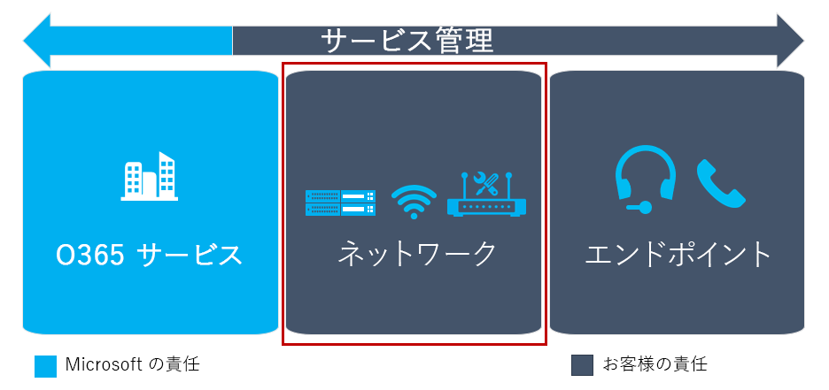

# 環境を評価するEvaluate my environment

この記事では、クラウドボイスサービスを使用するために現在の環境を適切に評価するための要件の概要を示します。This article gives an overview of the requirements for properly evaluating your current environment for using cloud voice services. 環境を評価することで、クラウドの全体的な展開に影響を与えるリスクと要件を特定することができます。By evaluating your environment, you identify risks and requirements that will influence your overall cloud voice deployment. これらの項目を事前に特定することで、計画を調整して成功を収めることができます。By identifying these items beforehand, you can adjust your planning to drive success.

## 環境の評価の概要Introduction to evaluating your environment

目標のキーの結果 (OKRs) を実現するには、以前に主要サービスの決定を行いました。To achieve your objective key results (OKRs), you previously made key service decisions. 次の手順では、環境の検出を実行して、IT とテレフォニーインフラストラクチャ、ネットワーキング、および運用に関するすべての側面を評価し、組織がソリューションを実装する準備ができていることを確認します。The next step is to perform environmental discovery to evaluate all aspects relating to your IT and telephony infrastructure, networking, and operations to confirm that your organization is ready to implement the solution.

ネットワークで電話会議や電話システムの実装をサポートしていることを確認するには、環境の検出にネットワーク準備評価が含まれている必要があります。Environmental discovery must include network readiness assessment to ensure your network can support the implementation of the Audio Conferencing or Phone System with Calling Plan services.

技術的なリスクは、環境の評価と導入の準備評価の一部として特定し、特定された各リスクの軽減計画を作成します。You identify technical risks as part of an environmental assessment and adoption readiness evaluation, and develop a mitigation plan for each identified risk.
この情報は、リスク登録に組み込む必要があります。You should incorporate this information in the risk register.

<!--ENDOFSECTION-->

## 現在の環境Current environment

環境の検出の一環として、Pc やモバイルデバイスの準備評価など、エンドユーザーのコンピューティングに関連するすべての事項を含め、プランのビジネスユースケースをサポートする電話会議と電話システムをサポートするための、ハードウェア要件からソフトウェア要件への対応を行います。As part of your environmental discovery, include all matters related to end-user computing, such as a readiness assessment of PCs and mobile devices to support Audio Conferencing and Phone System with Calling Plan business use cases, from hardware requirements to software requirements.

環境の検出では、 [電話番号を Microsoft に移行](phone-number-calling-plans/transfer-phone-numbers-to-teams.md)する必要があるかどうかを見つけることもできます。Environmental discovery can also uncover whether you need to [transfer phone numbers to Microsoft](phone-number-calling-plans/transfer-phone-numbers-to-teams.md).
この情報を把握しておくと、組織がそのプロジェクト計画を適宜調整し、番号の移行に必要な情報を準備するのに役立ちます。Knowing this will help your organization adjust its project plan accordingly and prepare the necessary information for number porting. [Microsoft Teams のロールアウトの環境検出](environmental-discovery-for-microsoft-teams-rollout.md)を使用して、環境検出を実行することができます。You can use the [Environmental discovery for Microsoft Teams rollout](environmental-discovery-for-microsoft-teams-rollout.md) to perform environmental discovery.

<table>
<tr><td>タイトルTitle</td><td>説明Description</td></tr>
<tr><td>  判断ポイントDecision points</td><td><ul><li>環境評価の完了責任者は誰ですか?Who will be responsible for completing an environment assessment?</li></ol></td></tr>
<tr><td> 次のステップNext steps</td><td><ul><li>環境評価の結果を文書化します。Document the results of the environment assessment.</li></ol></td></tr>
</table>

<!--ENDOFSECTION-->

## 導入と変更の管理評価機能Adoption and change management assessment capabilities

展開によって、ユーザーがすぐに新しいテクノロジを利用できるようになりましたが、ビジネスの結果は、ユーザーがそのソリューションを実際に採用した後でのみ実現されます。Deployment puts a new technology at a user's fingertips, but business results are only realized after users truly adopt that solution as their own. 新しいソリューションを継続的に導入するには、ユーザーの準備と変更管理に重点を置いておく必要があります。To help ensure sustained adoption of a new solution, you'll need to focus your efforts on user readiness and change management. 最適な結果を得るには、お客様のテクニカルレディネス活動への並列ワークストリームとして、ユーザーの準備計画を実施し、次のアクティビティを取り入れます。For optimal results, conduct user readiness planning as a parallel workstream to your technical readiness activities and incorporate the following activities:

-   **組織とユーザーのプロファイリング:** ユースケースとペルソナ分析に加えて、変更する組織 receptiveness の分析**Organizational and user profiling:** Analysis of organizational receptiveness to change in addition to use case and persona analysis

-   **準備とリソースの準備:** ユーザーの購入を高速化するための優先付加価値のメッセージなど、対象となる広範な認知度、トレーニング、およびサポートリソースを作成する**Readiness and resource preparation:** Creation of targeted and broad-reach awareness, training, and support resources, including focused value messaging to accelerate user buy-in

次の考慮事項を使用して、ユーザーの変更管理に対処するための組織の準備を評価します。Use the following considerations to assess your organization's preparedness to address user change management.

<table>
<tr><td>タイトルTitle</td><td>説明Description</td></tr>
<tr><td>  判断ポイントDecision points</td><td><ul><li>ユーザーによるソフトウェアまたはサービスの導入が成功したことを確認しましたか?Have you had previous success with user adoption of software or services?</li><li>利用状況の uptake を追跡することはできますか?Can you track usage uptake?</li><li>初期 &mdash; および継続的な &mdash; 導入キャンペーン (認識、トレーニング、サポート) を設計および管理するためのリソースがありますか?Do you have the resources to design and manage an initial&mdash;and ongoing&mdash;adoption campaign (awareness, training, and support)?</li><li>専用ユーザーの導入と変更管理チームを持っているか、またはこれらのリソースに投資してビジネスの成果を得ることができますか。Do you have a dedicated user adoption/change management team, or can you invest in those resources to ensure business outcomes?</li></ol></td></tr>
<tr><td> 次のステップNext steps</td><td><ul><li>&quot;上記のすべてに対して [はい] と回答した場合は、 &quot; 適切なユーザー変更管理の関係者を特定し、ユーザーの準備計画を開始します。If you answered &quot;yes&quot; to all of the above, identify the right user change management stakeholders and begin your user readiness planning.</li><li>&quot; &quot; 上記の一部またはすべてに回答しなかった場合は、組織の変更管理と導入関連のアクティビティを支援するために、外部のリソースを利用することを検討してください。If you answered &quot;no&quot; to some or all of the above, consider engaging outside resources to assist with driving change management and adoption-related activities for your organization.</li></ol></td></tr>
</table>

<!--ENDOFSECTION-->

## ネットワークの準備Network readiness

Teams では、オーディオとビデオの技術 (コーデック) が使用されています。そのため、ほとんどのネットワーク条件で対応できます。Teams uses audio and video technology (codecs) that can adapt to—and therefore perform better under—most network conditions. 最適かつ一貫性のあるパフォーマンスを確保するために、Teams 用にネットワークを準備する必要があります。To ensure optimal and consistent performance, you should prepare your network for Teams.

## 主要な考慮事項Key takeaways

このガイダンスから得られる主な考慮事項を示します。These are the main takeaways from this guidance. 次を実行する必要があります。You must:

-   TCP ポート 80 と 443 を開きます。Teams を使用するクライアントからの送信に対応します。Open TCP ports 80 and 443 outgoing from clients that will use Teams.

-   TCP ポート 3478 から 3481 までを開きます。Teams を使用するクライアントからの送信に対応します。Open UDP ports 3478 through 3481 outgoing from clients that will use Teams.

-   Teams を展開するために十分な帯域幅があることを確認します。Ensure that you have sufficient bandwidth for deploying Teams.

-   [Network Assessment Tool](https://www.microsoft.com/download/details.aspx?id=53885) を実行して、エッジ セグメントとクライアント セグメントの両方から「[メディアの品質とネットワーク接続性のパフォーマンス](https://docs.microsoft.com/SkypeForBusiness/optimizing-your-network/media-quality-and-network-connectivity-performance)」に記載されている要件を満たしていることを確認します。Run the [Network Assessment Tool](https://www.microsoft.com/download/details.aspx?id=53885) and ensure that you meet the requirements described in [Media quality and network connectivity performance](https://docs.microsoft.com/SkypeForBusiness/optimizing-your-network/media-quality-and-network-connectivity-performance) from both the edge segment and the client segment.

## ネットワークの準備をする理由についてWhy should you prepare your network?

実行する手順を確認する前に、チームのパフォーマンスに与える影響を理解し、ユーザーのしあわせ度と満足度を高めることが重要です。Before we look at the steps to be taken, it's important to understand what can affect the performance of Teams and thereby user happiness and satisfaction.
ユーザーがネットワーク品質を認識するときに影響する可能性があるものとして、次の 3 つの主要なリスク領域があります。Three major risk areas can affect how users perceive network quality:

-   利用可能な帯域幅が不十分Insufficient bandwidth available

-   ファイアウォールおよびプロキシによるブロックFirewall and proxy blockers

-   ジッターやパケット損失などのネットワーク障害Network impairments such as jitter and packet loss

以下で説明する手順は、展開がこれらのいずれかの要因によって影響を受けるかどうかを判断するのに役立ち、解決に向けて役立ちます。The steps described below will help you determine whether your deployment might be affected by any of these factors and will help you move toward a resolution.
ネットワークを準備していないと、不満のあるユーザーや、コストが高くなる臨時の修正が発生する可能性があります。Failing to prepare your network will likely lead to dissatisfied users and costly, ad-hoc fixes. Teams 用にネットワークと組織を準備することで、成功の可能性を大幅に高めることができます。By preparing your network—and your organization—for Teams, you can dramatically increase your chance of success.

<!--ENDOFSECTION-->

## 帯域幅の計画Bandwidth planning

ネットワーク準備に向けての最初のステップは、モダリティ Teams で利用できる十分な帯域幅がユーザーに提供されるようにすることです。The first step toward network readiness is ensuring your network has enough bandwidth available for the modalities Teams will provide to users. 十分な帯域幅を計画することは、非常に簡単な作業であり、非常に低優先のチームエクスペリエンスを実現するために非常に重要な作業を開始することになります。Planning for sufficient bandwidth is a fairly straightforward task and a very low-barrier start to ensure your users will have a high-quality Teams experience.

### ローカルのインターネット エグレスLocal internet egress

多くのネットワークは、ハブおよびスポーク トポロジを使用するよう設計されたものです。Many networks were designed to use a hub and spoke topology. このトポロジでは、インターネットのトラフィックは通常、インターネットに出現 (エグレス) する前に、 WAN を横断して中央データセンターに到達します。In this topology, internet traffic typically traverses the WAN to a central datacenter before it emerges (egresses) to the internet. これは多くの場合、総コストを削減する目的で、ネットワーク セキュリティ デバイスを一元化するために行われます。Often, this is done to centralize network security devices with the goal of reducing overall cost.

WAN でのバックホーリングのトラフィックは待機時間を増大させ、品質とユーザー エクスペリエンスに悪影響をおよぼします。Back-hauling traffic across the WAN increases latency and has a negative impact on quality and the user experience. Microsoft Teams は Microsoft の大規模なグローバルネットワークで実行されるため、多くの場合、ユーザーに近いネットワークピアリングの場所があります。Because Microsoft Teams runs on Microsoft's large global network, there's often a network peering location close to the user. ユーザーの場所に近いローカルのインターネット ポイントから出て、音声に最適化されたネットワークにできるだけ早く入ることにより、ユーザーはより良質なパフォーマンスを得る可能性が高くなります。A user will most likely get better performance by egressing out of a local internet point close to their location and on to our voice-optimized network as soon as possible. 一部の負荷については、最も近いフロントエンド サーバーにトラフィックを送信するために DNS 要求が使用されます。For some workloads, DNS requests are used to send traffic to the nearest front-end server. このような場合は、ローカルの出口ポイントを使うときに、ローカルの DNS 解決とペアリングされていることが重要です。In such cases, it's important that when using a local egress point, it's paired with local DNS resolution.

Microsoft のグローバルネットワークへのネットワークパスを最適化すると、パフォーマンスが向上し、最終的にユーザーに最適なエクスペリエンスが提供されます。Optimizing the network path to Microsoft's global network will improve performance and ultimately provide the best experience for users. 詳細については、「[Getting the best connectivity and performance in Office 365](https://techcommunity.microsoft.com/t5/Office-365-Blog/Getting-the-best-connectivity-and-performance-in-Office-365/ba-p/124694)」のブログ投稿をご覧ください。For more detail, see the blog post [Getting the best connectivity and performance in Office 365](https://techcommunity.microsoft.com/t5/Office-365-Blog/Getting-the-best-connectivity-and-performance-in-Office-365/ba-p/124694).

### VPNVPN

VPN は多くの組織に対して、価値のあるサービスを提供します。VPNs provide a valuable service to many organizations. 残念ながら、通常は、リアルタイムメディアをサポートするように設計されていないか、構成されていません。Unfortunately, they're typically not designed or configured to support real-time media. 一部の VPN は、UDP をサポートしていない可能性もあります。Some VPNs might also not support UDP. Vpn は、既に暗号化されているメディアトラフィックの上に、暗号化の追加レイヤーを導入することもあります。VPNs also introduce an extra layer of encryption on top of media traffic that's already encrypted. さらに、VPN デバイスを介したヘアピン型トラフィックが原因で、Teams サービスへの接続が効率的ではない可能性もあります。In addition, connectivity to the Teams service might not be efficient due to hair-pinning traffic through a VPN device.
さらに、チームが必要とする予測される負荷に対応するために、キャパシティの観点から設計されるとは限りません。Furthermore, they aren't necessarily designed from a capacity perspective to accommodate the anticipated loads that Teams will require.

Teams トラフィックのために VPN をバイパスする代替パスを提供することをお勧めします。The recommendation is to provide an alternate path that bypasses the VPN for Teams traffic. これは*スプリット トンネル VPN* として一般に知られています。This is commonly known as *split-tunnel VPN*. [トンネリングの分割を行うと、Microsoft 365 または Office 365 のトラフィックは VPN を経由せず、直接 Microsoft 365 または Office 365 に移動します。Split tunneling means that traffic for Microsoft 365 or Office 365 won't traverse the VPN but will go directly to Microsoft 365 or Office 365. この変更によって品質は良好になりますが、VPN デバイスと組織のネットワークからの負荷を軽減するという第2のメリットも提供されます。This change will have a positive impact on quality, but also provides the secondary benefit of reducing load from the VPN devices and the organization's network.

スプリット トンネルを実行するには、構成の詳細について、VPN ベンダーに相談してください。To implement a split-tunnel, consult with your VPN vendor for the configuration details.

### Wi-FiWi-Fi

VPN と同じように、Wi-Fi ネットワークは、リアルタイムメディアをサポートするように設計されていない場合もあります。Like VPN, Wi-Fi networks aren't necessarily designed or configured to support real-time media. Teams をサポートするために Wi-Fi ネットワークのための計画を立てたり、最適化を行うことは、高品質の展開を実現するための重要な考慮事項です。Planning for, or optimizing, a Wi-Fi network to support Teams is an important consideration for a high-quality deployment.

Wi-Fi ネットワークの最適化には、いくつかの要素が関係します。There are several factors that come into play for optimizing a Wi-Fi network:

-   Wi-Fi ネットワーク上でメディア トラフィックが確実に優先されるように QoS または Wi-Fi マルチメディア (WMM) を実装すること。Implementing QoS or Wi-Fi Multimedia (WMM) to ensure that media traffic is getting prioritized accordingly over the Wi-Fi networks.

-   W-Fi バンドとアクセス ポイントの配置の計画と最適化。Planning and optimizing the Wi-Fi bands and access point placement. アクセス ポイントの配置に応じて、2.4 GHz 帯で十分なエクスペリエンスが提供される可能性がありますが、アクセスポイントは、多くの場合にその帯域で動作するその他のコンシューマー デバイスによって影響を受けます。The 2.4 GHz range may provide an adequate experience depending on access point placement, but access points are often affected by other consumer devices that operate in that range. 5 GHz 帯は、その密度により、リアルタイム メディアにより適していますが、十分なカバレッジを得るためにより多くのアクセスポイントを必要とします。The 5 GHz range is better suited to real-time media due to their dense range but requires more access points to get sufficient coverage. エンドポイントも、その帯をサポートしており、それらの帯を利用できるように構成されている必要があります。Endpoints also need to support that range and be configured to leverage those bands accordingly.

-   デュアル バンドの Wi-Fi ネットワークが展開されている場合は、バンド ステアリングの実装を検討してください。If dual-band Wi-Fi networks are deployed, consider implementing band steering. バンド ステアリングは Wi-Fi ベンダーによって実装された技術で、デュアル バンド クライアントが 5 GHz 帯を使用するように仕向けます。Band steering is a technique implemented by Wi-Fi vendors to influence dual-band clients to use the 5 GHz range.

-   同じチャネルのアクセス ポイントがお互いに近すぎる場合、信号のオーバーラップや意図しない競合が発生して、ユーザーのエクスペリエンスが低下する可能性があります。When access points of the same channel are too close together they can cause signal overlap and unintentionally compete, resulting in a bad experience for the user. 互いに隣接するアクセスポイントが重なっていないチャネル上にあることを確認します。Ensure that access points that are next to each other are on channels that don't overlap.

各無線ベンダーは、その無線ソリューションを展開する場合の推奨事項をそれぞれ持っています。Each wireless vendor has its own recommendations for deploying its wireless solution. 詳細なガイダンスについては、ご利用のベンダーに相談することをお勧めします。We recommend that you consult your vendor for specific guidance.

<!--ENDOFSECTION-->

## ファイアウォールおよびプロキシの要件Firewall and proxy requirements

Microsoft Teams は、Microsoft Online Services に接続します。そのためにインターネット接続が必要になります。Microsoft Teams connects to Microsoft Online Services and needs internet connectivity for this. Teams が正しく機能するために、TCP ポート 80 と 443 をクライアントからインターネット向けに開くことと、UDP ポート 3478 から 3481 までをクライアントからインターネットに向けて開くことが必要です。For Teams to function correctly, you must open TCP ports 80 and 443 from the clients to the internet, and UDP ports 3478 through 3481 from the clients to the internet. TCP ポートは、SharePoint Online、Exchange Online、および Teams Chat サービスなどの Web ベースのコンテンツに接続するために使用されます。The TCP ports are used to connect to web-based content such as SharePoint Online, Exchange Online, and the Teams Chat services.
プラグインとコネクタも、これらの TCP ポートを介して接続します。Plug-ins and connectors also connect over these TCP ports. 4 つの UDP ポートは、オーディオおよびビデオなどのメディアのために使用され、それらのフローが正常に行われるようにします。The four UDP ports are used for media such as audio and video, to ensure they flow correctly.

これらのポートを開くことは、高い信頼性を確保しながら Teams を展開するために不可欠です。Opening these ports is essential for a reliable Teams deployment. このポートのブロックはサポートされていないため、メディアの品質に影響します。Blocking these ports is unsupported and will have an effect on media quality.

所属する組織で、これらのポートが開かれる対象となる正確な IP アドレス範囲とドメインを指定することが必要な場合、これらのポートに対するターゲット IP 範囲とドメインを制限することができます。If your organization requires that you specify the exact IP address ranges and domains to which these ports should be opened, you can restrict the target IP ranges and domains for these ports. 正確なポート、プロトコル、IP 範囲の一覧については、「 [Microsoft 365 または Office 365 の url と ip アドレスの範囲](https://support.office.com/article/Office-365-URLs-and-IP-address-ranges-8548a211-3fe7-47cb-abb1-355ea5aa88a2#bkmk_teams)」を参照してください。For a list of exact ports, protocols, and IP ranges, see [Microsoft 365 or Office 365 URLs and IP address ranges](https://support.office.com/article/Office-365-URLs-and-IP-address-ranges-8548a211-3fe7-47cb-abb1-355ea5aa88a2#bkmk_teams).
ターゲットの IP アドレス範囲とドメインを制限する場合は、変更されている可能性があるため、ポートと範囲のリストを常に最新の状態に維持する必要があります。If you choose to restrict the target IP address ranges and domains, you must ensure that you keep the list of ports and ranges up to date because they might change. 変更が生じたときに更新される、[こちらの RSS フィード](https://go.microsoft.com/fwlink/p/?linkid=236301)を購読できます。You can subscribe to [this RSS feed](https://go.microsoft.com/fwlink/p/?linkid=236301) to be updated when changes occur. また、 [Skype For Business ネットワーク評価ツール](https://www.microsoft.com/download/details.aspx?id=53885) を定期的に実行して、すべてのポートを開くかどうかをテストすることをお勧めします。It's also a good practice to test whether all ports are opened by running the [Skype for Business Network Assessment Tool](https://www.microsoft.com/download/details.aspx?id=53885) on a regular basis. このツールの機能の詳細については、次のセクションをご覧ください。You can find out more about the functionality of this tool in the next section.

プロキシ サーバーが展開されている場合は、すべての Teams サービスについてプロキシ サーバーをバイパスすることをお勧めします。In the event of a proxy server being deployed, we recommend that you bypass the proxy server for all Teams services. プロキシを使っても機能する可能性がありますが、UDP の代わりに TCP を使うようになっているメディアによって音質が低下する可能性があります。Although using a proxy might work, it's very likely that quality will be reduced due to media being forced to use TCP instead of UDP. プロキシサーバーとバイパスの詳細については、「 [Microsoft 365 または Office 365 の url と IP アドレスの範囲](https://docs.microsoft.com/MicrosoftTeams/office-365-urls-ip-address-ranges)」を参照してください。For more information about proxy servers and bypassing, see [Microsoft 365 or Office 365 URLs and IP address ranges](https://docs.microsoft.com/MicrosoftTeams/office-365-urls-ip-address-ranges).

<!--ENDOFSECTION-->

## ネットワークのテストTest the network

計画とネットワークの準備 (帯域幅のアップグレード、ファイアウォールでのポートのオープンなど) が完了したら、ネットワークのパフォーマンスをテストする必要があります。After you've completed your planning and network preparation—including upgrading bandwidth and opening ports in the firewall—you should test your network's performance. このテストの結果により、電話会議または電話システムを成功させるために必要なすべてのネットワーク最適化または修復が、通話プランの実装によってわかりやすくなります。The results of this testing will paint a clearer picture of any network optimization or remediation required for the success of your Audio Conferencing or Phone System with Calling Plan implementation.

[Skype for Business Network Assessment Tool](https://www.microsoft.com/download/details.aspx?id=53885) をダウンロードし、ネットワークが Teams に対応しているかどうかをテストできます。You can download the [Skype for Business Network Assessment Tool](https://www.microsoft.com/download/details.aspx?id=53885) to test whether your network is ready for Teams. このツールが提供する 2 つの機能により、すべての正しいポートが開かれているかどうかと、ネットワーク障害についてのテストを実施できます。The tool offers dual functionality: it can test whether all the correct ports have been opened, and it can test for network impairments.

ツールをダウンロードしてインストールした後、C: \\ Program Files \\ Microsoft Skype For Business ネットワーク評価ツールで見つけることができます。After you download and install the tool, you can find it in C:\\Program Files\\Microsoft Skype for Business Network Assessment Tool. ツールの使用方法についての詳細なガイドである Usage.docx は、そのディレクトリに含まれています。A detailed guide for how to use the tool, Usage.docx, is included in that directory.

### 開いているポートをテストするTest for opened ports

コマンドプロンプトウィンドウを開き、 **「Cd C: \\ Program Files \\ Microsoft Skype For Business Network アセスメントツール**」と入力して、[ネットワーク評価ツール] ディレクトリに移動します。Open a Command prompt window and navigate to the Network Assessment Tool directory by entering **cd C:\\Program Files\\Microsoft Skype for Business Network Assessment Tool**. コマンド プロンプトで、**networkassessmenttool.exe /connectivitycheck** と入力して開いているポートのテストを開始します。At the command prompt, start the test for opened ports by entering **networkassessmenttool.exe /connectivitycheck**

チェックを実行した後、ツールは、"検証が完了しました" というメッセージまたはブロックされたポートに関するレポートを表示します。After running the checks, the tool will either display the message "Verifications Completed Successfully" or report on the ports that were blocked.
また、Connectivity_results.txt というファイルが生成されます。このファイルには、ツールからの出力が含まれます。出力は、%userprofile%\\appdata\\local\\microsoft skype for business network assessment tool\\ ディレクトリに格納されます。It also generates a file named Connectivity_results.txt, which contains the output from the tool and stores it in the %userprofile%\\appdata\\local\\microsoft skype for business network assessment tool\\ directory.

ポートが開かれ、正しく機能していることを確認するために、接続チェックを定期的に実行することをお勧めします。We recommend that you run the connectivity checks on a regular basis to ensure the ports have been opened and are functioning correctly.

### ネットワーク障害のテストTest for network impairments

ユーザー満足度を高めるには、ネットワーク上の障害を抑える必要があります。To increase user satisfaction, you should limit any impairments on your network.
最も一般的なネットワーク障害としては、遅延 (待ち時間)、パケット損失、ジッターがあります。The most common network impairments are delay (latency), packet loss, and jitter:

-   **遅延**: これは、IP パケットがネットワーク上のポイント A からポイント B に到達するまでにかかる時間です。**Latency:** This is the time it takes to get an IP packet from point A to point B on the network. このネットワーク伝達遅延は、さまざまなルーターの間の追加のオーバーヘッドを含めて、2 つのポイントの間の物理的な距離と光速度に関連しています。This network propagation delay is essentially tied to physical distance between the two points and the speed of light, including additional overhead taken by the various routers in between.
    遅延は、一方向またはラウンド トリップ時間として測定されます。Latency is measured as one-way or round-trip time.

-   **パケット損失**: これは、指定した時間帯に失ったパケットの割合として定義されることがよくあります。**Packet loss**: This is often defined as a percentage of packets that are lost in a given window of time. パケット損失は、オーディオの品質に直接影響を与えます。ほとんど影響を及ぼすことのない小規模のパケット損失から、音声が完全に途切れる原因となる連続したバースト損失まで存在します。Packet loss directly affects audio quality—from small, individual lost packets having almost no impact to back-to-back burst losses that cause audio to cut out completely.

-   **パケット到着間隔ジッターまたは単純なジッター:** 連続するパケット間の遅延の平均変動です。**Inter-packet arrival jitter, or simply jitter:** This is the average change in delay between successive packets. Skype for Business などの最新の VoIP ソフトウェアは、多くの場合、バッファリングによって一定レベルのジッターに対応できます。Most modern VoIP software, including Skype for Business, can adapt to some levels of jitter through buffering. これは、参加者がジッターの影響に気付くほど、ジッターがバッファリングを超える場合に限定されます。It's only when the jitter exceeds the buffering that a participant will notice the effects of jitter.

これらの障害の最大値については、「[メディアの品質とネットワーク接続性のパフォーマンス](https://docs.microsoft.com/SkypeForBusiness/optimizing-your-network/media-quality-and-network-connectivity-performance)」で取り上げられています。The maximum values for these impairments are described in [Media quality and network connectivity performance](https://docs.microsoft.com/SkypeForBusiness/optimizing-your-network/media-quality-and-network-connectivity-performance).
これらの障害をテストするときは、以下の 2 つの異なるセグメントを区別します。When testing for these impairments, we distinguish between two separate segments:

-   *エッジ セグメント*は、ルーターが存在するセグメントです。The *edge segment* is the segment in which your router lives. 各地域のインターネットに接続している、直近の論理ネットワーク セグメントです。This is the closest logical network segment connected to the internet at each of your locations. ほとんどの場合、これはルーターの接続ポイントです。境界ネットワーク (別名、*DMZ*、*非武装地帯*、*スクリーン サブネット*) の場合もあります。In most cases, this is the connection point of the router, or possibly a perimeter network (also known as *DMZ*, *demilitarized zone*, and *screened subnet*). ルーター以外のデバイスに影響を与えるトラフィックは、このセグメントとインターネットの間で行われることはありません。No further traffic that affects devices other than the router should occur between this segment and the internet.

-   *クライアント セグメント*は、クライアントが存在する論理ネットワーク セグメントです。The *client segment* is the logical network segment in which your clients reside.

Network Assessment Tool を使用して、両方のセグメントをテストする必要があります。You should test both segments by using the Network Assessment Tool. セグメントをテストするには、コマンド プロンプトで対象ディレクトリに移動し、**networkassessmenttool.exe** と入力します。To test the segment, navigate to the directory and enter **networkassessmenttool.exe** at the command prompt. 結果は Results.tsv というファイルに書き込まれます。各セグメントの[要件](https://docs.microsoft.com/SkypeForBusiness/optimizing-your-network/media-quality-and-network-connectivity-performance)と結果を比較できます。The results are written to a file named Results.tsv, and you can compare them to the [requirements](https://docs.microsoft.com/SkypeForBusiness/optimizing-your-network/media-quality-and-network-connectivity-performance) for each segment.

高品質の展開を行うには、両方のセグメントが要件を満たしている必要があります。Note that both segments must meet the requirements for a high-quality deployment. ネットワークのパフォーマンスを適切に示すために、このツールを1時間に複数回実行することをお勧めします。We recommend that you run the tool multiple times for one hour straight to get a good indication of your network's performance.

<!--ENDOFSECTION-->

## ネットワークの修復Network remediation

帯域幅の計画、ポートのテスト、ネットワーク要件のテストの結果によって、Teams を展開する前に現在のネットワークを修復する必要があると示される場合、次の複数の方法で修復を実行することができます。If the results of bandwidth planning, port testing, or network requirements testing show that your current network needs remediation before you deploy Teams, you can accomplish this in several ways:

-   帯域幅が不十分な場合は、接続をアップグレードして、Microsoft 365 または Office 365 へのトラフィックが unhindered に流れるようにします。For insufficient bandwidth, upgrade connections so that traffic to Microsoft 365 or Office 365 can flow unhindered.

-   ポートがブロックされた場合は、ファイアウォールのルールを変更して、ポートのテストをやり直します。For blocked ports, change firewall rules and retest the ports.

-   ネットワーク障害の場合は、必ず根本原因の分析を実行します。For network impairments, always perform a root-cause analysis.

サービスの品質 (QoS) を使うと、トラフィックの優先順位付けと分離によって障害を克服できます。Quality of service (QoS) can be used to battle impairments by prioritizing and separating traffic. 一部の組織では、帯域幅の問題を解決するために QoS を展開したり、トラフィック フロー量を制限したりします。Some organizations choose to deploy QoS to overcome bandwidth issues or restrict the amount of traffic flowing. これにより品質が向上することはなく、新しい問題が発生する可能性があります。This won't improve quality and will lead to new problems. 根本原因分析は、ネットワーク障害が要件を超えたときに常に行う必要があります。A root-cause analysis should always be performed when network impairments exceed requirements. QoS を解決策として使うことができます。QoS can be a solution.
詳しくは、「[Microsoft Teams でのサービスの品質](https://docs.microsoft.com/MicrosoftTeams/qos-in-teams)」を参照してください。For more information, see [Quality of Service in Microsoft Teams](https://docs.microsoft.com/MicrosoftTeams/qos-in-teams).

>[!NOTE]
>多くのネットワークは時間の経過とともに、アップグレード、拡張、その他のビジネス上の要件によって、進展します。Many networks evolve over time due to upgrades, expansion, or other business requirements. 自分のサービス管理計画の一部として、これらの領域の保守管理のための運用プロセスが確立されていることを確認します。Ensure that you have operational processes in place to maintain these areas as part of your service management planning.

<table>
<tr><td>タイトルTitle</td><td>説明Description</td></tr>
<tr><td>  判断ポイントDecision points</td><td><ul><li>すべてのネットワーク セグメントと組織の場所で、適切なネットワーク評価を完了する責任があるのは誰ですか?Who will be responsible for completing proper network assessments across all network segments and organization locations?</li></ol></td></tr>
<tr><td> 次のステップNext steps</td><td><ul><li>詳細なネットワーク評価を実行して、Microsoft Teams の展開に向けたネットワークの準備ができていることを確認できます。You can perform a detailed network assessment to help ensure your network is ready for your Microsoft Teams deployment.</li><li>各ネットワークセグメントの評価結果に基づいてネットワークの修復を実行します。Perform network remediation based on the results of the assessment for every network segment.</li></ol></td></tr>
</table>

<!--ENDOFSECTION-->
