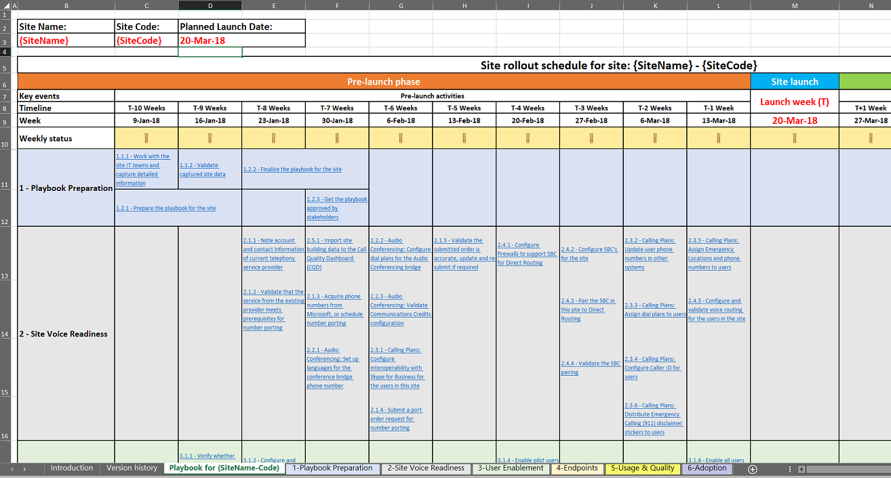

# サービスを展開する

この記事では、クラウド音声サービスを適切に展開するための要件の概要を示します。 クラウド音声サービスを展開するための規範となるガイダンスに従うと、すべての要件を適切に考慮して、反復可能な結果を得ることができます。

## Microsoft Teams の音声ワークロードのためのサイトの有効化のプレイブック

このプレイブックを使用して、組織がサイトごとに Microsoft Teams の音声機能のロールアウトを正常に計画して実行できるようにします。

このプレイには、必要なすべてのアクティビティ、推奨されるタイムライン、および各アクティビティの対応するガイダンスへのリンクが含まれています。このプレイには、特定のサイトにチームの音声展開を成功させるためのエンドツーエンドのガイダンスが記載されています。重要な要因に焦点を当てます。を選びます。

このプレイブックのアクティビティを完了することで、組織は次のことができます。

-   チームのロールアウトを効果的に計画してスケジュールします。

-   ユーザー導入を迅速化し、最適化します。

-   サポートニーズを減らし、ユーザーの満足度を高める。

> [!NOTE]
> この記事と関連するプレイブックは、サービスの有効化または特定のサイトへのダイヤルトーンの提供に必要なすべての技術的構成手順を説明することを目的としていません。 代わりに、ユーザーが簡単にオンボードで作業するために推奨されるアクティビティとタスクに重点を置いています。また、サポート要件を最小限に抑えながら、迅速かつスムーズな移行によってチームのボイスワークロードを使い始めることができます。 チームボイス向けに環境を最適に構成する方法についての技術的なガイダンスについては、「チームの[音声ワークロードを構成](onboarding-checklist-configure-cloud-voice-workloads-in-Microsoft-Teams.md)する」のオンボードチェックリストを参照してください。 [Teams での直接ルーティングの構成](onboarding-checklist-configure-direct-routing-in-Microsoft-Teams.md)、 [teams のコア機能](onboarding-checklist-configure-microsoft-teams-core-capabilities.md)、[ネットワークTeams の](onboarding-checklist-configure-networking.md)場合は、 [Office 365 を有効](onboarding-checklist-enable-office-365.md)にします。

<!--ENDOFSECTION-->

## フォーカス領域

このプレイブックの焦点は、チームの音声展開に対するユーザーの認識に影響を与える要因に対処することです。 アクティビティとタスクは、次のフォーカス領域にグループ化されます。

-   サービス準備の検証
    - 電話会議
    - 通話プラン
    - ダイレクト ルーティング

-   ユーザーの有効化

-   エンドポイント

-   使用状況と品質

-   出産

[音声 (プレイブック) のサイト有効化のプレイ](https://github.com/MicrosoftDocs/OfficeDocs-SkypeForBusiness/blob/live/Teams/downloads/site-enablement-playbook-for-voice-(playbook).xlsx?raw=true)ブックは Microsoft Excel ブックです。 これら5つの各フォーカス領域は、ブック内の個別のシートであり、展開タスクとアクティビティはそれぞれ次のいずれかのシートにまとめられています。

> [!NOTE]
> チームのロールアウトの対象となる範囲内の各サイトについて、個別のプレイブックのインスタンスを作成します。

<!--ENDOFSECTION-->

## プレイブックの使い方

場所のサイズと複雑さに関係なく、各サイトを有効にするには、実際のサービスのロールアウトの前、前後、または後で、タスクとアクティビティを適切な順序で実行する必要があります。 Microsoft Teams voice の計画を立てて実行する場合は、次の手順に従うことをお勧めします。

1. Microsoft Teams Voice 用の[音声 (プレイブック) 用のサイト有効化のプレイブック](https://github.com/MicrosoftDocs/OfficeDocs-SkypeForBusiness/blob/live/Teams/downloads/site-enablement-playbook-for-voice-(playbook).xlsx?raw=true)をダウンロードします。

2. 各サイトのプレイブックのコピーを別途作成します。

3. **{Sitename-code} 用の "プレイブック**" というシートのタブで、 **{sitename-code}** を関連するサイト名やサイトコードに置き換えます。

4. 次に示すように、**サイト名、サイトコード**、計画された**開始日**を入力します。 これは、プレイブック内のすべてのアクティビティについて推奨される期限を調整するため、重要なステップです。

   

5. 各アクティビティを確認し、必要なアクションを実行して、タイムラインを通して状態を更新します。 次に示すように、状態はグラフィカルに表示されます。
  
   - が **[はい] または [該当しない] (緑)** の場合: アクティビティが完了しているか、このサイトには適用されず、これ以上の操作は必要ありません。</li>
    - いないことを示す黄色の感嘆符<strong>(黄):</strong>アクティビティはまだ完了していません。また、スケジュールされている場合は、[はい] または [いいえ] に更新する必要があります。</li>
   -  [<strong>いいえ (赤)</strong> ] の図: 問題が発生したため、アクティビティを完了できず、プロジェクトの進捗会議に参加する必要があります。</li></ul>

6. ステータスは各セクション内でロールアップされ、セクション見出しは次のいずれかのステータスインジケーターで表示されます。 **週単位のステータス**も自動的に更新されます。

> [!TIP]
> 使用しているすべての場所について、上記の手順を繰り返します。

> [!IMPORTANT]
> 一部の手順は、すべての場所やサイトに適用されないことがあります。 特定のアクティビティがサイトに関連していない場合は、このアクティビティに**適用しない**ことを選択する必要があります。 プレイブック内の行を削除しないで**ください**。この操作を行うと、ステータスロールアップ数式が機能しなくなります。  
電話番号の移植や調達など、計画した時間よりも時間がかかる可能性があるアクティビティには注意してください。 これらのアクティビティは、サイト展開のタイムラインに悪影響を与える可能性があります。 アクティビティリストと関連するタイムラインの週を確認して更新して、関係者が各サイトのステータスと展開スケジュールの誤差を確実に認識できるようにしてください。

<table>
<tr><td>  判断のポイント</td><td><ul><li>展開にサイトの有効化のプレイブックが必要かどうかを決定します。</li><li>展開するすべてのサイトについて、Microsoft Teams のサイト有効化のプレイブックをカスタマイズする責任者を決定します。</li></ul></td></tr>
<tr><td> 次のステップ</td><td><ul><li><a href="https://github.com/MicrosoftDocs/OfficeDocs-SkypeForBusiness/blob/live/Teams/downloads/site-enablement-playbook-for-voice-(playbook).xlsx?raw=true" data-raw-source="[Download the Site Enablement Playbook](https://github.com/MicrosoftDocs/OfficeDocs-SkypeForBusiness/blob/live/Teams/downloads/site-enablement-playbook-for-voice-(playbook).xlsx?raw=true)">サイト有効化のプレイブックをダウンロード</a>します。</li><li>初めてのサイト向けのサイト有効化のプレイブックをカスタマイズします。</li><li>必要に応じて、他のサイトにも同じ手順を繰り返します。</li></ul></td></tr>
</table>

<!--ENDOFSECTION-->