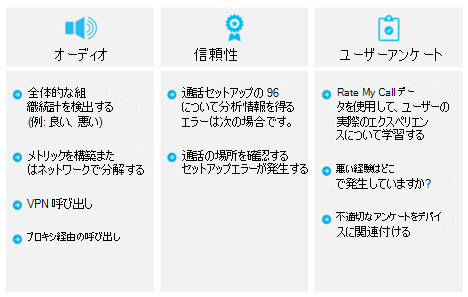

# [サービスの管理を計画します。Plan my service management

この資料では、提供し、高品質のマイクロソフト チーム配置を維持するために必要な要件の概要を示します。This article gives an overview of the requirements that are necessary to deliver and maintain a high-quality Microsoft Teams deployment. Envision フェーズの最初のパイロットまたは運用展開の前に、サービスの管理と品質の計画での展開を成功させることを確認することができます。You can help ensure a successful deployment by planning for service management and quality during the Envision phase, before your first pilot or production deployment.

## サービス チームの管理Service management for Teams

サービスの管理は、展開およびユーザーに対して有効にされた後、マイクロソフトのチーム サービスの日常的な操作をカバーする広範なトピックです。Service management is a broad topic that covers day-to-day operations of the Microsoft Teams service after it has been deployed and enabled for users. チーム サービスは、Microsoft Office 365 を包含およびインフラストラクチャ ・ コンポーネントは設置型の展開 (ネットワークなど)。The Teams service encompasses Microsoft Office 365 and the infrastructure components that are deployed on-premises (for example, networking).

ほとんどの場合、サービス管理の概念はほとんどの組織にとって新しい概念ではありません。The notion of service management is most likely not a new concept for most organizations. おそらく既に実装しているプロセスと既存のサービスに関連付けられているタスクです。You probably have already implemented processes and tasks that are associated with existing services. とはいえ、何がある場所を計画するときサービスの管理の現在、将来的にマイクロソフトのチームをサポートするためを追加することができます可能性があります。That said, you can probably augment what you have in place when you plan for service management today to support Microsoft Teams in the future.

サービスの管理には、すべてのアクティビティが含まれますのプロセスが関与するエンド ツー エンドのマイクロソフトのチームを管理します。Service management encompasses all the activities and processes involved in managing Microsoft Teams end to end. サービスの管理の一部のコンポーネント、インフラストラクチャ ・ コンポーネントを Office 365 サービス自体を構成する-は、マイクロソフトの責任は、お客様のチームは、ネットワークのさまざまな側面を管理するには、そのユーザーに責任を負うとエンドポイントを提供します。Some components of service management—the infrastructure components that the Office 365 service itself comprises—are Microsoft’s responsibility, whereas the customer is accountable to its users to manage the various aspects of Teams, the network, and endpoints they provide.
顧客担当チームのサービスの管理とユーザー エクスペリエンスの質を支持する主要なコンポーネントに関連付ける方法の詳細については、[サービスの管理と品質の計画](https://docs.microsoft.com/MicrosoftTeams/envision-planning-for-service-management-and-quality-complete-guide)を参照してください。For a complete discussion of the customer responsibility for Teams service management and how it relates to the key components that underpin the quality of the user experience, see [Plan for service management and quality](https://docs.microsoft.com/MicrosoftTeams/envision-planning-for-service-management-and-quality-complete-guide).

![図品質 - の 3 つのコンポーネントの Office 365 サービス、ネットワーク、およびエンドポイント - およびサービスの管理がすべての 3 つに重なっている]。(media/plan-my-service-management-image1.png "図品質 - の 3 つのコンポーネントの Office 365 サービス、ネットワーク、およびエンドポイント - およびサービスの管理がすべての 3 つに重なっている")。

<!--ENDOFSECTION-->

## 運用ガイドの概要Introduction to the Operations Guide 

**どのような\*\*\*\*誰**が、**どのように**サービスを管理する際に回答する必要がある 3 つの重要な質問をされます。**What**, **Who**, and **How** are three important questions that need to be answered when it comes to service management.

[運用ガイド](https://docs.microsoft.com/MicrosoftTeams/1-drive-value-operate-my-service)を使用するにはこれらの質問にある 3 つのすべてに対処するためです。You can use the [Operations Guide](https://docs.microsoft.com/MicrosoftTeams/1-drive-value-operate-my-service) to help you address all three of these questions. ガイドでは、毎日、毎週、月単位、および必要に応じた単位で実行するアクティビティのリストを提供します。The guide provides a list of activities to be performed on a daily, weekly, monthly, and as-needed basis. これらのアクティビティとタスクは、高品質のチームの配置を維持するために重要です。These activities and tasks are critical for maintaining a high-quality Teams deployment. 展開を成功させるための Envision フェーズの早い段階で実行する必要がある計画の重要な側面は、サービス管理の特定のアクティビティを実行するために担当者を決定します。Determining who will be responsible for performing specific activities in service management is a critical aspect of your planning that you need to do early in the Envision phase to ensure a successful deployment. タスクと活動を理解したなら後を理解し、グループや個人に割り当てることの後にする必要があります。After you’ve figured out the tasks and activities, they need to be understood and followed by the groups or individuals that you assign to them. 運用ガイドは、知識と、タスクの実行方法についてのガイダンスを提供、外部コンテンツへの参照します。The Operations Guide provides knowledge and guidance for how to perform each of the tasks, and/or references to outside content.

## 操作上の役割のマッピングのための計画Plan for operational role mapping

サービス管理のための計画を早い段階は、運用フェーズが始まる最初のパイロット ユーザーを有効にするための重要なマイルス トーン、です。Planning for service management early is a critical milestone, because the operations phase begins when the first pilot users are enabled. プロジェクト チームが確認し、タスクに同意する必要があり、活動のために必要なそれぞれの運用タスクを担当するチームを識別するコミットメントを取得し、それぞれ各チームの承認をします。The project team must review and agree on the tasks and activities required, identify the team that’s responsible for each operational task, and then get a commitment and sign-off from each respective team.

サインオフが完了した後、担当チームが開始する必要がありますし、これらの役割と責任に任せています。After sign-off is complete, the responsible team must then start operationalizing these roles and responsibilities. トレーニングと準備、スタッフのモデルを更新するか、外部のパートナーを提供する準備ができていることを確認可能性があります。This might include training and readiness, updating the staffing model, or ensuring that external partners are ready to deliver.

Envision のフェーズの早い段階で運用上の役割のマッピングには、パイロットとの操作をランプの中に、運用タスクを起動してすべての準備ができている、展開を開始した後かどうかを確認するすべてのチームが有効にします。Mapping operational roles early in the Envision phase enables all teams to start their operational tasks during the pilot and ramp up operations and make sure that everything is ready after the deployment starts.

運用ガイドでは、ほとんどのシナリオで有効にする必要がある一般的なロールにマップする一般的なタスクの一覧を示します。The Operations Guide provides a list of common tasks mapped to typical roles that should be valid in most scenarios. これらの役割、組織のために機能をカスタマイズする必要があります。You need to customize these responsibilities to work for your organization.

>[!TIP]
>次は、運用上の役割がこのプロジェクトをサポートするために実行した手順のマッピングの結果を文書化するためのテンプレートの例です。The following is an example of a template to document the result of operational roles mapping exercise that you performed to support this project.

|運用の役割Operational Role |説明Description |チームTeam |連絡先の詳細Contact Details |
|---------|---------|---------|---------|
|サービス所有者Service Owner|サービス所有者、ビジネス部門へのインターフェース、戦略Service owner, interface to business divisions, strategy|TBATBA|TBATBA|
|電話会議の運用Audio Conferencing Operations|日常的な運用、ユーザーとデバイス アカウントの移動/追加/変更、監視Daily operations, user and device account move/add/change, monitoring|TBATBA| TBATBA| 
|テナント管理者Tenant Admin|テナント全体の設定の変更、新しい機能の有効化Change tenant-wide settings, enable new features|TBATBA|TBATBA|
|ヘルプ デスクHelp Desk|ユーザーのサポートを取得するためのインターフェイスInterface for users to get support|TBATBA|TBATBA|
|ネットワークの運用Network Operations|LAN、WAN、Wi-fi、およびインターネットへのアクセスを実行します。Run LAN, WAN, Wi-Fi, and internet access|TBATBA|TBATBA|
|Client & Endpoints チームClient & Endpoints Team|デスクトップの展開を管理するManage desktop deployments|TBATBA|TBATBA|
|ID の運用Identity Operations|(Active Directory、Active Directory フェデレーション サービス、Azure AD) の id インフラストラクチャを管理します。Manage identity infrastructure (Active Directory, Active Directory Federation Services, Azure AD)|TBATBA|TBATBA|
|導入/変更管理Adoption/Change Management|意識、トレーニング、およびソリューションの導入を管理します。Manage awareness, training, and adoption for the solution|TBATBA|TBATBA|
|Exchange の運用Exchange Operations|Exchange 環境を管理します。Manage the Exchange environment|TBATBA|TBATBA|
|テレフォニーの操作Telephony Operations|SBC の電話番号を管理します。Manage the SBC's and the phone numbers|TBATBA|TBATBA|

詳細な運用上の役割のマッピングをより容易にする、各操作上の役割に関連付けられているタスクを含む、[運用上の役割のマッピング ブック](https://myadvisor.fasttrack.microsoft.com/CloudVoice/Downloads?SelectedIDs=4_4_0_16)を使用するには、わかりやすくするための役割と責任の範囲の周囲を提供する詳細を取得するには音声のワークロードをクラウドをサポートします。To facilitate a more detailed operational roles mapping, including the tasks associated with each operational role, you can use the [Operational Role Mapping Workbook](https://myadvisor.fasttrack.microsoft.com/CloudVoice/Downloads?SelectedIDs=4_4_0_16) to capture the details that will provide the clarity around roles and responsibilities to support cloud voice workloads.

<!--ENDOFSECTION-->

## 品質の支持者の役割The Quality Champion role

グループまたは個々 のニーズのすべての組織の品質に責任を持つことにします。A group or individual needs to be accountable for quality in all organizations.
これは、サービスの管理における最も重要な役割です。This is the most important role in service management. 品質の支持者は、個人またはグループに関するユーザーのエクスペリエンスは、ユーザーに割り当てられている顧客ロールです。The quality champion is a customer role that's assigned to a person or group who is passionate about their users' experience. このロールには、環境および改善策を推進するための他のチームと協力するスポンサーの傾向を識別するためのスキルが必要です。This role requires the skills to identify trends in the environment and the sponsorship to work with other teams to drive remediation.
品質支持者の最適な候補者は、通常、顧客サービスの所有者、人、組織の規模と複雑さによって-個人またはグループのユーザー エクスペリエンスに熱心である可能性があります。The best candidate for the quality champion is typically the customer service owner, who—depending on the organization’s size and complexity—could be any person or group who is passionate about user experience.

品質のチャンピオンが既存のツールを活用し、呼び出し品質ダッシュ ボード (救難) と、品質が発生するレビュー ガイド、ユーザーの操作性を監視するなどのドキュメント化されたプロセスは、品質の傾向を識別し、ドライブの修復が必要な場所です。The quality champion leverages existing tools and documented processes, such as the Call Quality Dashboard (CQD) and the Quality Experience Review Guide, to monitor user experience, identify quality trends, and drive remediation where needed. 品質のチャンピオンは、進行状況や未処理の懸案事項を運営委員会に報告、ドライブの修復操作をそれぞれのチームと連携します。The quality champion works with the respective teams to drive remediation actions, reporting to a steering committee on their progress and open issues.

タスクとロールに関連付けられている作業は、運用ガイドに記載されています。The tasks and activities associated with the role are documented in the Operations Guide. Envision のフェーズの初期段階では、このロールを割り当てる必要があります。This role should be assigned early in the Envision phase. 品質の支持者の役割を任せていますの重要なステップは、タスクを達成するための場所では、前提条件および保証に必要な知識を獲得しています。A key step in operationalizing the role of Quality Champion is gaining the knowledge required for the role and ensuring the prerequisites are in place to deliver on the tasks. この役割の主な作業は、通常品質の経験の確認を実行しています。A key task for this role is running a regular Quality Experience Review.

<!--ENDOFSECTION-->

## 品質体験レビュー ガイドの紹介Introduction to the Quality Experience Review Guide

品質が発生するレビュー ガイドでは、評価し、次の図に示すように、ユーザー エクスペリエンスを向上させるための最大の影響がある主な分野で改善策のガイダンスを提供するアクティビティのセットがあります。The Quality Experience Review Guide has a set of activities that assess and provide remediation guidance in key areas that have the greatest impact for improving user experience, as shown in the figure below.

![、品質の中に調査する主要な領域が発生するレビュー: オーディオ、信頼性、およびユーザー調査の結果です]。(media/plan-my-service-management-image2.png "、品質の中に調査する主要な領域が発生するレビュー: オーディオ、信頼性、およびユーザー調査の結果です")。

によって継続的に評価し、このドキュメントで説明されている領域を得られるように、ユーザー エクスペリエンスに悪影響を及ぼす可能性があるを減らすことができます。By continually assessing and remediating the areas described in this document, you can reduce their potential to negatively affect user experience. 展開で発生したユーザー エクスペリエンスの問題の多くは、次のカテゴリに分類できます。Most user-experience problems encountered in a deployment can be grouped into the following categories:

-   不完全なファイアウォールまたはプロキシの構成Incomplete firewall or proxy configuration

-   Wifi カバレッジが低いPoor Wi-Fi coverage

-   十分な帯域幅Insufficient bandwidth

-   VPNVPN

-   最適化されていない、または組み込みのオーディオ デバイスの使用Use of unoptimized or built-in audio devices

-   問題のあるサブネットまたはネットワーク デバイスProblematic subnets or network devices

品質のエクスペリエンス評価ガイドで提供されるガイダンスを報告し、説明したとおりで、オーディオを採用し、影響を最大化に重点を置いた各領域を調査する主要なツールとして呼び出す品質ダッシュ ボード (救難) オンラインを使用して重点的に説明します。The guidance provided in the Quality Experience Review Guide focuses on using Call Quality Dashboard (CQD) Online as the primary tool to report and investigate each area described, with a focus on audio to maximize adoption and impact. すべてが最適化され、ネットワーク、オーディオ ・ エクスペリエンスを向上させるためには、ビデオ、およびデスクトップの共有の機能強化にも直接変換します。Any optimizations made to the network to improve the audio experience will also directly translate to improvements in video and desktop sharing.

早い段階で品質の支持者を指名するを強くお勧めします。We highly recommend that you nominate the quality champion early on. 後、指定されている[品質体験レビュー ガイド](https://aka.ms/qerguide)の内容に慣れるために、開始する必要があります。After being nominated, they should start to familiarize themselves with the content in the [Quality Experience Review Guide](https://aka.ms/qerguide).

<table>
<tr><td>  意思決定ポイントDecision points</td><td><ul><li>組織のクラウドの音声操作に責任を持つ者を決定します。Decide who is accountable for cloud voice operations in your organization.</li></ol></td></tr>
<tr><td> 次のステップNext steps</td><td><ul><li>詳細なガイドはサービスの管理の計画をダウンロードしてください。Download the Planning for Service Management full guide.</li><li>エクスペリエンスの品質レビュー ガイドをダウンロードしてください。Download the Quality Experience Review guide.</li><li>完全に運用ガイドを参照してください。Review the Operations Guide in full.</li><li>各運用チームのメンバーを確認し、オペレーションの要件を理解するにすべてのガイドを提供します。Provide all guides to every operations team members to review and be familiar with operations requirements.</li></ol></td></tr>
</table>

<!--ENDOFSECTION-->