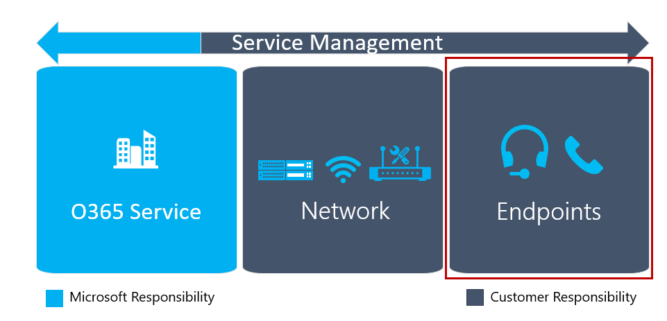

# ユーザーエクスペリエンスを計画する

この記事では、ユーザーエクスペリエンスに直接影響するクラウド音声サービスの展開の要素を正しく識別するための要件の概要を示します。 展開前にこれらの項目を準備することで、ユーザーに対して品質の高い信頼性の高いエクスペリエンスを正常に実現できる可能性が高くなります。 

## クライアントの展開

Microsoft Teams には、web、デスクトップ (Windows と Mac)、モバイル (Android および iOS) で使用できるクライアントがあります。 デスクトップ (Windows と Mac) とモバイルクライアントのインストール方法の詳細については、「 [Microsoft Teams のクライアントを取得](https://docs.microsoft.com/microsoftteams/get-clients)する」を参照してください。

## クライアントの更新

Teams の主な利点の1つは、クライアントが自動的に最新の状態に保たれることです。 PC と Mac 上のクライアントは、アプリがアイドル状態のときに新しいビルドがあるかを確認したり、新しいクライアントをダウンロードしたりする、バックグラウンド プロセスを使用して更新されます。

<!--ENDOFSECTION-->

## エンドポイント品質の計画

以下の図に示すように、エンドポイントはユーザー向けの品質向上のための重要な文書パーツです。

Teams のエンドポイントは、Pc、Mac、タブレット、モバイルデバイスなど、さまざまなデバイスで実行できます。 エクスペリエンスの一部では、デバイスだけでなく、デバイスの内蔵マイク/スピーカー、earbuds、最適化されたヘッドセットの使用など、ユーザーがデバイスに接続する方法についても説明します。 最適化されたヘッドセットを使用すると、全体的なユーザー エクスペリエンスが向上します。

エンドポイントの計画についての次のガイダンスは、自分の組織が正常に Teams を使い始められるようになるために役立つ情報を提供します。

## エンドポイントの機能

計画の最初の部分では、組織内のすべての Pc とその他のデバイスで Teams を実行できるようにすることをお勧めします。 これには、単にハードウェア要件を確認するだけではなく、PC がバックグラウンドで他に何を実行しているかを理解することも含まれます。 多くの組織は、侵入検出システムやマルウェア対策ソフトウェアなどの、デバイスの基本パフォーマンスに影響する可能性がある、他のソフトウェアを実行しています。

各プラットフォーム (web、デスクトップ、およびモバイル) 上の Teams クライアントのソフトウェア要件の詳細については、「 [Microsoft Teams のクライアントを取得する](https://docs.microsoft.com/microsoftteams/get-clients)」を参照してください。

## エンドポイントのファイアウォール

クライアント側のファイアウォールはユーザー エクスペリエンスに大きな影響をおよぼす可能性があります。
クライアント側のファイアウォールは、通話が確立されないようにするだけではなく、通話品質に影響する可能性があります。 「[Office 365 URL および IP アドレス範囲](https://aka.ms/o365ips)」の情報に基づいて、クライアントのファイアウォールでの例外を適切に構成します。 ご利用のサードパーティ ベンダーには、例外の作成方法についての固有のガイダンスがあります。

>[!NOTE]
> Microsoft Teams は、適切なファイアウォール構成で自動的に Windows ファイアウォールを更新します。

## エンドポイント向けの Wi-Fi の推奨事項

Microsoft Teams でリアルタイムのワークロードをサポートするために、最適な Wi-fi ネットワークを展開するための計画が大幅に必要になります。 次のセクションでは、エンドポイントを計画するときの一般的な落とし穴を回避するための一般的なガイダンスを示します。

### Wi-Fi ドライバー

一部の Wi-fi ドライバーで問題が発生する可能性があります。 たとえば、ドライバーによりアクセス ポイント間で非常に積極的なローミング動作が行われる場合があり、その結果として通話品質が下がります。
これは一般的な現象ではありませんが、展開前に PC の Wi-fi ドライバーが更新され、テストされていることを確認することが重要です。

### Wi-Fi バンド

現在の Wi-Fi 機器では、2.4 GHz と 5.0 GHz という 2 つの主な種類のバンドが使用されています。 自分の組織が両方のバンドを提供している場合、ドライバーの設定を、5.0 GHz バンドを優先するように構成する必要があります。 このバンドでは、スループットの点で密度がより高く、2.4 GHz バンドで生じる干渉による影響がより少なくなります。
この推奨事項は、5.0 GHz のネットワーク バンドを正しく最適化したことを想定しています。

### Wi-Fi 無線タイプ

新しい Wi-Fi 無線タイプをサポートするデバイス向けの計画です。 プロビジョニングしたデバイス上で 802.11ac またはより新しいタイプを利用すると、優れた Wi-Fi パフォーマンスを得ることができます。

### ワイヤレス回避

組織によっては、Wi-Fi を完全に回避することを希望します。 このガイダンスは、有線ネットワークに直接接続するユーザーに対する推奨事項として提供されることがあります。 場合によっては、PC が優先接続に接続されていても、ネットワークのバインド順でワイヤレス接続が優先されているため、その無線接続を継続して使用することがあります。 このような意図しない動作を回避するには、このシナリオを回避するようにバインド順を構成します。

### 802.11 Power Save protocol

組織で、802.11 Power Save プロトコルをサポートしていないワイヤレスアクセスポイントまたはルーターを使用している場合は、Windows デバイスで実行されている Microsoft Teams での通話の中断または通話品質の低下が発生する可能性があります。 ワイヤレス アクセス ポイントまたはルーターをアップグレードすることができない場合は、バッテリで動作しているデバイスで Windows 電源プラン設定を更新する必要があります。 より詳細な情報と、構成についてのガイダンスは次の[サポート記事](https://support.microsoft.com/help/928152/you-may-experience-connectivity-issues-or-performance-issues-when-you)で提供されています。

<table>
<tr><td>  判断のポイント</td><td><ul><li>組織に展開するチームクライアントは何ですか?</li><li>チームクライアントを最初にユーザーに展開するにはどうすればよいですか?</li><li>エンドポイントとデバイスを評価して品質向上のためにチームの要件を満たしているかどうかを検証する担当者</li></ul></td></tr>
<tr><td> 次のステップ</td><td><ul><li>チームクライアントを展開するために実行されるプロセスを文書化します。</li><li>エンドポイントとデバイスを評価し、必要な操作や修復を行います。</li></ul></td></tr>
</table>

<!--ENDOFSECTION-->

## Teams 用のデバイス

Microsoft Teams は会議のために、または電話システムとして使用することができます。 これらの機能を使用するとき、Teams のために使用されるインターフェイス デバイスは、ユーザー エクスペリエンスにおいて重要な役割を果たします。

内蔵の PC スピーカーとマイクを使用する構成で、ユーザーが許容できる音質が得られる場合があります。 ただし、通常、これらのデバイスはノイズキャンセル用に最適化されていないため、どのような種類の周囲の雑音にも、通話の他のユーザーへの下流の影響を与えることができます。 このようなシナリオに最適化されたデバイスを利用すると、高品質のエクスぺリエンスを確保することができるようになります。

各デバイスが、自分のユーザーのニーズに合う必要があります。 ヘッドセットなどのデバイスを組織内のそれぞれの人やユース ケースに合わせて調整する必要があります。
人からデバイスへのマッピングの実施を、計画プロセスの一部として完了している必要があります。

デバイスを選択したら、それらを最終検証のパイロット テスト計画に含めます。 パイロット中にアンケートを活用して、デバイス戦略が適正であることを確認するために、フィードバックを収集します。

> [!NOTE]
> 現時点では、Skype for Business の認証プログラムを通して認証されたオーディオ デバイスを使用することをお勧めします。 このプログラムで認定されているデバイスを見つけるには、「 [Skype For business solutions カタログ用に認定](http://partnersolutions.skypeforbusiness.com/solutionscatalog/personal-peripherals-pcs)されている USB デバイス」を参照してください。

<table>
<tr><td>  判断のポイント</td><td><ul><li>ユーザーと会議室のエクスペリエンスについて、組織の全体的なデバイス戦略を決定します。</li></ul></td></tr>
<tr><td> 次のステップ</td><td><ul><li>組織に対して、ペルソナ間のマッピングの演習を実行します。</li><li>ユーザーと会議室のデバイスを取得するプロセスを文書化します。</li><li>ユーザーと会議室用にデバイスを展開し、構成するためのプロセスについて文書化します。</li><li>展開を開始するために、初期デバイスを調達します。</li></ul></td></tr>
</table>

<!--ENDOFSECTION-->