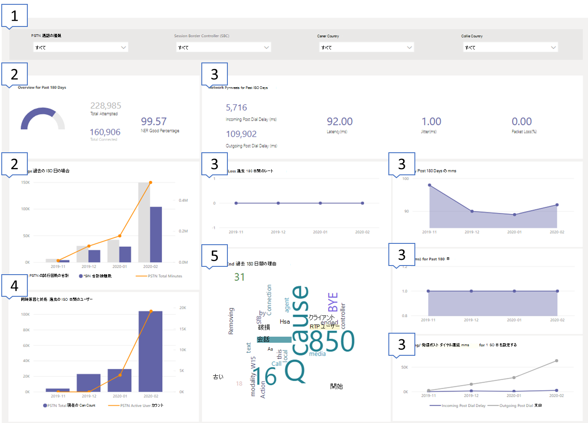
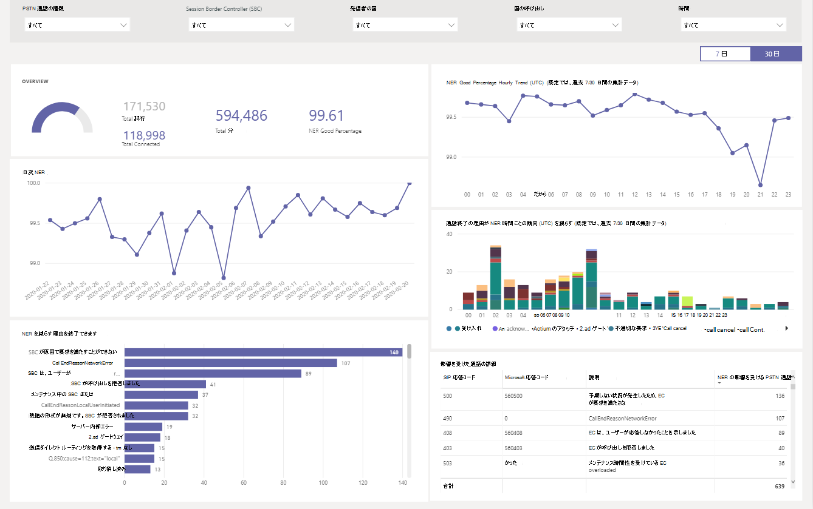
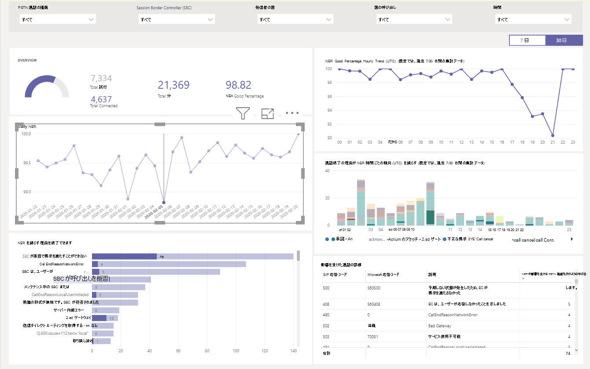
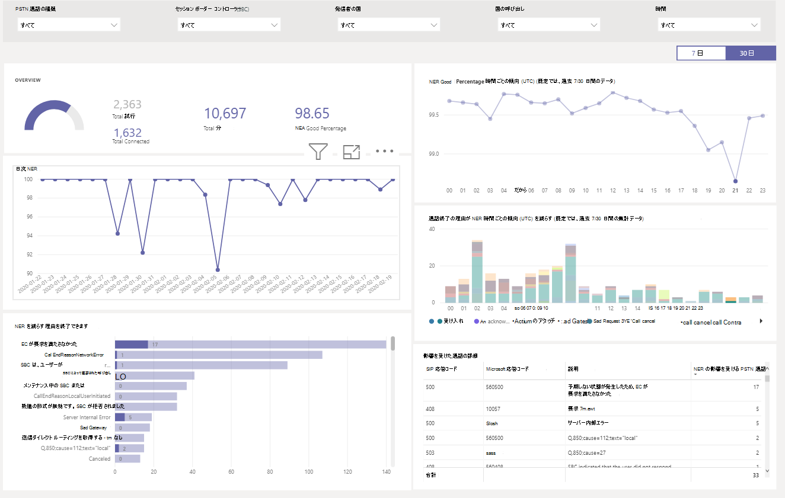
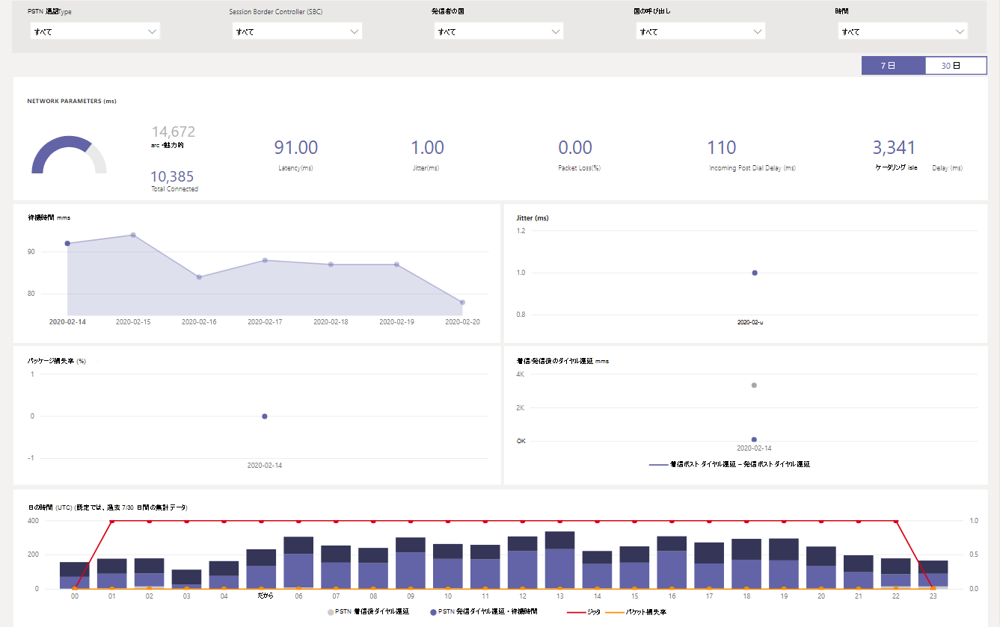

# CQD PSTN ダイレクトルーティングレポートを使用するUsing the CQD PSTN Direct Routing report

2020年3月の新機能として、Microsoft Teams の通話品質ダッシュボード (CQD) PSTN ダイレクトルーティングレポートが、 [CQD 用のダウンロード可能な POWER BI クエリテンプレート](https://github.com/MicrosoftDocs/OfficeDocs-SkypeForBusiness/blob/live/Teams/downloads/CQD-Power-BI-query-templates.zip?raw=true)に追加されました。New in March 2020, we've added a Microsoft Teams Call Quality Dashboard (CQD) PSTN Direct Routing report to our downloadable [Power BI query templates for CQD](https://github.com/MicrosoftDocs/OfficeDocs-SkypeForBusiness/blob/live/Teams/downloads/CQD-Power-BI-query-templates.zip?raw=true). 

CQD PSTN ダイレクトルーティングレポート (CQD PSTN Direct Routing Report) は、PSTN サービスの使用パターンと品質を理解するのに役立ちます。The CQD PSTN Direct Routing report (CQD PSTN Direct Routing Report.pbit) helps you understand the usage patterns and quality of your PSTN services. このレポートを使用して、サービスの利用状況、セッション境界コントローラー (SBC) に関する情報、テレフォニーサービス、ネットワークパラメーター、およびネットワークの有効性の詳細を監視します。Use this report to monitor service usage, information about your Session Border Controller (SBC), the telephony service, network parameters, and Network Effectiveness Ratio details. この情報は、通話の中断の理由など、問題を特定するのに役立ちます。This information can help you identify issues, including the reason for dropped calls. たとえば、ボリュームが減少したときや、影響を受ける通話回数、および理由を確認できます。For example, you'll be able to see when volume drops, or how many calls get affected and for what reason.

CQD PSTN のダイレクトルーティングレポートには、次の4つのセクションがあります。The CQD PSTN Direct Routing Report has four sections:

  - [PSTN の概要PSTN Overview](#pstn-overview)

  - [サービスの詳細Service Details](#service-details)

  - [ネットワークの有効性比Network Effectiveness Ratio](#network-effectiveness-ratio)

  - [ネットワークパラメーターNetwork Parameters](#network-parameters)

## 示しHighlights

1. 通話の種類、SBC、発信者、呼び出し元の国による分析Analyze by call type, SBC, caller and callee country

   CQD PSTN ダイレクトルーティングレポートは、テナント上のすべての SBCs の信頼性と使用量のメトリックを、過去7、30、または180日間 (6 ヶ月) で集積します。The CQD PSTN Direct Routing report aggregates reliability and usage metrics for all SBCs on your tenant for the last 7, 30, or 180 days (6 months). 通話の種類、SBC、発信者、呼び出し元の国によってデータを分析することができます。You can analyze data by call type, SBC, caller and callee country. 特定の SBC または国に興味をお持ちの場合は、選択した期間のトレンドの変化を特定することができます。If you're interested in a particular SBC or country, you'll be able to identify changes in trends over the selected time range.
   :::image type="content" source="media/CQD-PSTN-report8.png" alt-text="CQD PSTN ダイレクトルーティングレポートで利用可能なフィルターのスクリーンショット":::
   
2. 傾向を追跡するTrack trends

    サービスの使用状況と信頼性について理解するには、トレンド分析が不可欠です。Trends analysis is essential when trying to understand service usage and reliability. 時間の傾向は、毎日のパフォーマンスを把握して、リアルタイムのインシデントを識別するのに役立ちます。Hourly trends provide a close look at daily performance, which helps identify real-time incidents. 日単位の傾向では、サービスの正常性を長期的な観点から見ることができます。Daily trends let you see your service health from a long-term perspective. 適切なデータ粒度でこれらの2つのモード間でシフトできることが重要です。It's important to be able to shift between those two modes with appropriate data granularity. CQD PSTN ダイレクトルーティングレポートには、6か月のトレンドの概要、7日と30日間の毎日の傾向、および時間の傾向が表示され、各レベルでパフォーマンスを分析できます。The CQD PSTN Direct Routing report provides 6-month trends overview, 7- and 30-day daily trends, and hourly trends so you can analyze performance at each level.
    :::image type="content" source="media/CQD-PSTN-report9.png" alt-text="CQD PSTN ダイレクトルーティングレポートの傾向グラフのスクリーンショット":::

3. SBC またはユーザーレベルへのドリルスルーDrill through to SBC or user level

   CQD のさまざまなデータカテゴリについて、ドリルスルー機能で作成されています。これにより、SBC または user レベルでの使用法や信頼性の分布をすばやく理解することができます。We've been building in drill-through capability on many data categories in CQD, which lets you quickly understand usage or reliability distribution at the SBC or user level. ドリルスルーを使用することで、ポイントの問題を迅速に解決し、実際のユーザーへの影響を理解することができます。By using drill through, you can quickly poinpoint issues and understand real user impact. CQD PSTN のダイレクトルーティングレポート機能は、サービスの詳細とネットワークの有効性の評価指標について詳しく説明しています。The CQD PSTN Direct Routing report features drill through on the Service Detail and Network Effectiveness Ratio metrics. SBC またはユーザーレベルの詳細を表示するには、目的のデータポイントをクリックします。Click the data point you're interested in to drill through to SBC- or user-level details.
   :::image type="content" source="media/CQD-PSTN-report10.png" alt-text="データポイントのドリルスルー機能を示すスクリーンショット":::

## PSTN の概要PSTN Overview

CQD PSTN ダイレクトルーティングレポートでは、過去180日間のサービスの全体的な正常性に関する次の情報が提供されます。The CQD PSTN Direct Routing Report provides the following information related to overall health of the service for the past 180 days.

たとえば、米国の国内では、すべての着信通話に関する全体的な使用状況と正常性については、次のようになります。For example, if you are interested in the overall usage and health about all inbound calls going through SBC abc.bca.adatum.biz with US as the internal country:

| **発信****Call Out** | **説明****Description**                                                                                                                                                 |
| ------------ | --------------------------------------------------------------------------------------------------------------------------------------------------------------- |
| 11            | 一番上にあるフィルターを使用してドリルダウンし、[通話の種類] として [abc.bca.contoso.com]、[Session Boarder Controller として送信]、[国内] の順に選択することができます。You can use the filters at the top to drill down and select ByotIn as call type, abc.bca.contoso.com as Session Boarder Controller, and US as internal country. |
| 22            | 過去180日間の使用状況の傾向。Usage trend for the past 180 days. 利用状況の詳細レポートは、サービスの詳細ページで確認できます。You can find usage detail report on Service Detail page.                                                                     |
| 33            | 過去180日間のダイヤル後の遅延、待ち時間、ジッタ、パケット損失の傾向。Post Dial Delay, Latency, Jitter, and Packet Loss trend for the past 180 days. [ネットワークパラメーター] ページで詳細レポートを見つけることができます。You can find detail report on Network Parameters page.                           |
| 44            | 過去180日間の同時呼び出しと1日のアクティブなユーザーの傾向。Concurrent Call and Daily Active User trend for the past 180 days. このグラフは、サービスの最大音量を理解するのに役立ちます。This chart can help you understand the max volume of the service.                            |
| 55            | 上位の通話終了理由過去180日間のサービス品質に影響します。Top Call End Reason affected service quality for the past 180 days. サービスの正常性の詳細については、「ネットワークの有効比率 (説明)」ページをご覧ください。You can find service health detail on Network Effective Ratio(NER) page.                    |

## サービスの詳細Service Details

このページには、1日あたりのサービス利用傾向と、地理的なユーザーフィードバックの内訳が表示されます。This page provides service usage trends per day and user feedback breakdown by geographic.

  - **試行回数の合計:** 成功した通話と失敗した通話の両方を含む、その時間範囲内での通話の合計試行回数**Total Attempt Calls –** Total attempt calls in that time range, including both success and failed calls

  - **接続された合計通話-** その時間範囲内の接続されている合計通話数**Total Connected Calls -** Total connected calls in that time range

  - **合計分数–** その時間範囲の合計使用時間 (分)**Total Minutes –** Total minute usage in that time range

  - **日常的なアクティブユーザー (DAU) –** その日に少なくとも1つ接続されたアクティブなユーザーの数**Daily Active Users(DAU) –** Count of daily active user who made at least one connected call in that day

  - **同時通話–** 1分あたりの同時アクティブ通話の最大数**Concurrent Calls –** Max of simultaneous active calls in a minute

  - **ユーザのフィードバック–**「通話料金の評価」スコアは、ユーザーによって取得されます。**User Feedback –** "Rate My Call" score comes from the user. 3-5 は、適切な通話と見なされます。3-5 is considered as a good call. 1-2 は、不正な通話と見なされます。1-2 is considered as a bad call.

次に例を示します。For example:

1.  02/14/2020 で平均通話時間が0になる場合は、まず通話音量が正常であるかどうかを確認し、接続の合計数と試行回数の差が大きいかどうかを確認できます。If you see average call duration drops to 0 at 02/14/2020, you can first check if the call volume looks normal and see if there is a big discrepancy between total connect calls and total attempt calls. 次に、[ネットワークの有効性の比率] ページに移動して、通話の失敗の理由についてご購入ください。Then go to Network Effectiveness Ratio page to invest on call failure reasons.

2.  ユーザーフィードバックマップで赤いスポットが増加している場合は、[ネットワークの実効性比] ページと [ネットワークパラメーター] に移動して、異常があるかどうかを確認し、MS サービスデスクを使ってチケットを生成できます。If you see increasing red spots on the user feedback map, you could go to Network Effectiveness Ratio page and Network Parameter to see if there are any anomalies and you could raise a ticket using MS Service Desk.

## ネットワークの有効性比Network Effectiveness Ratio

これは、全体的な正常性ダッシュボードに表示されるメトリックと同じです。This is the same metric that appears on the Overall Health dashboard. 時間あたりのネットワークの効率性比と、次に示す通話の終了理由グラフの両方について、通話の方向 (受信/送信) の両方について、影響を受ける通話の詳細を確認できます。You can check hourly NER number with affected calls detail for both call directions (inbound/outbound) on the Hourly network effectiveness ratio and call ending reason chart below.

  - **NER**この機能 (%)通話の発信回数と受信者に送信された通話の数を測定して、通話を発信するネットワークのこと。**NER** - The ability (%) of a network to deliver calls by measuring the number of calls sent versus the number of calls delivered to a recipient.

  - **SIP 応答コード**-3 桁の整数応答コードによって通話状態が示されます。**SIP response code**- A three-digit integer response code shows the call status.

  - **Microsoft 応答コード**-microsoft コンポーネントから送信される応答コード。**Microsoft response code**-A response code sent out from Microsoft component.

  - **説明**– SIP 応答コードと Microsoft の応答コードに対応する理由フェーズ。**Description** – The reason phase that corresponding to the SIP response code and Microsoft response code.

  - **影響を受ける通話の数**–選択した期間中に影響を受けた通話の合計数。**Number of calls affected** – The total number of calls got affected during the selected time range.

> 
> 
次に例を示します。For example:

Daily の場合、02/05/2020 で dip を利用している場合は、日付をクリックすると、その日付に合わせて拡大/縮小することができます。If Daily NER has a dip on 02/05/2020, you can click on the date and other charts will zoom to that specific date.

達成率の1時間の傾向から、21:00 の周りで dip が発生していることがわかります。From the NER Good Percentage Hourly Trend, you can find the dip happens around 21:00. もう一度クリックすると、時間21にズームし、影響を受ける通話の詳細を確認して、その時間内に失敗した通話の数と通話の終了理由を確認します。Then click again to zoom to hour 21 and check Effected Call Details to see how many calls failed in that hour and what are the call end reasons. 問題が SBC に関連していない場合は、SBC の問題が発生した場合、またはサービスデスクに報告する場合は、自己トラブルシューティングを始めることができます。You can start with self-trouble shooting on any SBC problems or report to Service Desk if the problem is not related to SBC.

## ネットワークパラメーターNetwork Parameters

すべてのネットワークパラメーターは、ダイレクトルーティングインターフェイスからセッションの境界コントローラーまで計測されます。All network parameters are measured from the Direct Routing interface to the Session Border Controller. 推奨値の詳細については、「 [Microsoft Teams 用に組織のネットワークを準備](prepare-network.md)する」を参照してください。顧客の Edge を microsoft Edge で推奨される値について確認します。For information about the recommended values, see [Prepare your organization's network for Microsoft Teams](prepare-network.md), and look at the Customer Edge to Microsoft Edge recommended values.

  - **ジッター** – RTCP (RTP 制御プロトコル) を使って2つのエンドポイントの間で計算されたネットワーク伝達遅延時間の単位 (ミリ秒) です。**Jitter** – Is the millisecond measure of variation in network propagation delay time computed between two endpoints using RTCP (The RTP Control Protocol).

  - **パケット損失**–到着に失敗したパケットの測定。これは、2つのエンドポイントの間で計算されます。**Packet Loss** – Is a measure of packet that failed to arrive; it is computed between two endpoints.

  - **待ち時間**-(ラウンドトリップ時間とも呼ばれます) は、シグナルが送信されるまでにかかる時間と、そのシグナルの受信確認にかかる時間の長さです。**Latency** - (Also known as round trip time) is the length of time it takes for a signal to be sent plus the length of time it takes for the acknowledgment of that signal to be received. この時間遅延は、シグナルの2つのポイント間の伝播時間で構成されます。This time delay consists of the propagation times between the two points of a signal.

> 

次に例を示します。For example:

4つのグラフ (待機時間、ジッター、パッケージ損失率、事後ダイヤル遅延) のいずれかに、特定の日付 (たとえば、02/14/2020 の待機時間) が表示されている場合は、その日付ポイントをクリックします。If you see a spike on any of the four charts (Latency, Jitter, Package Loss Rate, Post Dial Delay) for a specific date, for example, Latency on 02/14/2020, click on the date point. また、下の時間単位の傾向グラフが更新されて、時間単位の数値が表示されます。And the hourly trend chart at the bottom will refresh to show the hourly number. MS Service Desk で、SBCs を確認したり、チケットを生成したりできます。You can check the SBCs or raise a ticket with MS Service Desk.

## 関連項目Related topics

[Power BI を使用して Microsoft Teams の CQD データを分析するUse Power BI to analyze CQD data for Microsoft Teams](CQD-PSTN-report.md)

[チームのトラブルシューティングTeams Troubleshooting](https://docs.microsoft.com/MicrosoftTeams/troubleshoot/teams)