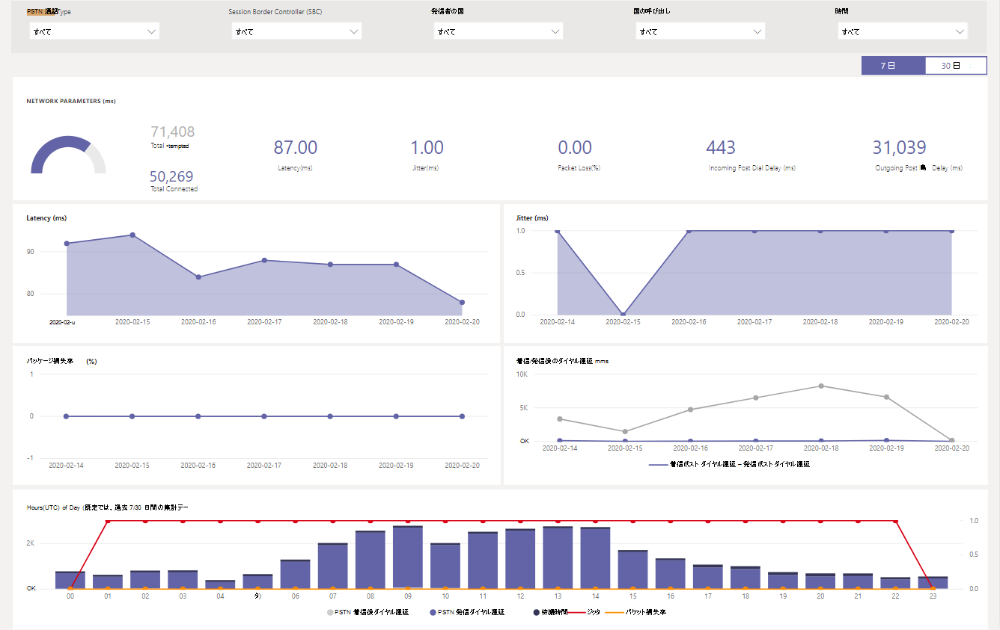

# CQD PSTN ダイレクトルーティングレポートを使用するUsing the CQD PSTN Direct Routing Report

2020年3月に初めて、CQD PSTN ダイレクトルーティングレポートを、 [CQD 用のダウンロード可能な POWER BI クエリテンプレート](https://github.com/MicrosoftDocs/OfficeDocs-SkypeForBusiness/blob/live/Teams/downloads/CQD-Power-BI-query-templates.zip?raw=true)に追加しました。New in March 2020, we've added a CQD PSTN Direct Routing Report to our downloadable [Power BI query templates for CQD](https://github.com/MicrosoftDocs/OfficeDocs-SkypeForBusiness/blob/live/Teams/downloads/CQD-Power-BI-query-templates.zip?raw=true). 

CQD PSTN ダイレクトルーティングレポートを使用すると、お客様は、お客様の SBC、テレフォニーサービス、ネットワークパラメーター、およびネットワークの有効性比の詳細と使用状況について、PSTN サービスの使用パターンと音質を把握することができます。サービス.The CQD PSTN Direct Routing Report helps customers to understand the usage patterns and quality of their PSTN services monitor information about your SBC, the telephony service, the network parameters, and Network Effectiveness Ratio details and usage of the service. この情報は、通話の中断の理由など、問題を特定するのに役立ちます。This information can help you identify issues, including the reason for dropped calls. たとえば、ボリュームが減少したときに、どのような理由で影響を受ける通話数がわかります。For example, you will be able to know when volume drops, how many calls get affected by what reason.

CQD PSTN のダイレクトルーティングレポートには、次の4つのセクションがあります。The CQD PSTN Direct Routing Report has four sections:

  - [PSTN の概要PSTN Overview](#pstn-overview)

  - [サービスの詳細Service Details](#service-details)

  - [ネットワークの有効性比Network Effectiveness Ratio](#network-effectiveness-ratio)

  - [ネットワークパラメーターNetwork Parameters](#network-parameters)

## PSTN の概要PSTN Overview

CQD PSTN ダイレクトルーティングレポートでは、過去180日間のサービスの全体的な正常性に関する次の情報が提供されます。The CQD PSTN Direct Routing Report provides the following information related to overall health of the service for the past 180 days.

たとえば、米国の国内では、すべての着信通話に関する全体的な使用状況と正常性については、次のようになります。For example, if you are interested in the overall usage and health about all inbound calls going through SBC abc.bca.adatum.biz with US as the internal country:

| **発信****Call Out** | **説明****Description**                                                                                                                                                 |
| ------------ | --------------------------------------------------------------------------------------------------------------------------------------------------------------- |
| 11            | 一番上にあるフィルターを使用してドリルダウンし、[通話の種類] として [abc.bca.contoso.com]、[Session Boarder Controller として送信]、[国内] の順に選択することができます。You can use the filters at the top to drill down and select ByotIn as call type, abc.bca.contoso.com as Session Boarder Controller, and US as internal country. |
| 両面2            | 過去180日間の使用状況の傾向。Usage trend for the past 180 days. 利用状況の詳細レポートは、サービスの詳細ページで確認できます。You can find usage detail report on Service Detail page.                                                                     |
| 33            | 過去180日間のダイヤル後の遅延、待ち時間、ジッタ、パケット損失の傾向。Post Dial Delay, Latency, Jitter, and Packet Loss trend for the past 180 days. [ネットワークパラメーター] ページで詳細レポートを見つけることができます。You can find detail report on Network Parameters page.                           |
| 44            | 過去180日間の同時呼び出しと1日のアクティブなユーザーの傾向。Concurrent Call and Daily Active User trend for the past 180 days. このグラフは、サービスの最大音量を理解するのに役立ちます。This chart can help you understand the max volume of the service.                            |
| 55            | 上位の通話終了理由過去180日間のサービス品質に影響します。Top Call End Reason affected service quality for the past 180 days. サービスの正常性の詳細については、「ネットワークの有効比率 (説明)」ページをご覧ください。You can find service health detail on Network Effective Ratio(NER) page.                    |

## サービスの詳細Service Details

このページには、1日あたりのサービス利用傾向と、地理的なユーザーフィードバックの内訳が表示されます。This page provides service usage trends per day and user feedback breakdown by geographic.

  - **試行回数の合計:** 成功した通話と失敗した通話の両方を含む、その時間範囲内での通話の合計試行回数**Total Attempt Calls –** Total attempt calls in that time range, including both success and failed calls

  - **接続された合計通話-** その時間範囲内の接続されている合計通話数**Total Connected Calls -** Total connected calls in that time range

  - **合計分数–** その時間範囲の合計使用時間 (分)**Total Minutes –** Total minute usage in that time range

  - **日常的なアクティブユーザー (DAU) –** その日に少なくとも1つ接続されたアクティブなユーザーの数**Daily Active Users(DAU) –** Count of daily active user who made at least one connected call in that day

  - **同時通話–** 1分あたりの同時アクティブ通話の最大数**Concurrent Calls –** Max of simultaneous active calls in a minute

  - **ユーザのフィードバック–**「通話料金の評価」スコアは、ユーザーによって取得されます。**User Feedback –** "Rate My Call" score comes from the user. 3-5 は、適切な通話と見なされます。3-5 is considered as a good call. 1-2 は、不正な通話と見なされます。1-2 is considered as a bad call.

次に例を示します。For example:

1.  02/14/2020 で平均通話時間が0になる場合は、まず通話音量が正常であるかどうかを確認し、接続の合計数と試行回数の差が大きいかどうかを確認できます。If you see average call duration drops to 0 at 02/14/2020, you can first check if the call volume looks normal and see if there is a big discrepancy between total connect calls and total attempt calls. 次に、[ネットワークの有効性の比率] ページに移動して、通話の失敗の理由についてご購入ください。Then go to Network Effectiveness Ratio page to invest on call failure reasons.

2.  ユーザーフィードバックマップで赤いスポットが増加している場合は、[ネットワークの実効性比] ページと [ネットワークパラメーター] に移動して、異常があるかどうかを確認し、MS サービスデスクを使ってチケットを生成できます。If you see increasing red spots on the user feedback map, you could go to Network Effectiveness Ratio page and Network Parameter to see if there are any anomalies and you could raise a ticket using MS Service Desk.

## ネットワークの有効性比Network Effectiveness Ratio

これは、全体的な正常性ダッシュボードに表示されるメトリックと同じです。This is the same metric that appears on the Overall Health dashboard. 時間あたりのネットワークの効率性比と、次に示す通話の終了理由グラフの両方について、通話の方向 (受信/送信) の両方について、影響を受ける通話の詳細を確認できます。You can check hourly NER number with affected calls detail for both call directions (inbound/outbound) on the Hourly network effectiveness ratio and call ending reason chart below.

  - \*\*\*\* この機能 (%)通話の発信回数と受信者に送信された通話の数を測定して、通話を発信するネットワークのこと。**NER** - The ability (%) of a network to deliver calls by measuring the number of calls sent versus the number of calls delivered to a recipient.

  - **SIP 応答コード**-3 桁の整数応答コードによって通話状態が示されます。**SIP response code**- A three-digit integer response code shows the call status.

  - **Microsoft 応答コード**-microsoft コンポーネントから送信される応答コード。**Microsoft response code**-A response code sent out from Microsoft component.

  - **説明**– SIP 応答コードと Microsoft の応答コードに対応する理由フェーズ。**Description** – The reason phase that corresponding to the SIP response code and Microsoft response code.

  - **影響を受ける通話の数**–選択した期間中に影響を受けた通話の合計数。**Number of calls affected** – The total number of calls got affected during the selected time range.

> 
> 
次に例を示します。For example:

Daily の場合、02/05/2020 で dip を利用している場合は、日付をクリックすると、その日付に合わせて拡大/縮小することができます。If Daily NER has a dip on 02/05/2020, you can click on the date and other charts will zoom to that specific date.

達成率の1時間の傾向から、21:00 の周りで dip が発生していることがわかります。From the NER Good Percentage Hourly Trend, you can find the dip happens around 21:00. もう一度クリックすると、時間21にズームし、影響を受ける通話の詳細を確認して、その時間内に失敗した通話の数と通話の終了理由を確認します。Then click again to zoom to hour 21 and check Effected Call Details to see how many calls failed in that hour and what are the call end reasons. 問題が SBC に関連していない場合は、SBC の問題が発生した場合、またはサービスデスクに報告する場合は、自己トラブルシューティングを始めることができます。You can start with self-trouble shooting on any SBC problems or report to Service Desk if the problem is not related to SBC.

## ネットワークパラメーターNetwork Parameters

すべてのネットワークパラメーターは、ダイレクトルーティングインターフェイスからセッションの境界コントローラーまで計測されます。All network parameters are measured from the Direct Routing interface to the Session Border Controller. 推奨値の詳細については、「 [Microsoft Teams 用に組織のネットワークを準備](prepare-network.md)する」を参照してください。顧客の Edge を microsoft Edge で推奨される値について確認します。For information about the recommended values, see [Prepare your organization's network for Microsoft Teams](prepare-network.md), and look at the Customer Edge to Microsoft Edge recommended values.

  - **ジッター** – RTCP (RTP 制御プロトコル) を使って2つのエンドポイントの間で計算されたネットワーク伝達遅延時間の単位 (ミリ秒) です。**Jitter** – Is the millisecond measure of variation in network propagation delay time computed between two endpoints using RTCP (The RTP Control Protocol).

  - **パケット損失**–到着に失敗したパケットの測定。これは、2つのエンドポイントの間で計算されます。**Packet Loss** – Is a measure of packet that failed to arrive; it is computed between two endpoints.

  - **待ち時間**-(ラウンドトリップ時間とも呼ばれます) は、シグナルが送信されるまでにかかる時間と、そのシグナルの受信確認にかかる時間の長さです。**Latency** - (Also known as round trip time) is the length of time it takes for a signal to be sent plus the length of time it takes for the acknowledgment of that signal to be received. この時間遅延は、シグナルの2つのポイント間の伝播時間で構成されます。This time delay consists of the propagation times between the two points of a signal.

> 

次に例を示します。For example:

4つのグラフ (待機時間、ジッター、パッケージ損失率、事後ダイヤル遅延) のいずれかに、特定の日付 (たとえば、02/14/2020 の待機時間) が表示されている場合は、その日付ポイントをクリックします。If you see a spike on any of the four charts (Latency, Jitter, Package Loss Rate, Post Dial Delay) for a specific date, for example, Latency on 02/14/2020, click on the date point. また、下の時間単位の傾向グラフが更新されて、時間単位の数値が表示されます。And the hourly trend chart at the bottom will refresh to show the hourly number. MS Service Desk で、SBCs を確認したり、チケットを生成したりできます。You can check the SBCs or raise a ticket with MS Service Desk.

## 関連項目Related topics

[Power BI を使用して Microsoft Teams の CQD データを分析するUse Power BI to analyze CQD data for Microsoft Teams](CQD-PSTN-report.md)