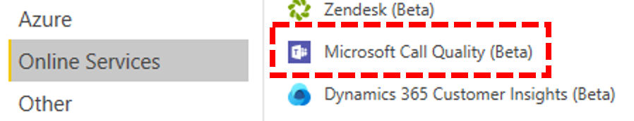

# CQD クエリテンプレートを使用するために Power BI コネクタをインストールする

CQD (.PBIX ファイル) 用の Power BI クエリテンプレートを使用するには、Microsoft CQD の Power BI Connector をインストールする必要があります。これには、[ダウンロード](https://github.com/MicrosoftDocs/OfficeDocs-SkypeForBusiness/blob/live/Teams/downloads/CQD-Power-BI-query-templates.zip?raw=true)に含まれている microsoft の power bi*のファイルを*使用します。 

これらのテンプレートについては、「 [POWER BI を使用してチームの CQD データを分析](CQD-Power-BI-query-templates.md)する」を参照してください。

## インストール

コネクタの使用を有効にするためのカスタムコネクタのインストールとセキュリティの調整のプロセスについては、「 [POWER BI ドキュメント](https://docs.microsoft.com/power-bi/desktop-connector-extensibility)」で詳しく説明します。 わかりやすくするために、簡単に説明します。

1.    * \[\]Power BI デスクトップ\\カスタムコネクタフォルダーがコンピューターに既に含まれているかどうかを確認し\\*ます。 見つからない場合は、このフォルダーを作成します。1

2.  コネクタファイル ( * \*mez*また* \*は pqx*ファイル) をダウンロードして、*カスタムコネクタ*ディレクトリに配置します。

3.  **コネクタファイルが* \*mez*ファイルの場合**は、[カスタムコネクタのセットアップのドキュメント](https://docs.microsoft.com/power-bi/desktop-connector-extensibility#data-extension-security)で説明されているように、セキュリティ設定を調整する必要もあります。

この Power BI Connector for Microsoft Teams の新しいバージョンがリリースされた場合は、*カスタムコネクタ*ディレクトリにある古いコネクタファイルを新しいファイルに置き換えるだけです。

## セットアップ

レポートを作成してクエリを実行するには、まず CQD データソースに接続する必要があります。 接続するには、次の手順を実行します。

1.  Power BI デスクトップの [ホーム] タブで、[*データの取り込み*] をクリックします。

    

2.  この時点で [*データの取得*] ウィンドウが表示されます。 [*オンラインサービス*] に移動し、[ *Microsoft 通話品質 (ベータ版)* ] を選択して、[*接続*] をクリックします。

    

3.  次のログイン画面が表示されます。 CQD に使用するのと同じ資格情報を使用します。2

4.  次のプロンプトは、2つの*データ接続モード*の間でオプションを提供します。 [ *DirectQuery* ] を選択して、 *[OK]* をクリックします。

5.  最後に、CQD のデータモデル全体を示す最後のプロンプトが表示されます。 この時点では、データは表示されません。 CQD のデータモデルだけです。 [*読み込み*] を選択して、セットアッププロセスを完了します。

6.  Power BI は、この時点で、データモデルをウィンドウの右側に読み込みます。 ページは空白のままになり、既定ではクエリは読み込まれません。 **以下のクエリを作成し**て、クエリを作成してデータを返す方法について説明します。

このセットアッププロセス中にいずれかの手順を実行しても問題が解決しない場合は、[ここ](https://docs.microsoft.com/power-bi/desktop-quickstart-connect-to-data)に記載されているプロセスの詳細な説明を参照してください。

## クエリを作成する

セットアップが完了すると、数百のディメンションとメジャーの名前が [*フィールド*] ウィンドウに表示されます。 実際のクエリをここで作成するのは簡単です。クエリに必要な寸法とメジャーを選んで、ページにドラッグアンドドロップするだけです。 次に、簡単な例を示した、より詳細な説明を示します。

1.  *視覚エフェクト*ウィンドウで、使用する視覚エフェクトを選択します。 その視覚エフェクトの空のバージョンがページに表示されます。 この例では、*テーブル*の視覚エフェクトを使用します。

    

2.  クエリに使用するディメンションとメジャー (名前で集計記号で示されます) を特定し、手動で選択して、黒い視覚エフェクトにドラッグします。 または、視覚エフェクトオプションの下にある [*値*] フィールドにドラッグします。

    

    > [!IMPORTANT] 
    > 通話品質ダッシュボードを使用するには、クエリを実行するためのメジャーが必要です。 クエリにメジャーを追加しないと、クエリが失敗します。

3.  次に、フィルターを適用する寸法を選択し、[*フィルター* ] ウィンドウの [*このビジュアルフィールドのフィルター* ] にドラッグします。 現在、CQD Power BI コネクタは、*基本的なフィルター*処理をサポートしています (可能なディメンション値の一覧から値を選択します)。*高度なフィルター*処理 (フィルター処理する値とオペランドを手動で指定する、詳細なフィルター処理を行う場合)、*相対日付フィルター処理*(*終了時刻*と*開始時刻*のディメンションでのみ使用可能)。 *上位 N*に基づくフィルター処理は、CQD ではサポートされていません。

    

4.  最後に、[*視覚エフェクト*] ウィンドウ内の [*書式*] タブを選択して、クエリのスタイルと書式設定を行います。

    > [!NOTE]
    > CQD クエリを実行するには、少なくとも1つのメジャーが必要です。 クエリが読み込まれない場合は、クエリにメジャーが含まれていることをもう一度確認します。

## ドリルスルーレポートの作成

[POWER BI のドリルスルーで](https://docs.microsoft.com/power-bi/desktop-drillthrough)は、他のレポートの値をコンテキストとしてすばやくフィルター処理できる優先レポートを作成できます。 CQD コネクタを使用して最初のクエリを作成する方法がわかったら、ドリルスルーの作成がさらに簡単になります。

1.  優先レポート用に別のページを作成し、そのページにクエリを追加します。

2.  ドリルスルーフィルターとして使用するディメンションを選択し、[*視覚エフェクト*] ウィンドウの下にある [*ドリルスルー* ] フィールドにドラッグします。

    

3.  **それです\!** そのディメンションを使用する他のページに対する他のクエリで、そのページにドリルスルーし、ドリルスルーディメンションの値をフィルターとして自動的に適用できるようになりました。

    

Advanced CQD とは異なり、Power BI は連続していないドリルスルーをサポートしています。 クエリに必要なディメンションが含まれていれば、他のページにドリルスルーできます。

### ベストプラクティス

通話品質コネクタクエリは、ドリルスルー機能を考慮して設計する必要があります。 すべてのデータを一度に読み込んでから、フィルターを使用して分割していく代わりに、大規模な小さい基数のクエリを使い始めて、長い基数のクエリにドリルダウンします。 たとえば、どのサブネットが最も品質の問題を発生させているかを診断する際には、まず問題の原因となる地域と国を特定し、その地域内のサブネットにドリルダウンすることをお勧めします。 通話品質コネクタのテンプレートは、例として機能するために、この方法で設計されています。

## 伴う

Power BI を使用しているにもかかわらず、Power BI 機能はすべて、CQD コネクタでサポートされているわけではありません。 CQD データモデルまたは DirectQuery コネクタの制限の結果としては、すべての Power BI 機能がサポートされています。 以下の一覧は、コネクタの注目すべき制限をいくつか示していますが、この一覧は、すべてを網羅と見なすことはできません。

1.  **集計列–** 一般的な DirectQuery コネクタは、Power BI での計算列のサポートが制限されています。 一部の集計列はコネクタで動作する可能性がありますが、例外と見なされる必要があります。 一般的な規則として、集計列は機能しません。

2.  **集計–** CQD データモデルはキューブモデルに基づいて構築されます。これは、メジャー形式で集計が既にサポートされていることを意味します。 異なる次元に集計を手動で追加しようとした場合、またはメジャーの集計の種類を変更しても、コネクタでは動作しません。通常はエラーになります。

3.  **カスタムビジュアル–** CQD Connector は、さまざまなカスタムビジュアルで動作しますが、すべてのカスタムビジュアルとの互換性を保証することはできません。 多くのカスタムビジュアルは、計算列またはインポートされたデータの使用に依存していますが、DirectQuery コネクタではサポートされません。

4.  **キャッシュデータの参照:** 現在、Power BI では、DirectQuery コネクタからのキャッシュされたデータの参照を任意の方法でサポートしていません。 クエリの結果を参照しようとすると、新しいクエリになります。 

5.  **相対データフィルター処理–** は、CQD コネクタでサポートされていますが、[*開始*時刻] と [*終了時刻*] のサイズに対してのみサポートされます。 *日付ディメンションは*、相対的な日付フィルター処理の候補として表示される場合もあり*ますが、日付は日付*時刻オブジェクトとして保存されないため、power BI での相対的な日付フィルター処理はサポートされません。

コネクタはプレビュー版ですが、これらの制限は、コネクタの最終リリースによって変更されることはありませんのでご注意ください。 これらの問題のほとんどは、Power BI での DirectQuery コネクタの設計への制限、または CQD データモデルの設計に対する基本事項です。

## トラブルシューティング

### Date 列を日付スライサーとして使用しようとしています。 この列のデータ型を Date に変換すると、次のエラーが表示されます。

> **このビジュアルのデータを読み込めませんでした**: OLE DB または ODBC エラー: [式. エラー] 式をデータソースに折りたたむことができませんでした。 もっと簡単な式をお試しください。 

Power BI コネクタでスライサーはサポートされません。 日付範囲を指定するには、次の2つのフィルターをレポートに適用します。指定した日付よりも小さい値と大きい値を指定します。

または、表示する日付が最新である場合は、相対的な日付フィルターを適用して、過去 N 日間/週/月のデータのみが表示されるようにします。

## エラーコード

CQD Power BI コネクタは、作成できるクエリの種類によってはブラウザーアプリより制限が少ないため、クエリの作成中にいくつかのエラーが発生する場合があります。 "CQDError" という種類のエラーメッセージが表示された場合。 RunQuery –クエリ実行エラー "で、クエリの可能性がある問題のトラブルシューティングのために提供されている ErrorType 番号を使用して、以下のリストを参照します。 CQD Power BI コネクタで発生する可能性のある最も一般的なエラーの種類コードを次に示します。

  - **ErrorType 1-クエリ構造エラー:** 通常、クエリ構造のエラーは、コネクタが適切に書式設定されたクエリを作成できない場合に発生します。 これは、上記の制限で指定されているように、サポートされていない機能を使用する場合によく発生します。 クエリで集計列やカスタムビジュアルを使用していないことを再確認します。

  - **ErrorType 2-クエリの作成エラー:** CQD Connector が、作成しようとしているクエリを適切に解析できないことが原因で、クエリの作成エラーが発生しています。 これは、上記の制限で指定されているように、サポートされていない機能を使用する場合によく発生します。 クエリで集計列やカスタムビジュアルを使用していないことを再確認します。

  - **ErrorType 5-実行タイムアウト:** タイムアウトする前に、クエリの実行可能時間の上限に達しました。スコープを制限するために、クエリにフィルターを追加してみてください。 データ範囲の絞り込みは、多くの場合、これを実現するための最も効果的な方法です。

  - **ErrorType 7-測定エラーはありません。** CQD クエリを機能させるには、メジャーが必要です。 クエリにメジャーが含まれていることをもう一度確認します。 CQD コネクタのメジャーは、名前の前に aggregation (sum) 記号で示されます。

この範囲外の追加のエラーが発生した場合は、CQD チームに通知して、問題のトラブルシューティングを行い、必要に応じてドキュメントを更新してください。

## 脚注

**1** 特定のプロセスとアプリ (OneDrive など) によって、ドキュメントのルートフォルダーが変更されることがあります。*POWER BI デスクトップ\\カスタムコネクタ*ディレクトリが、現在のルートフォルダーの [ドキュメント] フォルダー内に配置されていることを確認します。

**2** CQD で使用するログイン資格情報は、Power BI デスクトップアプリ自体へのログインに使用する資格情報と同じである必要はあり*ません*。

## よく寄せられる質問

### Power BI コネクタは、"ベータ" 状態から更新されますか?

ベータタグにもかかわらず、Power BI 用の通話品質コネクタは、リリース版のコネクタであり、Power BI teams によって正式なセキュリティが署名されており、これを反映しています。 このベータ版タグを削除する認定プロセスは広範囲であるため、Power BI チームからのコミットメントを得て、コネクタに直接サポートを提供する必要があります。 現時点では時間の制約があるため、Power BI チームは現在、そのサポートとより広範な認定を提供することはできませんが、Microsoft Call Quality コネクタのセキュリティ、完全性、および全般的な機能を証明するための準備は完了しています。

## 関連項目

[Power BI を使用して Teams の CQD データを分析する](CQD-Power-BI-query-templates.md)
