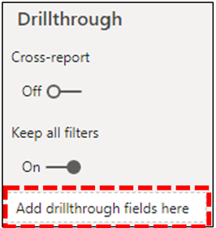
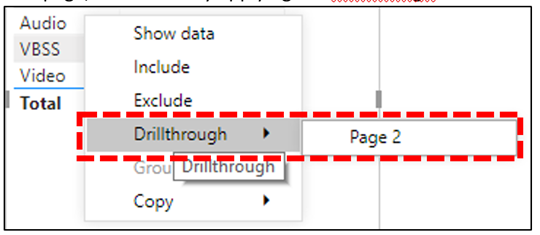

# Power BI Connector をインストールして CQD クエリ テンプレートを使用する

Microsoft Teams 通話品質ダッシュボード (CQD) 用の Power BI クエリ テンプレート (PBIX ファイル) を使用する前に、ダウンロードに含まれる *MicrosoftCallQuality.ppb* ファイルを使用して 、Microsoft CQD 用 Power BI Connector をインストールする必要があります。

これらの [テンプレートの詳細については、「Power BI を使用して Teams の CQD](CQD-Power-BI-query-templates.md) データを分析する」を参照してください。

Power BI レポートにアクセスするには [、適切な CQD](./turning-on-and-using-call-quality-dashboard.md#assign-admin-roles-for-access-to-cqd) アクセスロールを持っている必要があります。

> [!NOTE]
> CQD Power BI Connector は Power BI の DirectQuery のみをサポートします。インポート モードはサポートされていません。 

## インストール

カスタム コネクタをインストールし、コネクタの使用を有効にするようにセキュリティを調整するプロセスについては [、Power BI ドキュメントで詳しく説明します](/power-bi/desktop-connector-extensibility)。 わかりやすくするために、簡単な説明を次に示します。

1. コンピューターに既に *\[ Documents \] \\ Power BI Desktop \\ Custom Connectors フォルダーが存在していないか確認* します。 ない場合は、このフォルダーを作成します。1

2. コネクタ ファイル *\* (.mez* または *\* .pグループ* ファイル) をダウンロードし、カスタム コネクタ ディレクトリ *に配置* します。

3. **コネクタ ファイルが *\* .mez*** ファイルの場合は、カスタム コネクタセットアップ ドキュメントの説明に従ってセキュリティ設定 [を調整する必要があります](/power-bi/desktop-connector-extensibility#data-extension-security)。

この Power BI Connector for Microsoft Teams の新しいバージョンがリリースされた場合は *、Custom Connectors* ディレクトリの古いコネクタ ファイルを新しいファイルに置き換えるだけで済みです。

## セットアップ

レポートを作成してクエリを実行するには、まず CQD データ ソースに接続する必要があります。 接続するには、次の手順に従います。

1. Power BI Desktop の [ホーム] タブで、[データの取り込み] *をクリックします*。

    

2. この *時点で [* データの取り込み] ウィンドウが表示されます。 オンライン サービス *に移動し、Microsoft* 通話品質 *(ベータ)* を選択し、[接続] を *クリックします*。

    

3. 次にサインインするように求めるメッセージが表示されます。 CQD に使用する資格情報と同じ資格情報を使用します。2

4. 次のプロンプトでは、2 つのデータ接続モード *間のオプションが表示されます*。 DirectQuery *を選択し**、[OK] をクリックします*。

5. 最後に、CQD のデータ モデル全体を示す最終的なプロンプトが表示されます。 この時点ではデータは表示されません。CQD のデータ モデルのみ表示されます。 [読 *み込み]* を選び、セットアップ プロセスを完了します。

6. この時点で、Power BI はデータ モデルをウィンドウの右側に読み込む必要があります。 それ以外の場合、ページは空白のままで、既定ではクエリは読み込まれません。 クエリを **作成してデータを返** す場合は、以下のクエリの作成に進みます。

このセットアップ プロセス中の手順が完全にクリアされていない場合は、「クイック スタート: Power BI Desktop でデータに接続する」でプロセスの詳細な説明を [参照してください](/power-bi/desktop-quickstart-connect-to-data)。

## クエリの作成

セットアップが完了すると、[フィールド] ウィンドウに数百のディメンションとメジャーのロードの名前が *表示* されます。 ここで実際のクエリを作成する方法は簡単です。クエリに必要なディメンションとメジャーを選び、ページにドラッグ アンド ドロップします。 簡単な例を使用して、より詳細な説明を次に示します。

1. [視覚エフェクト] ウィンドウから、使用する *視覚エフェクトを選択* します。 空白バージョンの視覚エフェクトがページに表示されます。 この例では、テーブル視覚エフェクトを *使用* します。

    

2. クエリに使用するディメンションとメジャー (集計記号を名前で示す) を決定し、手動で選び、黒い視覚エフェクトにドラッグします。 または、視覚エフェクト オプションの下にある *[値* ] フィールドにドラッグします。

    

    > [!IMPORTANT]
    > 通話品質ダッシュボードでは、クエリを実行するためのメジャーが必要です。 クエリにメジャーを追加できなかった場合、クエリは失敗します。

3. 次に、フィルターを適用するディメンションを選択し、[フィルター]ウィンドウのこのビジュアル フィールドの [フィルター] に *ドラッグ* します。 現在、CQD Power BI Connector では、基本フィルター処理 (使用可能なディメンション値の一覧から値を選択する)、高度な *フィルター処理*(Advanced CQD と同様に、フィルター処理する値とオペランドを手動で指定)、および相対日付フィルター *(終了* 時刻と開始時刻のディメンションでのみ使用できます) がサポートされています。  上位 N 位に *従った* フィルター処理は、CQD ではサポートされていません。

    

4. 最後に、[視覚エフェクト] *ウィンドウの* [書式] タブを *選択して、* クエリのスタイルと書式を設定します。

    > [!NOTE]
    > CQD クエリを実行するには、少なくとも 1 つのメジャーが必要です。 クエリが読み込まれていない場合は、クエリにメジャーが含まれているか確認してください。

## ドリルスルー レポートを作成する

[Power BI のドリル](/power-bi/desktop-drillthrough) スルーを使用すると、他のレポートの値をコンテキストとして使用してすばやくフィルター処理できる、絞り込みレポートを作成できます。 CQD Connector を使用して最初のクエリを作成する方法を確認したら、ドリルスルーの作成はさらに簡単です。

1. フォーカスされたレポート用に別のページを作成し、そのページにクエリを追加します。

2. ドリルスルー フィルターとして使用するディメンションを選択し、[視覚エフェクト] ウィンドウの [ドリルスルー] フィールド *にドラッグ* します。

    

3. **それです\!** そのディメンションを使用する別のページのクエリで、そのページにドリルスルーが実行され、フィルターとしてドリルスルー ディメンションの値が自動的に適用されます。

    

Advanced CQD とは異なり、Power BI は非連続ドリルスルーをサポートします。 クエリに必要なディメンションが含まれる限り、他のページにドリルスルーできます。

### ベスト プラクティス

通話品質コネクタ クエリは、ドリルスルー機能を念頭に置いて設計する必要があります。 すべてのデータを一度に読み込み、フィルターでスライスダウンするのではなく、より広範な低カーディナリティ クエリから開始し、高カーディナリティ クエリにドリルダウンします。 たとえば、どのサブネットが品質の問題に最も寄与するかの診断を試みる場合、最初に問題の原因である地域と国を特定してから、その地域または国のサブネットにドリルダウンすると便利です。 通話品質コネクタ テンプレートは、例として機能するように設計されています。

## 制限事項

Power BI を使用しているにもかかわらず、CQD データ モデルまたは DirectQuery コネクタ全般に対する制限の結果として、すべての Power BI 機能が CQD Connector でサポートされるという保証はありません。 以下の一覧では、Connector の特に重要な制限事項の一部をメモしていますが、この一覧は完全には考慮する必要はありません。

1. **計算列 –** 一般的に、DirectQuery コネクタでは、Power BI の計算列のサポートが制限されています。 一部の計算列はコネクタで動作する場合は例外と見なす必要があります。 一般的に、集計列は機能しません。

2. **集計 –** CQD データ モデルはキューブ モデル上に構築されています。つまり、集計はメジャーの形式で既にサポートされています。 異なるディメンションに集計を手動で追加しようとしたり、メジャーの集計の種類を変更したりしようとすると、コネクタは動作しません。通常、エラーが発生します。

3. **カスタム ビジュアル –** CQD Connector はさまざまなカスタム ビジュアルで動作しますが、すべてのカスタム ビジュアルとの互換性を保証できません。 多くのカスタム ビジュアルは、計算列またはインポートされたデータの使用に依存します。どちらも、または DirectQuery コネクタでサポートされていません。

4. **キャッシュ データの参照 –** 現在、Power BI では、DirectQuery コネクタからキャッシュされたデータを参照する方法はサポートされていません。 クエリの結果を参照しようとすると、新しいクエリが作成されます。

5. **相対データ フィルタリング –** CQD コネクタではサポートされますが、開始時刻と終了時刻のディメンション *でのみサポート* されます。 日付ディメンション *は* 、相対的な日付のフィルター処理に対して明らかに選択できる場合でも、 *日付* は日付時刻オブジェクトとして保存されないので、Power BI での相対的な日付のフィルター処理はサポートされません。

6. **Government Community Cloud (GCC) のサポート –** GCC 環境のお客様の場合、Power BI Desktop を使用している場合、CQD Power BI Connector は機能しません。 現在、CQD Power BI コネクタは GCC ユーザー向け Power BI サービスと互換性がありません。

これらの問題の多くが、Power BI の DirectQuery コネクタ設計に対する制限か、CQD データ モデルの設計の基礎のいずれかです。

## トラブルシューティング

### Date 列を日付スライサーとして使用します。 この列のデータ型を Date に変換するとすぐに、このエラーが表示されます

> **OLE** DB または ODBC エラーのデータを読み込む必要があります: [Expression.Error] データ ソースに式を折りたたむ必要があります。 簡単な式をお試しください。

日付スライサーは、Power BI Connector ではサポートされていません。 日付範囲を指定するには、2 つ以上のフィルターをレポートに適用します。

または、表示する日付が新しい場合は、相対的な日付フィルターを適用して、最後の N 日間/週/月のデータのみを表示します。

## エラー コード

CQD Power BI Connector は、作成できるクエリの種類に関してブラウザー アプリよりも制限が少ないので、クエリの作成中に多くのエラーが発生することがあります。 "CQDError" という種類のエラー メッセージが表示された場合。 RunQuery – クエリ実行エラー"。クエリで発生する可能性のある問題のトラブルシューティングを行う場合は、下記の ErrorType 番号を使用して一覧を参照してください。 CQD Power BI Connector で発生する可能性がある最も一般的なエラーの種類コードを次に示します。

- **ErrorType 1 - クエリ構造エラー:** クエリ構造のエラーは、通常、コネクタが適切に書式設定されたクエリを作成できなかった場合に発生します。 これは、上記の制限事項で説明したように、サポートされていない機能を使用している場合に最も多く発生します。 クエリに集計列やカスタム ビジュアルが使用されていないか、確認してください。

  - **ErrorType 2 - クエリ作成エラー:** クエリの作成エラーは、CQD Connector がビルドを試みるクエリを正しく解析できなかった原因です。 これは、上記の制限事項で説明したように、サポートされていない機能を使用している場合に最も多く発生します。 クエリに集計列やカスタム ビジュアルが使用されていないか、確認してください。

  - **ErrorType 5 - 実行タイムアウト:** クエリは、タイム アウトの前に可能な限り最大のランタイムに達しました。クエリの範囲を制限するために、クエリにさらにフィルターを追加してみてください。 多くの場合、データ範囲を絞り込むのが最も効果的な方法です。

  - **ErrorType 7 - 寸法エラーなし:** CQD クエリを機能するには、メジャーが必要です。 クエリにメジャーが含まれるか確認します。 CQD Connector のメジャーは、名前の前に集計 (合計) 記号で示されます。

この範囲以外で追加のエラーが発生した場合は、問題のトラブルシューティングを行い、必要に応じてドキュメントを更新できるよう、CQD チームに通知してください。

## 脚注

**1** つの特定のプロセスとアプリ (OneDrive など) により、Documents ルート フォルダーが変更される場合があります。Power BI Desktop *\\ カスタム コネクタ* ディレクトリが、現在のルート フォルダーの [ドキュメント] フォルダー内に配置されている必要があります。

**2** CQD に使用するログイン資格情報は、Power BI デスクトップ アプリ自体へのログインに使用する資格情報と同じにする必要はありません。

## よく寄せられる質問

### Power BI Connector が "ベータ版" の状態から更新されるのは、いつですか?

ベータ 版のタグにもかかわらず、Power BI 用の通話品質コネクタはコネクタのリリース バージョンであり、これを反映するために Power BI チームによって正式にセキュリティが署名されています。 そのベータ タグを削除する認定プロセスは広範なプロセスであり、コネクタに直接サポートを提供するために Power BI チームからのコミットメントが必要です。 時間の制約により、Power BI チームは現在、そのサポートと幅広いサーティビティを提供できませんが、Microsoft 通話品質コネクタのセキュリティ、真正性、および一般的な機能を証明する準備は引き続き行っています。

### ブラウザーの Advanced CQD に比べてコネクタの速度が遅い理由 パフォーマンスを向上させるために何が可能か

さまざまなテンプレートのクエリのパフォーマンスは、ブラウザーとコネクタの両方で実際には同じです。  他のスタンドアロン アプリと同様に、Power BI は認証とレンダリング時間をパフォーマンスに追加します。 さらに、この違いは、同時に実行されるクエリの数によって異なっています。 ブラウザー版の CQD では、あまりよく開発され情報が入り込む視覚エフェクト オプションが少なかったため、ほとんどのレポートでは、一度に 2 から 3 のクエリを読み込むのに制限されています。 一方、コネクタ テンプレートには 20 以上の同時実行クエリが表示される場合があります。 以前のレポートと同じ応答性のレポートを作成する場合は、タブあたり 2 ~ 3 クエリ以下のレポートを作成してみてください。

詳細については、次の記事を参照してください。

- [Power BI の最適化ガイド](/power-bi/guidance/power-bi-optimization)
- [DirectQuery モデルのガイダンス](/power-bi/guidance/directquery-model-guidance)

### クエリを実行すると、日常的に 10,000 行の制限に達しています。 10,000 行を超える行を返すコネクタを取得する方法

実際には API の最後に 10,000 行の制限が指定され、パフォーマンスを大幅に向上し、メモリ状態が低い場合に発生するクエリ実行エラーのリスクを軽減するように設計されています。

結果の行数を増やす代わりに、コネクタのベスト プラクティスに従ってレポートを再構築します。 含まれているテンプレートは、これらのベスト プラクティスを示す目的で設計されています。 可能であれば、まず、月、年、日付、地域、国など、より大きく基数の小さいディメンションを使用して KPI を確認します。そこから、より高い基数のディメンションにドリルダウンできます。 ヘルプデスクとレポートLocation-Enhanced両方とも、このドリルダウン ワークフローの良い例を示します。

## 関連項目

[Power BI を使用して Teams の CQD データを分析する](CQD-Power-BI-query-templates.md)
