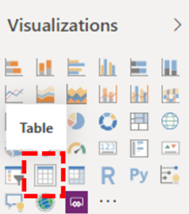

# Power BI Connector をインストールして CQD クエリ テンプレートを使用するInstall Power BI Connector to use CQD query templates

Microsoft Teams 通話品質ダッシュボード (CQD) 用の Power BI クエリ テンプレート (PBIX ファイル) を使用する前に、ダウンロードに含まれる *MicrosoftCallQuality.ppb* ファイルを使用して 、Microsoft CQD 用 Power BI Connector をインストールする必要があります。Before you can use the Power BI query templates (PBIX files) for Microsoft Teams Call Quality Dashboard (CQD), you'll need to install the Power BI Connector for Microsoft CQD, using the *MicrosoftCallQuality.pqx* file included in the [download](https://github.com/MicrosoftDocs/OfficeDocs-SkypeForBusiness/blob/live/Teams/downloads/CQD-Power-BI-query-templates.zip?raw=true).

これらの [テンプレートの詳細については、「Power BI を使用して Teams の CQD](CQD-Power-BI-query-templates.md) データを分析する」を参照してください。Read [Use Power BI to analyze CQD data for Teams](CQD-Power-BI-query-templates.md) to learn about these templates.

Power BI レポートにアクセスするには [、適切な CQD](./turning-on-and-using-call-quality-dashboard.md#assign-admin-roles-for-access-to-cqd) アクセスロールを持っている必要があります。Make sure you have the right [CQD access role](./turning-on-and-using-call-quality-dashboard.md#assign-admin-roles-for-access-to-cqd) to access the Power BI reports.

> [!NOTE]
> CQD Power BI Connector は Power BI の DirectQuery のみをサポートします。インポート モードはサポートされていません。The CQD Power BI Connector only supports DirectQuery in Power BI; Import mode is not supported. 

## インストールInstallation

カスタム コネクタをインストールし、コネクタの使用を有効にするようにセキュリティを調整するプロセスについては [、Power BI ドキュメントで詳しく説明します](/power-bi/desktop-connector-extensibility)。The process for installing a custom connector and adjusting security to enable use of the connector is described in detail in the [Power BI documentation](/power-bi/desktop-connector-extensibility). わかりやすくするために、簡単な説明を次に示します。For the sake of simplicity, here's a quick explanation:

1. コンピューターに既に *\[ Documents \] \\ Power BI Desktop \\ Custom Connectors フォルダーが存在していないか確認* します。Check to see if your computer already has a *\[Documents\]\\Power BI Desktop\\Custom Connectors* folder. 表示されない場合は、このフォルダーを作成します。1If not, create this folder.1

2. コネクタ ファイル *\* (.mez* または *\* .pグループ* ファイル) をダウンロードし、カスタム コネクタ ディレクトリ *に配置* します。Download the connector file (either a *\*.mez* or *\*.pqx* file) and place it in the *Custom Connectors* directory.

3. **コネクタ ファイルが *\* .mez*** ファイルの場合は、カスタム コネクタセットアップ ドキュメントの説明に従ってセキュリティ設定 [を調整する必要があります](/power-bi/desktop-connector-extensibility#data-extension-security)。**If the connector file is a *\*.mez* file,** you will also need to adjust your security settings as described in the [custom connector setup documentation](/power-bi/desktop-connector-extensibility#data-extension-security).

この Power BI Connector for Microsoft Teams の新しいバージョンがリリースされた場合は *、Custom Connectors* ディレクトリの古いコネクタ ファイルを新しいファイルに置き換えるだけで済みです。If a new version of this Power BI Connector for Microsoft Teams is released, simply replace the old connector file in the *Custom Connectors* directory with the new file.

## セットアップSetup

レポートを作成してクエリを実行するには、まず CQD データ ソースに接続する必要があります。In order to build a report and run queries, you will first need to connect to the CQD data source. 接続するには、次の手順に従います。Follow the steps below in order to connect:

1. Power BI Desktop の [ホーム] タブで、[データの取り込み] *をクリックします*。In the Home tab of Power BI Desktop, click on *Get Data*.

    

2. この *時点で [* データの取り込み] ウィンドウが表示されます。The *Get Data* window should appear at this point. オンライン サービス *に移動し、Microsoft* 通話品質 *(ベータ)* を選択し、[接続] を *クリックします*。Navigate to *Online Services*, then select *Microsoft Call Quality (Beta)* and hit *Connect*.

    

3. 次にサインインするように求めるメッセージが表示されます。You will be prompted to sign in next. CQD に使用する資格情報と同じ資格情報を使用します。2Use the same credentials that you use for CQD.2

4. 次のプロンプトでは、2 つのデータ接続モード *間のオプションが表示されます*。The next prompt will give you the option between two *Data Connectivity modes*. *DirectQuery を選択し\*\*、[OK] をクリックします*。Select *DirectQuery* and hit *OK*.

5. 最後に、CQD のデータ モデル全体を示す最終的なプロンプトが表示されます。Finally, you will be given a final prompt showing you the entire data model for CQD. この時点ではデータは表示されません。CQD のデータ モデルのみ表示されます。No data will be visible at this point, only the data model for CQD. [読 *み込み]* を選び、セットアップ プロセスを完了します。Select *Load* to complete the setup process.

6. この時点で、Power BI はデータ モデルをウィンドウの右側に読み込む必要があります。At this point, Power BI will load the data model onto the right side of the window. それ以外の場合、ページは空白のままで、既定ではクエリは読み込まれません。The page will remain otherwise blank, and no queries will be loaded by default. クエリを **作成してデータを返** す場合は、以下のクエリの作成に進みます。Proceed to **Building Queries** below in order to build a query and return data.

このセットアップ プロセス中の手順が完全にクリアされていない場合は、「クイック スタート: Power BI Desktop でデータに接続する」でプロセスの詳細な説明を [参照してください](/power-bi/desktop-quickstart-connect-to-data)。If any of the steps during this setup process were not completely clear, a more detailed explanation of the process can be found in [Quickstart: Connect to data in Power BI Desktop](/power-bi/desktop-quickstart-connect-to-data).

## クエリの作成Building Queries

セットアップが完了すると、[フィールド] ウィンドウに数百のディメンションとメジャーのロードの名前が *表示* されます。Once setup is complete, you should see the names of several hundred dimensions and measures load in the *Fields* pane. ここで実際のクエリを作成する方法は簡単です。クエリに必要なディメンションとメジャーを選び、ページにドラッグ アンド ドロップします。Constructing actual queries from here is simple, just select the dimensions and measures you want for your query, then drag and drop them onto the page. 簡単な例を使用して、より詳細な説明を次に示します。Here's a more detailed explanation, with a simple example:

1. [視覚エフェクト] ウィンドウから、使用する *視覚エフェクトを選択* します。Select the visualization you want to use from the *Visualizations* pane. 空白バージョンの視覚エフェクトがページに表示されます。A blank version of that visualization should appear on the page. この例では、テーブル視覚エフェクトを *使用* します。For the purposes of this example, we will be using the *Table* visualization.

    

2. クエリに使用するディメンションとメジャー (集計記号を名前で示す) を決定し、手動で選び、黒い視覚エフェクトにドラッグします。Determine which dimensions and measures (denoted by an aggregation symbol by their name) you wish to use for your query, then manually select them and drag them onto the black visualization. または、視覚エフェクト オプションの下にある *[値* ] フィールドにドラッグします。Alternately, drag them onto the *Values* field beneath the visualization options.

    

    > [!IMPORTANT]
    > 通話品質ダッシュボードでは、クエリを実行するためのメジャーが必要です。Call Quality Dashboard requires a measure for any query to run. クエリにメジャーを追加できなかった場合、クエリは失敗します。Failure to add a measure to a query will cause that query to fail.

3. 次に、フィルターを適用するディメンションを選択し、[フィルター]ウィンドウのこのビジュアル フィールドの [フィルター] に *ドラッグ* します。Next, select any dimensions you want to filter on and drag them to the *Filters on this visual* field in the *Filters* pane. 現在、CQD Power BI Connector では、基本フィルター処理 (使用可能なディメンション値の一覧から値を選択する)、高度な *フィルター処理*(Advanced CQD と同様に、フィルター処理する値とオペランドを手動で指定)、および相対日付フィルター *(終了* 時刻と開始時刻のディメンションでのみ使用できます) がサポートされています。 The CQD Power BI Connector currently supports *Basic filtering* (select values from a list of possible dimension values), *Advanced filtering* (manually specify values and operands to filter on, similar to Advanced CQD), and *Relative date filtering* (only available for the *End Time* and *Start Time* dimensions). 上位 N 位に *従った* フィルター処理は、CQD ではサポートされていません。Filtering according to *Top N* is not supported by CQD.

    

4. 最後に、[視覚エフェクト] *ウィンドウの* [書式] タブを *選択して、* クエリのスタイルと書式を設定します。Finally, select the *Format* tab within the *Visualizations* pane to style and format your query.

    > [!NOTE]
    > CQD クエリを実行するには、少なくとも 1 つのメジャーが必要です。CQD queries require at least one measure in order to run. クエリが読み込まれていない場合は、クエリにメジャーが含まれているか確認してください。If your query does not load, double check that you have included a measure in the query.

## ドリルスルー レポートを作成するCreating a Drillthrough Report

[Power BI のドリル](/power-bi/desktop-drillthrough) スルーを使用すると、他のレポートの値をコンテキストとして使用してすばやくフィルター処理できる、集中レポートを作成できます。[Drillthrough in Power BI](/power-bi/desktop-drillthrough) allows you to create focused reports that you can quickly filter using the values of other reports as context. CQD Connector を使用して最初のクエリを作成する方法を確認したら、ドリルスルーの作成はさらに簡単です。Once you know how to create your first query with the CQD Connector, creating a drillthrough is even simpler.

1. フォーカスされたレポート用に別のページを作成し、そのページにクエリを追加します。Create another page for the focused report, and then add your queries to that page.

2. ドリルスルー フィルターとして使用するディメンションを選択し、[視覚エフェクト] ウィンドウの [ドリルスルー] フィールド *にドラッグ* します。Select the dimension you want to use as a drillthrough filter and drag them onto the *Drillthrough* field under on the *Visualizations* pane.

    

3. **それです\!****That's it\!** そのディメンションを使用する別のページの他のクエリで、そのページにドリルスルーが実行され、フィルターとしてドリルスルー ディメンションの値が自動的に適用されます。Any other query on another page that uses that dimension can now drillthrough to that page, automatically applying the drillthrough dimension's value as a filter.

    

Advanced CQD とは異なり、Power BI は非連続ドリルスルーをサポートします。Unlike Advanced CQD, Power BI supports non-sequential drillthrough. クエリに必要なディメンションが含まれる限り、他のページにドリルスルーできます。So long as a query includes the necessary dimension, it can drillthrough to any other page.

### ベスト プラクティスBest practice

通話品質コネクタ クエリは、ドリルスルー機能を念頭に置いて設計する必要があります。Call Quality connector queries should be designed with drillthrough functionality in mind. すべてのデータを一度に読み込み、フィルターでスライスダウンするのではなく、より広範な低カーディナリティ クエリから開始し、高カーディナリティ クエリにドリルダウンします。Instead of trying to load all the data at once, and then slicing down with filters, start with broader, low-cardinality queries and drill down to high-cardinality queries. たとえば、どのサブネットが品質の問題に最も寄与するかの診断を試みる場合、最初に問題の原因である地域と国を特定してから、その地域または国のサブネットにドリルダウンすると便利です。For instance, when attempting to diagnose which subnets contribute most to quality issues, it's helpful to first identify those regions and countries which contribute to the problem, then drill down to the subnets in that region or country. 通話品質コネクタ テンプレートは、例として機能するように設計されています。The Call Quality connector templates have been designed in this manner in order to act as an example.

## 制限事項Limitations

Power BI を使用しているにもかかわらず、CQD データ モデルまたは DirectQuery コネクタ全般に対する制限の結果として、すべての Power BI 機能が CQD Connector でサポートされるという保証はありません。Despite making use of Power BI, not all Power BI functionality is support by the CQD Connector, either as a result of limitations on CQD data model or on DirectQuery connectors in general. 以下の一覧では、Connector の特に重要な制限事項の一部をメモしていますが、この一覧は完全には考慮する必要はありません。The list below notes some of the Connector's more noteworthy limitations, but this list should not be considered exhaustive:

1. **計算列 –** 一般的に、DirectQuery コネクタでは、Power BI の計算列のサポートが制限されています。**Calculated Columns –** DirectQuery connectors in general have limited support for calculated columns in Power BI. 一部の集計列はコネクタで動作する場合は例外と見なす必要があります。While some calculated columns may work with the Connector, these should be considered exceptions. 一般的に、集計列は機能しません。As a general rule, calculated columns will not function.

2. **集計 –** CQD データ モデルはキューブ モデル上に構築されています。つまり、集計はメジャーの形式で既にサポートされています。**Aggregations –** The CQD data model is built on a cube model, meaning that aggregations are already supported in the form of measures. 異なるディメンションに集計を手動で追加しようとしたり、メジャーの集計の種類を変更したりしようとすると、コネクタは動作しません。通常、エラーが発生します。Attempting to manually add aggregations to different dimensions or changing the aggregation type of a measure will not work with the Connector, and it will generally result in an error.

3. **カスタム ビジュアル –** CQD Connector はさまざまなカスタム ビジュアルで動作しますが、すべてのカスタム ビジュアルとの互換性を保証できません。**Custom Visuals –** While the CQD Connector does work with a range of custom visuals, we are unable to guarantee compatibility with all custom visuals. 多くのカスタム ビジュアルは、計算列またはインポートされたデータの使用に依存します。どちらも、または DirectQuery コネクタでサポートされていません。Many custom visuals rely on the use of calculated columns or imported data, neither or which are supported by DirectQuery connectors.

4. **キャッシュ データの参照 –** 現在、Power BI では、DirectQuery コネクタからキャッシュされたデータを参照する方法はサポートされていません。**Referencing Cached Data –** Power BI currently does not support referencing cached data from a DirectQuery connector in any way. クエリの結果を参照しようとすると、新しいクエリが作成されます。Any attempt to reference the results of a query will result in a new query.

5. **相対データ フィルタリング –** CQD コネクタではサポートされますが、開始時刻と終了時刻のディメンション *でのみサポート* されます。**Relative Data Filtering –** Is supported in the CQD Connector, but only with the *Start Time* and *End Time* dimensions. 日付ディメンション *は* 、相対的な日付のフィルター処理に対して明らかに選択できる場合でも、 *日付* は日付時刻オブジェクトとして保存されないので、Power BI での相対的な日付のフィルター処理はサポートされません。Although the *Date* dimension may be the obvious choice for relative date filtering, *Date* is not stored as a date time object and thus does not support relative date filtering in Power BI.

6. **Government Community Cloud (GCC) のサポート –** GCC 環境のお客様の場合、CQD Power BI Connector は Power BI Desktop を使用するときに動作します。**Government Community Cloud (GCC) Support –** For customers in the GCC environment, the CQD Power BI Connector will work when using Power BI Desktop. 現在、CQD Power BI コネクタは GCC ユーザー向け Power BI サービスと互換性がありません。The CQD Power BI connector is not presently compatible with the Power BI service for GCC customers.

これらの問題の多くが、Power BI の DirectQuery コネクタ設計に対する制限か、CQD データ モデルの設計の基礎のいずれかです。Most of these issues are either restrictions to DirectQuery connector design in Power BI or fundamental to the design of the CQD data model.

## トラブルシューティングTroubleshooting

### Date 列を日付スライサーとして使用します。I'm trying to use the Date column as a Date slicer. この列のデータ型を Date に変換するとすぐに、このエラーが表示されますAs soon as I convert the data type of this column to Date, I get this error

> **次のビジュアル** のデータを読み込む必要があります: OLE DB または ODBC エラー: [Expression.Error] データ ソースに式を折りたたむ必要があります。**Couldn't load the data for this visual**: OLE DB or ODBC error: [Expression.Error] We couldn't fold the expression to the data source. より簡単な式を試してください。Please try a simpler expression.

日付スライサーは、Power BI Connector ではサポートされていません。Date slicers aren't supported with the Power BI Connector. 日付範囲を指定するには、2 つのフィルターをレポートに適用し、日付より小さいフィルターと日付より大きいフィルターを指定します。To specify a date range, apply two filters to the report, specifying a less than and greater than date.

または、表示する日付が新しい場合は、相対的な日付フィルターを適用して、最後の N 日間/週/月のデータのみを表示します。Alternatively, if the dates you want to view are recent, apply a relative date filter to show only data for the last N days/weeks/months.

## エラー コードError Codes

CQD Power BI Connector は、作成できるクエリの種類に関してブラウザー アプリよりも制限が少ないので、クエリの作成中に多くのエラーが発生することがあります。Because the CQD Power BI Connector is less restricted than the browser app in terms of kinds of queries you can construct, you may occasionally encounter a number of errors while building your queries. "CQDError" という種類のエラー メッセージが表示された場合。In the event that you receive an error message of the type "CQDError. RunQuery – クエリ実行エラー"。クエリで発生する可能性のある問題のトラブルシューティングを行う場合は、下記の ErrorType 番号を使用して一覧を参照してください。RunQuery – Query Execution Error", reference the list below with the ErrorType number provided in order to troubleshoot the possible issue with the query. CQD Power BI Connector で発生する可能性がある最も一般的なエラーの種類コードを次に示します。The following are the most common Error Type codes you may encounter with the CQD Power BI Connector:

- **ErrorType 1 - クエリ構造エラー:** クエリ構造のエラーは、通常、コネクタが適切に書式設定されたクエリを作成できなかった場合に発生します。**ErrorType 1 - Query Structure Error:** A query structure error is typically caused by the Connector failing to build a properly formatted query. この問題は、上記の制限事項で説明したように、サポートされていない機能を使用している場合によく発生します。This happens most often when using unsupported functionality, as specified in the Limitations above. クエリに集計列やカスタム ビジュアルが使用されていないか、確認してください。Double check that you are not using any calculated columns or custom visuals for that query.

  - **ErrorType 2 - クエリ作成エラー:** クエリの作成エラーは、CQD Connector がビルドするクエリを正しく解析できなかった原因です。**ErrorType 2 - Query Building Error:** A query building error is caused by the CQD Connector being unable to properly parse the query you are attempting to build. この問題は、上記の制限事項で説明したように、サポートされていない機能を使用している場合によく発生します。This happens most often when using unsupported functionality, as specified in the Limitations above. クエリに集計列やカスタム ビジュアルが使用されていないか、確認してください。Double check that you are not using any calculated columns or custom visuals for that query.

  - **ErrorType 5 - 実行タイムアウト:** クエリは、タイム アウトの前に可能な限り最大のランタイムに達しました。クエリの範囲を制限するために、クエリにさらにフィルターを追加してみてください。**ErrorType 5 - Execution Timeout:** The query has reached the maximum possible runtime before timing out. Try adding more filters to the query in order to limit its scope. 多くの場合、データ範囲を絞り込むのが最も効果的な方法です。Narrowing the data range is often the most effective way to achieve this.

  - **ErrorType 7 - 寸法エラーなし:** CQD クエリを機能するにはメジャーが必要です。**ErrorType 7 - No Measurements Error:** CQD queries require a measure in order to function. クエリにメジャーが含まれるか確認します。Double check that your query includes measure. CQD Connector のメジャーは、名前の前に集計 (合計) 記号で示されます。Measures in the CQD Connector are denoted by the aggregation (sum) symbol before their name.

この範囲以外で追加のエラーが発生した場合は、問題のトラブルシューティングを行い、必要に応じてドキュメントを更新できるよう、CQD チームに通知してください。If you encounter any additional errors outside of this scope, please notify the CQD team so that we can help troubleshoot the issue and update the documentation as appropriate.

## 脚注Footnotes

**1** つの特定のプロセスとアプリ (OneDrive など) により、Documents ルート フォルダーが変更される場合があります。Power BI Desktop *\\ カスタム コネクタ* ディレクトリが、現在のルート フォルダーの [ドキュメント] フォルダー内に配置されている必要があります。**1** Certain processes and apps (e.g., OneDrive) may cause your Documents root folder to change; make sure that the *Power BI Desktop\\Custom Connectors* directory is placed inside of the current root folder Documents folder.

**2** CQD に使用するログイン資格情報は、Power BI デスクトップ アプリ自体へのログインに使用する資格情報と同じにする必要はありません。**2** The login credentials you use for CQD *do not* need to be the same credentials you use for logging into the Power BI Desktop app itself.

## よく寄せられる質問Frequently asked questions

### Power BI Connector が "ベータ版" の状態から更新されるのは、いつですか?When will the Power BI Connector be updated from "Beta" status

ベータ 版のタグにもかかわらず、Power BI 用の通話品質コネクタはコネクタのリリース バージョンであり、これを反映するために Power BI チームによって正式にセキュリティが署名されています。Despite the Beta tag, the Call Quality Connector for Power BI is the release version of the connector and has been officially security signed by the Power BI team to reflect this. そのベータ タグを削除する認定プロセスは広範なプロセスであり、コネクタに直接サポートを提供するために Power BI チームからのコミットメントが必要です。The certification process to remove that Beta tag is an extensive one and requires a commitment from the Power BI team to provide direct support to the connector as well. 時間の制約により、Power BI チームは現在、そのサポートと幅広いサーティビティを提供できませんが、Microsoft 通話品質コネクタのセキュリティ、真正性、および一般的な機能を証明する準備は引き続き行っています。Due to time constraints, the Power BI team is currently unable to provide that support and broader certification, but is still prepared to attest to the security, authenticity, and general functionality of the Microsoft Call Quality connector.

### ブラウザーの Advanced CQD に比べてコネクタの速度が遅い理由Why does the connector seem slower compared to Advanced CQD in the browser? パフォーマンスを向上させるために何が可能かWhat can I do to improve performance

さまざまなテンプレートのクエリのパフォーマンスは、ブラウザーとコネクタの両方で実際には同じです。Query performance for the various templates is actually the same in both the browser and in the connector.  他のスタンドアロン アプリと同様に、Power BI は認証とレンダリング時間をパフォーマンスに追加します。Just like any other standalone app, Power BI adds its authentication and rendering time to our performance. さらに、この違いは、同時に実行されるクエリの数によって異なっています。In addition, the difference comes in the number of concurrent queries being run. ブラウザー版の CQD では、あまりよく開発され情報が入り込む視覚エフェクト オプションが少なかったため、ほとんどのレポートでは、一度に 2 から 3 のクエリを読み込むのに制限されています。Because the in-browser version of CQD had less well-developed and information-dense visualization options, most of our reports were limited to loading 2-3 queries at a time. 一方、コネクタ テンプレートには 20 以上の同時実行クエリが表示される場合があります。On the other hand, the connector templates often display 20+ concurrent queries. 以前のレポートと同じ応答性のレポートを作成する場合は、タブごとにクエリが 2 ~ 3 つ以下のレポートを作成してみてください。If you wish to build reports that are just as responsive as the older ones you were used to, try creating reports with no more than 2-3 queries per tab.

詳細については、次の記事を参照してください。For more information, see the following articles:

- [Power BI の最適化ガイドOptimization guide for Power BI](/power-bi/guidance/power-bi-optimization)
- [DirectQuery モデルのガイダンスDirectQuery model guidance](/power-bi/guidance/directquery-model-guidance)

### クエリを実行すると、日常的に 10,000 行の制限に達しています。I find that I routinely run into the 10,000-row limit when running queries. 10,000 行を超える行を返すコネクタを取得する方法How can I get the connector to return more than 10,000 rows

実際には API の最後に 10,000 行の制限が指定され、パフォーマンスを大幅に向上し、メモリ状態が低い場合に発生するクエリ実行エラーのリスクを軽減するように設計されています。The 10,000-row limit is actually specified on the API end, and it is designed to help significantly improve performance and reduce the risk of query execution errors resulting from low memory conditions.

結果の行数を増やす代わりに、コネクタのベスト プラクティスに従ってレポートを再構築します。Instead of attempting to increase the result row count, it is best to restructure your reports according to connector best practices. 含まれているテンプレートは、これらのベスト プラクティスを示す目的で設計されています。The templates we have included are designed to demonstrate these best practices. 可能であれば、まず、月、年、日付、地域、国など、より大きく基数の小さいディメンションを使用して KPI を確認します。そこから、より高い基数のディメンションにドリルダウンできます。Where possible, start by looking at your KPIs using broader, lower-cardinality dimensions, such as Month, Year, Date, Region, Country, etc. From there, you can drill down into increasingly higher-cardinality dimensions. ヘルプデスクとレポートLocation-Enhanced両方とも、このドリルダウン ワークフローの良い例を示します。The Helpdesk and Location-Enhanced Reports both provide good examples of this drill down workflow.

## 関連項目Related topics

[Power BI を使用して Teams の CQD データを分析するUse Power BI to analyze CQD data for Teams](CQD-Power-BI-query-templates.md)
