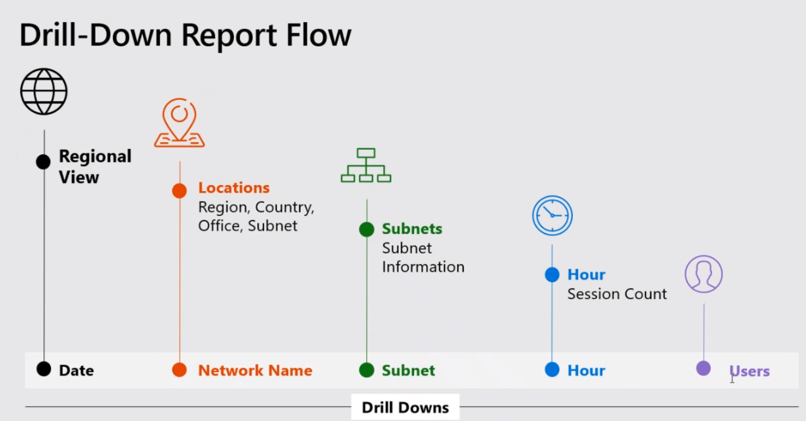
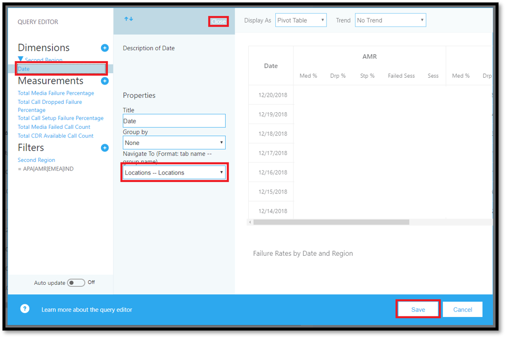
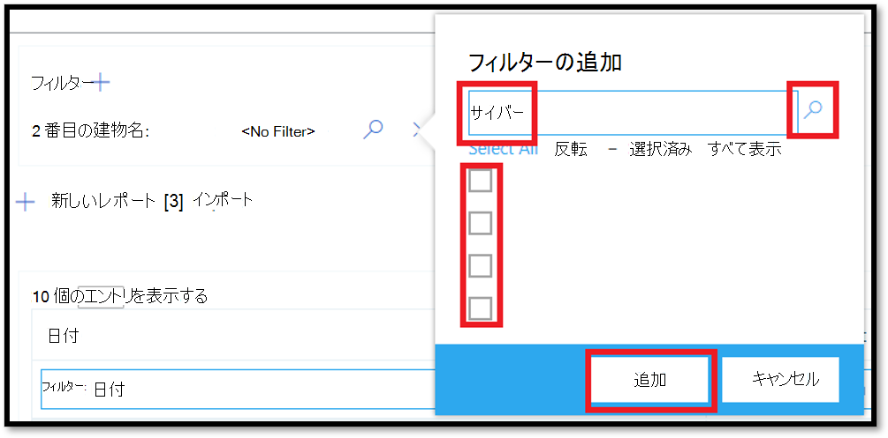
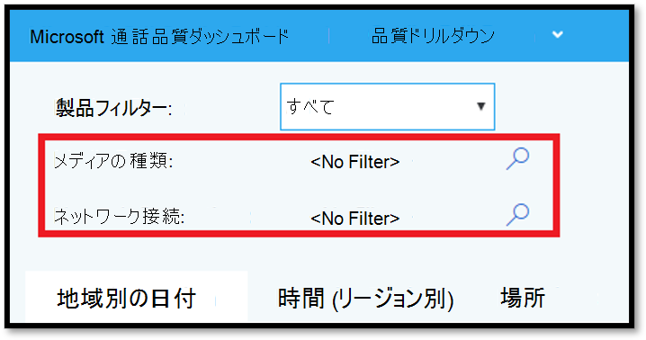

# <a name="data-and-reports-in-call-quality-dashboard-cqd"></a><span data-ttu-id="811ff-103">通話品質ダッシュボード (CQD) のデータとレポート</span><span class="sxs-lookup"><span data-stu-id="811ff-103">Data and reports in Call Quality Dashboard (CQD)</span></span>

<span data-ttu-id="811ff-104">Microsoft 通話品質ダッシュボード (CQD) は、near リアルタイム (NRT) データフィードを使用します。</span><span class="sxs-lookup"><span data-stu-id="811ff-104">Microsoft Call Quality Dashboard (CQD) uses a near-real-time (NRT) data feed.</span></span> <span data-ttu-id="811ff-105">通話記録は、通話の終了後30分以内に CQD で利用できます。</span><span class="sxs-lookup"><span data-stu-id="811ff-105">Call records are available in CQD within 30 minutes of the end of a call.</span></span> <span data-ttu-id="811ff-106">NRT パイプラインからの通話レコードは、データセットから削除されるまで数ヶ月分しか使用できません。</span><span class="sxs-lookup"><span data-stu-id="811ff-106">Call records from the NRT pipeline are only available for a few months before they are removed from the data set.</span></span> 


> [!NOTE]
> <span data-ttu-id="811ff-107">Advanced CQD (11 2019 月の新機能) では、Advanced CQD pipeline の NRT データを使って、古い CQD パイプライン (約24時間で利用可能) のデータを結合します。</span><span class="sxs-lookup"><span data-stu-id="811ff-107">Advanced CQD (new in November 2019) merges data from the older CQD pipeline (which made call records available in about 24 hours) with NRT data from the Advanced CQD pipeline.</span></span> <span data-ttu-id="811ff-108">アーカイブ期間のデータに対する古いポータルとアドバンストポータルのクエリでは、同じ結果が得られます。</span><span class="sxs-lookup"><span data-stu-id="811ff-108">Queries on the older and Advanced portals for the data from the Archival period produce the same results.</span></span> <span data-ttu-id="811ff-109">NRT データと NRT データの両方のポータル上のクエリと EUII の期間は異なっています。</span><span class="sxs-lookup"><span data-stu-id="811ff-109">Queries on either portal for the NRT Data and NRT Data + EUII periods will be different.</span></span>

## <a name="many-ways-to-access-cqd-data"></a><span data-ttu-id="811ff-110">CQD データにアクセスするさまざまな方法</span><span class="sxs-lookup"><span data-stu-id="811ff-110">Many ways to access CQD data</span></span>

<span data-ttu-id="811ff-111">複数の異なる方法で CQD データにアクセスできます。</span><span class="sxs-lookup"><span data-stu-id="811ff-111">You can access CQD data by several different avenues.</span></span> <span data-ttu-id="811ff-112">ニーズに最も合ったものを選択してください。</span><span class="sxs-lookup"><span data-stu-id="811ff-112">Pick the one that best meets your needs:</span></span>

|  |  |
|---------|---------|
|<span data-ttu-id="811ff-113">Teams 管理センター [( https://admin.teams.microsoft.com) ](https://admin.teams.microsoft.com)</span><span class="sxs-lookup"><span data-stu-id="811ff-113">Teams admin center [(https://admin.teams.microsoft.com)](https://admin.teams.microsoft.com)</span></span>    | <span data-ttu-id="811ff-114">CQD データは Teams 管理センターの [**ユーザー** ] ページに含まれており、必要なデータが読みやすい形式で表示されています。</span><span class="sxs-lookup"><span data-stu-id="811ff-114">CQD data is included on the **Users** page in the Teams admin center, showing the most common data you need in an easy-to-read format.</span></span> <span data-ttu-id="811ff-115">[**ユーザー**] で見つかった CQD データはカスタマイズできません。</span><span class="sxs-lookup"><span data-stu-id="811ff-115">You can't customize CQD data that you find under **Users**.</span></span>  |
|<span data-ttu-id="811ff-116">CQD ポータル[( https://cqd.teams.microsoft.com) ](https://cqd.teams.microsoft.com)</span><span class="sxs-lookup"><span data-stu-id="811ff-116">CQD portal [(https://cqd.teams.microsoft.com)](https://cqd.teams.microsoft.com)</span></span>     | <span data-ttu-id="811ff-117">ドリルスルーフィルター機能を使用して、ほとんどのニーズを満たす信頼性の高い概要と詳細なレポート。</span><span class="sxs-lookup"><span data-stu-id="811ff-117">Robust summary and detailed reports that meet most needs, with drill-through filtering.</span></span> <span data-ttu-id="811ff-118">CQD ポータルでレポートをカスタマイズすることもできます。</span><span class="sxs-lookup"><span data-stu-id="811ff-118">You can also customize reports in the CQD portal.</span></span> <br><br><span data-ttu-id="811ff-119">CQD ポータルでデータを分析するための2つの[CQD レポートテンプレート](#import-the-cqd-report-templates)を取得します。</span><span class="sxs-lookup"><span data-stu-id="811ff-119">Get two [CQD report templates](#import-the-cqd-report-templates) to help you analyze data in the CQD portal.</span></span>       |
|<span data-ttu-id="811ff-120">Power BI</span><span class="sxs-lookup"><span data-stu-id="811ff-120">Power BI</span></span>     | <span data-ttu-id="811ff-121">[カスタマイズ可能な POWER bi テンプレート](CQD-Power-BI-query-templates.md)を使用して、CQD データを power bi で表示するには、ダイレクトクエリを使います。</span><span class="sxs-lookup"><span data-stu-id="811ff-121">Use direct queries to view your CQD data in Power BI using [customizable Power BI templates](CQD-Power-BI-query-templates.md).</span></span> <span data-ttu-id="811ff-122">[CQD の POWER BI クエリテンプレートをダウンロード](https://github.com/MicrosoftDocs/OfficeDocs-SkypeForBusiness/blob/live/Teams/downloads/CQD-Power-BI-query-templates.zip?raw=true)します。</span><span class="sxs-lookup"><span data-stu-id="811ff-122">[Download Power BI query templates for CQD](https://github.com/MicrosoftDocs/OfficeDocs-SkypeForBusiness/blob/live/Teams/downloads/CQD-Power-BI-query-templates.zip?raw=true).</span></span><br><br><span data-ttu-id="811ff-123">また、REST API を使用して、Power BI で[CQD データにアクセスする](https://docs.microsoft.com/skypeforbusiness/management-tools/call-quality-dashboard/data-api)こともできます。</span><span class="sxs-lookup"><span data-stu-id="811ff-123">You can also [use the REST API to access CQD data](https://docs.microsoft.com/skypeforbusiness/management-tools/call-quality-dashboard/data-api) through Power BI.</span></span> <span data-ttu-id="811ff-124">CQD データをダウンロードしてオフラインで作業できるようにする場合は、この方法を使用します。</span><span class="sxs-lookup"><span data-stu-id="811ff-124">Use this method if you want to download your CQD data so you can work on it offline.</span></span> <span data-ttu-id="811ff-125">この方法を使用するとパフォーマンスが向上します。特に、オンラインの場合は、Power BI で bog されていない大きなデータセットに適しています。</span><span class="sxs-lookup"><span data-stu-id="811ff-125">The benefit of using this method is better performance, especially useful for large data sets that bog down in Power BI when you're online.</span></span>       |
|<span data-ttu-id="811ff-126">Graph API</span><span class="sxs-lookup"><span data-stu-id="811ff-126">Graph API</span></span>     | <span data-ttu-id="811ff-127">[GRAPH API](https://docs.microsoft.com/graph/api/resources/callrecords-api-overview?view=graph-rest-beta)を使用して、自分で通話品質データにアクセスします。</span><span class="sxs-lookup"><span data-stu-id="811ff-127">Access call quality data yourself using the [Graph API](https://docs.microsoft.com/graph/api/resources/callrecords-api-overview?view=graph-rest-beta).</span></span> <span data-ttu-id="811ff-128">これは最も複雑な方法ですが、通話品質データを分析するのに最適なコントロールと柔軟性を提供します。</span><span class="sxs-lookup"><span data-stu-id="811ff-128">This is the most complex method, but it gives you the most control and flexibility in analyzing your call quality data.</span></span> <span data-ttu-id="811ff-129">たとえば、組織の他のデータに参加する必要がある場合は、Graph API を使ってデータモデルを作成し、通話品質データを組み込むことができます。</span><span class="sxs-lookup"><span data-stu-id="811ff-129">For example, if you need to join it with other data for your organization, you can use the Graph API to create a data model and incorporate call quality data.</span></span>        |

## <a name="import-the-cqd-report-templates"></a><span data-ttu-id="811ff-130">CQD レポートテンプレートをインポートする</span><span class="sxs-lookup"><span data-stu-id="811ff-130">Import the CQD report templates</span></span>

<span data-ttu-id="811ff-131">CQD ですばやく作業を開始できるように、 [2 つの CURATED CQD レポートテンプレート](https://aka.ms/qertemplates)(すべてのネットワークと管理されたネットワーク) をダウンロードします。</span><span class="sxs-lookup"><span data-stu-id="811ff-131">Download [two curated CQD report templates](https://aka.ms/qertemplates) (All Networks and Managed Networks) to help you get up to speed quickly with CQD.</span></span> <span data-ttu-id="811ff-132">建物のデータファイルを操作するために最適化された [すべてのネットワーク] テンプレートは、次のセクションで説明するように、建物情報を収集して CQD にアップロードするときに使用できます。</span><span class="sxs-lookup"><span data-stu-id="811ff-132">The All Networks template, though optimized to work with a building data file, can be used while you work toward collecting and uploading building information into CQD, as described in the next section.</span></span>

<span data-ttu-id="811ff-133">**テンプレートをインポートするには (.CQDX) を CQD**</span><span class="sxs-lookup"><span data-stu-id="811ff-133">**To import the templates (.CQDX) into CQD**</span></span>

1. <span data-ttu-id="811ff-134">CQD で、ページの上部にあるメニューから [**詳細レポート**] を選択します。</span><span class="sxs-lookup"><span data-stu-id="811ff-134">In CQD, select **Detailed Reports** from the menu at the top of the page.</span></span>

2. <span data-ttu-id="811ff-135">左側のパネルで、[**インポート**] を選択します。</span><span class="sxs-lookup"><span data-stu-id="811ff-135">In the left panel, select **Import**.</span></span> <span data-ttu-id="811ff-136">1つ目の CQDX テンプレートを参照し、[**開く**] を選択します。</span><span class="sxs-lookup"><span data-stu-id="811ff-136">Browse to the first CQDX template and select **Open**.</span></span>

3. <span data-ttu-id="811ff-137">テンプレートがアップロードされると、ポップアップウィンドウに "レポートのインポートが成功しました。" というメッセージが表示されます。</span><span class="sxs-lookup"><span data-stu-id="811ff-137">After the template is uploaded, a pop-up window will display the message "Report import was successful."</span></span> 

4. <span data-ttu-id="811ff-138">2番目の CQD テンプレートについて、手順2と3を繰り返します。</span><span class="sxs-lookup"><span data-stu-id="811ff-138">Repeat steps 2 and 3 for the second CQD template.</span></span>

> [!NOTE]
> <span data-ttu-id="811ff-139">各ユーザーは、CQD テンプレートを CQD インスタンスにインポートする必要があります。</span><span class="sxs-lookup"><span data-stu-id="811ff-139">Each user must import the CQD templates into their CQD instance.</span></span> 


## <a name="euii-data"></a><span data-ttu-id="811ff-140">EUII データ</span><span class="sxs-lookup"><span data-stu-id="811ff-140">EUII data</span></span>

<span data-ttu-id="811ff-141">コンプライアンス上の理由から、エンドユーザーを特定できる情報 (EUII) データ (個人を特定できる情報または PII とも呼ばれます) は、30日間のみ保持されます。</span><span class="sxs-lookup"><span data-stu-id="811ff-141">For compliance reasons, end-user identifiable information (EUII) data (also known as personally-identifiable information or PII) is only kept for 30 days.</span></span> <span data-ttu-id="811ff-142">NRT データは、30日間のマークと交差するため、EUII を含むフィールドは消去され、EUII-free NRT データが生成されます。</span><span class="sxs-lookup"><span data-stu-id="811ff-142">As NRT data crosses the 30-day mark, fields that contain EUII are cleared, resulting in EUII-free NRT data.</span></span> <span data-ttu-id="811ff-143">EUII データを含むフィールドは次のとおりです。</span><span class="sxs-lookup"><span data-stu-id="811ff-143">Fields that contain EUII data are:</span></span>

- <span data-ttu-id="811ff-144">完全な IP アドレス</span><span class="sxs-lookup"><span data-stu-id="811ff-144">Full IP address</span></span>
- <span data-ttu-id="811ff-145">メディアアクセス制御 (MAC) アドレス</span><span class="sxs-lookup"><span data-stu-id="811ff-145">Media Access Control (MAC) Address</span></span>
- <span data-ttu-id="811ff-146">基本サービスセット識別子 (BSSID)</span><span class="sxs-lookup"><span data-stu-id="811ff-146">Basic Service Set identifier (BSSID)</span></span>
- <span data-ttu-id="811ff-147">セッション開始プロトコル (SIP) URI (Skype for Business のみ)</span><span class="sxs-lookup"><span data-stu-id="811ff-147">Session Initiation Protocol (SIP) URI (Skype for Business only)</span></span>
- <span data-ttu-id="811ff-148">ユーザー プリンシパル名 (UPN)</span><span class="sxs-lookup"><span data-stu-id="811ff-148">User Principal Name (UPN)</span></span>
- <span data-ttu-id="811ff-149">マシンのエンドポイント名</span><span class="sxs-lookup"><span data-stu-id="811ff-149">Machine Endpoint Name</span></span>
- <span data-ttu-id="811ff-150">ユーザーからのフィードバック</span><span class="sxs-lookup"><span data-stu-id="811ff-150">User Verbatim Feedback</span></span>
- <span data-ttu-id="811ff-151">オブジェクト ID (エンドポイントのユーザーの Active Directory オブジェクト ID)</span><span class="sxs-lookup"><span data-stu-id="811ff-151">Object ID (the Active Directory object ID of the endpoint's user)</span></span>

### <a name="admin-roles-with-and-without-euii-access"></a><span data-ttu-id="811ff-152">EUII access を含む、または持たない管理者の役割</span><span class="sxs-lookup"><span data-stu-id="811ff-152">Admin roles with and without EUII access</span></span>

<span data-ttu-id="811ff-153">この[RBAC](https://docs.microsoft.com/azure/role-based-access-control/overview)ロール**には、** 次のような euii アクセスがあります。</span><span class="sxs-lookup"><span data-stu-id="811ff-153">These [RBAC](https://docs.microsoft.com/azure/role-based-access-control/overview) roles **DO** have EUII access:</span></span>
- <span data-ttu-id="811ff-154">グローバル管理者</span><span class="sxs-lookup"><span data-stu-id="811ff-154">Global Admin</span></span>
- <span data-ttu-id="811ff-155">Teams サービス管理者</span><span class="sxs-lookup"><span data-stu-id="811ff-155">Teams Service Admin</span></span>
- <span data-ttu-id="811ff-156">Teams のコミュニケーション管理者</span><span class="sxs-lookup"><span data-stu-id="811ff-156">Teams Communications Admin</span></span>
- <span data-ttu-id="811ff-157">Teams 通信サポート エンジニア</span><span class="sxs-lookup"><span data-stu-id="811ff-157">Teams Communications Support Engineer</span></span>
- <span data-ttu-id="811ff-158">グローバルリーダー</span><span class="sxs-lookup"><span data-stu-id="811ff-158">Global Reader</span></span>
- <span data-ttu-id="811ff-159">Skype for Business 管理者</span><span class="sxs-lookup"><span data-stu-id="811ff-159">Skype for Business Admin</span></span>

<span data-ttu-id="811ff-160">これらの RBAC ロールには、EUII アクセスがあり**ません**。</span><span class="sxs-lookup"><span data-stu-id="811ff-160">These RBAC roles **DON'T** have EUII access:</span></span>
- <span data-ttu-id="811ff-161">レポートリーダー</span><span class="sxs-lookup"><span data-stu-id="811ff-161">Reports Reader</span></span>
- <span data-ttu-id="811ff-162">Teams 通信サポート スペシャリスト</span><span class="sxs-lookup"><span data-stu-id="811ff-162">Teams Communications Support Specialist</span></span>


## <a name="date-controls"></a><span data-ttu-id="811ff-163">日付コントロール</span><span class="sxs-lookup"><span data-stu-id="811ff-163">Date controls</span></span>

<span data-ttu-id="811ff-164">CQD は、次のローリング傾向の型をサポートしています。</span><span class="sxs-lookup"><span data-stu-id="811ff-164">CQD supports the following Rolling Trend types:</span></span>

- <span data-ttu-id="811ff-165">5日</span><span class="sxs-lookup"><span data-stu-id="811ff-165">5-day</span></span>
- <span data-ttu-id="811ff-166">7日間</span><span class="sxs-lookup"><span data-stu-id="811ff-166">7-day</span></span>
- <span data-ttu-id="811ff-167">30日間</span><span class="sxs-lookup"><span data-stu-id="811ff-167">30-day</span></span>
- <span data-ttu-id="811ff-168">60日</span><span class="sxs-lookup"><span data-stu-id="811ff-168">60-day</span></span>
- <span data-ttu-id="811ff-169">90日</span><span class="sxs-lookup"><span data-stu-id="811ff-169">90-day</span></span>

<span data-ttu-id="811ff-170">URL Date パラメーターは Day フィールドを受け取ります。</span><span class="sxs-lookup"><span data-stu-id="811ff-170">The URL Date parameter accepts a Day field.</span></span> <span data-ttu-id="811ff-171">ローリングレポートでは、トレンドの最終日として YYYY-MM-DD 形式の日付が使用されます。</span><span class="sxs-lookup"><span data-stu-id="811ff-171">Rolling-day reports use dates specified in the YYYY-MM-DD format as the last day of the trend.</span></span> <span data-ttu-id="811ff-172">URL Date パラメーター "00" は "today" を示します。</span><span class="sxs-lookup"><span data-stu-id="811ff-172">The URL Date parameter “00”  indicates “today”.</span></span>

|<span data-ttu-id="811ff-173">URL</span><span class="sxs-lookup"><span data-stu-id="811ff-173">URL</span></span>| <span data-ttu-id="811ff-174">ローリング日のトレンドの終了日</span><span class="sxs-lookup"><span data-stu-id="811ff-174">End date of Rolling Day Trend</span></span>|
|:---|:---|
|<span data-ttu-id="811ff-175"><span>https:// <cqdv3> /spd/#/ダッシュボード/ <reportid> /2019-02/</span></span><span class="sxs-lookup"><span data-stu-id="811ff-175"><span>https://<cqdv3>/spd/#/Dashboard/<reportid>/2019-02/</span></span></span>   |<span data-ttu-id="811ff-176">2019年2月の現在の日付</span><span class="sxs-lookup"><span data-stu-id="811ff-176">Current Day of Feb 2019</span></span>|
|<span data-ttu-id="811ff-177"><span>https:// <cqdv3> /spd/#/ダッシュボード/ <reportid> /2019-02-15/</span></span><span class="sxs-lookup"><span data-stu-id="811ff-177"><span>https://<cqdv3>/spd/#/Dashboard/<reportid>/2019-02-15/</span></span></span>|<span data-ttu-id="811ff-178">2019年2月15日</span><span class="sxs-lookup"><span data-stu-id="811ff-178">Feb 15, 2019</span></span>|
|<span data-ttu-id="811ff-179"><span>https:// <cqdv3> /spd/#/ダッシュボード/ <reportid> /00/</span></span><span class="sxs-lookup"><span data-stu-id="811ff-179"><span>https://<cqdv3>/spd/#/Dashboard/<reportid>/00/</span></span></span>        |<span data-ttu-id="811ff-180">現在の日付</span><span class="sxs-lookup"><span data-stu-id="811ff-180">Current Day</span></span>|
|||

<span data-ttu-id="811ff-181">既定では、月の現在の日付が、ローリング日の傾向の最終日として使用されます。</span><span class="sxs-lookup"><span data-stu-id="811ff-181">By default, the current day of the month is used as the last day of the Rolling Day Trend.</span></span>


## <a name="data-available-in-cqd-reports"></a><span data-ttu-id="811ff-182">CQD レポートで利用可能なデータ</span><span class="sxs-lookup"><span data-stu-id="811ff-182">Data available in CQD reports</span></span>

<span data-ttu-id="811ff-183">既定の概要と詳細な CQD レポートは、組織の通話品質を管理するために必要なものである場合があります。必要に応じて、[カスタムレポートを作成](#create-custom-detailed-reports)することができます。</span><span class="sxs-lookup"><span data-stu-id="811ff-183">The default summary and detailed CQD reports may be all you need to manage call quality for your org. If you need to, you can [create custom reports](#create-custom-detailed-reports).</span></span> 

<span data-ttu-id="811ff-184">Power BI を使用して CQD データを分析する場合は、「 [POWER bi を使用して Teams の CQD データを分析](CQD-Power-BI-query-templates.md)する」を参照してください。</span><span class="sxs-lookup"><span data-stu-id="811ff-184">If you want to use Power BI to analyze your CQD data, read [Use Power BI to analyze CQD data for Teams](CQD-Power-BI-query-templates.md).</span></span>

|<span data-ttu-id="811ff-185">機能</span><span class="sxs-lookup"><span data-stu-id="811ff-185">Feature</span></span>|<span data-ttu-id="811ff-186">概要レポート</span><span class="sxs-lookup"><span data-stu-id="811ff-186">Summary Reports</span></span>|<span data-ttu-id="811ff-187">詳細レポート</span><span class="sxs-lookup"><span data-stu-id="811ff-187">Detailed Reports</span></span>|
|:--- |:--- |:--- |
|<span data-ttu-id="811ff-188">アプリケーション共有のメトリック</span><span class="sxs-lookup"><span data-stu-id="811ff-188">Application sharing metric</span></span> | <span data-ttu-id="811ff-189">いいえ</span><span class="sxs-lookup"><span data-stu-id="811ff-189">No</span></span> | <span data-ttu-id="811ff-190">はい</span><span class="sxs-lookup"><span data-stu-id="811ff-190">Yes</span></span> |
|<span data-ttu-id="811ff-191">顧客の建物情報のサポート</span><span class="sxs-lookup"><span data-stu-id="811ff-191">Customer building information support</span></span> | <span data-ttu-id="811ff-192">はい</span><span class="sxs-lookup"><span data-stu-id="811ff-192">Yes</span></span> | <span data-ttu-id="811ff-193">Yes</span><span class="sxs-lookup"><span data-stu-id="811ff-193">Yes</span></span> |
|<span data-ttu-id="811ff-194">顧客エンドポイント情報のサポート</span><span class="sxs-lookup"><span data-stu-id="811ff-194">Customer endpoint information support</span></span> | <span data-ttu-id="811ff-195">Cqd.teams.microsoft.com のみ <span><span/></span><span class="sxs-lookup"><span data-stu-id="811ff-195">Only in <span>cqd.teams.microsoft.com<span/></span></span> | <span data-ttu-id="811ff-196">Cqd.teams.microsoft.com のみ <span><span/></span><span class="sxs-lookup"><span data-stu-id="811ff-196">Only in <span>cqd.teams.microsoft.com<span/></span></span> |
|<span data-ttu-id="811ff-197">ドリルダウン分析のサポート</span><span class="sxs-lookup"><span data-stu-id="811ff-197">Drill down analysis support</span></span>   | <span data-ttu-id="811ff-198">いいえ</span><span class="sxs-lookup"><span data-stu-id="811ff-198">No</span></span>   | <span data-ttu-id="811ff-199">はい</span><span class="sxs-lookup"><span data-stu-id="811ff-199">Yes</span></span>   |
|<span data-ttu-id="811ff-200">メディアの信頼性のメトリック</span><span class="sxs-lookup"><span data-stu-id="811ff-200">Media reliability metrics</span></span>   | <span data-ttu-id="811ff-201">いいえ</span><span class="sxs-lookup"><span data-stu-id="811ff-201">No</span></span>   | <span data-ttu-id="811ff-202">はい</span><span class="sxs-lookup"><span data-stu-id="811ff-202">Yes</span></span>   |
|<span data-ttu-id="811ff-203">ボックスのないレポート</span><span class="sxs-lookup"><span data-stu-id="811ff-203">Out-of-the-box reports</span></span>   | <span data-ttu-id="811ff-204">はい</span><span class="sxs-lookup"><span data-stu-id="811ff-204">Yes</span></span>   | <span data-ttu-id="811ff-205">Yes</span><span class="sxs-lookup"><span data-stu-id="811ff-205">Yes</span></span>   |
|<span data-ttu-id="811ff-206">概要レポート</span><span class="sxs-lookup"><span data-stu-id="811ff-206">Overview reports</span></span>   | <span data-ttu-id="811ff-207">はい</span><span class="sxs-lookup"><span data-stu-id="811ff-207">Yes</span></span>   | <span data-ttu-id="811ff-208">Yes</span><span class="sxs-lookup"><span data-stu-id="811ff-208">Yes</span></span>   |
|<span data-ttu-id="811ff-209">ユーザーごとのレポートセット</span><span class="sxs-lookup"><span data-stu-id="811ff-209">Per-user report set</span></span>   | <span data-ttu-id="811ff-210">いいえ</span><span class="sxs-lookup"><span data-stu-id="811ff-210">No</span></span>   | <span data-ttu-id="811ff-211">はい</span><span class="sxs-lookup"><span data-stu-id="811ff-211">Yes</span></span>   |
|<span data-ttu-id="811ff-212">レポートセットのカスタマイズ (レポートの追加、削除、変更)</span><span class="sxs-lookup"><span data-stu-id="811ff-212">Report set customization (add, delete, modify reports)</span></span>   | <span data-ttu-id="811ff-213">いいえ</span><span class="sxs-lookup"><span data-stu-id="811ff-213">No</span></span>   | <span data-ttu-id="811ff-214">はい</span><span class="sxs-lookup"><span data-stu-id="811ff-214">Yes</span></span>   |
|<span data-ttu-id="811ff-215">ビデオベースの画面共有のメトリック</span><span class="sxs-lookup"><span data-stu-id="811ff-215">Video-based screen sharing metrics</span></span>   | <span data-ttu-id="811ff-216">いいえ</span><span class="sxs-lookup"><span data-stu-id="811ff-216">No</span></span>   | <span data-ttu-id="811ff-217">はい</span><span class="sxs-lookup"><span data-stu-id="811ff-217">Yes</span></span>   |
|<span data-ttu-id="811ff-218">ビデオ指標</span><span class="sxs-lookup"><span data-stu-id="811ff-218">Video metrics</span></span>   | <span data-ttu-id="811ff-219">いいえ</span><span class="sxs-lookup"><span data-stu-id="811ff-219">No</span></span>   | <span data-ttu-id="811ff-220">はい</span><span class="sxs-lookup"><span data-stu-id="811ff-220">Yes</span></span>   |
|<span data-ttu-id="811ff-221">利用可能なデータの量</span><span class="sxs-lookup"><span data-stu-id="811ff-221">Amount of data available</span></span>   | <span data-ttu-id="811ff-222">過去12か月間</span><span class="sxs-lookup"><span data-stu-id="811ff-222">Last 12 months</span></span>   | <span data-ttu-id="811ff-223">過去12か月間</span><span class="sxs-lookup"><span data-stu-id="811ff-223">Last 12 months</span></span>   |
|<span data-ttu-id="811ff-224">Microsoft Teams データ</span><span class="sxs-lookup"><span data-stu-id="811ff-224">Microsoft Teams data</span></span>   | <span data-ttu-id="811ff-225">はい</span><span class="sxs-lookup"><span data-stu-id="811ff-225">Yes</span></span>   | <span data-ttu-id="811ff-226">Yes</span><span class="sxs-lookup"><span data-stu-id="811ff-226">Yes</span></span>   |
| | | |


 
### <a name="select-product-data-to-see-in-reports"></a><span data-ttu-id="811ff-227">レポートで表示する製品データを選ぶ</span><span class="sxs-lookup"><span data-stu-id="811ff-227">Select product data to see in reports</span></span>

<span data-ttu-id="811ff-228">概要と場所で強化されたレポートでは、[**製品フィルター** ] ドロップダウンを使用して、すべての製品データを表示したり、Microsoft Teams のデータのみを表示したり、Skype For business Online データのみを表示したりすることができます。</span><span class="sxs-lookup"><span data-stu-id="811ff-228">In the Summary and Location-Enhanced Reports, you can use the **Product Filter** drop-down to show all product data, only Microsoft Teams data, or only Skype for Business Online data.</span></span>
  

  
<span data-ttu-id="811ff-230">詳細レポートで**は、Is Teams**ディメンションを使用して、Microsoft Teams または Skype For business Online データにデータをフィルター処理することができます。</span><span class="sxs-lookup"><span data-stu-id="811ff-230">In Detailed reports, you can use the **Is Teams** dimension to filter the data to Microsoft Teams or Skype for Business Online data.</span></span>

## <a name="summary-reports"></a><span data-ttu-id="811ff-231">概要レポート</span><span class="sxs-lookup"><span data-stu-id="811ff-231">Summary Reports</span></span>

<span data-ttu-id="811ff-232">以下は、CQD に初めてサインインしたときに CQD ダッシュボードに表示されるレポートです。</span><span class="sxs-lookup"><span data-stu-id="811ff-232">These are the reports that you'll see on the CQD Dashboard when you first sign in to CQD.</span></span> <span data-ttu-id="811ff-233">高品質のサブネットを特定するのに役立つ、毎日、毎月、およびテーブルレポートを使用して、高品質の傾向を把握することができます。</span><span class="sxs-lookup"><span data-stu-id="811ff-233">They give you an at-a-glance look at quality trends with daily, monthly, and table reports to assist with identifying subnets that have poor quality.</span></span> 

|<span data-ttu-id="811ff-234">見出し</span><span class="sxs-lookup"><span data-stu-id="811ff-234">Tab</span></span>  |  |
|---------|---------|
|<span data-ttu-id="811ff-235">全体的な通話品質</span><span class="sxs-lookup"><span data-stu-id="811ff-235">Overall Call Quality</span></span>     | <span data-ttu-id="811ff-236">他の3つのタブの集計</span><span class="sxs-lookup"><span data-stu-id="811ff-236">Aggregate of the other 3 tabs</span></span>        |
|<span data-ttu-id="811ff-237">サーバ-クライアント</span><span class="sxs-lookup"><span data-stu-id="811ff-237">Server—Client</span></span>     |<span data-ttu-id="811ff-238">サーバーエンドポイントとクライアントエンドポイント間のストリームの詳細</span><span class="sxs-lookup"><span data-stu-id="811ff-238">Details of the streams between server and client endpoints</span></span>         |
|<span data-ttu-id="811ff-239">クライアント-クライアント</span><span class="sxs-lookup"><span data-stu-id="811ff-239">Client—Client</span></span>     |<span data-ttu-id="811ff-240">2つのクライアントエンドポイント間のストリームの詳細</span><span class="sxs-lookup"><span data-stu-id="811ff-240">Details of the streams between two client endpoints</span></span>         |
|<span data-ttu-id="811ff-241">音声品質の SLA</span><span class="sxs-lookup"><span data-stu-id="811ff-241">Voice Quality SLA</span></span>     |<span data-ttu-id="811ff-242">Skype for Business の音声品質の[SLA](https://go.microsoft.com/fwlink/p/?linkid=846252)に含まれる通話に関する情報</span><span class="sxs-lookup"><span data-stu-id="811ff-242">Info about calls included in the Skype for Business voice quality [SLA](https://go.microsoft.com/fwlink/p/?linkid=846252)</span></span>         |

### <a name="overall-call-quality-tab"></a><span data-ttu-id="811ff-243">[全体的な通話品質] タブ</span><span class="sxs-lookup"><span data-stu-id="811ff-243">Overall Call Quality tab</span></span>

<span data-ttu-id="811ff-244">このタブのデータを使用して、通話品質の状態と、ストリーミングカウントと低い割合に基づいた傾向を評価します。</span><span class="sxs-lookup"><span data-stu-id="811ff-244">Use the data on this tab to evaluate call quality status and trends based on stream counts and poor percentages.</span></span> <span data-ttu-id="811ff-245">右上隅の凡例は、どの色と視覚要素がこれらのメトリックを表しているかを示しています。</span><span class="sxs-lookup"><span data-stu-id="811ff-245">The legend in the upper-right corner shows which color and visual elements represent these metrics.</span></span>
  
![スクリーンショット: [通話品質] タブを表示する](media/c8d183b1-6592-49b0-a81d-35cc0568d5f0.png)
  
<span data-ttu-id="811ff-247">ストリームは、良好、低品質、未分類の3つのグループに分類されます。</span><span class="sxs-lookup"><span data-stu-id="811ff-247">Streams are classified in three groups: Good, Poor, and Unclassified.</span></span> <span data-ttu-id="811ff-248">また、分類されたストリームの合計数に*低品質*として分類されたストリームの比率を示す*低品質*の値が計算されます。</span><span class="sxs-lookup"><span data-stu-id="811ff-248">There are also calculated  *Poor %*  values that give you the ratio of streams classified as *Poor*  to the total classified stream count.</span></span> <span data-ttu-id="811ff-249">*低品質のストリーム/(不十分なストリーム + 良好なストリーム) \* 100\*\*は、* 複数の*未分類*ストリームの存在によって影響を受けません。</span><span class="sxs-lookup"><span data-stu-id="811ff-249">Since *Poor % = Poor streams/ (Poor streams+ Good streams) \* 100*, the *Poor %*  is unaffected by the presence of multiple *Unclassified*  streams.</span></span> <span data-ttu-id="811ff-250">ストリームを低品質または良好な状態として分類する方法については、「[通話品質ダッシュボードでのストリームの分類」](stream-classification-in-call-quality-dashboard.md)を参照してください。</span><span class="sxs-lookup"><span data-stu-id="811ff-250">To see what classifies a stream as poor or good, refer to [Stream Classification in Call Quality Dashboard](stream-classification-in-call-quality-dashboard.md).</span></span>
  
<span data-ttu-id="811ff-251">ストリーム数の値を測定するには、左側のスケールを使用します。</span><span class="sxs-lookup"><span data-stu-id="811ff-251">Use the scale on the left to measure the stream count values.</span></span>
  

  
<span data-ttu-id="811ff-253">右側のスケールを使用して、低品質の値を測定します。</span><span class="sxs-lookup"><span data-stu-id="811ff-253">Use the scale on the right to measure the Poor % values.</span></span>
  

  
<span data-ttu-id="811ff-255">また、バーの上にマウスを置くと、実際の数値を取得できます。</span><span class="sxs-lookup"><span data-stu-id="811ff-255">You can also obtain the actual numerical values by hovering the mouse over a bar.</span></span>
  
> [!NOTE]
> <span data-ttu-id="811ff-256">次の例は、非常に小さなサンプルデータセットからの値で、実際の展開には現実的ではありません。</span><span class="sxs-lookup"><span data-stu-id="811ff-256">The following example is from a very small sample data set, and the values aren't realistic for an actual deployment.</span></span>
  

  
<span data-ttu-id="811ff-258">全体的なストリームボリュームは、計算された低品質の割合の関連性を特定するのに役立ちます。</span><span class="sxs-lookup"><span data-stu-id="811ff-258">The overall stream volume helps determine how relevant the calculated Poor percentages are.</span></span> <span data-ttu-id="811ff-259">全体的なストリームの量が少ないほど、報告される低割合の値は、信頼性が低くなります。</span><span class="sxs-lookup"><span data-stu-id="811ff-259">The smaller the volume of overall streams, the less reliable the reported Poor percentage values are.</span></span>
  
### <a name="server-client-tab-and-client-client-tabs"></a><span data-ttu-id="811ff-260">[サーバー-クライアント] タブと [クライアント-クライアント] タブ</span><span class="sxs-lookup"><span data-stu-id="811ff-260">Server-Client tab and Client-Client tabs</span></span>

<span data-ttu-id="811ff-261">次の2つのタブは、エンドポイント間のシナリオで発生したストリームの詳細を提供します。</span><span class="sxs-lookup"><span data-stu-id="811ff-261">These two tabs provide details for the streams that took place in their endpoint-to-endpoint scenarios.</span></span> <span data-ttu-id="811ff-262">[サーバー-クライアント] タブには、メディアストリームが流れる4つのシナリオを表す4つの折りたたみ可能なセクションがあります。</span><span class="sxs-lookup"><span data-stu-id="811ff-262">The Server-Client tab has four collapsible sections that represent four scenarios under which media streams would flow.</span></span>
  
- <span data-ttu-id="811ff-263">有線 (内部)</span><span class="sxs-lookup"><span data-stu-id="811ff-263">Wired Inside</span></span>
- <span data-ttu-id="811ff-264">有線 (外部)</span><span class="sxs-lookup"><span data-stu-id="811ff-264">Wired Outside</span></span>
- <span data-ttu-id="811ff-265">WiFi (内部)</span><span class="sxs-lookup"><span data-stu-id="811ff-265">WiFi Inside</span></span>
- <span data-ttu-id="811ff-266">WiFi (外部)</span><span class="sxs-lookup"><span data-stu-id="811ff-266">WiFi Outside</span></span>

<span data-ttu-id="811ff-267">同様に、[クライアント-クライアント] タブには、5つの折りたたみ可能なセクションがあります。</span><span class="sxs-lookup"><span data-stu-id="811ff-267">Similarly, the Client-Client tab has five collapsible sections:</span></span>

- <span data-ttu-id="811ff-268">有線 (内側)、有線</span><span class="sxs-lookup"><span data-stu-id="811ff-268">Wired Inside — Wired Inside</span></span>
- <span data-ttu-id="811ff-269">有線 (内部)-有線 (外部)</span><span class="sxs-lookup"><span data-stu-id="811ff-269">Wired Inside — Wired Outside</span></span>
- <span data-ttu-id="811ff-270">有線 (外部)-有線 (外部)</span><span class="sxs-lookup"><span data-stu-id="811ff-270">Wired Outside — Wired Outside</span></span>
- <span data-ttu-id="811ff-271">有線 (内部) — WiFi (内部)</span><span class="sxs-lookup"><span data-stu-id="811ff-271">Wired Inside — WiFi Inside</span></span>
- <span data-ttu-id="811ff-272">有線 (内部) — WiFi (外部)</span><span class="sxs-lookup"><span data-stu-id="811ff-272">Wired Inside — WiFi Outside</span></span>

#### <a name="inside-versus-outside"></a><span data-ttu-id="811ff-273">内側と外側</span><span class="sxs-lookup"><span data-stu-id="811ff-273">Inside versus Outside</span></span>

<span data-ttu-id="811ff-274">CQD は、存在する場合は、建物情報を使用して、ストリームを*内部*または*外部*として分類します。</span><span class="sxs-lookup"><span data-stu-id="811ff-274">CQD classifies a stream as  *Inside*  or *Outside*  using Building information, if it exists.</span></span> <span data-ttu-id="811ff-275">各ストリームのエンドポイントは、サブネットアドレスと関連付けられます。</span><span class="sxs-lookup"><span data-stu-id="811ff-275">Endpoints of each stream are associated with a subnet address.</span></span> <span data-ttu-id="811ff-276">アップロードした建物情報の InsideCorp とマークされているサブネットの一覧にサブネットがある場合、そのサブネットは*内部*と見なされます。</span><span class="sxs-lookup"><span data-stu-id="811ff-276">If the subnet is in the list of the subnets marked InsideCorp in the uploaded Building information, then it is considered *Inside*.</span></span> <span data-ttu-id="811ff-277">作成情報がまだアップロードされていない場合は、内側のテストでは常に*外部*としてストリームを分類します。</span><span class="sxs-lookup"><span data-stu-id="811ff-277">If Building information has not yet been uploaded, then Inside Test always classifies the streams as *Outside*.</span></span> 

<span data-ttu-id="811ff-278">サーバークライアントシナリオの内部テストでは、クライアントエンドポイントのみが考慮されます。</span><span class="sxs-lookup"><span data-stu-id="811ff-278">The Inside Test for a Server-Client scenario only considers the client endpoint.</span></span> <span data-ttu-id="811ff-279">サーバーは常にユーザーの視点から外れているため、これはテストでは考慮されません。</span><span class="sxs-lookup"><span data-stu-id="811ff-279">Because servers are always outside from a user's perspective, this isn't accounted for in the test.</span></span>
  
#### <a name="wired-versus-wifi"></a><span data-ttu-id="811ff-280">有線と WiFi の比較</span><span class="sxs-lookup"><span data-stu-id="811ff-280">Wired versus WiFi</span></span>

<span data-ttu-id="811ff-281">名前が示すように、分類条件は、クライアント接続の種類に基づいています。</span><span class="sxs-lookup"><span data-stu-id="811ff-281">As the names indicate, the classification criteria is based on the type of client connections.</span></span> <span data-ttu-id="811ff-282">サーバーは常に有線であり、計算に含まれていません。</span><span class="sxs-lookup"><span data-stu-id="811ff-282">Server is always wired and it isn't included in the calculation.</span></span> <span data-ttu-id="811ff-283">特定のストリームで、2つのエンドポイントの一方が WiFi ネットワークに接続されている場合は、CQD は WiFi として分類されます。</span><span class="sxs-lookup"><span data-stu-id="811ff-283">In a given stream, if one of the two endpoints is connected to a WiFi network, then CQD classifies it as WiFi.</span></span>
> [!NOTE]
> <span data-ttu-id="811ff-284">特定のストリームについて、2つのエンドポイントの一方が WiFi ネットワークに接続されていれば、CQD で WiFi として分類されます。</span><span class="sxs-lookup"><span data-stu-id="811ff-284">Given a stream, if one of the two endpoints is connected to a WiFi network, then it is classified as WiFi in CQD.</span></span>
  
  
## <a name="tenant-data-information"></a><span data-ttu-id="811ff-285">テナントデータ情報</span><span class="sxs-lookup"><span data-stu-id="811ff-285">Tenant Data information</span></span>

<span data-ttu-id="811ff-286">CQD Summary レポートダッシュボードには、右上隅にある [設定] メニューから [**テナントデータ**アップロード] を選択することによってアクセスできる**テナントデータアップロード**ページが含まれています。</span><span class="sxs-lookup"><span data-stu-id="811ff-286">The CQD Summary Reports dashboard includes a **Tenant Data Upload** page, accessed by selecting **Tenant Data Upload** from the settings menu in the top-right corner.</span></span> <span data-ttu-id="811ff-287">このページは、管理者が次のような独自の情報をアップロードするために使用されます。</span><span class="sxs-lookup"><span data-stu-id="811ff-287">This page is used for admins to upload their own information, such as:</span></span>

- <span data-ttu-id="811ff-288">IP アドレスと地理的情報のマップ</span><span class="sxs-lookup"><span data-stu-id="811ff-288">A map of IP address and geographical information</span></span>
- <span data-ttu-id="811ff-289">各ワイヤレス AP とその MAC アドレスの地図</span><span class="sxs-lookup"><span data-stu-id="811ff-289">A map of each wireless AP and its MAC address</span></span>
- <span data-ttu-id="811ff-290">エンドポイントからエンドポイントの作成/モデル/型へのマップ。など</span><span class="sxs-lookup"><span data-stu-id="811ff-290">A map of Endpoint to Endpoint Make/Model/Type, etc.</span></span>
  
<span data-ttu-id="811ff-291">CQD がレポートにこの情報を含めることができるように、テナント、建物、および場所のデータをアップロードすることをお勧めします。</span><span class="sxs-lookup"><span data-stu-id="811ff-291">We recommend that you upload your tenant, building, and location data so CQD can include this information in your reports.</span></span> <span data-ttu-id="811ff-292">このデータをまだアップロードしていない場合は、「[テナントのアップロードとデータの構築](CQD-upload-tenant-building-data.md)」を参照してください。</span><span class="sxs-lookup"><span data-stu-id="811ff-292">If you haven't already uploaded this data, read [Upload tenant and building data](CQD-upload-tenant-building-data.md).</span></span> 


## <a name="detailed-reports"></a><span data-ttu-id="811ff-293">詳細レポート</span><span class="sxs-lookup"><span data-stu-id="811ff-293">Detailed reports</span></span>

|<span data-ttu-id="811ff-294">名前</span><span class="sxs-lookup"><span data-stu-id="811ff-294">Name</span></span>  |  |
|---------|---------|
|<span data-ttu-id="811ff-295">位置情報を強化したレポート</span><span class="sxs-lookup"><span data-stu-id="811ff-295">Location-Enhanced Reports</span></span>     |<span data-ttu-id="811ff-296">位置情報に基づいて品質の傾向を示します。</span><span class="sxs-lookup"><span data-stu-id="811ff-296">Shows quality trends based on location information.</span></span> <span data-ttu-id="811ff-297">このレポートは[、テナントデータをアップロード](CQD-upload-tenant-building-data.md)した場合にのみ表示されます。</span><span class="sxs-lookup"><span data-stu-id="811ff-297">This report appears only if you've [uploaded your tenant data](CQD-upload-tenant-building-data.md).</span></span>        |
|<span data-ttu-id="811ff-298">信頼性レポート</span><span class="sxs-lookup"><span data-stu-id="811ff-298">Reliability Reports</span></span>     |<span data-ttu-id="811ff-299">オーディオ、ビデオ、ビデオベースの画面共有 (VBSS)、アプリ共有レポートが含まれています。</span><span class="sxs-lookup"><span data-stu-id="811ff-299">Includes audio, video, video-based screen sharing (VBSS), and app sharing reports</span></span>         |
|<span data-ttu-id="811ff-300">エクスペリエンスの品質レポート</span><span class="sxs-lookup"><span data-stu-id="811ff-300">Quality of Experience Reports</span></span>     |<span data-ttu-id="811ff-301">会議室を含むすべてのクライアントとデバイスの音声品質と信頼性。</span><span class="sxs-lookup"><span data-stu-id="811ff-301">Audio quality and reliability for all clients and devices, including meeting rooms.</span></span> <span data-ttu-id="811ff-302">これらのレポートは、ダウンロード可能な[CQD テンプレート](https://aka.ms/QERtemplates)の "slimmed" バージョンであり、オーディオの品質と信頼性を分析するための主要な領域に重点を置いています。</span><span class="sxs-lookup"><span data-stu-id="811ff-302">These reports are a “slimmed-down” version of the downloadable [CQD templates](https://aka.ms/QERtemplates), focusing on key areas for analyzing audio quality and reliability.</span></span>         |
|<span data-ttu-id="811ff-303">品質ドリルダウンレポート</span><span class="sxs-lookup"><span data-stu-id="811ff-303">Quality Drill Down Reports</span></span>     | <span data-ttu-id="811ff-304">ドリルダウン: 地域、場所、サブネット、時間、ユーザー別の日付</span><span class="sxs-lookup"><span data-stu-id="811ff-304">Drill downs: Date by region, locations, subnets, hour, and users</span></span>         |
|<span data-ttu-id="811ff-305">失敗したドリルダウンレポート</span><span class="sxs-lookup"><span data-stu-id="811ff-305">Failure Drill Down Reports</span></span>     | <span data-ttu-id="811ff-306">ドリルダウン: 地域、場所、サブネット、時間、ユーザー別の日付</span><span class="sxs-lookup"><span data-stu-id="811ff-306">Drill downs: Date by region, locations, subnets, hour, and users</span></span>        |
|<span data-ttu-id="811ff-307">通話レポートの評価</span><span class="sxs-lookup"><span data-stu-id="811ff-307">Rate My Call Reports</span></span>     |<span data-ttu-id="811ff-308">地域、場所、ユーザー別によるユーザー呼び出しの評価を分析します。</span><span class="sxs-lookup"><span data-stu-id="811ff-308">Analyze user call ratings by region, location, or by user.</span></span> <span data-ttu-id="811ff-309">その他のフィードバックが含まれます。</span><span class="sxs-lookup"><span data-stu-id="811ff-309">Includes verbatim feedback.</span></span>         |
|<span data-ttu-id="811ff-310">ヘルプデスクのレポート</span><span class="sxs-lookup"><span data-stu-id="811ff-310">Help Desk Reports</span></span>     |<span data-ttu-id="811ff-311">ヘルプデスクレポートでは、個々のユーザー、ユーザーのグループ、または全員の通話と会議データが表示されます。</span><span class="sxs-lookup"><span data-stu-id="811ff-311">Help Desk Reports look at call and meeting data for individual users, groups of users, or everyone.</span></span> <span data-ttu-id="811ff-312">このレポートは、建物と EUII のデータを組み込み、ネットワークの場所、会議の詳細、デバイス、またはファームウェアに基づいて、発生する可能性のあるシステムの問題を特定するのに役立ちます。</span><span class="sxs-lookup"><span data-stu-id="811ff-312">Incorporating building and EUII data, these reports help identify possible system issues based on network location, conference details, devices, or firmware.</span></span>         |
|<span data-ttu-id="811ff-313">クライアントバージョンレポート</span><span class="sxs-lookup"><span data-stu-id="811ff-313">Client Version Reports</span></span>     |<span data-ttu-id="811ff-314">クライアントバージョンの概要: クライアントアプリの各バージョンのセッション数とユーザー数を表示します。</span><span class="sxs-lookup"><span data-stu-id="811ff-314">Client Version Summary: View the Sessions and Users counts for each client app version</span></span><br><br><span data-ttu-id="811ff-315">ユーザー別クライアントバージョン: 各クライアントアプリのバージョンのユーザー名を表示する</span><span class="sxs-lookup"><span data-stu-id="811ff-315">Client Version by User: View user names for each client app version</span></span> <br><br><span data-ttu-id="811ff-316">製品とクライアントの種類の事前に構築されたフィルターによって、バージョンが特定のクライアントに焦点を当てていることがわかります。</span><span class="sxs-lookup"><span data-stu-id="811ff-316">Pre-built filters for Product and Client Type help focus the versions to specific clients.</span></span>         |
|<span data-ttu-id="811ff-317">エンドポイントレポート</span><span class="sxs-lookup"><span data-stu-id="811ff-317">Endpoint Reports</span></span>     |<span data-ttu-id="811ff-318">マシンのエンドポイントによって通話品質が表示されます (コンピュータのメーカーとモデル)。</span><span class="sxs-lookup"><span data-stu-id="811ff-318">Shows call quality by machine endpoints (computer make and model).</span></span> <span data-ttu-id="811ff-319">このレポートには、アップロードしたデータの作成が含まれます。</span><span class="sxs-lookup"><span data-stu-id="811ff-319">These reports include building data, if you've uploaded it.</span></span>         |


## <a name="create-custom-detailed-reports"></a><span data-ttu-id="811ff-320">ユーザー設定の詳細レポートを作成する</span><span class="sxs-lookup"><span data-stu-id="811ff-320">Create custom detailed reports</span></span>

<span data-ttu-id="811ff-321">既定の CQD レポートが目的に合わない場合は、次の手順を使用してカスタムレポートを作成します。</span><span class="sxs-lookup"><span data-stu-id="811ff-321">If the default CQD reports don't meet your needs, use these instructions to create a custom report.</span></span> <span data-ttu-id="811ff-322">または (2020 年1月以降)、 [POWER BI FOR CQD レポートを代わりに使用](cqd-power-bi-query-templates.md)します。</span><span class="sxs-lookup"><span data-stu-id="811ff-322">Or (as of January 2020) [Use Power BI for CQD reports ](cqd-power-bi-query-templates.md)instead.</span></span>

<span data-ttu-id="811ff-323">ログイン時に表示される画面の上部にあるレポートのプルダウンリストから、[レポートの \( **概要**] 画面で [ \) **詳細レポート**]、[**新規**] の順に選択します。</span><span class="sxs-lookup"><span data-stu-id="811ff-323">From the pull-down list of reports at the top of the screen displayed at login \(the **Summary Reports** screen\) Select **Detailed Reports**  and then **New**.</span></span> <span data-ttu-id="811ff-324">[レポートの**編集**] をクリックして、クエリエディターを表示します。</span><span class="sxs-lookup"><span data-stu-id="811ff-324">Click **Edit** in a report to see the Query Editor.</span></span> <span data-ttu-id="811ff-325">それぞれのレポートは、キューブに対するクエリに基づきます。</span><span class="sxs-lookup"><span data-stu-id="811ff-325">Each report is backed by a query into the cube.</span></span> <span data-ttu-id="811ff-326">レポートは、クエリから返されたデータを視覚化したものです。</span><span class="sxs-lookup"><span data-stu-id="811ff-326">A report is a visualization of the data returned by its query.</span></span> <span data-ttu-id="811ff-327">クエリエディターを使用すると、これらのクエリやレポートの表示オプションを編集できます。</span><span class="sxs-lookup"><span data-stu-id="811ff-327">The Query Editor helps you edit these queries and the display options of the report.</span></span>
> [!IMPORTANT]
> <span data-ttu-id="811ff-328">ネットワーク範囲は、スーパーネット (単一のルーティングプレフィックスを持つ複数のサブネットの組み合わせ) を表すために使用できます。</span><span class="sxs-lookup"><span data-stu-id="811ff-328">The network range can be used to represent a supernet (combination of several subnets with a single routing prefix).</span></span> <span data-ttu-id="811ff-329">新しくなったすべての文書のアップロードで、重複範囲が確認されます。</span><span class="sxs-lookup"><span data-stu-id="811ff-329">All new building uploads will be checked for any overlapping ranges.</span></span> <span data-ttu-id="811ff-330">以前にビルドファイルをアップロードしたことがある場合は、現在のファイルをダウンロードして再アップロードし、重複を特定し、問題を解決してからもう一度アップロードする必要があります。</span><span class="sxs-lookup"><span data-stu-id="811ff-330">If you have previously uploaded a building file, you should download the current file and re-upload it to identify any overlaps and fix the issue before uploading again.</span></span> <span data-ttu-id="811ff-331">以前にアップロードされたファイルが重なっていると、サブネットとレポートの建物とのマッピングが間違っている可能性があります。</span><span class="sxs-lookup"><span data-stu-id="811ff-331">Any overlap in previously uploaded files may result in the wrong mappings of subnets to buildings in the reports.</span></span> <span data-ttu-id="811ff-332">特定の VPN の実装では、サブネット情報が正確に報告されません。</span><span class="sxs-lookup"><span data-stu-id="811ff-332">Certain VPN implementations do not accurately report the subnet information.</span></span> <span data-ttu-id="811ff-333">構成ファイルに VPN サブネットを追加するときは、サブネットのエントリの1つではなく、個別の32ビットネットワークとして、VPN サブネットの各アドレスに個別のエントリを追加することをお勧めします。</span><span class="sxs-lookup"><span data-stu-id="811ff-333">It is recommended that when adding a VPN subnet to the building file, instead of one entry for the subnet, separate entries are added for each address in the VPN subnet as a separate 32-bit network.</span></span> <span data-ttu-id="811ff-334">各行には、同じビルドメタデータを含めることができます。</span><span class="sxs-lookup"><span data-stu-id="811ff-334">Each row can have the same building metadata.</span></span> <span data-ttu-id="811ff-335">たとえば、172.16.18.0/24 の1行ではなく、256行と、172.16.18.0/32 と 172.16.18.255/32 の間の各アドレスに1つの行が含まれている必要があります。</span><span class="sxs-lookup"><span data-stu-id="811ff-335">For example, instead of one row for 172.16.18.0/24, you should have 256 rows, with one row for each address between 172.16.18.0/32 and 172.16.18.255/32, inclusive.</span></span>
>
> <span data-ttu-id="811ff-336">VPN 列はオプションであり、既定値は0に設定されます。</span><span class="sxs-lookup"><span data-stu-id="811ff-336">The VPN column is optional and will default to 0.</span></span>  <span data-ttu-id="811ff-337">VPN 列の値が1に設定されている場合、その行で表されるサブネットは、サブネット内のすべての IP アドレスと一致するように完全に拡張されます。</span><span class="sxs-lookup"><span data-stu-id="811ff-337">If the VPN column's value is set to 1, the subnet represented by that row will be fully expanded to match all IP addresses within the subnet.</span></span>  <span data-ttu-id="811ff-338">これらのサブネットを完全に拡張すると、データの作成に関係するクエリのクエリ時間に悪影響を与える可能性があるため、このように慎重に使用してください。</span><span class="sxs-lookup"><span data-stu-id="811ff-338">Please use this sparingly and only for VPN subnets since fully expanding these subnets will have a negative impact on query times for queries involving building data.</span></span>

<span data-ttu-id="811ff-339">レポートの [横棒グラフ] および [近似曲線] をポイントして、詳細な値を表示します。</span><span class="sxs-lookup"><span data-stu-id="811ff-339">Point to bar charts and trend lines in the report to display detailed values.</span></span> <span data-ttu-id="811ff-340">フォーカスがあるレポートには、[アクション] メニュー ([**編集**]、[**複製**]、[**削除**]、[**ダウンロード**]、[エクスポート] の各**レポート**) が表示されます。</span><span class="sxs-lookup"><span data-stu-id="811ff-340">The report that has focus will show the action menu: **Edit**, **Clone**, **Delete**, **Download**, and **Export Report Tree**.</span></span>


## <a name="query-filters"></a><span data-ttu-id="811ff-341">クエリフィルター</span><span class="sxs-lookup"><span data-stu-id="811ff-341">Query filters</span></span>

<span data-ttu-id="811ff-342">クエリフィルターは、CQD のクエリエディターを使用して実装されます。</span><span class="sxs-lookup"><span data-stu-id="811ff-342">Query filters are implemented by using the Query Editor in CQD.</span></span> <span data-ttu-id="811ff-343">これらのフィルターは、CQD によって返されるレコード数を減らすために使用されるため、レポート全体のサイズとクエリの時間を最小限に抑えることができます。</span><span class="sxs-lookup"><span data-stu-id="811ff-343">These filters are used to reduce the number of records returned by CQD, thus minimizing the report’s overall size and query times.</span></span> <span data-ttu-id="811ff-344">これは、管理されていないネットワークをフィルター処理する場合に特に便利です。</span><span class="sxs-lookup"><span data-stu-id="811ff-344">This is especially useful for filtering out unmanaged networks.</span></span> <span data-ttu-id="811ff-345">次の表に示すフィルターは、正規表現 (RegEx) を使用しています。</span><span class="sxs-lookup"><span data-stu-id="811ff-345">The filters listed in the following table use regular expressions (RegEx).</span></span>


| <span data-ttu-id="811ff-346">フィルター</span><span class="sxs-lookup"><span data-stu-id="811ff-346">Filter</span></span>         | <span data-ttu-id="811ff-347">説明</span><span class="sxs-lookup"><span data-stu-id="811ff-347">Description</span></span>          | <span data-ttu-id="811ff-348">CQD クエリフィルターの例</span><span class="sxs-lookup"><span data-stu-id="811ff-348">CQD query filter example</span></span>      |
|----------------|----------------------|-------------------------------|
| <span data-ttu-id="811ff-349">空白値はありません</span><span class="sxs-lookup"><span data-stu-id="811ff-349">No blank values</span></span>   | <span data-ttu-id="811ff-350">一部のフィルターには、空の値をフィルター処理するオプションがありません。</span><span class="sxs-lookup"><span data-stu-id="811ff-350">Some filters don’t have the option to filter for blank values.</span></span> <span data-ttu-id="811ff-351">空の値を手動でフィルター処理するには、必要に応じて、空の式を使用し、フィルターを "等しい" または "Not Equals" に設定します。</span><span class="sxs-lookup"><span data-stu-id="811ff-351">To filter blank values manually, use the blank expression and set the filter to Equals or Not Equals, depending on your needs.</span></span>      | <span data-ttu-id="811ff-352">第2の建物 \<\> の名前 \^ \\\*\$</span><span class="sxs-lookup"><span data-stu-id="811ff-352">Second Building Name \<\> \^\\s\*\$</span></span>                       |
| <span data-ttu-id="811ff-353">共通サブネットを除外する</span><span class="sxs-lookup"><span data-stu-id="811ff-353">Exclude common subnets</span></span> | <span data-ttu-id="811ff-354">管理されていないネットワークから個別に管理するための有効な建物ファイルがない場合、ホームネットワークはレポートに含まれます。</span><span class="sxs-lookup"><span data-stu-id="811ff-354">Without a valid building file to separate managed from unmanaged networks, home networks will be included in the reports.</span></span> <span data-ttu-id="811ff-355">これらのホームサブネットは、その制御の範囲外であり、レポートからすばやく除外することができます。</span><span class="sxs-lookup"><span data-stu-id="811ff-355">These home subnets are outside the scope of IT’s control and can be quickly excluded from a report.</span></span> <span data-ttu-id="811ff-356">このガイドで定義されている一般的なサブネットは、10.0.0.0、192.168.1.0、192.168.0.0 です。</span><span class="sxs-lookup"><span data-stu-id="811ff-356">Common subnets, as defined in this guide, are 10.0.0.0, 192.168.1.0 and 192.168.0.0.</span></span> | <span data-ttu-id="811ff-357">第2のサブネット \<\> 10.0.0.0 \| 192.168.0.0 \| 192.168.1.0</span><span class="sxs-lookup"><span data-stu-id="811ff-357">Second Subnet \<\> 10.0.0.0 \| 192.168.0.0 \| 192.168.1.0</span></span> |
| <span data-ttu-id="811ff-358">内部でのみ表示</span><span class="sxs-lookup"><span data-stu-id="811ff-358">View inside only</span></span>  | <span data-ttu-id="811ff-359">管理対象 (内部) または非管理 (外部) のレポートをフィルター処理するために使用されます。</span><span class="sxs-lookup"><span data-stu-id="811ff-359">Used to filter a report for managed (inside) or unmanaged (outside).</span></span> <span data-ttu-id="811ff-360">管理された CQD テンプレートは、これらのフィルターで既に構成されています。</span><span class="sxs-lookup"><span data-stu-id="811ff-360">The managed CQD template is already preconfigured with these filters.</span></span>       | <span data-ttu-id="811ff-361">2番目の内部企業 = 内部</span><span class="sxs-lookup"><span data-stu-id="811ff-361">Second Inside Corp = Inside</span></span>        |

## <a name="report-filters"></a><span data-ttu-id="811ff-362">レポートフィルター</span><span class="sxs-lookup"><span data-stu-id="811ff-362">Report filters</span></span>

<span data-ttu-id="811ff-363">CQD レポートフィルターを使用して、調査の焦点を絞ることができます。</span><span class="sxs-lookup"><span data-stu-id="811ff-363">Use CQD report filters to narrow the focus of your investigations.</span></span> <span data-ttu-id="811ff-364">レポートフィルターを使用するには、レンダリングされたレポートにフィルターを追加します。</span><span class="sxs-lookup"><span data-stu-id="811ff-364">Use report filters by adding a filter to the rendered report either in the Query Editor or directly in the report.</span></span> <span data-ttu-id="811ff-365">次のレポートフィルターは、 [CQD テンプレート](https://aka.ms/QERtemplates)全体で使用されます。</span><span class="sxs-lookup"><span data-stu-id="811ff-365">The following report filters are used throughout the [CQD templates](https://aka.ms/QERtemplates).</span></span>


| <span data-ttu-id="811ff-366">フィルター</span><span class="sxs-lookup"><span data-stu-id="811ff-366">Filter</span></span>     | <span data-ttu-id="811ff-367">説明</span><span class="sxs-lookup"><span data-stu-id="811ff-367">Description</span></span>                            | <span data-ttu-id="811ff-368">CQD レポートフィルターの例</span><span class="sxs-lookup"><span data-stu-id="811ff-368">CQD report filter example</span></span>         |
|------------|----------------------------------------|-----------------------------------|
| <span data-ttu-id="811ff-369">Month</span><span class="sxs-lookup"><span data-stu-id="811ff-369">Month</span></span>      | <span data-ttu-id="811ff-370">最初の年から月までを開始します。</span><span class="sxs-lookup"><span data-stu-id="811ff-370">Start with the year first, then month.</span></span> | <span data-ttu-id="811ff-371">2017-10</span><span class="sxs-lookup"><span data-stu-id="811ff-371">2017-10</span></span>                           |
| <span data-ttu-id="811ff-372">昇順</span><span class="sxs-lookup"><span data-stu-id="811ff-372">Alphabetic</span></span> | <span data-ttu-id="811ff-373">任意のアルファベット文字をフィルター処理します。</span><span class="sxs-lookup"><span data-stu-id="811ff-373">Filters for any alphabetic characters.</span></span> | <span data-ttu-id="811ff-374">[a-z]</span><span class="sxs-lookup"><span data-stu-id="811ff-374">[a-z]</span></span>                             |
| <span data-ttu-id="811ff-375">真数</span><span class="sxs-lookup"><span data-stu-id="811ff-375">Numeric</span></span>    | <span data-ttu-id="811ff-376">任意の数字をフィルター処理します。</span><span class="sxs-lookup"><span data-stu-id="811ff-376">Filters for any numeric characters.</span></span>    | <span data-ttu-id="811ff-377">[0-9]</span><span class="sxs-lookup"><span data-stu-id="811ff-377">[0-9]</span></span>                             |
| <span data-ttu-id="811ff-378">パーセンテージ</span><span class="sxs-lookup"><span data-stu-id="811ff-378">Percentage</span></span> | <span data-ttu-id="811ff-379">フィルターでパーセンテージを指定します。</span><span class="sxs-lookup"><span data-stu-id="811ff-379">Filters for a percentage.</span></span>              | <span data-ttu-id="811ff-380">([3-9] \\ ) \|([3-9]) \|([1-9] [0-9])</span><span class="sxs-lookup"><span data-stu-id="811ff-380">([3-9]\\.)\|([3-9])\|([1-9][0-9])</span></span> |


### <a name="drill-down-filters"></a><span data-ttu-id="811ff-381">ドリルダウンフィルター</span><span class="sxs-lookup"><span data-stu-id="811ff-381">Drill-down filters</span></span>

<span data-ttu-id="811ff-382">CQD reports は、いくつかのドリルダウンフィルター機能を備えており、通話品質調査の焦点を絞るための強力なツールです。</span><span class="sxs-lookup"><span data-stu-id="811ff-382">CQD reports feature several drill-down filters, which are powerful tools for narrowing the focus of your call-quality investigations.</span></span> <span data-ttu-id="811ff-383">ドリルダウンフィールドを選択すると、レポートによって適切なタブが自動的に開かれ、選択した値に基づいてフィルター処理されます。</span><span class="sxs-lookup"><span data-stu-id="811ff-383">If you select a drill-down field, the report automatically opens the appropriate tab and filters on the selected value.</span></span> <span data-ttu-id="811ff-384">このタブに固有のドリルダウンフィールドがあり、1つが選択されている場合は、両方のフィルターセットが適用され、結果のデータセットが段階的に縮小されます。</span><span class="sxs-lookup"><span data-stu-id="811ff-384">If that tab has its own drill-down fields and one is selected, both sets of filters are applied, progressively narrowing the resulting data set.</span></span>




#### <a name="adding-and-editing-drill-down-fields"></a><span data-ttu-id="811ff-386">ドリルダウンフィールドの追加と編集</span><span class="sxs-lookup"><span data-stu-id="811ff-386">Adding and editing drill-down fields</span></span>

<span data-ttu-id="811ff-387">レポートを編集するときに、クエリエディターを使用して独自のドリルダウンフィールドを指定するオプションがあります。</span><span class="sxs-lookup"><span data-stu-id="811ff-387">When editing a report, you have the option to specify drill-down fields of your own using the Query Editor.</span></span>

<span data-ttu-id="811ff-388">まず、[.. **.** ] をクリックします。</span><span class="sxs-lookup"><span data-stu-id="811ff-388">Start by clicking **…**</span></span> <span data-ttu-id="811ff-389">編集するレポートの場合は、[**編集**] を選びます。</span><span class="sxs-lookup"><span data-stu-id="811ff-389">for the report you want to edit, then select **Edit**.</span></span>


<span data-ttu-id="811ff-391">クエリエディターの左側の一覧からディメンションを選びます。</span><span class="sxs-lookup"><span data-stu-id="811ff-391">Select a Dimension from the list on the left side of the Query Editor.</span></span> <span data-ttu-id="811ff-392">次に、[**移動**] ラベルの下にあるドロップダウンをクリックして、そのディメンションをドリルダウンするタブとエキスパンダーグループを選びます。</span><span class="sxs-lookup"><span data-stu-id="811ff-392">Then click on the dropdown below the **Navigate To** label and select the tab and expander group that you want that Dimension to drill through to.</span></span> <span data-ttu-id="811ff-393">注: 現在、ドリルダウン機能を使用するには、別のタブに移動します。</span><span class="sxs-lookup"><span data-stu-id="811ff-393">Note: Presently, drill-down functionality only works by navigating to different tabs.</span></span> <span data-ttu-id="811ff-394">特定の展開へのドリルスルーのサポートは、後で追加されます。</span><span class="sxs-lookup"><span data-stu-id="811ff-394">Support for drilling through to a specific expander will be added later.</span></span> <span data-ttu-id="811ff-395">最後に、[**閉じる**] をクリックして変更内容をディメンションに保存し、[**保存**] をクリックしてクエリエディターを閉じます。</span><span class="sxs-lookup"><span data-stu-id="811ff-395">Finally, click **Close** to save your changes to the Dimension, then click **Save** to save and close the Query Editor.</span></span>



### <a name="multi-select-filters"></a><span data-ttu-id="811ff-397">複数選択フィルター</span><span class="sxs-lookup"><span data-stu-id="811ff-397">Multi-select filters</span></span>

<span data-ttu-id="811ff-398">CQD では、ドリルダウン機能に加えて、複数の値 (またはフィルター) を使ったフィルターの指定もサポートされています。</span><span class="sxs-lookup"><span data-stu-id="811ff-398">In addition to drill-down functionality, CQD also supports specifying Filters with multiple values (OR filters).</span></span>

<span data-ttu-id="811ff-399">複数のフィルター値を選ぶには、まず新しいフィルターをレポートに追加します。</span><span class="sxs-lookup"><span data-stu-id="811ff-399">In order to select multiple filter values, begin by adding a new filter to the report.</span></span> <span data-ttu-id="811ff-400">[ **+** **フィルター** ] ラベルの横にあるをクリックし、使用するディメンションの名前を入力して、[**追加**] をクリックします。</span><span class="sxs-lookup"><span data-stu-id="811ff-400">Click **+** beside the **Filters** label, enter the name of the Dimension you want to use, and click **Add**.</span></span>


<span data-ttu-id="811ff-402">次に、[**検索**] (新しいフィルターの横の虫眼鏡アイコン) をクリックします。</span><span class="sxs-lookup"><span data-stu-id="811ff-402">Then, click **Search** (a magnifying glass icon next to the new filter).</span></span> <span data-ttu-id="811ff-403">テキストフィールドと、 **[すべて選択] と [** **反転**] などのさまざまなオプションが表示されます。</span><span class="sxs-lookup"><span data-stu-id="811ff-403">You'll see a text field, and a number of options, including **Select All** and **Invert**.</span></span> <span data-ttu-id="811ff-404">値を入力し、検索するフィールドの横にある [**検索**] をクリックします。</span><span class="sxs-lookup"><span data-stu-id="811ff-404">Enter a value,  and click **Search** next to that field to search.</span></span> <span data-ttu-id="811ff-405">または、テキストフィールドを空白のままにして、[**検索**] をクリックすると、最初の100のオプションに移動します。</span><span class="sxs-lookup"><span data-stu-id="811ff-405">Alternatively, leave the text field empty and click **Search** to view up to the first 100 options.</span></span>

```PowerShell
/filter/[AllStreams].[Second Tenant Id]\|[YOUR TENANT ID HERE]
```

<span data-ttu-id="811ff-406">例:</span><span class="sxs-lookup"><span data-stu-id="811ff-406">Example:</span></span>  



### <a name="dashboard-level-filters"></a><span data-ttu-id="811ff-408">ダッシュボードレベルのフィルター</span><span class="sxs-lookup"><span data-stu-id="811ff-408">Dashboard level filters</span></span>
<span data-ttu-id="811ff-409">一部の CQD レポートには、ダッシュボードレベルのフィルターが追加されているため、一般的なパラメーターで簡単にフィルター処理できます。</span><span class="sxs-lookup"><span data-stu-id="811ff-409">Certain CQD reports have dashboard-level filters added to them, making it easy to filter by common parameters.</span></span> <span data-ttu-id="811ff-410">これらのフィルターは、標準の [レポート] タブの外部に表示され、[製品] フィルターのすぐ下に表示され、ダッシュボードのすべてのフィルターに適用されます。</span><span class="sxs-lookup"><span data-stu-id="811ff-410">These filters appear outside the regular report tabs and directly beneath the Product filter, and they apply to all filters in the Dashboard.</span></span>


```PowerShell
/filter/[AllStreams].[Is Teams]|[TRUE | FALSE]
```

### <a name="url-filters"></a><span data-ttu-id="811ff-412">URL フィルター</span><span class="sxs-lookup"><span data-stu-id="811ff-412">URL filters</span></span>

<span data-ttu-id="811ff-413">CQD は、URL へのフィルターの追加をサポートしています。</span><span class="sxs-lookup"><span data-stu-id="811ff-413">CQD supports adding filters to the URL.</span></span> <span data-ttu-id="811ff-414">これにより、CQD クエリの共有やブックマークを簡単に行うことができます。</span><span class="sxs-lookup"><span data-stu-id="811ff-414">This makes it easy to share or bookmark a CQD query.</span></span> <span data-ttu-id="811ff-415">URL には、トレンドの月数、テナント ID、言語などのパラメーターを定義できます。</span><span class="sxs-lookup"><span data-stu-id="811ff-415">You can define parameters in the URL, such as Trending Month, tenant ID, or language.</span></span> <span data-ttu-id="811ff-416">また、URL に製品またはダッシュボードレベルフィルターを追加することもできます。</span><span class="sxs-lookup"><span data-stu-id="811ff-416">You can also add Product or Dashboard level filters to the URL.</span></span>
<span data-ttu-id="811ff-417">CQD レポートからフェデレーションデータを除外することは、フェデレーションエンドポイントがレポートに影響を与える可能性のある、管理された建物またはネットワークをを修復するする場合に便利です。</span><span class="sxs-lookup"><span data-stu-id="811ff-417">Excluding federated data from CQD reports is useful when you're remediating managed buildings or networks where federated endpoints might influence your reports.</span></span>

<span data-ttu-id="811ff-418">フィルターを追加するには、URL の末尾に次の内容を追加します。</span><span class="sxs-lookup"><span data-stu-id="811ff-418">To add a filter, append the following to the end of the URL:</span></span>

```
/filter/[AllStreams].[Second Tenant Id]\|[YOUR TENANT ID HERE]
```

<span data-ttu-id="811ff-419">例:</span><span class="sxs-lookup"><span data-stu-id="811ff-419">Example:</span></span>  

```https://cqd.teams.microsoft.com/cqd/#/1234567/2018-08/filter/[AllStreams].[Second Tenant Id]|[TENANTID]```

<span data-ttu-id="811ff-420">ダッシュボードレベルのフィルターを URL に追加するには、そのフィルターが製品またはダッシュボードレベルフィルターとして CQD 内に存在する必要があります。</span><span class="sxs-lookup"><span data-stu-id="811ff-420">To add a Dashboard-level filter to a URL, that filter must exist in CQD as either a Product or Dashboard level filter.</span></span> <span data-ttu-id="811ff-421">次のフィルターを、トレンドの月の後に URL パラメーターの前にある URL に追加します。</span><span class="sxs-lookup"><span data-stu-id="811ff-421">Add these filters to the URL after the Trending Month and before the URL parameters:</span></span>

```filter/DATA_MODEL_NAME|VALUE```

<span data-ttu-id="811ff-422">たとえば、Microsoft Teams の製品フィルター値を適用するには、次のように追加します。</span><span class="sxs-lookup"><span data-stu-id="811ff-422">For example, to apply a Product filter value of Microsoft Teams, you'd add the following:</span></span>

```filter/[AllStreams].[Is%20Teams]|[True]```

<span data-ttu-id="811ff-423">URL 全体は次のようになります。</span><span class="sxs-lookup"><span data-stu-id="811ff-423">Your entire URL would look something like this:</span></span>

```https://cqd.teams.microsoft.com/spd/#/Dashboard/2624085/2018-9/filter/[AllStreams].[Is%20Teams]|[True]```

<span data-ttu-id="811ff-424">複数選択値を持つ URL フィルターを適用するには、各値をパイプ (|) 文字で区切ります。</span><span class="sxs-lookup"><span data-stu-id="811ff-424">To apply URL filters with multi-select values, separate each value with a pipe ( | ) character.</span></span> <span data-ttu-id="811ff-425">次に例を示します。</span><span class="sxs-lookup"><span data-stu-id="811ff-425">For example:</span></span>

```filter/[AllStreams].[Media%20Type]|[Video]|[Audio]|[VBSS]```

<span data-ttu-id="811ff-426">無効な名前または値を指定した場合、URL フィルターは適用されません。</span><span class="sxs-lookup"><span data-stu-id="811ff-426">If you specify an invalid name or value, the URL filter won't be applied.</span></span>


<span data-ttu-id="811ff-427">URL フィルターを使用して、特定のディメンションのすべてのレポートをフィルター処理することができます。</span><span class="sxs-lookup"><span data-stu-id="811ff-427">You can use a URL filter to filter every report for a specific dimension.</span></span> <span data-ttu-id="811ff-428">最も一般的な URL フィルターは、フェデレーション参加者のテレメトリを除外するレポート、またはチームまたは Skype for Business Online のみにフォーカスするレポートをフィルター処理するために使用されます。</span><span class="sxs-lookup"><span data-stu-id="811ff-428">The most common URL filters are used to filter reports to exclude federated participant telemetry, or focus on only Teams or Skype for Business Online.</span></span> <span data-ttu-id="811ff-429">CQD レポートからフェデレーションデータを除外することは、フェデレーションエンドポイントがレポートに影響を与える可能性のある、管理された建物またはネットワークをを修復するする場合に便利です。</span><span class="sxs-lookup"><span data-stu-id="811ff-429">Excluding federated data from CQD reports is useful when you're remediating managed buildings or networks where federated endpoints might influence your reports.</span></span>

| <span data-ttu-id="811ff-430">フィルター</span><span class="sxs-lookup"><span data-stu-id="811ff-430">Filter</span></span>         | <span data-ttu-id="811ff-431">説明</span><span class="sxs-lookup"><span data-stu-id="811ff-431">Description</span></span>          | <span data-ttu-id="811ff-432">CQD クエリフィルターの例</span><span class="sxs-lookup"><span data-stu-id="811ff-432">CQD query filter example</span></span>      |
|----------------|----------------------|-------------------------------|
| <span data-ttu-id="811ff-433">空白値はありません</span><span class="sxs-lookup"><span data-stu-id="811ff-433">No blank values</span></span>   | <span data-ttu-id="811ff-434">一部のフィルターには、空の値をフィルター処理するオプションがありません。</span><span class="sxs-lookup"><span data-stu-id="811ff-434">Some filters don't have the option to filter for blank values.</span></span> <span data-ttu-id="811ff-435">空の値を手動でフィルター処理するには、必要に応じて、空の式を使用し、フィルターを "等しい" または "Not Equals" に設定します。</span><span class="sxs-lookup"><span data-stu-id="811ff-435">To filter blank values manually, use the blank expression and set the filter to Equals or Not Equals, depending on your needs.</span></span>      | <span data-ttu-id="811ff-436">第2の建物 \<\> の名前 \^ \\\*\$</span><span class="sxs-lookup"><span data-stu-id="811ff-436">Second Building Name \<\> \^\\s\*\$</span></span>                       |
| <span data-ttu-id="811ff-437">共通サブネットを除外する</span><span class="sxs-lookup"><span data-stu-id="811ff-437">Exclude common subnets</span></span> | <span data-ttu-id="811ff-438">管理されていないネットワークから個別に管理するための有効な建物ファイルがない場合、ホームネットワークはレポートに含まれます。</span><span class="sxs-lookup"><span data-stu-id="811ff-438">Without a valid building file to separate managed from unmanaged networks, home networks will be included in the reports.</span></span> <span data-ttu-id="811ff-439">これらのホームサブネットは、その制御の範囲外であり、レポートからすばやく除外することができます。</span><span class="sxs-lookup"><span data-stu-id="811ff-439">These home subnets are outside the scope of IT's control and can be quickly excluded from a report.</span></span> <span data-ttu-id="811ff-440">この記事で定義されている一般的なサブネットは、10.0.0.0、192.168.1.0、192.168.0.0 です。</span><span class="sxs-lookup"><span data-stu-id="811ff-440">Common subnets, as defined in this article, are 10.0.0.0, 192.168.1.0 and 192.168.0.0.</span></span> | <span data-ttu-id="811ff-441">第2のサブネット \<\> 10.0.0.0 \| 192.168.0.0 \| 192.168.1.0</span><span class="sxs-lookup"><span data-stu-id="811ff-441">Second Subnet \<\> 10.0.0.0 \| 192.168.0.0 \| 192.168.1.0</span></span> |
| <span data-ttu-id="811ff-442">内部でのみ表示</span><span class="sxs-lookup"><span data-stu-id="811ff-442">View inside only</span></span>  | <span data-ttu-id="811ff-443">管理対象 (内部) または非管理 (外部) のレポートをフィルター処理するために使用されます。</span><span class="sxs-lookup"><span data-stu-id="811ff-443">Used to filter a report for managed (inside) or unmanaged (outside).</span></span> <span data-ttu-id="811ff-444">管理された CQD テンプレートは、これらのフィルターで既に構成されています。</span><span class="sxs-lookup"><span data-stu-id="811ff-444">The managed CQD template is already preconfigured with these filters.</span></span>       | <span data-ttu-id="811ff-445">2番目の内部企業 = 内部</span><span class="sxs-lookup"><span data-stu-id="811ff-445">Second Inside Corp = Inside</span></span>        |


#### <a name="how-to-find-your-tenant-id"></a><span data-ttu-id="811ff-446">テナント ID を見つける方法</span><span class="sxs-lookup"><span data-stu-id="811ff-446">How to find your tenant ID</span></span>

<span data-ttu-id="811ff-447">CQD のテナント ID は、Azure のディレクトリ ID に対応しています。</span><span class="sxs-lookup"><span data-stu-id="811ff-447">The tenant ID in CQD corresponds to the Directory ID in Azure.</span></span> <span data-ttu-id="811ff-448">ディレクトリ ID がわからない場合は、Azure ポータルで見つけることができます。</span><span class="sxs-lookup"><span data-stu-id="811ff-448">If you don't know your Directory ID, you can find it in the Azure portal:</span></span>

1.  <span data-ttu-id="811ff-449">Microsoft Azure ポータルにサインインします。<https://portal.azure.com></span><span class="sxs-lookup"><span data-stu-id="811ff-449">Sign in to the Microsoft Azure portal: <https://portal.azure.com></span></span>

2.  <span data-ttu-id="811ff-450">[ **Azure Active Directory**] を選びます。</span><span class="sxs-lookup"><span data-stu-id="811ff-450">Select **Azure Active Directory**.</span></span>

3.  <span data-ttu-id="811ff-451">[**管理**] で [**プロパティ**] を選択します。</span><span class="sxs-lookup"><span data-stu-id="811ff-451">Under **Manage**, select **Properties**.</span></span> <span data-ttu-id="811ff-452">テナント ID は [**ディレクトリ ID** ] ボックスにあります。</span><span class="sxs-lookup"><span data-stu-id="811ff-452">Your tenant ID is in the **Directory ID** box.</span></span>

<span data-ttu-id="811ff-453">PowerShell を使用して、テナント ID を見つけることもできます。</span><span class="sxs-lookup"><span data-stu-id="811ff-453">You can also find your tenant ID by using PowerShell:</span></span> 
  ```
  Login-AzureRmAccount
  ```


## <a name="comparing-teams-and-skype-for-business-cqd-data"></a><span data-ttu-id="811ff-454">Teams と Skype for Business の CQD データを比較する</span><span class="sxs-lookup"><span data-stu-id="811ff-454">Comparing Teams and Skype for Business CQD data</span></span>

<span data-ttu-id="811ff-455">最新の CQD (cqd.teams.microsoft.com) 内でも、Teams と Skype for Business の間でのデータの相違点が表示されます。</span><span class="sxs-lookup"><span data-stu-id="811ff-455">Even within the latest CQD (cqd.teams.microsoft.com), you'll see differences in data between Teams and Skype for Business.</span></span> <span data-ttu-id="811ff-456">いくつかの理由があります。</span><span class="sxs-lookup"><span data-stu-id="811ff-456">Some reasons:</span></span>
- <span data-ttu-id="811ff-457">パフォーマンスと信頼性を確保するためのメカニズムの違い</span><span class="sxs-lookup"><span data-stu-id="811ff-457">Differences in the mechanisms for ensuring performance and reliability</span></span>
  - <span data-ttu-id="811ff-458">チームは自動再接続と高速ローミングを備えています。</span><span class="sxs-lookup"><span data-stu-id="811ff-458">Teams has auto-reconnect and fast roaming.</span></span> <span data-ttu-id="811ff-459">Skype for Business は使用できません。</span><span class="sxs-lookup"><span data-stu-id="811ff-459">Skype for Business doesn't.</span></span>
  - <span data-ttu-id="811ff-460">チームには動的な帯域幅管理があります。</span><span class="sxs-lookup"><span data-stu-id="811ff-460">Teams has dynamic bandwidth management.</span></span> <span data-ttu-id="811ff-461">Skype for Business は使用できません。</span><span class="sxs-lookup"><span data-stu-id="811ff-461">Skype for Business doesn't.</span></span>
- <span data-ttu-id="811ff-462">チームと Skype for Business の間の[IP アドレス範囲](Office-365-URLs-IP-address-ranges.md)の違い</span><span class="sxs-lookup"><span data-stu-id="811ff-462">Differences in [IP address ranges](Office-365-URLs-IP-address-ranges.md) between Teams and Skype for Business.</span></span> <span data-ttu-id="811ff-463">Teams の IP 範囲が新しくなりました。ファイアウォールで接続の問題が発生する可能性があります。</span><span class="sxs-lookup"><span data-stu-id="811ff-463">The Teams IP ranges are newer, which could cause connectivity problems at the firewall.</span></span>

## <a name="open-cqd-from-the-skype-for-business-legacy-portal"></a><span data-ttu-id="811ff-464">Skype for Business のレガシポータルから CQD を開く</span><span class="sxs-lookup"><span data-stu-id="811ff-464">Open CQD from the Skype for Business legacy portal</span></span>

<span data-ttu-id="811ff-465"> **レガシポータルを使用し**た skype for business ロゴのアイコン</span><span class="sxs-lookup"><span data-stu-id="811ff-465"> **Using the Skype for Business legacy portal**</span></span>

1. <span data-ttu-id="811ff-466">管理者アカウントを使用して Office 365 組織にサインインし、[**管理者**] タイルを選んで管理センターを開きます。</span><span class="sxs-lookup"><span data-stu-id="811ff-466">Sign in to your Office 365 organization using an admin account, and then select the **Admin** tile to open the Admin center.</span></span>
2. <span data-ttu-id="811ff-467">左側のウィンドウの [**管理センター**] で、[ **Microsoft teams** ] を選択して teams 管理センターを開きます。</span><span class="sxs-lookup"><span data-stu-id="811ff-467">In the left pane, under **Admin centers**, select **Microsoft Teams** to open the Teams admin center.</span></span>
3. <span data-ttu-id="811ff-468">Teams 管理センターで、左側のウィンドウで [**従来のポータル**] を選び、[**ツール**]、[ **Skype For business Online 通話品質ダッシュボード**] の順に選択します。</span><span class="sxs-lookup"><span data-stu-id="811ff-468">In the Teams admin center, select **Legacy Portal** in the left pane, select **Tools**, and then select **Skype for Business Online Call Quality Dashboard**.</span></span>

     

4. <span data-ttu-id="811ff-470">表示されたページで、グローバル管理者アカウントでサインインし、メッセージが表示されたらアカウントの資格情報を入力します。</span><span class="sxs-lookup"><span data-stu-id="811ff-470">On the page that opens, sign in with your Global Administrator account, and then provide the credentials for the account when prompted.</span></span>

<span data-ttu-id="811ff-471">初めてサインインすると、CQD でデータの収集と処理が開始されます。</span><span class="sxs-lookup"><span data-stu-id="811ff-471">After the first time you sign in, CQD will begin collecting and processing data.</span></span> 

> [!IMPORTANT]
> <span data-ttu-id="811ff-472">2019年12月以降、古いバージョンの CQD (cqd.lync.com) にアクセスできます。ただし、従来のポータルでは、最新の CQD (cqd.teams.microsoft.com) へのリンクが提供されています。</span><span class="sxs-lookup"><span data-stu-id="811ff-472">As of December 2019, you can still access the older version of CQD (cqd.lync.com), although the legacy portal gives you a link to the latest CQD (cqd.teams.microsoft.com).</span></span> <span data-ttu-id="811ff-473">最終的には、古いバージョンの CQD が廃止されます。</span><span class="sxs-lookup"><span data-stu-id="811ff-473">Eventually, the older version of CQD will be decommissioned.</span></span> <span data-ttu-id="811ff-474">2020年7月1日以降、古いバージョンの CQD では、新しい CQD からデータにアクセス https://CQD.teams.microsoft.com) できます ()。建物やレポートのデータをエクスポートすることはできなくなりました。</span><span class="sxs-lookup"><span data-stu-id="811ff-474">As of July 1, 2020, the older version of CQD accesses data from the new CQD (https://CQD.teams.microsoft.com), and you can no longer export building and report data.</span></span> <span data-ttu-id="811ff-475">2020の遅延があるときは、古い CQD を無効にします。これでアクセスできなくなります。</span><span class="sxs-lookup"><span data-stu-id="811ff-475">Sometime in late 2020, we'll turn off the old CQD and you'll no longer be able to access it.</span></span>


## <a name="related-topics"></a><span data-ttu-id="811ff-476">関連項目</span><span class="sxs-lookup"><span data-stu-id="811ff-476">Related topics</span></span>

[<span data-ttu-id="811ff-477">Teams の通話品質を向上させて監視する</span><span class="sxs-lookup"><span data-stu-id="811ff-477">Improve and monitor call quality for Teams</span></span>](monitor-call-quality-qos.md)

[<span data-ttu-id="811ff-478">CQD とは何ですか?</span><span class="sxs-lookup"><span data-stu-id="811ff-478">What is CQD?</span></span>](CQD-what-is-call-quality-dashboard.md)

[<span data-ttu-id="811ff-479">通話品質ダッシュボード (CQD) を設定する</span><span class="sxs-lookup"><span data-stu-id="811ff-479">Set up Call Quality Dashboard (CQD)</span></span>](turning-on-and-using-call-quality-dashboard.md)

[<span data-ttu-id="811ff-480">テナントのアップロードとデータの構築</span><span class="sxs-lookup"><span data-stu-id="811ff-480">Upload tenant and building data</span></span>](CQD-upload-tenant-building-data.md)

[<span data-ttu-id="811ff-481">CQD を使用して通話と会議の品質を管理する</span><span class="sxs-lookup"><span data-stu-id="811ff-481">Use CQD to manage call and meeting quality</span></span>](quality-of-experience-review-guide.md)

[<span data-ttu-id="811ff-482">CQD で使用できるディメンションとメジャー</span><span class="sxs-lookup"><span data-stu-id="811ff-482">Dimensions and measures available in CQD</span></span>](dimensions-and-measures-available-in-call-quality-dashboard.md)

[<span data-ttu-id="811ff-483">CQD でのストリームの分類</span><span class="sxs-lookup"><span data-stu-id="811ff-483">Stream Classification in CQD</span></span>](stream-classification-in-call-quality-dashboard.md)

[<span data-ttu-id="811ff-484">Power BI を使用して CQD データを分析する</span><span class="sxs-lookup"><span data-stu-id="811ff-484">Use Power BI to analyze CQD data</span></span>](CQD-Power-BI-query-templates.md)
