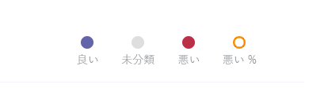

# <a name="data-and-reports-in-call-quality-dashboard-cqd"></a><span data-ttu-id="bb26d-103">通話品質ダッシュボード (CQD) のデータとレポート</span><span class="sxs-lookup"><span data-stu-id="bb26d-103">Data and reports in Call Quality Dashboard (CQD)</span></span>

<span data-ttu-id="bb26d-104">Microsoft 通話品質ダッシュボード (CQD) では、ほぼリアルタイム (NRT) のデータ フィードを使用します。</span><span class="sxs-lookup"><span data-stu-id="bb26d-104">Microsoft Call Quality Dashboard (CQD) uses a near-real-time (NRT) data feed.</span></span> <span data-ttu-id="bb26d-105">通話レコードは、通話の終了から 30 分以内に CQD で利用できます。</span><span class="sxs-lookup"><span data-stu-id="bb26d-105">Call records are available in CQD within 30 minutes of the end of a call.</span></span> <span data-ttu-id="bb26d-106">NRT パイプラインからの呼び出しレコードは、データ セットから削除される前に数か月間のみ使用できます。</span><span class="sxs-lookup"><span data-stu-id="bb26d-106">Call records from the NRT pipeline are only available for a few months before they are removed from the data set.</span></span> 


## <a name="many-ways-to-access-cqd-data"></a><span data-ttu-id="bb26d-107">CQD データにアクセスする多くの方法</span><span class="sxs-lookup"><span data-stu-id="bb26d-107">Many ways to access CQD data</span></span>

<span data-ttu-id="bb26d-108">CQD データには、さまざまな方法でアクセスできます。</span><span class="sxs-lookup"><span data-stu-id="bb26d-108">You can access CQD data by several different avenues.</span></span> <span data-ttu-id="bb26d-109">ニーズに最も合ったサービスを選択します。</span><span class="sxs-lookup"><span data-stu-id="bb26d-109">Pick the one that best meets your needs:</span></span>

|  |  |
|---------|---------|
|<span data-ttu-id="bb26d-110">Teams 管理センター [( https://admin.teams.microsoft.com) ](https://admin.teams.microsoft.com)</span><span class="sxs-lookup"><span data-stu-id="bb26d-110">Teams admin center [(https://admin.teams.microsoft.com)](https://admin.teams.microsoft.com)</span></span>    | <span data-ttu-id="bb26d-111">CQD データは Teams管理センターの [ユーザー] ページに含まれており、必要な最も一般的なデータは読みやすく表示されます。</span><span class="sxs-lookup"><span data-stu-id="bb26d-111">CQD data is included on the **Users** page in the Teams admin center, showing the most common data you need in an easy-to-read format.</span></span> <span data-ttu-id="bb26d-112">[ユーザー] の下にある CQD データをカスタマイズ **できない**。</span><span class="sxs-lookup"><span data-stu-id="bb26d-112">You can't customize CQD data that you find under **Users**.</span></span>  |
|<span data-ttu-id="bb26d-113">CQD ポータル[( https://cqd.teams.microsoft.com) ](https://cqd.teams.microsoft.com)</span><span class="sxs-lookup"><span data-stu-id="bb26d-113">CQD portal [(https://cqd.teams.microsoft.com)](https://cqd.teams.microsoft.com)</span></span>     | <span data-ttu-id="bb26d-114">ドリルスルー フィルターを使用して、ほとんどのニーズを満たす堅牢な概要レポートと詳細レポート。</span><span class="sxs-lookup"><span data-stu-id="bb26d-114">Robust summary and detailed reports that meet most needs, with drill-through filtering.</span></span> <span data-ttu-id="bb26d-115">CQD ポータルでレポートをカスタマイズすることもできます。</span><span class="sxs-lookup"><span data-stu-id="bb26d-115">You can also customize reports in the CQD portal.</span></span> <br><br><span data-ttu-id="bb26d-116">[CQD ポータルでデータを分析](#import-the-cqd-report-templates)するのに役立つ 2 つの CQD レポート テンプレートを取得します。</span><span class="sxs-lookup"><span data-stu-id="bb26d-116">Get two [CQD report templates](#import-the-cqd-report-templates) to help you analyze data in the CQD portal.</span></span>       |
|<span data-ttu-id="bb26d-117">Power BI</span><span class="sxs-lookup"><span data-stu-id="bb26d-117">Power BI</span></span>     | <span data-ttu-id="bb26d-118">直接クエリを使用して、カスタマイズ可能なテンプレートを使用して、Power BIの CQD [Power BI表示します](CQD-Power-BI-query-templates.md)。</span><span class="sxs-lookup"><span data-stu-id="bb26d-118">Use direct queries to view your CQD data in Power BI using [customizable Power BI templates](CQD-Power-BI-query-templates.md).</span></span> <span data-ttu-id="bb26d-119">[CQD Power BIクエリ テンプレートをダウンロードします](https://github.com/MicrosoftDocs/OfficeDocs-SkypeForBusiness/blob/live/Teams/downloads/CQD-Power-BI-query-templates.zip?raw=true)。</span><span class="sxs-lookup"><span data-stu-id="bb26d-119">[Download Power BI query templates for CQD](https://github.com/MicrosoftDocs/OfficeDocs-SkypeForBusiness/blob/live/Teams/downloads/CQD-Power-BI-query-templates.zip?raw=true).</span></span><br><br><span data-ttu-id="bb26d-120">REST API を[使用して、REST API を使用して CQD](/skypeforbusiness/management-tools/call-quality-dashboard/data-api)データにアクセスPower BI。</span><span class="sxs-lookup"><span data-stu-id="bb26d-120">You can also [use the REST API to access CQD data](/skypeforbusiness/management-tools/call-quality-dashboard/data-api) through Power BI.</span></span> <span data-ttu-id="bb26d-121">CQD データをダウンロードしてオフラインで作業する場合は、この方法を使用します。</span><span class="sxs-lookup"><span data-stu-id="bb26d-121">Use this method if you want to download your CQD data so you can work on it offline.</span></span> <span data-ttu-id="bb26d-122">この方法を使用する利点は、パフォーマンスが向上することです。特に、オンラインのときにデータが大量にPower BIする大規模なデータ セットに便利です。</span><span class="sxs-lookup"><span data-stu-id="bb26d-122">The benefit of using this method is better performance, especially useful for large data sets that bog down in Power BI when you're online.</span></span>       |
|<span data-ttu-id="bb26d-123">Graph API</span><span class="sxs-lookup"><span data-stu-id="bb26d-123">Graph API</span></span>     | <span data-ttu-id="bb26d-124">Graph API を使用して、[通話品質データにアクセスします](/graph/api/resources/callrecords-api-overview?view=graph-rest-beta)。</span><span class="sxs-lookup"><span data-stu-id="bb26d-124">Access call quality data yourself using the [Graph API](/graph/api/resources/callrecords-api-overview?view=graph-rest-beta).</span></span> <span data-ttu-id="bb26d-125">これは最も複雑な方法ですが、呼び出し品質データを最も柔軟に分析できます。</span><span class="sxs-lookup"><span data-stu-id="bb26d-125">This is the most complex method, but it gives you the most control and flexibility in analyzing your call quality data.</span></span> <span data-ttu-id="bb26d-126">たとえば、組織の他のデータと結合する必要がある場合は、Graph API を使用してデータ モデルを作成し、呼び出し品質データを組み込む必要があります。</span><span class="sxs-lookup"><span data-stu-id="bb26d-126">For example, if you need to join it with other data for your organization, you can use the Graph API to create a data model and incorporate call quality data.</span></span>        |

## <a name="import-the-cqd-report-templates"></a><span data-ttu-id="bb26d-127">CQD レポート テンプレートをインポートする</span><span class="sxs-lookup"><span data-stu-id="bb26d-127">Import the CQD report templates</span></span>

<span data-ttu-id="bb26d-128">[CQD レポート テンプレート](https://aka.ms/qertemplates)(すべてのネットワークと管理対象ネットワーク) を 2 つダウンロードして、CQD を迅速に使い始めることができます。</span><span class="sxs-lookup"><span data-stu-id="bb26d-128">Download [two curated CQD report templates](https://aka.ms/qertemplates) (All Networks and Managed Networks) to help you get up to speed quickly with CQD.</span></span> <span data-ttu-id="bb26d-129">すべてのネットワーク テンプレートは、建物のデータ ファイルを使用するように最適化されているにもかかわらず、次のセクションで説明するように、建物情報の収集と CQD へのアップロードに取り組む間に使用できます。</span><span class="sxs-lookup"><span data-stu-id="bb26d-129">The All Networks template, though optimized to work with a building data file, can be used while you work toward collecting and uploading building information into CQD, as described in the next section.</span></span>

<span data-ttu-id="bb26d-130">**テンプレートをインポートするには (.CQDX) を CQD に変換する**</span><span class="sxs-lookup"><span data-stu-id="bb26d-130">**To import the templates (.CQDX) into CQD**</span></span>

1. <span data-ttu-id="bb26d-131">CQD で、ページ **上部の** メニューから [詳細レポート] を選択します。</span><span class="sxs-lookup"><span data-stu-id="bb26d-131">In CQD, select **Detailed Reports** from the menu at the top of the page.</span></span>

2. <span data-ttu-id="bb26d-132">左側のパネルで、[インポート] を **選択します**。</span><span class="sxs-lookup"><span data-stu-id="bb26d-132">In the left panel, select **Import**.</span></span> <span data-ttu-id="bb26d-133">最初の CQDX テンプレートを参照し、[開く] を **選択します**。</span><span class="sxs-lookup"><span data-stu-id="bb26d-133">Browse to the first CQDX template and select **Open**.</span></span>

3. <span data-ttu-id="bb26d-134">テンプレートがアップロードされると、ポップアップ ウィンドウに "レポートのインポートが成功しました" というメッセージが表示されます。</span><span class="sxs-lookup"><span data-stu-id="bb26d-134">After the template is uploaded, a pop-up window will display the message "Report import was successful."</span></span> 

4. <span data-ttu-id="bb26d-135">2 つ目の CQD テンプレートに対して手順 2 と 3 を繰り返します。</span><span class="sxs-lookup"><span data-stu-id="bb26d-135">Repeat steps 2 and 3 for the second CQD template.</span></span>

   > [!NOTE]
   > <span data-ttu-id="bb26d-136">各ユーザーは、CQD テンプレートを CQD インスタンスにインポートする必要があります。</span><span class="sxs-lookup"><span data-stu-id="bb26d-136">Each user must import the CQD templates into their CQD instance.</span></span> 


## <a name="euii-data"></a><span data-ttu-id="bb26d-137">EUII データ</span><span class="sxs-lookup"><span data-stu-id="bb26d-137">EUII data</span></span>

<span data-ttu-id="bb26d-138">コンプライアンス上の理由から、エンドユーザーが特定できる情報 (EUII) データ (個人を特定できる情報または PII とも呼ばれる) は 28 日間のみ保持されます。</span><span class="sxs-lookup"><span data-stu-id="bb26d-138">For compliance reasons, end-user identifiable information (EUII) data (also known as personally-identifiable information or PII) is only kept for 28 days.</span></span> <span data-ttu-id="bb26d-139">NRT データが 28 日間のマークを超える場合、EUII を含むフィールドがクリアされ、EUII フリーの NRT データが生成されます。</span><span class="sxs-lookup"><span data-stu-id="bb26d-139">As NRT data crosses the 28-day mark, fields that contain EUII are cleared, resulting in EUII-free NRT data.</span></span> <span data-ttu-id="bb26d-140">EUII データを含むフィールドは次のとおりです。</span><span class="sxs-lookup"><span data-stu-id="bb26d-140">Fields that contain EUII data are:</span></span>

- <span data-ttu-id="bb26d-141">完全な IP アドレス</span><span class="sxs-lookup"><span data-stu-id="bb26d-141">Full IP address</span></span>
- <span data-ttu-id="bb26d-142">Media Access Control (MAC) アドレス</span><span class="sxs-lookup"><span data-stu-id="bb26d-142">Media Access Control (MAC) Address</span></span>
- <span data-ttu-id="bb26d-143">Basic サービス セット識別子 (BSSID)</span><span class="sxs-lookup"><span data-stu-id="bb26d-143">Basic Service Set identifier (BSSID)</span></span>
- <span data-ttu-id="bb26d-144">セッション開始プロトコル (SIP) URI (Skype for Businessのみ)</span><span class="sxs-lookup"><span data-stu-id="bb26d-144">Session Initiation Protocol (SIP) URI (Skype for Business only)</span></span>
- <span data-ttu-id="bb26d-145">ユーザー プリンシパル名 (UPN)</span><span class="sxs-lookup"><span data-stu-id="bb26d-145">User Principal Name (UPN)</span></span>
- <span data-ttu-id="bb26d-146">マシン エンドポイント名</span><span class="sxs-lookup"><span data-stu-id="bb26d-146">Machine Endpoint Name</span></span>
- <span data-ttu-id="bb26d-147">ユーザーの言葉によるフィードバック</span><span class="sxs-lookup"><span data-stu-id="bb26d-147">User Verbatim Feedback</span></span>
- <span data-ttu-id="bb26d-148">オブジェクト ID (エンドポイントのユーザーの Active Directory オブジェクト ID)</span><span class="sxs-lookup"><span data-stu-id="bb26d-148">Object ID (the Active Directory object ID of the endpoint's user)</span></span>

### <a name="admin-roles-with-and-without-euii-access"></a><span data-ttu-id="bb26d-149">EUII アクセス権を持つ管理者ロールとアクセス権のない管理者ロール</span><span class="sxs-lookup"><span data-stu-id="bb26d-149">Admin roles with and without EUII access</span></span>

<span data-ttu-id="bb26d-150">これらの [RBAC ロール](/azure/role-based-access-control/overview) には **、EUII** アクセス権があります。</span><span class="sxs-lookup"><span data-stu-id="bb26d-150">These [RBAC](/azure/role-based-access-control/overview) roles **DO** have EUII access:</span></span>
- <span data-ttu-id="bb26d-151">グローバル管理者</span><span class="sxs-lookup"><span data-stu-id="bb26d-151">Global Admin</span></span>
- <span data-ttu-id="bb26d-152">Teamsサービス管理者</span><span class="sxs-lookup"><span data-stu-id="bb26d-152">Teams Service Admin</span></span>
- <span data-ttu-id="bb26d-153">Teamsコミュニケーション管理者</span><span class="sxs-lookup"><span data-stu-id="bb26d-153">Teams Communications Admin</span></span>
- <span data-ttu-id="bb26d-154">Teams 通信サポート エンジニア</span><span class="sxs-lookup"><span data-stu-id="bb26d-154">Teams Communications Support Engineer</span></span>
- <span data-ttu-id="bb26d-155">グローバル リーダー</span><span class="sxs-lookup"><span data-stu-id="bb26d-155">Global Reader</span></span>
- <span data-ttu-id="bb26d-156">Skype for Business管理者</span><span class="sxs-lookup"><span data-stu-id="bb26d-156">Skype for Business Admin</span></span>

<span data-ttu-id="bb26d-157">これらの RBAC ロール **には** 、EUII アクセス権が付与されています。</span><span class="sxs-lookup"><span data-stu-id="bb26d-157">These RBAC roles **DON'T** have EUII access:</span></span>
- <span data-ttu-id="bb26d-158">レポート閲覧者</span><span class="sxs-lookup"><span data-stu-id="bb26d-158">Reports Reader</span></span>
- <span data-ttu-id="bb26d-159">Teams 通信サポート スペシャリスト</span><span class="sxs-lookup"><span data-stu-id="bb26d-159">Teams Communications Support Specialist</span></span>


## <a name="date-controls"></a><span data-ttu-id="bb26d-160">日付コントロール</span><span class="sxs-lookup"><span data-stu-id="bb26d-160">Date controls</span></span>

<span data-ttu-id="bb26d-161">CQD では、次のローリング 傾向の種類がサポートされています。</span><span class="sxs-lookup"><span data-stu-id="bb26d-161">CQD supports the following Rolling Trend types:</span></span>

- <span data-ttu-id="bb26d-162">5 日間</span><span class="sxs-lookup"><span data-stu-id="bb26d-162">5-day</span></span>
- <span data-ttu-id="bb26d-163">7 日間</span><span class="sxs-lookup"><span data-stu-id="bb26d-163">7-day</span></span>
- <span data-ttu-id="bb26d-164">30 日間</span><span class="sxs-lookup"><span data-stu-id="bb26d-164">30-day</span></span>
- <span data-ttu-id="bb26d-165">60 日間</span><span class="sxs-lookup"><span data-stu-id="bb26d-165">60-day</span></span>
- <span data-ttu-id="bb26d-166">90 日間</span><span class="sxs-lookup"><span data-stu-id="bb26d-166">90-day</span></span>

<span data-ttu-id="bb26d-167">URL Date パラメーターは Day フィールドを受け取ります。</span><span class="sxs-lookup"><span data-stu-id="bb26d-167">The URL Date parameter accepts a Day field.</span></span> <span data-ttu-id="bb26d-168">ローリング日レポートでは、傾向の最終日として YYYY-MM-DD 形式で指定された日付が使用されます。</span><span class="sxs-lookup"><span data-stu-id="bb26d-168">Rolling-day reports use dates specified in the YYYY-MM-DD format as the last day of the trend.</span></span> <span data-ttu-id="bb26d-169">URL Date パラメーター "00" は "today" を示します。</span><span class="sxs-lookup"><span data-stu-id="bb26d-169">The URL Date parameter “00”  indicates “today”.</span></span>

|<span data-ttu-id="bb26d-170">URL</span><span class="sxs-lookup"><span data-stu-id="bb26d-170">URL</span></span>| <span data-ttu-id="bb26d-171">ローリング 日傾向の終了日</span><span class="sxs-lookup"><span data-stu-id="bb26d-171">End date of Rolling Day Trend</span></span>|
|:---|:---|
|<span data-ttu-id="bb26d-172"><span>https:// <cqdv3> /spd/#/Dashboard/ <reportid> /2019-02/</span></span><span class="sxs-lookup"><span data-stu-id="bb26d-172"><span>https://<cqdv3>/spd/#/Dashboard/<reportid>/2019-02/</span></span></span>   |<span data-ttu-id="bb26d-173">2019 年 2 月の現在の日</span><span class="sxs-lookup"><span data-stu-id="bb26d-173">Current Day of Feb 2019</span></span>|
|<span data-ttu-id="bb26d-174"><span>https:// <cqdv3> /spd/#/Dashboard/ <reportid> /2019-02-15/</span></span><span class="sxs-lookup"><span data-stu-id="bb26d-174"><span>https://<cqdv3>/spd/#/Dashboard/<reportid>/2019-02-15/</span></span></span>|<span data-ttu-id="bb26d-175">2019 年 2 月 15 日</span><span class="sxs-lookup"><span data-stu-id="bb26d-175">Feb 15, 2019</span></span>|
|<span data-ttu-id="bb26d-176"><span>https:// <cqdv3> /spd/#/Dashboard/ <reportid> /00/</span></span><span class="sxs-lookup"><span data-stu-id="bb26d-176"><span>https://<cqdv3>/spd/#/Dashboard/<reportid>/00/</span></span></span>        |<span data-ttu-id="bb26d-177">現在の日</span><span class="sxs-lookup"><span data-stu-id="bb26d-177">Current Day</span></span>|
|||

<span data-ttu-id="bb26d-178">既定では、月の現在の日がローリング 日傾向の最終日として使用されます。</span><span class="sxs-lookup"><span data-stu-id="bb26d-178">By default, the current day of the month is used as the last day of the Rolling Day Trend.</span></span>


## <a name="data-available-in-cqd-reports"></a><span data-ttu-id="bb26d-179">CQD レポートで使用可能なデータ</span><span class="sxs-lookup"><span data-stu-id="bb26d-179">Data available in CQD reports</span></span>

<span data-ttu-id="bb26d-180">既定の概要と詳細な CQD レポートは、組織の通話品質を管理するために必要なすべてである可能性があります。必要に応じて、カスタム レポート [を作成できます](#create-custom-detailed-reports)。</span><span class="sxs-lookup"><span data-stu-id="bb26d-180">The default summary and detailed CQD reports may be all you need to manage call quality for your org. If you need to, you can [create custom reports](#create-custom-detailed-reports).</span></span> 

<span data-ttu-id="bb26d-181">CQD データをPower BIする場合は、「Use Power BI to analyze [CQD data for Teams](CQD-Power-BI-query-templates.md)」を参照してください。</span><span class="sxs-lookup"><span data-stu-id="bb26d-181">If you want to use Power BI to analyze your CQD data, read [Use Power BI to analyze CQD data for Teams](CQD-Power-BI-query-templates.md).</span></span>

|<span data-ttu-id="bb26d-182">機能</span><span class="sxs-lookup"><span data-stu-id="bb26d-182">Feature</span></span>|<span data-ttu-id="bb26d-183">サマリー レポート</span><span class="sxs-lookup"><span data-stu-id="bb26d-183">Summary Reports</span></span>|<span data-ttu-id="bb26d-184">詳細レポート</span><span class="sxs-lookup"><span data-stu-id="bb26d-184">Detailed Reports</span></span>|
|:--- |:--- |:--- |
|<span data-ttu-id="bb26d-185">アプリケーション共有メトリック</span><span class="sxs-lookup"><span data-stu-id="bb26d-185">Application sharing metric</span></span> | <span data-ttu-id="bb26d-186">いいえ</span><span class="sxs-lookup"><span data-stu-id="bb26d-186">No</span></span> | <span data-ttu-id="bb26d-187">はい</span><span class="sxs-lookup"><span data-stu-id="bb26d-187">Yes</span></span> |
|<span data-ttu-id="bb26d-188">顧客の建物情報のサポート</span><span class="sxs-lookup"><span data-stu-id="bb26d-188">Customer building information support</span></span> | <span data-ttu-id="bb26d-189">はい</span><span class="sxs-lookup"><span data-stu-id="bb26d-189">Yes</span></span> | <span data-ttu-id="bb26d-190">はい</span><span class="sxs-lookup"><span data-stu-id="bb26d-190">Yes</span></span> |
|<span data-ttu-id="bb26d-191">顧客エンドポイント情報のサポート</span><span class="sxs-lookup"><span data-stu-id="bb26d-191">Customer endpoint information support</span></span> | <span data-ttu-id="bb26d-192">cqd.teams.microsoft.com <span><span/></span><span class="sxs-lookup"><span data-stu-id="bb26d-192">Only in <span>cqd.teams.microsoft.com<span/></span></span> | <span data-ttu-id="bb26d-193">cqd.teams.microsoft.com <span><span/></span><span class="sxs-lookup"><span data-stu-id="bb26d-193">Only in <span>cqd.teams.microsoft.com<span/></span></span> |
|<span data-ttu-id="bb26d-194">ドリルダウン分析のサポート</span><span class="sxs-lookup"><span data-stu-id="bb26d-194">Drill down analysis support</span></span>   | <span data-ttu-id="bb26d-195">いいえ</span><span class="sxs-lookup"><span data-stu-id="bb26d-195">No</span></span>   | <span data-ttu-id="bb26d-196">はい</span><span class="sxs-lookup"><span data-stu-id="bb26d-196">Yes</span></span>   |
|<span data-ttu-id="bb26d-197">メディア信頼性メトリック</span><span class="sxs-lookup"><span data-stu-id="bb26d-197">Media reliability metrics</span></span>   | <span data-ttu-id="bb26d-198">いいえ</span><span class="sxs-lookup"><span data-stu-id="bb26d-198">No</span></span>   | <span data-ttu-id="bb26d-199">はい</span><span class="sxs-lookup"><span data-stu-id="bb26d-199">Yes</span></span>   |
|<span data-ttu-id="bb26d-200">Out-of-the-box reports</span><span class="sxs-lookup"><span data-stu-id="bb26d-200">Out-of-the-box reports</span></span>   | <span data-ttu-id="bb26d-201">はい</span><span class="sxs-lookup"><span data-stu-id="bb26d-201">Yes</span></span>   | <span data-ttu-id="bb26d-202">はい</span><span class="sxs-lookup"><span data-stu-id="bb26d-202">Yes</span></span>   |
|<span data-ttu-id="bb26d-203">概要レポート</span><span class="sxs-lookup"><span data-stu-id="bb26d-203">Overview reports</span></span>   | <span data-ttu-id="bb26d-204">はい</span><span class="sxs-lookup"><span data-stu-id="bb26d-204">Yes</span></span>   | <span data-ttu-id="bb26d-205">はい</span><span class="sxs-lookup"><span data-stu-id="bb26d-205">Yes</span></span>   |
|<span data-ttu-id="bb26d-206">ユーザーごとのレポート セット</span><span class="sxs-lookup"><span data-stu-id="bb26d-206">Per-user report set</span></span>   | <span data-ttu-id="bb26d-207">いいえ</span><span class="sxs-lookup"><span data-stu-id="bb26d-207">No</span></span>   | <span data-ttu-id="bb26d-208">はい</span><span class="sxs-lookup"><span data-stu-id="bb26d-208">Yes</span></span>   |
|<span data-ttu-id="bb26d-209">レポート セットのカスタマイズ (レポートの追加、削除、変更)</span><span class="sxs-lookup"><span data-stu-id="bb26d-209">Report set customization (add, delete, modify reports)</span></span>   | <span data-ttu-id="bb26d-210">いいえ</span><span class="sxs-lookup"><span data-stu-id="bb26d-210">No</span></span>   | <span data-ttu-id="bb26d-211">はい</span><span class="sxs-lookup"><span data-stu-id="bb26d-211">Yes</span></span>   |
|<span data-ttu-id="bb26d-212">ビデオベースの画面共有メトリック</span><span class="sxs-lookup"><span data-stu-id="bb26d-212">Video-based screen sharing metrics</span></span>   | <span data-ttu-id="bb26d-213">いいえ</span><span class="sxs-lookup"><span data-stu-id="bb26d-213">No</span></span>   | <span data-ttu-id="bb26d-214">はい</span><span class="sxs-lookup"><span data-stu-id="bb26d-214">Yes</span></span>   |
|<span data-ttu-id="bb26d-215">ビデオ メトリック</span><span class="sxs-lookup"><span data-stu-id="bb26d-215">Video metrics</span></span>   | <span data-ttu-id="bb26d-216">いいえ</span><span class="sxs-lookup"><span data-stu-id="bb26d-216">No</span></span>   | <span data-ttu-id="bb26d-217">はい</span><span class="sxs-lookup"><span data-stu-id="bb26d-217">Yes</span></span>   |
|<span data-ttu-id="bb26d-218">使用可能なデータの量</span><span class="sxs-lookup"><span data-stu-id="bb26d-218">Amount of data available</span></span>   | <span data-ttu-id="bb26d-219">過去 12 か月</span><span class="sxs-lookup"><span data-stu-id="bb26d-219">Last 12 months</span></span>   | <span data-ttu-id="bb26d-220">過去 12 か月</span><span class="sxs-lookup"><span data-stu-id="bb26d-220">Last 12 months</span></span>   |
|<span data-ttu-id="bb26d-221">Microsoft Teamsデータ</span><span class="sxs-lookup"><span data-stu-id="bb26d-221">Microsoft Teams data</span></span>   | <span data-ttu-id="bb26d-222">はい</span><span class="sxs-lookup"><span data-stu-id="bb26d-222">Yes</span></span>   | <span data-ttu-id="bb26d-223">はい</span><span class="sxs-lookup"><span data-stu-id="bb26d-223">Yes</span></span>   |
| | | |


 
### <a name="select-product-data-to-see-in-reports"></a><span data-ttu-id="bb26d-224">レポートに表示する製品データを選択する</span><span class="sxs-lookup"><span data-stu-id="bb26d-224">Select product data to see in reports</span></span>

<span data-ttu-id="bb26d-225">[概要] レポートと [Location-Enhanced レポート] では、[製品フィルター] ドロップダウンを使用して、すべての製品データを表示したり、Microsoft Teams データのみを表示したり、Skype for Business Online データのみを表示したりすることができます。</span><span class="sxs-lookup"><span data-stu-id="bb26d-225">In the Summary and Location-Enhanced Reports, you can use the **Product Filter** drop-down to show all product data, only Microsoft Teams data, or only Skype for Business Online data.</span></span>

> [!div class="mx-imgBorder"]
> <span data-ttu-id="bb26d-226">![スクリーンショット: [製品フィルター] コントロール オプションを示す](media/206ad818-0f72-4c8e-b25e-3cc8fcfbef05.png)</span><span class="sxs-lookup"><span data-stu-id="bb26d-226"></span></span>
  
<span data-ttu-id="bb26d-227">詳細レポートでは、[Is **Teams]** ディメンションを使用して、オンライン データをMicrosoft TeamsまたはSkype for Businessフィルター処理できます。</span><span class="sxs-lookup"><span data-stu-id="bb26d-227">In Detailed reports, you can use the **Is Teams** dimension to filter the data to Microsoft Teams or Skype for Business Online data.</span></span>

## <a name="summary-reports"></a><span data-ttu-id="bb26d-228">サマリー レポート</span><span class="sxs-lookup"><span data-stu-id="bb26d-228">Summary Reports</span></span>

<span data-ttu-id="bb26d-229">これらは、CQD に初めてサインインするときに CQD ダッシュボードに表示されるレポートです。</span><span class="sxs-lookup"><span data-stu-id="bb26d-229">These are the reports that you'll see on the CQD Dashboard when you first sign in to CQD.</span></span> <span data-ttu-id="bb26d-230">日次レポート、月次レポート、テーブル レポートを使用して品質の傾向を一目で確認し、品質の低いサブネットを特定できるようにします。</span><span class="sxs-lookup"><span data-stu-id="bb26d-230">They give you an at-a-glance look at quality trends with daily, monthly, and table reports to assist with identifying subnets that have poor quality.</span></span> 

| <span data-ttu-id="bb26d-231">Tab</span><span class="sxs-lookup"><span data-stu-id="bb26d-231">Tab</span></span> | <span data-ttu-id="bb26d-232">説明</span><span class="sxs-lookup"><span data-stu-id="bb26d-232">Description</span></span> |
|---------|---------|
|<span data-ttu-id="bb26d-233">全体的な通話品質</span><span class="sxs-lookup"><span data-stu-id="bb26d-233">Overall Call Quality</span></span>     | <span data-ttu-id="bb26d-234">他の 3 つのタブの集計。</span><span class="sxs-lookup"><span data-stu-id="bb26d-234">Aggregate of the other 3 tabs.</span></span>       |
|<span data-ttu-id="bb26d-235">サーバー - クライアント</span><span class="sxs-lookup"><span data-stu-id="bb26d-235">Server—Client</span></span>     |<span data-ttu-id="bb26d-236">サーバーエンドポイントとクライアント エンドポイント間のストリームの詳細。</span><span class="sxs-lookup"><span data-stu-id="bb26d-236">Details of the streams between server and client endpoints.</span></span>        |
|<span data-ttu-id="bb26d-237">クライアント - クライアント</span><span class="sxs-lookup"><span data-stu-id="bb26d-237">Client—Client</span></span>     |<span data-ttu-id="bb26d-238">2 つのクライアント エンドポイント間のストリームの詳細。</span><span class="sxs-lookup"><span data-stu-id="bb26d-238">Details of the streams between two client endpoints.</span></span>        |
|<span data-ttu-id="bb26d-239">音声品質 SLA</span><span class="sxs-lookup"><span data-stu-id="bb26d-239">Voice Quality SLA</span></span>     |<span data-ttu-id="bb26d-240">音声品質 SLA に関するSkype for Businessに関する[情報](https://go.microsoft.com/fwlink/p/?linkid=846252)。</span><span class="sxs-lookup"><span data-stu-id="bb26d-240">Info about calls included in the Skype for Business voice quality [SLA](https://go.microsoft.com/fwlink/p/?linkid=846252).</span></span>        |

### <a name="overall-call-quality-tab"></a><span data-ttu-id="bb26d-241">[全体的な通話品質] タブ</span><span class="sxs-lookup"><span data-stu-id="bb26d-241">Overall Call Quality tab</span></span>

<span data-ttu-id="bb26d-242">このタブのデータを使用して、ストリーム数と低品質のパーセンテージに基づいて通話品質の状態と傾向を評価します。</span><span class="sxs-lookup"><span data-stu-id="bb26d-242">Use the data on this tab to evaluate call quality status and trends based on stream counts and poor percentages.</span></span> <span data-ttu-id="bb26d-243">右上隅の凡例には、これらのメトリックを表す色と視覚的な要素が表示されます。</span><span class="sxs-lookup"><span data-stu-id="bb26d-243">The legend in the upper-right corner shows which color and visual elements represent these metrics.</span></span>

> [!div class="mx-imgBorder"]
> <span data-ttu-id="bb26d-244">![スクリーンショット: [通話品質] タブを表示する](media/c8d183b1-6592-49b0-a81d-35cc0568d5f0.png)</span><span class="sxs-lookup"><span data-stu-id="bb26d-244"></span></span>
  
<span data-ttu-id="bb26d-245">ストリームは、Good、Poor、Unclassified の 3 つのグループに分類されます。</span><span class="sxs-lookup"><span data-stu-id="bb26d-245">Streams are classified in three groups: Good, Poor, and Unclassified.</span></span> <span data-ttu-id="bb26d-246">また、低品質として分類 *された* ストリームの総数に対する割合を示す低品質 % 値も計算されます。</span><span class="sxs-lookup"><span data-stu-id="bb26d-246">There are also calculated  *Poor %*  values that give you the ratio of streams classified as *Poor*  to the total classified stream count.</span></span> <span data-ttu-id="bb26d-247">Poor *% = Poor streams/ (Poor streams + Good streams) \* 100*, Poor *%*  は、複数の未分類ストリームの存在の影響を *受*  けません。</span><span class="sxs-lookup"><span data-stu-id="bb26d-247">Since *Poor % = Poor streams/ (Poor streams+ Good streams) \* 100*, the *Poor %*  is unaffected by the presence of multiple *Unclassified*  streams.</span></span> <span data-ttu-id="bb26d-248">ストリームを低品質または良好と分類する方法については、「通話品質ダッシュボードのストリーム分類 [」を参照してください](stream-classification-in-call-quality-dashboard.md)。</span><span class="sxs-lookup"><span data-stu-id="bb26d-248">To see what classifies a stream as poor or good, refer to [Stream Classification in Call Quality Dashboard](stream-classification-in-call-quality-dashboard.md).</span></span>
  
<span data-ttu-id="bb26d-249">左側のスケールを使用して、ストリーム数の値を測定します。</span><span class="sxs-lookup"><span data-stu-id="bb26d-249">Use the scale on the left to measure the stream count values.</span></span>

> [!div class="mx-imgBorder"]
> <span data-ttu-id="bb26d-250"></span><span class="sxs-lookup"><span data-stu-id="bb26d-250"></span></span>
  
<span data-ttu-id="bb26d-251">右側のスケールを使用して、低品質 % の値を測定します。</span><span class="sxs-lookup"><span data-stu-id="bb26d-251">Use the scale on the right to measure the Poor % values.</span></span>

> [!div class="mx-imgBorder"]
> <span data-ttu-id="bb26d-252"></span><span class="sxs-lookup"><span data-stu-id="bb26d-252"></span></span>
  
<span data-ttu-id="bb26d-253">バーの上にマウス ポインターを置くと、実際の数値を取得することもできます。</span><span class="sxs-lookup"><span data-stu-id="bb26d-253">You can also obtain the actual numerical values by hovering the mouse over a bar.</span></span>
  
> [!NOTE]
> <span data-ttu-id="bb26d-254">次の例は非常に小さなサンプル データ セットの例であり、実際のデプロイでは値は現実的ではありません。</span><span class="sxs-lookup"><span data-stu-id="bb26d-254">The following example is from a very small sample data set, and the values aren't realistic for an actual deployment.</span></span>

> [!div class="mx-imgBorder"]
> <span data-ttu-id="bb26d-255"></span><span class="sxs-lookup"><span data-stu-id="bb26d-255"></span></span>
  
<span data-ttu-id="bb26d-256">全体的なストリーム ボリュームは、計算された低品質パーセンテージの関連性を判断するのに役立ちます。</span><span class="sxs-lookup"><span data-stu-id="bb26d-256">The overall stream volume helps determine how relevant the calculated Poor percentages are.</span></span> <span data-ttu-id="bb26d-257">ストリーム全体のボリュームが小さいと、報告される低品質パーセンテージ値の信頼性が低下します。</span><span class="sxs-lookup"><span data-stu-id="bb26d-257">The smaller the volume of overall streams, the less reliable the reported Poor percentage values are.</span></span>
  
### <a name="server-client-tab-and-client-client-tabs"></a><span data-ttu-id="bb26d-258">Server-ClientタブとClient-Clientタブ</span><span class="sxs-lookup"><span data-stu-id="bb26d-258">Server-Client tab and Client-Client tabs</span></span>

<span data-ttu-id="bb26d-259">これら 2 つのタブは、エンドポイント間のシナリオで発生したストリームの詳細を示します。</span><span class="sxs-lookup"><span data-stu-id="bb26d-259">These two tabs provide details for the streams that took place in their endpoint-to-endpoint scenarios.</span></span> <span data-ttu-id="bb26d-260">[Server-Client] タブには、メディア ストリームが流れる 4 つのシナリオを表す 4 つの折りたたみ可能なセクションがあります。</span><span class="sxs-lookup"><span data-stu-id="bb26d-260">The Server-Client tab has four collapsible sections that represent four scenarios under which media streams would flow.</span></span>
  
- <span data-ttu-id="bb26d-261">内部のワイヤード</span><span class="sxs-lookup"><span data-stu-id="bb26d-261">Wired Inside</span></span>
- <span data-ttu-id="bb26d-262">有線 (外部)</span><span class="sxs-lookup"><span data-stu-id="bb26d-262">Wired Outside</span></span>
- <span data-ttu-id="bb26d-263">WiFi Inside</span><span class="sxs-lookup"><span data-stu-id="bb26d-263">WiFi Inside</span></span>
- <span data-ttu-id="bb26d-264">WiFi Outside</span><span class="sxs-lookup"><span data-stu-id="bb26d-264">WiFi Outside</span></span>

<span data-ttu-id="bb26d-265">同様に、[Client-Client] タブには、次の 5 つの折りたたみ可能なセクションがあります。</span><span class="sxs-lookup"><span data-stu-id="bb26d-265">Similarly, the Client-Client tab has five collapsible sections:</span></span>

- <span data-ttu-id="bb26d-266">内部のワイヤード ( 内部のワイヤード)</span><span class="sxs-lookup"><span data-stu-id="bb26d-266">Wired Inside — Wired Inside</span></span>
- <span data-ttu-id="bb26d-267">内部のワイヤード ( 外部のワイヤード)</span><span class="sxs-lookup"><span data-stu-id="bb26d-267">Wired Inside — Wired Outside</span></span>
- <span data-ttu-id="bb26d-268">有線 (外部) - 有線 (外部)</span><span class="sxs-lookup"><span data-stu-id="bb26d-268">Wired Outside — Wired Outside</span></span>
- <span data-ttu-id="bb26d-269">有線内部 — WiFi Inside</span><span class="sxs-lookup"><span data-stu-id="bb26d-269">Wired Inside — WiFi Inside</span></span>
- <span data-ttu-id="bb26d-270">内部の有線 — WiFi Outside</span><span class="sxs-lookup"><span data-stu-id="bb26d-270">Wired Inside — WiFi Outside</span></span>

#### <a name="inside-versus-outside"></a><span data-ttu-id="bb26d-271">Inside と Outside の比較</span><span class="sxs-lookup"><span data-stu-id="bb26d-271">Inside versus Outside</span></span>

<span data-ttu-id="bb26d-272">CQD は、Building 情報を使用してストリームを  *Inside*  または *Outside*  として分類します (存在する場合)。</span><span class="sxs-lookup"><span data-stu-id="bb26d-272">CQD classifies a stream as  *Inside*  or *Outside*  using Building information, if it exists.</span></span> <span data-ttu-id="bb26d-273">各ストリームのエンドポイントは、サブネット アドレスに関連付けされます。</span><span class="sxs-lookup"><span data-stu-id="bb26d-273">Endpoints of each stream are associated with a subnet address.</span></span> <span data-ttu-id="bb26d-274">アップロードされた建物情報で InsideCorp とマークされているサブネットの一覧にサブネットがある場合、そのサブネットは Inside と見 *なされます*。</span><span class="sxs-lookup"><span data-stu-id="bb26d-274">If the subnet is in the list of the subnets marked InsideCorp in the uploaded Building information, then it is considered *Inside*.</span></span> <span data-ttu-id="bb26d-275">Building 情報がまだアップロードされていない場合、Inside Test は常にストリームを Outside として分類 *します*。</span><span class="sxs-lookup"><span data-stu-id="bb26d-275">If Building information has not yet been uploaded, then Inside Test always classifies the streams as *Outside*.</span></span> 

<span data-ttu-id="bb26d-276">テスト シナリオの Inside Test Server-Clientクライアント エンドポイントのみを考慮します。</span><span class="sxs-lookup"><span data-stu-id="bb26d-276">The Inside Test for a Server-Client scenario only considers the client endpoint.</span></span> <span data-ttu-id="bb26d-277">サーバーは常にユーザーの観点から外部に存在しますが、これはテストでは考慮されません。</span><span class="sxs-lookup"><span data-stu-id="bb26d-277">Because servers are always outside from a user's perspective, this isn't accounted for in the test.</span></span>
  
#### <a name="wired-versus-wifi"></a><span data-ttu-id="bb26d-278">有線と WiFi</span><span class="sxs-lookup"><span data-stu-id="bb26d-278">Wired versus WiFi</span></span>

<span data-ttu-id="bb26d-279">名前が示す通り、分類基準はクライアント接続の種類に基づいて行います。</span><span class="sxs-lookup"><span data-stu-id="bb26d-279">As the names indicate, the classification criteria is based on the type of client connections.</span></span> <span data-ttu-id="bb26d-280">サーバーは常に有線であり、計算には含まれません。</span><span class="sxs-lookup"><span data-stu-id="bb26d-280">Server is always wired and it isn't included in the calculation.</span></span> <span data-ttu-id="bb26d-281">特定のストリームで、2 つのエンドポイントの 1 つが WiFi ネットワークに接続されている場合、CQD は WiFi として分類します。</span><span class="sxs-lookup"><span data-stu-id="bb26d-281">In a given stream, if one of the two endpoints is connected to a WiFi network, then CQD classifies it as WiFi.</span></span>

> [!NOTE]
> <span data-ttu-id="bb26d-282">ストリームの場合、2 つのエンドポイントの 1 つが WiFi ネットワークに接続されている場合、CQD では WiFi として分類されます。</span><span class="sxs-lookup"><span data-stu-id="bb26d-282">Given a stream, if one of the two endpoints is connected to a WiFi network, then it is classified as WiFi in CQD.</span></span>
  
  
## <a name="tenant-data-information"></a><span data-ttu-id="bb26d-283">テナント データ情報</span><span class="sxs-lookup"><span data-stu-id="bb26d-283">Tenant Data information</span></span>

<span data-ttu-id="bb26d-284">CQD サマリー レポート ダッシュボードには、[テナント データ アップロード] ページが表示され、右上隅の [設定] メニューから **[** テナント データ アップロード] を選択してアクセスできます。</span><span class="sxs-lookup"><span data-stu-id="bb26d-284">The CQD Summary Reports dashboard includes a **Tenant Data Upload** page, accessed by selecting **Tenant Data Upload** from the settings menu in the top-right corner.</span></span> <span data-ttu-id="bb26d-285">このページは、管理者が次のような独自の情報をアップロードするために使用されます。</span><span class="sxs-lookup"><span data-stu-id="bb26d-285">This page is used for admins to upload their own information, such as:</span></span>

- <span data-ttu-id="bb26d-286">IP アドレスと地理的情報のマップ。</span><span class="sxs-lookup"><span data-stu-id="bb26d-286">A map of IP address and geographical information.</span></span>
- <span data-ttu-id="bb26d-287">各ワイヤレス AP とその MAC アドレスのマップ。</span><span class="sxs-lookup"><span data-stu-id="bb26d-287">A map of each wireless AP and its MAC address.</span></span>
- <span data-ttu-id="bb26d-288">エンドポイントからエンドポイントの作成/モデル/種類などのマップ。</span><span class="sxs-lookup"><span data-stu-id="bb26d-288">A map of Endpoint to Endpoint Make/Model/Type, etc.</span></span>
  
<span data-ttu-id="bb26d-289">CQD がレポートにこの情報を含めできるよう、テナント、建物、場所のデータをアップロードすることをお勧めします。</span><span class="sxs-lookup"><span data-stu-id="bb26d-289">We recommend that you upload your tenant, building, and location data so CQD can include this information in your reports.</span></span> <span data-ttu-id="bb26d-290">このデータをまだアップロードしていない場合は、テナントを読アップロード[データを作成します](CQD-upload-tenant-building-data.md)。</span><span class="sxs-lookup"><span data-stu-id="bb26d-290">If you haven't already uploaded this data, read [Upload tenant and building data](CQD-upload-tenant-building-data.md).</span></span> 


## <a name="detailed-reports"></a><span data-ttu-id="bb26d-291">詳細レポート</span><span class="sxs-lookup"><span data-stu-id="bb26d-291">Detailed reports</span></span>

| <span data-ttu-id="bb26d-292">名前</span><span class="sxs-lookup"><span data-stu-id="bb26d-292">Name</span></span> | <span data-ttu-id="bb26d-293">説明</span><span class="sxs-lookup"><span data-stu-id="bb26d-293">Description</span></span> |
|---------|---------|
|<span data-ttu-id="bb26d-294">Location-Enhanced レポート</span><span class="sxs-lookup"><span data-stu-id="bb26d-294">Location-Enhanced Reports</span></span>     |<span data-ttu-id="bb26d-295">場所情報に基づいて品質の傾向を表示します。</span><span class="sxs-lookup"><span data-stu-id="bb26d-295">Shows quality trends based on location information.</span></span> <span data-ttu-id="bb26d-296">このレポートは、テナント データ をアップロード [した場合にのみ表示されます](CQD-upload-tenant-building-data.md)。</span><span class="sxs-lookup"><span data-stu-id="bb26d-296">This report appears only if you've [uploaded your tenant data](CQD-upload-tenant-building-data.md).</span></span>        |
|<span data-ttu-id="bb26d-297">信頼性レポート</span><span class="sxs-lookup"><span data-stu-id="bb26d-297">Reliability Reports</span></span>     |<span data-ttu-id="bb26d-298">オーディオ、ビデオ、ビデオベースの画面共有 (VBSS)、アプリ共有レポートが含まれます。</span><span class="sxs-lookup"><span data-stu-id="bb26d-298">Includes audio, video, video-based screen sharing (VBSS), and app sharing reports.</span></span>        |
|<span data-ttu-id="bb26d-299">Quality of Experience Reports</span><span class="sxs-lookup"><span data-stu-id="bb26d-299">Quality of Experience Reports</span></span>     |<span data-ttu-id="bb26d-300">会議室を含むすべてのクライアントとデバイスのオーディオ品質と信頼性。</span><span class="sxs-lookup"><span data-stu-id="bb26d-300">Audio quality and reliability for all clients and devices, including meeting rooms.</span></span> <span data-ttu-id="bb26d-301">これらのレポートは、ダウンロード可能 [な CQD](https://aka.ms/QERtemplates)テンプレートの "スリムダウン" バージョンであり、オーディオの品質と信頼性を分析するための重要な領域に重点を置いて説明します。</span><span class="sxs-lookup"><span data-stu-id="bb26d-301">These reports are a “slimmed-down” version of the downloadable [CQD templates](https://aka.ms/QERtemplates), focusing on key areas for analyzing audio quality and reliability.</span></span>         |
|<span data-ttu-id="bb26d-302">品質ドリルダウン レポート</span><span class="sxs-lookup"><span data-stu-id="bb26d-302">Quality Drill Down Reports</span></span>     | <span data-ttu-id="bb26d-303">ドリルダウン: 地域、場所、サブネット、時間、およびユーザー別の日付。</span><span class="sxs-lookup"><span data-stu-id="bb26d-303">Drill downs: Date by region, locations, subnets, hour, and users.</span></span>        |
|<span data-ttu-id="bb26d-304">障害のドリルダウン レポート</span><span class="sxs-lookup"><span data-stu-id="bb26d-304">Failure Drill Down Reports</span></span>     | <span data-ttu-id="bb26d-305">ドリルダウン: 地域、場所、サブネット、時間、およびユーザー別の日付。</span><span class="sxs-lookup"><span data-stu-id="bb26d-305">Drill downs: Date by region, locations, subnets, hour, and users.</span></span>        |
|<span data-ttu-id="bb26d-306">通話レポートの評価</span><span class="sxs-lookup"><span data-stu-id="bb26d-306">Rate My Call Reports</span></span>     |<span data-ttu-id="bb26d-307">地域、場所、またはユーザー別のユーザー呼び出しの評価を分析します。</span><span class="sxs-lookup"><span data-stu-id="bb26d-307">Analyze user call ratings by region, location, or by user.</span></span> <span data-ttu-id="bb26d-308">詳細なフィードバックが含まれます。</span><span class="sxs-lookup"><span data-stu-id="bb26d-308">Includes verbatim feedback.</span></span>         |
|<span data-ttu-id="bb26d-309">ヘルプ デスク レポート</span><span class="sxs-lookup"><span data-stu-id="bb26d-309">Help Desk Reports</span></span>     |<span data-ttu-id="bb26d-310">ヘルプ デスク レポートでは、個々のユーザー、ユーザーのグループ、または全員の通話データと会議データが表示されます。</span><span class="sxs-lookup"><span data-stu-id="bb26d-310">Help Desk Reports look at call and meeting data for individual users, groups of users, or everyone.</span></span> <span data-ttu-id="bb26d-311">これらのレポートは、建物と EUII データを組み込むことで、ネットワークの場所、会議の詳細、デバイス、またはファームウェアに基づいて、考えられるシステムの問題を特定するのに役立ちます。</span><span class="sxs-lookup"><span data-stu-id="bb26d-311">Incorporating building and EUII data, these reports help identify possible system issues based on network location, conference details, devices, or firmware.</span></span>         |
|<span data-ttu-id="bb26d-312">クライアント バージョン レポート</span><span class="sxs-lookup"><span data-stu-id="bb26d-312">Client Version Reports</span></span>     |<span data-ttu-id="bb26d-313">クライアント バージョンの概要: クライアント アプリのバージョンごとにセッション数とユーザー数を表示する</span><span class="sxs-lookup"><span data-stu-id="bb26d-313">Client Version Summary: View the Sessions and Users counts for each client app version</span></span><br><br><span data-ttu-id="bb26d-314">ユーザー別のクライアント バージョン: クライアント アプリのバージョンごとにユーザー名を表示する</span><span class="sxs-lookup"><span data-stu-id="bb26d-314">Client Version by User: View user names for each client app version</span></span> <br><br><span data-ttu-id="bb26d-315">製品とクライアントの種類の事前構築済みフィルターは、特定のクライアントにバージョンを集中するのに役立ちます。</span><span class="sxs-lookup"><span data-stu-id="bb26d-315">Pre-built filters for Product and Client Type help focus the versions to specific clients.</span></span>         |
|<span data-ttu-id="bb26d-316">エンドポイント レポート</span><span class="sxs-lookup"><span data-stu-id="bb26d-316">Endpoint Reports</span></span>     |<span data-ttu-id="bb26d-317">マシン エンドポイント別の呼び出し品質 (コンピューターの作成とモデル) を示します。</span><span class="sxs-lookup"><span data-stu-id="bb26d-317">Shows call quality by machine endpoints (computer make and model).</span></span> <span data-ttu-id="bb26d-318">これらのレポートには、アップロードした場合のデータの作成が含まれます。</span><span class="sxs-lookup"><span data-stu-id="bb26d-318">These reports include building data, if you've uploaded it.</span></span>         |


## <a name="create-custom-detailed-reports"></a><span data-ttu-id="bb26d-319">カスタムの詳細レポートを作成する</span><span class="sxs-lookup"><span data-stu-id="bb26d-319">Create custom detailed reports</span></span>

<span data-ttu-id="bb26d-320">既定の CQD レポートがニーズを満たしない場合は、次の手順に従ってカスタム レポートを作成します。</span><span class="sxs-lookup"><span data-stu-id="bb26d-320">If the default CQD reports don't meet your needs, use these instructions to create a custom report.</span></span> <span data-ttu-id="bb26d-321">または (2020 年 1 月の) 代わりに[CQD Power BIを使用](cqd-power-bi-query-templates.md)します。</span><span class="sxs-lookup"><span data-stu-id="bb26d-321">Or (as of January 2020) [Use Power BI for CQD reports ](cqd-power-bi-query-templates.md)instead.</span></span>

<span data-ttu-id="bb26d-322">ログイン時に表示される画面の上部にあるレポートのプルダウン リストから、[概要レポート] 画面で [詳細レポート] を選択し、[新規] を \(  \) **選択します**。</span><span class="sxs-lookup"><span data-stu-id="bb26d-322">From the pull-down list of reports at the top of the screen displayed at login \(the **Summary Reports** screen\) Select **Detailed Reports**  and then **New**.</span></span> <span data-ttu-id="bb26d-323">クエリ **エディターを** 表示するには、レポートの [編集] をクリックします。</span><span class="sxs-lookup"><span data-stu-id="bb26d-323">Click **Edit** in a report to see the Query Editor.</span></span> <span data-ttu-id="bb26d-324">それぞれのレポートは、キューブに対するクエリに基づきます。</span><span class="sxs-lookup"><span data-stu-id="bb26d-324">Each report is backed by a query into the cube.</span></span> <span data-ttu-id="bb26d-325">レポートは、クエリから返されたデータを視覚化したものです。</span><span class="sxs-lookup"><span data-stu-id="bb26d-325">A report is a visualization of the data returned by its query.</span></span> <span data-ttu-id="bb26d-326">クエリ エディターを使用すると、これらのクエリとレポートの表示オプションを編集できます。</span><span class="sxs-lookup"><span data-stu-id="bb26d-326">The Query Editor helps you edit these queries and the display options of the report.</span></span>

> [!IMPORTANT]
> <span data-ttu-id="bb26d-327">ネットワーク範囲は、スーパーネット (複数のサブネットと 1 つのルーティング プレフィックスの組み合わせ) を表す場合に使用できます。</span><span class="sxs-lookup"><span data-stu-id="bb26d-327">The network range can be used to represent a supernet (combination of several subnets with a single routing prefix).</span></span> <span data-ttu-id="bb26d-328">新しい建物のアップロードはすべて、重複する範囲がチェックされます。</span><span class="sxs-lookup"><span data-stu-id="bb26d-328">All new building uploads will be checked for any overlapping ranges.</span></span> <span data-ttu-id="bb26d-329">以前に建物のファイルをアップロードした場合は、現在のファイルをダウンロードし、再アップロードして重複を特定し、問題を修正してから、もう一度アップロードする必要があります。</span><span class="sxs-lookup"><span data-stu-id="bb26d-329">If you have previously uploaded a building file, you should download the current file and re-upload it to identify any overlaps and fix the issue before uploading again.</span></span> <span data-ttu-id="bb26d-330">以前にアップロードしたファイルの重複により、レポート内の建物へのサブネットのマッピングが間違っている可能性があります。</span><span class="sxs-lookup"><span data-stu-id="bb26d-330">Any overlap in previously uploaded files may result in the wrong mappings of subnets to buildings in the reports.</span></span> <span data-ttu-id="bb26d-331">特定の VPN 実装では、サブネット情報が正確に報告されない場合があります。</span><span class="sxs-lookup"><span data-stu-id="bb26d-331">Certain VPN implementations do not accurately report the subnet information.</span></span> <span data-ttu-id="bb26d-332">作成ファイルに VPN サブネットを追加する場合は、サブネットの 1 つのエントリではなく、VPN サブネット内のアドレスごとに個別のエントリが個別の 32 ビット ネットワークとして追加されます。</span><span class="sxs-lookup"><span data-stu-id="bb26d-332">It is recommended that when adding a VPN subnet to the building file, instead of one entry for the subnet, separate entries are added for each address in the VPN subnet as a separate 32-bit network.</span></span> <span data-ttu-id="bb26d-333">各行は、同じ建物のメタデータを持つ場合があります。</span><span class="sxs-lookup"><span data-stu-id="bb26d-333">Each row can have the same building metadata.</span></span> <span data-ttu-id="bb26d-334">たとえば、172.16.18.0/24 の 1 行ではなく、172.16.18.0/32 ~ 172.16.18.255/32 のアドレスごとに 1 つの行を含む 256 行が必要です。</span><span class="sxs-lookup"><span data-stu-id="bb26d-334">For example, instead of one row for 172.16.18.0/24, you should have 256 rows, with one row for each address between 172.16.18.0/32 and 172.16.18.255/32, inclusive.</span></span>
>
> <span data-ttu-id="bb26d-335">VPN 列は省略可能で、既定値は 0 です。</span><span class="sxs-lookup"><span data-stu-id="bb26d-335">The VPN column is optional and will default to 0.</span></span>  <span data-ttu-id="bb26d-336">VPN 列の値が 1 に設定されている場合、その行で表されるサブネットは、サブネット内のすべての IP アドレスに一致するために完全に展開されます。</span><span class="sxs-lookup"><span data-stu-id="bb26d-336">If the VPN column's value is set to 1, the subnet represented by that row will be fully expanded to match all IP addresses within the subnet.</span></span>  <span data-ttu-id="bb26d-337">これらのサブネットを完全に拡張すると、データの構築に関連するクエリのクエリ時間に悪影響を与えるので、VPN サブネットに対して、この設定は少し注意して使用してください。</span><span class="sxs-lookup"><span data-stu-id="bb26d-337">Please use this sparingly and only for VPN subnets since fully expanding these subnets will have a negative impact on query times for queries involving building data.</span></span>

<span data-ttu-id="bb26d-338">レポート内の棒グラフと傾向線をポイントして、詳細な値を表示します。</span><span class="sxs-lookup"><span data-stu-id="bb26d-338">Point to bar charts and trend lines in the report to display detailed values.</span></span> <span data-ttu-id="bb26d-339">フォーカスがあるレポートには、[編集]、[複製]、[**削除**]、[**ダウンロード**]、および [レポート ツリーのエクスポート] のアクション **メニューが表示されます**。</span><span class="sxs-lookup"><span data-stu-id="bb26d-339">The report that has focus will show the action menu: **Edit**, **Clone**, **Delete**, **Download**, and **Export Report Tree**.</span></span>


## <a name="query-filters"></a><span data-ttu-id="bb26d-340">クエリ フィルター</span><span class="sxs-lookup"><span data-stu-id="bb26d-340">Query filters</span></span>

<span data-ttu-id="bb26d-341">クエリ フィルターは、CQD のクエリ エディターを使用して実装されます。</span><span class="sxs-lookup"><span data-stu-id="bb26d-341">Query filters are implemented by using the Query Editor in CQD.</span></span> <span data-ttu-id="bb26d-342">これらのフィルターは、CQD によって返されるレコードの数を減らすために使用され、レポートの全体的なサイズとクエリ時間を最小限に抑えるのに使用されます。</span><span class="sxs-lookup"><span data-stu-id="bb26d-342">These filters are used to reduce the number of records returned by CQD, thus minimizing the report’s overall size and query times.</span></span> <span data-ttu-id="bb26d-343">これは、非管理対象ネットワークをフィルター処理する場合に特に便利です。</span><span class="sxs-lookup"><span data-stu-id="bb26d-343">This is especially useful for filtering out unmanaged networks.</span></span> <span data-ttu-id="bb26d-344">次の表に示すフィルターでは、正規表現 (RegEx) を使用します。</span><span class="sxs-lookup"><span data-stu-id="bb26d-344">The filters listed in the following table use regular expressions (RegEx).</span></span>


| <span data-ttu-id="bb26d-345">フィルター</span><span class="sxs-lookup"><span data-stu-id="bb26d-345">Filter</span></span>         | <span data-ttu-id="bb26d-346">説明</span><span class="sxs-lookup"><span data-stu-id="bb26d-346">Description</span></span>          | <span data-ttu-id="bb26d-347">CQD クエリ フィルターの例</span><span class="sxs-lookup"><span data-stu-id="bb26d-347">CQD query filter example</span></span>      |
|----------------|----------------------|-------------------------------|
| <span data-ttu-id="bb26d-348">空白値なし</span><span class="sxs-lookup"><span data-stu-id="bb26d-348">No blank values</span></span>   | <span data-ttu-id="bb26d-349">一部のフィルターには、空の値をフィルター処理するオプションはありません。</span><span class="sxs-lookup"><span data-stu-id="bb26d-349">Some filters don’t have the option to filter for blank values.</span></span> <span data-ttu-id="bb26d-350">空白値を手動でフィルター処理するには、空の式を使用し、必要に応じてフィルターを [等しい] または [等しくない] に設定します。</span><span class="sxs-lookup"><span data-stu-id="bb26d-350">To filter blank values manually, use the blank expression and set the filter to Equals or Not Equals, depending on your needs.</span></span>      | <span data-ttu-id="bb26d-351">Second Building Name \<\> \^ \\ s\*\$</span><span class="sxs-lookup"><span data-stu-id="bb26d-351">Second Building Name \<\> \^\\s\*\$</span></span>                       |
| <span data-ttu-id="bb26d-352">一般的なサブネットを除外する</span><span class="sxs-lookup"><span data-stu-id="bb26d-352">Exclude common subnets</span></span> | <span data-ttu-id="bb26d-353">管理されていないネットワークから管理を分離する有効な建物ファイルがない場合、ホーム ネットワークはレポートに含まれます。</span><span class="sxs-lookup"><span data-stu-id="bb26d-353">Without a valid building file to separate managed from unmanaged networks, home networks will be included in the reports.</span></span> <span data-ttu-id="bb26d-354">これらのホーム サブネットは IT の管理対象外であり、レポートからすぐに除外できます。</span><span class="sxs-lookup"><span data-stu-id="bb26d-354">These home subnets are outside the scope of IT’s control and can be quickly excluded from a report.</span></span> <span data-ttu-id="bb26d-355">このガイドで定義されている一般的なサブネットは、10.0.0.0、192.168.1.0、192.168.0.0 です。</span><span class="sxs-lookup"><span data-stu-id="bb26d-355">Common subnets, as defined in this guide, are 10.0.0.0, 192.168.1.0 and 192.168.0.0.</span></span> | <span data-ttu-id="bb26d-356">Second Subnet \<\> 10.0.0.0 \| 192.168.0.0 \| 192.168.1.0</span><span class="sxs-lookup"><span data-stu-id="bb26d-356">Second Subnet \<\> 10.0.0.0 \| 192.168.0.0 \| 192.168.1.0</span></span> |
| <span data-ttu-id="bb26d-357">内部のみを表示する</span><span class="sxs-lookup"><span data-stu-id="bb26d-357">View inside only</span></span>  | <span data-ttu-id="bb26d-358">管理 (内部) または管理されていない (外部) のレポートをフィルター処理するために使用します。</span><span class="sxs-lookup"><span data-stu-id="bb26d-358">Used to filter a report for managed (inside) or unmanaged (outside).</span></span> <span data-ttu-id="bb26d-359">管理された CQD テンプレートは、これらのフィルターで既に構成されています。</span><span class="sxs-lookup"><span data-stu-id="bb26d-359">The managed CQD template is already preconfigured with these filters.</span></span>       | <span data-ttu-id="bb26d-360">Second Inside Corp = Inside</span><span class="sxs-lookup"><span data-stu-id="bb26d-360">Second Inside Corp = Inside</span></span>        |

## <a name="report-filters"></a><span data-ttu-id="bb26d-361">レポート フィルター</span><span class="sxs-lookup"><span data-stu-id="bb26d-361">Report filters</span></span>

<span data-ttu-id="bb26d-362">調査の焦点を絞り込むには、CQD レポート フィルターを使用します。</span><span class="sxs-lookup"><span data-stu-id="bb26d-362">Use CQD report filters to narrow the focus of your investigations.</span></span> <span data-ttu-id="bb26d-363">レポート フィルターを使用するには、クエリ エディターまたはレポート内で直接、レンダリングされたレポートにフィルターを追加します。</span><span class="sxs-lookup"><span data-stu-id="bb26d-363">Use report filters by adding a filter to the rendered report either in the Query Editor or directly in the report.</span></span> <span data-ttu-id="bb26d-364">次のレポート フィルターは [、CQD テンプレート 全体で使用されます](https://aka.ms/QERtemplates)。</span><span class="sxs-lookup"><span data-stu-id="bb26d-364">The following report filters are used throughout the [CQD templates](https://aka.ms/QERtemplates).</span></span>


| <span data-ttu-id="bb26d-365">フィルター</span><span class="sxs-lookup"><span data-stu-id="bb26d-365">Filter</span></span>     | <span data-ttu-id="bb26d-366">説明</span><span class="sxs-lookup"><span data-stu-id="bb26d-366">Description</span></span>                            | <span data-ttu-id="bb26d-367">CQD レポート フィルターの例</span><span class="sxs-lookup"><span data-stu-id="bb26d-367">CQD report filter example</span></span>         |
|------------|----------------------------------------|-----------------------------------|
| <span data-ttu-id="bb26d-368">Month</span><span class="sxs-lookup"><span data-stu-id="bb26d-368">Month</span></span>      | <span data-ttu-id="bb26d-369">最初に年、次に月から始める。</span><span class="sxs-lookup"><span data-stu-id="bb26d-369">Start with the year first, then month.</span></span> | <span data-ttu-id="bb26d-370">2017-10</span><span class="sxs-lookup"><span data-stu-id="bb26d-370">2017-10</span></span>                           |
| <span data-ttu-id="bb26d-371">アルファベット</span><span class="sxs-lookup"><span data-stu-id="bb26d-371">Alphabetic</span></span> | <span data-ttu-id="bb26d-372">任意のアルファベット文字をフィルター処理します。</span><span class="sxs-lookup"><span data-stu-id="bb26d-372">Filters for any alphabetic characters.</span></span> | <span data-ttu-id="bb26d-373">[a-z]</span><span class="sxs-lookup"><span data-stu-id="bb26d-373">[a-z]</span></span>                             |
| <span data-ttu-id="bb26d-374">数値</span><span class="sxs-lookup"><span data-stu-id="bb26d-374">Numeric</span></span>    | <span data-ttu-id="bb26d-375">任意の数値をフィルター処理します。</span><span class="sxs-lookup"><span data-stu-id="bb26d-375">Filters for any numeric characters.</span></span>    | <span data-ttu-id="bb26d-376">[0-9]</span><span class="sxs-lookup"><span data-stu-id="bb26d-376">[0-9]</span></span>                             |
| <span data-ttu-id="bb26d-377">パーセンテージ</span><span class="sxs-lookup"><span data-stu-id="bb26d-377">Percentage</span></span> | <span data-ttu-id="bb26d-378">パーセンテージをフィルター処理します。</span><span class="sxs-lookup"><span data-stu-id="bb26d-378">Filters for a percentage.</span></span>              | <span data-ttu-id="bb26d-379">([3-9] \\ .) \|([3-9]) \|([1-9][0-9])</span><span class="sxs-lookup"><span data-stu-id="bb26d-379">([3-9]\\.)\|([3-9])\|([1-9][0-9])</span></span> |


### <a name="drill-down-filters"></a><span data-ttu-id="bb26d-380">ドリルダウン フィルター</span><span class="sxs-lookup"><span data-stu-id="bb26d-380">Drill-down filters</span></span>

<span data-ttu-id="bb26d-381">CQD レポートには、通話品質調査の焦点を絞り込む強力なツールである、いくつかのドリルダウン フィルターが含まれています。</span><span class="sxs-lookup"><span data-stu-id="bb26d-381">CQD reports feature several drill-down filters, which are powerful tools for narrowing the focus of your call-quality investigations.</span></span> <span data-ttu-id="bb26d-382">ドリルダウン フィールドを選択すると、レポートによって適切なタブが自動的に開き、選択した値がフィルター処理されます。</span><span class="sxs-lookup"><span data-stu-id="bb26d-382">If you select a drill-down field, the report automatically opens the appropriate tab and filters on the selected value.</span></span> <span data-ttu-id="bb26d-383">そのタブに独自のドリルダウン フィールドが含まれており、1 つが選択されている場合は、両方のフィルター セットが適用され、結果のデータ セットが徐々に絞り込まれます。</span><span class="sxs-lookup"><span data-stu-id="bb26d-383">If that tab has its own drill-down fields and one is selected, both sets of filters are applied, progressively narrowing the resulting data set.</span></span>


#### <a name="adding-and-editing-drill-down-fields"></a><span data-ttu-id="bb26d-385">ドリルダウン フィールドの追加と編集</span><span class="sxs-lookup"><span data-stu-id="bb26d-385">Adding and editing drill-down fields</span></span>

<span data-ttu-id="bb26d-386">レポートを編集するときに、クエリ エディターを使用して独自のドリルダウン フィールドを指定できます。</span><span class="sxs-lookup"><span data-stu-id="bb26d-386">When editing a report, you have the option to specify drill-down fields of your own using the Query Editor.</span></span>

<span data-ttu-id="bb26d-387">**[...] をクリックして開始します。**</span><span class="sxs-lookup"><span data-stu-id="bb26d-387">Start by clicking **…**</span></span> <span data-ttu-id="bb26d-388">を選び、[編集] を **選択します**。</span><span class="sxs-lookup"><span data-stu-id="bb26d-388">for the report you want to edit, then select **Edit**.</span></span>


<span data-ttu-id="bb26d-390">クエリ エディターの左側にある一覧からディメンションを選択します。</span><span class="sxs-lookup"><span data-stu-id="bb26d-390">Select a Dimension from the list on the left side of the Query Editor.</span></span> <span data-ttu-id="bb26d-391">次に、[移動] ラベルの下にあるドロップダウンをクリックし、ディメンションのドリルスルーに使用するタブと展開グループを選択します。</span><span class="sxs-lookup"><span data-stu-id="bb26d-391">Then click on the dropdown below the **Navigate To** label and select the tab and expander group that you want that Dimension to drill through to.</span></span> <span data-ttu-id="bb26d-392">注: 現在、ドリルダウン機能は、別のタブに移動する場合にのみ機能します。</span><span class="sxs-lookup"><span data-stu-id="bb26d-392">Note: Presently, drill-down functionality only works by navigating to different tabs.</span></span> <span data-ttu-id="bb26d-393">特定の展開プログラムへのドリルスルーのサポートは、後で追加される予定です。</span><span class="sxs-lookup"><span data-stu-id="bb26d-393">Support for drilling through to a specific expander will be added later.</span></span> <span data-ttu-id="bb26d-394">最後に、[閉 **じる] を** クリックしてディメンションに変更を保存し、[保存] をクリック **して** クエリ エディターを保存して閉じます。</span><span class="sxs-lookup"><span data-stu-id="bb26d-394">Finally, click **Close** to save your changes to the Dimension, then click **Save** to save and close the Query Editor.</span></span>


### <a name="multi-select-filters"></a><span data-ttu-id="bb26d-396">複数選択フィルター</span><span class="sxs-lookup"><span data-stu-id="bb26d-396">Multi-select filters</span></span>

<span data-ttu-id="bb26d-397">ドリルダウン機能に加えて、CQD では複数の値 (OR フィルター) を含むフィルターの指定もサポートしています。</span><span class="sxs-lookup"><span data-stu-id="bb26d-397">In addition to drill-down functionality, CQD also supports specifying Filters with multiple values (OR filters).</span></span>

<span data-ttu-id="bb26d-398">複数のフィルター値を選択するには、まずレポートに新しいフィルターを追加します。</span><span class="sxs-lookup"><span data-stu-id="bb26d-398">In order to select multiple filter values, begin by adding a new filter to the report.</span></span> <span data-ttu-id="bb26d-399">[ **+** フィルター] ラベル **の横** をクリックし、使用するディメンションの名前を入力して、[追加] を **クリックします**。</span><span class="sxs-lookup"><span data-stu-id="bb26d-399">Click **+** beside the **Filters** label, enter the name of the Dimension you want to use, and click **Add**.</span></span>


<span data-ttu-id="bb26d-401">次に、[ **検索]** (新しいフィルターの横にある虫眼鏡アイコン) をクリックします。</span><span class="sxs-lookup"><span data-stu-id="bb26d-401">Then, click **Search** (a magnifying glass icon next to the new filter).</span></span> <span data-ttu-id="bb26d-402">テキスト フィールドと、[すべて選択] や [反転] など、さまざまな **オプション** が **表示されます**。</span><span class="sxs-lookup"><span data-stu-id="bb26d-402">You'll see a text field, and a number of options, including **Select All** and **Invert**.</span></span> <span data-ttu-id="bb26d-403">値を入力し、そのフィールド **の横にある [** 検索] をクリックして検索します。</span><span class="sxs-lookup"><span data-stu-id="bb26d-403">Enter a value,  and click **Search** next to that field to search.</span></span> <span data-ttu-id="bb26d-404">または、テキスト フィールドを空のままにし、[検索] **をクリック** して、最初の 100 のオプションまで表示します。</span><span class="sxs-lookup"><span data-stu-id="bb26d-404">Alternatively, leave the text field empty and click **Search** to view up to the first 100 options.</span></span>

```powershell
/filter/[AllStreams].[Second Tenant Id]\|[YOUR TENANT ID HERE]
```

<span data-ttu-id="bb26d-405">例: </span><span class="sxs-lookup"><span data-stu-id="bb26d-405">Example:</span></span>  


### <a name="dashboard-level-filters"></a><span data-ttu-id="bb26d-407">ダッシュボード レベルのフィルター</span><span class="sxs-lookup"><span data-stu-id="bb26d-407">Dashboard level filters</span></span>
<span data-ttu-id="bb26d-408">特定の CQD レポートにはダッシュボード レベルのフィルターが追加され、一般的なパラメーターで簡単にフィルター処理できます。</span><span class="sxs-lookup"><span data-stu-id="bb26d-408">Certain CQD reports have dashboard-level filters added to them, making it easy to filter by common parameters.</span></span> <span data-ttu-id="bb26d-409">これらのフィルターは、通常のレポート タブの外側と製品フィルターの直下に表示され、ダッシュボード内のすべてのフィルターに適用されます。</span><span class="sxs-lookup"><span data-stu-id="bb26d-409">These filters appear outside the regular report tabs and directly beneath the Product filter, and they apply to all filters in the Dashboard.</span></span>


```powershell
/filter/[AllStreams].[Is Teams]|[TRUE | FALSE]
```

### <a name="url-filters"></a><span data-ttu-id="bb26d-411">URL フィルター</span><span class="sxs-lookup"><span data-stu-id="bb26d-411">URL filters</span></span>

<span data-ttu-id="bb26d-412">CQD では、URL へのフィルターの追加がサポートされています。</span><span class="sxs-lookup"><span data-stu-id="bb26d-412">CQD supports adding filters to the URL.</span></span> <span data-ttu-id="bb26d-413">これにより、CQD クエリを簡単に共有またはブックマークできます。</span><span class="sxs-lookup"><span data-stu-id="bb26d-413">This makes it easy to share or bookmark a CQD query.</span></span> <span data-ttu-id="bb26d-414">URL には、トレンド月、テナント ID、言語などのパラメーターを定義できます。</span><span class="sxs-lookup"><span data-stu-id="bb26d-414">You can define parameters in the URL, such as Trending Month, tenant ID, or language.</span></span> <span data-ttu-id="bb26d-415">製品レベルまたはダッシュボード レベルのフィルターを URL に追加することもできます。</span><span class="sxs-lookup"><span data-stu-id="bb26d-415">You can also add Product or Dashboard level filters to the URL.</span></span>
<span data-ttu-id="bb26d-416">CQD レポートからフェデレーション データを除外すると、フェデレーション エンドポイントがレポートに影響を与える可能性がある管理された建物やネットワークを修復する場合に便利です。</span><span class="sxs-lookup"><span data-stu-id="bb26d-416">Excluding federated data from CQD reports is useful when you're remediating managed buildings or networks where federated endpoints might influence your reports.</span></span>

<span data-ttu-id="bb26d-417">フィルターを追加するには、URL の末尾に次のコードを追加します。</span><span class="sxs-lookup"><span data-stu-id="bb26d-417">To add a filter, append the following to the end of the URL:</span></span>

```console
/filter/[AllStreams].[Second Tenant Id]\|[YOUR TENANT ID HERE]
```

<span data-ttu-id="bb26d-418">例: </span><span class="sxs-lookup"><span data-stu-id="bb26d-418">Example:</span></span>  

`https://cqd.teams.microsoft.com/cqd/#/1234567/2018-08/filter/[AllStreams].[Second Tenant Id]|[TENANTID]`

<span data-ttu-id="bb26d-419">ダッシュボード レベルのフィルターを URL に追加するには、そのフィルターが CQD に Product または Dashboard レベルのフィルターとして存在する必要があります。</span><span class="sxs-lookup"><span data-stu-id="bb26d-419">To add a Dashboard-level filter to a URL, that filter must exist in CQD as either a Product or Dashboard level filter.</span></span> <span data-ttu-id="bb26d-420">次のフィルターを、トレンド月の後と URL パラメーターの前の URL に追加します。</span><span class="sxs-lookup"><span data-stu-id="bb26d-420">Add these filters to the URL after the Trending Month and before the URL parameters:</span></span>

`filter/DATA_MODEL_NAME|VALUE`

<span data-ttu-id="bb26d-421">たとえば、製品フィルターの値を Microsoft Teamsするには、次を追加します。</span><span class="sxs-lookup"><span data-stu-id="bb26d-421">For example, to apply a Product filter value of Microsoft Teams, you'd add the following:</span></span>

`filter/[AllStreams].[Is%20Teams]|[True]`

<span data-ttu-id="bb26d-422">URL 全体は次のように表示されます。</span><span class="sxs-lookup"><span data-stu-id="bb26d-422">Your entire URL would look something like this:</span></span>

`https://cqd.teams.microsoft.com/spd/#/Dashboard/2624085/2018-9/filter/[AllStreams].[Is%20Teams]|[True]`

<span data-ttu-id="bb26d-423">複数選択値を含む URL フィルターを適用するには、各値をパイプ ( | ) 文字で分離します。</span><span class="sxs-lookup"><span data-stu-id="bb26d-423">To apply URL filters with multi-select values, separate each value with a pipe ( | ) character.</span></span> <span data-ttu-id="bb26d-424">次に例を示します。</span><span class="sxs-lookup"><span data-stu-id="bb26d-424">For example:</span></span>

`filter/[AllStreams].[Media%20Type]|[Video]|[Audio]|[VBSS]`

<span data-ttu-id="bb26d-425">無効な名前または値を指定した場合、URL フィルターは適用されません。</span><span class="sxs-lookup"><span data-stu-id="bb26d-425">If you specify an invalid name or value, the URL filter won't be applied.</span></span>


<span data-ttu-id="bb26d-426">URL フィルターを使用して、特定のディメンションのすべてのレポートをフィルター処理できます。</span><span class="sxs-lookup"><span data-stu-id="bb26d-426">You can use a URL filter to filter every report for a specific dimension.</span></span> <span data-ttu-id="bb26d-427">最も一般的な URL フィルターは、レポートをフィルター処理してフェデレーション参加者のテレメトリを除外したり、オンライン上のTeamsまたは Skype for Businessしたりするために使用されます。</span><span class="sxs-lookup"><span data-stu-id="bb26d-427">The most common URL filters are used to filter reports to exclude federated participant telemetry, or focus on only Teams or Skype for Business Online.</span></span> <span data-ttu-id="bb26d-428">CQD レポートからフェデレーション データを除外すると、フェデレーション エンドポイントがレポートに影響を与える可能性がある管理された建物やネットワークを修復する場合に便利です。</span><span class="sxs-lookup"><span data-stu-id="bb26d-428">Excluding federated data from CQD reports is useful when you're remediating managed buildings or networks where federated endpoints might influence your reports.</span></span>

| <span data-ttu-id="bb26d-429">フィルター</span><span class="sxs-lookup"><span data-stu-id="bb26d-429">Filter</span></span>         | <span data-ttu-id="bb26d-430">説明</span><span class="sxs-lookup"><span data-stu-id="bb26d-430">Description</span></span>          | <span data-ttu-id="bb26d-431">CQD クエリ フィルターの例</span><span class="sxs-lookup"><span data-stu-id="bb26d-431">CQD query filter example</span></span>      |
|----------------|----------------------|-------------------------------|
| <span data-ttu-id="bb26d-432">空白値なし</span><span class="sxs-lookup"><span data-stu-id="bb26d-432">No blank values</span></span>   | <span data-ttu-id="bb26d-433">一部のフィルターには、空の値をフィルター処理するオプションはありません。</span><span class="sxs-lookup"><span data-stu-id="bb26d-433">Some filters don't have the option to filter for blank values.</span></span> <span data-ttu-id="bb26d-434">空白値を手動でフィルター処理するには、空の式を使用し、必要に応じてフィルターを [等しい] または [等しくない] に設定します。</span><span class="sxs-lookup"><span data-stu-id="bb26d-434">To filter blank values manually, use the blank expression and set the filter to Equals or Not Equals, depending on your needs.</span></span>      | <span data-ttu-id="bb26d-435">Second Building Name \<\> \^ \\ s\*\$</span><span class="sxs-lookup"><span data-stu-id="bb26d-435">Second Building Name \<\> \^\\s\*\$</span></span>                       |
| <span data-ttu-id="bb26d-436">一般的なサブネットを除外する</span><span class="sxs-lookup"><span data-stu-id="bb26d-436">Exclude common subnets</span></span> | <span data-ttu-id="bb26d-437">管理されていないネットワークから管理を分離する有効な建物ファイルがない場合、ホーム ネットワークはレポートに含まれます。</span><span class="sxs-lookup"><span data-stu-id="bb26d-437">Without a valid building file to separate managed from unmanaged networks, home networks will be included in the reports.</span></span> <span data-ttu-id="bb26d-438">これらのホーム サブネットは IT の管理対象外であり、レポートからすぐに除外できます。</span><span class="sxs-lookup"><span data-stu-id="bb26d-438">These home subnets are outside the scope of IT's control and can be quickly excluded from a report.</span></span> <span data-ttu-id="bb26d-439">この記事で定義されている一般的なサブネットは、10.0.0.0、192.168.1.0、192.168.0.0 です。</span><span class="sxs-lookup"><span data-stu-id="bb26d-439">Common subnets, as defined in this article, are 10.0.0.0, 192.168.1.0 and 192.168.0.0.</span></span> | <span data-ttu-id="bb26d-440">Second Subnet \<\> 10.0.0.0 \| 192.168.0.0 \| 192.168.1.0</span><span class="sxs-lookup"><span data-stu-id="bb26d-440">Second Subnet \<\> 10.0.0.0 \| 192.168.0.0 \| 192.168.1.0</span></span> |
| <span data-ttu-id="bb26d-441">内部のみを表示する</span><span class="sxs-lookup"><span data-stu-id="bb26d-441">View inside only</span></span>  | <span data-ttu-id="bb26d-442">管理 (内部) または管理されていない (外部) のレポートをフィルター処理するために使用します。</span><span class="sxs-lookup"><span data-stu-id="bb26d-442">Used to filter a report for managed (inside) or unmanaged (outside).</span></span> <span data-ttu-id="bb26d-443">管理された CQD テンプレートは、これらのフィルターで既に構成されています。</span><span class="sxs-lookup"><span data-stu-id="bb26d-443">The managed CQD template is already preconfigured with these filters.</span></span>       | <span data-ttu-id="bb26d-444">Second Inside Corp = Inside</span><span class="sxs-lookup"><span data-stu-id="bb26d-444">Second Inside Corp = Inside</span></span>        |


#### <a name="how-to-find-your-tenant-id"></a><span data-ttu-id="bb26d-445">テナント ID を見つける方法</span><span class="sxs-lookup"><span data-stu-id="bb26d-445">How to find your tenant ID</span></span>

<span data-ttu-id="bb26d-446">CQD のテナント ID は、Azure のディレクトリ ID に対応します。</span><span class="sxs-lookup"><span data-stu-id="bb26d-446">The tenant ID in CQD corresponds to the Directory ID in Azure.</span></span> <span data-ttu-id="bb26d-447">ディレクトリ ID が分からない場合は、Azure Portal で確認できます。</span><span class="sxs-lookup"><span data-stu-id="bb26d-447">If you don't know your Directory ID, you can find it in the Azure portal:</span></span>

1.  <span data-ttu-id="bb26d-448">ポータルにサインインMicrosoft Azureします。<https://portal.azure.com></span><span class="sxs-lookup"><span data-stu-id="bb26d-448">Sign in to the Microsoft Azure portal: <https://portal.azure.com></span></span>

2.  <span data-ttu-id="bb26d-449">[Azure Active Directory]**を選択します**。</span><span class="sxs-lookup"><span data-stu-id="bb26d-449">Select **Azure Active Directory**.</span></span>

3.  <span data-ttu-id="bb26d-450">[管理 **] で、[** プロパティ] を **選択します**。</span><span class="sxs-lookup"><span data-stu-id="bb26d-450">Under **Manage**, select **Properties**.</span></span> <span data-ttu-id="bb26d-451">テナント ID が [ディレクトリ **ID] ボックスに表示** されます。</span><span class="sxs-lookup"><span data-stu-id="bb26d-451">Your tenant ID is in the **Directory ID** box.</span></span>

<span data-ttu-id="bb26d-452">また、PowerShell を使用してテナント ID を確認できます。</span><span class="sxs-lookup"><span data-stu-id="bb26d-452">You can also find your tenant ID by using PowerShell:</span></span> 

```powershell
Login-AzureRmAccount
```

## <a name="comparing-teams-and-skype-for-business-cqd-data"></a><span data-ttu-id="bb26d-453">CQD TeamsとSkype for Businessの比較</span><span class="sxs-lookup"><span data-stu-id="bb26d-453">Comparing Teams and Skype for Business CQD data</span></span>

<span data-ttu-id="bb26d-454">データを確認するときに、データとデータの間でデータのTeamsがSkype for Business。</span><span class="sxs-lookup"><span data-stu-id="bb26d-454">When reviewing your data, you may see differences in data between Teams and Skype for Business.</span></span> <span data-ttu-id="bb26d-455">次の理由があります。</span><span class="sxs-lookup"><span data-stu-id="bb26d-455">Some reasons:</span></span>
- <span data-ttu-id="bb26d-456">パフォーマンスと信頼性を確保するためのメカニズムの違い:</span><span class="sxs-lookup"><span data-stu-id="bb26d-456">Differences in the mechanisms for ensuring performance and reliability:</span></span>
  - <span data-ttu-id="bb26d-457">Teams、自動再接続と高速ローミングがあります。</span><span class="sxs-lookup"><span data-stu-id="bb26d-457">Teams has auto-reconnect and fast roaming.</span></span> <span data-ttu-id="bb26d-458">Skype for Businessは行わない。</span><span class="sxs-lookup"><span data-stu-id="bb26d-458">Skype for Business doesn't.</span></span>
  - <span data-ttu-id="bb26d-459">Teams帯域幅管理があります。</span><span class="sxs-lookup"><span data-stu-id="bb26d-459">Teams has dynamic bandwidth management.</span></span> <span data-ttu-id="bb26d-460">Skype for Businessは行わない。</span><span class="sxs-lookup"><span data-stu-id="bb26d-460">Skype for Business doesn't.</span></span>
- <span data-ttu-id="bb26d-461">IP アドレス範囲[の違いは、Teams](Office-365-URLs-IP-address-ranges.md)とSkype for Business。</span><span class="sxs-lookup"><span data-stu-id="bb26d-461">Differences in [IP address ranges](Office-365-URLs-IP-address-ranges.md) between Teams and Skype for Business.</span></span> <span data-ttu-id="bb26d-462">IP Teamsは新しいので、ファイアウォールで接続の問題が発生する可能性があります。</span><span class="sxs-lookup"><span data-stu-id="bb26d-462">The Teams IP ranges are newer, which could cause connectivity problems at the firewall.</span></span>

> [!IMPORTANT]
> <span data-ttu-id="bb26d-463">2020 年 7 月 1 日の現在、従来のバージョンの CQD (cqd.lync.com) は新しい CQD ( からデータにアクセスし、建物データとレポート データをエクスポートできなくなりました。 https://CQD.teams.microsoft.com)</span><span class="sxs-lookup"><span data-stu-id="bb26d-463">As of July 1, 2020, the legacy version of CQD (cqd.lync.com) accesses data from the new CQD (https://CQD.teams.microsoft.com), and you can no longer export building and report data.</span></span> <span data-ttu-id="bb26d-464">Skype for Business Online の提供終了に合った 2021 年 7 月 31 日より、従来の CQD は無効になります。この機能にはアクセスできなくなりました。</span><span class="sxs-lookup"><span data-stu-id="bb26d-464">Effective July 31, 2021, coinciding with the retirement of Skype for Business Online, we'll turn off legacy CQD and you'll no longer be able to access it.</span></span>


## <a name="related-topics"></a><span data-ttu-id="bb26d-465">関連項目</span><span class="sxs-lookup"><span data-stu-id="bb26d-465">Related topics</span></span>

[<span data-ttu-id="bb26d-466">Teams の通話品質の向上と監視</span><span class="sxs-lookup"><span data-stu-id="bb26d-466">Improve and monitor call quality for Teams</span></span>](monitor-call-quality-qos.md)

[<span data-ttu-id="bb26d-467">CQD とは</span><span class="sxs-lookup"><span data-stu-id="bb26d-467">What is CQD?</span></span>](CQD-what-is-call-quality-dashboard.md)

[<span data-ttu-id="bb26d-468">通話品質ダッシュボード (CQD) を設定する</span><span class="sxs-lookup"><span data-stu-id="bb26d-468">Set up Call Quality Dashboard (CQD)</span></span>](turning-on-and-using-call-quality-dashboard.md)

[<span data-ttu-id="bb26d-469">アップロードとデータの構築</span><span class="sxs-lookup"><span data-stu-id="bb26d-469">Upload tenant and building data</span></span>](CQD-upload-tenant-building-data.md)

[<span data-ttu-id="bb26d-470">CQD を使用して通話と会議の品質を管理する</span><span class="sxs-lookup"><span data-stu-id="bb26d-470">Use CQD to manage call and meeting quality</span></span>](quality-of-experience-review-guide.md)

[<span data-ttu-id="bb26d-471">CQD で使用可能なディメンションとメジャー</span><span class="sxs-lookup"><span data-stu-id="bb26d-471">Dimensions and measures available in CQD</span></span>](dimensions-and-measures-available-in-call-quality-dashboard.md)

[<span data-ttu-id="bb26d-472">CQD のストリーム分類</span><span class="sxs-lookup"><span data-stu-id="bb26d-472">Stream Classification in CQD</span></span>](stream-classification-in-call-quality-dashboard.md)

[<span data-ttu-id="bb26d-473">CQD Power BI分析するには、次のコマンドを使用します。</span><span class="sxs-lookup"><span data-stu-id="bb26d-473">Use Power BI to analyze CQD data</span></span>](CQD-Power-BI-query-templates.md)
