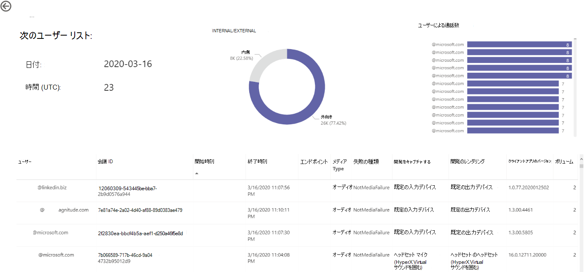

# CQD データを使用して Power BI で Microsoft Teams の使用率を表示するView Microsoft Teams utilization in Power BI using CQD data

2020 年 3 月の新機能として [、CQD](https://github.com/MicrosoftDocs/OfficeDocs-SkypeForBusiness/blob/live/Teams/downloads/CQD-Power-BI-query-templates.zip?raw=true)用のダウンロード可能な Power BI クエリ テンプレートに Teams 使用率レポートが追加されました。New in March 2020, we've added a Teams Utilization report to our downloadable [Power BI query templates for CQD](https://github.com/MicrosoftDocs/OfficeDocs-SkypeForBusiness/blob/live/Teams/downloads/CQD-Power-BI-query-templates.zip?raw=true). 

この新しい Teams 使用率レポートでは、Teams 通話品質ダッシュボード (CQD) データにアクセスして、ユーザーが Microsoft Teams を使用している方法 (およびどのくらい) を確認できます。This new Teams Utilization reports lets you see how (and how much) your users are using Microsoft Teams by accessing Teams Call Quality Dashboard (CQD) data. これらのレポートは、管理者とビジネス リーダーの両方が、このデータにすばやくアクセスできる一元管理された場所を目的としています。These reports are intended to be a centralized location that both administrators and business leaders can quickly go to for this data.

Teams 使用率 Power BI レポートは、通話カウント **** の概要と音声通話分数の概要という 2 つの主要なレポート **[で構成されます](#audio-minutes-summary-report)**。The Teams Utilization Power BI report consists of two primary reports: **[Call Count Summary](#call-count-summary-report)** and **[Audio Minutes Summary](#audio-minutes-summary-report)**. 次[の](#daily-usage)[説明に示](#regional-audio-details)すドリルダウンレポートをユーザーが利用すると、[毎日の使用状況]、[地域の音声の詳細]、[電話会議の詳細]、および [ユーザー リスト] レポートが再生されます。The [Daily Usage](#daily-usage), [Regional Audio Details](#regional-audio-details), [Conference Details](#conference-details) and [User List](#user-list) reports come into play when a user takes advantage of the drill-down reports, noted in the descriptions below.

> [!NOTE]
> 地域とネットワークのフィルター機能を提供するには、建物とサブネットのデータを入力する必要があります。Building and subnet data must be populated to provide regional and network filtering capabilities.

## 通話数の概要レポートCall Count Summary Report

メイン ページ (通話カウントの概要) では、セクション タイトルに示されている過去 30 日間と 90 日間の音声、ビデオ、画面共有セッションの数がすぐに表示されます。The main page (Call Count Summary) immediately provides the number of audio, video and screen sharing sessions over the last 30 and 90 days as noted in the section title. 最初に表示されるデータは組織全体を表し、ページの左側にあるスライサードロップダウン オプションを使用してフィルター処理できます。The data initially displayed is for the organization as a whole and can be filtered using the slicer dropdown options on the left side of the page.

1. スライサーのドロップダウンの右側では、メディアの種類別の通話数は、過去 30 日間の内部ビューまたは外部ビューに分解されます。To the right of the slicer dropdowns, the number of calls by media type is broken down to an internal/external view over the past thirty days. 上のスクリーンショットを見て、組織の外部からの通話が多く発生しているのを確認できます。これは、現在のグローバル環境を考慮すると理にかなっています。We can see through the above screenshot that there are more calls happening from outside organizational locations, which makes sense considering the current global environment.
  

1. メディアの種類数ボックスの右側には、過去 90 日間のメディアの種類別の月間通話数があります。To the right of the media type count box, we have the Monthly Call Count by Media Type for the last 90 days. 各列とメディアの種類をマウスでポイントすると、前月または現在の月の数が表示され、使用状況の傾向情報が表示されます。Each column and media type can be hovered over to display the count for a previous month or the current month to date, providing usage trend information.
  
 

1. 中央のグラフは 90 日間のグラフと同様に機能しますが、過去 30 日間の毎日の利用状況ビューが提供され、ユーザーは特定の日の詳細を右クリックしてドリルダウンできます。The middle graph functions as the 90-day graph does, however it provides a daily usage view for the past 30 days and allows a user to right click and drill down into details for a specific day.
  

ページの左下のセクションには、過去 1 年間のメディアの種類ごとに合計値を提供するテーブルがあります。On the bottom left section of the page, you'll find a table providing total values for each media type over the past year. 
         

表の右側には、過去 30 日間のクライアントが最も多く使用されている (通話/ストリーム) が棒グラフに表示されます。To the right of the table, a bar chart shows clients with the most use (calls/streams) for the past 30 days.
   

このページの最後のグラフ セットでは、各メディアの種類が個別に表示され、内訳には電話会議と P2P の使用状況が表示されます。The last set of charts for this page show each media type individually, with a breakdown showing conference and P2P usage. 次のグラフは、P2P と比較して、電話会議の使用状況の数が非常に多い場合を示しています。The charts below show that there is a significantly higher number of conference usage as compared to P2P.
  

## Audio Minutes Summary ReportAudio Minutes Summary Report

オーディオ分数の使用状況レポートでは、分の合計使用量がいくつかの異なるビューで提供されます。On the Audio Minutes usage report, the total minute usage is provided through a few different views. 

スライサーの横に、テキスト ボックスを簡単に使用できる 30 日間の使用状況の概要が表示されます。We have the thirty-day usage summary shown next to the slicers as easy to consume text boxes. 上位の数値は 30 日間の合計を示し、内部と外部の内訳が下に表示されます。The top number shows the thirty-day total, with internal and external breakdowns below that.

上の右の棒グラフは、電話会議の音声使用状況を 1 年間表示します。The top right bar graph provides a yearlong view of conference audio usage. 月の上にマウス ポインターを置くと、会議の音声の分数が表示されます。Hover over the month to show the conference audio minutes.

P2P と電話会議の音声の違いを示す左下のグラフは、過去 1 年間のすべての音声を取得し、2 つの種類の間で分解します。To show the difference in P2P and conference audio, the bottom left chart takes all audio for the past year and breaks it up between the two types.

[オーディオ分数] ページの最後のグラフには、グローバル マップ オーバーレイでの音声の分の使用状況が表示されます。The last chart for the Audio minutes page shows audio minute usage on a global map overlay. このグラフは、建物とサブネットのデータがテナントにアップロードされた場合にのみ機能します。This chart will only work if building and subnet data is uploaded to the tenant. マップ上の円グラフのオーバーレイを詳細に表示し、その後で地域の音声を使用できます。The pie chart overlay on the map can be drilled into, subsequently providing regional audio usage.

## ドリルスルー機能Drill-through capabilities

前に説明した通り、ユーザーは日次および地域の使用状況レポートを詳細に表示できます。As previously noted, users can drill into the daily and regional usage reports.

### 1 日の使用状況Daily Usage

[毎日の使用状況] レポートを使用すると、管理者は 1 日の間に最大使用時間を特定できます。The Daily Usage report allows an administrator to identify peak consumption periods through the course of a day. また、使用状況に加えて、その日の全体的なユーザー の感情やフィードバックも取り込む可能性があります。In addition to usage, we are also able to capture overall user sentiment and feedback for that day.

[毎日の使用状況] レポートには、選択した日のオーディオ、ビデオ、画面共有の数が表示され、内部接続と外部接続を区別する機能が追加されます。The Daily usage report displays the number of Audio, Video and Screen shares for the selected day with the added ability to differentiate between internal and external connectivity. 会議およびピアツーピアのブレークダウンは、モーダル合計ボックスの右側に表示されます。A Conference and Peer to Peer breakdown is to the immediate right of the modality total box. レポートの上部の右側には、その日の関連付けられた ID と参加者を含む電話会議の一覧が表示されます。The top right of the report provides a list of conferences with their associated ID and participants for the day. 電話会議リストには、電話会議の詳細レポートのドリルダウンが追加で表示されます。The conference list provides an additional drill down to the Conference Details report as well. グラフィックを置き換えるREPLACE GRAPHIC

中央の領域の棒グラフを使用すると、ユーザーは 1 日の間にピーク時の消費期間を特定できます。The bar graph in the center area allows the user to identify peak consumption periods through the course of a day. ユーザーは、グラフに表示される時間をドリルダウンして、その時間のユーザー リスト レポートを表示できます。Users may drill down into the hour represented on the graph which will present the User List report for the hour.

棒グラフの右側には、ユーザー フィードバックが視覚的な形式で表示されます。To the right of the bar graph, User Feedback is presented in a visual format. ユーザーの感情は主観的な場合がある一方で、潜在的な問題を特定するために使用できる洞察を提供します。While user sentiment can be subjective, it does provide insight that can be used to identify potential issues.

下の表には、その日のメトリックの範囲が表示されます。The bottom table provides a range of metrics for the day. 低品質のパーセンテージと障害率は、管理者に改善の可能性がある領域を提供する可能性があります。Poor percentages along with failure rates can provide an administrator with potential areas of improvement. 次に示すように、各時間を個別に選択できます。Each hour can also be selected individually as shown below.

このデータは、ピーク時に問題がある地域を特定するために使用できます。This data can be used to identify regions having problems during peak consumption times.

その日の列をクリックすると、その時間のメトリックが表示されます。Click on the column for that day to display metrics for that hour.

  
  1.  グラフの下の表には、その時間のメトリックが表示されます。The table below the chart will display the metrics for that hour. 任意の列見出しで並べ替えを行います。ただし、問題のある領域を見つけることに関心があります。This can be sorted by any column header; however, we would be interested in finding problematic areas.  
    
    
  2.  IND 地域では、この期間中の電話会議でのビデオパフォーマンスが低下しています。We see that the IND region is experiencing poor video performance in conferences during this time frame. その後、CQD QER Microsoft レポートを使用して、領域と時間枠が特定されると、問題のある場所を絞り込む可能性があります。Subsequently, the CQD QER Microsoft reports can be used to narrow down the problematic location as the region and time frame has been identified.

### 電話会議の詳細Conference Details

会議の詳細レポートでは、出席者リストからセッション中に使用されるメディアの種類まで、会議に関する追加の分析情報が提供されます。The Conference Details report provides additional insight for meetings, from an attendee list, to the media types used during the session.

[毎日の利用状況] ページの会議 ID グラフの参加者バーを右クリックして、会議の詳細をドリルダウンします。Right click a conference the participant bar in the conference ID chart on the Daily usage page to drill down into the conference details.

  

会議の参加者だけでなく、すべての関連情報をパケット損失とジッターにまで表示して、下の表のトラブルシューティング作業の可能性を支援できます。We can see the participants in the conference as well as all the pertinent information down to packet loss and jitter to assist with potential troubleshooting efforts in the bottom table.

### 地域の音声の詳細Regional Audio Details

地域のオーディオの詳細のドリルダウンには、選択した地域の音声分の使用状況が具体的に表示されます。The Regional Audio Details drill down specifically shows the audio minute usage for the selected region. CQD にアクセスできるユーザーは、選択した地域内の P2P と電話会議の音声の両方の使用状況の傾向を確認できます。Users with access to CQD can see usage trends for both P2P and conference audio within the selected region.

1.  [通話カウントの概要] ページで、テーブル内の特定の領域にドリルスルーします。On the Call Count Summary page, drill-through to as specific region through the table.
  

2.  追加情報が必要な領域を含む行を選択します。Select the row with the region additional information is needed for.
  

3.  データの傾向は、内部ネットワークで使用されている分数が非常に多く、会議は P2P の使用をはるかに上回っています。The data trends show a significant number of minutes being used on the internal network, with conferencing far surpassing P2P use.
  

地域の音声傾向は、ユーザーが世界の外部影響の影響を受ける方法を示す場合に使用できます。The regional audio trend can be used to show how users are impacted by external influences in the world. 具体的には、現在、EMEA 地域と APAC 地域の外部使用量が増加し、リモートで作業を求める人々が増える可能性があります。Specifically, right now, we would expect to see the external usage for the EMEA and APAC regions to increase with people being asked to work remotely.

### ユーザー リストUser List

ユーザー リストのドリルダウンでは、予想される方法として、レポートを表示しているユーザーが選択した特定の時間のユーザー固有の情報が提供されます。The User List drill down provides, as one might expect, user specific information for a specific hour selected by the person viewing the report. ユーザー リスト レポートには、[毎日の使用状況] レポートの [時間別傾向] グラフのドリルダウンを使用してアクセスできます。The User List report is accessible through a drill down in the Hourly Trends graph on the Daily Usage report. 次に示すように、追加情報が必要な時間を右クリックし、[ドリルスルーとユーザー リスト] を選択します。Right click on the hour additional information is needed for and select Drill through and User List, as shown below.

ユーザー リスト レポートには、ページの上部中央にあるドーナツ グラフを介した内部または外部の接続が表示されます。The User List report shows internal/external connectivity through the doughnut chart in the top center of the page. 次の画像では、企業ネットワークの外部からの大量の参加が見受け取ることができます。We can see that there is a large amount of participation from Outside the corporate network in the below image.

グラフの上の右には、その時間内に各ユーザーによって行われた通話の数が表示されます。The top right of the graph shows the number of calls made by each user within that hour.

下の表は、各ユーザーがその時間に参加したセッションの詳細情報を示しています。The bottom table provides detailed information for the sessions each user participated in during that hour. [エラーの種類] 列は、呼び出しがドロップされる原因を特定する場合に便利です。The Failure Type column is useful in determining what caused a call to drop. キャプチャとレンダリング デバイスの列は、通話が低品質と報告された理由を特定するのに役立ちます。The Capture and Render Device columns are useful in identifying why a call was reported having poor quality.

## 関連項目Related topics

[通話品質ダッシュボードで利用できるディメンションとメジャーDimensions and measures available in Call Quality Dashboard](dimensions-and-measures-available-in-call-quality-dashboard.md)

[通話品質ダッシュボードでのストリームの分類Stream Classification in Call Quality Dashboard](stream-classification-in-call-quality-dashboard.md)

[Skype for Business の通話分析をセットアップするSet up Skype for Business Call Analytics](set-up-call-analytics.md)

[通話分析を使用して低品質の通話をトラブルシューティングするUse Call Analytics to troubleshoot poor call quality](use-call-analytics-to-troubleshoot-poor-call-quality.md)

[通話分析および通話品質ダッシュボードCall Analytics and Call Quality Dashboard](./monitor-call-quality-qos.md)

[Teams のトラブルシューティングTeams Troubleshooting](/MicrosoftTeams/troubleshoot/teams)
