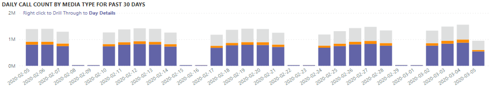
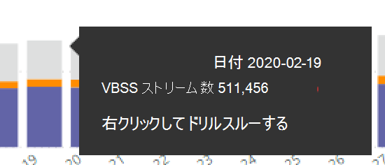
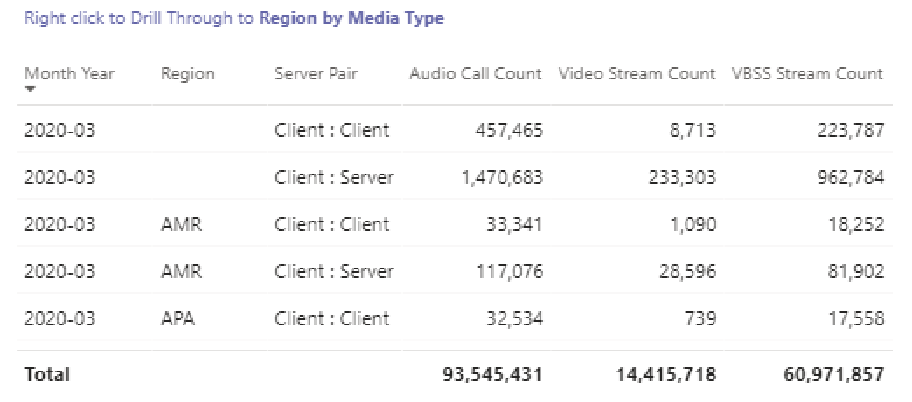
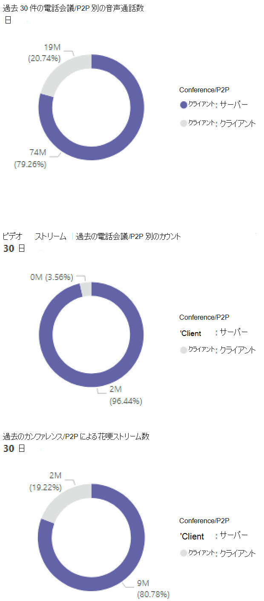
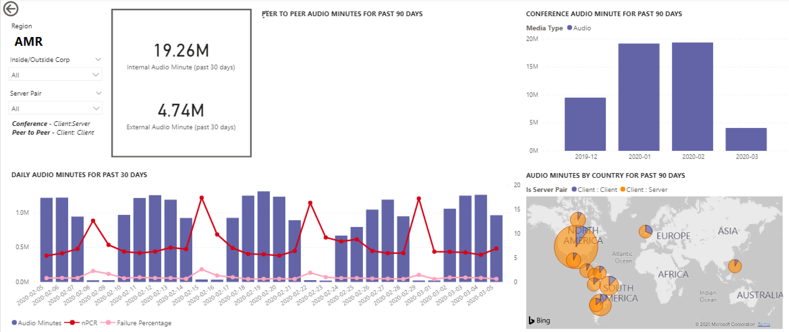
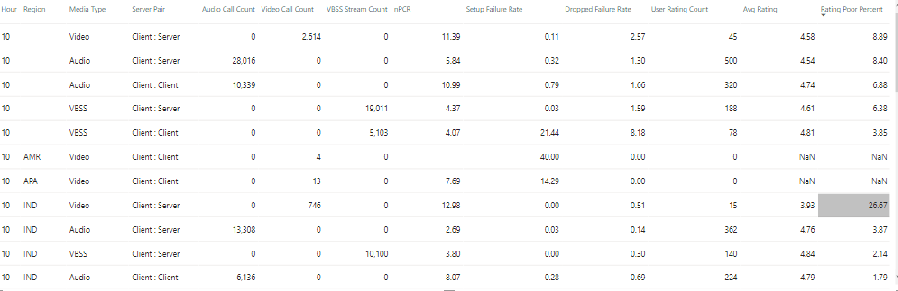
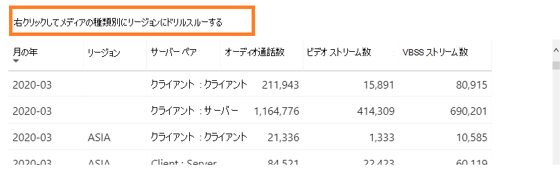
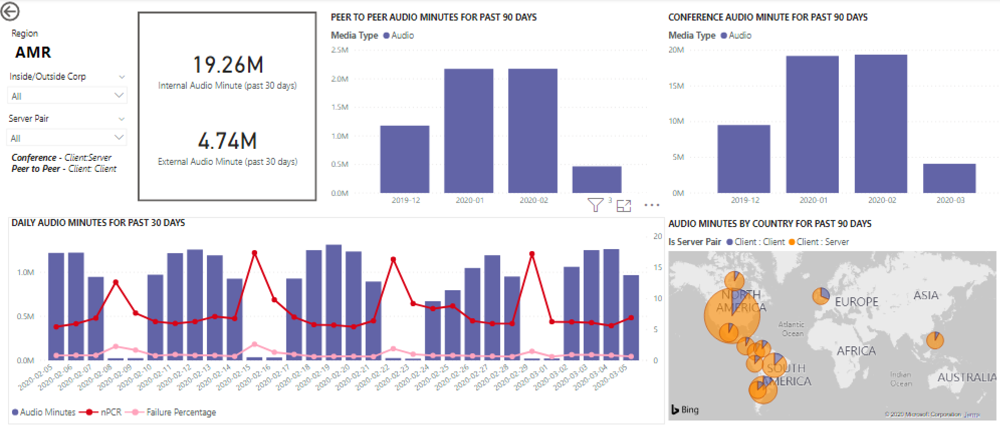

# CQD のデータを使用して、Power BI で Microsoft Teams の使用率を表示するView Microsoft Teams utilization in Power BI using CQD data

2020年3月に初めて、CQD のダウンロード可能な[POWER BI クエリテンプレート](https://github.com/MicrosoftDocs/OfficeDocs-SkypeForBusiness/blob/live/Teams/downloads/CQD-Power-BI-query-templates.zip?raw=true)に Teams の使用状況レポートが追加されました。New in March 2020, we've added a Teams Utilization report to our downloadable [Power BI query templates for CQD](https://github.com/MicrosoftDocs/OfficeDocs-SkypeForBusiness/blob/live/Teams/downloads/CQD-Power-BI-query-templates.zip?raw=true). 

この新しいチームの使用状況レポートでは、ユーザーが Microsoft Teams を使用している方法 (およびその程度) を確認できます。This new Teams Utilization reports lets you see how (and how much) your users are using Microsoft Teams. これらのレポートは、管理者とビジネスリーダーの両方がこのデータにすばやくアクセスできる一元的な場所です。These reports are intended to be a centralized location that both administrators and business leaders can quickly go to for this data.

Teams 使用率 Power BI レポートは、2つの主要なレポートで構成されています。**[通話カウントの概要](#call-count-summary-report)** と**[音声分の概要](#audio-minutes-summary-report)**。The Teams Utilization Power BI report consists of two primary reports: **[Call Count Summary](#call-count-summary-report)** and **[Audio Minutes Summary](#audio-minutes-summary-report)**. 以下の説明に記載されているように、ユーザーがドリルダウンレポートを利用すると、[デイリー Usage](#daily-usage)と[地域の音声詳細](#regional-audio-details)レポートが再生されます。The [Daily Usage](#daily-usage) and [Regional Audio Details](#regional-audio-details) reports come into play when a user takes advantage of the drill-down reports, noted in the descriptions below.

> [!NOTE]
> 地域とネットワークのフィルター処理機能を提供するには、建物およびサブネットデータを設定する必要があります。Building and subnet data must be populated to provide regional and network filtering capabilities.

## 通話カウントの概要レポートCall Count Summary Report

メインページ ([通話カウントの概要]) には、セクションタイトルに記載されているように、最後の 30 ~ 90 日間の音声、ビデオ、画面共有セッションの数がすぐに表示されます。The main page (Call Count Summary) immediately provides the number of audio, video and screen sharing sessions over the last 30 and 90 days as noted in the section title. 最初に表示されるデータは組織全体に対して設定され、ページの左側にある [スライサー] ドロップダウンオプションを使ってフィルター処理することができます。The data initially displayed is for the organization as a whole and can be filtered using the slicer dropdown options on the left side of the page.

1. スライサードロップダウンの右側では、メディアの種類別の呼び出しの数が、過去30日間にわたって内部/外部ビューに分割されます。To the right of the slicer dropdowns, the number of calls by media type is broken down to an internal/external view over the past thirty days. 上のスクリーンショットでは、組織外の場所からより多くの通話が行われていることを示しています。これは、現在のグローバル環境を考慮していることを意味します。We can see through the above screenshot that there are more calls happening from outside organizational locations, which makes sense considering the current global environment.
  

1. [メディアの種類のカウント] ボックスの右側には、過去90日間のメディアの種類別の月次通話カウントがあります。To the right of the media type count box, we have the Monthly Call Count by Media Type for the last 90 days. 各列とメディアの種類をマウスでポイントすると、前月または現在の月の数が表示され、使用傾向の情報が提供されます。Each column and media type can be hovered over to display the count for a previous month or the current month to date, providing usage trend information.
  

1. 中央のグラフは、90日間のグラフとして機能しますが、過去30日間の日次利用状況ビューを提供し、ユーザーが右クリックして特定の日の詳細をドリルダウンできるようにします。The middle graph functions as the 90-day graph does, however it provides a daily usage view for the past 30 days and allows a user to right click and drill down into details for a specific day.
  

ページの左下のセクションでは、過去1年の各メディアの種類の合計値を提供するテーブルが見つかります。On the bottom left section of the page, you'll find a table providing total values for each media type over the past year. 
    
  
また、テーブルには、地域データの分類を表示できるドリルダウンもあります。The table also has an available drill down where you can see a regional data breakdown.
    

テーブルの右側にある棒グラフには、過去30日間に最も頻繁に使用されているクライアント (通話/ストリーム) が表示されます。To the right of the table, a bar chart shows clients with the most use (calls/streams) for the past 30 days.
   

このページの最後のグラフセットでは、各メディアの種類が個別に表示され、会議と P2P の使用状況を示すブレークダウンが表示されます。The last set of charts for this page show each media type individually, with a breakdown showing conference and P2P usage. 以下の図は、P2P と比較した場合の会議の利用回数が非常に多いことを示しています。The charts below show that there is a significantly higher number of conference usage as compared to P2P.
  

## オーディオ分のサマリーレポートAudio Minutes Summary Report

[オーディオ時間の利用状況] レポートでは、合計分使用量がいくつかの異なるビューで提供されます。On the Audio Minutes usage report, the total minute usage is provided through a few different views. 

スライサーの隣には、テキストボックスを簡単に利用できるように、30日間の使用状況の概要が表示されています。We have the thirty-day usage summary shown next to the slicers as easy to consume text boxes. 上部の番号には、その下に内部と外部の内訳が表示された、30日間の合計が表示されます。The top number shows the thirty-day total, with internal and external breakdowns below that.

右上の棒グラフでは、電話会議の音声使用状況が yearlong で表示されます。The top right bar graph provides a yearlong view of conference audio usage. 月をポイントすると、会議の音声通話時間が表示されます。Hover over the month to show the conference audio minutes.

P2P と会議の音声の違いを示すために、左下のグラフはすべてのオーディオを過去の年に向けて受け取り、2つの種類の間で分割します。To show the difference in P2P and conference audio, the bottom left chart takes all audio for the past year and breaks it up between the two types.

通話先の [分間のサマリー] ページの最後のグラフには、グローバルマップオーバーレイでのオーディオ分の使用状況が表示されます。 The last chart for the Audio minutes page shows audio minute usage on a global map overlay. このグラフは、構築およびサブネットデータがテナントにアップロードされた場合にのみ機能します。This chart will only work if building and subnet data is uploaded to the tenant. 地図上の円グラフのオーバーレイを表示して、その後で地域のオーディオ使用法を提供できます。The pie chart overlay on the map can be drilled into, subsequently providing regional audio usage.

## ドリルスルー機能Drill-through capabilities

前に説明したように、ユーザーは日単位および地域の利用状況レポートについて詳しく調べることができます。As previously noted, users can drill into the daily and regional usage reports.

### 日常的な利用状況Daily Usage

日次利用状況レポートを使用すると、管理者は1日の間にピークの消費期間を特定できます。The Daily Usage report allows an administrator to identify peak consumption periods through the course of a day. 利用状況に加えて、その日の全体的なユーザー感情とフィードバックをキャプチャすることもできます。In addition to usage, we are also able to capture overall user sentiment and feedback for that day.

このデータは、消費時間のピーク時に問題が発生した地域を特定するために使用できます。This data can be used to identify regions having problems during peak consumption times.

1.  [通話カウントの概要] ページで、特定の日にドリルスルーします。On the Call Count Summary page, drill-through on a specific date. その日の1時間の傾向を確認して、ピーク使用率を確認します。Look at the hourly trend that day to find the peak utilization.
  

2.  その日の列をクリックして、その時間の指標を表示します。Click on the column for that day to display metrics for that hour.
  
    
    1.  グラフの下の表には、その時間の測度が表示されます。The table below the chart will display the metrics for that hour. これは、任意の列見出しを基準にして並べ替えることができます。ただし、問題のある領域を見つけることに関心を持っています。This can be sorted by any column header; however, we would be interested in finding problematic areas.  
        
    
    2.  この期間中の会議では、IND 領域のビデオパフォーマンスが低下していることがわかります。We see that the IND region is experiencing poor video performance in conferences during this time frame. その後、CQD QER Microsoft レポートを使って、地域と時間のフレームが識別されたために、問題のある場所を絞り込むことができます。Subsequently, the CQD QER Microsoft reports can be used to narrow down the problematic location as the region and time frame has been identified.

### 地域の音声の詳細Regional Audio Details

[地域のオーディオ詳細] のドリルダウンでは、選択した地域の音声分の使用状況が具体的に表示されます。The Regional Audio Details drill down specifically shows the audio minute usage for the selected region. CQD へのアクセス権を持つユーザーは、選択した地域内の P2P と会議のオーディオの使用状況の傾向を確認できます。Users with access to CQD can see usage trends for both P2P and conference audio within the selected region.

1.  [通話カウントの概要] ページで、表を通じて特定の地域にドリルダウンします。On the Call Count Summary page, drill-through to as specific region through the table.
  

2.  領域の追加情報が必要な行を選択します。Select the row with the region additional information is needed for.
  

3.  データの傾向は、内部ネットワークで利用されている長い時間 (分単位) を示しています。これには、surpassing が P2P を使用しています。The data trends show a significant number of minutes being used on the internal network, with conferencing far surpassing P2P use.
  

地域オーディオの傾向を使って、世界中の外部の影響によってユーザーがどのように影響を受けるかを示すことができます。The regional audio trend can be used to show how users are impacted by external influences in the world. 具体的には、この時点で、ユーザーがリモートで作業することを求められる場合に、EMEA と APAC 地域の外部使用が表示されることを想定しています。Specifically, right now, we would expect to see the external usage for the EMEA and APAC regions to increase with people being asked to work remotely.

## 関連項目Related topics

[通話品質ダッシュボードで利用できるディメンションとメジャーDimensions and measures available in Call Quality Dashboard](dimensions-and-measures-available-in-call-quality-dashboard.md)

[通話品質ダッシュボードでのストリームの分類Stream Classification in Call Quality Dashboard](stream-classification-in-call-quality-dashboard.md)

[Skype for Business の通話分析をセットアップするSet up Skype for Business Call Analytics](set-up-call-analytics.md)

[通話分析を使用して低品質の通話をトラブルシューティングするUse Call Analytics to troubleshoot poor call quality](use-call-analytics-to-troubleshoot-poor-call-quality.md)

[通話分析および通話品質ダッシュボードCall Analytics and Call Quality Dashboard](difference-between-call-analytics-and-call-quality-dashboard.md)
 