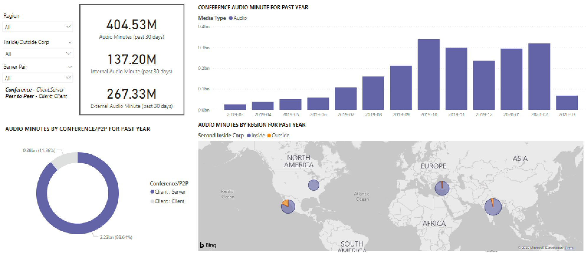

# CQD Microsoft Teamsを使用してPower BIの使用状況を表示する

2020 年 3 月の新機能として[、CQD](https://github.com/MicrosoftDocs/OfficeDocs-SkypeForBusiness/blob/live/Teams/downloads/CQD-Power-BI-query-templates.zip?raw=true)用のダウンロード可能な Teams クエリ テンプレートに Teams Power BI 使用率レポートが追加されました。 

この新Teams使用率レポートでは、Microsoft Teams 通話品質ダッシュボード (CQD) データにアクセスして、ユーザーが Microsoft Teams Teams を使用している方法 (およびどれくらい) を確認できます。 これらのレポートは、管理者とビジネス リーダーの両方が、このデータにすばやくアクセスできる一元的な場所を意図しています。

[Teams使用率Power BIレポートは、通話数の概要と音声通話分の概要という **** 2 つの主要な **[レポートで構成されます](#audio-minutes-summary-report)**。 次[の](#daily-usage)[説明に](#regional-audio-details)示すドリルダウンレポートをユーザーが利用すると、毎日の使用状況、地域のオーディオの詳細、電話会議の詳細、ユーザー リスト の各レポートが表示されます。

> [!NOTE]
> リージョンとネットワークのフィルター処理機能を提供するには、建物とサブネットのデータを設定する必要があります。

## 通話数の概要レポート

メイン ページ (通話数の概要) には、セクション タイトルに示されている過去 30 日間と 90 日間の音声、ビデオ、画面共有セッションの数がすぐに表示されます。 最初に表示されるデータは組織全体のデータであり、ページの左側にあるスライサー ドロップダウン オプションを使用してフィルター処理できます。

1. スライサードロップダウンの右側では、メディアの種類別の呼び出し数は、過去 30 日間の内部/外部ビューに分解されます。 上のスクリーンショットを見て、現在のグローバル環境を考慮すると、組織の外部からさらに多くの呼び出しが発生しているのを確認できます。
  

1. [メディアの種類のカウント] ボックスの右側には、過去 90 日間のメディアの種類別の月次通話数があります。 各列とメディアの種類にカーソルを合わせると、前月または現在の月の現在の数を表示し、使用状況の傾向情報を提供できます。
  
 

1. 中央のグラフは 90 日間のグラフと同様に機能しますが、過去 30 日間の毎日の使用状況ビューが提供され、ユーザーは右クリックして特定の日の詳細をドリルダウンできます。
  

ページの左下のセクションには、過去 1 年間の各メディア タイプの合計値を示すテーブルがあります。 
        

表の右側には、過去 30 日間の最も多くの使用 (呼び出し/ストリーム) を持つクライアントが棒グラフに表示されます。
   

このページのグラフの最後のセットでは、各メディアの種類が個別に表示され、内訳には電話会議と P2P の使用状況が表示されます。 次のグラフは、P2P と比較して、電話会議の使用量の数が大幅に多い場合を示しています。
  

## オーディオ分の概要レポート

オーディオ分の使用状況レポートでは、分の合計使用量は、いくつかの異なるビューを通じて提供されます。 

スライサーの横に、使用しやすいテキスト ボックスとして 30 日間の使用状況の概要が表示されます。 上位の数値は、30 日間の合計を示し、内部および外部の内訳が下に表示されます。

上部右の棒グラフは、電話会議の音声使用状況を 1 年間表示します。 月にマウス ポインターを合わせると、電話会議の音声分が表示されます。

P2P と電話会議の音声の違いを示す左下のグラフは、過去 1 年間のすべての音声を受け取り、2 種類の間で分解します。

[オーディオ分] ページの最後のグラフには、グローバル マップ オーバーレイでのオーディオ分の使用状況が表示されます。 このグラフは、構築とサブネット データがテナントにアップロードされた場合にのみ機能します。 マップ上の円グラフ オーバーレイを掘り下ろして、その後、地域のオーディオを使用できます。

## ドリルスルー機能

前に説明した通り、ユーザーは日次および地域の使用状況レポートを詳細に確認できます。

### 毎日の使用状況

[毎日の使用状況] レポートを使用すると、管理者は 1 日の間のピーク消費期間を特定できます。 使用状況に加えて、その日の全体的なユーザーセンチメントとフィードバックもキャプチャできます。

[毎日の使用状況] レポートには、選択した日のオーディオ、ビデオ、画面共有の数が表示され、内部接続と外部接続を区別する機能が追加されます。 [会議とピア ツー ピア] の内訳は、[モダリティの合計] ボックスの直右に表示されます。 レポートの右側には、その日の関連付けられた ID と参加者を含む会議の一覧が表示されます。 会議リストには、電話会議の詳細レポートに関する追加のドリルダウンも表示されます。 グラフィックを置き換える

中央の領域の棒グラフを使用すると、ユーザーは 1 日の間のピーク消費期間を識別できます。 ユーザーは、グラフで表される時間にドリルダウンして、その時間のユーザー リスト レポートを表示できます。

棒グラフの右側には、ユーザー フィードバックが視覚的な形式で表示されます。 ユーザーセンチメントは主観的ですが、潜在的な問題を特定するために使用できる洞察を提供します。

下の表は、その日のメトリックの範囲を示しています。 低い割合と障害率は、管理者に改善の可能性のある領域を提供する可能性があります。 次に示すように、1 時間ごとに個別に選択できます。

このデータを使用して、ピーク時に問題が発生しているリージョンを特定できます。

その日の列をクリックすると、その時間のメトリックが表示されます。

  
  1.  グラフの下の表には、その時間のメトリックが表示されます。 これは、任意の列ヘッダーで並べ替え可能です。ただし、問題のある領域を見つけることに関心があります。  
    
    
  2.  この期間中、IND リージョンの会議でビデオパフォーマンスが低下しているのが確認できます。 その後、CQD QER Microsoft レポートを使用して、リージョンと時間枠が特定された問題のある場所を絞り込む可能性があります。

### 電話会議の詳細

[会議の詳細] レポートでは、出席者リストから、セッション中に使用されるメディアの種類まで、会議に関する追加の分析情報が提供されます。

[毎日の使用状況] ページの [会議 ID] グラフの参加者バーを右クリックして、会議の詳細をドリルダウンします。

  

会議の参加者だけでなく、パケット損失やジッターに関する関連情報はすべて、下の表の潜在的なトラブルシューティング作業に役立つ可能性があります。

### 地域オーディオの詳細

[地域オーディオの詳細] ドリルダウンには、選択したリージョンの音声分の使用状況が具体的に表示されます。 CQD にアクセスできるユーザーは、選択したリージョン内の P2P と電話会議音声の両方の使用状況の傾向を確認できます。

1.  [Call Count Summary] ページで、テーブルを通じて特定のリージョンにドリルスルーします。
  

2.  追加情報が必要な領域を含む行を選択します。
  

3.  データの傾向は、会議が P2P の使用をはるかに上回る、内部ネットワークで使用されている分数を示しています。
  

地域のオーディオ傾向を使用して、ユーザーが世界の外部からの影響を受ける方法を示します。 具体的には、現在、EMEA リージョンと APAC リージョンの外部使用量が増え、リモートで作業を求めるユーザーが増える可能性があります。

### ユーザー リスト

ユーザー リストのドリルダウンでは、レポートを表示するユーザーが選択した特定の時間のユーザー固有の情報が予想される場合があります。 ユーザー リスト レポートには、[毎日の使用状況] レポートの [時間別の傾向] グラフのドリルダウンを使用してアクセスできます。 次に示すように、追加情報が必要な時間を右クリックし、[ドリルスルー] と [ユーザー リスト] を選択します。

ユーザー リスト レポートには、ページの上部中央にあるドーナツ グラフを介した内部/外部接続が表示されます。 次の図では、企業ネットワークの外部から大量の参加があるのを確認できます。

グラフの右側には、各ユーザーが 1 時間以内に行った呼び出しの数が表示されます。

下の表は、各ユーザーがその時間に参加したセッションの詳細情報を示しています。 [エラーの種類] 列は、呼び出しがドロップされた原因を特定する際に役立ちます。 [Capture] 列と [Render Device] 列は、低品質の通話が報告された理由を特定するのに役立ちます。

## 関連トピック

[通話品質ダッシュボードで利用できるディメンションとメジャー](dimensions-and-measures-available-in-call-quality-dashboard.md)

[通話品質ダッシュボードでのストリームの分類](stream-classification-in-call-quality-dashboard.md)

[Skype for Business の通話分析をセットアップする](set-up-call-analytics.md)

[通話分析を使用して低品質の通話をトラブルシューティングする](use-call-analytics-to-troubleshoot-poor-call-quality.md)

[通話分析および通話品質ダッシュボード](./monitor-call-quality-qos.md)

[Teams のトラブルシューティング](/MicrosoftTeams/troubleshoot/teams)
