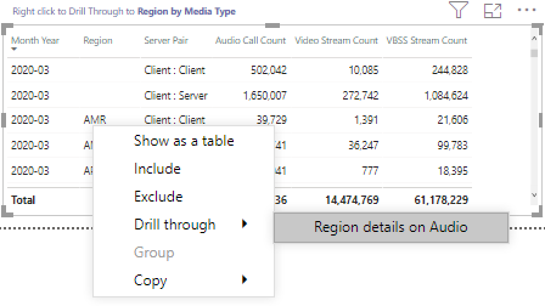

# CQD のデータを使用して、Power BI で Microsoft Teams の使用率を表示する

2020年3月に初めて、CQD のダウンロード可能な[POWER BI クエリテンプレート](https://github.com/MicrosoftDocs/OfficeDocs-SkypeForBusiness/blob/live/Teams/downloads/CQD-Power-BI-query-templates.zip?raw=true)に Teams の使用状況レポートが追加されました。 

この新しいチームの使用状況レポートでは、チームの通話品質ダッシュボード (CQD) データにアクセスして、ユーザーが Microsoft Teams を使用している方法 (およびその程度) を確認できます。 これらのレポートは、管理者とビジネスリーダーの両方がこのデータにすばやくアクセスできる一元的な場所です。

Teams 使用率 Power BI レポートは、2つの主要なレポートで構成されています。**[通話カウントの概要](#call-count-summary-report)** と**[音声分の概要](#audio-minutes-summary-report)**。 ユーザーがドリルダウンレポートを利用すると、次の説明に記載されているように、[日常の利用状況](#daily-usage)、[地域の音声の詳細](#regional-audio-details)、会議の[詳細](#conference-details)、[ユーザー一覧](#user-list)のレポートが再生されます。

> [!NOTE]
> 地域とネットワークのフィルター処理機能を提供するには、建物およびサブネットデータを設定する必要があります。

## 通話カウントの概要レポート

メインページ ([通話カウントの概要]) には、セクションタイトルに記載されているように、最後の 30 ~ 90 日間の音声、ビデオ、画面共有セッションの数がすぐに表示されます。 最初に表示されるデータは組織全体に対して設定され、ページの左側にある [スライサー] ドロップダウンオプションを使ってフィルター処理することができます。

1. スライサードロップダウンの右側では、メディアの種類別の呼び出しの数が、過去30日間にわたって内部/外部ビューに分割されます。 上のスクリーンショットでは、組織外の場所からより多くの通話が行われていることを示しています。これは、現在のグローバル環境を考慮していることを意味します。
  

1. [メディアの種類のカウント] ボックスの右側には、過去90日間のメディアの種類別の月次通話カウントがあります。 各列とメディアの種類をマウスでポイントすると、前月または現在の月の数が表示され、使用傾向の情報が提供されます。
  
 

1. 中央のグラフは、90日間のグラフとして機能しますが、過去30日間の日次利用状況ビューを提供し、ユーザーが右クリックして特定の日の詳細をドリルダウンできるようにします。
  

ページの左下のセクションでは、過去1年の各メディアの種類の合計値を提供するテーブルが見つかります。 
        

テーブルの右側にある棒グラフには、過去30日間に最も頻繁に使用されているクライアント (通話/ストリーム) が表示されます。
   

このページの最後のグラフセットでは、各メディアの種類が個別に表示され、会議と P2P の使用状況を示すブレークダウンが表示されます。 以下の図は、P2P と比較した場合の会議の利用回数が非常に多いことを示しています。
  

## オーディオ分のサマリーレポート

[オーディオ時間の利用状況] レポートでは、合計分使用量がいくつかの異なるビューで提供されます。 

スライサーの隣には、テキストボックスを簡単に利用できるように、30日間の使用状況の概要が表示されています。 上部の番号には、その下に内部と外部の内訳が表示された、30日間の合計が表示されます。

右上の棒グラフでは、電話会議の音声使用状況が yearlong で表示されます。 月をポイントすると、会議の音声通話時間が表示されます。

P2P と会議の音声の違いを示すために、左下のグラフはすべてのオーディオを過去の年に向けて受け取り、2つの種類の間で分割します。

[オーディオ分数] ページの最後のグラフは、グローバルマップオーバーレイでのオーディオ分の使用状況を示しています。 このグラフは、構築およびサブネットデータがテナントにアップロードされた場合にのみ機能します。 地図上の円グラフのオーバーレイを表示して、その後で地域のオーディオ使用法を提供できます。

## ドリルスルー機能

前に説明したように、ユーザーは日単位および地域の利用状況レポートについて詳しく調べることができます。

### 日常的な利用状況

日次利用状況レポートを使用すると、管理者は1日の間にピークの消費期間を特定できます。 利用状況に加えて、その日の全体的なユーザー感情とフィードバックをキャプチャすることもできます。

[1 日の利用状況] レポートには、選択した日の音声、ビデオ、画面の共有の数が表示され、内部と外部の接続を区別することができます。 [会議とピアツーピア] のブレークダウンは、[モダリティ合計] ボックスのすぐ右にあります。 レポートの右上に、その日の会議 ID と参加者が含まれている会議の一覧が表示されます。 会議の一覧では、会議の詳細レポートも追加で表示されます。 図を置き換える

中央の領域の棒グラフでは、ユーザーは1日の間にピークの消費期間を特定することができます。 ユーザーはグラフに表示される時間にドリルダウンすることができます。これは、ユーザーリストレポートを表示する時間です。

棒グラフの右側には、ユーザーからのフィードバックが視覚的な形式で表示されます。 ユーザー感情は主観的なものにすることもできますが、潜在的な問題を特定するために使用できる洞察が提供されます。

下部のテーブルには、その日のさまざまなメトリックが用意されています。 故障率の低いパーセンテージで、管理者が改善の可能性のある領域を提供できます。 次に示すように、1時間ごとに個別に選択することもできます。

このデータは、消費時間のピーク時に問題が発生した地域を特定するために使用できます。

その日の列をクリックして、その時間の指標を表示します。

  
  1.  グラフの下の表には、その時間の測度が表示されます。 これは、任意の列見出しを基準にして並べ替えることができます。ただし、問題のある領域を見つけることに関心を持っています。  
    
    
  2.  この期間中の会議では、IND 領域のビデオパフォーマンスが低下していることがわかります。 その後、CQD QER Microsoft レポートを使って、地域と時間のフレームが識別されたために、問題のある場所を絞り込むことができます。

### 会議の詳細

[会議の詳細] レポートでは、出席者リストの中で、セッション中に使用されたメディアの種類について、会議の詳細を把握できます。

[毎日の利用状況] ページの [電話会議 ID] グラフの参加者バーである会議を右クリックして、会議の詳細をドリルダウンします。

  

会議の参加者と、パケットの損失とジッターまでの関連情報をすべて、下部の表に記載されている潜在的なトラブルシューティング作業に役立てることができます。

### 地域の音声の詳細

[地域のオーディオ詳細] のドリルダウンでは、選択した地域の音声分の使用状況が具体的に表示されます。 CQD へのアクセス権を持つユーザーは、選択した地域内の P2P と会議のオーディオの使用状況の傾向を確認できます。

1.  [通話カウントの概要] ページで、表を通じて特定の地域にドリルダウンします。
  

2.  領域の追加情報が必要な行を選択します。
  

3.  データの傾向は、内部ネットワークで利用されている長い時間 (分単位) を示しています。これには、surpassing が P2P を使用しています。
  

地域オーディオの傾向を使って、世界中の外部の影響によってユーザーがどのように影響を受けるかを示すことができます。 具体的には、この時点で、ユーザーがリモートで作業することを求められる場合に、EMEA と APAC 地域の外部使用が表示されることを想定しています。

### ユーザーリスト

ユーザーリストのドリルダウンでは、レポートを表示しているユーザーによって選択された特定の時間についてユーザー固有の情報が提供される場合があります。 ユーザーリストレポートには、[日単位の利用状況] レポートの時間の傾向グラフでドリルダウンしてアクセスできます。 次に示すように、必要な追加情報を右クリックして、[ドリルスルー] と [ユーザー] リストを選択します。

[ユーザーリスト] レポートには、ページの上部中央のドーナツグラフによる内部および外部の接続が表示されます。 以下の画像では、企業ネットワークの外部から大量の参加があることがわかります。

グラフの右上には、1時間以内に各ユーザーが行った通話の数が表示されます。

下の表は、各ユーザーがその時間に参加したセッションの詳細情報を示しています。 [エラーの種類] 列は、通話のドロップの原因を特定するのに役立ちます。 [キャプチャ] と [レンダーデバイス] の列は、通話が低品質であると報告された理由を特定するのに役立ちます。

## 関連トピック

[通話品質ダッシュボードで利用できるディメンションとメジャー](dimensions-and-measures-available-in-call-quality-dashboard.md)

[通話品質ダッシュボードでのストリームの分類](stream-classification-in-call-quality-dashboard.md)

[Skype for Business の通話分析をセットアップする](set-up-call-analytics.md)

[通話分析を使用して低品質の通話をトラブルシューティングする](use-call-analytics-to-troubleshoot-poor-call-quality.md)

[通話分析および通話品質ダッシュボード](difference-between-call-analytics-and-call-quality-dashboard.md)

[Teams のトラブルシューティング](https://docs.microsoft.com/MicrosoftTeams/troubleshoot/teams)
 