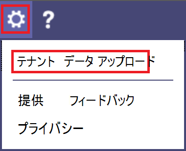

# 通話品質ダッシュボード (CQD) でテナントと建物のデータをアップロードする

通話品質ダッシュボード (CQD) を最大限に活用するには、テナントをアップロードし、データを作成することをお勧めします。 テナントデータファイルには、 [ビルド](#upload-building-data-file) と [エンドポイント](#endpoint-data-file)の2種類があります。

サンプルテナントデータテンプレートは、 [ここ](https://github.com/MicrosoftDocs/OfficeDocs-SkypeForBusiness/blob/live/Teams/downloads/locations-template.zip?raw=true)からダウンロードできます。 文書のマッピングの詳細については、「 [CQD の文書パーツを作成](CQD-building-mapping.md)する」を参照してください。

CQD Summary レポートダッシュボードで、[CQD **Settings** ] メニュー (CQD の上部にある歯車アイコン) から [**テナントデータアップロード**] を選びます。 ここでは、管理者は、IP アドレスと地理的情報のマッピング、各ワイヤレスアクセスポイントと MAC アドレスのマッピングなど、組織の建物とエンドポイントの情報をアップロードできます。

1. CQD (Teams 管理センターまたは at [https://cqd.teams.microsoft.com](https://cqd.teams.microsoft.com) ) を開き、右上隅にある歯車アイコンを選んで、[**概要レポート**] ページから [**テナントデータアップロード**] を選びます。

   
    
2. また、初めて CQD にアクセスする場合は、建物のデータをアップロードするように求められます。 [ **今すぐアップロード** ] を選択すると、[ **テナントデータアップロード** ] ページにすばやく移動できます。

   

3. [ **テナントデータのアップロード** ] ページで、[ **参照** ] を選んでデータファイルを選びます。

4. データファイルを選択した後、[ **開始日** ] を指定し、必要に応じて終了日を指定します。

5. [ **開始日**] を選んだら、[ **アップロード** ] を選んでファイルを CQD にアップロードします。   ファイルがアップロードされる前に、ファイルが検証されます。 検証に失敗した場合は、ファイルを修正するように求めるエラーメッセージが表示されます。 次の図は、データファイルの列数が正しくない場合に発生するエラーを示しています。

   
 
6. 検証中にエラーが発生しなかった場合、ファイルのアップロードは成功します。 アップロードしたデータファイルが **[マイアップロード** ] テーブルに表示されます。これにより、そのページの下部にある現在のテナントのすべてのアップロードされたファイルの一覧が表示されます。

> [!NOTE]
> ビルドファイルの処理が完了するまでに最大で4時間かかることがあります。    既に文書ファイルをアップロードしていて、見つからないか除外されている可能性のあるサブネットを追加する必要がある場合は、新しいサブネットを追加して元のファイルを変更し、現在のファイルを削除し、新しく編集したファイルを再アップロードします。 CQD には、アクティブな建物データファイルは1つしか存在できません。 

## 建物のデータファイルをアップロードする

CQD のテナントデータファイルの最初の種類は、 **建物** データファイルです。 [Subnet] 列を抽出するには、Network + NetworkRange 列を展開し、サブネット列を通話レコードの最初のサブネットまたは第2サブネット列に結合して、建物、市区町村、国、または地域の情報を表示します。 アップロードするデータファイルの形式は、次の条件に従って、アップロード前に検証チェックに合格する必要があります。
  
- ファイルは、.tsv ファイル (列はタブで区切られます) または .csv ファイル (列はコンマで区切られます) のいずれかである必要があります。

- データファイルには、テーブルの見出し行が含まれていません。 データファイルの最初の行は、"Network" のようなヘッダーラベルではなく、実際のデータであると想定されています。

- ファイル内のデータ型に指定できるのは、String、Integer、またはブール値のみです。 整数データ型の場合、値は数値である必要があります。 ブール値は、0または1でなければなりません。

- 列に文字列データ型が使用されている場合、データフィールドは空でもかまいませんが、タブまたはコンマで区切る必要があります。 空のデータフィールドでは、空の文字列値が割り当てられます。

- 各行には14個の列がある必要があります。各列のデータ型は適切であり、列の順序は、次の表の順序になっている必要があります (カンマまたはタブ区切り)。

  **データファイル形式の作成**
  
  | 列名        | データ型 | 例                   | ガイダンス              |
  |--------------------|-----------|---------------------------|-----------------------|
  | NetworkIP          | 文字列    | 192.168.1.0               | 必須              |
  | NetworkName        | 文字列    | 米国/シアトル/シアトル-SEA-1 | 必須1  |
  | NetworkRange       | 数値    | #                        | 必須              |
  | BuildingName       | 文字列    | シアトル-SEA-1             | 必須1  |
  | OwnershipType      | 文字列    | コントソ                   | 省略可能              |
  | BuildingType       | 文字列    | IT の終了            | 省略可能              |
  | BuildingOfficeType | 文字列    | エンジニアリング               | 省略可能              |
  | 市区町村               | 文字列    | 調布市調布ヶ丘                   | 推奨           |
  | ZipCode            | 文字列    | 98001                     | 推奨           |
  | 居住            | 文字列    | プロセッサー                        | 推奨           |
  | 都道府県              | 文字列    | WA                        | 推奨           |
  | Region             | 文字列    | MSUS                      | 推奨           |
  | InsideCorp2         | ブール      | 1             | 必須              |
  | ExpressRoute3       | ブール      | 0             | 必須              |
  | VPN                | ブール      | 0                         | 省略可能              |

  1 CQD では必須ではありませんが、テンプレートは、建物とネットワーク名を表示するように構成されています。

  2 この設定を使用すると、サブネットが企業ネットワーク内にあるかどうかを反映できます。 他の目的で使用をカスタマイズすることができます。

  3 この設定を使用すると、ネットワークが Azure ExpressRoute を使用しているかどうかを反映できます。 他の目的で使用をカスタマイズすることができます。  

  **サンプルの行:**

  `192.168.1.0,USA/Seattle/SEATTLE-SEA-1,26,SEATTLE-SEA-1,Contoso,IT Termination,Engineering,Seattle,98001,US,WA,MSUS,1,0,0`

> [!IMPORTANT]
> ネットワーク範囲は、スーパーネット (単一のルーティングプレフィックスを持つ複数のサブネットの組み合わせ) を表すために使用できます。 新しくなったすべての文書のアップロードで、重複範囲が確認されます。 以前にビルドファイルをアップロードしたことがある場合は、現在のファイルをダウンロードして再アップロードし、重複を特定し、問題を解決してからもう一度アップロードする必要があります。 以前にアップロードされたファイルが重なっていると、サブネットとレポートの建物とのマッピングが間違っている可能性があります。 特定の VPN の実装では、サブネット情報が正確に報告されません。 
>
> VPN 列はオプションであり、既定値は0に設定されます。 VPN 列の値が1に設定されている場合、その行で表されるサブネットは、サブネット内のすべての IP アドレスと一致するように完全に拡張されます。  これらのサブネットを完全に拡張すると、データの作成に関係するクエリのクエリ時間に悪影響を与える可能性があるため、このように慎重に使用してください。

### スーパー

各サブネットを定義する代わりに、スーパーネッティング (一般的にはクラスレスドメインルーティング (CIDR) と呼ばれます) を使うことができます。 *スーパーネット*は、単一のルーティングプレフィックスを共有する複数のサブネットの組み合わせです。 サブネットごとにエントリを追加する代わりに、supernetted 住所を使用することができます。 スーパーネッティングはサポートされていますが、使用することはお勧めしません。

たとえば、Contoso のマーケティング用建物は以下のサブネットで構成されています。

-   10.1.0.0/24: 第1階
-   10.1.1.0/24: 第2階
-   10.1.2.0/24: 3 階
-   10.1.3.0/24: 4 階

サブネットごとにエントリを追加する代わりに、supernetted 住所 (この例では 10.1.0.0/22) を使うことができます。

-   Network = 10.1.0.0
-   ネットワーク範囲 = 22

スーパーネッティングを実装する前に、次の点について考慮する必要があります。

-   スーパーネッティングは、8ビットから28ビットのマスクを持つサブネットマッピングでのみ使用できます。

-   スーパーネッティングでは時間が短くなりますが、データの量を削減するためのコストがかかります。 サブネット10.1.2.0 に関する音質の問題が発生したとします。 スーパーネッティングが実装されている場合は、サブネットの構築場所またはネットワークの種類 (ラボなど) がわかりません。 建物およびアップロードされたフロア位置情報のすべてのサブネットを定義した場合は、その区別を見ることができます。

-   Supernetted 住所が正しいこと、および不要なサブネットがキャッチされていないことを確認することが重要です。

-   192.168.0.0 をデータで検索するのは非常に一般的です。 多くの組織では、ユーザーが自宅にいることを示します。 他のユーザーの場合、これは、サテライトオフィスの IP アドレススキームです。 組織でこの構成を使用しているオフィスがある場合は、 [共通のサブネット](quality-of-experience-review-guide.md#common-subnets)を使ってホームネットワークと内部ネットワークを区別することが難しいため、建物のファイルには含めないでください。 

> [!IMPORTANT]
> ネットワーク範囲は、supernet を表すために使用できます。 新しくなったすべてのデータファイルアップロードで、重複範囲がチェックされます。 以前にビルドファイルをアップロードしたことがある場合は、現在のファイルをダウンロードしてもう一度アップロードし、重複を特定し、問題を修正する必要があります。 以前にアップロードされたファイルが重なっていると、サブネットとレポートの建物とのマッピングが間違っている可能性があります。

### VPN

CQD データのソースとなる Microsoft 365 または Office 365 に送信されるエクスペリエンス (QoE) データ— VPN フラグが含まれます。 CQD は、これを最初の VPN と第2の VPN のサイズとして表示します。 ただし、このフラグは vpn ベンダーの Windows に依存し、VPN ネットワークアダプターが登録されていることがリモートアクセスアダプターであることを前提としています。 すべての VPN ベンダーがリモートアクセスアダプターを正しく登録しているわけではありません。 このため、組み込みの VPN クエリフィルターを使用できない場合があります。 上で説明した VPN 列を使用して、VPN サブネットを正確にマークおよび識別します。 また、レポートで簡単に識別できるように VPN ネットワークにラベルを付けることをお勧めします。 次に、VPN サブネットにラベルを付ける方法の2つの例を示します。

- VPN サブネットの場合は、このフィールドに「VPN」と入力して、 **ネットワーク名** を定義します。

  

- VPN サブネットの場合は、このフィールドに「VPN」と入力して **建物名** を定義します。

  

> [!NOTE]
> 基盤となる接続がワイヤレスの場合、VPN 接続はネットワーク接続の種類を有線として misidentify ことがわかっています。 VPN 接続の品質を見ているときに、接続の種類が正確に識別されていると見なすことはできません。

## エンドポイントデータファイル

もう1つの種類の CQD テナントデータファイルは、 **エンドポイント** データファイルです。 列の値は、[通話記録の最初のクライアントエンドポイント名] または [第2のクライアントエンドポイント名] 列で使用され、エンドポイントの作成、モデル、または型の情報を表示します。 アップロードするデータファイルの形式は、次の条件に従って、アップロード前に検証チェックに合格する必要があります。

- ファイルは、.tsv ファイル (列はタブで区切られます) または .csv ファイル (列はコンマで区切られます) のいずれかである必要があります。

- データファイルの内容には、テーブル見出しは含まれません。 データファイルの最初の行は、"EndpointName" のような見出しラベルではなく、実際のデータである必要があります。

- 6つの列はすべて、文字列データ型のみを使用します。 使用できる最大文字数は64文字です。

- データフィールドは空白にすることもできますが、タブまたはコンマで区切る必要があります。 空のデータフィールドでは、空の文字列値が割り当てられます。

- EndpointName は一意である必要があります。そうでない場合、アップロードは失敗します。 重複している行が重複している場合、または2つの行に同じ EndpointName が含まれている場合は、競合が発生します。

- EndpointLabel1、EndpointLabel2、EndpointLabel3 はカスタマイズ可能なラベルです。 空の文字列や値にすることができるのは、"IT 部門が指定した2018ノート Pc" または "Asset Tag 5678" などです。

- 各行には6つの列があり、列は次の順序である必要があります。

  **フィールドの順序:**

  EndpointName、EndpointModel、Endpointmodel、EndpointLabel1、EndpointLabel2、EndpointLabel3

  **サンプルの行:**

  `1409W3534, Fabrikam Model 123, Laptop, IT designated 2018 Laptop, Asset Tag 5678, Purchase 2018,`  

## 建物のファイルを更新する

建物とサブネット情報を収集する場合、管理者は多くの場合、複数のイテレーションでビルドファイルをアップロードし、新しいサブネットとその建物情報が利用可能になったときにその作成情報を追加します。 この問題が発生した場合は、建物のファイルを再アップロードする必要があります。 このプロセスは、前のセクションで説明した最初のアップロードのようなものです。次のセクションで説明するように、いくつかの例外があります。

> [!Important]
> 一度に1つの建物ファイルのみをアクティブにすることができます。 複数のビルドファイルは累積的ではありません。

## ネット新しいサブネットを追加する

元のネットワークトポロジの一部ではない、CQD にネット新しいサブネットを追加する必要がある場合もあります。 ネット新しいサブネットを追加するには、CQD の **テナントデータアップロード** ページから次の操作を行います。

1.  まだ最新の状態のコピーを持っていない場合は、元のファイルをダウンロードします。

1.  CQD で現在のファイルを削除します。

1.  元の建物のファイルを編集して、ネット上の新しいサブネットが取得される前の少なくとも1日前に発生する終了日を指定します。

1.  元の建物ファイルにネット新しいサブネットを追加します。

1.  新しく変更した建物ファイルをアップロードし、前の建物ファイルの終了後の1日の開始日を設定します。

## 見つからないサブネットを追加する

管理されたネットワークの建物情報をアップロードした後は、管理対象のすべてのネットワークに建物の関連付けを設定する必要があります。 ただし、このような場合は常に問題になります。通常、いくつかのサブネットが失われます。 これらの見つからないネットワークを見つけるには、CQD の [**エクスペリエンスレポートの品質**] ページで、**サブネット不足レポート**を確認します。 これにより、作成データファイルに定義されていない10個以上のオーディオストリームを含むすべてのサブネットが表示され、外部としてマークされます。 この一覧に管理されたネットワークがないことを確認します。 サブネットが存在しない場合は、次の手順を使用して、元の建物データファイルを更新し、CQD に再アップロードします。

1. CQD の **テナントデータアップロード** ページに移動します。

1. まだ最新の状態のコピーを持っていない場合は、元のファイルをダウンロードします。

1. CQD で現在のファイルを削除します。

1. 新しいサブネットを元のファイルに追加します。

1. 建物のファイルをアップロードします。 CQD が履歴データを処理するためには、少なくとも8か月前に開始日を設定しておく必要があります。

> [!IMPORTANT]
> 組織のテナントデータのみを表示するようにレポートをフィルター処理するには、テナント ID を **第2のテナント id** のクエリフィルターとしてこのレポートに追加する必要があります。 そうしないと、レポートにフェデレーションサブネットが表示されます。

> [!NOTE] 
> 月単位のレポートフィルターは、現在の月に合わせて調整してください。 [ **編集**] を選択し、 **month Year** レポートフィルターを調整して、新しい既定の月を保存します。

## 関連トピック

[CQD 用の建築地図を作成する](CQD-building-mapping.md)

[Teams の通話品質を向上させて監視する](monitor-call-quality-qos.md)

[CQD とは何ですか?](CQD-what-is-call-quality-dashboard.md)

[通話品質ダッシュボード (CQD) を設定する](turning-on-and-using-call-quality-dashboard.md)

[CQD データとレポート](CQD-data-and-reports.md)

[CQD を使用して通話と会議の品質を管理する](quality-of-experience-review-guide.md)

[CQD で使用できるディメンションとメジャー](dimensions-and-measures-available-in-call-quality-dashboard.md)

[CQD でのストリームの分類](stream-classification-in-call-quality-dashboard.md)

[Power BI を使用して CQD データを分析する](CQD-Power-BI-query-templates.md)
