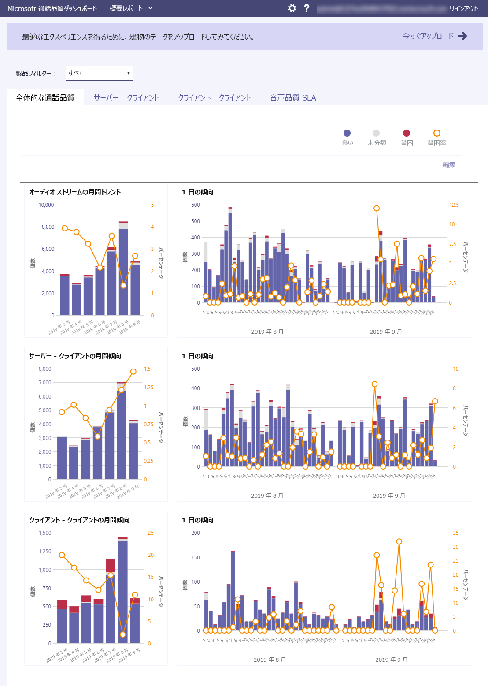
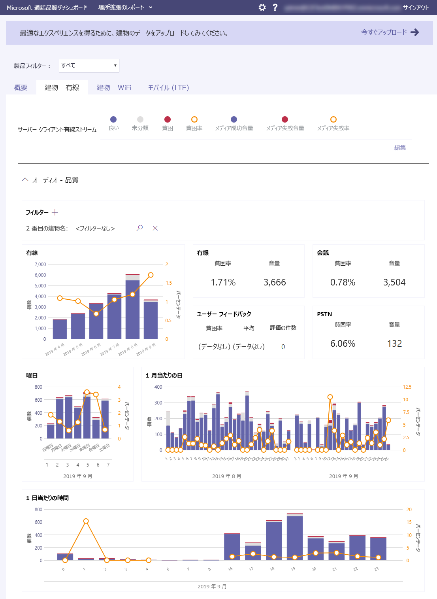

# 通話品質ダッシュボード (CQD) とは何ですか?

Microsoft 通話品質ダッシュボード (CQD)- [https://cqd.teams.microsoft.com](https://cqd.teams.microsoft.com) -Microsoft Teams、skype For Business Online、skype For Business Server 2019 で、**組織全体のレベル**で通話と会議の品質を示します。 

  
CQD の最新バージョンには、[ほぼリアルタイム (NRT) データフィード](CQD-data-and-reports.md)が含まれています。つまり、通話の終了後30分以内に CQD で通話記録を利用できます。

CQD には、[エンドユーザーを特定できる情報 (euii) データ](CQD-data-and-reports.md#euii-data)が含まれていますが、 [Microsoft 365 全体の euii](https://docs.microsoft.com/office365/Enterprise/office-365-data-retention-deletion-and-destruction-overview)と同じ方法で管理されます。

CQD は、チーム管理者、Skype for Business 管理者、およびネットワークエンジニアが組織全体のレベルで通話と会議の品質を監視できるように設計されています。 CQD を使用して、パフォーマンスを向上するために**ネットワークの最適化**を支援します。 **特定のユーザー**の通話と会議の情報を表示する必要がある場合は、CQD データとユーザーごとの[通話分析](use-call-analytics-to-troubleshoot-poor-call-quality.md)を組み合わせて使用します。

たとえば、CQD を使用すると、ユーザーの低品質の通話音質 (ユーザーごとの通話分析を使用した場合) が、ネットワークの問題が原因であることを確認できます。これは、他の多くのユーザーにも影響します。 CQD は、個々の通話環境と、Teams または Skype for Business を使って発信した通話の全体的な品質を把握します。 CQD を使用すると、全体的なパターンが明らかになることがあります。これにより、ネットワークエンジニアは、通話品質について通知を受けることができます。 CQD は通話品質指標のレポートを提供します。これにより、全体的な通話品質、サーバークライアントストリーム、クライアントクライアントストリーム、音声品質[SLA](https://go.microsoft.com/fwlink/p/?linkid=846252)を把握できます。 
  

CQD では、建物やエンドポイントの情報をアップロードすることをお勧めします。これにより、場所で強化されたレポートを使用して、ユーザーの建物内の通話品質と信頼性を分析することができます。 問題が1人のユーザーに限定されているか、またはユーザーの大きなセグメントに影響するかを判断するために、データを評価することができます。 CQD で建物またはエンドポイント固有のビューを有効にするには、管理者が、CQD**テナントデータアップロード**ページで[建物またはエンドポイントの情報をアップロード](CQD-upload-tenant-building-data.md)する必要があります。

チームの管理者またはサポートエンジニアがチームのサービス品質を管理するための詳細なガイダンスを提供[している skype 通話と会議の品質](quality-of-experience-review-guide.md)に関する記事をお見逃しなく。

## 以前のバージョンの CQD (CQD.lync.com)

CQD の現在のバージョン ( https://CQD.Teams.microsoft.com) CQD の旧バージョンは置き換えられ https://CQD.lync.com) ます。 引き続き CQD.lync.com (Skype for Business 管理センターから利用可能) を使用できますが、2020年7月1日の時点では、CQD のデータを使用しています。Teams.microsoft.com。 CQD.lync.com へのアクセスをすぐにオフにします。そのため、CQD に移動してください。まだインストールしていない場合は、Teams.microsoft.com します。

> [!IMPORTANT]
> 2020年7月1日以降、古い CQD (CQD.lync.com) から文書作成またはクエリのデータを表示または変更することはできなくなります。 CQD.lync.com からまだこのデータを移行しておらず、引き続き必要な場合は、サポートチケットを記録してください。

## Power BI を使用して CQD データを分析する

2020年1月の新[機能: POWER BI クエリテンプレートをダウンロードして CQD](https://github.com/MicrosoftDocs/OfficeDocs-SkypeForBusiness/blob/live/Teams/downloads/CQD-Power-BI-query-templates.zip?raw=true)します。 CQD データの分析と報告に使用できる、カスタマイズ可能な Power BI テンプレート。

詳細については、「 [POWER BI を使用して CQD データを分析する](CQD-Power-BI-query-templates.md)」を参照してください。

## 関連項目

[Teams の通話品質を向上させて監視する](monitor-call-quality-qos.md)

[通話品質ダッシュボード (CQD) を設定する](turning-on-and-using-call-quality-dashboard.md)

[テナントのアップロードとデータの構築](CQD-upload-tenant-building-data.md)

[CQD データとレポート](CQD-data-and-reports.md)

[CQD を使用して通話と会議の品質を管理する](quality-of-experience-review-guide.md)

[CQD で使用できるディメンションとメジャー](dimensions-and-measures-available-in-call-quality-dashboard.md)

[CQD でのストリームの分類](stream-classification-in-call-quality-dashboard.md)

[Power BI を使用して CQD データを分析する](CQD-Power-BI-query-templates.md)

[チームのトラブルシューティング](https://docs.microsoft.com/MicrosoftTeams/troubleshoot/teams)