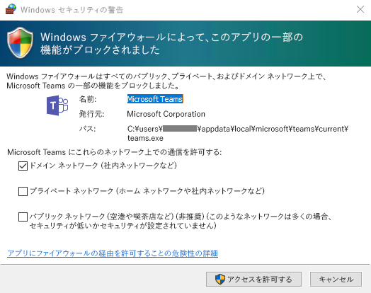

Microsoft Teams のクライアントを取得するGet clients for Microsoft Teams 
===========================

Microsoft Teams には、Web、デスクトップ (Windows および Mac)、およびモバイル (Android、iOS、Windows Phone) で利用できるクライアントがあります。これらのクライアントはすべてアクティブなインターネット接続が必要で、オフライン モードをサポートしていません。Microsoft Teams has clients available for web, desktop (Windows and Mac), and mobile (Android, iOS, and Windows Phone). These clients all require an active internet connection and do not support an offline mode.

Web クライアントWeb client 
----------------

Web クライアント ([https://teams.microsoft.com](https://go.microsoft.com/fwlink/?linkid=855753)) は、さまざまなブラウザーから使用できる、完全な機能クライアントです。現時点では、Web クライアントはリアルタイム通信 (会議への参加、1 対 1 の通話) をサポートしていません。また、ブラウザーはサードパーティの Cookie を許可するように設定する必要があります。The web client ([https://teams.microsoft.com](https://go.microsoft.com/fwlink/?linkid=855753)) is a full, functional client that can be used from a variety of browsers. At this point, the web client does not support real-time communications (i.e. joining meetings and having one-to-one calls). The browser must also be configured to allow 3^rd^-party cookies.

Web ブラウザーで Microsoft Teams を利用するために必要となるプラグインやダウンロードはありません。There is no plugin or download required to leverage Microsoft Teams using a web browser.

Web クライアントは、[https://teams.microsoft.com](https://go.microsoft.com/fwlink/?linkid=855753) への接続時にブラウザー バージョンの検出を実行します。サポートされていないブラウザー バージョンを検出した場合、Web インターフェイスへのアクセスをブロックし、ユーザーによるデスクトップ クライアントまたはモバイル アプリのダウンロードを推奨します。The Web client performs browser version detection upon connecting to [https://teams.microsoft.com](https://go.microsoft.com/fwlink/?linkid=855753) and if an unsupported browser version is detected, it will block access to the Web interface and recommend that the user download the desktop client or mobile app.

Microsoft Teams は、次のブラウザーおよびバージョンをサポートしています。Microsoft Teams supports the following browsers and versions:

-   **Edge**: 12 以上**Edge**: 12+

-   **Internet Explorer:** 11 以上Internet Explorer 11

-   **Chrome**: 51.0 以上**Chrome**: 51.0+

-   **Firefox**: 47.0 以上**Firefox**: 47.0+

| | |
|---------|---------|
|  重要Important:     |Safari はまだサポートされていませんが、まもなく対応します。Safari is not yet supported, but is coming soon.         |

デスクトップ クライアントDesktop clients
------------------------

Microsoft Teams デスクトップ クライアントはスタンドアロン アプリケーションであり、現在は Office Pro Plus の一部ではありません。Microsoft Teams は、32 ビットおよび 64 ビット バージョンの Windows (7 以上)、および MacOS (10.10 以上) で利用できます。Microsoft Teams desktop client is a standalone application and currently not part of Office Pro Plus. Microsoft Teams is available for both Windows (7+), both 32-bit and 64-bit versions, and MacOS (10.10+).

デスクトップ クライアントは、チーム会議、グループ通話、およびプライベートな 1 対 1 での通話に対応するリアルタイム通信のサポート (オーディオ、ビデオ、およびコンテンツ共有) を提供します。The desktop clients provide real-time communications support (audio, video, and content sharing) for team meetings, group calling and private one-on-one calls.

デスクトップ クライアントは、適切なローカルのアクセス許可を持っているエンド ユーザーによって、[https://teams.microsoft.com/downloads](https://go.microsoft.com/fwlink/?linkid=855754) から直接ダウンロードおよびインストールできます (管理者権限は、Teams クライアントを PC にインストールする場合には必要ありませんが、Mac では必要になります) 。Desktop clients can be downloaded and installed by end users directly from [https://teams.microsoft.com/downloads](https://go.microsoft.com/fwlink/?linkid=855754) if they have the appropriate local permissions (admin rights are not required to install the Teams client on a PC but are required on a Mac).

IT 管理者は好みの方法で、System Center Configuration Manager (Windows)、Casper Suite (MacOS) のような組織内のコンピューターにインストール ファイルを配布できます。IT admins can choose their preferred method to distribute the installation files to machines in their organization such as System Center Configuration Manager (Windows) or Casper Suite (MacOS).

| | |
|---------|---------|
|  注意Note:    |これらのメカニズムによるクライアントの配布は、Microsoft Teams クライアントの初回インストール時にのみ利用でき、それ以降の更新では利用できません。Distribution of the client via these mechanisms is only for the initial installation of Microsoft Team clients and not for future updates.         |

#### WindowsWindows

Windows 用のMicrosoft Teams インストールでは、32 ビットおよび 64 ビット アーキテクチャでダウンロード可能なインストーラーを提供しています。そのアーキテクチャは、オンライン ダウンロードで既定として提示される OS のアーキテクチャと一致する必要があります。The Microsoft Teams installation for Windows provides downloadable installers in 32-bit and 64-bit architecture. The architecture should match that of the OS, which is what the online download defaults to.

| | |
|---------|---------|
|  注意Note:    |Microsoft Teams のアーキテクチャ (32 ビットと 64 ビット) はインストールされている Office のアーキテクチャに依存しません。The architecture (32-bit vs. 64-bit) of Microsoft Teams is agnostic to the architecture of Office that is installed.        |

Windows クライアントは、ユーザーのプロファイルにある AppData フォルダーに展開されます。ユーザーのローカル プロファイルに展開すると、クライアントは管理者特権を必要とせずにインストール可能になります。Windows クライアントは次の場所にインストールされます。The Windows client is deployed to the AppData folder located in the user’s profile. Deploying to the user’s local profile allows the client to be installed without requiring elevated rights. The Windows client is installed in the following locations:

-   %appdata%\\local\\Microsoft\\Teams%appdata%\\local\\Microsoft\\Teams

-   %appdata%\\roaming\\Microsoft\\Teams%appdata%\\roaming\\Microsoft\\Teams

ユーザーが Microsoft Teams クライアントを使用して初めて通話を開始すると、ユーザーに通信の許可を求める Windows ファイアウォール設定に関する警告が通知される場合があります。警告を受け入れなくても通話は機能するため、このメッセージを無視するように指示される場合があります。When users initiate a call using the Microsoft Teams client for the first time, they might notice a warning with the Windows firewall settings that asks for users to allow communication. Users may be instructed to ignore this message because the call will work, even when the warning is dismissed.

| | |
|---------|---------|
|  注意Note:    |Windows ファイアウォール設定は、[キャンセル] の選択によりプロンプトが受け入れられなかった場合でも変更されます。TCP および UDP プロトコルの両方に関するブロック アクションで、teams.exe に関する2 つの着信ルールが作成されます。Windows Firewall configuration will be altered even when the prompt is dismissed by selecting “Cancel”. Two inbound rules for teams.exe will be created with Block action for both TCP and UDP protocols.        |

#### MacMac

Microsoft は Mac OSX コンピューター用の DMG インストール ファイルも提供しています。Mac クライアントのインストールには管理アクセスが必要です。Mac OSX クライアントは次の場所にインストールされます。Microsoft also provides a DMG installation file for Mac OSX computers. Administrative access is required to install the Mac client. The Mac OSX client is installed to the following location:

\~/Library/Application Support/Microsoft/Teams\~/Library/Application Support/Microsoft/Teams

モバイル クライアントIM/Presence in Mobile clients
--------------

Microsoft Teams のモバイル アプリは Android、iOS、および Windows Phone で利用でき、チャットベースの会話に参加している外出中のユーザーを対象としており、ピアツーピアの音声通話が使用できます。モバイル アプリについては、Google Play、Apple App Store、および Microsoft Store の関連するモバイル ストアにアクセスしてください。The Microsoft Teams mobile apps are available for Android, iOS, and Windows Phones, and are geared for on-the-go users participating in chat-based conversations and allow peer-to-peer audio calls. For mobile apps, go to the relevant mobile store for Google Play, Apple App Store, and Microsoft Store.

Microsoft Teams モバイル アプリのサポートされるモバイル プラットフォームは次のとおりです。Supported mobile platforms for Microsoft Teams mobile apps are the following:

-   **Android**: 4.4 以降**Android**: 4.4 or later

-   **iOS**: 10.0 以降**iOS**: 10.0 or later

-   **Windows Phone**: Windows 10 Mobile**Windows Phone**: Windows 10 Mobile

モバイル アプリはそれぞれのモバイル プラットフォームのアプリ ストアからのみ配布および更新され、MDM (モバイル デバイス管理) ソリューションまたはサイド ロードからは配布することはできません。Mobile apps are distributed and updated through the respective mobile platform’s app store only, and are not available to be distributed through MDM (mobile device management) solutions or side-loaded.

| | | |
|---------|---------|---------|
|      |判断ポイントPolicy Decision Point         |ユーザーが適切な Microsoft Teams クライアントをデバイスにインストールすることを妨げる制限事項はありますか?Are there any restrictions preventing users from installing the appropriate Microsoft Teams client on their devices?         |
|     |次のステップNext Steps         |組織によってソフトウェアのインストールが制限されている場合、処理が Microsoft Teams に対応していることを確認してください。注意: 管理者権限は、PC クライアント インストールでは必要ありませんが、Mac へのインストールでは必要になります。If your organization restricts software installation, make sure that process is compatible with Microsoft Teams. Note: Admin rights are not required for PC client installation but are required for installation on a Mac.         |

    判断ポイント   ユーザーが適切な Microsoft Teams クライアントをデバイスにインストールすることを妨げる制限事項はありますか?  Decision Point   Are there any restrictions preventing users from installing the appropriate Microsoft Teams client on their devices?

クライアントの更新管理Client update management
------------------------

クライアントは現在、IT 管理者の介入を必要とせずに Microsoft Teams サービスによって自動的に更新されています。利用可能な更新がある場合、クライアントは自動的にその更新をダウンロードします。アプリが一定時間アイドル状態となった場合には更新処理が開始されます。Clients are currently updated automatically by the Microsoft Teams service with no IT administrator intervention required. If an update is available, the client will automatically download the update and when the app has idled for a period of time, the update process will kick off.

クライアント側の設定Client-side configurations
---------------------------

現在、テナント管理者、PowerShell、グループ ポリシー オブジェクトまたはレジストリのいずれかを介してクライアントを設定するオプションはサポートされていません。Currently, there are no supported options available to configure the client either through the tenant admin, PowerShell, Group Policy Objects or the registry.

通知設定Notification settings
----------------------------

現在、IT 管理者がクライアント側の通知設定を設定するオプションはありません。通知オプションはすべてユーザーによって設定されます。次の図に、既定のクライアント設定の概要を示します。There are currently no options available for IT administrators to configure client-side notification settings. All notification options are set by the user. The figure below outlines the default client settings.

