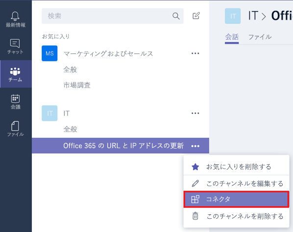
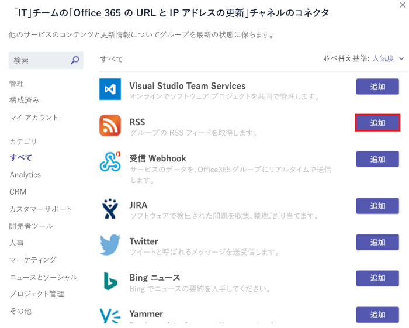
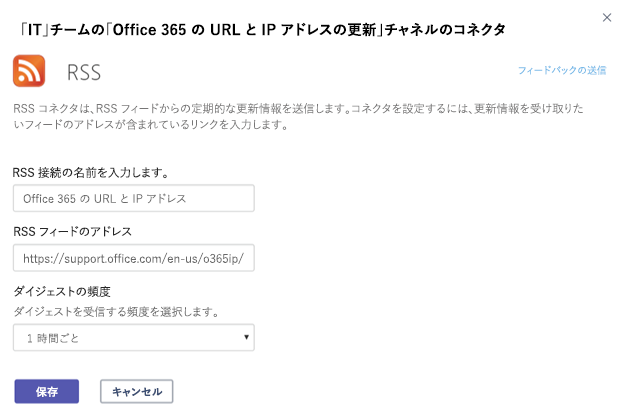

# Microsoft 365コネクタとカスタム コネクタを使用Microsoft TeamsUse Microsoft 365 and custom connectors in Microsoft Teams

コネクタは、頻繁に使用されるコンテンツとサービスの更新をチャネルに直接配信することで、チームを最新の状態に保つ。Connectors keep your team current by delivering frequently used content and service updates directly into a channel. コネクタを使用すると、Microsoft Teams ユーザーは、チームのチャット ストリーム内で Trello、Wunderlist、GitHub、Azure DevOps Services などの一般的なサービスから更新プログラムを受信できます。With connectors, your Microsoft Teams users can receive updates from popular services such as Trello, Wunderlist, GitHub, and Azure DevOps Services within the chat stream in their team.

チームのメンバーは誰でも、チームのアクセス許可が許可されている場合に、人気のあるクラウド サービスにコネクタを接続できます。また、すべてのチーム メンバーには、そのサービスからのアクティビティが通知されます。Any member of a team can connect their team to popular cloud services with the connectors if the team permissions allow, and all team members are notified of activities from that service. コネクタは、コネクタを最初にセットアップしたメンバーが離した後でも引き続き機能します。Connectors will continue to function even after the member who has initially setup the connector has left. add\remove アクセス許可を持つチーム メンバーは、他のメンバーによるコネクタのセットアップを変更できます。Any team member with the permissions to add\remove can modify connectors setup by other members.

Microsoft 365コネクタは、Microsoft Teams グループと Microsoft 365 グループの両方で使用することができるので、すべてのメンバーが同期を取り合い、関連する情報をすばやく受信しやすくなります。Microsoft 365 connectors can be used with both Microsoft Teams and Microsoft 365 groups, making it easier for all members to stay in sync and receive relevant information quickly. 両方Microsoft TeamsとExchange同じコネクタ モデルを使用します。これにより、両方のプラットフォーム内で同じコネクタを使用できます。Both Microsoft Teams and Exchange use the same connector model, which allows you to use the same connectors within both platforms. ただし、チームが依存している Microsoft 365 グループのコネクタを無効にすると、そのチーム用のコネクタを作成する機能も無効にされます。It is worth noting, however, that disabling connectors for the Microsoft 365 group that a team is dependent upon will disable the ability to create connectors for that team as well.

> [!NOTE]
> コネクタは、既定では、一部の環境GCC無効になっています。Connectors are disabled by default in GCC environments. 有効にする必要がある場合は、ConnectorsEnabled または ConnectorsEnabledForTeams パラメーターを [Set-OrganizationConfig](https://docs.microsoft.com/powershell/module/exchange/set-organizationconfig) コマンドレットを使用$true に設定します。If you need to enable them, set the ConnectorsEnabled or ConnectorsEnabledForTeams parameters to $true with the [Set-OrganizationConfig](https://docs.microsoft.com/powershell/module/exchange/set-organizationconfig) cmdlet. 以前は[、PowerShell に接続Exchange Online必要があります](https://docs.microsoft.com/powershell/exchange/connect-to-exchange-online-powershell)。You previously need to [connect to Exchange Online PowerShell](https://docs.microsoft.com/powershell/exchange/connect-to-exchange-online-powershell).

> [!NOTE]
> Government Cloud Community (GCC) 環境では、コネクタは既定で無効になっています。Connectors are disabled by default in the Government Cloud Community (GCC) environments. 有効にする必要がある場合は、ConnectorsEnabled または ConnectorsEnabledForTeams パラメーターを [SetOrganizationConfig](/powershell/module/exchange/set-organizationconfig?view=exchange-ps) コマンドレット$trueに設定します。If you need to enable them, set the ConnectorsEnabled or ConnectorsEnabledForTeams parameters to $true with the [SetOrganizationConfig](/powershell/module/exchange/set-organizationconfig?view=exchange-ps) cmdlet. 以前は、PowerShell に接続するExchange Online[必要がありました](/powershell/exchange/connect-to-exchange-online-powershell?view=exchange-ps)。You previously needed to connect to the [Exchange Online PowerShell](/powershell/exchange/connect-to-exchange-online-powershell?view=exchange-ps).

## コネクタをチャネルに追加するAdd a connector to a channel

現時点では、デスクトップクライアントと Web クライアントを使用Microsoft Teamsコネクタを追加できます。Currently, you can add connectors by using Microsoft Teams desktop and web clients. ただし、これらのコネクタによって投稿された情報は、モバイルを含むすべての **クライアントで** 表示できます。However, information posted by these connectors can be viewed in **all clients** including mobile.

1. チャネルにコネクタを追加するには、チャネル名の右側にある省略記号 **(...)** をクリックし、[コネクタ] を **クリックします**。To add a connector to a channel, click the **ellipses (…),** on the right of a channel name, then click **Connectors**.

    > [!div class="mx-imgBorder"]
    > ![[コネクタ] オプションTeamsインターフェイスのスクリーンショット。](media/Use_Office_365_and_custom_connectors_in_Microsoft_Teams_image1.png)

2. さまざまな使用可能なコネクタから選択し、[追加] をクリック **します**。You can select from a variety of available connectors, and then click **Add**.

    > [!div class="mx-imgBorder"]
    > ![使用可能なコネクタを示す [コネクタ] ダイアログのスクリーンショット。](media/Use_Office_365_and_custom_connectors_in_Microsoft_Teams_image2.png)

3. 選択したコネクタについて必須情報を入力し、[**保存**] をクリックします。各コネクタは、正常に機能するためにさまざまな必須情報を要求します。一部のコネクタでは、コネクタの構成ページに掲載されるリンクを使用してサービスにサインインする必要があります。Fill in the required information of the selected connector and click **Save**. Each connector requires a diverse set of information to function properly, and some may require you to sign in to the service using the links provided on the connector configuration page.

    > [!div class="mx-imgBorder"]
    > ![RSS コネクタの [構成] ページのスクリーンショット。](media/Use_Office_365_and_custom_connectors_in_Microsoft_Teams_image3.png)

4. コネクタによって提供されるデータはチャネルに自動的に投稿されます。Data provided by the connector is automatically posted to the channel.

    > [!div class="mx-imgBorder"]
    > 

<!---Delete this section after customer migration to new Webhook URL is complete--->
> [!IMPORTANT]
> **コネクタ URL の更新通知****Connector URL update notification**
>
> 新Teams、セキュリティを強化するために新しい URL に移行しています。The Teams connectors are transitioning to a new URL to enhance security. この移行の過程で、新しい URL を使用するように構成されたコネクタを更新する特定の通知が表示されます。During the course of this transition, you will receive certain notifications to update your configured connector to use the new URL. コネクタ サービスの中断を防ぐために、コネクタを直ちに更新強く推奨します。It is strongly recommended that you update your connector immediately to prevent any disruption to connector services. URL を更新するには、次の手順に従う必要があります。The following steps need to be followed to update the URL:
> 1. コネクタの構成ページで、更新する必要がある接続の [管理] ボタンの下に "注意が必要です" というメッセージが表示されます。In the connectors configuration page, an "Attention Required" message will be displayed under the "Manage" button for the connections that need to be updated.
> 
> 2. 受信 webhook コネクタの場合、[URL の更新] を選択し、新しく生成された webhook URL を使用するだけで、接続を再作成できます。For incoming webhook connectors, users can recreate the connection by simply selecting **Update URL** and using the newly generated webhook URL.
> ![[URL の更新] ボタンのスクリーンショット。](media/Teams_update_URL_button.png)
> 3. 他の種類のコネクタの場合、ユーザーはコネクタを削除し、コネクタの構成を再作成する必要があります。For other connector types, the user would need to remove the connector and recreate the connector configuration.
> 4. URL が正常に更新されると、"URL は最新の情報です" というメッセージが表示されます。You will see a message "URL is up-to-date" after the URL has been successfully updated.
> 

## カスタム コネクタを開発するDevelop custom connectors

受信および送信 Webhook だけでなく、カスタム コネクタを構築することもできます。You can also build custom connectors, as well as incoming and outgoing webhooks. 詳細については、「[開発者向けドキュメント](/microsoftteams/platform/webhooks-and-connectors/what-are-webhooks-and-connectors)」を参照してください:See our [developer documentation](/microsoftteams/platform/webhooks-and-connectors/what-are-webhooks-and-connectors) for more information.
