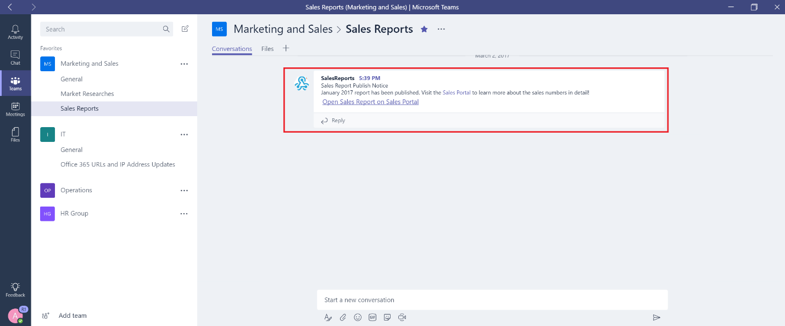

Microsoft Teams で Office 365 コネクタとカスタム コネクタを使用する
=======================================================

コネクタは、頻繁に使用されるコンテンツとサービスの更新をチャネルに直接配信することで、チームを最新の状態に維持します。 コネクタを使用すると、Microsoft Teams ユーザーは、Twitter、Trello、Wunderlist、GitHub、Azure DevOps サービスなどの一般的なサービスからの更新情報を、チームのチャットストリームで受け取ることができます。

チームの権限が許可されていて、すべてのチームメンバーがそのサービスのアクティビティについて通知する場合は、チームのメンバー全員がそのコネクタを使用して、チームの主要なクラウドサービスに接続できます。 コネクタを最初に設定したメンバーが残っている場合でも、コネクタは引き続き機能します。 権限を持つすべてのチームメンバーは、他のメンバーによるコネクタの設定を変更できます。

Office 365 コネクタは Microsoft Teams と Office 365 の両方のグループで使用できるため、すべてのメンバーが簡単に同期して関連情報を受け取ることができます。 Microsoft Teams と Exchange は両方とも同じコネクタモデルを使用しており、両方のプラットフォームで同じコネクタを使用できます。 ただし、チームが依存している Office 365 グループのコネクタを無効にすると、そのチームのコネクタの作成機能も無効になります。

チャネルにコネクタを追加する
----------------------------

現時点では、Microsoft Teams のデスクトップと web クライアントを使用してコネクタを追加できます。 ただし、これらのコネクタによって投稿された情報は、mobile を含む**すべてのクライアント**で表示できます。

1. チャネルにコネクタを追加するには、チャネル名の右にある**省略記号 (...)** をクリックし、[**コネクタ**] をクリックします。

    ![[コネクタ] オプションが選択されている Teams インターフェイスのスクリーンショット。](media/Use_Office_365_and_custom_connectors_in_Microsoft_Teams_image1.png)

2. さまざまなコネクタから選んで、[**追加**] をクリックします。

    ![使用可能なコネクタが表示されている [コネクタ] ダイアログのスクリーンショット。](media/Use_Office_365_and_custom_connectors_in_Microsoft_Teams_image2.png)

3. 選択したコネクタについて必須情報を入力し、[**保存**] をクリックします。各コネクタは、正常に機能するためにさまざまな必須情報を要求します。一部のコネクタでは、コネクタの構成ページに掲載されるリンクを使用してサービスにサインインする必要があります。

    ![RSS コネクタの [構成] ページのスクリーンショット。](media/Use_Office_365_and_custom_connectors_in_Microsoft_Teams_image3.png)

4. コネクタによって提供されるデータはチャネルに自動的に投稿されます。

    

カスタム コネクタを開発する
-----------------------------

基幹業務 (LOB) アプリケーションと統合できるカスタムコネクタの開発は非常に簡単です。 組み込みの**受信 Webhook**コネクタを使って、HTTP post メソッドを使って任意のアプリケーションからデータを引き出すチャネルのエンドポイントを作成できます。

1. **着信 Web フック**をその他のコネクタと同じ方法で追加します。

    

2. Web フックを作成するには、**名前**を指定し、必要に応じて Web フックの画像を更新します。続けて [**作成**] をクリックします。

    

3. このチャネルにデータをプッシュするアプリケーションには、Webhook コネクタ URL が必要です。 Webhook の作成時に一意の URL が作成されます。 必要に応じて、データをプッシュするようにアプリケーションを構成できるように、この URL を開発者と共有します。

    

4. 外部アプリケーションによってコネクタへのデータのプッシュが実行されると、**コネクタ カード** メッセージと呼ばれる特別なメッセージがチャネルの会話リストに表示されます。

    

     開発者は、ウィザードによって提供されるエンドポイントの固有の URL である、単純な JSON ペイロードの HTTP 要求をチームの Webhook アドレスに送信することによって、これらのカードを作成するようにアプリケーションを構成できます。 詳細な手順とコネクタのサンプルが含まれている Microsoft Developer ネットワークで、 [Microsoft Teams の Office 365 コネクタの使用を開始](https://docs.microsoft.com/en-us/microsoftteams/platform/concepts/connectors/connectors)することを開発者に確認してください。 その他のリソースには、Outlook および[Office デベロッパーセンター– Microsoft Teams](https://go.microsoft.com/fwlink/?linkid=855784)の[グループへのアプリの接続](https://support.office.com/article/Connect-apps-to-your-groups-in-Outlook-ed0ce547-038f-4902-b9b3-9e518ae6fbab)が含まれます。
