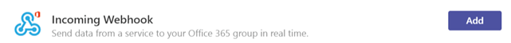

Microsoft のチームで Office 365 ユーザー設定コネクタを使用します。
=======================================================

コネクタでは、チャンネルに直接頻繁に使用するサービスからのコンテンツと更新プログラムを提供することで現在、チームを保持します。コネクタを使用 Microsoft チーム ユーザーは、Twitter、Trello、Wunderlist、GitHub、VSTS など、チームでチャット ストリーム内の一般的なサービスから更新を受け取ることができます。

チームのメンバーが、コネクタでの一般的なクラウド サービスに自分のチームを接続できるし、そのサービスからのアクティビティのすべてのチーム メンバーは通知します。チームからユーザーを削除する場合は、削除したユーザーによって、チームに追加されたすべてのコネクタは動作を停止します。スケジュールされた会議では、グループの予定表をオンになっているために使用できます。

Office 365 のコネクタは、両方の Microsoft チームで使用できると Office 365 グループを簡単にすべてのメンバーのでもと関連する情報をすばやく表示します。Microsoft チームと Exchange の両方、両方のプラットフォームで同じコネクタを使用することができますが、同じコネクタ モデルを使用します。

現時点では、Microsoft チーム デスクトップと web クライアントを使用してコネクタを追加することができます。ただし、これらのコネクタが投稿された情報は、モバイルを含む**すべてのクライアント**を使用して表示できます。

1.  チャンネルにコネクタを追加するには、チャンネル名の右側の**省略記号 (…)]**をクリックし] をクリックして**コネクタ**。

    ![選択されているチャンネル名とコネクタ] オプションが選択されているチーム インターフェイスのスクリーン ショット。](media/Use_Office_365_and_custom_connectors_in_Microsoft_Teams_image1.png)

2.  ユーザーは、使用可能なコネクタは、さまざまなからを選択し、[**追加**] をクリックします。

    ![[コネクタ] ダイアログのコネクタを追加するためのスクリーン ショット。](media/Use_Office_365_and_custom_connectors_in_Microsoft_Teams_image2.png)

3.  選択したコネクタの必要な情報を入力し、[**保存**] をクリックします。各コネクタには、さまざまな一連の情報が正常に機能が必要です。 とコネクタの構成] ページに表示されているリンクを使用して、サービスにサインインするのにはいくつかあります。

    ![RSS コネクタの構成] ページのスクリーン ショット。](media/Use_Office_365_and_custom_connectors_in_Microsoft_Teams_image3.png)

4.  チャネルをコネクタによって提供されるデータが自動的に転記します。

    

ユーザー設定コネクタを作成します。
-----------------------------

基幹業務 (LOB) アプリケーションに統合可能なユーザー設定コネクタを開発する非常に簡単できます。組み込みの**着信 Webhook**コネクタを使用するには、HTTP post メソッドを使用しているアプリケーションからのデータを抽出するチャネルの両端のシートを作成します。

1.  その他のすべてのコネクタのような**着信 Webhook**を追加します。

    

2.  Webhook を作成するには、**名**を指定して、必要に応じて、Webhook イメージを更新および**作成**] をクリックします。

    ![受信した Webhook コネクタの構成] ページのスクリーン ショット。 ](media/Use_Office_365_and_custom_connectors_in_Microsoft_Teams_image6.png)

3.  このチャネルにデータをプッシュするアプリケーションでは、Webhook コネクタの URL が必要です。**Webhook**の作成時に、**一意の URL**が作成されます。必要に応じて、データをプッシュするアプリケーションを構成することができるように、開発者は、この URL を共有します。

    

4.  外部アプリケーションでは、データをプッシュ コネクタに、メッセージが**コネクタ カード**メッセージと呼ばれる特殊なメッセージとしてチャネル会話ボックスの一覧で表示されます。

    

開発者は、Microsoft チームの Webhook アドレスに、ウィザードによって提供されるエンドポイントの一意の URL で単純な JSON ペイロード HTTP 要求を送信して、これらのカードを作成するのには、アプリケーションを構成できます。[チームの Microsoft Office 365 のコネクタの使用を開始する](https://go.microsoft.com/fwlink/?linkid=855783)、ネットワーク上で Microsoft 開発、詳細な手順と、コネクタのサンプルを参照して、開発者があります。その他のリソースには、 [Outlook でグループへの接続アプリ](https://support.office.com/en-us/article/Connect-apps-to-your-groups-in-Outlook-ed0ce547-038f-4902-b9b3-9e518ae6fbab)と[Office デベロッパー センター – Microsoft チーム](https://go.microsoft.com/fwlink/?linkid=855784)が含まれます。
