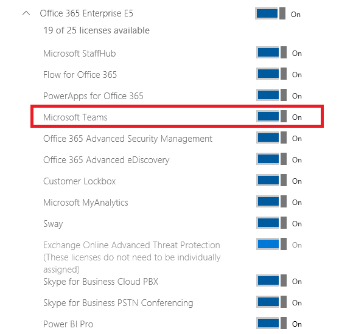
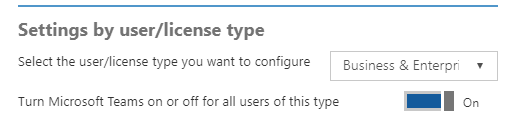

Microsoft Teams 用の Office 365 ライセンスOffice 365 licensing for Microsoft Teams
========================================

Teams のユーザーを有効にする Office 365 サブスクリプションを次に示します。The following Office 365 subscriptions enable users for Teams:

|Small Business プランSmall Business Plans  |Enterprise プランEnterprise Plans  |Education プランEducation Plans  |
|---------|---------|---------|
|Office 365 Business EssentialsOffice 365 Business Essentials     |Office 365 Enterprise E1Office 365 Enterprise E1         |Office 365 EducationOffice 365 Education         |
|Office 365 Business PremiumOffice 365 Business Premium     |Office 365 Enterprise E3Office 365 Enterprise E3         |Office 365 Education PlusOffice 365 Education Plus         |
|     |Office 365 Enterprise E4 (廃止)Office 365 Enterprise E4 (retired)         |Office 365 Education E3 (廃止)Office 365 Education E3 (retired)         |
|     |Office 365 Enterprise E5Office 365 Enterprise E5         |Office 365 Education E5Office 365 Education E5   
      |Office 365 Enterprise F1Office 365 Enterprise F1 |  |

> [!NOTE]
> Teams は非営利団体でも利用できます。Teams is also available for non-profit organizations. 政府機関のライセンスは現時点ではサポートされていませんが、将来的にサポートするための調査が実施されています。Government licensing is not currently supported but is being investigated for future support.
        

Teams の**重要な**機能に関しては、Office 365 サブスクリプションのタイプ間で違いはありません。コンプライアンス機能の利用可否は適切なサブスクリプション レベルに依存します。In terms of Teams **core** functionalities, there are no differences between the different Office 365 subscriptions, the availability of the compliance capabilities does rely on the correct subscription level. (詳しくは、「[情報保護ライセンス](https://support.office.com/en-us/article/Plan-for-Office-365-security-and-information-protection-capabilities-3d4ac4a1-3920-4ff9-918f-011f3ce60408)」をご覧ください。)(See [Information Protection Licensing](https://support.office.com/en-us/article/Plan-for-Office-365-security-and-information-protection-capabilities-3d4ac4a1-3920-4ff9-918f-011f3ce60408) for more information.)

サポートされているすべてのサブスクリプション プランは、Teams の Web クライアント、デスクトップ クライアント、モバイル アプリにアクセスする資格を持ちます。All supported subscription plans are eligible for access to the Teams web client, desktop clients, and mobile apps.

Teams はスタンドアロンのサービスとして利用できません。Teams is not available as a standalone service.

Teams のライセンスTeams license
-------------

既定では、Teams ライセンスは、資格のある Office 365 サブスクリプションを持つすべてのユーザーで有効になります。By default, the Teams license is enabled for all users with eligible Office 365 subscriptions.

Teams は組織内での全体ライセンスの種類について、オンまたはオフにすることができます。また、ゲスト ユーザーを除くすべての種類のライセンスについて、既定でオンになります。Teams can be turned on or off for an entire license type within an organization and is turned on by default for all licenses types except guest users. **Office 365 管理センターの Teams スイッチを使用することにより、一部の種類のライセンスについて Teams をオンにすることはできません。****You can't turn on Teams for only part of a license type by using the Teams switch in the Office 365 Admin center.** 組織の一部に対して Teams をオンにして、それ以外についてはオフにしようとする場合 (たとえば一部の選ばれたユーザーのみでの Teams のパイロットを計画している場合など) は、Teams のライセンスのスイッチを全員に対してオンにしてから、個別のユーザーに対してオフにします。If you want to turn on Teams for some of your organization and turn it off for others (for example, if you're planning a Teams pilot with a select set of users), turn on the Teams license switch for everyone, then turn it off for individual users.

**ヒント:**   PowerShell からワークロード ライセンスとして Teams を有効または無効にすることは、別のワークロードとして実行されます。**Tip:**   Enabling and disabling Teams as a workload license through PowerShell is done just as any other workload. Microsoft Teams ではサービス プランの名前は TEAMS1 になります。The service plan name is TEAMS1 for Microsoft Teams. (詳細については、「[Office 365 PowerShell を使用してサービスへのアクセスを無効にする](https://technet.microsoft.com/en-us/library/dn771769.aspx)」をご覧ください。)(See [Disable access to services with Office 365 PowerShell](https://technet.microsoft.com/en-us/library/dn771769.aspx) for more information.)

**例:** 特定のライセンスの種類でのユーザー全員の Microsoft Teams を無効にする方法について以下に簡単な例を示します。**Sample:** Below is just a quick sample on how you would disable Microsoft Teams for everyone in a particular license type. まずこの方法を行い、次にパイロットで使用する目的でアクセスが必要なユーザーに対して個別に有効にする必要があります。You'll need to do this first, then individually enable it for the users who should have access for piloting purposes.

*組織内で利用可能なサブスクリプションの種類を表示するには、次のコマンドを使用します。**To display the subscription types you have within your organization, use the following command:*

      Get-MsolAccountSku

*組織名と自分の学校で使用するプランを含むプランの名前を記入します (例: ContosoSchool:ENTERPRISEPACK_STUDENT)。次に、次のコマンドを実行します。**Fill in the name of your plan that includes your organization name and the plan for your school (such as ContosoSchool:ENTERPRISEPACK_STUDENT), and then run the following commands:*

      $acctSKU="<plan name>
      $x = New-MsolLicenseOptions -AccountSkuId $acctSKU -DisabledPlans "TEAMS1"
*名前を付けたプランのアクティブなライセンスがあるすべてのユーザーに対して Microsoft Teams を無効にするには、次のコマンドを実行します。**To disable Microsoft Teams for all users with an active license for your named plan, run the following command:*

      Get-MsolUser | Where-Object {$_.licenses[0].AccountSku.SkuPartNumber -eq  ($acctSKU).Substring($acctSKU.IndexOf(":")+1,  $acctSKU.Length-$acctSKU.IndexOf(":")-1) -and $_.IsLicensed -eq $True} |  Set-MsolUserLicense -LicenseOptions $x