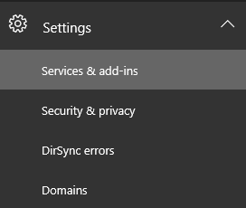
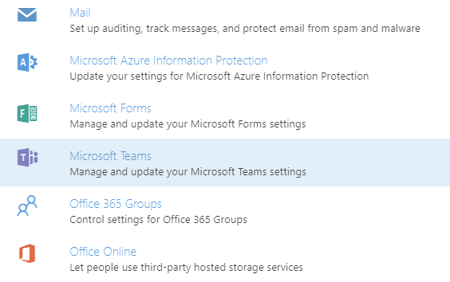

Office 365 を使用する組織で Microsoft Teams をセットアップするSet up Microsoft Teams in your Office 365 organization
======================================================

既定では、Microsoft Teams は、プレビュー時に Microsoft Teams を試用していない組織に対して有効になります。プレビューでテストを行った組織については、Microsoft Teams が一般的に利用可能になる前に設定した内容が引き継がれます。By default, Microsoft Teams is enabled for organizations who have not tried Microsoft Teams during the preview. For organizations who have been testing in preview, the setting will remain as what was set prior to general availability of Microsoft Teams.

組織の管理者は、ユーザー ライセンスを割り当てることで Microsoft Teams への個々のアクセスを制御できます。さらに、Microsoft Teams で使用できるコンテンツ ソースを許可または禁止できます。詳しくは、「[Microsoft Teams の管理者設定](https://support.office.com/article/3966a3f5-7e0f-4ea9-a402-41888f455ba2)」をご覧ください。As an administrator for your organization, you can assign user licenses to control individual access to Microsoft Teams and you can allow or block what content sources can be used in Microsoft Teams. See [Administrator settings for Microsoft Teams](https://support.office.com/article/3966a3f5-7e0f-4ea9-a402-41888f455ba2) for more details.

Microsoft Teams の有効と無効を切り替えるには、Office 365 テナントで次の手順を行います。Organizations who wish to change whether Microsoft Teams is enabled or not can follow the steps below to in their Office 365 tenant:

1.  グローバル管理者の権限を持つアカウントで [Office 365 管理センター](https://go.microsoft.com/fwlink/?linkid=854665)にサインインします。Sign in to [Office 365 Admin Center](https://go.microsoft.com/fwlink/?linkid=854665) with an account that has Global Administrator privileges.

2.  **[設定] > [サービスとアドイン]** に移動します。Navigate to **Settings Services** & add-ins.

    

3.  [サービスとアドイン] ページで **[Microsoft Teams]** をクリックします。On the Services & add-ins page, click **Microsoft Teams**.

    

4.  組織全体で Microsoft Teams を有効にするには、**トグル**を [**オン**] にし、[**保存**] をクリックします。To enable Microsoft Teams for the organization, set the **Toggle** to **On** and then click **Save**.

    

|  | |
|---------|---------|
|  注意Note     |Microsoft Teams のオンとオフの状態を切り替えるテナントレベルの機能は一時的に提供されており、今後廃止される予定です。廃止された後は、ユーザーレベルのライセンスのみで Microsoft Teams へのアクセスを制御します。The tenant-level capability to control the on/off status of Microsoft Teams is temporary and will be removed at some point in the future. At that time, access to Microsoft Teams is controlled via user-level licensing only.         |
