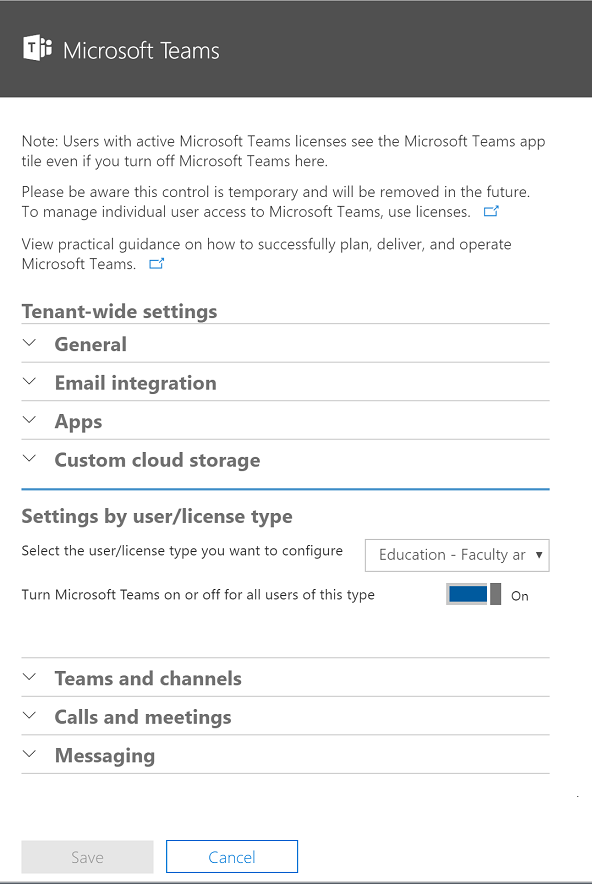

Office 365 の組織で、マイクロソフトのチームを有効にTurn on Microsoft Teams in your Office 365 organization
======================================================
> [!IMPORTANT]
> [!INCLUDE [new-teams-sfb-admin-center-notice](includes/new-teams-sfb-admin-center-notice.md)]

既定では、Teams はすべての組織でオンになります。By default, Teams is turned on for all organizations. プレビュー期間において Teams を使用した場合、Teams プレビューの間に設定したものと同じ設定がそのまま維持されます。If you used Teams during the preview period, the setting stays the same as what you set during your Teams preview.

組織の管理者は、ユーザー ライセンスを割り当てることで Teams への個々のアクセスを制御できます。さらに、Teams で使用できるコンテンツ ソースを許可または禁止できます。詳しくは、「[Microsoft Teams の管理者設定](https://support.office.com/article/3966a3f5-7e0f-4ea9-a402-41888f455ba2)」をご覧ください。As an administrator for your organization, you can assign user licenses to control individual access to Teams, and you can allow or block what content sources can be used in Teams. See [Administrator settings for Microsoft Teams](https://support.office.com/article/3966a3f5-7e0f-4ea9-a402-41888f455ba2) for more information.

個別のライセンスを管理する方法については、「[Microsoft Teams 用の Office 365 ライセンス](Office-365-licensing.md)」をご覧ください。To learn more about managing individual licenses, read [Office 365 licensing for Microsoft Teams](Office-365-licensing.md).

## 組織全体に対して Teams をオンまたはオフにするTurn Teams on or off for your entire organization
[!INCLUDE [global-switch-expiry-note](includes/global-switch-expiry-note.md)]

1.  グローバル管理者の権限を持つアカウントで [Office 365 管理センター](https://go.microsoft.com/fwlink/?linkid=854614)にサインインします。Sign in to the [Office 365 Admin center](https://go.microsoft.com/fwlink/?linkid=854614) with an account that has Global Administrator privileges.

2.  [**設定**]  >  [**サービスとアドイン**] に移動します。Go to **Settings** > **Services & add-ins**.

    ![Office 365 管理センターの、[サービスとアドイン] が選択されている [設定] セクションのスクリーンショット。Screenshot of the Settings section in the Office 365 admin center with Services & add-ins selected. ](media/Set_up_Microsoft_Teams_in_your_Office_365_organization_image1.png)

3.  [サービスとアドイン] ページで **[Microsoft Teams]** をクリックします。On the Services & add-ins page, click **Microsoft Teams**.

    ![[Microsoft Teams] が選択されている [サービスとアドイン] ページのスクリーンショット。](media/Set_up_Microsoft_Teams_in_your_Office_365_organization_image2.png)

4.  組織に対して Teams を有効にするには、ライセンス選択ウィンドウで各ライセンスを選択してからトグルを [**オン**] に設定して [**保存**] をクリックします。To turn on Teams for the organization use the license picker and select each license then set the toggle to **On** and then click **Save**.

    
