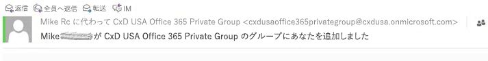
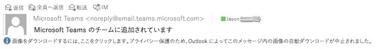
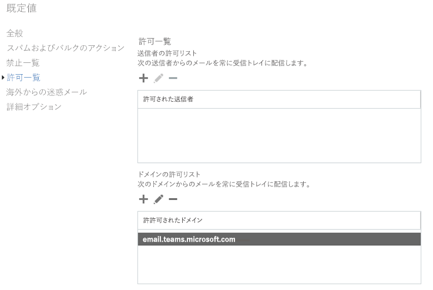

Microsoft Teams SMTP ドメインを承認済みドメインとして Exchange Online に追加するAdd the Microsoft Teams SMTP domain as an accepted domain in Exchange Online 
=============================================================================

管理コンソールに Office 365 グループを作成するか、Outlook を使って Office 365 グループを作成するかに関わらず、グループに追加したチーム メンバーへの通知の送信には Exchange Online が使用されます。通知は、既定のドメイン SMTP FQDN であるテナントから生成されます。Whether you create an Office 365 Group in the admin console or by using Outlook, Exchange Online is used to send notifications of a team member being added to a Group. These messages are generated from your tenant as they represent your default domain SMTP FQDN.

Teams は追加済みのチーム メンバーに通知を送信するために Microsoft Exchange Online も使用します。SMTP メッセージのドメイン FQDN の場合は、「@email.teams.microsoft.com」という形式が使用され、この形式はスパム フィルタリングによって検出されます。次の画像が示すように、Outlook はこのメッセージを外部送信者として認識し、画像や特定のコンテンツの遮断といった標準的なセキュリティ機能を適用します。Teams uses Microsoft Exchange Online as well to send notifications to team members when they’ve been added. The difference being the domain FQDN of the SMTP message is “@email.teams.microsoft.com” and could be caught by spam filtering. As you can see from the image below, Outlook considers this message as an external sender which is subject to standard security features such as blocking images and certain content.

最良の結果と円滑な操作を実現するため、Microsoft Teams SMTP ドメインを Exchange Online スパム構成の「承認済みドメイン」リストに追加することをお勧めします。For best result and seamless operation, consider adding the Microsoft Teams SMTP domain to your “accepted domains” list in your Exchange Online spam configuration:

