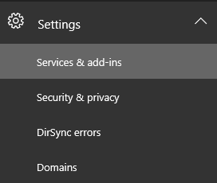
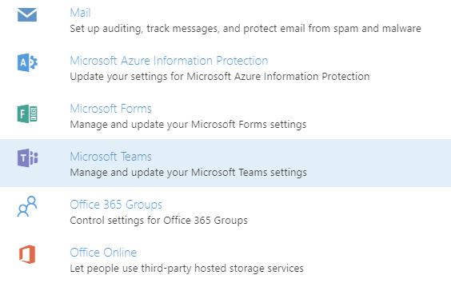

Office 365 を使用する組織で Microsoft Teams をセットアップする
======================================================

既定では、Microsoft Teams は、プレビュー時に Microsoft Teams を試用していない組織に対して有効になります。プレビューでテストを行った組織については、Microsoft Teams が一般的に利用可能になる前に設定した内容が引き継がれます。

組織の管理者は、ユーザー ライセンスを割り当てることで Microsoft Teams への個々のアクセスを制御できます。さらに、Microsoft Teams で使用できるコンテンツ ソースを許可または禁止できます。詳しくは、「[Microsoft Teams の管理者設定](https://support.office.com/article/3966a3f5-7e0f-4ea9-a402-41888f455ba2)」をご覧ください。

Microsoft Teams の有効と無効を切り替えるには、Office 365 テナントで次の手順を行います。

1.  グローバル管理者の権限を持つアカウントで [Office 365 管理センター](https://go.microsoft.com/fwlink/?linkid=854665)にサインインします。

2.  **[設定] > [サービスとアドイン]** に移動します。

    

3.  [サービスとアドイン] ページで **[Microsoft Teams]** をクリックします。

    

4.  組織全体で Microsoft Teams を有効にするには、**トグル**を [**オン**] にし、[**保存**] をクリックします。

    

|  | |
|---------|---------|
|  注意     |Microsoft Teams のオンとオフの状態を切り替えるテナントレベルの機能は一時的に提供されており、今後廃止される予定です。廃止された後は、ユーザーレベルのライセンスのみで Microsoft Teams へのアクセスを制御します。         |
