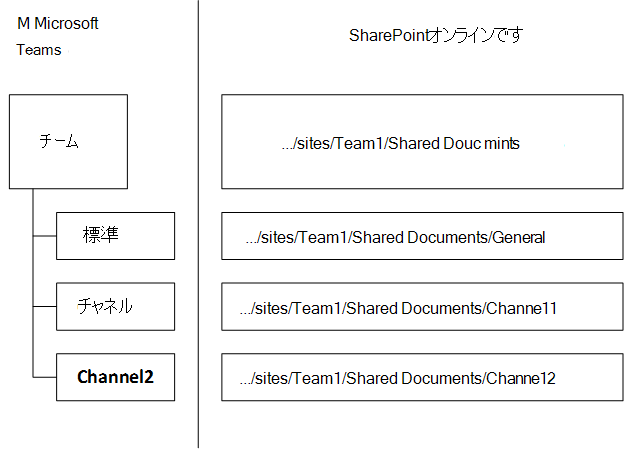
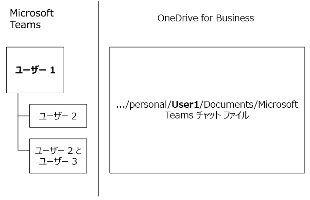

Microsoft Teams との SharePoint Online と OneDrive for Business の連携
=============================================================================

> [!Tip]
> チームが Azure Active Directory (AAD)、Office 365 のグループ、Exchange、SharePoint およびビジネスのための OneDrive とどのように対話する方法については、次のセッションを監視する:[マイクロソフトのチームの基礎](https://aka.ms/teams-foundations)

Microsoft Teams の各チームには SharePoint Online にチーム サイトがあり、チーム内の各チャネルには既定のチーム サイト ドキュメント ライブラリが作成されます。会話内で共有したファイルはドキュメント ライブラリに自動的に格納されます。SharePoint で設定した権限やファイル セキュリティ オプションは Teams 内で自動的に反映されます。

プライベート チャット ファイルは送信者の OneDrive for Business フォルダーに格納され、権限はファイル共有プロセスの一環としてすべての参加者に付与されます。

ユーザーは、割り当てられているし、SharePoint Online のライセンスでは有効になっていない、Office 365 でのビジネス ・ ストレージの OneDrive はありません。 ファイルの共有は、チャネルで作業する続行されますが、ユーザーが Office 365 でのビジネス ・ ストレージの OneDrive にチャットでファイルを共有できません。

SharePoint Online ドキュメント ライブラリと OneDrive for Business にファイルを格納することで、テナントレベルで構成されるすべてのコンプライアンス ルールが順守されます。 

> [!NOTE]
> この時点でマイクロソフトのチームは、Sharepoint の設置型との統合がサポートされていません。

チーム、チャネル、ドキュメント ライブラリの関係の例を次に示します。

各チームには SharePoint サイトが作成されます。**共有ドキュメント** フォルダーは、そのチーム用に作成される既定のフォルダーです。各チャネル (各チームの既定のチャネルである**全般**チャネルを含む) には**共有ドキュメント**内にフォルダーが作成されます。

> [!NOTE]
> 既定の SharePoint サイトとドキュメント ライブラリを別のもので置き換えることは現時点ではできません。 この機能が必要であるという要望をいただきましたので、現在検討中です。 [Teams ロードマップ](https://aka.ms/teamsroadmap)または [Teams UserVoice](https://aka.ms/TeamsUserVoice) をチェックして、今後利用できるようになる機能について継続的に把握します。

> [!TIP]
> 自分のチームは、既存の SharePoint へのリンクは、サイトまたは、既存の sharepoint ドキュメント ライブラリには、タブを追加します。
> 1. タブの横にあるプラス記号を選択します。
> 2. **Web サイト**を選択します。
> 3. 名前を入力し、SharePoint サイトまたはドキュメント ライブラリの URL を入力します。

各ユーザーについては、他のユーザー (1 対 1 または 1 対多数 ) とのプライベート チャットで共有したすべてのファイルは OneDrive フォルダーの **Microsoft Teams Chat Files** に格納されます。このフォルダーには、指定したユーザーのみにアクセスを制限する権限が自動的に設定されます。

