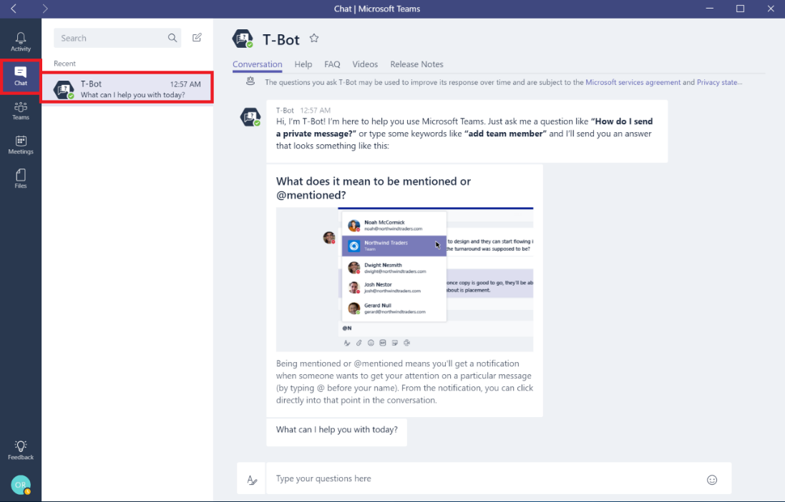

T-Bot を使用して Microsoft Teams のユーザーをサポートする
============================================

ユーザーおよびチャンピオンは、Microsoft Teams の使用時のヘルプとして使用できる [T-Bot](https://support.office.com/article/Apps-and-services-cc1fba57-9900-4634-8306-2360a40c665b) を熟知する必要があります。T-Bot は、Microsoft Teams の使用方法やその他の様々な質問に対する回答を得ることができる対話型のボットです。

Microsoft Teams では、ローカライズされた言語で T-Bot とヘルプ コンテンツが提供されています。新しい言語のサポートも随時追加されています。サポートされている言語の最新のリストについては、「[Microsoft Teams がサポートするヘルプ コンテンツの言語](https://support.office.com/article/Microsoft-Teams-supported-languages-for-help-content-9c71d10a-0c5c-49d4-b6d7-0c58cdfdf4cf)」をご覧ください。

ボットに質問するのではなくコンテンツを参照することを望むユーザーは、代替のアシスタンス方法として T-Bot を使用できます。

ボット内のタブでは、ヘルプ、FAQ、ビデオ、リリース ノートのセクションが提供されています。

