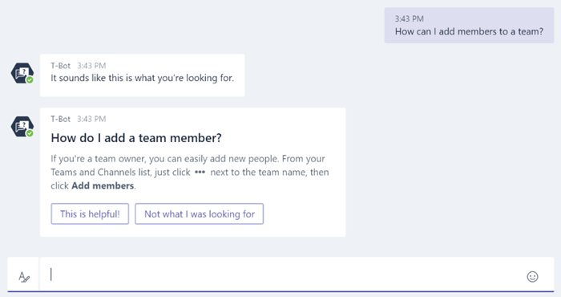

ユーザーが Microsoft チームに T 寸法を使用します。
============================================

Microsoft チームを使っているときのヘルプについては、 [T 寸法](https://support.office.com/en-us/article/Apps-and-services-cc1fba57-9900-4634-8306-2360a40c665b?ui=en-US&rs=en-US&ad=US#bkmk_bots)に慣れて、ユーザーとのエキスパート get ことを確認します。T 結果は、Microsoft チームを使用して、さまざまな質問に対する回答を得る方法についての質問に、結果を依頼することをどのユーザーが操作できます。

Microsoft チームは、T 寸法およびヘルプ コンテンツのローカライズされた言語のサポートを提供します。新しい言語は、常に追加されています。最新のサポートされる言語の一覧では、[マイクロソフトのチームがサポートされているヘルプ コンテンツの言語](https://support.office.com/en-us/article/Microsoft-Teams-supported-languages-for-help-content-9c71d10a-0c5c-49d4-b6d7-0c58cdfdf4cf)を参照してください。

T 結果では、質問の結果にではなく、コンテンツの参照を使いたいユーザーの代替のサポート方法も提供します。

![会話、ヘルプ、よく寄せられる質問、ビデオ、およびリリース ノートを含む、T 結果] ページのサポート オプションのスクリーン ショット。](media/Use_T-Bot_to_help_users_with_Microsoft_Teams_image3.png)

ヘルプ、よく寄せられる質問、ビデオ、リリース ノートのセクションで、結果内のタブの完全なスレートを提供します。

