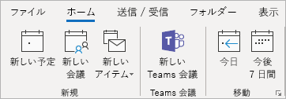
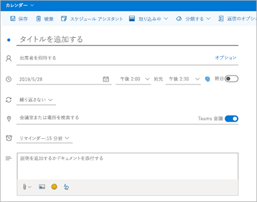
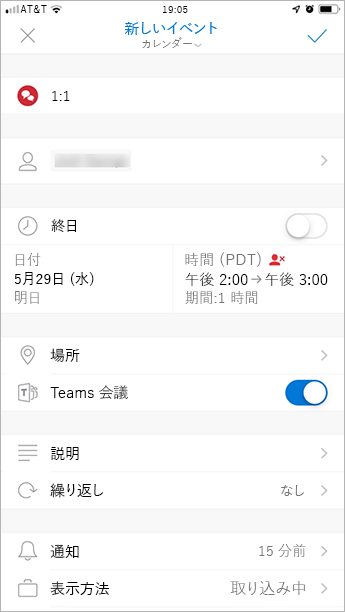

Outlook で Teams の会議アドインを使用するUse the Teams Meeting add-in in Outlook
=======================================

Teams 会議アドインを使用すると、ユーザーは Outlook から Teams 会議をスケジュールできます。The Teams Meeting add-in lets users schedule a Teams meeting from Outlook. Windows、Mac、web、モバイルの Outlook でアドインを使用できます。The add-in is available for Outlook on Windows, Mac, web, and mobile.

## Windows 版 Outlook の Teams 会議アドインTeams Meeting add-in in Outlook for Windows

Teams の会議アドインは、Microsoft Teams と Office 2013 または Office 2016 を自分の Windows PC にインストール済みのユーザーに対して、自動的にインストールされます。The Teams Meeting add-in is automatically installed for users who have Microsoft Teams and either Office 2013 or Office 2016 installed on their Windows PC. Teams の会議アドインは、ユーザーが使用する Outlook の [予定表] リボン上に表示されます。Users will see the Teams Meeting add-in on the Outlook Calendar ribbon.

> [!NOTE]
> - Teams の会議アドインが表示されないユーザーに対しては、Outlook と Teams を閉じて、先に Teams クライアントを再起動してから Teams にサインインし、次に Outlook クライアントを再起動する操作を順に行うよう指示します。If users do not see the Teams Meeting add-in, instruct them to close Outlook and Teams, then restart the Teams client first, then sign in to Teams, and then restart the Outlook client, in that specific order.
> - Windows 7 ユーザーは、Teams 会議アドインを使用するために windows の[windows でユニバーサル C ランタイムの更新プログラム](https://support.microsoft.com/help/2999226/update-for-universal-c-runtime-in-windows)をインストールする必要があります。Windows 7 users must install the [Update for Universal C Runtime in Windows](https://support.microsoft.com/help/2999226/update-for-universal-c-runtime-in-windows) in Windows for the Teams Meeting add-in to work.

## Outlook for Mac の Teams 会議アドインTeams Meeting add-in in Outlook for Mac

Outlook for Mac の office の [会議] ボタンは、16.24.414.0 を実行している場合、outlook for mac のリボンに表示されます。The Teams Meeting button in Outlook for Mac will appear in the Outlook for Mac ribbon if Outlook is running Production Build 16.24.414.0 and later.

ユーザーが [**送信**] をクリックすると、会議の座標 (チームの参加リンクとダイヤルイン番号) が会議の出席依頼に追加されます。The meeting coordinates (the Teams join link and dial-in numbers) will be added to the meeting invite after the user clicks **Send**.  

## Outlook Web App の Teams 会議アドインTeams Meeting add-in in Outlook Web App

ユーザーが新しい Outlook on the Web の以前のバージョンをお持ちの場合、Outlook Web App の [Teams 会議] ボタンが新しいイベントの作成の一部として表示されます。The Teams Meetings button in Outlook Web App will appear as part of new event creation if the user is on an early version of the new Outlook on the web. ユーザーが新しい Outlook on the web の初期バージョンを試す方法については、 [Outlook ブログ](https://techcommunity.microsoft.com/t5/Outlook-Blog/Designed-to-be-fast-The-Outlook-on-the-web-user-experience-gets/ba-p/234909?utm_source=t.co&utm_medium=referral)を参照してください。See the [Outlook Blog](https://techcommunity.microsoft.com/t5/Outlook-Blog/Designed-to-be-fast-The-Outlook-on-the-web-user-experience-gets/ba-p/234909?utm_source=t.co&utm_medium=referral) to learn about how users can try the early version of the new Outlook on the web.

ユーザーが [**送信**] をクリックすると、会議の座標 (チームの参加リンクとダイヤルイン番号) が会議の出席依頼に追加されます。The meeting coordinates (the Teams join link and dial-in numbers) will be added to the meeting invite after the user clicks **Send**.  

## Outlook mobile (iOS と Android) での Teams 会議アドインTeams Meeting add-in in Outlook mobile (iOS and Android)

[Teams 会議] ボタンは、Outlook iOS と Android アプリの最新のビルドに表示されます。The Teams Meeting button shows up in latest builds of the Outlook iOS and Android app.

ユーザーが [**送信**] をクリックすると、会議の座標 (チームの参加リンクとダイヤルイン番号) が会議の出席依頼に追加されます。The meeting coordinates (the Teams join link and dial-in numbers) will be added to the meeting invite after the user clicks **Send**.  

## 認証要件Authentication requirements

Teams の会議アドインでは、ユーザーが認証要件を使用して Teams にサインインすることが必要になります。The Teams Meeting add-in requires users to sign in to Teams using Modern Authentication. ユーザーがこの方法を使用せずにサインインしても、Teams クライアントを使用することはできますが、Outlook アドインを使用して Teams のオンライン会議をスケジュール設定することはできません。If users do not use this method to sign in, they’ll still be able to use the Teams client, but will be unable to schedule Teams online meetings using the Outlook add-in. これを修正するには、次のいずれかを実行します。You can fix this by doing one of the following:

- 先進認証が組織に対して構成されていない場合は、先進認証を構成します。If Modern Authentication is not configured for your organization, you should configure Modern Authentication.
- モダン認証が設定されているが、ダイアログボックスでキャンセルされた場合は、多要素認証を使用してもう一度サインインするようにユーザーに指示する必要があります。If Modern Authentication is configured, but they canceled out on the dialog box, you should instruct users to sign in again using multi-factor authentication.

認証を構成する方法の詳細については、「[Microsoft Teams での ID モデルと認証](identify-models-authentication.md)」をご覧ください。To learn more about how to configure authentication, see [Identity models and authentication in Microsoft Teams](identify-models-authentication.md).

## プライベート会議を有効にするEnable private meetings

アドインを展開できるようにするには、Microsoft Teams 管理センターで**プライベート会議のスケジュール**を有効にする必要があります。**Allow scheduling for private meetings** must be enabled in the Microsoft Teams admin center for the add-in to get deployed. 管理センターで**Meetings** > **Meeting Policies**に行き、**一般的な**セクションで、**Allow scheduling private meetings**をオンに切り替えるます。)In the admin center, go to **Meetings** > **Meeting Policies**, and in the **General** section, toggle **Allow scheduling private meetings** to On.)

Teams クライアントはユーザーが必要としているのが 32 ビット版か 64 ビット版かを判断して正しいアドインをインストールします。The Teams client installs the correct add-in by determining if users need the 32-bit or 64-bit version.

> [!NOTE]
> ユーザーは最新のアドインを利用できるようになるために Teams のインストールまたはアップグレード後に Outlook の再起動が必要になる可能性があります。Users might need to restart Outlook after an installation or upgrade of Teams to get the latest add-in.

## Teams のアップグレードポリシーと Outlook 用 Teams 会議アドインTeams upgrade policy and the Teams Meeting add-in for Outlook

お客様は[、Skype For business から Teams へのアップグレードを選ぶ](upgrade-and-coexistence-of-skypeforbusiness-and-teams.md)ことができます。Customers can [choose their upgrade journey from Skype for Business to Teams](upgrade-and-coexistence-of-skypeforbusiness-and-teams.md). テナント管理者は、チームの共存モードを使用して、ユーザーに対してこのような旅を定義できます。Tenant admins can use the Teams co-existence mode to define this journey for their users. テナント管理者は、ユーザーが Skype for Business (諸島モード) と共にチームを使用できるようにするオプションを備えています。Tenant admins have the option to enable users to use Teams alongside Skype for Business (Islands mode). 

孤島モードのユーザーが Outlook で会議をスケジュールする場合、通常は、Skype for Business と Teams のどちらの会議をスケジュールするかを選ぶことができます。When users who are in Island mode schedule a meeting in Outlook, they typically expect to be able to choose whether to schedule a Skype for Business or a Teams meeting. Outlook on the web、Outlook Windows、Outlook Mac では、島々モードでは、ユーザーに Skype for Business アドインと Teams アドインの両方が表示されます。In Outlook on the web, Outlook Windows, and Outlook Mac, users see both Skype for Business and Teams add-ins when in Islands mode. 初期リリースの一部の制限により、Outlook mobile では、Skype for Business**または**Teams 会議の作成のみがサポートされています。Due to certain limitations in the initial release, Outlook mobile can only support creating Skype for Business **or** Teams meetings. 詳細については、次の表を参照してください。See the following table for details.

| Teams 管理センターでの共存モードCoexistence mode in the Teams admin center | Outlook mobile の既定の会議プロバイダーDefault meetings provider in Outlook mobile |
| --------------------------------------|---------------------------------------------|
| アイランドIslands | Skype for BusinessSkype for Business |
| Skype for Business のみSkype for Business only | Skype for BusinessSkype for Business |
| Skype for Business と Teams でのコラボレーションSkype for Business with Teams collaboration | Skype for BusinessSkype for Business |
| Skype for Business と Teams でのコラボレーションおよび会議Skype for Business with Teams collaboration and meetings | TeamsTeams |
| Teams のみTeams only | TeamsTeams |

## その他の考慮事項Other considerations

Teams の会議アドインは継続して機能が開発されていますので、次について認識しておいてください。The Teams Meeting add-in is still building functionality, so be aware of the following:

- このアドインは、特定の参加者でスケジュール設定された会議向けで、チャネル内の会議向けではありません。The add-in is for scheduled meetings with specific participants, not for meetings in a channel. チャネル会議は Teams 内でスケジュール設定される必要があります。Channel meetings must be scheduled from within Teams.
- 認証プロキシがユーザーの PC および Teams サービスのネットワーク パス内にある場合、アドインは機能しません。The add-in will not work if an Authentication Proxy is in the network path of user's PC and Teams Services.
- ユーザーは Outlook 内からライブイベントをスケジュールできません。Users can't schedule live events from within Outlook. [チームに移動して、ライブイベントのスケジュールを設定します。Go to Teams to schedule live events. 詳細については、「 [Microsoft Teams のライブイベントとは](teams-live-events/what-are-teams-live-events.md)」を参照してください。For more information, see [What are Microsoft Teams live events?](teams-live-events/what-are-teams-live-events.md).

## トラブルシューティングTroubleshooting

Teams Meeting add-in for Outlook のアドインをインストールできない場合は、次のトラブルシューティングの手順を試してください。If you cannot get the Teams Meeting add-in for Outlook to install, try these troubleshooting steps.

- Outlook デスクトップクライアントで利用できるすべての更新プログラムが適用されていることを確認します。Ensure all available updates for Outlook desktop client have been applied.
- Teamsのデスクトップ クライアントを再起動します。Restart the Teams desktop client.
- [Teamsのデスクトップ クライアント]からサインアウトして、もう一度サインインします。Sign out and then sign back in to the Teams desktop client.
- Outlook デスクトップ クライアントを再起動します。Restart the Outlook desktop client. (管理者モードで Outlook が実行されていないことを確認してください。)(Make sure Outlook isn’t running in admin mode.)
- ログインしているユーザー アカウント名にスペースが含まれていないことを確認します。Make sure the logged-in user account name does not contain spaces. これは既知の問題であり、今後のビルドで修正される予定です。(This is a known issue, and will be fixed in a future update.)
- シングル サインオン (SSO) が有効になっていることを確認します。Make sure single sign-on (SSO) is enabled.

アドインを無効にする方法につぃての全般的なガイドラインについては、「[Office プログラムでアドインを表示、管理、インストールする](https://support.office.com/article/View-manage-and-install-add-ins-in-Office-programs-16278816-1948-4028-91E5-76DCA5380F8D)」をご覧ください。For general guidance about how to disable add-ins, see [View, manage, and install add-ins in Office programs](https://support.office.com/article/View-manage-and-install-add-ins-in-Office-programs-16278816-1948-4028-91E5-76DCA5380F8D).

Microsoft Teams での会議と通話については[こちら](https://support.office.com/article/Meetings-and-calls-d92432d5-dd0f-4d17-8f69-06096b6b48a8)をご覧ください。Learn more about [meetings and calling in Microsoft Teams](https://support.office.com/article/Meetings-and-calls-d92432d5-dd0f-4d17-8f69-06096b6b48a8).
