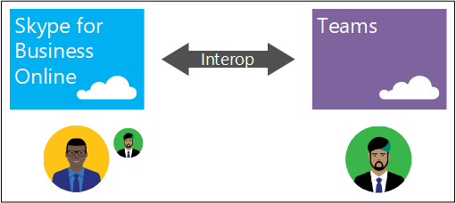
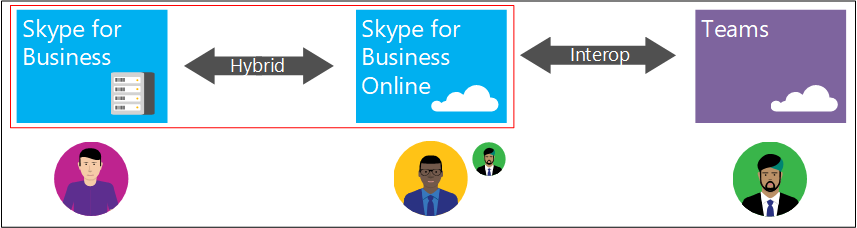
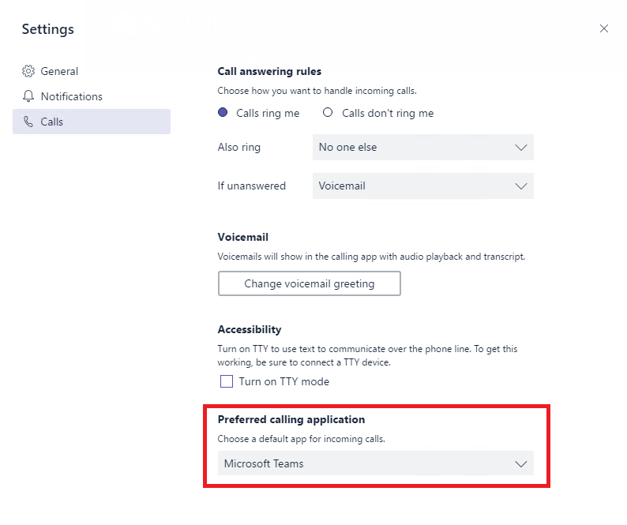

Microsoft Teams と Skype for Business の相互運用性Microsoft Teams and Skype for Business interoperability
=======================================================

Skype for Business を使用している組織で Teams の使用開始を検討している場合は、これら 2 つのアプリケーションの相互運用性を設定する方法を理解することが重要です。If your organization uses Skype for Business today and you intend to start using Teams, it's important to understand how to configure the two applications to interoperate.

> [!IMPORTANT]
> このドキュメントでは、Teams での通話プランのサポートについて初期段階の評価を行います。This document is provided for early evaluation of Calling Plans support for Teams. Teams の相互運用性のポリシーに関する詳細は将来的に変更される予定です。Teams interop policy details are expected to change in the future.

Skype for Business や Teams の相互運用性により、組織全体で流動的な通信が実現し、ユーザーはお互いにチャットや通話を行うことができます。Interoperability (interop for short) enables Skype for Business and Teams users to chat and call with one another, ensuring that communications remain fluid across your organization. Microsoft は、IT 専門家が Teams の導入を管理できるよう支援するための新しい Teams 相互運用性ポリシーを追加しています。このポリシーは [`*-CsTeamsInteropPolicy`](https://docs.microsoft.com/powershell/module/skype) コマンドレットを使用して Skype for Business の Windows PowerShell リモート セッションを開いて管理できます。To help IT pros manage the adoption of Teams, we've added a new Teams interop policy, managed through a Skype for Business remote Windows PowerShell session using [`*-CsTeamsInteropPolicy`](https://docs.microsoft.com/powershell/module/skype) cmdlets. このポリシーを使用して、組織で必要とされる機能性を実現するよう Teams を設定します。Use this policy to configure Teams the way you need it to work in your organization.

> [!TIP]
> 相互運用性を実現するために必要な PowerShell コマンドレットを検索するには、[Skype for Business PowerShell のコマンドレットに関するドキュメント](https://docs.microsoft.com/powershell/module/skype) で [**フィルター**] ボックスに「CsTeamsInteropPolicy」と入力します。To find the PowerShell cmdlets you need for interop, type "CsTeamsInteropPolicy" in the **Filter** box in the [Skype for Business PowerShell cmdlet documentation](https://docs.microsoft.com/powershell/module/skype).

Teams の相互運用性ポリシーを使用することで、IT 専門家はユーザーがチャットや通話の受信に優先的に使用するアプリケーションを指定することができます。Teams interop policy enables an IT pro to designate a user’s preferred application for receiving chats and calls. 相互運用性ポリシーでは Teams と Skype for Business で縦割り的に通信を処理するか、ユーザーがアプリケーションの枠組みを超えて通信できるように設定することができます。It can be configured to keep communications in Teams and Skype for Business siloed, or it can be configured to enable users to communicate across application boundaries.

Teams の相互運用ポリシーはテナント レベルまたはユーザー レベルで定義できます。さらに、チャットや通話を受信するために使用するアプリケーションをユーザーが選択できるように設定することもできます。Teams interop policy can be defined at the tenant or per-user level, and can even be configured to enable users to choose what application they would like to use to receive their chats and calls.

この固有の柔軟性により、組織は最適なペースと方法で Teams の試行、評価、および Teams への移行を実施することができます。This built-in flexibility is intended to help your organization trial, evaluate, and migrate to Teams at the pace and in the manner that is best suited to your organization.

> [!NOTE]
> Teams と Skype for Business の相互運用性は、純粋にオンラインの構成 (Skype for Business Online と Teams) を利用するユーザー間、および混在 (ハイブリッド) 展開のトポロジにおいて Skype for Business オンプレミス展開で所属しているユーザー間でサポートされます。Interoperability between Teams and Skype for Business is supported between users who are purely online (Skype for Business Online and Teams), and users homed in a Skype for Business on-premises deployment in a mixed (Hybrid) deployment topology.

## 相互運用性とはWhat interoperability means
相互運用性とは、Teams と Skype for Business のユーザーが Teams と Skype for Business 間でチャット (IM) や通話をやり取りするための機能です。Interop is the ability for Teams and Skype for Business users to chat (IM) and call each other across Teams and Skype for Business.

Skype for Business から Teams への移行を開始した組織では、異なるクライアントを利用しているユーザーが混在することが考えられます。As organizations begin the journey from Skype for Business to Teams, the expectation is that there will be a mix of users using different clients in the organization.

Teams では、生産性を維持するため、使用するアプリケーション (Teams または Skype for Business) に関係なくユーザーがお互いに通信できるようにする機能が提供されています。To ensure continued productivity, Teams provides the ability for users to communicate with one another regardless of the application they use (Teams or Skype for Business).

サポートされる相互運用のエクスペリエンスを次に示します。Supported interop experiences include the following:
- Teams を使用していない Skype for Business ユーザーが Teams ユーザーとチャットすることができます (その逆も可)Skype for Business users that do not use Teams can chat with Teams users, vice versa

 
- Skype for Business ユーザーは Teams ユーザーに対して音声通話やビデオ通話を行うことができます (その逆も可)。Skype for Business users can call Teams users over voice and video, vice versa. 相互運用での通話でも、通話の転送などの詳細な通話オプションはこれまでどおり利用できます。Advanced calling options, such as call transfer and call forwarding will continue to work, even for interop calls.

 

> [!NOTE]
> Skype for Business ユーザー側からの視点では、Teams に対するチャットや通話のやり取りは Skype for Business の基本的なチャットや通話と同じように表示されます。From a Skype for Business user point of view, chats and calls from/to Teams will appear as basic Skype for Business chats and calls. 詳しくは、「[相互運用のエクスペリエンスの制限](#interop-experiences-limitations)」セクションをご覧ください。Please review the [Interop experiences limitations](#interop-experiences-limitations) section for details.

> [!IMPORTANT]
> Teams と Skype for Business 間における統一された表示形式は現在サポートされていません。Teams と Skype for Business ではそれぞれに固有の表示形式が使用されます。Unified presence between Teams and Skype for Business is currently not supported, which means Teams and Skype for Business will show their own independent presence states. 統一された表示形式のサポートが利用可能になる時期については、「[Skype for Business から Microsoft Teams へ: 機能のロードマップ](https://aka.ms/skype2teamsroadmap)」をご覧ください。To find out when support for unified presence is going to be available, review [Skype for Business to Microsoft Teams Capabilities Roadmap](https://aka.ms/skype2teamsroadmap).

## 相互運用の要件Interop requirements
相互運用の機能を有効にするには、ユーザーが次の条件を満たしている必要があります。For interop capabilities to be enabled, users must meet the following criteria:
- ユーザーに対して Teams を有効にする (ライセンスを割り当てる) 必要がありますUsers must be enabled (and/or licensed) for Teams
- ユーザーに対して Skype for Business Online を有効にする (ライセンスを割り当てる) 必要がありますUsers must be enabled (and/or licensed) for Skype for Business Online
    - この要件は、Teams のみを使用する予定のユーザーまたは Teams を主なチャット/通話アプリケーションとして使用するユーザーに適用されますThis is applicable to users that are planning to use Teams only or Teams as their primary chat and calling application
- ハイブリッドの Skype for Business 展開の場合In a hybrid Skype for Business deployment,
    - オンプレミスの Skype for Business (または Skype for Business ハイブリッド展開で現在サポートされている Lync Server バージョン) に所属しているユーザーは、Teams を使用しているクラウド ユーザーと相互運用できますUsers homed at on-premises Skype for Business (or any Lync Server version currently supported for Skype for Business Hybrid deployment), can interop with cloud users using Teams
    - Teams を主なチャット/通話アプリケーションとして使用する予定のクラウド ユーザーに対して Skype for Business Online を有効にする (ライセンスを割り当てる) 必要がありますCloud users that are planning to use Teams as their primary chat and calling application must be enabled (and/or licensed) for Skype for Business Online

## 相互運用でサポートされるトポロジSupported topologies for interop
Teams と Skype for Business の相互運用は主に次の Skype for Business 展開トポロジでサポートされます。Interop between Teams and Skype for Business is primarily supported for the following Skype for Business deployment topologies:
- Skype for Business Online のみSkype for Business Online
- Skype for Business ハイブリッド (Skype for Business Online と Skype for Business オンプレミスが混在する展開)Skype for Business Hybrid (mixed deployment of Skype for Business Online and Skype for Business on-premises)

### Skype for Business Online のみのトポロジSkype for Business Online only topology
Skype for Business Online 展開のみを実施している組織では、Skype for Business Online ユーザーと Teams ユーザー間でチャットや通話の相互運用を確立することができます。Organizations with Skype for Business Online deployment only can benefit from interop chat and calling support between Skype for Business Online users and Teams users.

このトポロジでは、相互運用を機能させるには、Teams を主なチャット/通話アプリケーションとして設定しているユーザーに対して Skype for Business Online も有効にする必要があります。In this topology, users configured with Teams as the primary chat and calling application must also be enabled for Skype for Business Online for interop to function.

### Skype for Business ハイブリッド展開トポロジSkype for Business Hybrid deployment topology
ハイブリッド展開トポロジにおいて Skype for Business Online と Skype for Business サーバー (オンプレミス) が混在する展開を実施している組織では、Skype for Business ユーザー (オンラインまたはオンプレミスのいずれかのユーザー) と Teams ユーザー間でチャットや通話の相互運用を実現することができます。Organizations with a deployment that consists of mixed deployment of Skype for Business Online and Skype for Business server (on-premises) in a Hybrid deployment topology, can benefit from interop chat and calling support between Skype for Business users (homed at either online and on-premises) and Teams users.

Skype for Business Online のみの展開トポロジと同様に、相互運用を機能させるには、Teams を主なチャット/通話アプリケーションとして設定しているユーザーに対して Skype for Business Online も有効にし、それに所属するよう設定する必要があります。Like Skype for Business Online only deployment topology, users configured with Teams as the primary chat and calling application must also be enabled for and homed at Skype for Business Online for interop to function.

> [!IMPORTANT]
> Skype for Business ハイブリッドの相互運用のサポートには、CCE (Cloud Connector エディション) または一般的に OPCH (On Prem Config Hybrid) と呼ばれる既存の展開を使用するオンプレミス PSTN 接続性によって提供される Hybrid Voice 機能のサポートは含まれていません。Interop support for Skype for Business Hybrid does not include Hybrid Voice capabilities delivered through CCE (Cloud Connector Edition) or on-premises PSTN connectivity using existing deployment--or commonly called as OPCH (On Prem Config Hybrid). Teams ユーザーに対して CCE または OPCH を使用する PSTN 通話機能を有効にすることはできません。Teams users cannot be enabled for PSTN calling capabilities using CCE or OPCH.

### 相互運用エクスペリエンスの制限Interop experiences limitations
現時点では、Teams と Skype for Business 間において統一された表示形式が確立されていないため、Teams と Skype for Business ではそれぞれ独自の表示形式が採用されています。さらに、Teams と Skype for Business 間でのチャットと通話の相互運用エクスペリエンスで利用できない機能もあります。Currently, in addition to the absence of unified presence between Teams and Skype for Business, which leads to Teams and Skype for Business having their own independent presence states, there are features that are not available for interop chat and interop calling experiences between Teams and Skype for Business.

チャットの相互運用における現在の制限を次に示します。For chat interop, the following are the current list of limitations:
- Teams でのマルチパーティ (グループ) の会話 (チャット) には Teams を使用する参加者のみを含めることができますMulti-party (group) conversation (chat) in Teams can only include participants using Teams
- Skype for Business でのマルチパーティ IM 会話 (チャット) には Skype for Business を使用する参加者のみを含めることができますMulti-party IM conversation (chat) in Skype for Business can only include participants using Skype for Business
- Teams と Skype for Business 間における 2 つのパーティ間のチャット会話でのファイル転送またはマルチパーティの会話でのファイルの添付はサポートされていませんFile transfer for two-party chat conversation or file attachment in multi-party conversation across Teams and Skype for Business, vice versa, are not supported
- Teams ではチャットの相互運用は継続されませんInterop chat is not persisted in Teams
- 相互運用チャットでは、Teams のマークダウン、リッチ テキスト、絵文字のセットはサポートされませんMarkdown, rich text, full emoticon set, etc. in Teams are not supported for interop chat

通話の相互運用における現在の制限を次に示します。For calling interop, the following are the current list of limitations:
- Teams と Skype for Business 間の画面共有 (デスクトップまたはアプリの共有) はサポートされませんScreen sharing (desktop or app sharing) between Teams and Skype for Business is not supported
- 現在使用中のピアツーピア (P2P) の音声通話やビデオ通話を Teams と Skype for Business ユーザーによるマルチパーティ通話に昇格させることはできませんEscalation of ongoing peer to peer (P2P) voice and video call to multi-party call involving Teams and Skype for Business users is not supported

## 相互運用性の管理Managing interoperability
Teams と Skype for Business 間の相互運用性を管理するため、Teams 相互運用ポリシーという新しいポリシーを使用して、チャットの送信先や通話のルーティング経路を Teams または Skype for Business のいずれかに制御できます。このポリシーは、組織のすべてのユーザーに設定するか (グローバル ポリシー)、ユーザーごとに適用することができます。こうした管理は [`*-CsTeamsInteropPolicy`](https://docs.microsoft.com/powershell/module/skype/?view=skype-ps) コマンドレットを使用して Skype for Business の Windows PowerShell リモート セッションを開いて行うことができます。To manage the interoperability between Teams and Skype for Business, a new policy called Teams interop policy can be utilized to control where to send chats and route calls, Teams or Skype for Business, and this policy can be configured for all users in the organization (global policy) or applied at the per user basis, manageable through Skype for Business remote Windows PowerShell session using [`*-CsTeamsInteropPolicy`](https://docs.microsoft.com/powershell/module/skype/?view=skype-ps) cmdlets.

既定では、このポリシーは、Teams と Skype for Business が最小限の相互運用を確保しつつ共存する形で使用されるよう設定されています。By default, this policy is configured to ensure that Teams and Skype for Business can be used side-by-side with minimal interop between them. このアプローチは Teams の導入により組織の現在のビジネス プロセスと通信に中断が発生しないようにすることを目的としています。This approach is intended to ensure that current business processes and communications within your organizations are not disrupted as a result of Teams adoption.

### 相互運用ポリシーの概要Interop policy overview
Teams の相互運用ポリシーは次のパラメーターで構成されています。Teams interop policy consists of the following parameters:

|パラメーターParameter                    |可能な値Possible values      |説明Description  |
|-----------------------------|---------------------|---------|
|`ChatDefaultClient`          | Default、SfB、TeamsDefault, SfB, Teams | このパラメーターは既定のチャット アプリを指定しますThis parameter specifies the default Chat app        |
|`CallingDefaultClient`       | Default、SfB、TeamsDefault, SfB, Teams | このパラメーターは既定の通話アプリを指定しますThis parameter specifies the default Calling app        |
|`AllowEndUserClientOverride` | True、FalseTrue, False         | このパラメーターはユーザーが既定のチャット アプリや通話アプリを上書きできるかどうかを指定しますThis parameter specifies whether users can override the default Chat and Calling app         |

> [!WARNING]
> 現時点では、`ChatDefaultClient` と `CallingDefaultClient` パラメーターに独立した値を指定して Teams の相互運用ポリシーを作成することができますが、これは将来的に変更される予定です。While it is currently possible to create Teams interop policy with independent values for `ChatDefaultClient` and `CallingDefaultClient` parameters, we expect this to change in the future. 現時点では、両方のパラメーターに同じ値を指定してください。At this time, please ensure that you are using the same value for both parameters.

#### チャットの既定のクライアントChat default client
`ChatDefaultClient` パラメーターでは、Teams と Skype for Business 間におけるチャットのルーティング経路を定義します。このパラメーターの既定のグローバル値は **Default** に設定されています。The `ChatDefaultClient` parameter defines how chats are routed between Teams and Skype for Business, and the default global value of this parameter is set to **Default**.

> [!IMPORTANT]
> 現時点では、Teams で `ChatDefaultClient` パラメーターは重視されません。At the present time, the `ChatDefaultClient` parameter is not respected by Teams. Teams でこのパラメーターが重視されるようになった際は、このドキュメントを更新して予期される動作を記載する予定です。We will update this documentation to describe the expected behavior once the parameter is respected by Teams. テナント レベルで制御される Teams と Skype for Business 間のチャットの既存の相互運用はこれまでどおり継続的に機能します。Existing chat interop capabilities between Teams and Skype for Business controlled at the tenant level will continue to work as is.

#### 通話の既定のクライアントCalling default client
`CallingDefaultClient` パラメーターでは、Teams と Skype for Business 間における通話のルーティング経路を定義します。このパラメーターの既定のグローバル値は **Default** に設定されています。The `CallingDefaultClient` parameter defines how calls are routed between Teams and Skype for Business, and the default global value of this parameter is set to **Default**.

次に、このパラメーターの設定が Teams と Skype for Business のクライアントの動作に及ぼす影響について詳しく説明します。Below is the detailed explanation of how each setting of this parameter influences Teams and Skype for Business client behavior.

|発信者の通話元Caller calling from  |設定: Default; 通話の受信先Setting: Default; call received on  |設定: Teams; 通話の受信先Setting: Teams; call received on  |設定: SfB; 通話の受信先Setting: SfB; call received on  |
|---------|---------|---------|---------|
|**Skype for Business****Skype for Business**     |Skype for BusinessSkype for Business         |TeamsTeams documentation        |Skype for BusinessSkype for Business         |
|**Teams****Microsoft Teams**     |TeamsTeams documentation         |TeamsTeams documentation         |Skype for BusinessSkype for Business         |
|**PSTN****PSTN**   |Skype for BusinessSkype for Business        |TeamsTeams documentation        |Skype for BusinessSkype for Business         |
|**フェデレーション Skype for Business****Federated Skype for Business**     |Skype for BusinessSkype for Business         |Skype for BusinessSkype for Business         |Skype for BusinessSkype for Business         |

> [!IMPORTANT]
> 現時点では、`CallingDefaultClient` を Teams に変更すると、Skype for Business IP 電話への通話にも影響を及ぼします。Currently, changing `CallingDefaultClient` to Teams will also affect calls to Skype for Business IP phones. Skype for Business IP 電話で着信通話を受信できなくなり、Teams クライアントでのみ着信音が鳴ります。Incoming calls will not be received on the phones and will only ring Teams clients. 既存の認定済み SIP 電話のサポートについては、「[Skype for Business から Microsoft Teams へ: 機能のロードマップ](https://aka.ms/skype2teamsroadmap)」をご覧ください。Please consult the [Skype for Business to Microsoft Teams Capabilities Roadmap](https://aka.ms/skype2teamsroadmap) for information about support for existing certified SIP phones.

#### ユーザーの選択を許可するAllowing user choice
`AllowEndUserClientOverride` パラメーターにはブール値 (**TRUE** または **FALSE**) を指定できます。**TRUE** に設定すると、Teams でユーザーは通話の受信先 (Teams または Skype for Business) を選択することができ、使用する主なアプリケーションをいつでも変更できます。The `AllowEndUserClientOverride` parameter accepts Boolean value (**TRUE** or **FALSE**), and when it is set to **TRUE**, Teams will allow users to select where they want to receive their calls--Teams or Skype for Business, and users will be able to change their primary application at any time.

このパラメーターのグローバル既定値は **FALSE** です。ユーザーは使用する主なアプリケーションを管理者の介入なしに選択することはできません。The global default value for this parameter is **FALSE**, thereby users will not be allowed to choose their primary application without intervention from administrator.

## Teams の相互運用ポリシーの特殊なケースTeams interop policy special cases
Teams の相互運用ポリシーを割り当てる際に、混在 (ハイブリッド) 展開トポロジの Skype for Business オンプレミスに所属したままになっているユーザー、Hybrid Voice を CCE または OPCH のいずれかを介して使用するユーザー、特化した Skype for Business ワークフローを使用するユーザーは特殊なケースとして考慮されます。こうしたユーザーに割り当てるポリシーには特別な注意を払う必要があります。When assigning Teams interop policy, users that remain homed at Skype for Business on-premises--in a mixed (Hybrid) deployment topology, users with Hybrid Voice (both through CCE or OPCH), and users with specialized Skype for Business workflows are considered special cases, and they require special attention on the policy assigned to them.

### Skype for Business オンプレミス ユーザーのポリシーPolicy for Skype for Business on-premises users
混在 (ハイブリッド) 展開トポロジでは、Skype for Business オンプレミスに所属するユーザーのポリシーで `ChatDefaultClient` と `CallingDefaultClient` パラメーターを Teams に設定しないでください。In a mixed (Hybrid) deployment topology, users homed at Skype for Business on-premises should never have their policy set to Teams for either `ChatDefaultClient` and `CallingDefaultClient` parameters. そのように設定すると、チャットや通話を受信できなくなります。If they do, they will be unable to receive chats and calls. オンプレミス ユーザーについては次のポリシー定義を使用します。Use the following policy definition for on-prem users:

|パラメーターParameter  |値Value  |
|---------|---------|
|`ChatDefaultClient`    |Default または SfBDefault or SfB         |
|`CallingDefaultClient`     |Default または SfBDefault or SfB         |
|`AllowEndUserClientOverride`     |FalseFalse         |

> [!IMPORTANT]
> Skype for Business Online から Skype for Business オンプレミス (またはその逆) にユーザーを移動する場合は、そのユーザーに割り当てられた Teams の相互運用ポリシーが、適用する必要のある動作に対して同調していることを確認する必要があります。When moving users from Skype for Business Online to Skype for Business on-premises, or vice versa, you need to make sure the Teams interop policy assigned to the user is aligned with the behavior that needs to be enforced. オンプレミス ユーザーは Teams を主に使用するチャットや通話のアプリケーションとして設定できないことに注意してください。Remember that on-premises users cannot be configured to use Teams as primary chat and calling application.

### Hybrid Voice ユーザーのポリシー (CCE または OPCH)Policy for Hybrid Voice users (CCE or OPCH)
Hybrid Voice を (CCE または OPCH を介して) 利用する電話システムが有効な Skype for Business Online ユーザーは Teams で PSTN 通話を受信することはできません。Skype for Business Online users enabled for Phone System with Hybrid Voice (through CCE or OPCH) cannot receive PSTN calls in Teams. Teams の相互運用ポリシーを Hybrid Voice ユーザーに割り当てる際には、次のポリシー定義を使用しますWhen assigning Teams interop policy for Hybrid Voice users, use the following policy definition

|パラメーターParameter  |値Value  |
|---------|---------|
|`ChatDefaultClient`    |Default、SfB、または TeamsDefault or SfB or Teams         |
|`CallingDefaultClient`     |Default または SfBDefault or SfB         |
|`AllowEndUserClientOverride`     |FalseFalse         |

### 特化した Skype for Business ワークフローを使用するユーザーのポリシーPolicy for users with specialized Skype for Business workflows
場合によっては、ユーザーのグループが、Skype for Business に依存するサード パーティのアプリケーションを使用していることがあります (例: コール センター、フロント デスク受付担当者など)。In some cases, a group of users may be using third party applications that rely on Skype for Business (e.g.: call centers, front desk attendants, etc.). このような場合には、同等の機能が Teams で利用可能になるまでこれまでどおり Skype for Business を使用してもらいます。In these cases, you will want to ensure that they remain on Skype for Business until they have equivalent capabilities in Teams. こうしたユーザーには、次のポリシー定義を使用します。For these users, use the following policy definition:

|パラメーターParameter  |値Value  |
|---------|---------|
|`ChatDefaultClient`    |Default または SfBDefault or SfB         |
|`CallingDefaultClient`     |Default または SfBDefault or SfB         |
|`AllowEndUserClientOverride`     |FalseFalse         |