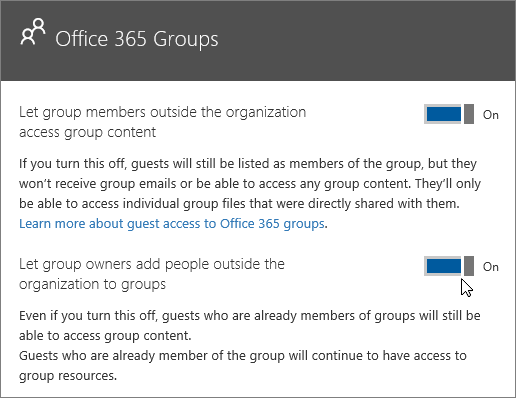

Microsoft Teams でのゲスト アクセスを承認するAuthorize guest access in Microsoft Teams
===========================================

組織の要件を満たすために、Microsoft Teams のゲスト アクセス機能を 4 つの異なる承認レベルで管理することができます。To satisfy your organization’s requirements, you can manage Microsoft Teams guest access features and capabilities through four different levels of authorization. すべての承認レベルが Office 365 テナントに適用されます。All the authorization levels apply to your Office 365 tenant. それぞれの承認レベルによって、ゲストのエクスペリエンスが次の通り制御されます。Each authorization level controls the guest experience as shown below:
- **Azure Active Directory**: Microsoft Teams のゲスト アクセスは、Azure Active Directory ビジネス ツー ビジネス (B2B) プラットフォームに依存します。**Azure Active Directory**: Guest access in Microsoft Teams relies on the Azure AD business-to-business (B2B) platform. ゲストのエクスペリエンスをディレクトリ、テナント、およびアプリケーション レベルで制御します。Controls the guest experience at the directory, tenant, and application level. 
- **Microsoft Teams**: Microsoft Teams のみを制御します。**Microsoft Teams**: Controls Microsoft Teams only. 
- **Office 365 グループ**: Office 365 グループおよび Microsoft Teams でのゲスト エクスペリエンスを制御します。**Office 365 Groups**: Controls the guest experience in Office 365 Groups and Microsoft Teams.
- **SharePoint Online と OneDrive for Business**: SharePoint Online、OneDrive for Business、Office 365 グループ、および Microsoft Teams でのゲスト エクスペリエンスを制御します。**SharePoint Online and OneDrive for Business**: Controls the guest experience in SharePoint Online, OneDrive for Business, Office 365 Groups, and Microsoft Teams.

これらの異なる承認レベルにより、組織におけるゲスト アクセスを柔軟にセットアップできるようになります。These different authorization levels provide you with flexibility in how you set up guest access for your organization. たとえば、自分の Microsoft Teams の組織でゲスト ユーザーを許可したくない場合は、Microsoft Teams でゲスト アクセスをオフにするだけです。For example, if you don’t want to allow guest users in your Microsoft Teams organization, just turn off guest access in Microsoft Teams. 別の例: AAD、Teams、Groups レベルでゲスト アクセスを有効にしつつ、1 つ以上の基準 (データ分類が社外秘に等しいなど) に一致する選択したチームに対するゲスト ユーザーの追加を無効にすることができます。Another example: You could enable guest access at the AAD, Teams, and Groups levels, but then disable guest users' addition on selected teams that match one or more criteria such as data classification equals confidential. また、Office 365 グループを使用していないことも考えられます。And, perhaps you don’t use Office 365 Groups. SharePoint Online と OneDrive for Business には、Office 365 グループに依存しない独自のゲスト アクセス設定があります。SharePoint Online and OneDrive for Business have their own guest access settings that don't rely on Office 365 Groups. 

> [!NOTE]
> ゲストにも [Office 365](https://go.microsoft.com/fwlink/p/?linkid=282347) と [Azure Active Directory](https://go.microsoft.com/fwlink/p/?linkid=853019) のサービスの制限が適用されます。Guests are subject to  [Office 365](https://go.microsoft.com/fwlink/p/?linkid=282347) and [Azure Active Directory](https://go.microsoft.com/fwlink/p/?linkid=853019) service limits. 

  次の図では、Azure Active Directory、Microsoft Teams、および Office 365 との間でゲスト アクセスの承認の依存関係がどのように与えられているか、および組み合わされているかを示します。The following diagram shows how guest access authorization dependency is granted and integrated between Azure Active Directory, Microsoft Teams, and Office 365.

##Azure Active DirectoryAzure Active Directory

Azure AD ビジネス ツー ビジネス (B2B) コラボレーションでは、潜在的なゲスト ユーザーへの招待の送信はテナントの管理者に制限されません。With Azure AD business-to-business (B2B) collaboration, sending invitations to potential guest users isn’t restricted to tenant admins. 代わりに、ポリシーを使用して、招待を送信できる役割が設定されているユーザーに、招待状を送信する権限を委任します。Instead, you can use policies to delegate sending invitations to users whose roles allow them to send invitations.

招待の設定は、テナント レベルで適用され、ディレクトリ、テナント、アプリケーション レベルでゲストのエクスペリエンスを制御します。The settings for invitations apply at the tenant level and control the guest experience at the directory, tenant, and application level.

次の招待ポリシーを設定できます。You can set the following invitation policies:
- 招待をオフにします。Turn off invitations.
- 管理者と、ゲスト招待元の役割のユーザーのみが招待を行えます。Only admins and users in the guest inviter role can invite.
- 管理者、ゲスト招待元の役割、メンバーが招待を行えます。Admins, the guest inviter role, and members can invite.
- ゲストを含むすべてのユーザーが招待を行えます。All users, including guests, can invite. (これは、テナントの既定のポリシーです。)(This is the default policy for tenants.)

##Microsoft TeamsMicrosoft Teams

Microsoft Teams では、自分の組織においてゲストのエクスペリエンスを有効にするか無効にするかを制御できます。In Microsoft Teams, you can control whether the guest experience is enabled or disabled for your organization. この設定は既定で無効になっていて、Microsoft Teams のテナント レベルのみで適用されます。The setting is disabled by default and applies at the tenant level for Microsoft Teams only.

Office 365 管理センターで Microsoft Teams ゲスト アクセスの設定を管理できます。You can manage Microsoft Teams guest access settings from the Office 365 admin center. 詳細については、「[Microsoft Teams へのゲスト アクセスをオンまたはオフにする](set-up-guests.md)」をご覧ください。For more information, see [Turn on or off guest access to Microsoft Teams](set-up-guests.md). 

##Office 365 グループOffice 365 Groups

Office 365 グループから、自分の組織内のすべての Office 365 グループおよび Microsoft Teams へのゲスト ユーザーおよびゲスト アクセスの追加を制御できます。From Office 365 Groups, you can control adding guest users and guest access to all Office 365 groups and Microsoft Teams in your organization.

1. Office 365 グローバル管理アカウントを使用して、[https://portal.office.com/adminportal/home](https://portal.office.com/adminportal/home) にサインインします。Sign in with your Office 365 global admin account at [https://portal.office.com/adminportal/home](https://portal.office.com/adminportal/home).
    
  
2. ナビゲーション メニューで [**設定**] を選択し、[**Services &amp; add-ins (サービスとアドイン)**] を選択します。In the navigation menu, choose **Settings** and then select **Services &amp; add-ins**.
    
  
3. [**Office 365 グループ**] を選択します。Select **Office 365 Groups**.
    
     
  

  

  
4. 組織外のチーム所有者やグループ所有者に Office 365 へのアクセスを許可するかどうかに応じて、[Office 365 グループ] ページのトグルを [**オン**] または [**オフ**] にします。On the Office 365 Groups page, set the toggle to **On** or **Off**, depending if you want to let team and group owners outside your organization access Office 365 groups. [**Let group owners add people outside the organization to groups (グループ所有者に組織外のユーザーをグループに追加させる)**] の横にあるトグルをクリックまたはタップして [**オン**] にします。Click or tap the toggle to **On** next to **Let group owners add people outside the organization to groups**. このトグルをオンにすると、グループおよびチームの所有者が組織外のユーザーを Office 365 グループおよび Microsoft Teams に追加できるかどうかを制御するための別のオプションが表示されます。If you turn this toggle to On, you'll see another option to control whether you want to let group and team owners add people outside your organization to Office 365 groups and Microsoft teams. グループおよびチームの所有者がゲスト ユーザーを追加できるようにする場合は、このトグルをオンに設定します。Set this toggle to On if you want to let group and team owners add guest users. ![次のスクリーンショットは、組織外のグループ メンバーによるグループのコンテンツへのアクセス、グループ所有者による組織外のユーザーのグループへの追加のオプションをオンにした [Office 365 グループ] パネルを示しています。](media/eee77abd-4425-4585-91a8-5541c17ee7b2.png)

上記の設定は、テナント レベルで適用され、Office 365 グループおよび Microsoft Teams でのゲストのエクスペリエンスを制御します。The above settings apply at the tenant level and control the guest experience in Office 365 Groups and Microsoft Teams.

##SharePoint Online と OneDrive for BusinessSharePoint Online and OneDrive for Business

Teams は、SharePoint Online と OneDrive for Business を利用して、チャネルとチャット会話のファイルやドキュメントを保管します。Teams relies on SharePoint Online and OneDrive for Business to store files and documents for channels and chat conversations.  
  
    
    
Teams のゲスト アクセスの完全な操作性を有効にするため、Office 365 管理者は次の設定を**オン**にする必要があります。To enable the full Teams guest access experience, Office 365 admins need to select **On** for the following settings:
  
    
    

- SharePoint Online: **Only allow sharing with external users already in the directory (ディレクトリに既に存在する外部ユーザーのみとの共有を許可する)**In SharePoint Online: **Only allow sharing with external users already in the directory**
    
    詳しくは、「[SharePoint Online 環境の外部共有を管理する](https://support.office.com/article/Manage-external-sharing-for-your-SharePoint-Online-environment-c8a462eb-0723-4b0b-8d0a-70feafe4be85)」をご覧ください。For more information, see [Manage external sharing for your SharePoint Online environment](https://support.office.com/article/Manage-external-sharing-for-your-SharePoint-Online-environment-c8a462eb-0723-4b0b-8d0a-70feafe4be85).
    
  
- Office 365 グループ: **Let group owners add people outside the organization to groups (グループ所有者に組織外のユーザーをグループに追加させる)**In Office 365 groups: **Let group owners add people outside the organization to groups**
    
    詳細については、「[Control guest access to Microsoft Teams (Microsoft Teams へのゲスト アクセスを制御する)](#controlguest)」をご覧ください。For more information, see [Control guest access to Microsoft Teams](#controlguest).
  

上記の設定は、テナント レベルで適用され、SharePoint Online、OneDrive for Business、Office 365 グループおよび Microsoft Teams でのゲストのエクスペリエンスを制御します。The above settings apply at the tenant level and control the guest experience at SharePoint Online, OneDrive for Business, Office 365 Groups and Microsoft Teams.

Teams で接続したチーム サイトの SharePoint Online 外部ユーザー設定を管理できます。You can manage SharePoint Online external user settings for the Teams connected team site. 詳細については、「[SharePoint チーム サイト設定を管理する](https://support.office.com/article/Manage-your-SharePoint-team-site-settings-8376034d-d0c7-446e-9178-6ab51c58df42)」をご覧ください。For more details, see  [Manage your SharePoint team site settings](https://support.office.com/article/Manage-your-SharePoint-team-site-settings-8376034d-d0c7-446e-9178-6ab51c58df42).