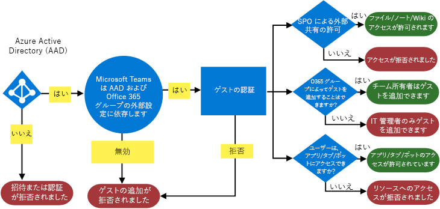
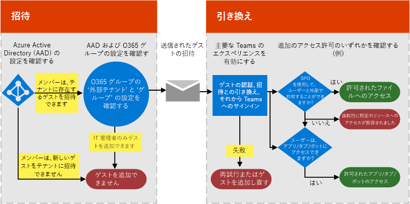
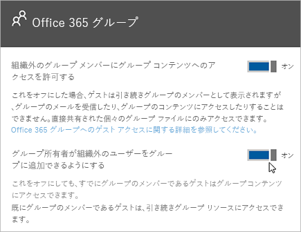

Microsoft Teams でのゲスト アクセスを承認する
===========================================

組織の要件を満たすために、Microsoft Teams のゲスト アクセス機能を 4 つの異なる承認レベルで管理することができます。 すべての承認レベルが Office 365 組織に適用されます。 それぞれの承認レベルによって、ゲストのエクスペリエンスが次の通り制御されます。

- **Azure Active Directory**: Microsoft Teams のゲスト アクセスは、Azure Active Directory ビジネス ツー ビジネス (B2B) プラットフォームに依存します。 この承認レベルは、ゲストのエクスペリエンスをディレクトリ、テナント、およびアプリケーション レベルで制御します。
- **Microsoft Teams**: Microsoft Teams のゲストエクスペリエンスのみを管理します。
- **Microsoft 365 グループ**: Microsoft 365 グループおよび Microsoft Teams でのゲスト エクスペリエンスを制御します。
- **SharePoint Online と OneDrive for Business**: SharePoint Online、OneDrive for Business、Microsoft 365 グループ、および Microsoft Teams でのゲスト エクスペリエンスを制御します。

これらの異なる承認レベルにより、組織におけるゲスト アクセスを柔軟にセットアップできるようになります。 たとえば、自分の Microsoft Teams でゲスト ユーザーを許可せず、組織全体では許可する場合、Microsoft Teams でゲスト アクセスをオフにするだけです。 別の例: Azure AD、Teams、Groups レベルでゲスト アクセスを有効にしつつ、1 つ以上の基準 (データ分類が社外秘に等しいなど) に一致する選択したチームに対するゲスト ユーザーの追加を無効にすることができます。 SharePoint Online と OneDrive for Business には、Microsoft 365 グループに依存しない独自のゲスト アクセス設定があります。

> [!NOTE]
> ゲストにも [Office 365](https://go.microsoft.com/fwlink/p/?linkid=282347) と [Azure Active Directory](https://go.microsoft.com/fwlink/p/?linkid=853019) のサービスの制限が適用されます。 

次の図では、Azure Active Directory、Microsoft Teams、および Office 365 との間でゲスト アクセスの承認の依存関係がどのように与えられているか、および組み合わされているかを示します。

次の図は、一般的なゲスト アクセスの招待と引き換えフローを通じて、ユーザーの作業環境がアクセス許可モデルとどのように連動するかを大まかに示しています。

ここで重要なことは、アプリ、ボット、コネクタが独自のアクセス許可のセットや、ユーザー アカウントに固有の同意が必要な可能性があることです。 それぞれに付与する必要があります。 同様に SharePoint は、特定のユーザー、ユーザーのグループ、またはサイト レベルであっても、外部共有の境界を追加することがあります。

上の 2 つの図は、[Visio](https://github.com/MicrosoftDocs/OfficeDocs-SkypeForBusiness/blob/live/Teams/media/teams_dependencies.vsdx?raw=true) でも同じように利用することができます。

## Azure Active Directory のゲスト アクセスを管理する

Azure AD を使用し、外部の共同作業者をゲストとして、どんな方法で、テナントに招待できるかどうかを決定します。 Azure B2B のゲスト アクセスの詳細については、「[Azure Active Directory B2B のゲスト ユーザー アクセスとは](https://docs.microsoft.com/azure/active-directory/b2b/what-is-b2b)」を参照してください。 Azure AD の役割に関する詳細については、「[Azure Active Directory テナントでパートナー組織からユーザーにアクセス許可を付与する](https://docs.microsoft.com/azure/active-directory/b2b/add-guest-to-role)」を参照してください。

招待の設定は、テナント レベルで適用され、ディレクトリ、テナント、アプリケーション レベルでゲストのエクスペリエンスを制御します。 Azure portal でこの設定を構成するには、**[Azure Active Directory]** > **[ユーザー]** > **[ユーザー設定]** の順に移動し、**[外部ユーザー]** で **[外部コラボレーションの設定を管理します]** を選択します。

Azure AD には、外部ユーザーを構成する次の設定があります。

- [**ゲスト ユーザーのアクセス権を制限**]: [**はい**] の場合、ゲストにはユーザー、グループ、その他のディレクトリ リソースの列挙などの特定のディレクトリのタスクに対するアクセス権はありません。 また、自分のディレクトリでの管理者の役割にゲストを割り当てることはできません。 [**いいえ**] の場合、自分のディレクトリで一般ユーザーが持っているアクセス権と同じアクセス権を、ゲスト ユーザーが持つことになります。
- [**管理者とゲスト招待元ロールのユーザーが招待可能**]: [**はい**] の場合、管理者およびゲスト招待元ロールのユーザーがテナントにゲストを招待することができます。 [**いいえ**] の場合、管理者およびユーザーはゲストをテナントに招待できません。
- [**メンバーが招待可能**]: ディレクトリの管理者以外のメンバーがゲストを招待できるようにするには、このポリシーを [**はい**] に設定します (推奨)。 管理者だけがゲストを追加できるようにする場合は、このポリシーを [**いいえ**] に設定します。 [**いいえ**] に設定すると、管理者以外の Teams 所有者のゲスト エクスペリエンスが制限され、管理者により AAD に追加されたゲストだけを Teams に追加できることに注意してください。
- [**ゲストが招待可能**]: [**はい**] の場合、自分のディレクトリ内のゲストは他のゲストを招待して、Azure AD によってセキュリティが確保された SharePoint サイトや Azure リソースなどでそれらのゲストと共同作業を行うことができます。 [**いいえ**] の場合、組織と共同作業を行う他のゲストをゲストが招待することはできません。
    > [!IMPORTANT]
    > 現在、Teams はゲスト招待者の役割をサポートしていないため、[**ゲストが招待できる**] を [**はい**] に設定しても、ゲストは Teams 内の他のゲストを招待できません。
 
ゲストを招待できるユーザーの管理方法の詳細については、「[Azure Active Directory B2B コラボレーションの招待の委任](https://docs.microsoft.com/azure/active-directory/b2b/delegate-invitations)」を参照してください。

> [!NOTE]
> どのドメインをゲストとしてテナントに招待できるかを管理することもできます。 詳細については、「[Microsoft 365 グループへのゲスト アクセスの許可/ブロック](https://docs.microsoft.com/exchange/recipients-in-exchange-online/manage-group-access-to-office-365-groups)」を参照してください。

ユーザー ゲスト アカウントを手動で Azure AD B2B に追加する必要はありません。ゲストを Teams に追加すると、アカウントは自動的にディレクトリに追加されます。

### ゲスト アクセスのライセンス
ゲスト アクセス ライセンスは、Azure AD ライセンスの一部です。 ゲスト アクセスは、Microsoft 365 Business Standard および Office 365 Enterprise のすべてのサブスクリプションに含まれています。 ライセンスに関する詳細については、[Azure Active Directory B2B コラボレーションのライセンスに関するガイダンス](https://docs.microsoft.com/azure/active-directory/b2b/licensing-guidance)をご覧ください。

> [!NOTE]
> Exchange Online プラン 2 などのスタンドアロン Office 365 サブスクリプションプランのみを持っている組織内のユーザーは、Teams によって組織に属しているものと見なされるため、その同じ組織へのゲストとして招待されることはできません。 これらのユーザーが Teams を使用する場合は、Microsoft 365 Business Standard、Office 365 Enterprise、または Office 365 Education サブスクリプションが割り当てられる必要があります。 

## Teams でのゲスト アクセスを管理する

Teams でのゲスト アクセスは、既定でオフになっています。 ゲスト アクセスをオンにするに場合は、「[Microsoft Teams へのゲスト アクセスをオンまたはオフにする](set-up-guests.md)」を参照してください。 

## Microsoft 365 グループでのゲスト アクセスを管理する

Microsoft 365 グループから、自分の組織内のすべての Microsoft 365 グループおよび Microsoft Teams のチームへのゲスト ユーザーおよびゲスト アクセスの追加を管理できます。

1. [https://portal.office.com/adminportal/home](https://portal.office.com/adminportal/home) で、グローバル管理者アカウントを使用してサインインします。

2. 左側で [**設定**] を選択し、[**Services &amp; add-ins (サービスとアドイン)**] を選択します。

3. **[Microsoft 365 グループ]** を選択します。

     
  
4. 組織外のチーム所有者やグループ所有者に Microsoft 365 へのアクセスを許可するか否かに応じて、[Microsoft 365 グループ] ページのトグルを **[オン]** または **[オフ]** にします。 [**グループ所有者に組織外のユーザーをグループに追加させる**] の横にあるトグルをクリックまたはタップして [**オン**] にします。 このトグルを **[オン]** にすると、グループおよびチームの所有者が組織外のユーザーを Microsoft 365 グループおよび Microsoft Teams に追加できるかどうかを制御するための別のオプションが表示されます。 グループおよびチームの所有者がゲスト ユーザーを追加できるようにする場合は、このトグルを**オン**に設定します。 
 
   

上記の設定は、テナント レベルで適用され、Microsoft 365 グループおよび Teams でのゲストのエクスペリエンスを制御します。

グループのゲスト アクセスの詳細については、「[ゲストを Microsoft 365 グループに追加する](https://support.office.com/article/Guest-access-in-Office-365-Groups-bfc7a840-868f-4fd6-a390-f347bf51aff6)」を参照してください。ゲスト アクセスの仕組み、ゲスト アクセスの管理方法、よくある質問への回答が記載されています。

## SharePoint Online と OneDrive for Business へのゲスト アクセスを管理する

Teams は、SharePoint Online と OneDrive for Business を利用して、チャネルとチャット会話のファイルやドキュメントを保管します。  

Teams のゲスト アクセスを完全に利用するには、Office 365 管理者は次の設定を構成する必要があります。

- SharePoint Online: **既存のゲスト**、**新規および既存のゲスト**、または **すべてのユーザー**を選択します。

    詳細については、「[外部共有をオンまたはオフにする](https://docs.microsoft.com/sharepoint/turn-external-sharing-on-or-off)」を参照してください。

- Microsoft 365 グループ: **[グループ所有者が組織外のユーザーをグループに追加できるようにする]** をオンにします。

    詳細については、上記の「[Microsoft 365 グループでのゲスト アクセスを管理する](#control-guest-access-in-microsoft-365-groups)」を参照してください。
  
上記の設定は、テナント レベルで適用され、SharePoint Online、OneDrive for Business、Microsoft 365 グループ、Teams でのゲストのエクスペリエンスを制御します。

Teams に接続されたチーム サイトの SharePoint Online の外部ユーザー設定を管理できます。 詳細については、「[SharePoint チーム サイト設定を管理する](https://support.office.com/article/Manage-your-SharePoint-team-site-settings-8376034d-d0c7-446e-9178-6ab51c58df42)」をご覧ください。

## 外部アクセス (フェデレーション) とゲスト アクセス

[!INCLUDE [guest-vs-external-access](includes/guest-vs-external-access.md)]

## 関連項目

- [Microsoft 365 ゲストの共有設定のリファレンス](https://docs.microsoft.com/Office365/Enterprise/microsoft-365-guest-settings)
