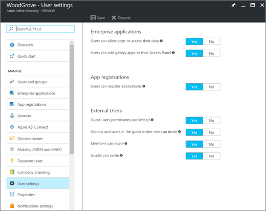

Microsoft Teams でのゲスト アクセスを承認する
===========================================

組織の要件を満たすために、Microsoft Teams のゲスト アクセス機能を 4 つの異なる承認レベルで管理することができます。 すべての承認レベルが Office 365 テナントに適用されます。 それぞれの承認レベルによって、ゲストのエクスペリエンスが次の通り制御されます。
- **Azure Active Directory**: Microsoft Teams のゲスト アクセスは、Azure Active Directory ビジネス ツー ビジネス (B2B) プラットフォームに依存します。 ゲストのエクスペリエンスをディレクトリ、テナント、およびアプリケーション レベルで制御します。 
- **Microsoft Teams**: Microsoft Teams のみを制御します。 
- **Office 365 グループ**: Office 365 グループおよび Microsoft Teams でのゲスト エクスペリエンスを制御します。
- **SharePoint Online と OneDrive for Business**: SharePoint Online、OneDrive for Business、Office 365 グループ、および Microsoft Teams でのゲスト エクスペリエンスを制御します。

これらの異なる承認レベルにより、組織におけるゲスト アクセスを柔軟にセットアップできるようになります。 たとえば、自分の Microsoft Teams の組織でゲスト ユーザーを許可したくない場合は、Microsoft Teams でゲスト アクセスをオフにするだけです。 別の例: AAD、Teams、Groups レベルでゲスト アクセスを有効にしつつ、1 つ以上の基準 (データ分類が社外秘に等しいなど) に一致する選択したチームに対するゲスト ユーザーの追加を無効にすることができます。 また、Office 365 グループを使用していないことも考えられます。 SharePoint Online と OneDrive for Business には、Office 365 グループに依存しない独自のゲスト アクセス設定があります。 

> [!NOTE]
> ゲストにも [Office 365](https://go.microsoft.com/fwlink/p/?linkid=282347) と [Azure Active Directory](https://go.microsoft.com/fwlink/p/?linkid=853019) のサービスの制限が適用されます。 

  次の図では、Azure Active Directory、Microsoft Teams、および Office 365 との間でゲスト アクセスの承認の依存関係がどのように与えられているか、および組み合わされているかを示します。

## Azure Active Directory

Azure AD ビジネス ツー ビジネス (B2B) コラボレーションでは、潜在的なゲスト ユーザーへの招待の送信はテナントの管理者に制限されません。 代わりに、ポリシーを使用して、招待を送信できる役割が設定されているユーザーに、招待状を送信する権限を委任します。

招待の設定は、テナント レベルで適用され、ディレクトリ、テナント、アプリケーション レベルでゲストのエクスペリエンスを制御します。 ゲストをサポートするために最低でも、**メンバーを招待**する必要がありますに設定する **[はい]**。

Azure AD には、外部のユーザーを構成するのには次の設定が含まれています。
- **ゲスト ユーザーのアクセス許可が制限されます**: **[はい]** [ゲストがディレクトリの特定のタスクのアクセス許可を持つ、ユーザー、グループ、またはその他のディレクトリ リソースを次のように列挙されていないことを意味します。 さらに、ゲストは、ディレクトリ内の管理役割に割り当てることができません。 ゲストは**** ことを意味では、通常のユーザーのディレクトリにあるディレクトリ データへのアクセスがありません。
- **管理者グループおよびゲストの招待者のロールにユーザーを招待できます**:**はい**できることを意味管理者グループおよびユーザーを「ゲスト招待者」の役割テナントには、ゲストを招待します。 **なし**には、管理者ことを意味し、ユーザーは、テナントには、ゲストを招待できません。
- **メンバーが招待することができます**:**はい**ディレクトリの管理者以外のメンバーが、Azure AD、SharePoint サイトまたは Azure のリソースなど、セキュリティで保護されたリソースに対する共同作業を行うには、ゲストを招待することを意味します。 ディレクトリにゲストは管理者のみが招待することができます**しない**ことを意味します。
- **ゲストが招待することができます**: **[はい]** をディレクトリ内には、ゲスト自身に招待できます、Azure AD、SharePoint サイトまたは Azure のリソースなど、セキュリティで保護されたリソースに対する共同作業を行うには、他のゲストを意味します。 ゲストは**ない**ことを意味は、組織との共同作業には、他のゲストを招待できません。
 

> [!NOTE]
> ゲストとして、テナントにどのドメインを招待することができますを管理することもできます。 [Office 365 のグループへのゲスト アクセスの許可/禁止](https://docs.microsoft.com/exchange/recipients-in-exchange-online/manage-group-access-to-office-365-groups)を参照してください。 

## Microsoft Teams
Microsoft Teams では、自分の組織においてゲストのエクスペリエンスを有効にするか無効にするかを制御できます。 この設定は既定で無効になっていて、Microsoft Teams のテナント レベルのみで適用されます。

Office 365 管理センターで Microsoft Teams ゲスト アクセスの設定を管理できます。 詳細については、「[Microsoft Teams へのゲスト アクセスをオンまたはオフにする](set-up-guests.md)」をご覧ください。 

## Office 365 グループ

Office 365 グループから、自分の組織内のすべての Office 365 グループおよび Microsoft Teams へのゲスト ユーザーおよびゲスト アクセスの追加を制御できます。

1. Office 365 のグローバル管理者アカウントを使用してサインイン[https://portal.office.com/adminportal/home](https://portal.office.com/adminportal/home)。
    
  
2. ナビゲーション メニューで [**設定**] を選択し、[**Services &amp; add-ins (サービスとアドイン)**] を選択します。
    
  
3. [**Office 365 グループ**] を選択します。
    
     
  

  

  
4. 組織外のチーム所有者やグループ所有者に Office 365 へのアクセスを許可するかどうかに応じて、[Office 365 グループ] ページのトグルを [**オン**] または [**オフ**] にします。 [**Let group owners add people outside the organization to groups (グループ所有者に組織外のユーザーをグループに追加させる)**] の横にあるトグルをクリックまたはタップして [**オン**] にします。 このトグルをオンにすると、グループおよびチームの所有者が組織外のユーザーを Office 365 グループおよび Microsoft Teams に追加できるかどうかを制御するための別のオプションが表示されます。 グループおよびチームの所有者がゲスト ユーザーを追加できるようにする場合は、このトグルをオンに設定します。 ![次のスクリーンショットは、組織外のグループ メンバーによるグループのコンテンツへのアクセス、グループ所有者による組織外のユーザーのグループへの追加のオプションをオンにした [Office 365 グループ] パネルを示しています。](media/eee77abd-4425-4585-91a8-5541c17ee7b2.png)

上記の設定は、テナント レベルで適用され、Office 365 グループおよび Microsoft Teams でのゲストのエクスペリエンスを制御します。

## SharePoint Online と OneDrive for Business

Teams は、SharePoint Online と OneDrive for Business を利用して、チャネルとチャット会話のファイルやドキュメントを保管します。  
  
    
    
Teams のゲスト アクセスの完全な操作性を有効にするため、Office 365 管理者は次の設定を**オン**にする必要があります。
  
    
    

- SharePoint Online: **Only allow sharing with external users already in the directory (ディレクトリに既に存在する外部ユーザーのみとの共有を許可する)**
    
    詳しくは、「[SharePoint Online 環境の外部共有を管理する](https://docs.microsoft.com/sharepoint/external-sharing-overview)」をご覧ください。
    
  
- Office 365 グループ: **Let group owners add people outside the organization to groups (グループ所有者に組織外のユーザーをグループに追加させる)**
    
    詳細については、「[Control guest access to Microsoft Teams (Microsoft Teams へのゲスト アクセスを制御する)](#controlguest)」をご覧ください。
  

上記の設定は、テナント レベルで適用され、SharePoint Online、OneDrive for Business、Office 365 グループおよび Microsoft Teams でのゲストのエクスペリエンスを制御します。

Teams で接続したチーム サイトの SharePoint Online 外部ユーザー設定を管理できます。 詳細については、「[SharePoint チーム サイト設定を管理する](https://support.office.com/article/Manage-your-SharePoint-team-site-settings-8376034d-d0c7-446e-9178-6ab51c58df42)」をご覧ください。
