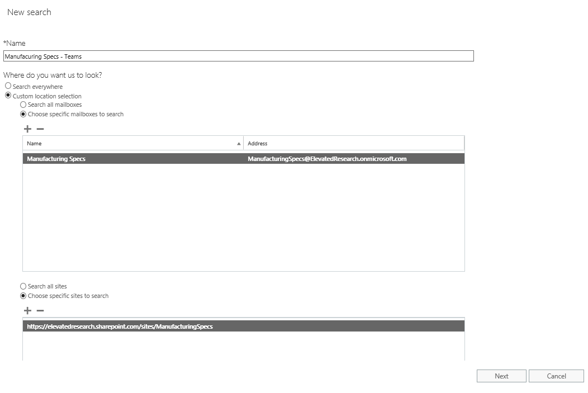
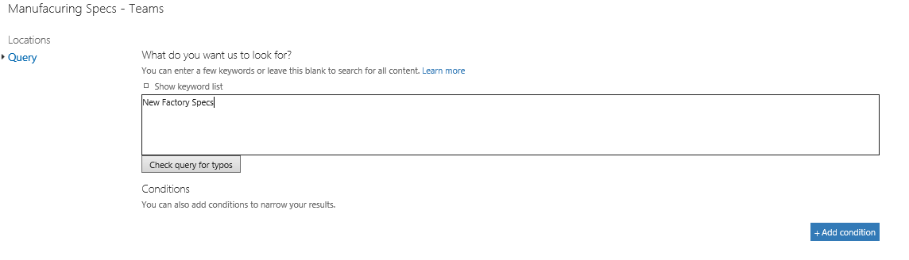

Microsoft Teams のコンテンツ検索を使用するUse Content Search in Microsoft Teams
=====================================

コンテンツ検索は、Exchange、SharePoint、OneDrive for Business を含む Microsoft Teams の情報について問い合わせを行うことのできる特別な検索手段です。Content Search provides an ad-hoc way to query Microsoft Teams information spanning Exchange, SharePoint and OneDrive for Business.

次の例では、新規の**コンテンツ検索**を作成し、Manufacturing Specs メールボックスと Manufacturing Specs SharePoint サイトを選択しています。この操作により、Exchange からのチャネル チャット、SharePoint からのファイル アップロードやファイルの修正、OneNote での変更を検索できます。In the example below, we created a new **Content Search**. Then, we selected the Manufacturing Specs mailbox and Manufacturing Specs SharePoint site. This allows us to search against Channel chats from Exchange, File uploads/modifications from SharePoint and OneNote changes as well.

**コンテンツ検索**にクエリ条件を追加して、検索結果を絞り込むこともできます。次の例では、Manufacturing Specs チームが「**New Factory Specs**」というキーワードが使われているコンテンツを見つけるために Exchange と SharePoint の場所を検索しています。You can also add query criteria to the **Content Search** to narrow down the results returned. For example, below we wanted to search both Exchange and SharePoint locations for the Manufacturing Specs team to look for content where the keywords “**New Factory Specs”** were used.

必要に応じて検索条件を追加した後に、そのレポートまたはデータをコンピューターにエクスポートして分析できます。コンテンツ検索について詳しくは、[このリンク](https://support.office.com/en-us/article/Run-a-Content-Search-in-the-Office-365-Security-Compliance-Center-61852fd9-fe8a-4880-a339-cb19ed3bff4a?ui=en-US&rs=en-US&ad=US&fromAR=1)にアクセスしてください。After adding search conditions should you choose to, you can then export a report or the data to your computer for analysis. For more information on how to use Content Search, review [this](https://support.office.com/en-us/article/Run-a-Content-Search-in-the-Office-365-Security-Compliance-Center-61852fd9-fe8a-4880-a339-cb19ed3bff4a?ui=en-US&rs=en-US&ad=US&fromAR=1) link.
