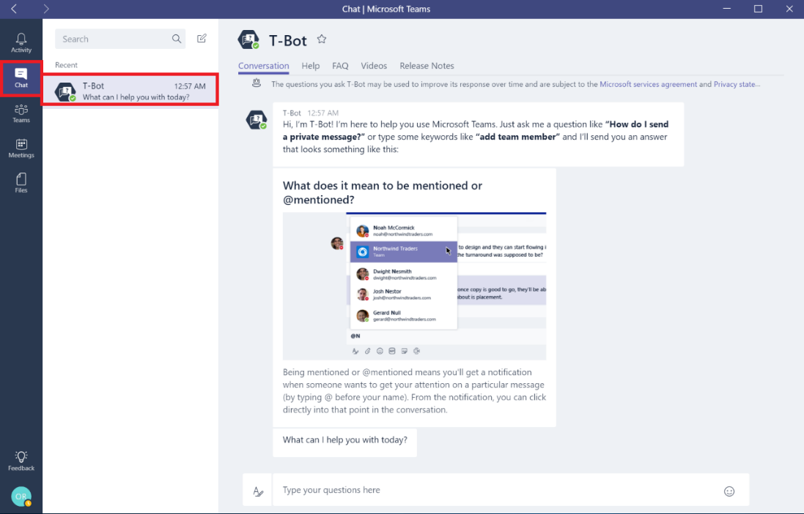
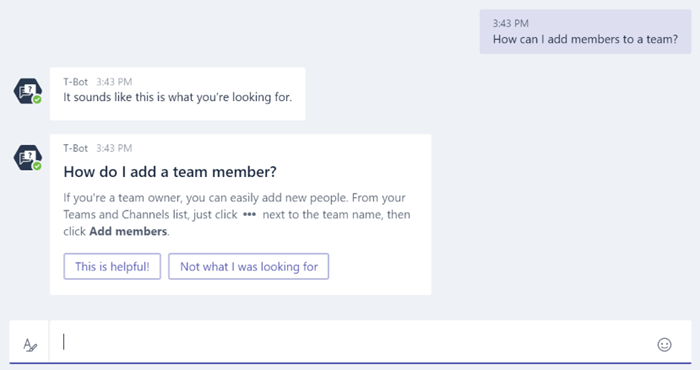
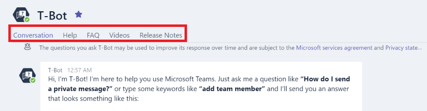
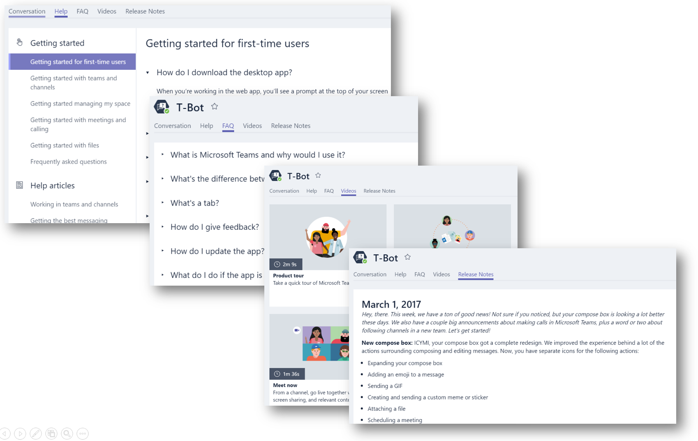

T-Bot を使用して Microsoft Teams のユーザーをサポートするUse T-Bot to help users with Microsoft Teams
============================================

ユーザーおよびチャンピオンは、Microsoft Teams の使用時のヘルプとして使用できる [T-Bot](https://support.office.com/en-us/article/Apps-and-services-cc1fba57-9900-4634-8306-2360a40c665b?ui=en-US&rs=en-US&ad=US#bkmk_bots) を熟知する必要があります。T-Bot は、Microsoft Teams の使用方法やその他の様々な質問に対する回答を得ることができる対話型のボットです。For help while using Microsoft Teams, ensure your users and champions get familiar with [T-Bot](https://support.office.com/en-us/article/Apps-and-services-cc1fba57-9900-4634-8306-2360a40c665b?ui=en-US&rs=en-US&ad=US#bkmk_bots). T-Bot is a bot which users can interact with to ask it questions about how to use Microsoft Teams and get answers to a wide range of questions.

Microsoft Teams では、ローカライズされた言語で T-Bot とヘルプ コンテンツが提供されています。新しい言語のサポートも随時追加されています。サポートされている言語の最新のリストについては、「[Microsoft Teams がサポートするヘルプ コンテンツの言語](https://support.office.com/en-us/article/Microsoft-Teams-supported-languages-for-help-content-9c71d10a-0c5c-49d4-b6d7-0c58cdfdf4cf)」をご覧ください。Microsoft Teams provides localized language support for T-Bot and help content. New languages are being added all the time. For the most current list of supported languages, see [Microsoft Teams supported languages for help content](https://support.office.com/en-us/article/Microsoft-Teams-supported-languages-for-help-content-9c71d10a-0c5c-49d4-b6d7-0c58cdfdf4cf).

ボットに質問するのではなくコンテンツを参照することを望むユーザーは、代替のアシスタンス方法として T-Bot を使用できます。T-Bot also provides alternative assistance methods for the users who will prefer browsing the content instead of asking questions to a bot.

ボット内のタブでは、ヘルプ、FAQ、ビデオ、リリース ノートのセクションが提供されています。Providing a full slate of Help, FAQ, Videos and Release Notes sections via the tabs within the bot.

